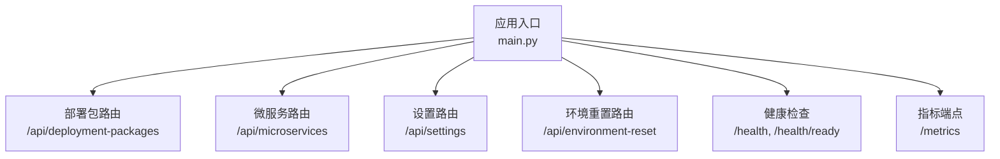
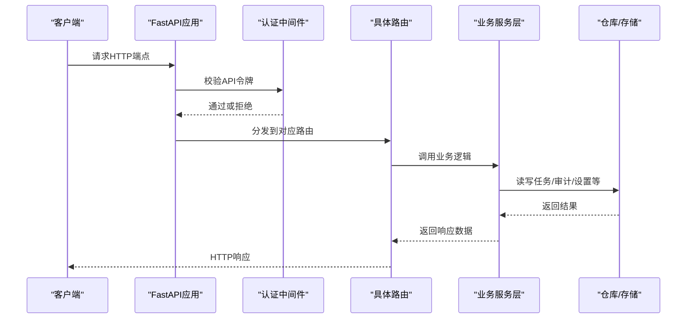
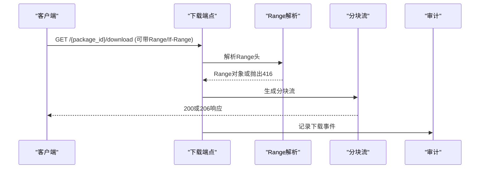
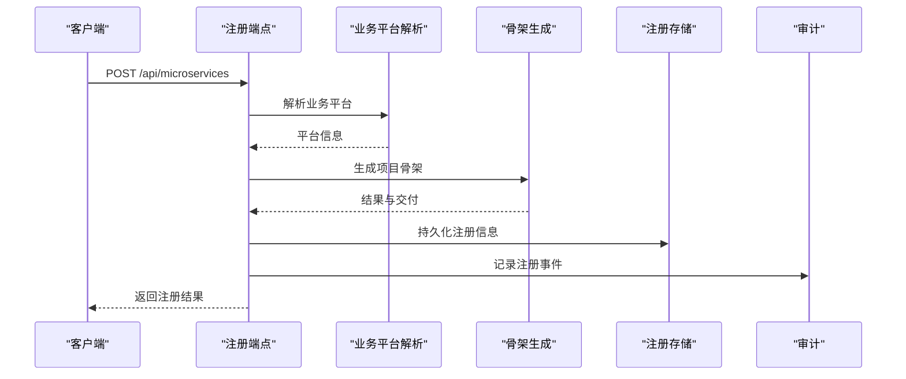
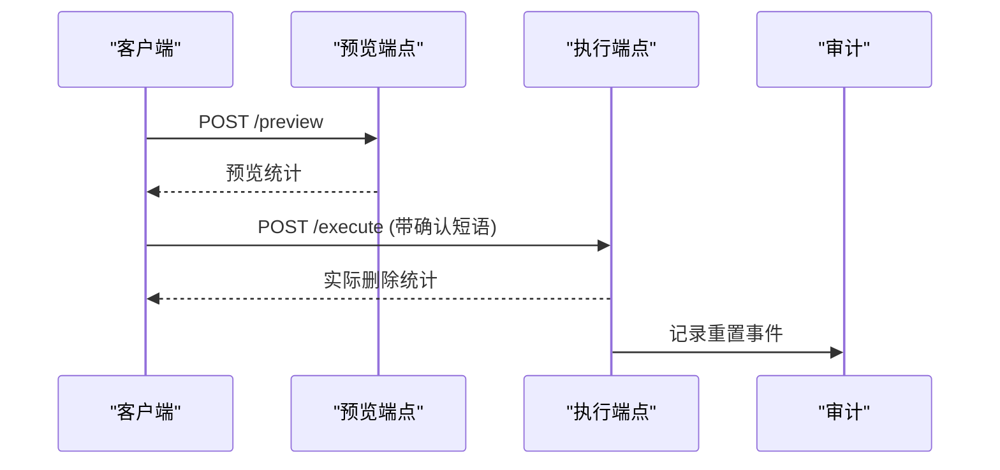
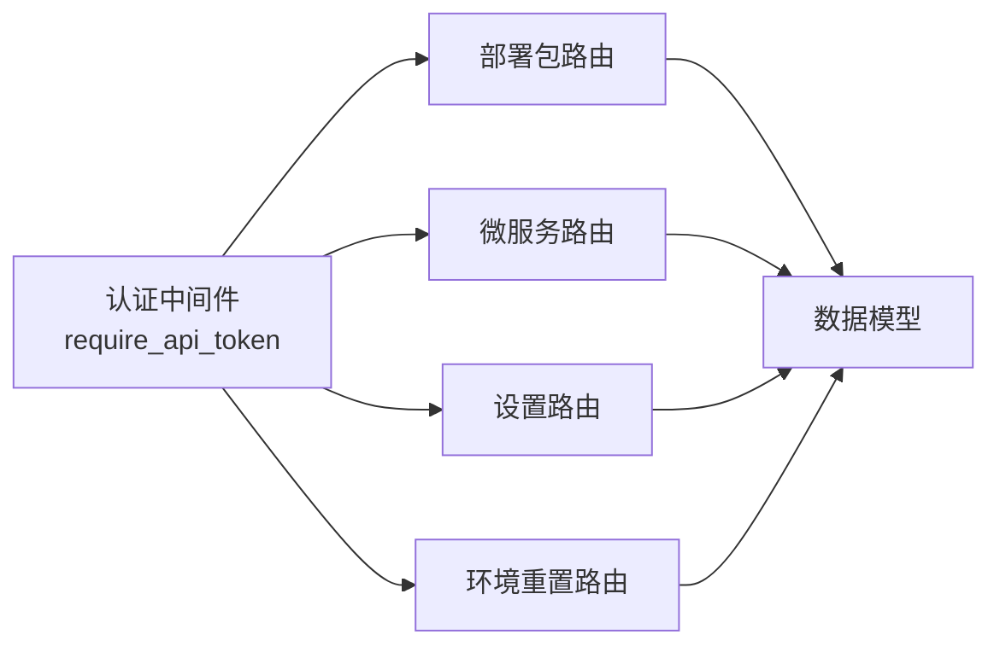

# API参考文档

<cite>
**本文档引用的文件**
- [backend/deployment_package_factory/main.py](file://backend/deployment_package_factory/main.py)
- [backend/deployment_package_factory/api/deployment_packages.py](file://backend/deployment_package_factory/api/deployment_packages.py)
- [backend/deployment_package_factory/api/microservices.py](file://backend/deployment_package_factory/api/microservices.py)
- [backend/deployment_package_factory/api/settings.py](file://backend/deployment_package_factory/api/settings.py)
- [backend/deployment_package_factory/api/environment_reset.py](file://backend/deployment_package_factory/api/environment_reset.py)
- [backend/deployment_package_factory/services/deployment_packages/models.py](file://backend/deployment_package_factory/services/deployment_packages/models.py)
- [backend/deployment_package_factory/auth.py](file://backend/deployment_package_factory/auth.py)
- [backend/tests/test_deployment_package_api.py](file://backend/tests/test_deployment_package_api.py)
- [backend/tests/test_environment_reset_api.py](file://backend/tests/test_environment_reset_api.py)
- [frontend/src/api/client.ts](file://frontend/src/api/client.ts)
- [frontend/src/api/deploymentPackages.ts](file://frontend/src/api/deploymentPackages.ts)
- [frontend/src/api/microservices.ts](file://frontend/src/api/microservices.ts)
</cite>

## 目录
1. [简介](#简介)
2. [项目结构](#项目结构)
3. [核心组件](#核心组件)
4. [架构总览](#架构总览)
5. [详细组件分析](#详细组件分析)
6. [依赖关系分析](#依赖关系分析)
7. [性能考虑](#性能考虑)
8. [故障排除指南](#故障排除指南)
9. [结论](#结论)
10. [附录](#附录)

## 简介
本文件为部署包工厂API接口的完整参考文档，覆盖以下模块的RESTful接口规范：
- 部署包API：创建、预览、查询、下载、清理与任务管理
- 微服务API：注册、模板获取、项目交付状态与下载
- 系统设置API：获取、更新、导入导出
- 环境重置API：预览、执行、审计

文档提供每个端点的HTTP方法、URL模式、请求参数、响应格式、认证机制、权限控制、请求限制、版本管理策略、使用场景、参数验证规则与最佳实践建议，并辅以序列图与流程图帮助理解。

## 项目结构
后端基于FastAPI构建，采用模块化路由组织：
- 根应用在主入口中注册各模块路由与健康检查、指标端点
- 各API模块按功能分组：部署包、微服务、设置、环境重置
- 认证中间件统一校验API令牌
- 前端通过TypeScript客户端封装请求与鉴权头

**图表来源**
- [backend/deployment_package_factory/main.py:23-64](file://backend/deployment_package_factory/main.py#L23-L64)

**章节来源**
- [backend/deployment_package_factory/main.py:1-68](file://backend/deployment_package_factory/main.py#L1-L68)

## 核心组件
- 应用与中间件
  - CORS允许跨域访问
  - 全局依赖require_api_token进行API令牌校验
- 路由与端点
  - 部署包：选项、预览、业务平台注册/禁用、镜像导出环境检查、创建、任务列表/详情、取消/重试、清理、查询、下载、校验和、下载脚本
  - 微服务：选项、注册、交付重试、状态查询、下载
  - 设置：获取、更新、导入环境配置
  - 环境重置：预览、执行、审计
- 认证与权限
  - 支持Header Authorization(Bearer)、自定义X-Deployment-Package-Token、查询参数deployment_package_token（仅限下载相关）
  - 当未配置令牌时，默认放行；配置后必须满足任一方式
- 错误处理
  - 统一返回HTTP异常，包含状态码与错误详情
  - 下载支持Range断点续传与If-Range条件判断

**章节来源**
- [backend/deployment_package_factory/api/deployment_packages.py:50-108](file://backend/deployment_package_factory/api/deployment_packages.py#L50-L108)
- [backend/deployment_package_factory/api/microservices.py:29-33](file://backend/deployment_package_factory/api/microservices.py#L29-L33)
- [backend/deployment_package_factory/api/settings.py:17-21](file://backend/deployment_package_factory/api/settings.py#L17-L21)
- [backend/deployment_package_factory/api/environment_reset.py:16-20](file://backend/deployment_package_factory/api/environment_reset.py#L16-L20)
- [backend/deployment_package_factory/auth.py:10-27](file://backend/deployment_package_factory/auth.py#L10-L27)

## 架构总览
下图展示API调用链路与数据流：

**图表来源**
- [backend/deployment_package_factory/main.py:23-64](file://backend/deployment_package_factory/main.py#L23-L64)
- [backend/deployment_package_factory/auth.py:10-27](file://backend/deployment_package_factory/auth.py#L10-L27)
- [backend/deployment_package_factory/api/deployment_packages.py:50-108](file://backend/deployment_package_factory/api/deployment_packages.py#L50-L108)

## 详细组件分析

### 部署包API
- 基础路径：/api/deployment-packages
- 认证：全局依赖require_api_token，支持Header Authorization、X-Deployment-Package-Token、查询参数deployment_package_token（仅下载相关）

1) 获取部署包选项
- 方法与路径：GET /api/deployment-packages/options
- 功能：返回可选的源环境、部署模式、平台/业务服务、数据库、中间件、微服务、项目等
- 响应：包含sourceEnvs、deployModes、platformServices、businessServices、databaseOptions、middleware、microservices、projects
- 使用场景：前端向导选择初始配置

2) 预览部署包
- 方法与路径：POST /api/deployment-packages/preview
- 请求体：PackagePreviewRequest（projectKey、productVersion、sourceEnv、deployModes、platformServices、businessServices、database、targetProfile）
- 响应：PackagePreview（含解析后的平台/业务服务、中间件、数据库、镜像清单、运行时配置、警告）
- 参数验证：校验数据库选项、运行时匹配、业务平台注册状态
- 使用场景：用户确认前的依赖解析与镜像预览

3) 注册业务平台
- 方法与路径：POST /api/deployment-packages/business-platforms/register
- 请求体：BusinessPlatformRegistrationRequest（sourceEnv、key、name、profile）
- 响应：BusinessPlatformRegistrationResult（包含命名空间与状态）
- 审计：记录business-platform.register事件
- 使用场景：将Kubernetes命名空间注册为业务平台

4) 禁用业务平台
- 方法与路径：POST /api/deployment-packages/business-platforms/{source_env}/{business_key}/disable
- 路径参数：source_env、business_key（支持profile查询参数）
- 响应：BusinessPlatformRegistrationResult
- 审计：记录business-platform.disable事件
- 使用场景：临时停用业务平台

5) 镜像导出环境检查
- 方法与路径：GET /api/deployment-packages/image-export-environment
- 响应：ImageExportEnvironmentCheck（可用性、工具版本、Docker版本、消息）
- 使用场景：检查镜像归档导出前置条件

6) 创建部署包
- 方法与路径：POST /api/deployment-packages
- 请求体：PackageBuildRequest（继承PackagePreviewRequest，新增imageMode、runtimeConfigOverrides）
- 行为：校验微服务交付状态、创建任务、记录audit事件
- 响应：PackageTask（任务ID、状态、进度、日志、结果等）
- 使用场景：触发打包任务

7) 查询任务列表
- 方法与路径：GET /api/deployment-packages/tasks?limit=...
- 响应：PackageTask数组
- 使用场景：后台任务监控

8) 查询单个任务
- 方法与路径：GET /api/deployment-packages/tasks/{task_id}
- 响应：PackageTask
- 使用场景：轮询任务状态

9) 取消任务
- 方法与路径：POST /api/deployment-packages/tasks/{task_id}/cancel
- 响应：PackageTask
- 使用场景：主动中止执行中的任务

10) 重试任务
- 方法与路径：POST /api/deployment-packages/tasks/{task_id}/retry
- 响应：新创建的PackageTask（重试任务）
- 使用场景：失败后自动或手动重试

11) 清理输出
- 方法与路径：POST /api/deployment-packages/cleanup?dry_run=...
- 请求体：空（查询参数dry_run）
- 响应：CleanupResult（扫描任务数、删除产物数、释放字节等）
- 审计：记录package.cleanup事件
- 使用场景：定期清理过期产物

12) 查询部署包
- 方法与路径：GET /api/deployment-packages/{package_id}
- 响应：PackageBuildResult（包含包ID、工作目录、制品路径、校验和路径、SHA256、清单等）
- 使用场景：获取已完成打包结果

13) 下载部署包
- 方法与路径：GET /api/deployment-packages/{package_id}/download
- 支持：Range断点续传、If-Range条件判断
- 响应：二进制流（gzip），带ETag、Last-Modified、Content-Range
- 审计：记录package.download事件
- 使用场景：下载打包产物

14) HEAD下载元信息
- 方法与路径：HEAD /api/deployment-packages/{package_id}/download
- 响应：仅头部（Accept-Ranges、Content-Length、ETag、Last-Modified）
- 使用场景：断点续传前探测

15) 下载校验和
- 方法与路径：GET /api/deployment-packages/{package_id}/checksum
- 响应：文本文件（SHA256），带X-Deployment-Package-Sha256头
- 审计：记录package.checksum.download事件
- 使用场景：校验下载完整性

16) 下载脚本（PowerShell/Shell）
- 方法与路径：GET /api/deployment-packages/{package_id}/download-script.ps1 或 .sh
- 查询参数：deployment_package_token（用于携带令牌）
- 响应：脚本文本（包含断点续传、重试、哈希校验逻辑）
- 使用场景：自动化下载与校验

17) 审计事件查询
- 方法与路径：GET /api/deployment-packages/audit-events?limit=&status=&action=&actionPrefix=
- 响应：AuditEvent数组
- 使用场景：审计追踪与问题排查

- 请求示例（创建部署包）
  - 方法：POST
  - 路径：/api/deployment-packages
  - 头部：Authorization: Bearer <token>
  - 请求体：{
    "sourceEnv": "test",
    "deployModes": ["k8s", "docker-compose"],
    "businessServices": [{"name": "eam", "profile": "4x60"}],
    "database": "postgres",
    "imageMode": "image-manifest"
  }

- 响应示例（任务创建）
  - 状态码：200
  - 响应体：{
    "taskId": "xxx",
    "status": "pending",
    "progress": 0,
    "logs": []
  }

- 错误码说明
  - 400：请求参数无效、数据库不支持、微服务交付未就绪、打包失败
  - 401：未提供或令牌不正确
  - 404：任务/制品不存在
  - 409：任务状态冲突（如已取消/失败）
  - 416：Range请求范围无效

- 参数验证规则
  - 必填字段：sourceEnv、businessServices、database
  - 数据库必须在允许列表内
  - 业务平台需已注册且非disabled
  - 微服务交付状态需为完成或忽略

- 最佳实践
  - 使用预览接口先解析依赖与镜像，再创建任务
  - 对大文件下载使用Range断点续传
  - 通过清理策略定期回收磁盘空间
  - 使用审计事件追踪操作者与元数据

**章节来源**
- [backend/deployment_package_factory/api/deployment_packages.py:110-492](file://backend/deployment_package_factory/api/deployment_packages.py#L110-L492)
- [backend/deployment_package_factory/services/deployment_packages/models.py:104-251](file://backend/deployment_package_factory/services/deployment_packages/models.py#L104-L251)
- [backend/tests/test_deployment_package_api.py:400-800](file://backend/tests/test_deployment_package_api.py#L400-L800)

#### 部署包下载流程（序列图）

**图表来源**
- [backend/deployment_package_factory/api/deployment_packages.py:392-431](file://backend/deployment_package_factory/api/deployment_packages.py#L392-L431)

### 微服务API
- 基础路径：/api/microservices
- 认证：全局依赖require_api_token

1) 获取微服务模板选项
- 方法与路径：GET /api/microservices/options
- 响应：MicroserviceScaffoldOptions（项目类型、技术栈、微前端框架、中间件）
- 使用场景：向导选择模板参数

2) 注册微服务（生成项目骨架）
- 方法与路径：POST /api/microservices
- 请求体：MicroserviceScaffoldRequest（包含业务平台键、技术栈、中间件、命名空间等）
- 行为：解析业务平台、合并系统默认值、生成项目骨架、准备交付、落库
- 响应：MicroserviceScaffoldResult（包含下载链接、命令、交付状态等）
- 使用场景：创建微服务项目并准备CI/CD

3) 列表查询
- 方法与路径：GET /api/microservices?source_env=&business_platform_key=&business_platform_profile=
- 响应：RegisteredMicroservice数组
- 使用场景：查看已注册微服务

4) 交付重试
- 方法与路径：POST /api/microservices/{project_id}/delivery/retry
- 响应：包含projectId、delivery、microservice
- 使用场景：修复交付失败后重试

5) 交付状态查询
- 方法与路径：GET /api/microservices/{project_id}/delivery/status
- 响应：包含projectId、delivery、microservice
- 使用场景：实时跟踪交付进度

6) 下载微服务骨架
- 方法与路径：GET /api/microservices/{project_id}/download
- 响应：压缩包文件
- 使用场景：本地下载骨架进行二次开发

- 请求示例（注册微服务）
  - 方法：POST
  - 路径：/api/microservices
  - 请求体：{
    "serviceKey": "asset-service",
    "serviceName": "资产服务",
    "techStack": "python-fastapi",
    "sourceEnv": "test",
    "businessPlatformKey": "eam",
    "businessPlatformProfile": "4x60"
  }

- 响应示例（注册结果）
  - 状态码：200
  - 响应体：{
    "projectId": "xxx",
    "artifactName": "...",
    "delivery": { "status": "preparing", "steps": [...] }
  }

- 错误码说明
  - 404：未找到注册记录
  - 409：业务平台状态冲突

- 参数验证规则
  - 业务平台必须存在且启用
  - 技术栈与中间件需在允许范围内
  - 系统默认值缺失时回退至配置中心

- 最佳实践
  - 先获取选项，再提交注册请求
  - 关注交付状态，必要时重试
  - 使用下载端点获取骨架进行二次开发

**章节来源**
- [backend/deployment_package_factory/api/microservices.py:47-211](file://backend/deployment_package_factory/api/microservices.py#L47-L211)
- [frontend/src/api/microservices.ts:128-168](file://frontend/src/api/microservices.ts#L128-L168)

#### 微服务注册流程（序列图）

**图表来源**
- [backend/deployment_package_factory/api/microservices.py:52-67](file://backend/deployment_package_factory/api/microservices.py#L52-L67)

### 系统设置API
- 基础路径：/api/settings
- 认证：全局依赖require_api_token

1) 获取系统设置
- 方法与路径：GET /api/settings
- 响应：SystemSettings（包含Git/Jenkins/Harbor/Middleware等配置）
- 使用场景：初始化前端配置

2) 更新系统设置
- 方法与路径：PUT /api/settings
- 请求体：SystemSettings
- 响应：更新后的SystemSettings
- 使用场景：动态调整系统行为

3) 导入环境配置
- 方法与路径：POST /api/settings/import-environment
- 请求体：multipart/form-data（Excel文件）
- 响应：EnvironmentSettingsImportResult（包含导入字段、警告）
- 使用场景：批量导入生产环境配置

- 请求示例（导入配置）
  - 方法：POST
  - 路径：/api/settings/import-environment
  - 内容类型：multipart/form-data
  - 文件字段：file（Excel）

- 响应示例（导入结果）
  - 状态码：200
  - 响应体：{
    "settings": { /* 新设置 */ },
    "importedFields": ["git.base_url", "jenkins.base_url"],
    "warnings": []
  }

- 错误码说明
  - 400：Excel格式或内容不符合要求
  - 500：内部处理异常

- 参数验证规则
  - Excel必须包含受支持的字段映射
  - 合并后写回数据库

- 最佳实践
  - 导入前备份当前设置
  - 关注warnings提示
  - 通过GET确认更新生效

**章节来源**
- [backend/deployment_package_factory/api/settings.py:42-69](file://backend/deployment_package_factory/api/settings.py#L42-L69)

### 环境重置API
- 基础路径：/api/environment-reset
- 认证：全局依赖require_api_token

1) 预览重置
- 方法与路径：POST /api/environment-reset/preview
- 请求体：EnvironmentResetOptions（可选）
- 响应：EnvironmentResetPreview（统计表格、路径、总计/选中行数与字节）
- 使用场景：确认清理范围

2) 执行重置
- 方法与路径：POST /api/environment-reset/execute
- 请求体：EnvironmentResetRequest（包含确认短语）
- 响应：EnvironmentResetPreview（实际删除结果）
- 审计：记录environment.reset事件
- 使用场景：清空数据库与文件系统

- 请求示例（执行重置）
  - 方法：POST
  - 路径：/api/environment-reset/execute
  - 请求体：{
    "confirmation": "RESET deployment-package-factory"
  }

- 响应示例（执行结果）
  - 状态码：200
  - 响应体：{
    "dryRun": false,
    "tables": [{ "name": "packageTasks", "deletedRows": 2 }],
    "deletedRows": 2
  }

- 错误码说明
  - 400：确认短语不匹配
  - 503：预览阶段环境不可用

- 参数验证规则
  - 确认短语必须完全一致
  - 预览阶段默认dryRun=true

- 最佳实践
  - 先预览，核对统计后再执行
  - 在维护窗口执行，避免影响生产
  - 记录审计事件用于合规追溯

**章节来源**
- [backend/deployment_package_factory/api/environment_reset.py:24-58](file://backend/deployment_package_factory/api/environment_reset.py#L24-L58)
- [backend/tests/test_environment_reset_api.py:30-97](file://backend/tests/test_environment_reset_api.py#L30-L97)

#### 环境重置流程（序列图）

**图表来源**
- [backend/deployment_package_factory/api/environment_reset.py:24-43](file://backend/deployment_package_factory/api/environment_reset.py#L24-L43)

## 依赖关系分析
- 认证依赖
  - require_api_token统一拦截，支持多种令牌传递方式
  - 下载相关端点允许查询参数令牌，其余JSON端点禁止
- 路由依赖
  - 各模块路由均依赖API令牌校验
  - 部署包路由还依赖业务平台与微服务仓库
- 数据模型
  - 所有请求/响应体基于Pydantic模型，确保类型安全与序列化一致性

**图表来源**
- [backend/deployment_package_factory/auth.py:10-27](file://backend/deployment_package_factory/auth.py#L10-L27)
- [backend/deployment_package_factory/api/deployment_packages.py:50-108](file://backend/deployment_package_factory/api/deployment_packages.py#L50-L108)
- [backend/deployment_package_factory/api/microservices.py:29-33](file://backend/deployment_package_factory/api/microservices.py#L29-L33)
- [backend/deployment_package_factory/api/settings.py:17-21](file://backend/deployment_package_factory/api/settings.py#L17-L21)
- [backend/deployment_package_factory/api/environment_reset.py:16-20](file://backend/deployment_package_factory/api/environment_reset.py#L16-L20)

**章节来源**
- [backend/deployment_package_factory/auth.py:10-41](file://backend/deployment_package_factory/auth.py#L10-L41)
- [backend/deployment_package_factory/services/deployment_packages/models.py:1-251](file://backend/deployment_package_factory/services/deployment_packages/models.py#L1-L251)

## 性能考虑
- 并发与后台执行
  - 任务执行模式可通过配置切换，支持后台模式延迟执行
  - 通过最大并发数与心跳机制控制资源占用
- 流式下载
  - 使用分块迭代器与Range支持，降低内存峰值
  - HEAD端点仅返回元数据，便于断点续传探测
- 缓存与预览
  - 预览接口提前解析依赖与镜像，减少实际构建失败概率
- 清理策略
  - 基于保留天数与总大小阈值的清理策略，避免磁盘膨胀

[本节为通用指导，无需特定文件引用]

## 故障排除指南
- 认证失败（401）
  - 确认是否配置了API令牌
  - 检查Header Authorization、X-Deployment-Package-Token或下载查询参数deployment_package_token
- 下载失败（416 Range）
  - 检查Range起止范围是否有效
  - 使用HEAD端点获取Content-Length与ETag
- 任务状态异常（409）
  - 查看任务历史状态，避免对终止/失败任务重复操作
- 微服务交付未就绪（400）
  - 等待交付完成或重试
  - 检查业务平台与命名空间状态
- 环境重置确认错误（400）
  - 确保确认短语完全一致

**章节来源**
- [backend/tests/test_deployment_package_api.py:464-496](file://backend/tests/test_deployment_package_api.py#L464-L496)
- [backend/tests/test_environment_reset_api.py:60-69](file://backend/tests/test_environment_reset_api.py#L60-L69)

## 结论
本文档提供了部署包工厂API的完整接口规范，涵盖部署包、微服务、系统设置与环境重置四大模块。通过统一的认证与审计机制、完善的错误处理与断点续传能力，确保在复杂生产环境中稳定可靠地交付与运维。建议在生产使用中结合预览与清理策略，配合审计事件进行合规与问题定位。

[本节为总结性内容，无需特定文件引用]

## 附录

### 认证与权限控制
- 令牌传递方式
  - Header Authorization: Bearer <token>
  - Header X-Deployment-Package-Token: <token>
  - 查询参数 deployment_package_token: <token>（仅下载相关端点）
- 令牌校验逻辑
  - 若未配置令牌则放行
  - 若配置令牌，则必须满足上述任一方式
- 操作员标识
  - 优先使用显式X-Deployment-Package-Operator头
  - 否则标记为api-token或anonymous

**章节来源**
- [backend/deployment_package_factory/auth.py:10-41](file://backend/deployment_package_factory/auth.py#L10-L41)
- [backend/deployment_package_factory/api/deployment_packages.py:599-658](file://backend/deployment_package_factory/api/deployment_packages.py#L599-L658)
- [backend/deployment_package_factory/api/environment_reset.py:46-74](file://backend/deployment_package_factory/api/environment_reset.py#L46-L74)

### 版本管理策略
- 应用版本：0.1.0
- 指标格式：text/plain; version=0.0.4; charset=utf-8
- 建议：通过版本号与指标格式区分不同版本的兼容性

**章节来源**
- [backend/deployment_package_factory/main.py:24-28](file://backend/deployment_package_factory/main.py#L24-L28)
- [backend/deployment_package_factory/main.py:57-62](file://backend/deployment_package_factory/main.py#L57-L62)

### 前端使用示例
- 客户端基础配置
  - 通过window.__DEPLOYMENT_PACKAGE_FACTORY_CONFIG__或VITE_*环境变量注入API基础地址与令牌
  - 自动附加Authorization头或在下载URL追加deployment_package_token查询参数
- 常用调用
  - 获取部署包选项、创建任务、下载制品、注册微服务、获取设置等

**章节来源**
- [frontend/src/api/client.ts:24-83](file://frontend/src/api/client.ts#L24-L83)
- [frontend/src/api/deploymentPackages.ts:306-390](file://frontend/src/api/deploymentPackages.ts#L306-L390)
- [frontend/src/api/microservices.ts:128-168](file://frontend/src/api/microservices.ts#L128-L168)