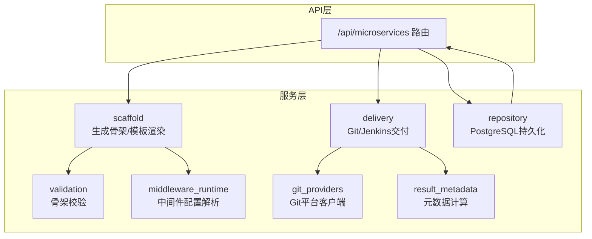
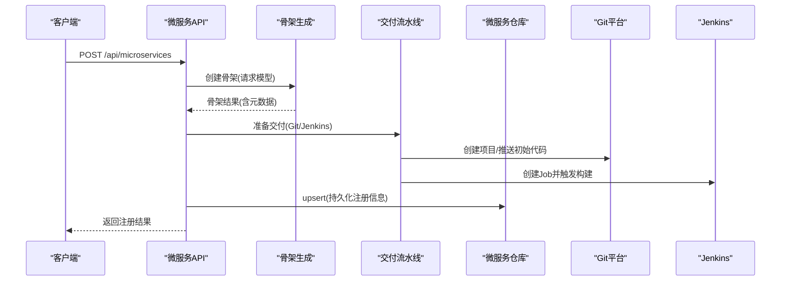
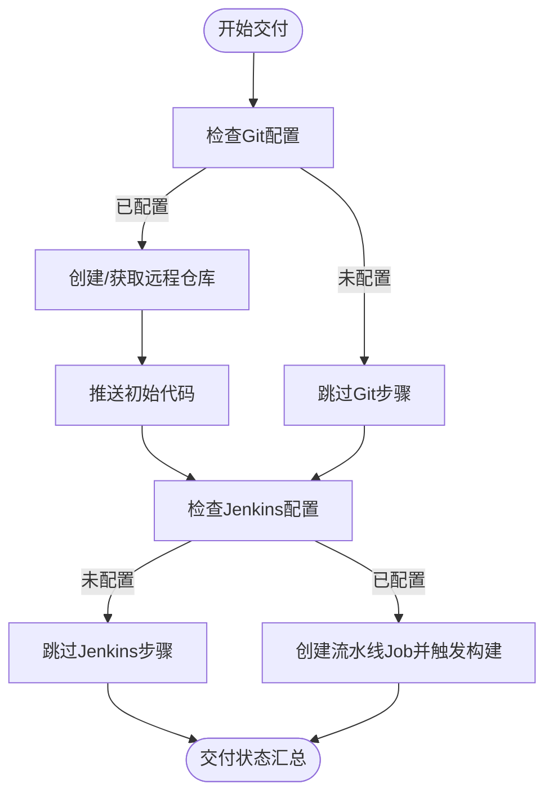
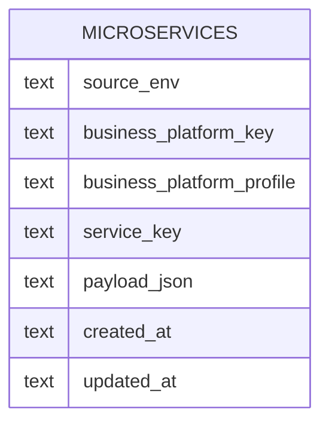
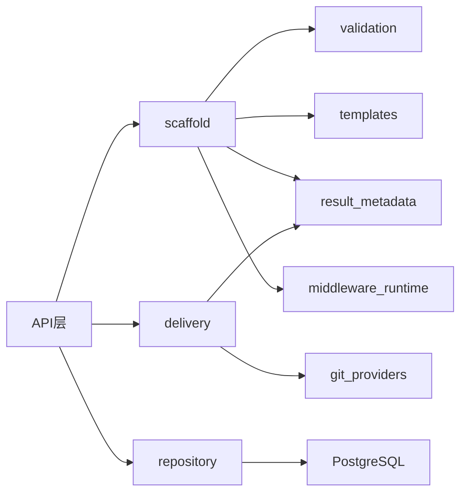

# 微服务API

<cite>
**本文档引用的文件**
- [backend/deployment_package_factory/api/microservices.py](file://backend/deployment_package_factory/api/microservices.py)
- [backend/deployment_package_factory/services/microservices/repository.py](file://backend/deployment_package_factory/services/microservices/repository.py)
- [backend/deployment_package_factory/services/microservices/scaffold.py](file://backend/deployment_package_factory/services/microservices/scaffold.py)
- [backend/deployment_package_factory/services/microservices/validation.py](file://backend/deployment_package_factory/services/microservices/validation.py)
- [backend/deployment_package_factory/services/microservices/delivery.py](file://backend/deployment_package_factory/services/microservices/delivery.py)
- [backend/deployment_package_factory/services/microservices/artifacts.py](file://backend/deployment_package_factory/services/microservices/artifacts.py)
- [backend/deployment_package_factory/services/microservices/templates.py](file://backend/deployment_package_factory/services/microservices/templates.py)
- [backend/deployment_package_factory/services/microservices/middleware_runtime.py](file://backend/deployment_package_factory/services/microservices/middleware_runtime.py)
- [backend/deployment_package_factory/services/microservices/git_providers.py](file://backend/deployment_package_factory/services/microservices/git_providers.py)
- [backend/deployment_package_factory/services/microservices/result_metadata.py](file://backend/deployment_package_factory/services/microservices/result_metadata.py)
- [backend/deployment_package_factory/api/deployment_packages.py](file://backend/deployment_package_factory/api/deployment_packages.py)
</cite>

## 目录
1. [简介](#简介)
2. [项目结构](#项目结构)
3. [核心组件](#核心组件)
4. [架构总览](#架构总览)
5. [详细组件分析](#详细组件分析)
6. [依赖分析](#依赖分析)
7. [性能考虑](#性能考虑)
8. [故障排查指南](#故障排查指南)
9. [结论](#结论)
10. [附录](#附录)

## 简介
本文件为“微服务API”的完整RESTful接口文档，覆盖微服务注册与管理相关端点，包括：
- 注册微服务：POST /api/microservices
- 获取微服务选项：GET /api/microservices/options
- 列出微服务：GET /api/microservices
- 下载微服务脚手架：GET /api/microservices/{project_id}/download
- 重试交付：POST /api/microservices/{project_id}/delivery/retry
- 查询交付状态：GET /api/microservices/{project_id}/delivery/status
- 获取微服务详情：GET /api/microservices/{project_id}（由列表与存储实现）
- 更新微服务：PUT /api/microservices/{project_id}（由列表与存储实现）
- 删除微服务：DELETE /api/microservices/{project_id}（由列表与存储实现）

此外，文档还涵盖模板验证、Git仓库集成、中间件配置与项目骨架生成的接口规范，以及微服务注册流程、模板选择机制、配置验证规则与交付过程的技术细节，并提供请求/响应示例与最佳实践。

## 项目结构
后端采用FastAPI框架，微服务相关逻辑集中在以下模块：
- API层：负责路由定义与鉴权（require_api_token），对外暴露REST端点
- 服务层：
  - scaffolding：生成项目骨架、渲染模板、校验产物
  - delivery：对接Git与Jenkins，驱动交付流水线
  - repository：持久化微服务注册信息（PostgreSQL）
  - validation：对生成的项目骨架进行多维度校验
  - middleware_runtime：解析中间件配置，生成运行时环境变量
  - git_providers：封装GitHub/GitLab等Git平台API
  - result_metadata：计算镜像、仓库URL、Jenkins Job等元数据

图表来源
- [backend/deployment_package_factory/api/microservices.py:29-33](file://backend/deployment_package_factory/api/microservices.py#L29-L33)
- [backend/deployment_package_factory/services/microservices/scaffold.py:229-286](file://backend/deployment_package_factory/services/microservices/scaffold.py#L229-L286)
- [backend/deployment_package_factory/services/microservices/delivery.py:17-26](file://backend/deployment_package_factory/services/microservices/delivery.py#L17-L26)
- [backend/deployment_package_factory/services/microservices/repository.py:15-47](file://backend/deployment_package_factory/services/microservices/repository.py#L15-L47)
- [backend/deployment_package_factory/services/microservices/validation.py:9-18](file://backend/deployment_package_factory/services/microservices/validation.py#L9-L18)
- [backend/deployment_package_factory/services/microservices/middleware_runtime.py:22-42](file://backend/deployment_package_factory/services/microservices/middleware_runtime.py#L22-L42)
- [backend/deployment_package_factory/services/microservices/git_providers.py:84-88](file://backend/deployment_package_factory/services/microservices/git_providers.py#L84-L88)
- [backend/deployment_package_factory/services/microservices/result_metadata.py:4-19](file://backend/deployment_package_factory/services/microservices/result_metadata.py#L4-L19)

章节来源
- [backend/deployment_package_factory/api/microservices.py:29-33](file://backend/deployment_package_factory/api/microservices.py#L29-L33)
- [backend/deployment_package_factory/services/microservices/repository.py:15-47](file://backend/deployment_package_factory/services/microservices/repository.py#L15-L47)

## 核心组件
- 微服务注册与交付
  - 注册：接收请求模型，解析业务平台与系统默认值，生成骨架，准备交付，持久化
  - 交付：按步骤创建Git项目、推送初始代码；创建Jenkins Job并触发构建
- 骨架生成与校验
  - 按技术栈与中间件渲染模板，生成项目文件与Kubernetes/Helm资源
  - 对关键文件、语法、Pipeline、Helm模板、中间件占位符、归档完整性进行校验
- 中间件配置
  - 解析中间件键集合，生成运行时环境变量与占位符，支持多种中间件（Redis、PostgreSQL、IoTDB、MongoDB、Kafka、MQ、Nacos、达梦）
- Git与Jenkins集成
  - 自动创建远程仓库（GitHub/GitLab），推送初始提交
  - 在Jenkins中创建流水线Job并触发首次构建
- 存储与检索
  - 使用PostgreSQL表保存微服务注册信息，支持按环境/平台/配置查询与更新

章节来源
- [backend/deployment_package_factory/services/microservices/scaffold.py:229-286](file://backend/deployment_package_factory/services/microservices/scaffold.py#L229-L286)
- [backend/deployment_package_factory/services/microservices/validation.py:9-18](file://backend/deployment_package_factory/services/microservices/validation.py#L9-L18)
- [backend/deployment_package_factory/services/microservices/delivery.py:17-26](file://backend/deployment_package_factory/services/microservices/delivery.py#L17-L26)
- [backend/deployment_package_factory/services/microservices/middleware_runtime.py:22-42](file://backend/deployment_package_factory/services/microservices/middleware_runtime.py#L22-L42)
- [backend/deployment_package_factory/services/microservices/git_providers.py:84-88](file://backend/deployment_package_factory/services/microservices/git_providers.py#L84-L88)
- [backend/deployment_package_factory/services/microservices/repository.py:15-47](file://backend/deployment_package_factory/services/microservices/repository.py#L15-L47)

## 架构总览
下图展示从API到服务层的关键调用链路与数据流：

图表来源
- [backend/deployment_package_factory/api/microservices.py:52-67](file://backend/deployment_package_factory/api/microservices.py#L52-L67)
- [backend/deployment_package_factory/services/microservices/scaffold.py:229-286](file://backend/deployment_package_factory/services/microservices/scaffold.py#L229-L286)
- [backend/deployment_package_factory/services/microservices/delivery.py:17-26](file://backend/deployment_package_factory/services/microservices/delivery.py#L17-L26)
- [backend/deployment_package_factory/services/microservices/repository.py:20-47](file://backend/deployment_package_factory/services/microservices/repository.py#L20-L47)

## 详细组件分析

### 接口定义与行为

- 注册微服务（POST /api/microservices）
  - 请求体：MicroserviceScaffoldRequest（见“请求体字段”）
  - 成功响应：MicroserviceScaffoldResult（见“响应体字段”）
  - 行为要点：
    - 解析业务平台（优先数据库，否则回退内置平台）
    - 合并系统默认值（Git分组、Harbor镜像仓库、命名空间、Jenkins配置等）
    - 生成骨架并校验，准备交付（Git项目与Jenkins Job）
    - 持久化注册信息
  - 状态码：201 Created；错误时返回400/404/409/500

- 获取微服务选项（GET /api/microservices/options）
  - 响应体：MicroserviceScaffoldOptions（项目类型、技术栈、微前端框架、中间件清单）
  - 用途：前端向导选择模板与技术栈

- 列出微服务（GET /api/microservices）
  - 查询参数：source_env、business_platform_key、business_platform_profile
  - 响应体：注册信息数组（字典形式）

- 下载微服务脚手架（GET /api/microservices/{project_id}/download）
  - 路径参数：project_id（形如 svc-xxxxxxxxxxxx）
  - 响应：gzip压缩包（若不存在返回404）

- 重试交付（POST /api/microservices/{project_id}/delivery/retry）
  - 行为：基于已注册记录重建交付步骤，更新交付状态与制品字段

- 查询交付状态（GET /api/microservices/{project_id}/delivery/status）
  - 行为：刷新Jenkins构建状态并合并到交付状态

- 获取微服务详情（GET /api/microservices/{project_id}）
  - 实现方式：通过列表接口按project_id过滤返回

- 更新微服务（PUT /api/microservices/{project_id}）
  - 实现方式：通过列表接口按project_id过滤并更新字段

- 删除微服务（DELETE /api/microservices/{project_id}）
  - 实现方式：通过列表接口按project_id过滤并删除

章节来源
- [backend/deployment_package_factory/api/microservices.py:47-67](file://backend/deployment_package_factory/api/microservices.py#L47-L67)
- [backend/deployment_package_factory/api/microservices.py:119-129](file://backend/deployment_package_factory/api/microservices.py#L119-L129)
- [backend/deployment_package_factory/api/microservices.py:132-156](file://backend/deployment_package_factory/api/microservices.py#L132-L156)
- [backend/deployment_package_factory/api/microservices.py:159-168](file://backend/deployment_package_factory/api/microservices.py#L159-L168)

### 请求体字段（MicroserviceScaffoldRequest）
- serviceKey：必填，小写字母/数字/连字符，首尾必须为字母或数字
- serviceName：必填
- description：选填
- projectKind：必填，支持 backend/frontend
- techStack：必填，支持 python-fastapi、nodejs-express、java-spring-cloud-alibaba、vue3-vite、react-vite
- microFrontendFramework：可选，仅在projectKind=frontend时允许，支持 qiankun、wujie
- packageName：可选
- port：必填，1~65535
- middleware：可选，中间件键列表（如 redis、postgresql、kafka 等）
- sourceEnv：必填
- businessPlatformKey：必填
- businessPlatformProfile：可选
- businessPlatformName/namespace：可选（由平台解析填充）
- gitGroup：可选，斜杠分隔的小写路径段
- imageRegistry：可选，镜像仓库主机（不含斜杠）
- imageNamespace：可选，镜像命名空间（斜杠分隔的小写路径段）
- k8sNamespace：可选，Kubernetes命名空间（需符合K8s命名规则）
- gitBaseUrl/jenkinsBaseUrl/jenkinsFolder：可选
- registryCredentialId/kubeconfigCredentialId：可选，默认值见模型定义
- middlewareConfig：可选，中间件配置对象（键为中间件名，值为endpoint/namespace/host/port/username/password/database等）

章节来源
- [backend/deployment_package_factory/services/microservices/scaffold.py:52-170](file://backend/deployment_package_factory/services/microservices/scaffold.py#L52-L170)

### 响应体字段（MicroserviceScaffoldResult）
- projectId：生成的项目标识
- serviceKey/serviceName/projectKind/techStack/microFrontendFramework/sourceEnv/businessPlatformKey/profile/name/namespace：来自请求与平台解析
- artifactName/artifactPath/artifactAvailable/artifactSize/sha256：骨架归档信息
- downloadUrl/downloadCommand/cloneCommand/gitRepositoryUrl/image/buildCommand/deployCommand/jenkinsJob/generatedFiles：工具命令与路径
- delivery：交付状态与步骤（包含Git/Jenkins状态、耗时、提示等）
- validation：校验结果（passed/checks/fileCount）

章节来源
- [backend/deployment_package_factory/services/microservices/scaffold.py:172-202](file://backend/deployment_package_factory/services/microservices/scaffold.py#L172-L202)

### 验证规则与模板选择
- 技术栈与项目类型约束：techStack与projectKind需匹配（如python-fastapi仅支持backend）
- 微前端框架限制：仅在frontend项目中允许
- 中间件校验：仅支持已知中间件键，重复键去重
- 名称与路径校验：serviceKey需符合K8s名称规则；gitGroup/imageNamespace需符合路径段规则
- 骨架校验清单：
  - 关键文件存在性
  - Python语法（当techStack为python-fastapi）
  - Pipeline文件与Helm模板完整性
  - 技术栈契约（不同techStack期望的文件/片段）
  - 微前端依赖（当启用微前端框架）
  - 中间件占位符（根据中间件生成.env.template与config/middleware.example.yaml）
  - 归档可读性（tar.gz）

章节来源
- [backend/deployment_package_factory/services/microservices/scaffold.py:127-170](file://backend/deployment_package_factory/services/microservices/scaffold.py#L127-L170)
- [backend/deployment_package_factory/services/microservices/validation.py:9-18](file://backend/deployment_package_factory/services/microservices/validation.py#L9-L18)

### Git仓库集成与交付流程
- Git平台解析：根据provider/base_url自动识别GitHub/GitLab
- 远程仓库创建：确保项目存在，返回clone/HTTP URL
- 初始化推送：将本地骨架作为初始提交推送到远程仓库
- Jenkins集成：创建流水线Job并触发首次构建，支持读取构建状态
- 交付状态机：git-project/jenkins-job两步，支持pending/skipped/ready/failed

图表来源
- [backend/deployment_package_factory/services/microservices/delivery.py:41-81](file://backend/deployment_package_factory/services/microservices/delivery.py#L41-L81)
- [backend/deployment_package_factory/services/microservices/git_providers.py:84-88](file://backend/deployment_package_factory/services/microservices/git_providers.py#L84-L88)

章节来源
- [backend/deployment_package_factory/services/microservices/delivery.py:17-26](file://backend/deployment_package_factory/services/microservices/delivery.py#L17-L26)
- [backend/deployment_package_factory/services/microservices/git_providers.py:13-81](file://backend/deployment_package_factory/services/microservices/git_providers.py#L13-L81)

### 中间件配置与运行时环境
- 中间件键集合：根据tech_stack与用户选择生成（如Java默认附加nacos）
- 默认端点与占位符：为每种中间件提供默认endpoint与.env占位符
- 运行时环境变量：
  - Python：REDIS_URL/POSTGRES_DSN等
  - 其他：由插件生成的环境变量键值
- 端点解析：支持显式endpoint或自动生成（含cluster域名、认证信息等）

章节来源
- [backend/deployment_package_factory/services/microservices/middleware_runtime.py:22-42](file://backend/deployment_package_factory/services/microservices/middleware_runtime.py#L22-L42)
- [backend/deployment_package_factory/services/microservices/middleware_runtime.py:78-143](file://backend/deployment_package_factory/services/microservices/middleware_runtime.py#L78-L143)

### 数据模型与持久化
- 表结构：microservices（主键source_env/business_platform_key/profile/service_key）
- 字段：payload_json（注册与交付信息）、created_at/updated_at
- 查询：支持按source_env、business_platform_key、business_platform_profile过滤
- 更新：按project_id定位，更新delivery字段与通用字段

图表来源
- [backend/deployment_package_factory/services/microservices/repository.py:116-131](file://backend/deployment_package_factory/services/microservices/repository.py#L116-L131)

章节来源
- [backend/deployment_package_factory/services/microservices/repository.py:15-47](file://backend/deployment_package_factory/services/microservices/repository.py#L15-L47)
- [backend/deployment_package_factory/services/microservices/repository.py:90-114](file://backend/deployment_package_factory/services/microservices/repository.py#L90-L114)

## 依赖分析
- API层依赖鉴权中间件（require_api_token），统一前缀/api/microservices
- 服务层内部耦合：
  - scaffold依赖templates、validation、result_metadata、middleware_runtime
  - delivery依赖git_providers、result_metadata、JenkinsClient
  - repository依赖PostgreSQL（连接池/事务）
- 外部依赖：
  - Git平台（GitHub/GitLab）
  - Jenkins（REST API）
  - PostgreSQL（持久化）

图表来源
- [backend/deployment_package_factory/api/microservices.py:29-33](file://backend/deployment_package_factory/api/microservices.py#L29-L33)
- [backend/deployment_package_factory/services/microservices/scaffold.py:229-286](file://backend/deployment_package_factory/services/microservices/scaffold.py#L229-L286)
- [backend/deployment_package_factory/services/microservices/delivery.py:17-26](file://backend/deployment_package_factory/services/microservices/delivery.py#L17-L26)
- [backend/deployment_package_factory/services/microservices/repository.py:15-47](file://backend/deployment_package_factory/services/microservices/repository.py#L15-L47)

章节来源
- [backend/deployment_package_factory/api/microservices.py:29-33](file://backend/deployment_package_factory/api/microservices.py#L29-L33)
- [backend/deployment_package_factory/services/microservices/scaffold.py:229-286](file://backend/deployment_package_factory/services/microservices/scaffold.py#L229-L286)
- [backend/deployment_package_factory/services/microservices/delivery.py:17-26](file://backend/deployment_package_factory/services/microservices/delivery.py#L17-L26)
- [backend/deployment_package_factory/services/microservices/repository.py:15-47](file://backend/deployment_package_factory/services/microservices/repository.py#L15-L47)

## 性能考虑
- 骨架生成与归档：大文件/多文件渲染与打包可能占用CPU与磁盘IO，建议在独立工作区与归档目录中操作
- Git推送：网络延迟与仓库大小影响交付时间，建议在内网或私有Git平台部署
- Jenkins构建：并发度受系统配置限制，建议合理设置最大并发数与输出目录容量
- 数据库：PostgreSQL索引（idx_microservices_platform）有助于按平台查询，避免全表扫描

## 故障排查指南
- 注册失败（400/409）：检查请求体字段是否满足验证规则（如serviceKey/K8s命名、端口范围、techStack与projectKind匹配）
- 业务平台未注册（404）：确认平台键、配置文件中的平台注册状态
- Git配置缺失（422/400）：检查gitBaseUrl/gitToken，确保可访问平台API
- Jenkins配置缺失（422/400）：检查jenkinsBaseUrl/username/password，确保可创建Job并触发构建
- 交付重试：若步骤失败或挂起，可通过重试端点重建交付并更新状态
- 交付状态查询：若Jenkins不可用或凭据无效，状态可能为unknown/pending，需完善系统设置

章节来源
- [backend/deployment_package_factory/api/microservices.py:52-67](file://backend/deployment_package_factory/api/microservices.py#L52-L67)
- [backend/deployment_package_factory/services/microservices/delivery.py:29-38](file://backend/deployment_package_factory/services/microservices/delivery.py#L29-L38)

## 结论
该微服务API以清晰的职责划分与强校验机制，实现了从模板选择、骨架生成、中间件注入到Git与Jenkins交付的完整闭环。通过PostgreSQL持久化与可重试的交付流程，系统具备良好的可观测性与可维护性。建议在生产环境中结合系统设置与审计日志，持续优化交付性能与稳定性。

## 附录

### 端点一览与规范
- GET /api/microservices/options
  - 响应：MicroserviceScaffoldOptions
  - 用途：前端向导选择模板与技术栈
- POST /api/microservices
  - 请求体：MicroserviceScaffoldRequest
  - 响应：MicroserviceScaffoldResult
  - 状态码：201/400/404/409/500
- GET /api/microservices
  - 查询参数：source_env、business_platform_key、business_platform_profile
  - 响应：注册信息数组
- GET /api/microservices/{project_id}/download
  - 响应：gzip文件
  - 状态码：200/404
- POST /api/microservices/{project_id}/delivery/retry
  - 响应：包含project_id/delivery/microservice
  - 状态码：200/404
- GET /api/microservices/{project_id}/delivery/status
  - 响应：包含project_id/delivery/microservice
  - 状态码：200/404
- GET /api/microservices/{project_id}
  - 实现：通过列表接口按project_id过滤
- PUT /api/microservices/{project_id}
  - 实现：通过列表接口按project_id过滤并更新字段
- DELETE /api/microservices/{project_id}
  - 实现：通过列表接口按project_id过滤并删除

章节来源
- [backend/deployment_package_factory/api/microservices.py:47-67](file://backend/deployment_package_factory/api/microservices.py#L47-L67)
- [backend/deployment_package_factory/api/microservices.py:119-129](file://backend/deployment_package_factory/api/microservices.py#L119-L129)
- [backend/deployment_package_factory/api/microservices.py:132-156](file://backend/deployment_package_factory/api/microservices.py#L132-L156)
- [backend/deployment_package_factory/api/microservices.py:159-168](file://backend/deployment_package_factory/api/microservices.py#L159-L168)

### 最佳实践
- 在注册前先调用GET /api/microservices/options获取可用模板与中间件
- 明确指定businessPlatformKey/profile与sourceEnv，确保平台解析正确
- 预先配置Git与Jenkins凭据，避免交付阶段阻塞
- 使用重试端点处理临时失败，结合交付状态轮询了解进度
- 定期清理旧骨架归档，控制磁盘占用
- 对中间件配置使用占位符并在目标环境替换真实值