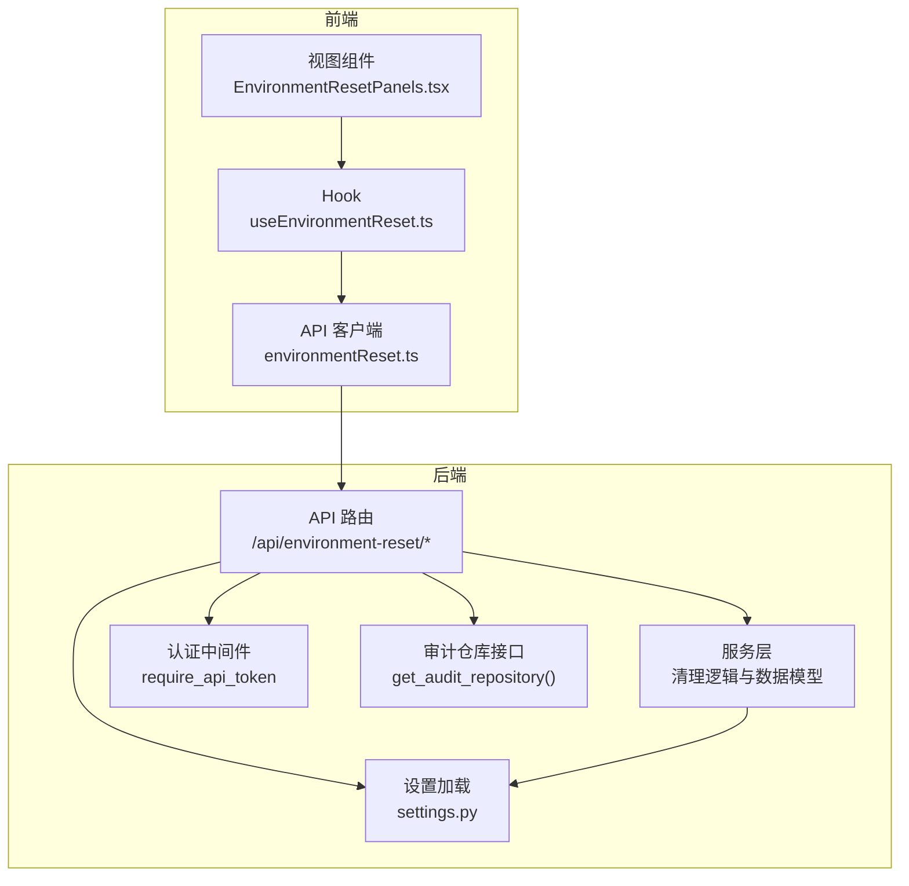
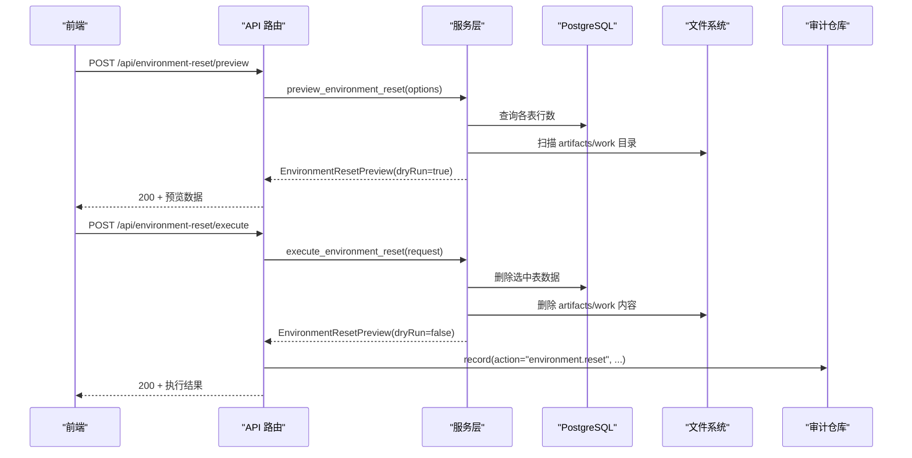
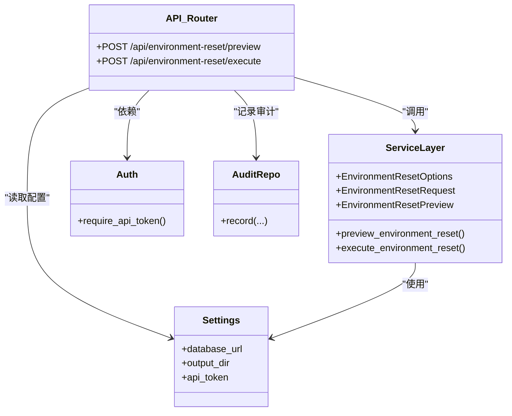

# 环境重置API

<cite>
**本文引用的文件列表**
- [environment_reset.py](file://backend/deployment_package_factory/api/environment_reset.py)
- [environment_reset.py](file://backend/deployment_package_factory/services/environment_reset.py)
- [settings.py](file://backend/deployment_package_factory/settings.py)
- [auth.py](file://backend/deployment_package_factory/auth.py)
- [deployment_packages.py](file://backend/deployment_package_factory/api/deployment_packages.py)
- [environmentReset.ts](file://frontend/src/api/environmentReset.ts)
- [EnvironmentResetPanels.tsx](file://frontend/src/views/components/EnvironmentResetPanels.tsx)
- [useEnvironmentReset.ts](file://frontend/src/views/hooks/useEnvironmentReset.ts)
- [test_environment_reset_api.py](file://backend/tests/test_environment_reset_api.py)
</cite>

## 目录
1. [简介](#简介)
2. [项目结构](#项目结构)
3. [核心组件](#核心组件)
4. [架构总览](#架构总览)
5. [详细组件分析](#详细组件分析)
6. [依赖关系分析](#依赖关系分析)
7. [性能考量](#性能考量)
8. [故障排查指南](#故障排查指南)
9. [结论](#结论)
10. [附录](#附录)

## 简介
本文件为“环境重置API”的完整技术文档，覆盖生产环境数据清理相关的REST端点，包括：
- 预览清理操作：POST /api/environment-reset/preview
- 执行清理操作：POST /api/environment-reset/execute
- 获取清理审计：GET /api/deployment-packages/audit-events（通过审计仓库）
- 清理统计：当前未提供独立端点，但可通过审计事件聚合实现

文档详细说明每个端点的HTTP方法、请求体格式、响应格式、状态码；阐述清理策略配置、预览机制、确认流程与审计日志记录；给出数据模型、清理范围定义与安全保护措施；并提供请求示例、响应示例、安全注意事项、备份要求、验证步骤与异常恢复机制。

## 项目结构
后端采用FastAPI框架，API路由位于后端模块，服务层负责清理逻辑与数据模型，前端提供交互界面与调用封装。

图表来源
- [environment_reset.py:16-21](file://backend/deployment_package_factory/api/environment_reset.py#L16-L21)
- [environment_reset.py:65-82](file://backend/deployment_package_factory/services/environment_reset.py#L65-L82)
- [settings.py:26-41](file://backend/deployment_package_factory/settings.py#L26-L41)
- [auth.py:10-27](file://backend/deployment_package_factory/auth.py#L10-L27)
- [deployment_packages.py:70-74](file://backend/deployment_package_factory/api/deployment_packages.py#L70-L74)
- [environmentReset.ts:60-72](file://frontend/src/api/environmentReset.ts#L60-L72)
- [EnvironmentResetPanels.tsx:34-51](file://frontend/src/views/components/EnvironmentResetPanels.tsx#L34-L51)
- [useEnvironmentReset.ts:32-49](file://frontend/src/views/hooks/useEnvironmentReset.ts#L32-L49)

章节来源
- [environment_reset.py:16-21](file://backend/deployment_package_factory/api/environment_reset.py#L16-L21)
- [environment_reset.py:65-82](file://backend/deployment_package_factory/services/environment_reset.py#L65-L82)
- [settings.py:26-41](file://backend/deployment_package_factory/settings.py#L26-L41)
- [auth.py:10-27](file://backend/deployment_package_factory/auth.py#L10-L27)
- [deployment_packages.py:70-74](file://backend/deployment_package_factory/api/deployment_packages.py#L70-L74)
- [environmentReset.ts:60-72](file://frontend/src/api/environmentReset.ts#L60-L72)
- [EnvironmentResetPanels.tsx:34-51](file://frontend/src/views/components/EnvironmentResetPanels.tsx#L34-L51)
- [useEnvironmentReset.ts:32-49](file://frontend/src/views/hooks/useEnvironmentReset.ts#L32-L49)

## 核心组件
- API路由与端点
  - 预览端点：POST /api/environment-reset/preview
  - 执行端点：POST /api/environment-reset/execute
- 服务层与数据模型
  - 清理选项：EnvironmentResetOptions
  - 请求体：EnvironmentResetRequest
  - 预览响应：EnvironmentResetPreview
  - 数据库表摘要：ResetTableSummary
  - 文件路径摘要：ResetPathSummary
- 认证与安全
  - API令牌校验中间件
  - X-Deployment-Package-Operator 头部可选操作员标识
- 审计与统计
  - 审计仓库接口用于记录清理事件
  - 审计事件查询端点：GET /api/deployment-packages/audit-events

章节来源
- [environment_reset.py:24-43](file://backend/deployment_package_factory/api/environment_reset.py#L24-L43)
- [environment_reset.py:22-82](file://backend/deployment_package_factory/services/environment_reset.py#L22-L82)
- [auth.py:10-27](file://backend/deployment_package_factory/auth.py#L10-L27)
- [deployment_packages.py:285-292](file://backend/deployment_package_factory/api/deployment_packages.py#L285-L292)

## 架构总览
环境重置API遵循“前端调用 → 后端路由 → 服务层处理 → 数据持久化/文件系统”的典型REST架构。认证中间件确保访问受控，审计仓库记录关键操作。

图表来源
- [environment_reset.py:24-43](file://backend/deployment_package_factory/api/environment_reset.py#L24-L43)
- [environment_reset.py:99-112](file://backend/deployment_package_factory/services/environment_reset.py#L99-L112)
- [deployment_packages.py:70-74](file://backend/deployment_package_factory/api/deployment_packages.py#L70-L74)

## 详细组件分析

### 预览端点：POST /api/environment-reset/preview
- 功能：返回清理范围内的数据库表行数与文件系统统计信息，不实际删除任何数据。
- 认证：需要API令牌。
- 请求体：EnvironmentResetOptions（JSON），字段含义见下节“数据模型”。
- 响应体：EnvironmentResetPreview（JSON），包含dryRun=true、各表与路径的统计信息。
- 状态码：
  - 200：成功
  - 503：运行时错误（如数据库连接问题）

请求示例
- 方法：POST
- 路径：/api/environment-reset/preview
- 请求头：Authorization: Bearer YOUR_TOKEN
- 请求体：{
  "packageTasks": true,
  "auditEvents": false,
  "businessPlatforms": true,
  "microservices": true,
  "packageArtifacts": true,
  "packageWorkDirs": true,
  "systemSettings": false
}

响应示例
- 状态：200
- 响应体：{
  "namespace": "deployment-package-factory",
  "confirmationPhrase": "RESET deployment-package-factory",
  "dryRun": true,
  "tables": [
    {"name": "packageTasks", "selected": true, "existingRows": 2, "deletedRows": 0},
    {"name": "auditEvents", "selected": false, "existingRows": 3, "deletedRows": 0}
  ],
  "paths": [
    {"name": "packageArtifacts", "path": "/data/deployment-packages/artifacts", "selected": true, "exists": true, "files": 4, "directories": 0, "bytes": 128, "deletedFiles": 0, "deletedDirectories": 0, "freedBytes": 0}
  ],
  "totalRows": 5,
  "selectedRows": 2,
  "deletedRows": 0,
  "totalFiles": 4,
  "selectedFiles": 4,
  "deletedFiles": 0,
  "totalBytes": 128,
  "selectedBytes": 128,
  "freedBytes": 0
}

章节来源
- [environment_reset.py:24-29](file://backend/deployment_package_factory/api/environment_reset.py#L24-L29)
- [environmentReset.ts:60-65](file://frontend/src/api/environmentReset.ts#L60-L65)
- [test_environment_reset_api.py:30-58](file://backend/tests/test_environment_reset_api.py#L30-L58)

### 执行端点：POST /api/environment-reset/execute
- 功能：根据请求体中的清理选项与确认短语，实际删除数据库表数据与文件系统内容。
- 认证：需要API令牌。
- 请求头：
  - Authorization: Bearer YOUR_TOKEN
  - X-Deployment-Package-Operator: 可选，标识操作员名称
- 请求体：EnvironmentResetRequest（JSON），包含options与confirmation。
- 响应体：EnvironmentResetPreview（JSON），dryRun=false，包含实际删除数量与释放空间。
- 状态码：
  - 200：成功
  - 400：确认短语不匹配或参数错误
  - 401：未授权（令牌无效）
  - 500：内部错误（服务层抛出异常）

请求示例
- 方法：POST
- 路径：/api/environment-reset/execute
- 请求头：Authorization: Bearer YOUR_TOKEN
- 请求体：{
  "options": {
    "packageTasks": true,
    "auditEvents": true,
    "businessPlatforms": true,
    "microservices": true,
    "packageArtifacts": true,
    "packageWorkDirs": true,
    "systemSettings": false
  },
  "confirmation": "RESET deployment-package-factory"
}

响应示例
- 状态：200
- 响应体：{
  "namespace": "deployment-package-factory",
  "confirmationPhrase": "RESET deployment-package-factory",
  "dryRun": false,
  "tables": [
    {"name": "packageTasks", "selected": true, "existingRows": 2, "deletedRows": 2},
    {"name": "auditEvents", "selected": true, "existingRows": 3, "deletedRows": 3}
  ],
  "paths": [
    {"name": "packageArtifacts", "path": "/data/deployment-packages/artifacts", "selected": true, "exists": true, "files": 4, "directories": 0, "bytes": 128, "deletedFiles": 4, "deletedDirectories": 0, "freedBytes": 128}
  ],
  "totalRows": 5,
  "selectedRows": 5,
  "deletedRows": 5,
  "totalFiles": 4,
  "selectedFiles": 4,
  "deletedFiles": 4,
  "totalBytes": 128,
  "selectedBytes": 128,
  "freedBytes": 128
}

章节来源
- [environment_reset.py:32-43](file://backend/deployment_package_factory/api/environment_reset.py#L32-L43)
- [environmentReset.ts:67-72](file://frontend/src/api/environmentReset.ts#L67-L72)
- [test_environment_reset_api.py:60-96](file://backend/tests/test_environment_reset_api.py#L60-L96)

### 审计端点：GET /api/deployment-packages/audit-events
- 功能：列出审计事件，可用于查看环境重置的审计记录。
- 认证：需要API令牌。
- 查询参数：
  - limit：限制返回条数，默认100
  - status：按状态过滤
  - action：按动作精确过滤
  - actionPrefix：按动作前缀过滤（别名：actionPrefix）
- 响应体：数组，元素为审计事件对象（包含action、status、targetId、operator、clientIp、message、metadata等）。

请求示例
- 方法：GET
- 路径：/api/deployment-packages/audit-events
- 查询参数：limit=100&status=completed&action=environment.reset

响应示例
- 状态：200
- 响应体：[
  {
    "action": "environment.reset",
    "status": "completed",
    "targetId": "deployment-package-factory",
    "operator": "ops",
    "clientIp": "127.0.0.1",
    "message": "Deployment package factory environment reset completed.",
    "metadata": { /* 预览结果JSON */ }
  }
]

章节来源
- [deployment_packages.py:285-292](file://backend/deployment_package_factory/api/deployment_packages.py#L285-L292)
- [environment_reset.py:46-58](file://backend/deployment_package_factory/api/environment_reset.py#L46-L58)
- [test_environment_reset_api.py:72-96](file://backend/tests/test_environment_reset_api.py#L72-L96)

### 数据模型与清理范围
- 清理选项 EnvironmentResetOptions
  - packageTasks: 是否清理导包任务
  - auditEvents: 是否清理审计事件
  - businessPlatforms: 是否清理业务平台注册
  - microservices: 是否清理微服务注册
  - packageArtifacts: 是否清理部署包产物（artifacts）
  - packageWorkDirs: 是否清理工作目录（work）
  - systemSettings: 是否清理系统设置（默认false）
- 请求体 EnvironmentResetRequest
  - options: EnvironmentResetOptions
  - confirmation: 必须与固定确认短语完全一致
- 预览响应 EnvironmentResetPreview
  - namespace: 默认命名空间
  - confirmationPhrase: 固定确认短语
  - dryRun: 预览为true，执行为false
  - tables: ResetTableSummary[]
  - paths: ResetPathSummary[]
  - 总量统计：totalRows/selectedRows/deletedRows、totalFiles/selectedFiles/deletedFiles、totalBytes/selectedBytes/freedBytes
- 数据库表映射（仅在存在时清理）
  - package_tasks → packageTasks
  - audit_events → auditEvents
  - business_platforms → businessPlatforms
  - microservices → microservices
  - system_settings → systemSettings
- 文件系统路径
  - artifacts：部署包产物目录
  - work：工作目录

章节来源
- [environment_reset.py:22-82](file://backend/deployment_package_factory/services/environment_reset.py#L22-L82)
- [environment_reset.py:13-19](file://backend/deployment_package_factory/services/environment_reset.py#L13-L19)
- [environmentReset.ts:3-48](file://frontend/src/api/environmentReset.ts#L3-L48)

### 预览机制与确认流程
- 预览流程：服务层扫描数据库表与文件系统，汇总统计信息，返回dryRun=true的预览结果。
- 确认流程：执行端点要求请求体中的confirmation与固定短语完全一致，否则返回400。
- 前端交互：前端提供复选框选择清理范围，显示预览摘要，用户输入确认短语后弹窗确认执行。

章节来源
- [environment_reset.py:99-112](file://backend/deployment_package_factory/services/environment_reset.py#L99-L112)
- [environmentReset.ts:60-72](file://frontend/src/api/environmentReset.ts#L60-L72)
- [EnvironmentResetPanels.tsx:34-51](file://frontend/src/views/components/EnvironmentResetPanels.tsx#L34-L51)
- [useEnvironmentReset.ts:32-49](file://frontend/src/views/hooks/useEnvironmentReset.ts#L32-L49)

### 审计日志记录
- 记录动作：environment.reset
- 记录状态：completed
- 关键元数据：targetId（命名空间）、operator（操作员）、clientIp、message、metadata（预览结果）
- 审计仓库接口：通过get_audit_repository()获取并调用record()

章节来源
- [environment_reset.py:46-58](file://backend/deployment_package_factory/api/environment_reset.py#L46-L58)
- [deployment_packages.py:70-74](file://backend/deployment_package_factory/api/deployment_packages.py#L70-L74)

## 依赖关系分析

图表来源
- [environment_reset.py:16-21](file://backend/deployment_package_factory/api/environment_reset.py#L16-L21)
- [environment_reset.py:99-112](file://backend/deployment_package_factory/services/environment_reset.py#L99-L112)
- [settings.py:26-41](file://backend/deployment_package_factory/settings.py#L26-L41)
- [auth.py:10-27](file://backend/deployment_package_factory/auth.py#L10-L27)
- [deployment_packages.py:70-74](file://backend/deployment_package_factory/api/deployment_packages.py#L70-L74)

章节来源
- [environment_reset.py:16-21](file://backend/deployment_package_factory/api/environment_reset.py#L16-L21)
- [environment_reset.py:99-112](file://backend/deployment_package_factory/services/environment_reset.py#L99-L112)
- [settings.py:26-41](file://backend/deployment_package_factory/settings.py#L26-L41)
- [auth.py:10-27](file://backend/deployment_package_factory/auth.py#L10-L27)
- [deployment_packages.py:70-74](file://backend/deployment_package_factory/api/deployment_packages.py#L70-L74)

## 性能考量
- 预览阶段仅进行统计扫描，避免大事务与磁盘写入，适合高频调用。
- 执行阶段涉及数据库批量删除与文件系统遍历，建议在低峰期执行。
- 文件系统扫描采用递归遍历，对大目录可能产生较高I/O开销；建议合理规划artifacts/work目录规模。
- 审计记录为异步写入，不影响主流程性能。

## 故障排查指南
- 401 未授权
  - 检查Authorization头或X-Deployment-Package-Token是否正确传递，且与设置中的api_token一致。
- 400 参数错误
  - 确认EnvironmentResetRequest的confirmation与固定短语完全一致。
- 503 运行时错误
  - 数据库连接失败或输出目录不可用，检查DEPLOYMENT_PACKAGE_DATABASE_URL与DEPLOYMENT_PACKAGE_OUTPUT_DIR。
- 审计未记录
  - 确认DEPLOYMENT_PACKAGE_DATABASE_URL有效，审计仓库初始化正常。

章节来源
- [auth.py:22-26](file://backend/deployment_package_factory/auth.py#L22-L26)
- [environment_reset.py:28-42](file://backend/deployment_package_factory/api/environment_reset.py#L28-L42)
- [settings.py:29-33](file://backend/deployment_package_factory/settings.py#L29-L33)
- [deployment_packages.py:70-74](file://backend/deployment_package_factory/api/deployment_packages.py#L70-L74)

## 结论
环境重置API提供了安全可控的生产环境数据清理能力：通过预览端点评估影响面，通过严格的确认机制防止误操作，并通过审计仓库记录关键事件。配合前端交互组件，用户可以直观地选择清理范围并跟踪清理结果。

## 附录

### 请求与响应示例（参考）
- 预览请求
  - 方法：POST
  - 路径：/api/environment-reset/preview
  - 请求头：Authorization: Bearer YOUR_TOKEN
  - 请求体：EnvironmentResetOptions
  - 响应体：EnvironmentResetPreview（dryRun=true）
- 执行请求
  - 方法：POST
  - 路径：/api/environment-reset/execute
  - 请求头：Authorization: Bearer YOUR_TOKEN, X-Deployment-Package-Operator: ops
  - 请求体：{
    "options": EnvironmentResetOptions,
    "confirmation": "RESET deployment-package-factory"
  }
  - 响应体：EnvironmentResetPreview（dryRun=false）
- 审计查询
  - 方法：GET
  - 路径：/api/deployment-packages/audit-events
  - 查询参数：limit=100&status=completed&action=environment.reset

章节来源
- [environmentReset.ts:60-72](file://frontend/src/api/environmentReset.ts#L60-L72)
- [test_environment_reset_api.py:30-96](file://backend/tests/test_environment_reset_api.py#L30-L96)

### 安全保护措施
- 强制API令牌认证，支持Header Authorization与自定义头X-Deployment-Package-Token。
- 执行端点要求确认短语，防止误触发。
- 审计记录包含操作员与客户端IP，便于追溯。
- 文件系统清理严格限定在输出目录内，拒绝越权路径。

章节来源
- [auth.py:10-27](file://backend/deployment_package_factory/auth.py#L10-L27)
- [environment_reset.py:32-43](file://backend/deployment_package_factory/api/environment_reset.py#L32-L43)
- [environment_reset.py:158-189](file://backend/deployment_package_factory/services/environment_reset.py#L158-L189)
- [environment_reset.py:264-266](file://backend/deployment_package_factory/services/environment_reset.py#L264-L266)

### 清理前备份与清理后验证
- 备份要求
  - 在执行清理前，建议对PostgreSQL数据库与artifacts/work目录进行备份。
  - 对于systemSettings的清理，需特别谨慎，建议提前导出相关配置。
- 验证步骤
  - 使用预览端点确认将要删除的数据量与空间。
  - 执行后再次调用预览端点，确认目标范围已清空。
  - 通过审计端点核对清理事件与操作员信息。
- 异常恢复
  - 若清理过程中出现数据库异常，回滚事务以保持一致性。
  - 若文件系统删除失败，保留现有状态并修复权限或磁盘空间后再试。

章节来源
- [environment_reset.py:207-222](file://backend/deployment_package_factory/services/environment_reset.py#L207-L222)
- [environment_reset.py:158-189](file://backend/deployment_package_factory/services/environment_reset.py#L158-L189)