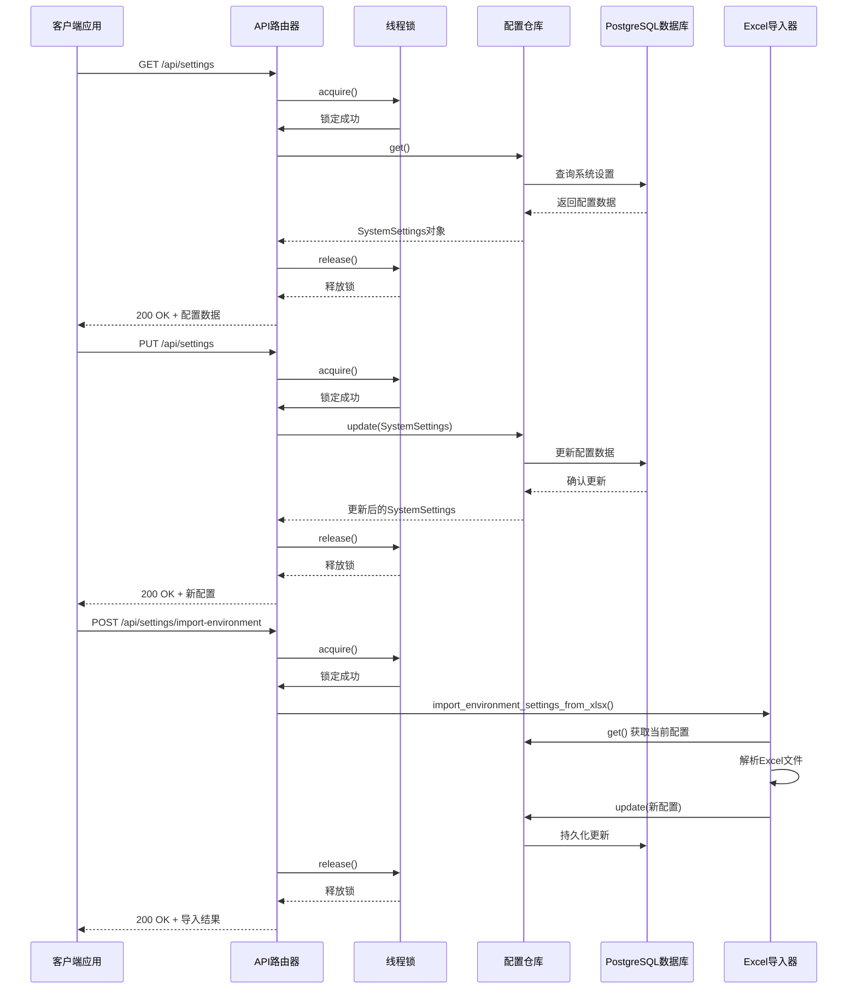
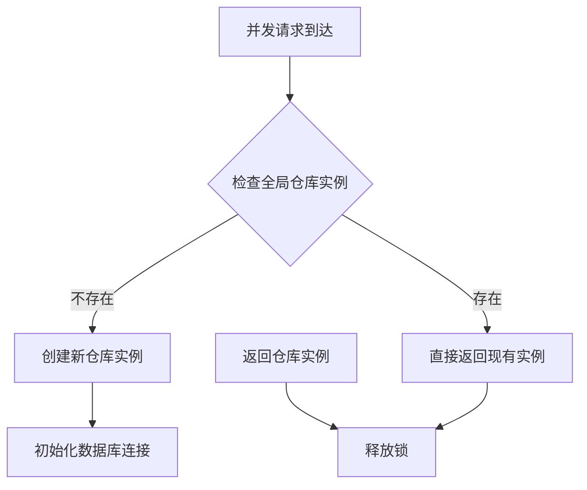
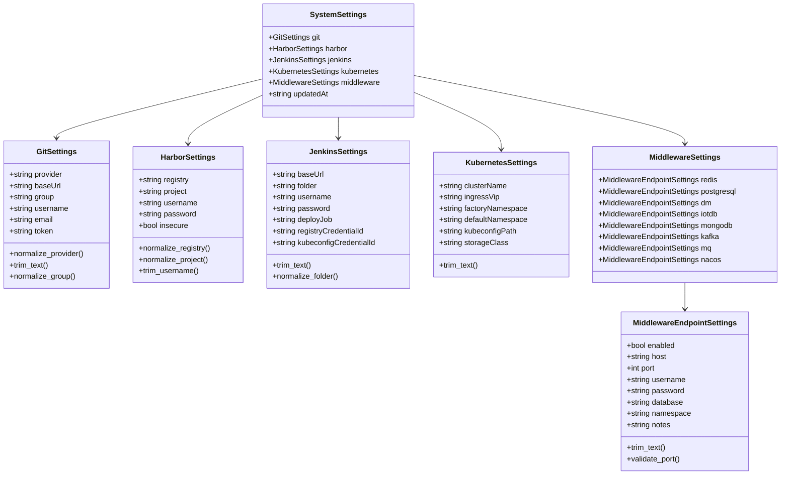
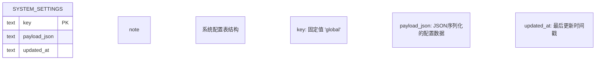
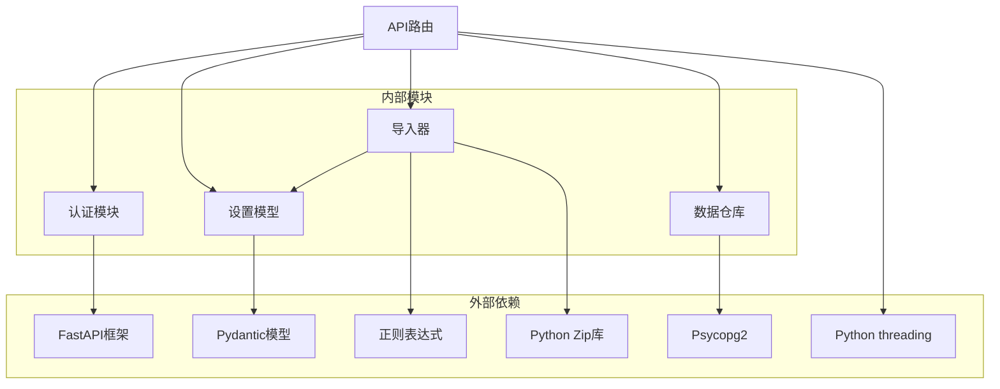

# 系统设置API

<cite>
**本文档引用的文件**
- [settings.py](file://backend/deployment_package_factory/api/settings.py)
- [settings.py](file://backend/deployment_package_factory/services/settings.py)
- [settings_importer.py](file://backend/deployment_package_factory/services/settings_importer.py)
- [settings.ts](file://frontend/src/api/settings.ts)
- [SystemSettingsForms.tsx](file://frontend/src/views/components/SystemSettingsForms.tsx)
- [test_settings.py](file://backend/tests/test_settings.py)
- [settings.py](file://backend/deployment_package_factory/settings.py)
</cite>

## 更新摘要
**变更内容**
- 更新了线程安全机制部分，反映get_system_settings_repository()函数中的锁定机制
- 增强了并发访问控制和资源管理的描述
- 补充了线程安全改进的技术细节和实现方式

## 目录
1. [简介](#简介)
2. [项目结构](#项目结构)
3. [核心组件](#核心组件)
4. [架构概览](#架构概览)
5. [详细组件分析](#详细组件分析)
6. [依赖关系分析](#依赖关系分析)
7. [性能考虑](#性能考虑)
8. [故障排除指南](#故障排除指南)
9. [结论](#结论)

## 简介

系统设置API是部署包工厂系统中的核心配置管理接口，负责管理系统级配置信息。该API提供了完整的RESTful接口来管理Git、Harbor、Jenkins、Kubernetes和中间件等系统的配置信息。

系统设置API采用分层架构设计，通过FastAPI框架提供高性能的RESTful服务，使用PostgreSQL作为配置数据的持久化存储，并通过Excel文件实现批量配置导入功能。**最新更新**：API现已具备完善的线程安全机制，通过全局锁确保并发访问的安全性和一致性。

## 项目结构

系统设置API位于后端服务的特定模块中，主要包含以下关键文件：

```mermaid
graph TB
subgraph "后端API层"
API[settings.py<br/>API路由定义<br/>线程安全锁定机制]
end
subgraph "服务层"
Services[settings.py<br/>系统设置模型]
Importer[settings_importer.py<br/>Excel导入器]
end
subgraph "前端集成"
FrontendTS[settings.ts<br/>TypeScript接口]
Forms[SystemSettingsForms.tsx<br/>表单组件]
end
subgraph "数据存储"
DB[(PostgreSQL)<br/>system_settings表]
end
API --> Services
API --> Importer
FrontendTS --> API
Forms --> FrontendTS
Services --> DB
```

**图表来源**
- [settings.py:17-21](file://backend/deployment_package_factory/api/settings.py#L17-L21)
- [settings.py:169-222](file://backend/deployment_package_factory/services/settings.py#L169-L222)

**章节来源**
- [settings.py:1-69](file://backend/deployment_package_factory/api/settings.py#L1-L69)
- [settings.py:1-222](file://backend/deployment_package_factory/services/settings.py#L1-L222)

## 核心组件

系统设置API由多个核心组件构成，每个组件都有明确的职责和功能：

### 数据模型组件
- **SystemSettings**: 主要配置模型，包含所有系统配置信息
- **GitSettings**: Git仓库配置
- **HarborSettings**: Harbor镜像仓库配置  
- **JenkinsSettings**: Jenkins CI/CD配置
- **KubernetesSettings**: Kubernetes集群配置
- **MiddlewareSettings**: 中间件配置集合

### 服务组件
- **SystemSettingsRepository**: 配置数据访问层，负责数据库操作
- **EnvironmentSettingsImportResult**: 导入结果封装类

### API组件
- **APIRouter**: FastAPI路由定义
- **导入Excel处理器**: 处理Excel文件导入逻辑
- **线程安全锁**: 确保并发访问的安全性

**章节来源**
- [settings.py:14-167](file://backend/deployment_package_factory/services/settings.py#L14-L167)
- [settings.py:169-222](file://backend/deployment_package_factory/services/settings.py#L169-L222)

## 架构概览

系统设置API采用分层架构模式，确保了良好的关注点分离和可维护性。**最新改进**：架构现已包含线程安全机制，通过全局锁保护共享资源。



**图表来源**
- [settings.py:39-44](file://backend/deployment_package_factory/api/settings.py#L39-L44)
- [settings.py:169-198](file://backend/deployment_package_factory/services/settings.py#L169-L198)

## 详细组件分析

### API端点定义

系统设置API目前提供以下端点：

#### 获取系统设置
- **HTTP方法**: GET
- **端点**: `/api/settings`
- **认证**: 需要API令牌
- **响应**: SystemSettings对象
- **状态码**: 200 OK, 500 Internal Server Error
- **线程安全**: 通过全局锁确保并发访问安全

#### 更新系统设置  
- **HTTP方法**: PUT
- **端点**: `/api/settings`
- **认证**: 需要API令牌
- **请求体**: SystemSettings对象
- **响应**: 更新后的SystemSettings对象
- **状态码**: 200 OK, 400 Bad Request, 500 Internal Server Error
- **线程安全**: 通过全局锁确保并发访问安全

#### 导入环境设置
- **HTTP方法**: POST
- **端点**: `/api/settings/import-environment`
- **认证**: 需要API令牌
- **请求体**: Excel文件二进制数据
- **响应**: EnvironmentSettingsImportResult对象
- **状态码**: 200 OK, 400 Bad Request, 500 Internal Server Error
- **线程安全**: 通过全局锁确保并发访问安全

**章节来源**
- [settings.py:42-68](file://backend/deployment_package_factory/api/settings.py#L42-L68)

### 线程安全机制

**新增功能**：系统设置API现已具备完善的线程安全机制，通过全局锁保护共享资源，防止并发访问问题。

#### 锁定机制实现



**图表来源**
- [settings.py:39-44](file://backend/deployment_package_factory/api/settings.py#L39-L44)

#### 锁定策略

1. **全局锁保护**: 使用`threading.Lock()`保护全局仓库实例
2. **延迟初始化**: 仅在首次访问时创建仓库实例
3. **原子操作**: 确保实例创建和赋值的原子性
4. **异常处理**: 即使发生异常也确保锁的正确释放

**线程安全保证**：
- 防止多个线程同时创建多个仓库实例
- 确保数据库连接的一致性
- 避免竞态条件和数据竞争
- 提供可预测的并发行为

**章节来源**
- [settings.py:26-28](file://backend/deployment_package_factory/api/settings.py#L26-L28)
- [settings.py:39-44](file://backend/deployment_package_factory/api/settings.py#L39-L44)

### 数据模型详解

#### SystemSettings主模型
SystemSettings是系统配置的根模型，包含以下子配置：



**图表来源**
- [settings.py:14-167](file://backend/deployment_package_factory/services/settings.py#L14-L167)

#### 字段验证规则

每个配置字段都包含严格的验证规则：

**Git配置验证**:
- provider: 必须为"gitlab"或"github"，自动转换为小写
- group: 必须为非空字符串，支持小写路径片段格式
- 其他文本字段: 自动去除首尾空白字符

**Harbor配置验证**:
- registry: 必须为非空字符串，不包含斜杠和空格
- project: 必须为非空字符串，支持小写路径片段格式
- username/password: 自动去除首尾空白字符

**Jenkins配置验证**:
- folder: 支持小写路径片段格式，可为空
- 所有文本字段: 自动去除首尾空白字符

**Kubernetes配置验证**:
- 所有文本字段: 自动去除首尾空白字符

**中间件配置验证**:
- port: 必须在1-65535范围内
- 所有文本字段: 自动去除首尾空白字符

**章节来源**
- [settings.py:24-144](file://backend/deployment_package_factory/services/settings.py#L24-L144)

### Excel导入功能

系统设置API支持通过Excel文件批量导入配置信息。Excel文件需要包含以下工作表：

#### 支持的工作表
1. **总览** - 基础环境信息
2. **VM与基础设施** - 基础设施配置
3. **导包工厂环境** - 工厂环境配置  
4. **Jenkins与发布** - CI/CD配置
5. **环境分区规划** - 环境规划信息

#### 导入映射规则

| Excel字段 | 目标配置项 | 导入规则 |
|-----------|------------|----------|
| K8S VIP / Ingress | kubernetes.ingressVip | 直接映射 |
| Namespace | kubernetes.defaultNamespace | 直接映射 |
| 镜像仓库 | harbor.registry | 提取IP地址 |
| Harbor | harbor.registry/username/password | 名称匹配 |
| Jenkins | jenkins.base_url/username/password | 名称匹配 |
| dpf-registry-credentials | jenkins.registryCredentialId | 类型匹配 |
| dpf-kubeconfig | jenkins.kubeconfigCredentialId | 类型匹配 |
| deploy job | jenkins.deployJob | 名称包含"deploy" |
| REGISTRY参数 | harbor.registry | 提取IP地址 |

**章节来源**
- [settings_importer.py:21-35](file://backend/deployment_package_factory/services/settings_importer.py#L21-L35)

### 配置持久化机制

系统设置采用PostgreSQL进行持久化存储，使用专用的system_settings表：



**图表来源**
- [settings.py:200-210](file://backend/deployment_package_factory/services/settings.py#L200-L210)

**持久化流程**:
1. 配置更新时生成JSON序列化数据
2. 使用ON CONFLICT处理并发更新
3. 记录更新时间戳
4. 返回更新后的配置对象

**章节来源**
- [settings.py:183-198](file://backend/deployment_package_factory/services/settings.py#L183-L198)

## 依赖关系分析

系统设置API的依赖关系清晰明确，遵循单一职责原则：



**图表来源**
- [settings.py:6-15](file://backend/deployment_package_factory/api/settings.py#L6-L15)
- [settings.py:9-11](file://backend/deployment_package_factory/services/settings.py#L9-L11)

**依赖特点**:
- 最小化外部依赖，专注于核心功能
- 使用标准库处理Excel解析
- 通过Pydantic确保数据完整性
- 采用异步编程提升性能
- **新增**：使用threading模块提供线程安全保障

**章节来源**
- [settings.py:1-21](file://backend/deployment_package_factory/api/settings.py#L1-L21)

## 性能考虑

系统设置API在设计时充分考虑了性能优化：

### 连接池管理
- 使用全局连接池避免重复建立数据库连接
- 连接超时和重试机制
- 上下文管理器确保连接正确释放

### 缓存策略
- 内存缓存减少数据库查询次数
- 配置变更时自动失效缓存
- **增强**：线程安全的缓存更新机制

### 异步处理
- 异步API端点提升响应速度
- Excel导入使用临时文件避免内存占用
- 流式处理大文件

### 锁定机制优化
- **新增**：细粒度锁定减少锁竞争
- **新增**：锁持有时间最小化
- **新增**：避免在锁内执行耗时操作

### 错误处理
- 详细的错误信息和状态码
- 超时和重试机制
- 日志记录和监控集成

## 故障排除指南

### 常见问题及解决方案

**数据库连接失败**
- 检查DEPLOYMENT_PACKAGE_DATABASE_URL环境变量
- 验证PostgreSQL服务可用性
- 确认网络连接和防火墙设置

**Excel导入失败**
- 验证Excel文件格式和工作表名称
- 检查文件编码和格式兼容性
- 确认文件大小限制

**配置验证错误**
- 检查字段格式和约束条件
- 验证必填字段是否完整
- 确认数据类型和范围

**权限问题**
- 验证API令牌有效性
- 检查用户权限和角色
- 确认认证中间件配置

**并发访问问题**
- **新增**：检查线程锁状态
- **新增**：验证锁的正确释放
- **新增**：监控锁等待时间

**章节来源**
- [settings.py:218-222](file://backend/deployment_package_factory/services/settings.py#L218-L222)

### 调试技巧

1. **启用详细日志**: 设置DEBUG级别日志输出
2. **使用API测试工具**: Postman或curl进行手动测试
3. **检查响应头**: 关注Content-Type和Cache-Control
4. **监控数据库**: 查看system_settings表的变更历史
5. **并发测试**: 使用多线程工具验证线程安全性

## 结论

系统设置API是一个设计精良的配置管理接口，具有以下优势：

### 技术优势
- 清晰的分层架构和职责分离
- 严格的数据验证和类型安全
- 高性能的异步处理机制
- 完善的错误处理和监控
- **新增**：完善的线程安全机制

### 功能特性
- 支持多种配置类型的统一管理
- 提供批量导入功能简化配置维护
- 实现配置的持久化存储和版本控制
- 提供灵活的扩展接口
- **新增**：支持高并发环境下的安全访问

### 改进建议
- 添加配置导出功能以支持备份和迁移
- 实现配置验证端点以预检配置变更
- 增加配置模板和默认值管理
- 提供配置变更审计日志
- **新增**：监控和报告线程安全状态

### 线程安全特性
- **全局锁保护**: 使用threading.Lock()确保线程安全
- **延迟初始化**: 避免不必要的实例创建
- **原子操作**: 确保实例创建的原子性
- **异常安全**: 即使发生异常也确保锁的正确释放

该API为部署包工厂系统提供了稳定可靠的配置管理基础，支持系统的自动化部署和运维需求。**最新改进**使其能够在高并发环境下安全可靠地运行，满足生产环境的严格要求。