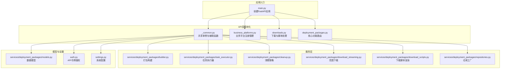
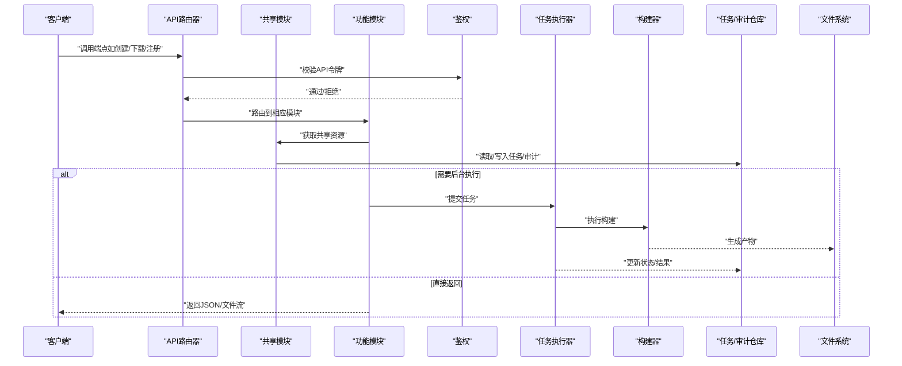
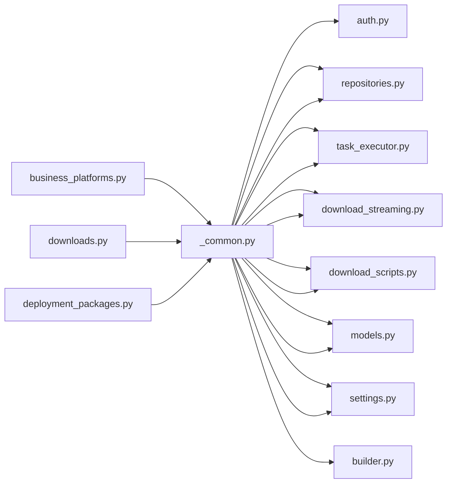

# 部署包API

<cite>
**本文引用的文件列表**
- [_common.py](file://backend/deployment_package_factory/api/_common.py)
- [business_platforms.py](file://backend/deployment_package_factory/api/business_platforms.py)
- [downloads.py](file://backend/deployment_package_factory/api/downloads.py)
- [deployment_packages.py](file://backend/deployment_package_factory/api/deployment_packages.py)
- [main.py](file://backend/deployment_package_factory/main.py)
- [models.py](file://backend/deployment_package_factory/services/deployment_packages/models.py)
- [builder.py](file://backend/deployment_package_factory/services/deployment_packages/builder.py)
- [task_executor.py](file://backend/deployment_package_factory/services/deployment_packages/task_executor.py)
- [cleanup.py](file://backend/deployment_package_factory/services/deployment_packages/cleanup.py)
- [download_streaming.py](file://backend/deployment_package_factory/services/deployment_packages/download_streaming.py)
- [download_scripts.py](file://backend/deployment_package_factory/services/deployment_packages/download_scripts.py)
- [repositories.py](file://backend/deployment_package_factory/services/deployment_packages/repositories.py)
- [auth.py](file://backend/deployment_package_factory/auth.py)
- [settings.py](file://backend/deployment_package_factory/settings.py)
- [test_deployment_package_api.py](file://backend/tests/test_deployment_package_api.py)
</cite>

## 更新摘要
**所做更改**
- 新增模块化架构分析，详细说明 _common.py、business_platforms.py、downloads.py 的职责分离
- 更新项目结构图以反映新的模块化组织方式
- 补充 _common.py 共享模块的功能说明
- 更新业务平台注册和下载处理的API文档
- 修订依赖关系分析以体现新的模块边界

## 目录
1. [简介](#简介)
2. [项目结构](#项目结构)
3. [核心组件](#核心组件)
4. [架构总览](#架构总览)
5. [详细组件分析](#详细组件分析)
6. [依赖关系分析](#依赖关系分析)
7. [性能与并发特性](#性能与并发特性)
8. [故障排查指南](#故障排查指南)
9. [结论](#结论)
10. [附录：完整API清单与示例](#附录完整api清单与示例)

## 简介
本文件为"部署包API"的权威技术文档，覆盖所有与部署包相关的RESTful接口，包括创建、预览、查询、下载、校验、脚本生成、任务管理、清理以及业务平台注册等能力。文档同时说明认证机制、操作员标识头、范围请求支持、审计日志记录及常见错误场景与解决方案，帮助开发者与运维人员快速集成与排障。

**更新** 本版本反映了部署包API的模块化重构，将原有单一的deployment_packages.py文件拆分为专门的功能模块，提升了代码的可维护性和可测试性。

## 项目结构
后端采用FastAPI框架，部署包API经过模块化重构后，采用分层架构设计，通过统一入口挂载到应用路由。核心目录与职责如下：
- API层：按功能拆分的模块化路由定义
- 服务层：封装构建、下载、清理、任务执行等业务逻辑
- 模型层：定义请求/响应数据结构
- 认证与设置：统一鉴权策略与系统配置
- 测试：提供详尽的端到端用例与行为验证

**图表来源**
- [main.py:52-54](file://backend/deployment_package_factory/main.py#L52-L54)
- [_common.py:1-202](file://backend/deployment_package_factory/api/_common.py#L1-L202)
- [business_platforms.py:1-100](file://backend/deployment_package_factory/api/business_platforms.py#L1-L100)
- [downloads.py:1-182](file://backend/deployment_package_factory/api/downloads.py#L1-L182)
- [deployment_packages.py:1-247](file://backend/deployment_package_factory/api/deployment_packages.py#L1-L247)

**章节来源**
- [main.py:52-54](file://backend/deployment_package_factory/main.py#L52-L54)
- [_common.py:1-202](file://backend/deployment_package_factory/api/_common.py#L1-L202)
- [business_platforms.py:1-100](file://backend/deployment_package_factory/api/business_platforms.py#L1-L100)
- [downloads.py:1-182](file://backend/deployment_package_factory/api/downloads.py#L1-L182)
- [deployment_packages.py:1-247](file://backend/deployment_package_factory/api/deployment_packages.py#L1-L247)

## 核心组件
- **共享模块（_common.py）**：提供全局单例访问、审计记录、业务平台发现、微服务查询等共享功能
- **业务平台模块（business_platforms.py）**：处理业务平台的注册、禁用等管理操作
- **下载模块（downloads.py）**：负责部署包的下载、校验和脚本生成
- **核心模块（deployment_packages.py）**：维持预览、创建、任务管理、清理等核心功能
- **路由器与依赖注入**：统一前缀"/api/deployment-packages"，并注入API令牌鉴权依赖
- **任务仓库与审计仓库**：持久化任务状态与审计事件
- **任务执行器**：控制并发与心跳，异步执行打包构建
- **下载流与范围请求**：支持断点续传与If-Range优化
- **下载脚本**：自动生成跨平台下载脚本，含断点续传与SHA256校验
- **清理策略**：按保留天数与总量阈值清理过期产物

**章节来源**
- [_common.py:37-95](file://backend/deployment_package_factory/api/_common.py#L37-L95)
- [business_platforms.py:29-59](file://backend/deployment_package_factory/api/business_platforms.py#L29-L59)
- [downloads.py:40-67](file://backend/deployment_package_factory/api/downloads.py#L40-L67)
- [deployment_packages.py:116-147](file://backend/deployment_package_factory/api/deployment_packages.py#L116-L147)

## 架构总览
下图展示模块化重构后的部署包API关键交互流程：客户端调用端点，经鉴权与审计，进入相应的模块处理，最终返回结果或流式下载。

**图表来源**
- [main.py:52-54](file://backend/deployment_package_factory/main.py#L52-L54)
- [_common.py:77-95](file://backend/deployment_package_factory/api/_common.py#L77-L95)
- [business_platforms.py:35-59](file://backend/deployment_package_factory/api/business_platforms.py#L35-L59)
- [downloads.py:58-67](file://backend/deployment_package_factory/api/downloads.py#L58-L67)

## 详细组件分析

### 认证与操作员标识
- **认证方式**：支持Authorization头（Bearer）、X-Deployment-Package-Token头、以及特定端点的查询参数（download/checksum/download-script）
- **操作员标识头**：X-Deployment-Package-Operator用于审计记录中的operator字段
- **异常**：未提供有效令牌时返回401
- **模块化实现**：所有模块都依赖共享的认证函数，确保一致的鉴权行为

**章节来源**
- [auth.py:10-41](file://backend/deployment_package_factory/auth.py#L10-L41)
- [_common.py:127-133](file://backend/deployment_package_factory/api/_common.py#L127-L133)

### 共享模块功能（_common.py）
- **全局单例管理**：提供任务仓库、审计仓库、业务平台仓库、微服务仓库的延迟初始化
- **审计记录**：统一的审计事件记录机制，包含操作员识别和客户端IP追踪
- **业务平台发现**：结合数据库注册和Kubernetes命名空间发现业务平台
- **微服务查询**：根据业务平台选择查询已注册的微服务
- **配置访问**：提供系统设置的统一访问接口

**章节来源**
- [_common.py:37-66](file://backend/deployment_package_factory/api/_common.py#L37-L66)
- [_common.py:103-124](file://backend/deployment_package_factory/api/_common.py#L103-L124)
- [_common.py:180-201](file://backend/deployment_package_factory/api/_common.py#L180-L201)

### 业务平台管理（business_platforms.py）
- **注册端点**：POST /api/deployment-packages/business-platforms/register
- **禁用端点**：POST /api/deployment-packages/business-platforms/{source_env}/{business_key}/disable
- **响应模型**：BusinessPlatformRegistrationResult
- **审计事件**：business-platform.register、business-platform.disable
- **错误处理**：Kubernetes运行时错误、未注册平台、状态冲突

**章节来源**
- [business_platforms.py:29-59](file://backend/deployment_package_factory/api/business_platforms.py#L29-L59)
- [business_platforms.py:62-99](file://backend/deployment_package_factory/api/business_platforms.py#L62-L99)

### 下载处理（downloads.py）
- **下载端点**：GET /api/deployment-packages/{package_id}/download
- **HEAD端点**：HEAD /api/deployment-packages/{package_id}/download
- **校验和端点**：GET /api/deployment-packages/{package_id}/checksum
- **脚本端点**：GET /api/deployment-packages/{package_id}/download-script.ps1, .sh
- **范围请求**：支持Range/If-Range头部，返回206或200状态码
- **审计事件**：package.download、package.checksum.download

**章节来源**
- [downloads.py:40-67](file://backend/deployment_package_factory/api/downloads.py#L40-L67)
- [downloads.py:70-73](file://backend/deployment_package_factory/api/downloads.py#L70-L73)
- [downloads.py:76-94](file://backend/deployment_package_factory/api/downloads.py#L76-L94)
- [downloads.py:97-126](file://backend/deployment_package_factory/api/downloads.py#L97-L126)

### 选项与环境检查
- **获取部署包选项**：返回源环境、部署模式、平台/业务服务、数据库选项、中间件、微服务与项目信息
- **镜像导出环境检查**：检测可用工具（skopeo或docker），并返回版本与可用性

**章节来源**
- [deployment_packages.py:53-66](file://backend/deployment_package_factory/api/deployment_packages.py#L53-L66)
- [deployment_packages.py:108-110](file://backend/deployment_package_factory/api/deployment_packages.py#L108-L110)

### 预览部署包（POST /api/deployment-packages/preview）
- **请求体**：PackagePreviewRequest（项目键、产品版本、源环境、部署模式、平台/业务服务、数据库、目标配置）
- **响应体**：PackagePreview（解析后的平台/业务服务、中间件、数据库、镜像清单、镜像条目、运行时配置与警告）
- **错误**：400（无效输入/Catalog错误/构建错误）

**章节来源**
- [deployment_packages.py:69-106](file://backend/deployment_package_factory/api/deployment_packages.py#L69-L106)

### 创建部署包（POST /api/deployment-packages）
- **请求体**：PackageBuildRequest（继承预览请求，增加镜像模式与运行时覆盖）
- **响应体**：PackageTask（任务ID、状态、进度、消息、请求、结果、日志、心跳等）
- **并发与执行模式**：根据配置决定是否后台执行；后台模式下任务初始状态为pending
- **审计**：记录package.create事件，包含操作员与元数据
- **错误**：400（微服务交付未就绪/参数错误）、409（冲突）

**章节来源**
- [deployment_packages.py:116-147](file://backend/deployment_package_factory/api/deployment_packages.py#L116-L147)

### 获取部署包（GET /api/deployment-packages/{package_id}）
- **返回**：PackageBuildResult（包ID、工作目录、产物路径、校验文件路径、大小、校验摘要、清单）
- **错误**：404（任务不存在/结果为空）

**章节来源**
- [downloads.py:32-37](file://backend/deployment_package_factory/api/downloads.py#L32-L37)

### 下载部署包（GET/HEAD /api/deployment-packages/{package_id}/download）
- **支持范围请求**：Range/If-Range，返回206或200
- **HEAD**：仅返回元数据（Accept-Ranges、Content-Length、ETag、Last-Modified、Content-Disposition）
- **审计**：记录package.download事件
- **错误**：416（不满足的范围）、404（任务/产物不存在）

**章节来源**
- [downloads.py:40-67](file://backend/deployment_package_factory/api/downloads.py#L40-L67)

### 下载校验和（GET /api/deployment-packages/{package_id}/checksum）
- **返回**：文本文件（SHA256摘要）
- **头部**：X-Deployment-Package-Sha256
- **审计**：记录package.checksum.download事件
- **错误**：404（任务/校验文件不存在）

**章节来源**
- [downloads.py:76-94](file://backend/deployment_package_factory/api/downloads.py#L76-L94)

### 下载脚本（GET /api/deployment-packages/{package_id}/download-script.ps1, .sh）
- **返回**：跨平台下载脚本（PowerShell/Bash），包含断点续传与SHA256校验
- **查询参数**：deployment_package_token（可选）
- **审计**：脚本下载不直接记录审计事件（脚本内调用API时会记录）

**章节来源**
- [downloads.py:97-126](file://backend/deployment_package_factory/api/downloads.py#L97-L126)

### 任务管理
- **列表任务**：GET /api/deployment-packages/tasks
- **获取任务**：GET /api/deployment-packages/tasks/{task_id}
- **取消任务**：POST /api/deployment-packages/tasks/{task_id}/cancel
- **重试任务**：POST /api/deployment-packages/tasks/{task_id}/retry
- **审计**：task.cancel、task.retry

**章节来源**
- [deployment_packages.py:160-170](file://backend/deployment_package_factory/api/deployment_packages.py#L160-L170)
- [deployment_packages.py:196-210](file://backend/deployment_package_factory/api/deployment_packages.py#L196-L210)
- [deployment_packages.py:213-232](file://backend/deployment_package_factory/api/deployment_packages.py#L213-L232)

### 清理功能（POST /api/deployment-packages/cleanup）
- **参数**：dry_run（布尔）
- **响应体**：CleanupResult（扫描任务数、删除产物/工作目录数、释放字节数、保留字节数、删除路径列表）
- **审计**：package.cleanup

**章节来源**
- [deployment_packages.py:173-193](file://backend/deployment_package_factory/api/deployment_packages.py#L173-L193)

### 业务平台注册
- **注册**：POST /api/deployment-packages/business-platforms/register
- **禁用**：POST /api/deployment-packages/business-platforms/{source_env}/{business_key}/disable
- **响应体**：BusinessPlatformRegistrationResult
- **审计**：business-platform.register、business-platform.disable

**章节来源**
- [business_platforms.py:29-59](file://backend/deployment_package_factory/api/business_platforms.py#L29-L59)
- [business_platforms.py:62-99](file://backend/deployment_package_factory/api/business_platforms.py#L62-L99)

### 审计与事件
- **列表审计事件**：GET /api/deployment-packages/audit-events
- **参数**：limit、status、action、actionPrefix
- **数据模型**：AuditEvent

**章节来源**
- [deployment_packages.py:150-157](file://backend/deployment_package_factory/api/deployment_packages.py#L150-L157)

## 依赖关系分析
- **模块间耦合**
  - 所有模块依赖共享模块提供的单例访问和辅助函数
  - 共享模块依赖认证、设置、仓库工厂、任务执行器、下载流与脚本渲染
  - 任务执行器依赖仓库与构建器
  - 构建器依赖目录、镜像导出环境、运行时资源与模板渲染器
- **外部依赖**
  - PostgreSQL：持久化任务与审计
  - Kubernetes：发现业务平台命名空间与运行时镜像
  - 文件系统：产物与校验文件存储

**图表来源**
- [_common.py:13-24](file://backend/deployment_package_factory/api/_common.py#L13-L24)
- [business_platforms.py:6-20](file://backend/deployment_package_factory/api/business_platforms.py#L6-L20)
- [downloads.py:13-22](file://backend/deployment_package_factory/api/downloads.py#L13-L22)
- [deployment_packages.py:13-38](file://backend/deployment_package_factory/api/deployment_packages.py#L13-L38)

## 性能与并发特性
- **并发控制**：通过信号量限制最大并发构建数
- **心跳机制**：定期向仓库上报心跳，避免长时间无响应
- **范围下载**：支持断点续传，减少网络抖动影响
- **清理策略**：基于保留天数与总量阈值，避免磁盘膨胀
- **模块化优势**：通过延迟初始化和单例模式减少内存占用

**章节来源**
- [task_executor.py:24](file://backend/deployment_package_factory/services/deployment_packages/task_executor.py#L24)
- [task_executor.py:66-77](file://backend/deployment_package_factory/services/deployment_packages/task_executor.py#L66-L77)
- [download_streaming.py:73-84](file://backend/deployment_package_factory/services/deployment_packages/download_streaming.py#L73-L84)
- [cleanup.py:32-58](file://backend/deployment_package_factory/services/deployment_packages/cleanup.py#L32-L58)

## 故障排查指南
- **401 未授权**
  - 确认API令牌配置与传递方式（Authorization头、X-Deployment-Package-Token头、或特定端点查询参数）
- **404 任务/产物不存在**
  - 确认package_id/task_id正确，且任务已完成
- **409 冲突**
  - 任务状态不允许取消/重试，需先恢复到允许状态
- **416 范围请求不满足**
  - 检查Range/If-Range格式与文件大小
- **镜像导出不可用**
  - 检查环境工具（skopeo或docker）可用性与权限
- **模块化相关问题**
  - 确认模块导入顺序和依赖关系正确
  - 检查共享模块的单例初始化是否正常

**章节来源**
- [auth.py:22-26](file://backend/deployment_package_factory/auth.py#L22-L26)
- [downloads.py:52](file://backend/deployment_package_factory/api/downloads.py#L52)
- [builder.py:105-143](file://backend/deployment_package_factory/services/deployment_packages/builder.py#L105-L143)

## 结论
部署包API经过模块化重构后，通过_shared模块实现了功能的合理分离：核心功能集中在deployment_packages.py，业务平台管理独立于business_platforms.py，下载处理独立于downloads.py，共享逻辑集中在_common.py。这种架构提升了代码的可维护性、可测试性和扩展性，同时保持了完整的部署包全链路能力，具备完善的鉴权、审计与范围下载支持。

## 附录：完整API清单与示例

### 端点一览
- **预览部署包**
  - 方法：POST
  - 路径：/api/deployment-packages/preview
  - 请求体：PackagePreviewRequest
  - 响应体：PackagePreview
  - 状态码：200、400
- **创建部署包**
  - 方法：POST
  - 路径：/api/deployment-packages
  - 请求体：PackageBuildRequest
  - 响应体：PackageTask
  - 状态码：200、400、409
- **获取部署包**
  - 方法：GET
  - 路径：/api/deployment-packages/{package_id}
  - 响应体：PackageBuildResult
  - 状态码：200、404
- **下载部署包**
  - 方法：GET
  - 路径：/api/deployment-packages/{package_id}/download
  - 头部：Range、If-Range
  - 响应体：二进制流（application/gzip）
  - 状态码：200、206、416、404
- **HEAD 下载元数据**
  - 方法：HEAD
  - 路径：/api/deployment-packages/{package_id}/download
  - 响应体：空，头部包含Accept-Ranges/Content-Length/ETag/Last-Modified
  - 状态码：200、404
- **下载校验和**
  - 方法：GET
  - 路径：/api/deployment-packages/{package_id}/checksum
  - 响应体：文本（SHA256）
  - 状态码：200、404
- **下载脚本（PowerShell）**
  - 方法：GET
  - 路径：/api/deployment-packages/{package_id}/download-script.ps1
  - 查询参数：deployment_package_token
  - 响应体：文本（脚本）
  - 状态码：200
- **下载脚本（Bash）**
  - 方法：GET
  - 路径：/api/deployment-packages/{package_id}/download-script.sh
  - 查询参数：deployment_package_token
  - 响应体：文本（脚本）
  - 状态码：200
- **列表任务**
  - 方法：GET
  - 路径：/api/deployment-packages/tasks
  - 响应体：PackageTask[]
  - 状态码：200
- **获取任务**
  - 方法：GET
  - 路径：/api/deployment-packages/tasks/{task_id}
  - 响应体：PackageTask
  - 状态码：200、404
- **取消任务**
  - 方法：POST
  - 路径：/api/deployment-packages/tasks/{task_id}/cancel
  - 响应体：PackageTask
  - 状态码：200、404、409
- **重试任务**
  - 方法：POST
  - 路径：/api/deployment-packages/tasks/{task_id}/retry
  - 响应体：PackageTask
  - 状态码：200、404、409
- **清理**
  - 方法：POST
  - 路径：/api/deployment-packages/cleanup
  - 查询参数：dry_run（布尔）
  - 响应体：CleanupResult
  - 状态码：200
- **业务平台注册**
  - 方法：POST
  - 路径：/api/deployment-packages/business-platforms/register
  - 请求体：BusinessPlatformRegistrationRequest
  - 响应体：BusinessPlatformRegistrationResult
  - 状态码：200、400
- **禁用业务平台**
  - 方法：POST
  - 路径：/api/deployment-packages/business-platforms/{source_env}/{business_key}/disable
  - 查询参数：profile（可选）
  - 响应体：BusinessPlatformRegistrationResult
  - 状态码：200、404、409
- **审计事件**
  - 方法：GET
  - 路径：/api/deployment-packages/audit-events
  - 查询参数：limit、status、action、actionPrefix
  - 响应体：AuditEvent[]
  - 状态码：200
- **选项与环境检查**
  - 方法：GET
  - 路径：/api/deployment-packages/options
  - 响应体：选项对象
  - 状态码：200
  - 方法：GET
  - 路径：/api/deployment-packages/image-export-environment
  - 响应体：ImageExportEnvironmentCheck
  - 状态码：200

### 认证与操作员标识
- **认证头**：Authorization: Bearer <token> 或 X-Deployment-Package-Token: <token>
- **查询参数**：deployment_package_token（仅限download/checksum/download-script）
- **操作员头**：X-Deployment-Package-Operator: <operator>

**章节来源**
- [auth.py:10-41](file://backend/deployment_package_factory/auth.py#L10-L41)
- [_common.py:127-133](file://backend/deployment_package_factory/api/_common.py#L127-L133)

### 范围请求与断点续传
- **Range**：bytes=start-end
- **If-Range**：ETag/Last-Modified
- **返回**：206 Partial Content 或 200 Full Content
- **支持后缀范围**：如bytes=-N

**章节来源**
- [download_streaming.py:46-96](file://backend/deployment_package_factory/services/deployment_packages/download_streaming.py#L46-L96)

### 审计日志
- **记录动作**：package.create、package.create.blocked、package.download、package.checksum.download、task.cancel、task.retry、package.cleanup、business-platform.register、business-platform.disable
- **元数据**：包含操作员、客户端IP、目标ID、消息与自定义字段

**章节来源**
- [deployment_packages.py:150-157](file://backend/deployment_package_factory/api/deployment_packages.py#L150-L157)
- [business_platforms.py:43-51](file://backend/deployment_package_factory/api/business_platforms.py#L43-L51)
- [downloads.py:86-90](file://backend/deployment_package_factory/api/downloads.py#L86-L90)

### 请求与响应示例（来自测试）
- **创建并下载部署包**
  - 创建：POST /api/deployment-packages（携带X-Deployment-Package-Operator）
  - 下载：GET /api/deployment-packages/{package_id}/download（支持Range/If-Range）
  - 校验：GET /api/deployment-packages/{package_id}/checksum
  - 审计：记录package.create/package.download/package.checksum.download
- **范围下载与HEAD**
  - Range: bytes=10-25 → 206 + Content-Range
  - HEAD：返回Accept-Ranges/Content-Length/ETag/Last-Modified
- **下载脚本**
  - PowerShell/Bash脚本包含断点续传与SHA256校验逻辑
- **任务管理**
  - 取消/重试任务，审计记录task.cancel/task.retry
- **清理**
  - POST /api/deployment-packages/cleanup?dry_run=true
- **业务平台管理**
  - 注册/禁用业务平台，审计记录business-platform.register/business-platform.disable

**章节来源**
- [test_deployment_package_api.py:30-35](file://backend/tests/test_deployment_package_api.py#L30-L35)
- [test_deployment_package_api.py:149-200](file://backend/tests/test_deployment_package_api.py#L149-L200)
- [test_deployment_package_api.py:819-871](file://backend/tests/test_deployment_package_api.py#L819-L871)
- [test_deployment_package_api.py:833-846](file://backend/tests/test_deployment_package_api.py#L833-L846)