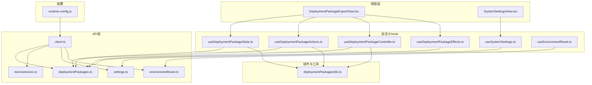
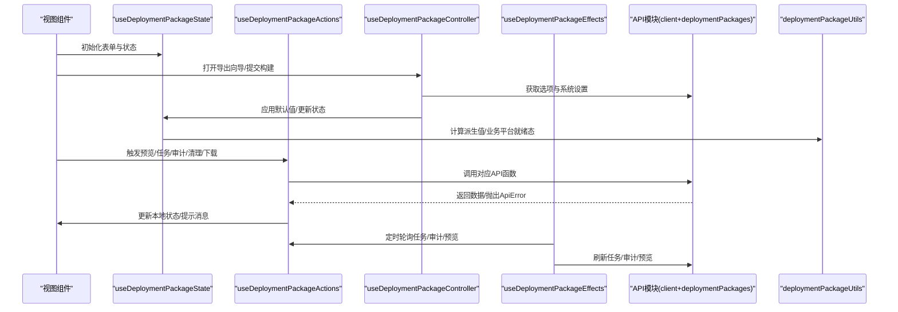
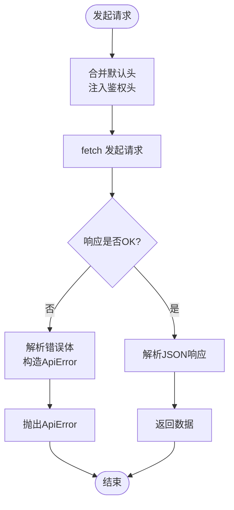
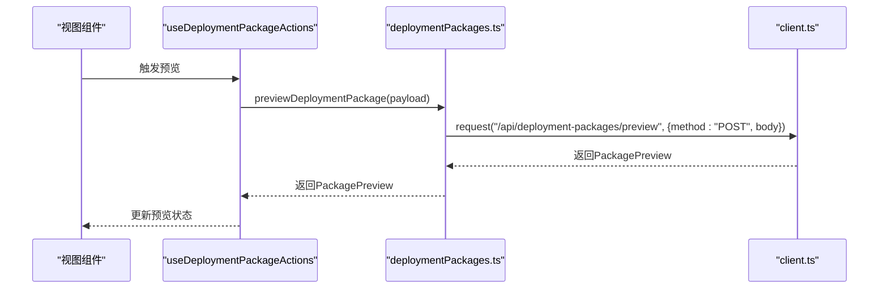
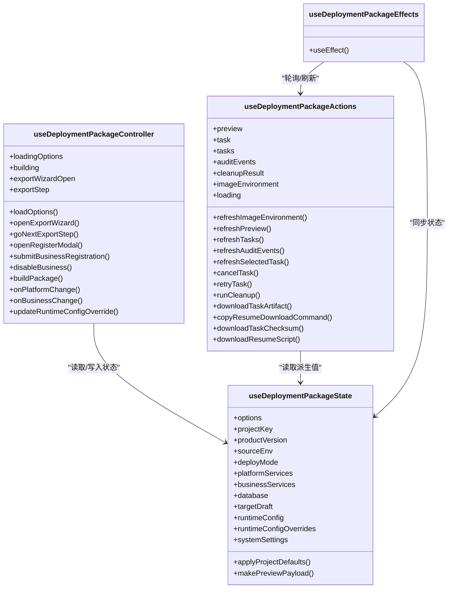
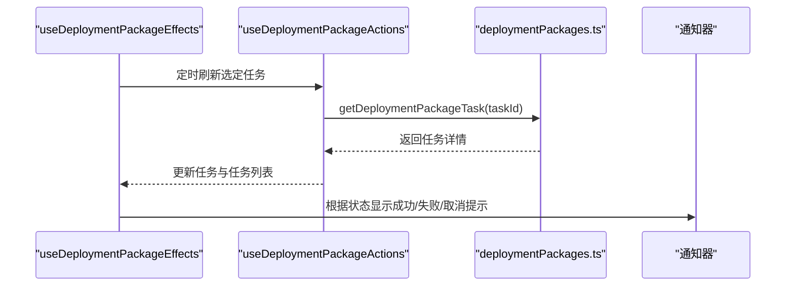
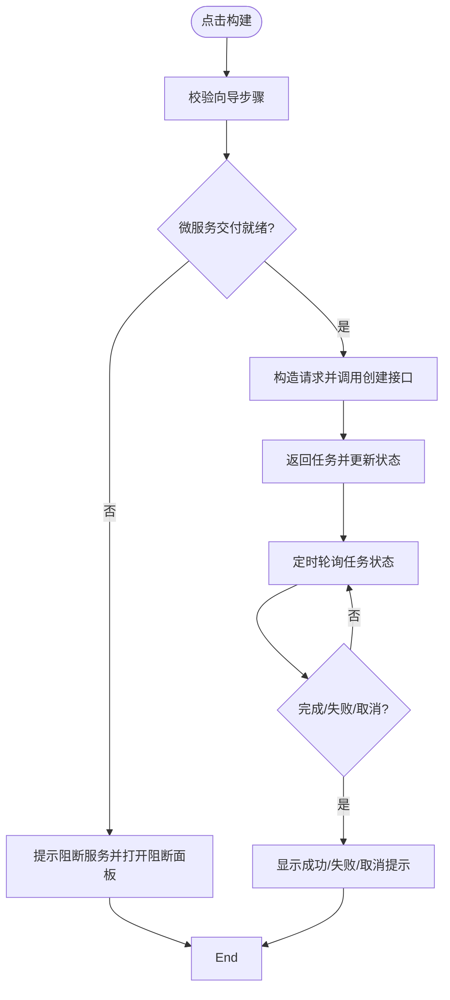
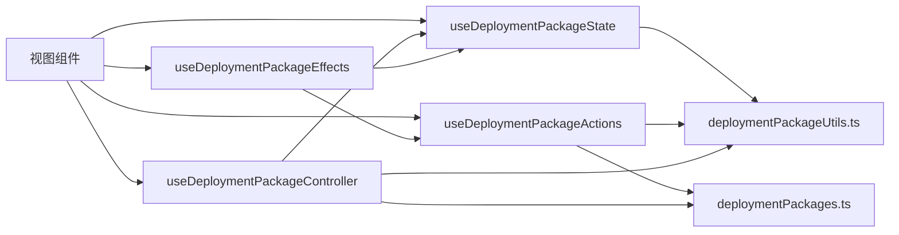

# API集成与数据管理

<cite>
**本文引用的文件**
- [frontend/src/api/client.ts](file://frontend/src/api/client.ts)
- [frontend/src/api/deploymentPackages.ts](file://frontend/src/api/deploymentPackages.ts)
- [frontend/src/api/microservices.ts](file://frontend/src/api/microservices.ts)
- [frontend/src/api/settings.ts](file://frontend/src/api/settings.ts)
- [frontend/src/api/environmentReset.ts](file://frontend/src/api/environmentReset.ts)
- [frontend/src/views/hooks/useDeploymentPackageEffects.ts](file://frontend/src/views/hooks/useDeploymentPackageEffects.ts)
- [frontend/src/views/hooks/useDeploymentPackageState.ts](file://frontend/src/views/hooks/useDeploymentPackageState.ts)
- [frontend/src/views/hooks/useDeploymentPackageController.ts](file://frontend/src/views/hooks/useDeploymentPackageController.ts)
- [frontend/src/views/hooks/useDeploymentPackageActions.ts](file://frontend/src/views/hooks/useDeploymentPackageActions.ts)
- [frontend/src/views/hooks/useEnvironmentReset.ts](file://frontend/src/views/hooks/useEnvironmentReset.ts)
- [frontend/src/views/hooks/useSystemSettings.ts](file://frontend/src/views/hooks/useSystemSettings.ts)
- [frontend/src/views/components/deploymentPackageUtils.ts](file://frontend/src/views/components/deploymentPackageUtils.ts)
- [frontend/src/views/DeploymentPackageExportView.tsx](file://frontend/src/views/DeploymentPackageExportView.tsx)
- [frontend/src/views/SystemSettingsView.tsx](file://frontend/src/views/SystemSettingsView.tsx)
- [frontend/public/runtime-config.js](file://frontend/public/runtime-config.js)
</cite>

## 目录
1. [引言](#引言)
2. [项目结构](#项目结构)
3. [核心组件](#核心组件)
4. [架构总览](#架构总览)
5. [详细组件分析](#详细组件分析)
6. [依赖关系分析](#依赖关系分析)
7. [性能考虑](#性能考虑)
8. [故障排查指南](#故障排查指南)
9. [结论](#结论)
10. [附录](#附录)

## 引言
本文件面向部署包工厂前端的API集成与数据管理，系统性阐述HTTP客户端封装策略（请求拦截、响应处理、错误统一管理）、四大API模块（部署包、微服务、设置、环境重置）的接口设计与调用方式、数据钩子函数的实现（useEffect生命周期管理、状态同步、异步数据处理），以及加载状态管理、错误处理机制、缓存策略与性能优化建议，并提供最佳实践与调试技巧。

## 项目结构
前端采用“按功能域分层”的组织方式：
- API层：集中定义HTTP客户端与各模块API函数，统一错误处理与鉴权头注入。
- 视图层：页面组件负责UI与交互，通过自定义Hook进行状态与副作用管理。
- 组件层：通用UI与工具函数，如导出工具、格式化、下载触发等。
- 配置层：运行时配置注入，支持在浏览器端动态注入API基础地址与令牌。

图表来源
- [frontend/src/views/DeploymentPackageExportView.tsx:1-135](file://frontend/src/views/DeploymentPackageExportView.tsx#L1-L135)
- [frontend/src/views/SystemSettingsView.tsx:1-61](file://frontend/src/views/SystemSettingsView.tsx#L1-L61)
- [frontend/src/views/hooks/useDeploymentPackageState.ts:1-64](file://frontend/src/views/hooks/useDeploymentPackageState.ts#L1-L64)
- [frontend/src/views/hooks/useDeploymentPackageActions.ts:1-145](file://frontend/src/views/hooks/useDeploymentPackageActions.ts#L1-L145)
- [frontend/src/views/hooks/useDeploymentPackageController.ts:1-170](file://frontend/src/views/hooks/useDeploymentPackageController.ts#L1-L170)
- [frontend/src/views/hooks/useDeploymentPackageEffects.ts:1-62](file://frontend/src/views/hooks/useDeploymentPackageEffects.ts#L1-L62)
- [frontend/src/views/hooks/useSystemSettings.ts:1-103](file://frontend/src/views/hooks/useSystemSettings.ts#L1-L103)
- [frontend/src/views/hooks/useEnvironmentReset.ts:1-83](file://frontend/src/views/hooks/useEnvironmentReset.ts#L1-L83)
- [frontend/src/api/client.ts:1-83](file://frontend/src/api/client.ts#L1-L83)
- [frontend/src/api/deploymentPackages.ts:1-390](file://frontend/src/api/deploymentPackages.ts#L1-L390)
- [frontend/src/api/microservices.ts:1-168](file://frontend/src/api/microservices.ts#L1-L168)
- [frontend/src/api/settings.ts:1-78](file://frontend/src/api/settings.ts#L1-L78)
- [frontend/src/api/environmentReset.ts:1-73](file://frontend/src/api/environmentReset.ts#L1-L73)
- [frontend/src/views/components/deploymentPackageUtils.ts:1-128](file://frontend/src/views/components/deploymentPackageUtils.ts#L1-L128)
- [frontend/public/runtime-config.js:1-5](file://frontend/public/runtime-config.js#L1-L5)

章节来源
- [frontend/src/views/DeploymentPackageExportView.tsx:1-135](file://frontend/src/views/DeploymentPackageExportView.tsx#L1-L135)
- [frontend/src/views/SystemSettingsView.tsx:1-61](file://frontend/src/views/SystemSettingsView.tsx#L1-L61)

## 核心组件
- HTTP客户端与错误处理
  - 基础URL与令牌读取：优先从运行时配置注入对象读取，其次回退到构建期环境变量。
  - 统一鉴权头：在请求头中注入Bearer Token。
  - 请求封装：统一JSON序列化、Content-Type设置、缓存策略（禁用缓存）。
  - 错误处理：解析后端返回的结构化错误体，构造ApiError，保留状态码、错误码与细节。
  - 下载URL拼装：支持在查询参数中附加令牌，便于直链下载。
- 数据钩子体系
  - useDeploymentPackageState：集中管理表单与选择状态、派生计算、默认值应用、预览请求构造。
  - useDeploymentPackageActions：封装部署包相关异步操作（预览、任务、审计、清理、下载等），统一加载状态与错误提示。
  - useDeploymentPackageController：封装业务流程控制（向导步骤、注册/注销业务平台、构建部署包、微服务阻断处理等）。
  - useDeploymentPackageEffects：基于useEffect的副作用编排，定时轮询任务状态、预览延迟防抖、全局任务与审计刷新。
  - useSystemSettings：系统设置加载、保存、Excel导入，合并差异字段。
  - useEnvironmentReset：环境重置预览与执行，确认短语校验与可执行状态判断。

章节来源
- [frontend/src/api/client.ts:1-83](file://frontend/src/api/client.ts#L1-L83)
- [frontend/src/views/hooks/useDeploymentPackageState.ts:1-64](file://frontend/src/views/hooks/useDeploymentPackageState.ts#L1-L64)
- [frontend/src/views/hooks/useDeploymentPackageActions.ts:1-145](file://frontend/src/views/hooks/useDeploymentPackageActions.ts#L1-L145)
- [frontend/src/views/hooks/useDeploymentPackageController.ts:1-170](file://frontend/src/views/hooks/useDeploymentPackageController.ts#L1-L170)
- [frontend/src/views/hooks/useDeploymentPackageEffects.ts:1-62](file://frontend/src/views/hooks/useDeploymentPackageEffects.ts#L1-L62)
- [frontend/src/views/hooks/useSystemSettings.ts:1-103](file://frontend/src/views/hooks/useSystemSettings.ts#L1-L103)
- [frontend/src/views/hooks/useEnvironmentReset.ts:1-83](file://frontend/src/views/hooks/useEnvironmentReset.ts#L1-L83)

## 架构总览
下图展示从前端视图到API层的整体调用路径与数据流。

图表来源
- [frontend/src/views/DeploymentPackageExportView.tsx:15-135](file://frontend/src/views/DeploymentPackageExportView.tsx#L15-L135)
- [frontend/src/views/hooks/useDeploymentPackageState.ts:7-62](file://frontend/src/views/hooks/useDeploymentPackageState.ts#L7-L62)
- [frontend/src/views/hooks/useDeploymentPackageActions.ts:25-138](file://frontend/src/views/hooks/useDeploymentPackageActions.ts#L25-L138)
- [frontend/src/views/hooks/useDeploymentPackageController.ts:23-150](file://frontend/src/views/hooks/useDeploymentPackageController.ts#L23-L150)
- [frontend/src/views/hooks/useDeploymentPackageEffects.ts:10-55](file://frontend/src/views/hooks/useDeploymentPackageEffects.ts#L10-L55)
- [frontend/src/views/components/deploymentPackageUtils.ts:74-127](file://frontend/src/views/components/deploymentPackageUtils.ts#L74-L127)
- [frontend/src/api/client.ts:45-82](file://frontend/src/api/client.ts#L45-L82)
- [frontend/src/api/deploymentPackages.ts:306-390](file://frontend/src/api/deploymentPackages.ts#L306-L390)

## 详细组件分析

### HTTP客户端封装与错误统一管理
- 请求拦截与响应处理
  - 统一设置Content-Type为application/json。
  - 自动注入Authorization头（若存在令牌）。
  - 禁用浏览器缓存以避免陈旧数据影响。
  - 对非OK响应统一解析错误体，构造ApiError，保留状态码、错误码与细节。
- 运行时配置与令牌注入
  - 通过window.__DEPLOYMENT_PACKAGE_FACTORY_CONFIG__注入基础URL与令牌。
  - 构建期环境变量作为回退方案。
- 下载直链
  - 在下载URL上追加令牌查询参数，确保直链可用。

图表来源
- [frontend/src/api/client.ts:45-82](file://frontend/src/api/client.ts#L45-L82)

章节来源
- [frontend/src/api/client.ts:13-82](file://frontend/src/api/client.ts#L13-L82)
- [frontend/public/runtime-config.js:1-5](file://frontend/public/runtime-config.js#L1-L5)

### 部署包API模块
- 接口概览
  - 获取选项与镜像导出环境检查。
  - 预览部署包、创建部署包任务。
  - 查询/取消/重试任务；列出任务与审计事件。
  - 清理部署包产物；下载部署包、校验文件与脚本。
  - 业务平台注册/注销。
- 数据模型要点
  - 预览请求/结果、任务状态、运行时配置组与资源、审计事件查询条件等。
  - 任务状态枚举与进度/日志字段。
- 调用方式
  - 使用request封装函数，POST请求自动序列化JSON。
  - 下载类接口使用buildDownloadUrl拼装带令牌的URL。

图表来源
- [frontend/src/views/hooks/useDeploymentPackageActions.ts:45-51](file://frontend/src/views/hooks/useDeploymentPackageActions.ts#L45-L51)
- [frontend/src/api/deploymentPackages.ts:314-319](file://frontend/src/api/deploymentPackages.ts#L314-L319)
- [frontend/src/api/client.ts:45-59](file://frontend/src/api/client.ts#L45-L59)

章节来源
- [frontend/src/api/deploymentPackages.ts:306-390](file://frontend/src/api/deploymentPackages.ts#L306-L390)

### 微服务API模块
- 接口概览
  - 获取脚手架选项；注册微服务；查询交付状态与重试。
  - 列出已注册微服务；下载脚手架归档。
- 数据模型要点
  - 脚手架请求/结果、注册微服务详情、交付步骤与构建状态。
- 调用方式
  - 与部署包API一致，使用request封装与buildDownloadUrl。

章节来源
- [frontend/src/api/microservices.ts:128-168](file://frontend/src/api/microservices.ts#L128-L168)

### 设置API模块
- 接口概览
  - 获取/更新系统设置；导入环境配置（Excel）。
- 数据模型要点
  - Git/Harbor/Jenkins/Kubernetes/Middleware等配置结构。
  - 导入结果包含导入字段清单与警告。
- 调用方式
  - 系统设置导入使用原生fetch，显式设置Content-Type为Excel类型。

章节来源
- [frontend/src/api/settings.ts:57-78](file://frontend/src/api/settings.ts#L57-L78)

### 环境重置API模块
- 接口概览
  - 预览重置范围与统计；执行重置并二次确认。
- 数据模型要点
  - 可选重置项、预览摘要（表格/路径统计）与确认短语。
- 调用方式
  - 默认重置选项集合；预览与执行均通过POST发送JSON。

章节来源
- [frontend/src/api/environmentReset.ts:60-73](file://frontend/src/api/environmentReset.ts#L60-L73)

### 数据钩子函数实现
- useDeploymentPackageState
  - 状态：选项、项目/版本/环境/部署模式、平台/业务服务、数据库、目标环境草稿、运行时配置与覆盖、系统设置。
  - 派生计算：根据源环境过滤选项、计算默认目标注册表、选中平台/业务/数据库项。
  - 行为：应用项目默认值、构造预览请求体。
- useDeploymentPackageActions
  - 加载状态：预览、任务、审计、清理、镜像环境、下载、校验、任务操作。
  - 行为：刷新镜像环境、预览、任务列表、审计事件、选定任务、取消/重试任务、清理、下载制品/校验/脚本。
- useDeploymentPackageController
  - 加载选项与系统设置；打开导出向导与步骤校验；注册/注销业务平台；构建部署包（含微服务阻断检测）；平台/业务勾选逻辑。
- useDeploymentPackageEffects
  - 生命周期：首次加载选项与镜像环境；输入变更后延迟防抖触发预览；轮询任务状态并通知；周期性刷新任务与审计。
- useSystemSettings
  - 加载/保存系统设置；合并差异字段；导入Excel并更新界面。
- useEnvironmentReset
  - 预览与执行；确认短语校验；可执行状态判断。

图表来源
- [frontend/src/views/hooks/useDeploymentPackageState.ts:7-62](file://frontend/src/views/hooks/useDeploymentPackageState.ts#L7-L62)
- [frontend/src/views/hooks/useDeploymentPackageActions.ts:25-138](file://frontend/src/views/hooks/useDeploymentPackageActions.ts#L25-L138)
- [frontend/src/views/hooks/useDeploymentPackageController.ts:23-150](file://frontend/src/views/hooks/useDeploymentPackageController.ts#L23-L150)
- [frontend/src/views/hooks/useDeploymentPackageEffects.ts:10-55](file://frontend/src/views/hooks/useDeploymentPackageEffects.ts#L10-L55)

章节来源
- [frontend/src/views/hooks/useDeploymentPackageState.ts:1-64](file://frontend/src/views/hooks/useDeploymentPackageState.ts#L1-L64)
- [frontend/src/views/hooks/useDeploymentPackageActions.ts:1-145](file://frontend/src/views/hooks/useDeploymentPackageActions.ts#L1-L145)
- [frontend/src/views/hooks/useDeploymentPackageController.ts:1-170](file://frontend/src/views/hooks/useDeploymentPackageController.ts#L1-L170)
- [frontend/src/views/hooks/useDeploymentPackageEffects.ts:1-62](file://frontend/src/views/hooks/useDeploymentPackageEffects.ts#L1-L62)

### 关键流程时序

#### 任务轮询与通知

图表来源
- [frontend/src/views/hooks/useDeploymentPackageEffects.ts:32-43](file://frontend/src/views/hooks/useDeploymentPackageEffects.ts#L32-L43)
- [frontend/src/views/hooks/useDeploymentPackageActions.ts:69-79](file://frontend/src/views/hooks/useDeploymentPackageActions.ts#L69-L79)
- [frontend/src/api/deploymentPackages.ts:343-344](file://frontend/src/api/deploymentPackages.ts#L343-L344)

#### 构建部署包与微服务阻断处理

图表来源
- [frontend/src/views/hooks/useDeploymentPackageController.ts:109-131](file://frontend/src/views/hooks/useDeploymentPackageController.ts#L109-L131)
- [frontend/src/views/hooks/useDeploymentPackageEffects.ts:32-43](file://frontend/src/views/hooks/useDeploymentPackageEffects.ts#L32-L43)
- [frontend/src/views/hooks/useDeploymentPackageController.ts:153-162](file://frontend/src/views/hooks/useDeploymentPackageController.ts#L153-L162)

## 依赖关系分析
- 组件耦合
  - 视图组件通过Hook解耦，降低对具体API实现的直接依赖。
  - Hook之间通过状态共享与回调协作，避免循环依赖。
- 外部依赖
  - 浏览器fetch与URL构造。
  - Ant Design表单与通知组件。
- 配置依赖
  - 运行时配置注入对象与构建期环境变量。

图表来源
- [frontend/src/views/DeploymentPackageExportView.tsx:15-41](file://frontend/src/views/DeploymentPackageExportView.tsx#L15-L41)
- [frontend/src/views/hooks/useDeploymentPackageState.ts:1-64](file://frontend/src/views/hooks/useDeploymentPackageState.ts#L1-L64)
- [frontend/src/views/hooks/useDeploymentPackageActions.ts:1-145](file://frontend/src/views/hooks/useDeploymentPackageActions.ts#L1-L145)
- [frontend/src/views/hooks/useDeploymentPackageController.ts:1-170](file://frontend/src/views/hooks/useDeploymentPackageController.ts#L1-L170)
- [frontend/src/views/hooks/useDeploymentPackageEffects.ts:1-62](file://frontend/src/views/hooks/useDeploymentPackageEffects.ts#L1-L62)
- [frontend/src/views/components/deploymentPackageUtils.ts:1-128](file://frontend/src/views/components/deploymentPackageUtils.ts#L1-L128)
- [frontend/src/api/deploymentPackages.ts:1-390](file://frontend/src/api/deploymentPackages.ts#L1-L390)

章节来源
- [frontend/src/views/DeploymentPackageExportView.tsx:1-135](file://frontend/src/views/DeploymentPackageExportView.tsx#L1-L135)

## 性能考虑
- 请求去抖与节流
  - 预览请求使用setTimeout延迟触发，避免频繁输入导致的高频请求。
- 轮询策略
  - 任务状态轮询间隔适中，仅在任务处于进行中时启动；任务完成后停止。
  - 全局任务与审计列表定期刷新，减少不必要的重复请求。
- 缓存策略
  - 明确禁用缓存，保证数据一致性；对静态资源与下载直链由后端控制缓存策略。
- 并发加载
  - 选项与系统设置并发拉取，缩短首屏等待时间。
- UI渲染优化
  - 使用useMemo与useCallback稳定派生值与回调，减少不必要重渲染。

章节来源
- [frontend/src/views/hooks/useDeploymentPackageEffects.ts:20-25](file://frontend/src/views/hooks/useDeploymentPackageEffects.ts#L20-L25)
- [frontend/src/views/hooks/useDeploymentPackageController.ts:38-57](file://frontend/src/views/hooks/useDeploymentPackageController.ts#L38-L57)
- [frontend/src/api/client.ts:47](file://frontend/src/api/client.ts#L47)

## 故障排查指南
- 统一错误处理
  - 后端返回结构化错误时，ApiError保留状态码、错误码与细节；前端通过通知器展示用户可读信息。
- 常见问题定位
  - 无法鉴权：检查运行时配置中的令牌是否正确注入；确认鉴权头是否随请求发送。
  - 预览失败：检查预览请求体字段是否完整；关注网络面板与后端错误日志。
  - 任务状态不更新：确认轮询是否仍在进行；检查任务ID是否有效。
  - 下载失败：确认下载URL是否包含令牌参数；检查后端直链访问权限。
- 调试技巧
  - 在浏览器开发者工具Network中观察请求头与响应体，核对Content-Type与Authorization。
  - 使用Console输出关键状态变化，结合React DevTools检查组件渲染次数。
  - 对于Excel导入，先验证文件格式与字段映射，再观察导入结果与警告。

章节来源
- [frontend/src/api/client.ts:69-82](file://frontend/src/api/client.ts#L69-L82)
- [frontend/src/views/hooks/useDeploymentPackageActions.ts:38-51](file://frontend/src/views/hooks/useDeploymentPackageActions.ts#L38-L51)
- [frontend/src/views/hooks/useDeploymentPackageEffects.ts:32-43](file://frontend/src/views/hooks/useDeploymentPackageEffects.ts#L32-L43)

## 结论
该前端API集成方案通过统一的HTTP客户端与数据钩子体系，实现了清晰的职责分离与良好的可维护性。部署包、微服务、设置与环境重置四大模块的接口设计一致，配合完善的错误处理与轮询机制，满足了生产级的稳定性与可观测性需求。建议在后续迭代中持续优化请求去抖与轮询策略，增强离线与弱网场景下的用户体验。

## 附录
- 最佳实践
  - 所有POST请求统一使用JSON序列化与Content-Type设置。
  - 对可能长时间运行的任务，采用轮询+状态机的方式反馈进度。
  - 对下载直链，始终携带令牌参数，避免鉴权失败。
  - 使用useMemo/useCallback稳定派生值与回调，减少重渲染。
- 调试清单
  - 确认运行时配置注入对象与构建期环境变量。
  - 核查鉴权头与响应状态码。
  - 检查预览请求体字段完整性。
  - 观察轮询频率与任务状态变化。