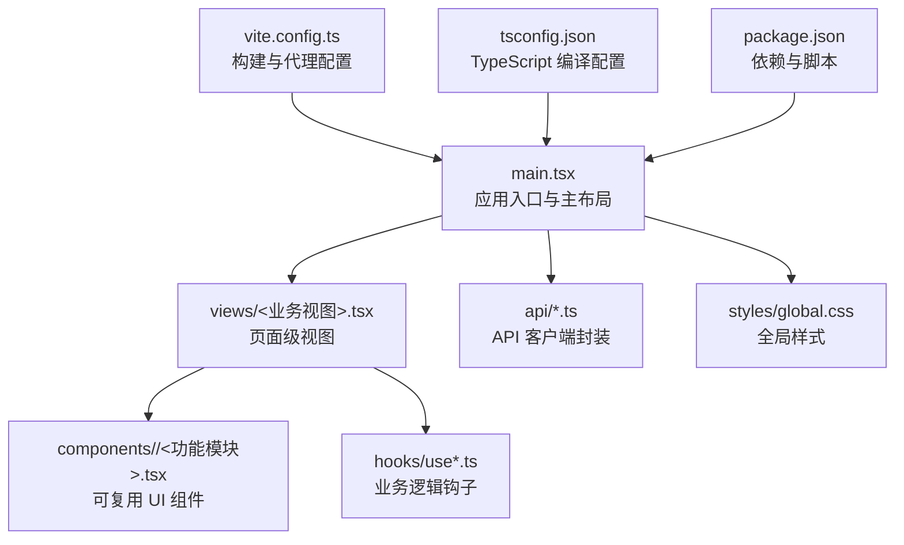
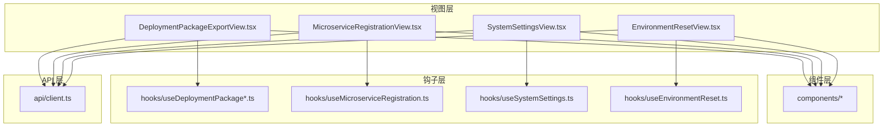
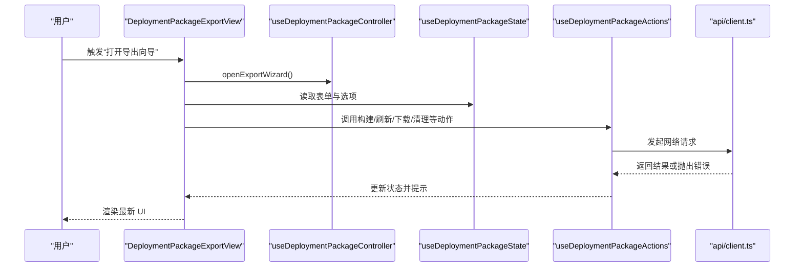
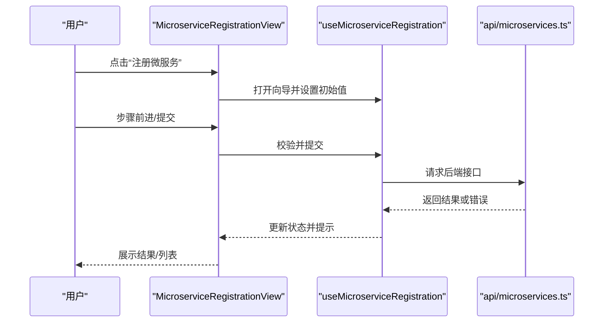
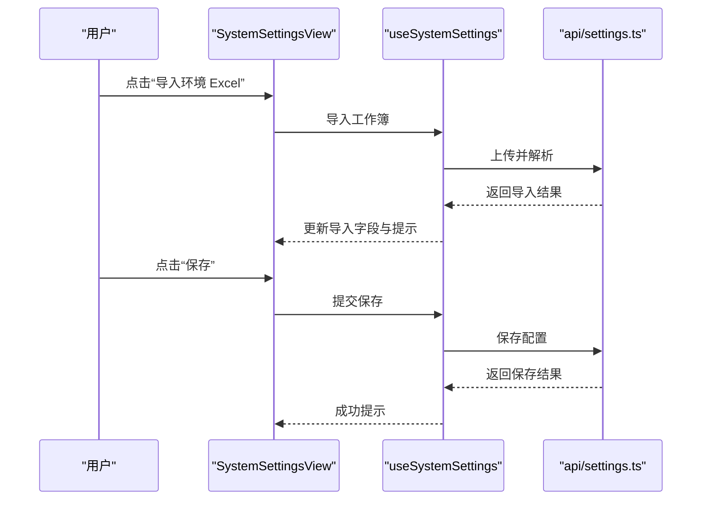
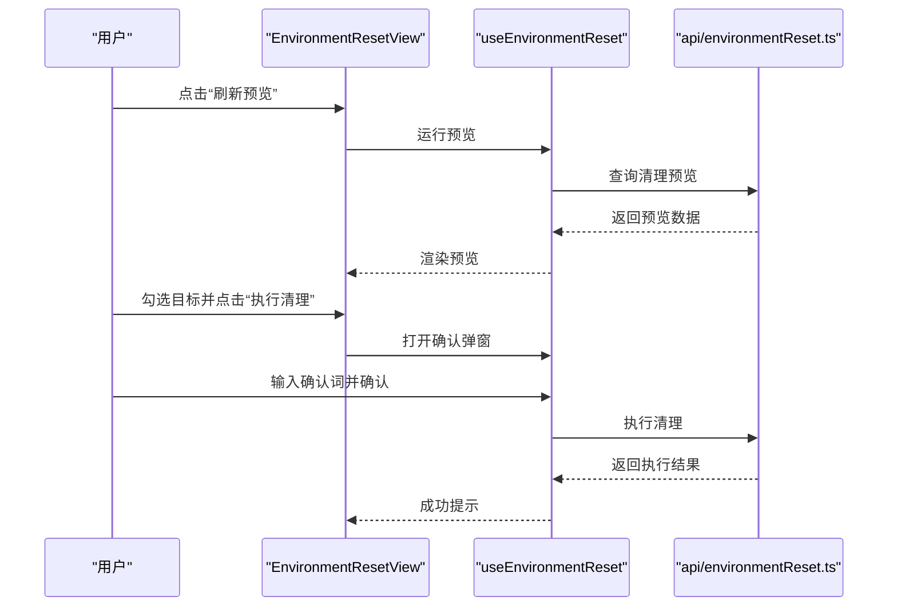
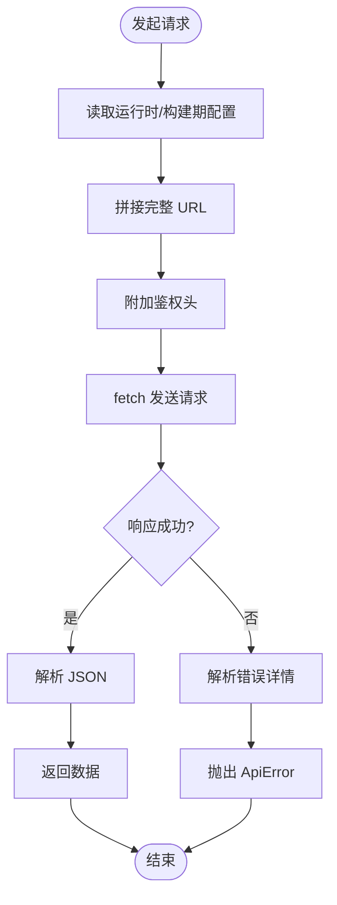
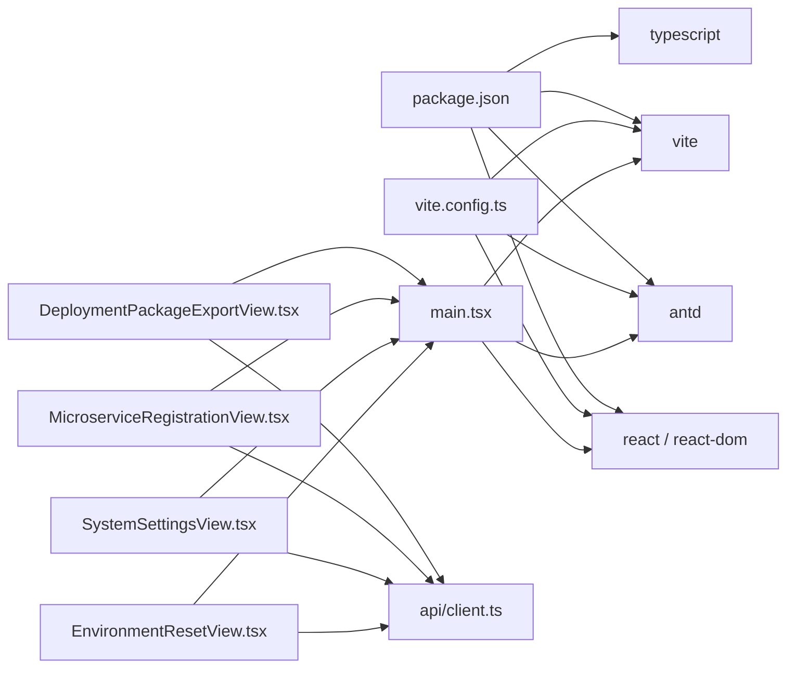

# 前端架构

<cite>
**本文引用的文件**
- [main.tsx](file://frontend/src/main.tsx)
- [DeploymentPackageExportView.tsx](file://frontend/src/views/DeploymentPackageExportView.tsx)
- [MicroserviceRegistrationView.tsx](file://frontend/src/views/MicroserviceRegistrationView.tsx)
- [SystemSettingsView.tsx](file://frontend/src/views/SystemSettingsView.tsx)
- [EnvironmentResetView.tsx](file://frontend/src/views/EnvironmentResetView.tsx)
- [client.ts](file://frontend/src/api/client.ts)
- [global.css](file://frontend/src/styles/global.css)
- [package.json](file://frontend/package.json)
- [vite.config.ts](file://frontend/vite.config.ts)
- [tsconfig.json](file://frontend/tsconfig.json)
</cite>

## 目录
1. [简介](#简介)
2. [项目结构](#项目结构)
3. [核心组件](#核心组件)
4. [架构总览](#架构总览)
5. [详细组件分析](#详细组件分析)
6. [依赖关系分析](#依赖关系分析)
7. [性能考虑](#性能考虑)
8. [故障排查指南](#故障排查指南)
9. [结论](#结论)
10. [附录](#附录)

## 简介
本文件面向“部署包工厂”前端，系统性梳理基于 React 19 + TypeScript 的架构设计与实现要点，覆盖组件层次、状态管理、路由与生命周期、视图组件模式、API 客户端封装、错误处理与加载状态管理、用户体验优化策略，以及 Ant Design 组件库使用、样式组织、响应式与主题定制、构建配置与性能优化等。

## 项目结构
前端采用 Vite + React 19 + TypeScript 技术栈，目录组织以功能域驱动：views 下按业务视图划分（部署包工厂、微服务注册、系统设置、环境清理），api 封装后端接口，styles 提供全局样式与模块化样式，入口在 main.tsx 中装配应用并挂载到 DOM。

图表来源
- [main.tsx:1-81](file://frontend/src/main.tsx#L1-L81)
- [vite.config.ts:1-42](file://frontend/vite.config.ts#L1-L42)
- [tsconfig.json:1-23](file://frontend/tsconfig.json#L1-L23)
- [package.json:1-26](file://frontend/package.json#L1-L26)

章节来源
- [main.tsx:1-81](file://frontend/src/main.tsx#L1-L81)
- [package.json:1-26](file://frontend/package.json#L1-L26)

## 核心组件
- 应用入口与主布局：在入口中引入 Ant Design 国际化与全局样式，使用 Ant Design App 包裹，并以 Tabs 切换四大视图区域，提供统一的导航与容器。
- 视图层：每个业务视图负责自身表单、状态、交互与副作用，通过 hooks 解耦业务逻辑，通过组件拆分职责。
- API 客户端：集中封装请求、鉴权头、下载链接拼装与错误解析，统一对外暴露类型安全的调用方法。
- 样式体系：全局样式定义基础布局与响应式断点；各视图采用模块化 CSS，避免命名冲突。

章节来源
- [main.tsx:1-81](file://frontend/src/main.tsx#L1-L81)
- [global.css:1-64](file://frontend/src/styles/global.css#L1-L64)
- [client.ts:1-83](file://frontend/src/api/client.ts#L1-L83)

## 架构总览
应用采用“视图 + 组件 + 钩子 + API 客户端”的分层架构。视图层负责页面级状态与交互；组件层提供可复用 UI；钩子层封装业务逻辑与副作用；API 层统一处理网络请求与错误。

图表来源
- [DeploymentPackageExportView.tsx:1-135](file://frontend/src/views/DeploymentPackageExportView.tsx#L1-L135)
- [MicroserviceRegistrationView.tsx:1-89](file://frontend/src/views/MicroserviceRegistrationView.tsx#L1-L89)
- [SystemSettingsView.tsx:1-61](file://frontend/src/views/SystemSettingsView.tsx#L1-L61)
- [EnvironmentResetView.tsx:1-46](file://frontend/src/views/EnvironmentResetView.tsx#L1-L46)
- [client.ts:1-83](file://frontend/src/api/client.ts#L1-L83)

## 详细组件分析

### 部署包工厂视图（DeploymentPackageExportView）
- 职责：聚合导出流程的头部操作区、标签页内容、抽屉详情、模态框等，协调状态与动作。
- 状态与动作：通过 useDeploymentPackageState 获取表单与选项状态；useDeploymentPackageActions 暴露业务动作；useDeploymentPackageController 组合控制器逻辑；useDeploymentPackageEffects 处理副作用。
- 生命周期：在渲染时初始化消息通知上下文，随后根据状态变化触发刷新、预览、任务控制等副作用。
- 交互细节：支持构建、刷新、取消、重试、下载产物与校验和、复制续传命令、执行清理等。

图表来源
- [DeploymentPackageExportView.tsx:1-135](file://frontend/src/views/DeploymentPackageExportView.tsx#L1-L135)
- [client.ts:1-83](file://frontend/src/api/client.ts#L1-L83)

章节来源
- [DeploymentPackageExportView.tsx:1-135](file://frontend/src/views/DeploymentPackageExportView.tsx#L1-L135)

### 微服务注册视图（MicroserviceRegistrationView）
- 职责：提供向导式注册流程，展示已注册微服务列表，支持刷新、复制命令、重试交付与状态刷新。
- 状态与动作：useMicroserviceRegistration 管理步骤、表单值、提交状态与结果；Form 与 Ant Design 表单能力配合校验与联动。
- 生命周期：首次进入加载选项与注册列表；向导步骤切换时同步表单值；提交成功后提示并刷新结果。
- 错误处理：对刷新失败进行统一错误提示；复制命令失败兜底提示。

图表来源
- [MicroserviceRegistrationView.tsx:1-89](file://frontend/src/views/MicroserviceRegistrationView.tsx#L1-L89)

章节来源
- [MicroserviceRegistrationView.tsx:1-89](file://frontend/src/views/MicroserviceRegistrationView.tsx#L1-L89)

### 系统设置视图（SystemSettingsView）
- 职责：集中维护系统公共环境配置，支持 Excel 导入、分节编辑、保存与刷新。
- 状态与动作：useSystemSettings 管理活动分区、导入字段、保存与导入状态；Ant Design 表单用于配置项编辑。
- 生命周期：加载设置后渲染对应分区表单；导入完成后高亮最近导入字段；保存成功提示。
- 上传与导入：限制 Excel 类型，阻止默认上传行为，自行处理导入逻辑并反馈结果。

图表来源
- [SystemSettingsView.tsx:1-61](file://frontend/src/views/SystemSettingsView.tsx#L1-L61)

章节来源
- [SystemSettingsView.tsx:1-61](file://frontend/src/views/SystemSettingsView.tsx#L1-L61)

### 环境清理视图（EnvironmentResetView）
- 职责：按范围预览并执行清理，支持选项勾选、预览刷新、二次确认弹窗与执行。
- 状态与动作：useEnvironmentReset 管理预览、选项、确认词与执行状态；通过面板组件承载选项与预览。
- 生命周期：加载选项与预览；勾选目标后启用执行按钮；确认后执行清理并提示结果。

图表来源
- [EnvironmentResetView.tsx:1-46](file://frontend/src/views/EnvironmentResetView.tsx#L1-L46)

章节来源
- [EnvironmentResetView.tsx:1-46](file://frontend/src/views/EnvironmentResetView.tsx#L1-L46)

### API 客户端封装（client.ts）
- 功能：统一请求基址、鉴权头、下载链接拼装、错误解析与类型化返回。
- 配置来源：优先从运行时注入对象读取，其次回退到构建期环境变量。
- 错误模型：定义 ApiError 并从响应体解析详细信息，兼容多种后端错误格式。
- 下载支持：buildDownloadUrl 自动附加令牌参数，便于直链下载。

图表来源
- [client.ts:1-83](file://frontend/src/api/client.ts#L1-L83)

章节来源
- [client.ts:1-83](file://frontend/src/api/client.ts#L1-L83)

### 样式与主题
- 全局样式：定义根变量、基础排版、面板容器与响应式断点，适配移动端紧凑布局。
- 视图样式：各视图采用模块化 CSS，避免全局污染；Ant Design Tabs 内容区最小高度保证滚动体验。
- 主题与国际化：通过 ConfigProvider 注入 zhCN 语言包，确保组件文案与日期等本地化一致。

章节来源
- [global.css:1-64](file://frontend/src/styles/global.css#L1-L64)
- [main.tsx:1-81](file://frontend/src/main.tsx#L1-L81)

## 依赖关系分析
- 组件耦合：视图层仅依赖 hooks 与 components，降低对具体实现的耦合；hooks 仅依赖 API 与内部状态，保持纯函数特性。
- 外部依赖：Ant Design 提供 UI 基础能力；RemixIcon 提供图标资源；Vite 提供构建与开发服务器。
- 代理与别名：开发服务器通过代理转发 /api 与 /health；路径别名 @ 指向 src，提升导入可读性。

图表来源
- [package.json:1-26](file://frontend/package.json#L1-L26)
- [vite.config.ts:1-42](file://frontend/vite.config.ts#L1-L42)
- [main.tsx:1-81](file://frontend/src/main.tsx#L1-L81)
- [DeploymentPackageExportView.tsx:1-135](file://frontend/src/views/DeploymentPackageExportView.tsx#L1-L135)
- [MicroserviceRegistrationView.tsx:1-89](file://frontend/src/views/MicroserviceRegistrationView.tsx#L1-L89)
- [SystemSettingsView.tsx:1-61](file://frontend/src/views/SystemSettingsView.tsx#L1-L61)
- [EnvironmentResetView.tsx:1-46](file://frontend/src/views/EnvironmentResetView.tsx#L1-L46)
- [client.ts:1-83](file://frontend/src/api/client.ts#L1-L83)

章节来源
- [package.json:1-26](file://frontend/package.json#L1-L26)
- [vite.config.ts:1-42](file://frontend/vite.config.ts#L1-L42)

## 性能考虑
- 代码分割：Vite Rollup 输出配置按第三方依赖进行手动分块，将 React 与图标库独立打包，提升缓存命中率。
- 构建体积预警：提高警告阈值以容忍较大依赖，同时结合手动分块策略控制体积。
- 开发体验：代理配置将前端开发服务器与后端服务打通，减少跨域与环境差异带来的调试成本。
- 样式体积：模块化 CSS 与按需引入 Ant Design 组件，避免无谓样式膨胀。

章节来源
- [vite.config.ts:1-42](file://frontend/vite.config.ts#L1-L42)

## 故障排查指南
- 网络请求失败：检查运行时配置是否正确注入，确认鉴权头是否生效；查看 ApiError 的状态码与 detail 字段定位问题。
- 下载失败：确认 buildDownloadUrl 是否附加令牌参数；核对后端路由与权限策略。
- 表单校验与提交：在视图层捕获错误并提示；必要时在 hooks 中增加重试与降级逻辑。
- 加载状态：统一使用 Spin 或组件内置加载态，避免重复请求；对高频刷新操作增加防抖。
- 代理不通：确认 vite.server.proxy 配置与后端监听地址一致；检查防火墙与端口占用。

章节来源
- [client.ts:1-83](file://frontend/src/api/client.ts#L1-L83)
- [vite.config.ts:1-42](file://frontend/vite.config.ts#L1-L42)

## 结论
该前端架构以清晰的分层与职责分离为核心，通过 hooks 抽象业务逻辑、通过组件复用 UI、通过 API 客户端统一网络访问与错误处理，辅以 Ant Design 的本地化与模块化样式，形成可维护、可扩展且具备良好用户体验的前端体系。建议持续完善错误边界与加载态策略，加强单元测试与集成测试覆盖，进一步提升稳定性与可测试性。

## 附录
- 构建与启动：使用 pnpm 管理依赖，开发脚本启动 Vite，生产构建由 Vite 与 TypeScript 编译器协同完成。
- TypeScript 配置：严格模式、ESNext 模块解析、Bundler 分辨策略，确保类型安全与现代语法支持。
- 路由与导航：当前采用 Ant Design Tabs 实现页面级导航，未使用前端路由库，适合单页应用场景。

章节来源
- [package.json:1-26](file://frontend/package.json#L1-L26)
- [tsconfig.json:1-23](file://frontend/tsconfig.json#L1-L23)