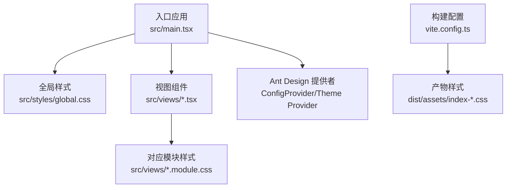
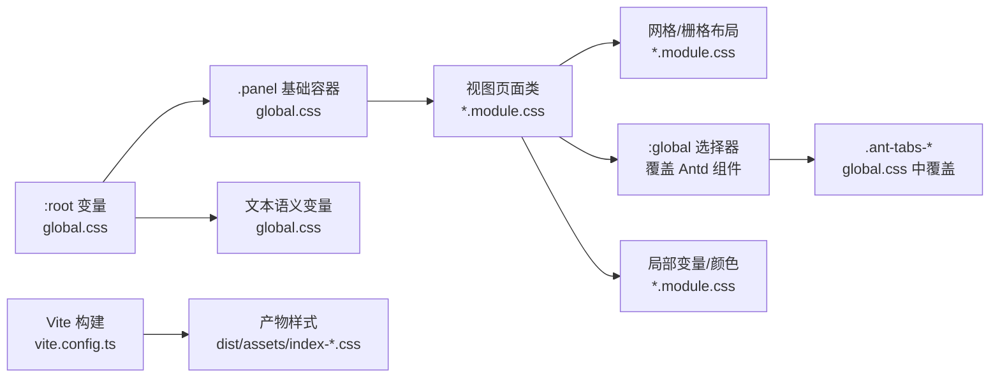
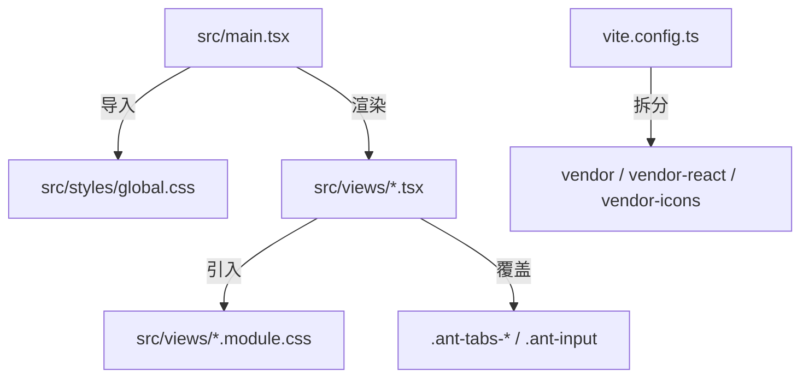

# 样式系统与主题定制

<cite>
**本文引用的文件**
- [frontend/src/styles/global.css](file://frontend/src/styles/global.css)
- [frontend/src/main.tsx](file://frontend/src/main.tsx)
- [frontend/vite.config.ts](file://frontend/vite.config.ts)
- [frontend/package.json](file://frontend/package.json)
- [frontend/tsconfig.json](file://frontend/tsconfig.json)
- [frontend/src/views/DeploymentPackageExportView.module.css](file://frontend/src/views/DeploymentPackageExportView.module.css)
- [frontend/src/views/DeploymentPackageExportView.tsx](file://frontend/src/views/DeploymentPackageExportView.tsx)
- [frontend/src/views/MicroserviceRegistrationView.module.css](file://frontend/src/views/MicroserviceRegistrationView.module.css)
- [frontend/src/views/SystemSettingsView.module.css](file://frontend/src/views/SystemSettingsView.module.css)
- [frontend/dist/assets/index-BMQQSJYY.css](file://frontend/dist/assets/index-BMQQSJYY.css)
</cite>

## 目录
1. [简介](#简介)
2. [项目结构](#项目结构)
3. [核心组件](#核心组件)
4. [架构总览](#架构总览)
5. [详细组件分析](#详细组件分析)
6. [依赖分析](#依赖分析)
7. [性能考虑](#性能考虑)
8. [故障排查指南](#故障排查指南)
9. [结论](#结论)
10. [附录](#附录)

## 简介
本文件面向“部署包工厂”前端的样式系统与主题定制，系统性梳理了基于 CSS Modules 的局部样式组织、全局样式策略、Ant Design 主题覆盖与响应式设计实践，并结合打包与构建配置给出性能优化与开发调试建议。目标是帮助开发者在不破坏组件作用域的前提下，高效地扩展与维护样式体系。

## 项目结构
前端采用 Vite + React + TypeScript 构建，样式层由两部分组成：
- 全局样式：集中于全局 CSS 文件，定义基础变量、排版与通用容器类。
- 局部样式：每个视图使用独立的 CSS Module 文件，通过模块化类名避免冲突。

图表来源
- [frontend/src/main.tsx:1-81](file://frontend/src/main.tsx#L1-L81)
- [frontend/src/styles/global.css:1-64](file://frontend/src/styles/global.css#L1-L64)
- [frontend/vite.config.ts:1-42](file://frontend/vite.config.ts#L1-L42)
- [frontend/src/views/DeploymentPackageExportView.tsx:1-135](file://frontend/src/views/DeploymentPackageExportView.tsx#L1-L135)

章节来源
- [frontend/src/main.tsx:1-81](file://frontend/src/main.tsx#L1-L81)
- [frontend/src/styles/global.css:1-64](file://frontend/src/styles/global.css#L1-L64)
- [frontend/vite.config.ts:1-42](file://frontend/vite.config.ts#L1-L42)

## 核心组件
- 全局样式与设计令牌
  - 使用 CSS 变量作为设计令牌，统一色板与文本语义，便于主题扩展与暗色模式迁移。
  - 定义基础排版、盒模型与通用容器类（如面板、标签页），确保跨视图一致性。
- 视图级 CSS Modules
  - 每个视图拥有独立的模块样式文件，使用网格与栅格布局实现复杂页面结构。
  - 通过 :global 选择器对第三方组件（如 Ant Design）进行有限度覆盖，避免污染其他视图。
- Ant Design 集成
  - 在入口处以 ConfigProvider 注入语言包，保证组件文案与交互符合本地化要求。
  - 通过 :global 选择器对 Antd 组件的导航与内容区进行样式覆盖，保持整体风格一致。

章节来源
- [frontend/src/styles/global.css:1-64](file://frontend/src/styles/global.css#L1-L64)
- [frontend/src/views/DeploymentPackageExportView.module.css:1-871](file://frontend/src/views/DeploymentPackageExportView.module.css#L1-L871)
- [frontend/src/views/DeploymentPackageExportView.module.css:207-295](file://frontend/src/views/DeploymentPackageExportView.module.css#L207-L295)
- [frontend/src/views/DeploymentPackageExportView.tsx:12](file://frontend/src/views/DeploymentPackageExportView.tsx#L12)
- [frontend/src/main.tsx:3-7](file://frontend/src/main.tsx#L3-L7)

## 架构总览
下图展示从入口到视图、再到第三方组件的样式链路，以及如何通过 CSS 变量与 :global 覆盖实现主题与布局的一致性。

图表来源
- [frontend/src/styles/global.css:1-64](file://frontend/src/styles/global.css#L1-L64)
- [frontend/src/views/DeploymentPackageExportView.module.css:1-871](file://frontend/src/views/DeploymentPackageExportView.module.css#L1-L871)
- [frontend/src/views/DeploymentPackageExportView.module.css:207-295](file://frontend/src/views/DeploymentPackageExportView.module.css#L207-L295)
- [frontend/vite.config.ts:1-42](file://frontend/vite.config.ts#L1-L42)
- [frontend/dist/assets/index-BMQQSJYY.css:1-100](file://frontend/dist/assets/index-BMQQSJYY.css#L1-L100)

## 详细组件分析

### 全局样式与设计令牌
- 设计令牌
  - 使用 :root 定义基础变量，如边框色、次级文本色、主文字色、背景色与字体族，形成统一的设计语言。
  - 文本语义变量用于弱化提示信息，提升对比度与可读性。
- 基础排版与容器
  - 重置盒模型与 body 边距，确保跨浏览器一致性。
  - 定义 .panel、.panel-header、.panel-body 等容器类，提供统一的间距与布局基线。
- Antd 标签页覆盖
  - 对 .ant-tabs-nav 与 .ant-tabs-content 进行覆盖，控制标签页背景与最小高度，适配全屏内容区。

章节来源
- [frontend/src/styles/global.css:1-7](file://frontend/src/styles/global.css#L1-L7)
- [frontend/src/styles/global.css:9-15](file://frontend/src/styles/global.css#L9-L15)
- [frontend/src/styles/global.css:17-48](file://frontend/src/styles/global.css#L17-L48)
- [frontend/src/styles/global.css:54-63](file://frontend/src/styles/global.css#L54-L63)

### 视图级 CSS Modules 组织
- 命名规范
  - 类名采用功能语义化命名，如 .page、.content、.panel、.sectionTitle 等，配合网格布局语义清晰。
  - 模块内类名经编译后带唯一哈希后缀，避免全局冲突。
- 作用域管理
  - 通过 import styles from "./View.module.css" 引入类名，仅在当前组件生效。
  - 使用 :global 选择器对特定第三方组件进行有限覆盖，降低耦合风险。
- 继承关系
  - 多数视图类会复用 .panel 与 .panel-* 基础容器，保证页面骨架一致。
  - 不同视图在 .page 下再细分 .content、.layout 等子网格，形成“父-子”层级关系。

章节来源
- [frontend/src/views/DeploymentPackageExportView.module.css:1-200](file://frontend/src/views/DeploymentPackageExportView.module.css#L1-L200)
- [frontend/src/views/DeploymentPackageExportView.module.css:207-295](file://frontend/src/views/DeploymentPackageExportView.module.css#L207-L295)
- [frontend/src/views/MicroserviceRegistrationView.module.css:1-120](file://frontend/src/views/MicroserviceRegistrationView.module.css#L1-L120)
- [frontend/src/views/SystemSettingsView.module.css:1-120](file://frontend/src/views/SystemSettingsView.module.css#L1-L120)

### Ant Design 主题定制与覆盖
- 本地化与主题注入
  - 在入口通过 ConfigProvider 注入 zhCN 语言包，确保组件文案与交互符合中文场景。
- 组件样式覆盖
  - 使用 :global 选择器对 .ant-tabs-nav 与 .ant-input 等组件进行覆盖，限定在当前模块作用域内，避免影响其他视图。
  - 通过 Antd 提供的受控属性与 CSS 变量，实现组件状态下的视觉一致性。

章节来源
- [frontend/src/main.tsx:3-7](file://frontend/src/main.tsx#L3-L7)
- [frontend/src/views/DeploymentPackageExportView.module.css:207-295](file://frontend/src/views/DeploymentPackageExportView.module.css#L207-L295)

### 响应式设计实现
- 断点策略
  - 采用 1120px、1060px、720px 三档断点，分别适配中宽屏、大屏与移动端。
- 弹性布局
  - 使用 CSS Grid 与 minmax、repeat 等特性，实现自适应列宽与等分布局。
  - 在小屏设备上将多列栅格折叠为单列，保证内容可读性与操作效率。
- 移动端适配
  - 小屏时调整对齐方式、方向与间距，确保触摸友好与信息层级清晰。

章节来源
- [frontend/src/views/DeploymentPackageExportView.module.css:818-825](file://frontend/src/views/DeploymentPackageExportView.module.css#L818-L825)
- [frontend/src/views/MicroserviceRegistrationView.module.css:239-260](file://frontend/src/views/MicroserviceRegistrationView.module.css#L239-L260)
- [frontend/src/views/SystemSettingsView.module.css:109-129](file://frontend/src/views/SystemSettingsView.module.css#L109-L129)
- [frontend/src/styles/global.css:54-63](file://frontend/src/styles/global.css#L54-L63)

### 样式性能优化与打包配置
- 分包与体积控制
  - Vite 配置按依赖来源拆分 vendor、vendor-react、vendor-icons 等分包，减少重复依赖与缓存命中成本。
  - 合理拆分有助于缩小首屏样式体积，提升加载速度。
- 构建产物定位
  - 产物样式位于 dist/assets/index-*.css，可通过浏览器 DevTools Network 面板观察加载情况与缓存策略。
- 开发体验
  - TypeScript 配置启用严格模式与 Bundler 解析，提升类型安全与模块解析效率。
  - Vite 插件链路简洁，热更新与预构建开箱即用。

章节来源
- [frontend/vite.config.ts:1-42](file://frontend/vite.config.ts#L1-L42)
- [frontend/package.json:1-26](file://frontend/package.json#L1-L26)
- [frontend/tsconfig.json:1-23](file://frontend/tsconfig.json#L1-L23)
- [frontend/dist/assets/index-BMQQSJYY.css:1-100](file://frontend/dist/assets/index-BMQQSJYY.css#L1-L100)

### 开发调试技巧
- 变量与覆盖调试
  - 利用浏览器开发者工具查看 :root 变量与模块类名映射，确认变量是否正确继承。
  - 通过 :global 选择器覆盖时，优先在当前模块内验证，避免全局污染。
- 响应式调试
  - 使用浏览器设备模拟或手动缩放，检查断点处布局变化与元素换行行为。
- 构建与缓存
  - 关注 dist 目录产物大小与缓存键变更，结合网络面板定位加载瓶颈。

章节来源
- [frontend/src/styles/global.css:1-7](file://frontend/src/styles/global.css#L1-L7)
- [frontend/src/views/DeploymentPackageExportView.module.css:207-295](file://frontend/src/views/DeploymentPackageExportView.module.css#L207-L295)
- [frontend/vite.config.ts:1-42](file://frontend/vite.config.ts#L1-L42)

## 依赖分析
- 组件耦合
  - 视图组件依赖各自模块样式，耦合度低；全局样式被所有视图共享，形成统一基线。
  - Antd 组件通过 :global 有限覆盖，避免直接修改第三方源码。
- 外部依赖
  - antd 与 remixicon 作为外部资源，经 Vite 拆分为独立分包，降低主包体积。
- 接口契约
  - 入口通过 ConfigProvider 注入语言包，视图无需感知具体主题细节，职责清晰。

图表来源
- [frontend/src/main.tsx:1-81](file://frontend/src/main.tsx#L1-L81)
- [frontend/src/views/DeploymentPackageExportView.tsx:12](file://frontend/src/views/DeploymentPackageExportView.tsx#L12)
- [frontend/src/views/DeploymentPackageExportView.module.css:207-295](file://frontend/src/views/DeploymentPackageExportView.module.css#L207-L295)
- [frontend/vite.config.ts:1-42](file://frontend/vite.config.ts#L1-L42)

章节来源
- [frontend/src/main.tsx:1-81](file://frontend/src/main.tsx#L1-L81)
- [frontend/src/views/DeploymentPackageExportView.tsx:12](file://frontend/src/views/DeploymentPackageExportView.tsx#L12)
- [frontend/vite.config.ts:1-42](file://frontend/vite.config.ts#L1-L42)

## 性能考虑
- 样式体积控制
  - 优先使用 CSS 变量与局部类，减少重复样式声明。
  - 将第三方组件覆盖限制在必要范围，避免冗余规则。
- 加载与缓存
  - 通过 Vite 分包策略降低主包体积，结合浏览器缓存提升二次访问性能。
- 渲染效率
  - 使用 CSS Grid 与 Flexible 布局，减少 JS 计算与 DOM 重排。
- 开发与生产差异
  - 生产构建关注产物体积与缓存键稳定性，开发阶段注重热更新与错误提示。

## 故障排查指南
- 样式未生效
  - 检查类名拼写与模块导入路径，确认是否正确引入 styles 对象。
  - 若需覆盖 Antd 组件，确认使用 :global 且限定在当前模块作用域。
- 响应式异常
  - 核对断点值与媒体查询顺序，确保在小屏设备上布局正确。
  - 使用浏览器设备模式逐项验证断点处的换列与间距变化。
- 构建问题
  - 查看 dist 目录产物是否存在，确认 Vite 配置中的别名与代理设置。
  - 如出现缓存导致的样式不更新，清理浏览器缓存或强制刷新。

章节来源
- [frontend/src/views/DeploymentPackageExportView.module.css:207-295](file://frontend/src/views/DeploymentPackageExportView.module.css#L207-L295)
- [frontend/src/styles/global.css:54-63](file://frontend/src/styles/global.css#L54-L63)
- [frontend/vite.config.ts:35-41](file://frontend/vite.config.ts#L35-L41)

## 结论
该样式系统以 CSS 变量为设计令牌，结合 CSS Modules 的作用域隔离与 Antd 的有限覆盖，实现了高内聚、低耦合的样式组织方式。通过三档断点与网格布局，满足多终端适配需求；借助 Vite 的分包策略，兼顾开发体验与运行性能。建议在后续迭代中持续沉淀设计令牌、收敛覆盖范围，并完善自动化测试与性能监控，以保障样式体系的长期可维护性。

## 附录
- 最佳实践清单
  - 使用语义化类名与层级命名，配合模块化作用域。
  - 优先通过 CSS 变量统一色板与文本语义，减少硬编码。
  - 限制 :global 覆盖范围，仅在必要时对第三方组件进行局部调整。
  - 以断点为单位进行响应式验证，确保在各终端上的可用性。
  - 关注构建产物体积与缓存策略，定期评估与优化。