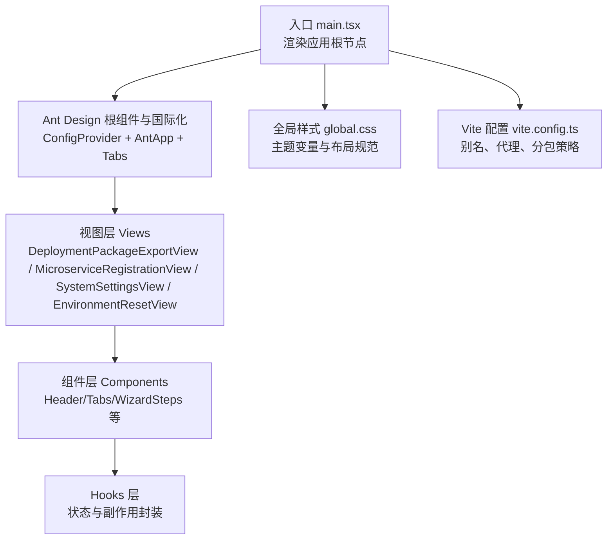
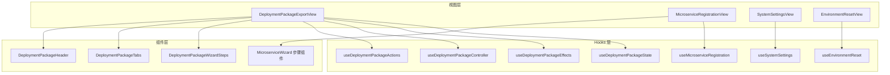
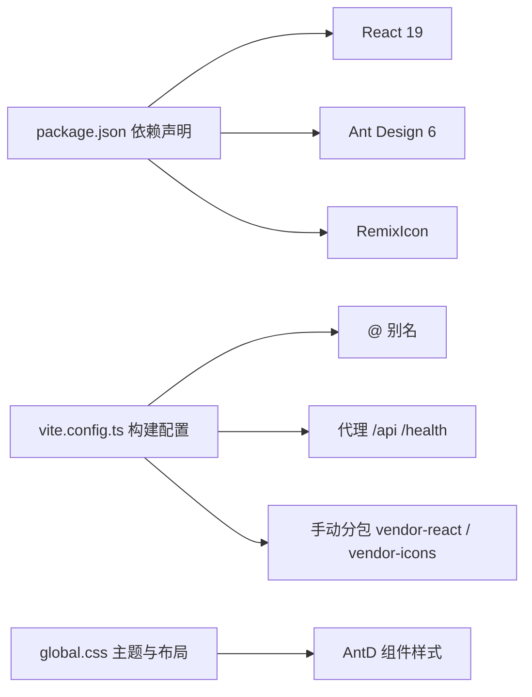
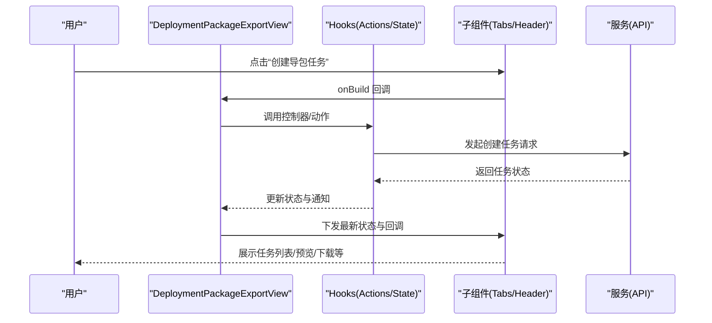

# 组件架构设计

<cite>
**本文引用的文件**
- [frontend/src/main.tsx](file://frontend/src/main.tsx)
- [frontend/package.json](file://frontend/package.json)
- [frontend/vite.config.ts](file://frontend/vite.config.ts)
- [frontend/src/styles/global.css](file://frontend/src/styles/global.css)
- [frontend/src/views/DeploymentPackageExportView.tsx](file://frontend/src/views/DeploymentPackageExportView.tsx)
- [frontend/src/views/MicroserviceRegistrationView.tsx](file://frontend/src/views/MicroserviceRegistrationView.tsx)
- [frontend/src/views/SystemSettingsView.tsx](file://frontend/src/views/SystemSettingsView.tsx)
- [frontend/src/views/EnvironmentResetView.tsx](file://frontend/src/views/EnvironmentResetView.tsx)
- [frontend/src/views/components/DeploymentPackageTabs.tsx](file://frontend/src/views/components/DeploymentPackageTabs.tsx)
- [frontend/src/views/components/DeploymentPackageHeader.tsx](file://frontend/src/views/components/DeploymentPackageHeader.tsx)
- [frontend/src/views/components/microserviceWizard/types.ts](file://frontend/src/views/components/microserviceWizard/types.ts)
- [frontend/src/views/components/DeploymentPackageWizardSteps.tsx](file://frontend/src/views/components/DeploymentPackageWizardSteps.tsx)
</cite>

## 目录
1. [引言](#引言)
2. [项目结构](#项目结构)
3. [核心组件](#核心组件)
4. [架构总览](#架构总览)
5. [组件详解](#组件详解)
6. [依赖关系分析](#依赖关系分析)
7. [性能考量](#性能考量)
8. [故障排查指南](#故障排查指南)
9. [结论](#结论)
10. [附录](#附录)

## 引言
本文件面向部署包工厂前端，系统性梳理基于 React 19 的组件架构与设计模式，重点覆盖：
- 函数组件实现与组件层次结构
- 父子组件通信机制与状态提升策略
- Ant Design 在项目中的使用策略（ConfigProvider 国际化、Tabs 导航、全局样式）
- 生命周期管理、事件处理与组件复用
- 错误边界与异常处理、开发最佳实践与性能优化建议

## 项目结构
前端采用 Vite + React 19 + TypeScript 构建，Ant Design 作为 UI 基础库，配合模块化样式组织与按需分包策略，形成清晰的视图层与组件层分离。

图表来源
- [frontend/src/main.tsx:1-81](file://frontend/src/main.tsx#L1-L81)
- [frontend/src/styles/global.css:1-64](file://frontend/src/styles/global.css#L1-L64)
- [frontend/vite.config.ts:1-42](file://frontend/vite.config.ts#L1-L42)

章节来源
- [frontend/src/main.tsx:1-81](file://frontend/src/main.tsx#L1-L81)
- [frontend/package.json:1-26](file://frontend/package.json#L1-L26)
- [frontend/vite.config.ts:1-42](file://frontend/vite.config.ts#L1-L42)
- [frontend/src/styles/global.css:1-64](file://frontend/src/styles/global.css#L1-L64)

## 核心组件
- 应用入口与导航
  - 入口文件以 StrictMode 包裹，使用 ConfigProvider 设置语言为 zhCN，并以 AntApp 包裹全局样式；顶层以 Tabs 实现主菜单式导航，每个 Tab 对应一个视图。
  - 关键路径参考：[frontend/src/main.tsx:13-70](file://frontend/src/main.tsx#L13-L70)、[frontend/src/main.tsx:72-80](file://frontend/src/main.tsx#L72-L80)。
- 视图组件
  - 部署包导出视图：聚合 Header、Tabs 子面板、抽屉与模态框，协调 Actions/Hooks 管理状态与副作用。
    - 参考：[frontend/src/views/DeploymentPackageExportView.tsx:15-134](file://frontend/src/views/DeploymentPackageExportView.tsx#L15-L134)。
  - 微服务注册视图：向导驱动的多步骤流程，结果面板与已注册服务列表展示。
    - 参考：[frontend/src/views/MicroserviceRegistrationView.tsx:11-88](file://frontend/src/views/MicroserviceRegistrationView.tsx#L11-L88)。
  - 系统设置视图：Excel 导入、分节表单与保存逻辑。
    - 参考：[frontend/src/views/SystemSettingsView.tsx:10-59](file://frontend/src/views/SystemSettingsView.tsx#L10-L59)。
  - 环境清理视图：预览、选项勾选与二次确认执行。
    - 参考：[frontend/src/views/EnvironmentResetView.tsx:7-44](file://frontend/src/views/EnvironmentResetView.tsx#L7-L44)。

章节来源
- [frontend/src/main.tsx:13-70](file://frontend/src/main.tsx#L13-L70)
- [frontend/src/views/DeploymentPackageExportView.tsx:15-134](file://frontend/src/views/DeploymentPackageExportView.tsx#L15-L134)
- [frontend/src/views/MicroserviceRegistrationView.tsx:11-88](file://frontend/src/views/MicroserviceRegistrationView.tsx#L11-L88)
- [frontend/src/views/SystemSettingsView.tsx:10-59](file://frontend/src/views/SystemSettingsView.tsx#L10-L59)
- [frontend/src/views/EnvironmentResetView.tsx:7-44](file://frontend/src/views/EnvironmentResetView.tsx#L7-L44)

## 架构总览
整体采用“视图层-组件层-Hooks 层”的三层结构，视图负责编排，组件负责展示与交互，Hooks 封装状态与副作用，Ant Design 提供一致的 UI 体验与国际化支持。

图表来源
- [frontend/src/views/DeploymentPackageExportView.tsx:15-134](file://frontend/src/views/DeploymentPackageExportView.tsx#L15-L134)
- [frontend/src/views/MicroserviceRegistrationView.tsx:11-88](file://frontend/src/views/MicroserviceRegistrationView.tsx#L11-L88)
- [frontend/src/views/SystemSettingsView.tsx:10-59](file://frontend/src/views/SystemSettingsView.tsx#L10-L59)
- [frontend/src/views/EnvironmentResetView.tsx:7-44](file://frontend/src/views/EnvironmentResetView.tsx#L7-L44)
- [frontend/src/views/components/DeploymentPackageHeader.tsx:16-32](file://frontend/src/views/components/DeploymentPackageHeader.tsx#L16-L32)
- [frontend/src/views/components/DeploymentPackageTabs.tsx:43-94](file://frontend/src/views/components/DeploymentPackageTabs.tsx#L43-L94)
- [frontend/src/views/components/DeploymentPackageWizardSteps.tsx:10-89](file://frontend/src/views/components/DeploymentPackageWizardSteps.tsx#L10-L89)

## 组件详解

### 函数组件与层次结构
- 入口与导航
  - 使用 ConfigProvider(locale=zhCN) 与 AntApp 提供全局上下文，顶层 Tabs 作为主菜单，每个 Tab 对应一个视图容器。
  - 参考：[frontend/src/main.tsx:72-79](file://frontend/src/main.tsx#L72-L79)、[frontend/src/main.tsx:13-70](file://frontend/src/main.tsx#L13-L70)。
- 视图编排
  - 部署包导出视图集中注入多个子组件与模态框，通过 Hooks 暴露的动作与状态进行数据流控制。
  - 参考：[frontend/src/views/DeploymentPackageExportView.tsx:43-131](file://frontend/src/views/DeploymentPackageExportView.tsx#L43-L131)。
- 组件拆分
  - Header/Tabs 等通用组件被多个视图复用，降低耦合度，提升可维护性。
  - 参考：[frontend/src/views/components/DeploymentPackageHeader.tsx:16-32](file://frontend/src/views/components/DeploymentPackageHeader.tsx#L16-L32)、[frontend/src/views/components/DeploymentPackageTabs.tsx:43-94](file://frontend/src/views/components/DeploymentPackageTabs.tsx#L43-L94)。

章节来源
- [frontend/src/main.tsx:13-70](file://frontend/src/main.tsx#L13-L70)
- [frontend/src/views/DeploymentPackageExportView.tsx:43-131](file://frontend/src/views/DeploymentPackageExportView.tsx#L43-L131)
- [frontend/src/views/components/DeploymentPackageHeader.tsx:16-32](file://frontend/src/views/components/DeploymentPackageHeader.tsx#L16-L32)
- [frontend/src/views/components/DeploymentPackageTabs.tsx:43-94](file://frontend/src/views/components/DeploymentPackageTabs.tsx#L43-L94)

### 父子组件通信与状态提升
- 事件回调下沉
  - 父组件通过 props 向子组件传递回调函数，子组件在交互后调用回调，实现自底向上的状态变更通知。
  - 示例：Header 的按钮点击回调由父组件传入，触发刷新任务、检查镜像环境等动作。
  - 参考：[frontend/src/views/components/DeploymentPackageHeader.tsx:9-13](file://frontend/src/views/components/DeploymentPackageHeader.tsx#L9-L13)、[frontend/src/views/DeploymentPackageExportView.tsx:45-55](file://frontend/src/views/DeploymentPackageExportView.tsx#L45-L55)。
- 状态提升与集中管理
  - 复杂状态与副作用通过 Hooks 抽象，父组件接收 Hook 返回的状态与动作，再下放给子组件，避免跨层级共享状态。
  - 参考：[frontend/src/views/DeploymentPackageExportView.tsx:22-41](file://frontend/src/views/DeploymentPackageExportView.tsx#L22-L41)。
- 表单与值同步
  - 微服务注册视图通过 Form 实例与 onValuesChange 同步表单值，结合业务平台联动计算默认命名空间等。
  - 参考：[frontend/src/views/MicroserviceRegistrationView.tsx:29-32](file://frontend/src/views/MicroserviceRegistrationView.tsx#L29-L32)、[frontend/src/views/components/microserviceWizard/types.ts:7-16](file://frontend/src/views/components/microserviceWizard/types.ts#L7-L16)。

章节来源
- [frontend/src/views/components/DeploymentPackageHeader.tsx:9-13](file://frontend/src/views/components/DeploymentPackageHeader.tsx#L9-L13)
- [frontend/src/views/DeploymentPackageExportView.tsx:22-55](file://frontend/src/views/DeploymentPackageExportView.tsx#L22-L55)
- [frontend/src/views/MicroserviceRegistrationView.tsx:29-32](file://frontend/src/views/MicroserviceRegistrationView.tsx#L29-L32)
- [frontend/src/views/components/microserviceWizard/types.ts:7-16](file://frontend/src/views/components/microserviceWizard/types.ts#L7-L16)

### Ant Design 使用策略
- 国际化与主题
  - ConfigProvider 设置 locale=zhCN，确保组件文案与日期时间格式符合中文场景。
  - 参考：[frontend/src/main.tsx:74](file://frontend/src/main.tsx#L74)。
- 导航结构
  - 顶层 Tabs 作为主菜单，每个 Tab 对应一个视图区域，内容区采用 panel-header/panel-body 布局规范。
  - 参考：[frontend/src/main.tsx:13-70](file://frontend/src/main.tsx#L13-L70)、[frontend/src/styles/global.css:17-42](file://frontend/src/styles/global.css#L17-L42)。
- 全局样式管理
  - 使用 CSS 变量定义主题色与字体，统一面板与标签页样式，响应式适配移动端。
  - 参考：[frontend/src/styles/global.css:1-64](file://frontend/src/styles/global.css#L1-L64)。

章节来源
- [frontend/src/main.tsx:74](file://frontend/src/main.tsx#L74)
- [frontend/src/main.tsx:13-70](file://frontend/src/main.tsx#L13-L70)
- [frontend/src/styles/global.css:1-64](file://frontend/src/styles/global.css#L1-L64)

### 生命周期管理与事件处理
- 渲染期初始化
  - 视图组件在挂载后通过 Hooks 初始化状态与副作用，随后根据用户操作或定时刷新触发重新渲染。
  - 参考：[frontend/src/views/DeploymentPackageExportView.tsx:21-41](file://frontend/src/views/DeploymentPackageExportView.tsx#L21-L41)。
- 事件处理
  - 按钮点击、表单校验、文件上传等事件均通过 Ant Design 组件提供的回调参数处理，避免直接操作 DOM。
  - 参考：[frontend/src/views/MicroserviceRegistrationView.tsx:16-27](file://frontend/src/views/MicroserviceRegistrationView.tsx#L16-L27)、[frontend/src/views/SystemSettingsView.tsx:15-25](file://frontend/src/views/SystemSettingsView.tsx#L15-L25)。
- 交互反馈
  - 使用 App.useApp().message 提供成功/警告/错误提示，保证一致的用户反馈。
  - 参考：[frontend/src/views/DeploymentPackageExportView.tsx:16](file://frontend/src/views/DeploymentPackageExportView.tsx#L16)、[frontend/src/views/MicroserviceRegistrationView.tsx:12](file://frontend/src/views/MicroserviceRegistrationView.tsx#L12)。

章节来源
- [frontend/src/views/DeploymentPackageExportView.tsx:21-41](file://frontend/src/views/DeploymentPackageExportView.tsx#L21-L41)
- [frontend/src/views/MicroserviceRegistrationView.tsx:16-27](file://frontend/src/views/MicroserviceRegistrationView.tsx#L16-L27)
- [frontend/src/views/SystemSettingsView.tsx:15-25](file://frontend/src/views/SystemSettingsView.tsx#L15-L25)

### 组件复用与 Props 规范
- 复用模式
  - Header/Tabs 等通用组件在多个视图中复用，减少重复代码，提高一致性。
  - 参考：[frontend/src/views/components/DeploymentPackageHeader.tsx:16-32](file://frontend/src/views/components/DeploymentPackageHeader.tsx#L16-L32)、[frontend/src/views/components/DeploymentPackageTabs.tsx:43-94](file://frontend/src/views/components/DeploymentPackageTabs.tsx#L43-L94)。
- Props 规范
  - 明确输入类型与可选字段，如 WizardStepProps、MicroserviceWizardStepProps，确保类型安全与接口契约清晰。
  - 参考：[frontend/src/views/components/microserviceWizard/types.ts:7-16](file://frontend/src/views/components/microserviceWizard/types.ts#L7-L16)、[frontend/src/views/components/DeploymentPackageWizardSteps.tsx:51-89](file://frontend/src/views/components/DeploymentPackageWizardSteps.tsx#L51-L89)。

章节来源
- [frontend/src/views/components/DeploymentPackageHeader.tsx:16-32](file://frontend/src/views/components/DeploymentPackageHeader.tsx#L16-L32)
- [frontend/src/views/components/DeploymentPackageTabs.tsx:43-94](file://frontend/src/views/components/DeploymentPackageTabs.tsx#L43-L94)
- [frontend/src/views/components/microserviceWizard/types.ts:7-16](file://frontend/src/views/components/microserviceWizard/types.ts#L7-L16)
- [frontend/src/views/components/DeploymentPackageWizardSteps.tsx:51-89](file://frontend/src/views/components/DeploymentPackageWizardSteps.tsx#L51-L89)

### 错误边界与异常处理
- 组件级错误处理
  - 视图层通过 App.useApp().message 提示错误，如刷新失败、复制失败等，避免未捕获异常导致页面崩溃。
  - 参考：[frontend/src/views/MicroserviceRegistrationView.tsx:34-41](file://frontend/src/views/MicroserviceRegistrationView.tsx#L34-L41)。
- 网络与外部资源
  - Vite 代理到后端服务，前端通过统一的 API 客户端发起请求，错误统一在视图层处理。
  - 参考：[frontend/vite.config.ts:35-40](file://frontend/vite.config.ts#L35-L40)。

章节来源
- [frontend/src/views/MicroserviceRegistrationView.tsx:34-41](file://frontend/src/views/MicroserviceRegistrationView.tsx#L34-L41)
- [frontend/vite.config.ts:35-40](file://frontend/vite.config.ts#L35-L40)

### 开发最佳实践
- 组件职责单一：头部、标签页、向导步骤各司其职，便于测试与演进。
- Hooks 分层：将状态与副作用抽象到独立 Hooks，保持视图组件简洁。
- 类型约束：通过 TypeScript 接口约束 Props，降低运行时风险。
- 事件与回调：优先使用回调而非直接状态提升，保持数据流向清晰。

## 依赖关系分析
- 运行时依赖
  - React 19、React DOM 19、Ant Design 6、RemixIcon 字体图标。
  - 参考：[frontend/package.json:12-20](file://frontend/package.json#L12-L20)。
- 构建与分包
  - Vite 插件 React、别名 @ 指向 src、代理 /api 与 /health 到后端；Rollup 手动分包策略将 react、remixicon 等拆分为独立 chunk。
  - 参考：[frontend/vite.config.ts:1-42](file://frontend/vite.config.ts#L1-L42)。
- 样式与主题
  - 全局 CSS 定义主题变量与布局，Ant Design 样式随组件按需加载。
  - 参考：[frontend/src/styles/global.css:1-64](file://frontend/src/styles/global.css#L1-L64)。

图表来源
- [frontend/package.json:12-20](file://frontend/package.json#L12-L20)
- [frontend/vite.config.ts:1-42](file://frontend/vite.config.ts#L1-L42)
- [frontend/src/styles/global.css:1-64](file://frontend/src/styles/global.css#L1-L64)

章节来源
- [frontend/package.json:12-20](file://frontend/package.json#L12-L20)
- [frontend/vite.config.ts:1-42](file://frontend/vite.config.ts#L1-L42)
- [frontend/src/styles/global.css:1-64](file://frontend/src/styles/global.css#L1-L64)

## 性能考量
- 代码分割与懒加载
  - 通过 Vite 的 manualChunks 将第三方库拆分，减少首屏体积与缓存命中率。
  - 参考：[frontend/vite.config.ts:10-26](file://frontend/vite.config.ts#L10-L26)。
- 组件渲染优化
  - 使用 useMemo 缓存通知对象，避免不必要的渲染。
  - 参考：[frontend/src/views/DeploymentPackageExportView.tsx:20](file://frontend/src/views/DeploymentPackageExportView.tsx#L20)。
- 表单与异步
  - 表单校验与网络请求在后台执行，避免阻塞 UI；必要时使用 loading 状态提示。
  - 参考：[frontend/src/views/MicroserviceRegistrationView.tsx:53-68](file://frontend/src/views/MicroserviceRegistrationView.tsx#L53-L68)、[frontend/src/views/SystemSettingsView.tsx:35-41](file://frontend/src/views/SystemSettingsView.tsx#L35-L41)。

## 故障排查指南
- 国际化显示异常
  - 检查 ConfigProvider locale 是否正确设置为 zhCN。
  - 参考：[frontend/src/main.tsx:74](file://frontend/src/main.tsx#L74)。
- 导航不显示或样式错乱
  - 确认 Tabs items 结构与 className 是否正确，以及 global.css 中 .app-tabs 样式是否生效。
  - 参考：[frontend/src/main.tsx:13-70](file://frontend/src/main.tsx#L13-L70)、[frontend/src/styles/global.css:44-52](file://frontend/src/styles/global.css#L44-L52)。
- 表单提交失败
  - 查看 onValuesChange 与 validateFields 的调用顺序，确保表单值同步后再提交。
  - 参考：[frontend/src/views/MicroserviceRegistrationView.tsx:22-32](file://frontend/src/views/MicroserviceRegistrationView.tsx#L22-L32)。
- 网络请求 404/500
  - 检查 Vite 代理配置与后端服务连通性。
  - 参考：[frontend/vite.config.ts:35-40](file://frontend/vite.config.ts#L35-L40)。

章节来源
- [frontend/src/main.tsx:74](file://frontend/src/main.tsx#L74)
- [frontend/src/main.tsx:13-70](file://frontend/src/main.tsx#L13-L70)
- [frontend/src/styles/global.css:44-52](file://frontend/src/styles/global.css#L44-L52)
- [frontend/src/views/MicroserviceRegistrationView.tsx:22-32](file://frontend/src/views/MicroserviceRegistrationView.tsx#L22-L32)
- [frontend/vite.config.ts:35-40](file://frontend/vite.config.ts#L35-L40)

## 结论
本项目以 React 19 为基础，结合 Ant Design 的组件体系与国际化能力，构建了清晰的视图-组件-Hooks 分层架构。通过严格的 Props 类型约束、事件回调下沉与状态提升策略，实现了高内聚低耦合的组件设计。配合 Vite 的分包与代理配置，兼顾了开发体验与运行性能。后续可在以下方面持续优化：完善错误边界与全局异常处理、引入更细粒度的懒加载与缓存策略、增强组件单元测试覆盖率。

## 附录
- 关键流程示意：部署包导出视图的数据流与交互序列

图表来源
- [frontend/src/views/DeploymentPackageExportView.tsx:45-118](file://frontend/src/views/DeploymentPackageExportView.tsx#L45-L118)
- [frontend/src/views/components/DeploymentPackageHeader.tsx:16-32](file://frontend/src/views/components/DeploymentPackageHeader.tsx#L16-L32)
- [frontend/src/views/components/DeploymentPackageTabs.tsx:59-94](file://frontend/src/views/components/DeploymentPackageTabs.tsx#L59-L94)