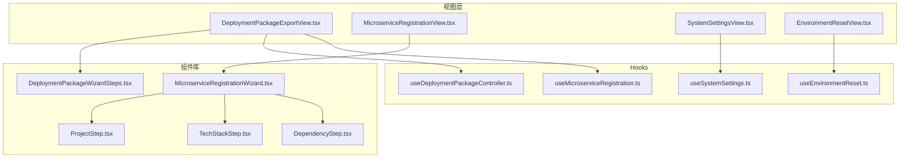
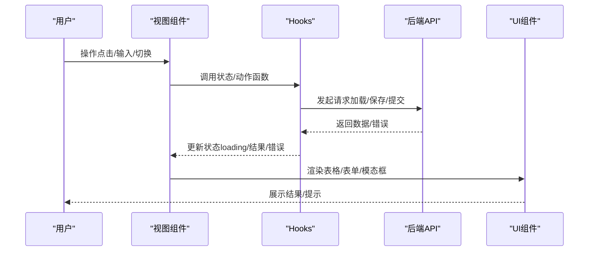
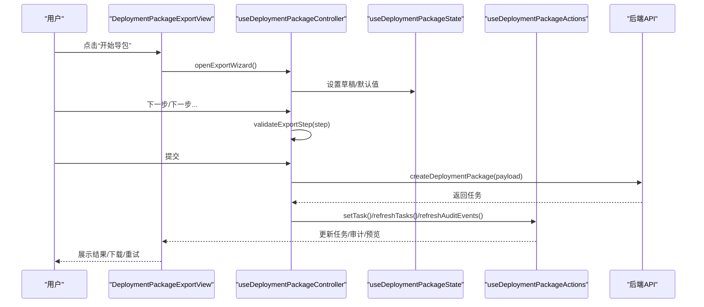
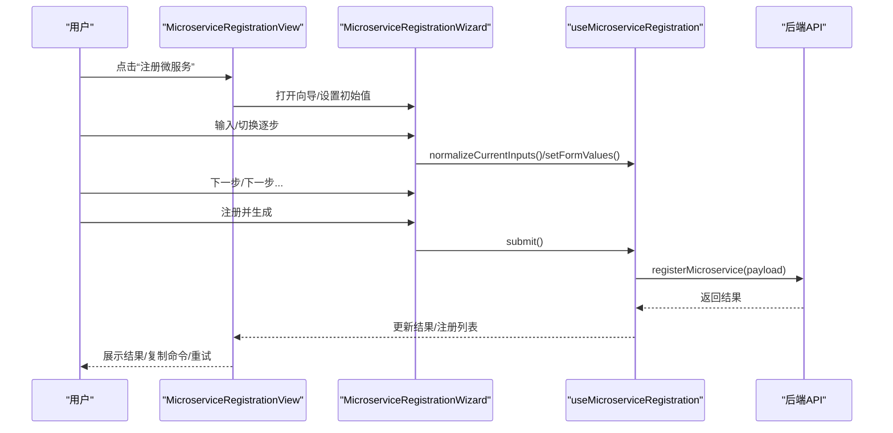
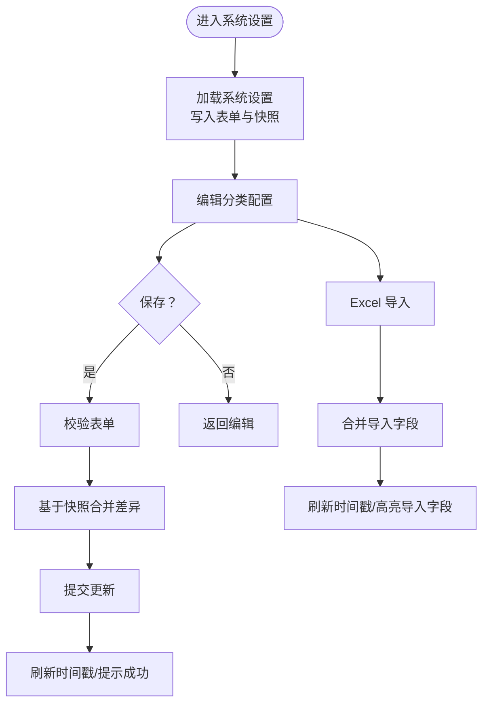
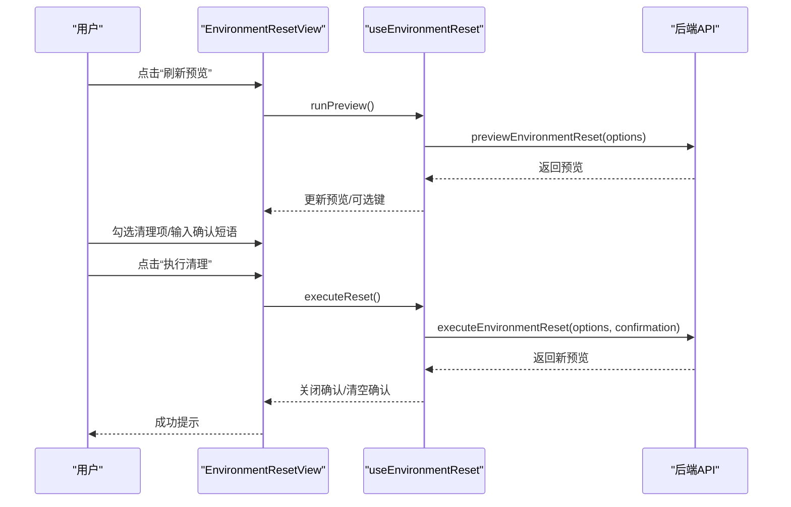
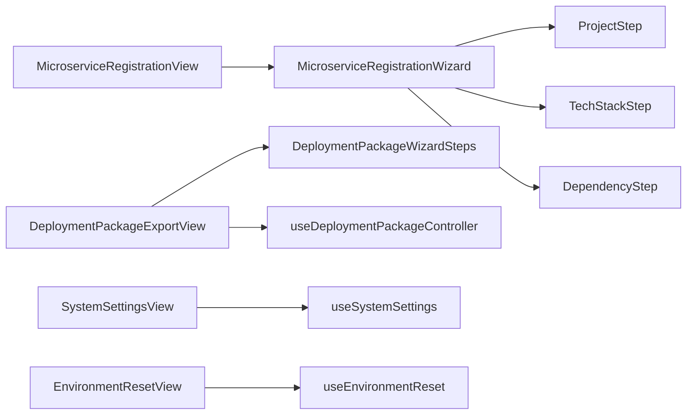

# 视图组件实现

<cite>
**本文引用的文件**
- [DeploymentPackageExportView.tsx](file://frontend/src/views/DeploymentPackageExportView.tsx)
- [MicroserviceRegistrationView.tsx](file://frontend/src/views/MicroserviceRegistrationView.tsx)
- [SystemSettingsView.tsx](file://frontend/src/views/SystemSettingsView.tsx)
- [EnvironmentResetView.tsx](file://frontend/src/views/EnvironmentResetView.tsx)
- [MicroserviceRegistrationWizard.tsx](file://frontend/src/views/components/MicroserviceRegistrationWizard.tsx)
- [ProjectStep.tsx](file://frontend/src/views/components/microserviceWizard/ProjectStep.tsx)
- [TechStackStep.tsx](file://frontend/src/views/components/microserviceWizard/TechStackStep.tsx)
- [DependencyStep.tsx](file://frontend/src/views/components/microserviceWizard/DependencyStep.tsx)
- [DeploymentPackageWizardSteps.tsx](file://frontend/src/views/components/DeploymentPackageWizardSteps.tsx)
- [useMicroserviceRegistration.ts](file://frontend/src/views/hooks/useMicroserviceRegistration.ts)
- [useSystemSettings.ts](file://frontend/src/views/hooks/useSystemSettings.ts)
- [useEnvironmentReset.ts](file://frontend/src/views/hooks/useEnvironmentReset.ts)
- [useDeploymentPackageController.ts](file://frontend/src/views/hooks/useDeploymentPackageController.ts)
</cite>

## 目录
1. [引言](#引言)
2. [项目结构](#项目结构)
3. [核心组件](#核心组件)
4. [架构总览](#架构总览)
5. [详细组件分析](#详细组件分析)
6. [依赖关系分析](#依赖关系分析)
7. [性能考虑](#性能考虑)
8. [故障排查指南](#故障排查指南)
9. [结论](#结论)
10. [附录](#附录)

## 引言
本文件面向部署包工厂视图组件的实现，围绕四大核心视图组件进行系统化技术说明：部署包工厂视图的向导式交互设计、微服务注册视图的多步骤工作流、系统设置视图的配置管理界面与环境清理视图的数据操作界面。文档重点阐述各视图组件的状态管理策略、表单验证机制与用户交互流程；解释组件间协作模式、数据流向与事件传播机制；并总结可访问性设计、响应式布局与用户体验优化策略。

## 项目结构
前端视图层采用“视图组件 + 组件库 + Hooks 状态管理”的分层组织方式：
- 视图组件：负责页面布局、工具栏、内容区与模态框等容器结构
- 组件库：封装可复用的表单步骤、面板与对话框
- Hooks：封装跨视图的状态、副作用与业务动作

图表来源
- [DeploymentPackageExportView.tsx:15-135](file://frontend/src/views/DeploymentPackageExportView.tsx#L15-L135)
- [MicroserviceRegistrationView.tsx:11-89](file://frontend/src/views/MicroserviceRegistrationView.tsx#L11-L89)
- [SystemSettingsView.tsx:10-61](file://frontend/src/views/SystemSettingsView.tsx#L10-L61)
- [EnvironmentResetView.tsx:7-46](file://frontend/src/views/EnvironmentResetView.tsx#L7-L46)
- [MicroserviceRegistrationWizard.tsx:38-80](file://frontend/src/views/components/MicroserviceRegistrationWizard.tsx#L38-L80)
- [DeploymentPackageWizardSteps.tsx:10-90](file://frontend/src/views/components/DeploymentPackageWizardSteps.tsx#L10-L90)
- [ProjectStep.tsx:7-22](file://frontend/src/views/components/microserviceWizard/ProjectStep.tsx#L7-L22)
- [TechStackStep.tsx:6-34](file://frontend/src/views/components/microserviceWizard/TechStackStep.tsx#L6-L34)
- [DependencyStep.tsx:6-22](file://frontend/src/views/components/microserviceWizard/DependencyStep.tsx#L6-L22)
- [useMicroserviceRegistration.ts:29-135](file://frontend/src/views/hooks/useMicroserviceRegistration.ts#L29-L135)
- [useSystemSettings.ts:7-103](file://frontend/src/views/hooks/useSystemSettings.ts#L7-L103)
- [useEnvironmentReset.ts:11-83](file://frontend/src/views/hooks/useEnvironmentReset.ts#L11-L83)
- [useDeploymentPackageController.ts:23-170](file://frontend/src/views/hooks/useDeploymentPackageController.ts#L23-L170)

章节来源
- [DeploymentPackageExportView.tsx:15-135](file://frontend/src/views/DeploymentPackageExportView.tsx#L15-L135)
- [MicroserviceRegistrationView.tsx:11-89](file://frontend/src/views/MicroserviceRegistrationView.tsx#L11-L89)
- [SystemSettingsView.tsx:10-61](file://frontend/src/views/SystemSettingsView.tsx#L10-L61)
- [EnvironmentResetView.tsx:7-46](file://frontend/src/views/EnvironmentResetView.tsx#L7-L46)

## 核心组件
- 部署包工厂视图（向导式）
  - 通过控制器 Hook 管理导包向导的步骤、校验与提交；通过状态 Hook 提供项目、平台、数据库、目标配置等上下文；通过抽屉/面板展示预览、审计与任务详情。
- 微服务注册视图（多步骤工作流）
  - 基于向导组件实现业务平台、服务信息、技术栈、构建部署、运行依赖与确认生成六步；通过表单字段映射与步骤校验控制前进/后退与提交。
- 系统设置视图（配置管理界面）
  - 分类导航 + 表单编辑 + Excel 导入；提供保存、刷新与导入历史提示；合并策略保证部分字段增量更新。
- 环境清理视图（数据操作界面）
  - 清理预览 + 复选选项 + 确认短语 + 执行按钮；提供加载状态与执行状态反馈。

章节来源
- [DeploymentPackageExportView.tsx:15-135](file://frontend/src/views/DeploymentPackageExportView.tsx#L15-L135)
- [MicroserviceRegistrationView.tsx:11-89](file://frontend/src/views/MicroserviceRegistrationView.tsx#L11-L89)
- [SystemSettingsView.tsx:10-61](file://frontend/src/views/SystemSettingsView.tsx#L10-L61)
- [EnvironmentResetView.tsx:7-46](file://frontend/src/views/EnvironmentResetView.tsx#L7-L46)

## 架构总览
视图组件通过 Hooks 将状态与副作用抽象到独立模块，组件之间通过 props 传递状态与回调，形成清晰的单向数据流与事件冒泡。

图表来源
- [useMicroserviceRegistration.ts:55-92](file://frontend/src/views/hooks/useMicroserviceRegistration.ts#L55-L92)
- [useSystemSettings.ts:16-46](file://frontend/src/views/hooks/useSystemSettings.ts#L16-L46)
- [useEnvironmentReset.ts:32-64](file://frontend/src/views/hooks/useEnvironmentReset.ts#L32-L64)
- [useDeploymentPackageController.ts:38-131](file://frontend/src/views/hooks/useDeploymentPackageController.ts#L38-L131)

## 详细组件分析

### 部署包工厂视图（向导式）
- 设计理念
  - 以“向导 + 抽屉 + 面板”组合呈现复杂导包流程，将项目选择、平台服务、中间件、目标配置与预览摘要分步展示，降低认知负担。
- 实现要点
  - 控制器 Hook 负责步骤推进、表单校验、构建提交与业务平台注册/禁用；状态 Hook 提供项目/平台/数据库/目标草稿等上下文；视图通过多个子组件承载步骤内容。
  - 步骤校验在控制器中集中处理，避免重复逻辑；对微服务交付阻塞场景提供“阻塞服务定位 + 最后一步提示”的引导。
- 数据流
  - 选项加载（项目/平台/系统设置） → 生成草稿 → 预览刷新 → 任务创建 → 审计事件与任务列表联动更新。
- 用户体验
  - 加载状态覆盖关键区域；警告/成功/错误提示贯穿全流程；必要时回显到对应步骤。

图表来源
- [DeploymentPackageExportView.tsx:44-132](file://frontend/src/views/DeploymentPackageExportView.tsx#L44-L132)
- [useDeploymentPackageController.ts:59-131](file://frontend/src/views/hooks/useDeploymentPackageController.ts#L59-L131)
- [useDeploymentPackageState.ts](file://frontend/src/views/hooks/useDeploymentPackageState.ts)
- [useDeploymentPackageActions.ts](file://frontend/src/views/hooks/useDeploymentPackageActions.ts)

章节来源
- [DeploymentPackageExportView.tsx:15-135](file://frontend/src/views/DeploymentPackageExportView.tsx#L15-L135)
- [useDeploymentPackageController.ts:23-170](file://frontend/src/views/hooks/useDeploymentPackageController.ts#L23-L170)

### 微服务注册视图（多步骤工作流）
- 设计理念
  - 六步向导：业务平台 → 服务信息 → 技术栈 → 构建部署 → 运行依赖 → 确认生成；每步聚焦关键决策点，减少一次性输入压力。
- 实现要点
  - 向导组件根据当前步骤渲染对应步骤组件；通过字段映射与必填规则控制下一步按钮可用性；提交前进行字段规范化与 API 错误定位。
  - 结果面板支持复制命令、刷新构建状态与重试交付；已注册服务列表支持刷新。
- 表单验证与状态
  - 每步仅校验当前步相关字段；API 错误时根据字段定位到对应步骤并弹窗显示。
- 用户体验
  - 默认值与平台联动（如 k8s 命名空间）；步骤间平滑过渡；提交过程禁用防止重复提交。

图表来源
- [MicroserviceRegistrationView.tsx:16-85](file://frontend/src/views/MicroserviceRegistrationView.tsx#L16-L85)
- [MicroserviceRegistrationWizard.tsx:38-80](file://frontend/src/views/components/MicroserviceRegistrationWizard.tsx#L38-L80)
- [useMicroserviceRegistration.ts:69-92](file://frontend/src/views/hooks/useMicroserviceRegistration.ts#L69-L92)

章节来源
- [MicroserviceRegistrationView.tsx:11-89](file://frontend/src/views/MicroserviceRegistrationView.tsx#L11-L89)
- [MicroserviceRegistrationWizard.tsx:16-80](file://frontend/src/views/components/MicroserviceRegistrationWizard.tsx#L16-L80)
- [ProjectStep.tsx:7-22](file://frontend/src/views/components/microserviceWizard/ProjectStep.tsx#L7-L22)
- [TechStackStep.tsx:6-34](file://frontend/src/views/components/microserviceWizard/TechStackStep.tsx#L6-L34)
- [DependencyStep.tsx:6-22](file://frontend/src/views/components/microserviceWizard/DependencyStep.tsx#L6-L22)
- [useMicroserviceRegistration.ts:29-135](file://frontend/src/views/hooks/useMicroserviceRegistration.ts#L29-L135)

### 系统设置视图（配置管理界面）
- 设计理念
  - 分类导航 + 表单编辑 + Excel 导入；支持增量合并与最近导入提示，便于批量维护环境配置。
- 实现要点
  - 加载设置后写入表单快照；保存时基于快照与当前表单差异合并后提交；导入后高亮最近导入字段。
- 表单验证与状态
  - 保存前进行全量字段校验；导入限制文件类型与数量；导入后自动刷新时间戳与字段列表。
- 用户体验
  - 刷新/保存按钮提供加载状态；导入成功提示导入字段数量；最近导入标签增强可追溯性。

图表来源
- [SystemSettingsView.tsx:10-61](file://frontend/src/views/SystemSettingsView.tsx#L10-L61)
- [useSystemSettings.ts:16-81](file://frontend/src/views/hooks/useSystemSettings.ts#L16-L81)

章节来源
- [SystemSettingsView.tsx:10-61](file://frontend/src/views/SystemSettingsView.tsx#L10-L61)
- [useSystemSettings.ts:7-103](file://frontend/src/views/hooks/useSystemSettings.ts#L7-L103)

### 环境清理视图（数据操作界面）
- 设计理念
  - 清理预览 + 复选选项 + 确认短语 + 执行按钮；通过“预览 → 选择 → 确认 → 执行”的三段式降低误操作风险。
- 实现要点
  - 预览阶段加载可清理资源清单；执行阶段要求用户输入确认短语；执行完成后刷新预览并清空确认状态。
- 用户体验
  - 预览与执行均提供加载状态；执行按钮根据预览与选择项启用/禁用；成功/失败分别给出提示。

图表来源
- [EnvironmentResetView.tsx:7-46](file://frontend/src/views/EnvironmentResetView.tsx#L7-L46)
- [useEnvironmentReset.ts:32-64](file://frontend/src/views/hooks/useEnvironmentReset.ts#L32-L64)

章节来源
- [EnvironmentResetView.tsx:7-46](file://frontend/src/views/EnvironmentResetView.tsx#L7-L46)
- [useEnvironmentReset.ts:11-83](file://frontend/src/views/hooks/useEnvironmentReset.ts#L11-L83)

## 依赖关系分析
- 组件耦合
  - 视图组件通过 Hooks 与具体实现解耦；步骤组件与向导组件通过 props 传参；控制器与状态/动作通过 ref 保持最新状态引用。
- 外部依赖
  - 后端 API 提供选项、设置、交付与清理等能力；Ant Design 提供表单、步骤、模态框与反馈组件。
- 事件传播
  - 从用户操作到视图回调，再到 Hooks 动作，最终触发 API 请求与状态更新，形成单向数据流。

图表来源
- [MicroserviceRegistrationView.tsx:11-89](file://frontend/src/views/MicroserviceRegistrationView.tsx#L11-L89)
- [MicroserviceRegistrationWizard.tsx:38-80](file://frontend/src/views/components/MicroserviceRegistrationWizard.tsx#L38-L80)
- [ProjectStep.tsx:7-22](file://frontend/src/views/components/microserviceWizard/ProjectStep.tsx#L7-L22)
- [TechStackStep.tsx:6-34](file://frontend/src/views/components/microserviceWizard/TechStackStep.tsx#L6-L34)
- [DependencyStep.tsx:6-22](file://frontend/src/views/components/microserviceWizard/DependencyStep.tsx#L6-L22)
- [DeploymentPackageExportView.tsx:15-135](file://frontend/src/views/DeploymentPackageExportView.tsx#L15-L135)
- [DeploymentPackageWizardSteps.tsx:10-90](file://frontend/src/views/components/DeploymentPackageWizardSteps.tsx#L10-L90)
- [SystemSettingsView.tsx:10-61](file://frontend/src/views/SystemSettingsView.tsx#L10-L61)
- [EnvironmentResetView.tsx:7-46](file://frontend/src/views/EnvironmentResetView.tsx#L7-L46)

章节来源
- [useMicroserviceRegistration.ts:29-135](file://frontend/src/views/hooks/useMicroserviceRegistration.ts#L29-L135)
- [useSystemSettings.ts:7-103](file://frontend/src/views/hooks/useSystemSettings.ts#L7-L103)
- [useEnvironmentReset.ts:11-83](file://frontend/src/views/hooks/useEnvironmentReset.ts#L11-L83)
- [useDeploymentPackageController.ts:23-170](file://frontend/src/views/hooks/useDeploymentPackageController.ts#L23-L170)

## 性能考虑
- 并发加载
  - 使用并发请求加载多源数据（如微服务注册视图中的选项、部署包选项、系统设置与已注册服务），缩短首屏等待时间。
- 按需渲染
  - 向导与抽屉组件在打开时才渲染，减少初始 DOM 压力。
- 状态缓存
  - 表单快照用于增量合并与保存，避免不必要的全量提交。
- 事件节流
  - 预览与刷新按钮提供加载状态，避免重复触发。

## 故障排查指南
- 微服务注册
  - 若提交报错，系统会定位到对应步骤并弹窗提示；建议检查必填字段与平台命名空间一致性。
  - 若交付状态异常，可通过“刷新构建状态/重试交付”恢复。
- 系统设置
  - 保存失败通常由字段校验引起；导入失败可检查 Excel 格式与字段映射。
- 环境清理
  - 执行失败多因确认短语不匹配或权限不足；请核对预览清单与确认短语。
- 导包流程
  - 若提示微服务交付未就绪，需先完成相关微服务的交付或重试后再继续导包。

章节来源
- [useMicroserviceRegistration.ts:94-129](file://frontend/src/views/hooks/useMicroserviceRegistration.ts#L94-L129)
- [useSystemSettings.ts:30-46](file://frontend/src/views/hooks/useSystemSettings.ts#L30-L46)
- [useEnvironmentReset.ts:51-64](file://frontend/src/views/hooks/useEnvironmentReset.ts#L51-L64)
- [useDeploymentPackageController.ts:124-131](file://frontend/src/views/hooks/useDeploymentPackageController.ts#L124-L131)

## 结论
四大视图组件通过统一的 Hooks 抽象与组件化步骤设计，实现了从“配置管理”到“数据清理”的完整运维闭环。向导式交互与明确的校验策略显著降低了用户心智负担；单向数据流与事件传播机制确保了状态一致性与可追踪性。建议在后续迭代中进一步完善可访问性标签与键盘导航，持续优化加载与错误提示的即时反馈。

## 附录
- 可访问性设计建议
  - 为步骤标题与表单控件添加 aria-label；为按钮组提供键盘导航顺序；为加载状态提供屏幕阅读器友好的提示文本。
- 响应式布局
  - 使用 Ant Design 的栅格与间距系统适配不同屏幕尺寸；在窄屏下折叠步骤面板与表单项，优先展示关键字段。
- 用户体验优化
  - 在关键操作前增加二次确认；为易错字段提供实时校验与错误摘要；在长流程中提供进度指示与断点续做能力。