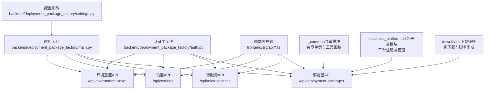
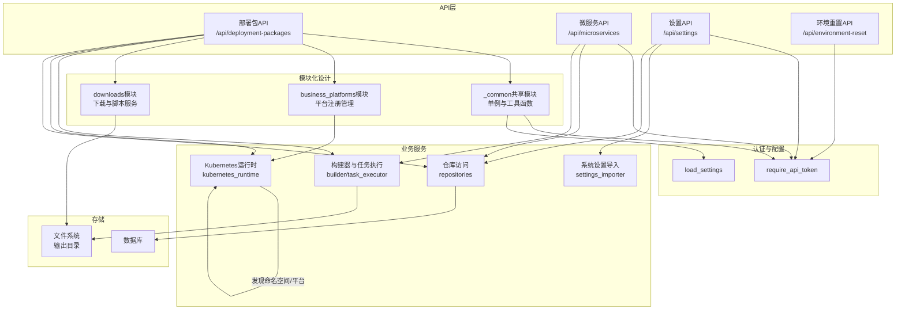
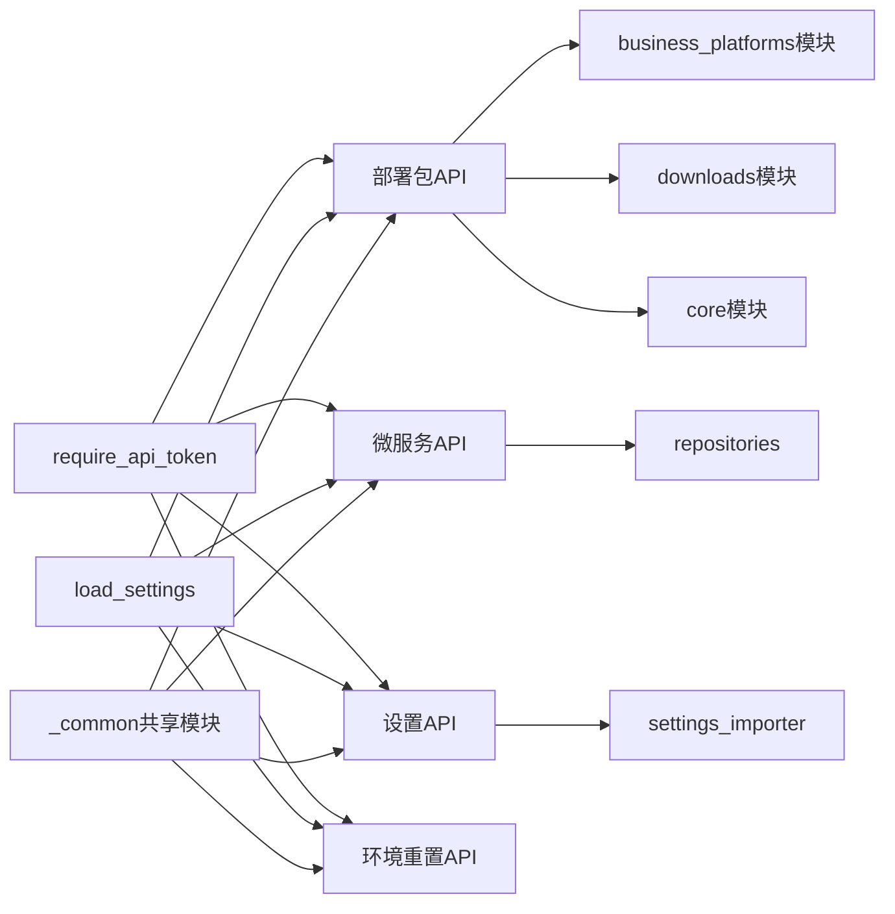

# API层设计

<cite>
**本文引用的文件**
- [backend/deployment_package_factory/main.py](file://backend/deployment_package_factory/main.py)
- [backend/deployment_package_factory/api/_common.py](file://backend/deployment_package_factory/api/_common.py)
- [backend/deployment_package_factory/api/business_platforms.py](file://backend/deployment_package_factory/api/business_platforms.py)
- [backend/deployment_package_factory/api/downloads.py](file://backend/deployment_package_factory/api/downloads.py)
- [backend/deployment_package_factory/api/deployment_packages.py](file://backend/deployment_package_factory/api/deployment_packages.py)
- [backend/deployment_package_factory/api/microservices.py](file://backend/deployment_package_factory/api/microservices.py)
- [backend/deployment_package_factory/api/settings.py](file://backend/deployment_package_factory/api/settings.py)
- [backend/deployment_package_factory/api/environment_reset.py](file://backend/deployment_package_factory/api/environment_reset.py)
- [backend/deployment_package_factory/services/deployment_packages/models.py](file://backend/deployment_package_factory/services/deployment_packages/models.py)
- [backend/deployment_package_factory/auth.py](file://backend/deployment_package_factory/auth.py)
- [backend/deployment_package_factory/settings.py](file://backend/deployment_package_factory/settings.py)
- [backend/tests/test_deployment_package_api.py](file://backend/tests/test_deployment_package_api.py)
- [backend/tests/conftest.py](file://backend/tests/conftest.py)
- [frontend/src/api/client.ts](file://frontend/src/api/client.ts)
- [frontend/src/api/deploymentPackages.ts](file://frontend/src/api/deploymentPackages.ts)
- [frontend/src/api/microservices.ts](file://frontend/src/api/microservices.ts)
- [frontend/src/api/settings.ts](file://frontend/src/api/settings.ts)
- [frontend/src/api/environmentReset.ts](file://frontend/src/api/environmentReset.ts)
</cite>

## 更新摘要
**所做更改**
- 更新部署包API模块化架构说明，反映新增的三个专门模块（_common、business_platforms、downloads）
- 新增API模块拆分与职责分离的详细说明
- 更新架构图表以体现新的模块化设计
- 补充共享组件与依赖关系分析

## 目录
1. [引言](#引言)
2. [项目结构](#项目结构)
3. [核心组件](#核心组件)
4. [架构总览](#架构总览)
5. [详细组件分析](#详细组件分析)
6. [依赖关系分析](#依赖关系分析)
7. [性能考虑](#性能考虑)
8. [故障排查指南](#故障排查指南)
9. [结论](#结论)
10. [附录](#附录)

## 引言
本文件面向部署包工厂API层，提供全面的技术文档，覆盖RESTful API设计原则与实现、四个主要API模块（部署包API、微服务API、设置API、环境重置API）的接口定义、请求/响应模型、数据校验与错误处理策略、版本控制与内容协商、分页机制、API文档生成与测试策略、以及性能优化建议。文档同时结合后端FastAPI路由与前端TypeScript客户端，帮助开发者快速理解并正确集成。

**更新** 本次更新重点反映了API层的模块化重构：部署包API现已拆分为三个专门模块，实现了更好的职责分离和代码组织。

## 项目结构
后端采用FastAPI应用入口集中注册各模块路由，并通过中间件统一处理CORS与认证；前端以独立TypeScript模块封装HTTP客户端与各API模块的调用方法。新的模块化架构将部署包API进一步细分为共享组件、业务平台管理和下载服务三个专门模块。

**图示来源**
- [backend/deployment_package_factory/main.py:52-57](file://backend/deployment_package_factory/main.py#L52-L57)
- [backend/deployment_package_factory/api/_common.py:1-202](file://backend/deployment_package_factory/api/_common.py#L1-L202)
- [backend/deployment_package_factory/api/business_platforms.py:1-100](file://backend/deployment_package_factory/api/business_platforms.py#L1-L100)
- [backend/deployment_package_factory/api/downloads.py:1-182](file://backend/deployment_package_factory/api/downloads.py#L1-L182)

**章节来源**
- [backend/deployment_package_factory/main.py:52-57](file://backend/deployment_package_factory/main.py#L52-L57)
- [backend/deployment_package_factory/api/_common.py:1-202](file://backend/deployment_package_factory/api/_common.py#L1-L202)

## 核心组件
- 应用入口与路由注册：在应用启动时注册四个主要API模块路由，并暴露健康检查、就绪检查与指标端点。
- 认证与授权：全局依赖要求API令牌，支持Header、自定义Header与查询参数三种方式，下载类接口允许在查询中携带令牌。
- 配置管理：从环境变量加载运行参数，如并发构建数、执行模式、输出目录、保留策略等。
- 数据模型：统一使用Pydantic模型作为请求/响应契约，确保类型安全与自动校验。
- **新增** 共享组件：_common模块提供全局单例、锁机制和通用工具函数，打破模块间的循环依赖。

**更新** 新增共享组件模块，实现部署包API内部的解耦和资源共享。

**章节来源**
- [backend/deployment_package_factory/main.py:52-57](file://backend/deployment_package_factory/main.py#L52-L57)
- [backend/deployment_package_factory/auth.py:10-41](file://backend/deployment_package_factory/auth.py#L10-L41)
- [backend/deployment_package_factory/settings.py:26-57](file://backend/deployment_package_factory/settings.py#L26-L57)
- [backend/deployment_package_factory/api/_common.py:37-95](file://backend/deployment_package_factory/api/_common.py#L37-L95)

## 架构总览
下图展示API层与业务服务、存储与外部系统的交互关系，体现了新的模块化架构。

**图示来源**
- [backend/deployment_package_factory/main.py:52-57](file://backend/deployment_package_factory/main.py#L52-L57)
- [backend/deployment_package_factory/api/_common.py:103-202](file://backend/deployment_package_factory/api/_common.py#L103-L202)
- [backend/deployment_package_factory/api/business_platforms.py:29-100](file://backend/deployment_package_factory/api/business_platforms.py#L29-L100)
- [backend/deployment_package_factory/api/downloads.py:40-182](file://backend/deployment_package_factory/api/downloads.py#L40-L182)

## 详细组件分析

### 部署包API（/api/deployment-packages）- 模块化架构
**更新** 部署包API现已拆分为三个专门模块，实现了更好的职责分离：

#### _common共享模块
- **职责**：提供全局单例、锁机制和通用工具函数，打破模块间的循环依赖。
- **核心功能**：
  - 任务仓库、审计仓库、业务平台仓库、微服务仓库的延迟初始化
  - 任务执行器的全局实例管理
  - 业务平台发现与审计工具函数
  - IP地址识别与操作员标识

#### business_platforms业务平台模块
- **路由前缀**：/api/deployment-packages
- **标签**：deployment-packages
- **主要功能**：
  - 业务平台注册：POST /business-platforms/register
  - 业务平台禁用：POST /business-platforms/{source_env}/{business_key}/disable
- **审计与错误处理**：
  - 注册成功返回BusinessPlatformRegistrationResult
  - 禁用失败返回404（未注册）或409（状态冲突）

#### downloads下载模块
- **路由前缀**：/api/deployment-packages
- **标签**：deployment-packages
- **主要功能**：
  - 包下载：GET /{package_id}/download（支持Range）
  - 下载探测：HEAD /{package_id}/download
  - 校验和下载：GET /{package_id}/checksum
  - PowerShell下载脚本：GET /{package_id}/download-script.ps1
  - Shell下载脚本：GET /{package_id}/download-script.sh
- **性能特性**：
  - 支持断点续传（Range）与206响应
  - 返回ETag与Last-Modified头部
  - 流式传输避免内存占用

#### deployment_packages核心模块
- **路由前缀**：/api/deployment-packages
- **标签**：deployment-packages
- **主要功能**：
  - 运行选项获取：GET /options
  - 部署包预览：POST /preview
  - 镜像导出环境检查：GET /image-export-environment
  - 任务创建：POST /
  - 任务管理：GET /tasks、GET /tasks/{task_id}
  - 清理策略：POST /cleanup
  - 任务操作：POST /tasks/{task_id}/cancel、POST /tasks/{task_id}/retry
  - 审计事件：GET /audit-events

**章节来源**
- [backend/deployment_package_factory/api/_common.py:1-202](file://backend/deployment_package_factory/api/_common.py#L1-L202)
- [backend/deployment_package_factory/api/business_platforms.py:1-100](file://backend/deployment_package_factory/api/business_platforms.py#L1-L100)
- [backend/deployment_package_factory/api/downloads.py:1-182](file://backend/deployment_package_factory/api/downloads.py#L1-L182)
- [backend/deployment_package_factory/api/deployment_packages.py:1-247](file://backend/deployment_package_factory/api/deployment_packages.py#L1-L247)

### 微服务API（/api/microservices）
- **路由前缀**：/api/microservices
- **标签**：microservices
- **主要功能**：
  - 脚手架选项：GET /options
  - 微服务注册：POST /，创建脚手架、准备交付、归档产物
  - 列表查询：GET /，支持多维度过滤
  - 交付重试：POST /{project_id}/delivery/retry
  - 交付状态：GET /{project_id}/delivery/status
  - 下载脚手架：GET /{project_id}/download
- **输出管理**：
  - 产物输出到系统设置的数据目录下的microservice-projects子目录

**章节来源**
- [backend/deployment_package_factory/api/microservices.py:1-217](file://backend/deployment_package_factory/api/microservices.py#L1-L217)

### 设置API（/api/settings）
- **路由前缀**：/api/settings
- **标签**：settings
- **主要功能**：
  - 获取系统设置：GET /
  - 更新系统设置：PUT /
  - 环境设置导入：POST /import-environment，支持50MB以内XLSX文件
- **安全特性**：
  - 导入文件大小限制防止过大请求
  - 返回导入字段列表与警告信息

**章节来源**
- [backend/deployment_package_factory/api/settings.py:1-79](file://backend/deployment_package_factory/api/settings.py#L1-L79)

### 环境重置API（/api/environment-reset）
- **路由前缀**：/api/environment-reset
- **标签**：environment-reset
- **主要功能**：
  - 预览重置：POST /preview，返回清理统计与路径信息
  - 执行重置：POST /execute，执行清理并记录审计事件
- **错误处理**：
  - 预览阶段资源不可用返回503状态码

**章节来源**
- [backend/deployment_package_factory/api/environment_reset.py:1-74](file://backend/deployment_package_factory/api/environment_reset.py#L1-L74)

## 依赖关系分析
**更新** 新的模块化架构带来了更清晰的依赖关系：

### 组件耦合
- **共享依赖**：所有API模块都依赖认证中间件与配置加载
- **模块内聚**：每个模块专注于特定领域，减少交叉依赖
- **_common中心化**：提供全局单例管理，避免循环导入问题

### 外部依赖
- **Kubernetes运行时**：用于业务平台命名空间发现
- **文件系统**：脚手架产物与部署包输出存储
- **数据库**：任务、审计与微服务元数据持久化

**图示来源**
- [backend/deployment_package_factory/auth.py:10-28](file://backend/deployment_package_factory/auth.py#L10-L28)
- [backend/deployment_package_factory/settings.py:26-57](file://backend/deployment_package_factory/settings.py#L26-L57)
- [backend/deployment_package_factory/api/_common.py:37-95](file://backend/deployment_package_factory/api/_common.py#L37-L95)

**章节来源**
- [backend/deployment_package_factory/api/_common.py:37-95](file://backend/deployment_package_factory/api/_common.py#L37-L95)
- [backend/deployment_package_factory/api/business_platforms.py:6-26](file://backend/deployment_package_factory/api/business_platforms.py#L6-L26)
- [backend/deployment_package_factory/api/downloads.py:13-29](file://backend/deployment_package_factory/api/downloads.py#L13-L29)

## 性能考虑
**更新** 模块化架构带来的性能优化：

### 并发与执行模式
- **全局单例管理**：_common模块的锁机制确保线程安全的单例创建
- **延迟初始化**：仓库和执行器按需创建，减少启动时间
- **最大并发构建数**：由配置项控制，支持后台执行模式

### 流式下载与断点续传
- **模块化下载**：downloads模块专门处理大文件传输
- **Range请求支持**：避免大文件重复传输
- **流式响应**：StreamingResponse减少内存占用

### 存储清理
- **清理策略**：支持保留天数与最大总字节数配置
- **dry_run预演**：安全的清理测试

**章节来源**
- [backend/deployment_package_factory/api/_common.py:37-95](file://backend/deployment_package_factory/api/_common.py#L37-L95)
- [backend/deployment_package_factory/api/downloads.py:40-182](file://backend/deployment_package_factory/api/downloads.py#L40-L182)
- [backend/deployment_package_factory/settings.py:34-41](file://backend/deployment_package_factory/settings.py#L34-L41)

## 故障排查指南
**更新** 针对新模块化架构的故障排查：

### 认证失败（401）
- 确认API令牌设置与请求头配置
- 下载接口支持查询参数方式传递令牌

### 资源不存在（404）
- 任务、包或产物不存在时返回
- 业务平台未注册返回404

### 冲突或非法状态（409）
- 平台禁用或任务状态不合法
- 微服务注册冲突

### Range请求错误（416）
- 检查Range头格式与文件大小
- 服务端返回正确的Content-Range头

### 模块化相关问题
- **循环导入**：通过_common模块解决
- **单例失效**：检查_lock机制是否正常工作
- **模块路由冲突**：确认路由前缀配置

**章节来源**
- [backend/deployment_package_factory/auth.py:10-41](file://backend/deployment_package_factory/auth.py#L10-L41)
- [backend/deployment_package_factory/api/business_platforms.py:78-82](file://backend/deployment_package_factory/api/business_platforms.py#L78-L82)
- [backend/deployment_package_factory/api/downloads.py:52-53](file://backend/deployment_package_factory/api/downloads.py#L52-L53)

## 结论
部署包工厂API层通过模块化重构实现了更好的架构设计：_common共享模块提供统一的基础设施，business_platforms模块专注平台管理，downloads模块专门处理大文件传输，核心模块保持简洁。这种设计遵循RESTful原则，通过清晰的路由分层、强类型的Pydantic模型、完善的认证与错误处理机制，提供了从部署包构建、微服务脚手架、系统设置管理到环境重置的完整能力。配合流式下载、断点续传、清理策略与就绪检查，满足生产环境的可靠性与可观测性需求。

## 附录

### RESTful设计要点与约定
- **HTTP方法使用**
  - GET：只读查询与资源检索
  - POST：创建资源或触发动作
  - PUT：更新现有资源
  - HEAD：仅获取响应头
- **URL路径设计**
  - 使用名词复数与层级表达资源关系
  - 动作通过子路径体现
- **状态码规范**
  - 2xx：成功（200、201、202、206）
  - 4xx：客户端错误（400、401、404、409）
  - 5xx：服务器错误（503用于就绪检查）
- **分页与过滤**
  - 通过查询参数进行过滤与限制
- **内容协商与媒体类型**
  - JSON为默认格式；下载接口返回application/gzip或text/plain
- **版本控制**
  - 应用级版本在应用元数据中声明

### API文档生成与测试策略
- **文档生成**
  - FastAPI自动基于路由与Pydantic模型生成OpenAPI文档
- **测试策略**
  - 单元测试：使用TestClient测试特定路由
  - 行为测试：覆盖认证、预览、下载、清理等场景
  - 模块化测试：分别测试各API模块的功能

### 前端集成要点
- **客户端**
  - 统一请求函数与错误解析
  - 下载URL动态拼接令牌
- **类型定义**
  - 与后端模型保持一致的接口类型

**章节来源**
- [backend/deployment_package_factory/main.py:32-36](file://backend/deployment_package_factory/main.py#L32-L36)
- [backend/deployment_package_factory/api/downloads.py:40-67](file://backend/deployment_package_factory/api/downloads.py#L40-L67)
- [frontend/src/api/client.ts:45-83](file://frontend/src/api/client.ts#L45-L83)