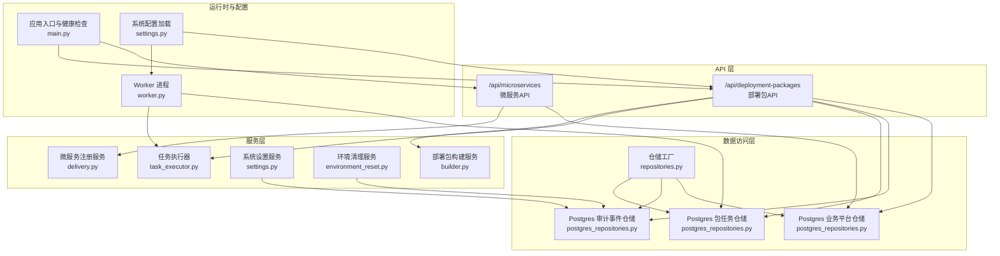
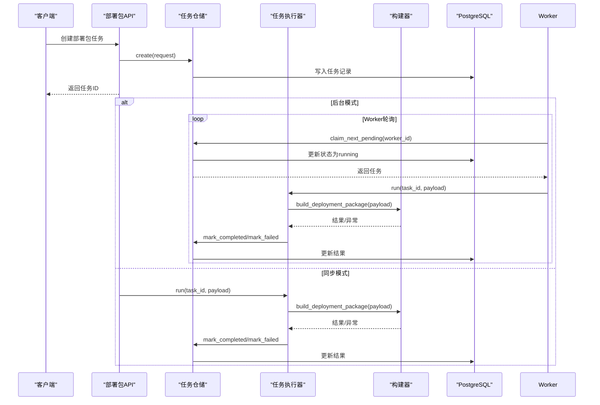
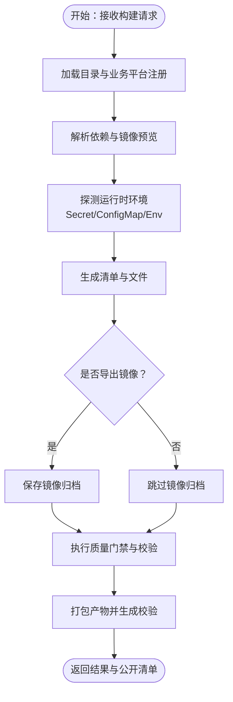
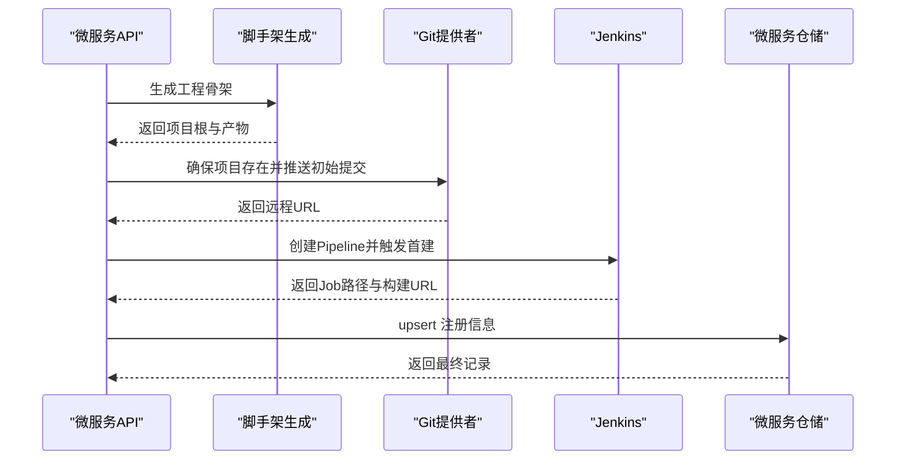
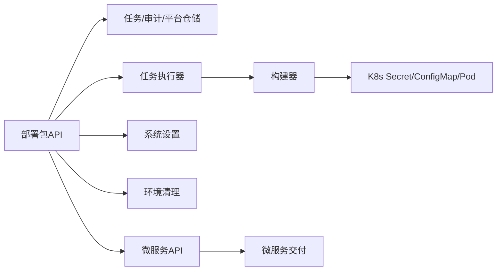

# 业务逻辑层

<cite>
**本文引用的文件**
- [backend/deployment_package_factory/main.py](file://backend/deployment_package_factory/main.py)
- [backend/deployment_package_factory/settings.py](file://backend/deployment_package_factory/settings.py)
- [backend/deployment_package_factory/worker.py](file://backend/deployment_package_factory/worker.py)
- [backend/deployment_package_factory/services/deployment_packages/models.py](file://backend/deployment_package_factory/services/deployment_packages/models.py)
- [backend/deployment_package_factory/services/deployment_packages/repositories.py](file://backend/deployment_package_factory/services/deployment_packages/repositories.py)
- [backend/deployment_package_factory/services/deployment_packages/postgres_repositories.py](file://backend/deployment_package_factory/services/deployment_packages/postgres_repositories.py)
- [backend/deployment_package_factory/services/deployment_packages/task_executor.py](file://backend/deployment_package_factory/services/deployment_packages/task_executor.py)
- [backend/deployment_package_factory/services/deployment_packages/builder.py](file://backend/deployment_package_factory/services/deployment_packages/builder.py)
- [backend/deployment_package_factory/api/deployment_packages.py](file://backend/deployment_package_factory/api/deployment_packages.py)
- [backend/deployment_package_factory/services/environment_reset.py](file://backend/deployment_package_factory/services/environment_reset.py)
- [backend/deployment_package_factory/services/settings.py](file://backend/deployment_package_factory/services/settings.py)
- [backend/deployment_package_factory/api/microservices.py](file://backend/deployment_package_factory/api/microservices.py)
- [backend/deployment_package_factory/services/microservices/delivery.py](file://backend/deployment_package_factory/services/microservices/delivery.py)
</cite>

## 目录
1. [引言](#引言)
2. [项目结构](#项目结构)
3. [核心组件](#核心组件)
4. [架构总览](#架构总览)
5. [详细组件分析](#详细组件分析)
6. [依赖分析](#依赖分析)
7. [性能考虑](#性能考虑)
8. [故障排查指南](#故障排查指南)
9. [结论](#结论)
10. [附录](#附录)

## 引言
本文件面向“部署包工厂”业务逻辑层，系统化梳理四大核心服务（部署包构建服务、微服务注册服务、系统设置服务、环境清理服务）的设计与实现，重点阐释依赖注入、工厂模式、策略模式的应用方式；并从任务执行模型、并发控制、资源管理、异常处理、数据流转与缓存策略等维度，给出可操作的架构图与流程图，帮助读者快速理解与维护该系统。

## 项目结构
后端采用按功能域划分的层次化组织：API 层负责路由与鉴权、参数校验与审计；服务层封装业务规则与数据访问；存储层通过 PostgreSQL 实现持久化；工作进程独立于 Web 进程，承担异步构建任务。

图表来源
- [backend/deployment_package_factory/main.py:23-64](file://backend/deployment_package_factory/main.py#L23-L64)
- [backend/deployment_package_factory/api/deployment_packages.py:50-103](file://backend/deployment_package_factory/api/deployment_packages.py#L50-L103)
- [backend/deployment_package_factory/api/microservices.py:29-33](file://backend/deployment_package_factory/api/microservices.py#L29-L33)
- [backend/deployment_package_factory/services/deployment_packages/repositories.py:10-25](file://backend/deployment_package_factory/services/deployment_packages/repositories.py#L10-L25)
- [backend/deployment_package_factory/services/deployment_packages/postgres_repositories.py:26-346](file://backend/deployment_package_factory/services/deployment_packages/postgres_repositories.py#L26-L346)
- [backend/deployment_package_factory/services/deployment_packages/task_executor.py:20-77](file://backend/deployment_package_factory/services/deployment_packages/task_executor.py#L20-L77)
- [backend/deployment_package_factory/worker.py:19-63](file://backend/deployment_package_factory/worker.py#L19-L63)
- [backend/deployment_package_factory/settings.py:26-57](file://backend/deployment_package_factory/settings.py#L26-L57)

章节来源
- [backend/deployment_package_factory/main.py:23-64](file://backend/deployment_package_factory/main.py#L23-L64)
- [backend/deployment_package_factory/api/deployment_packages.py:50-103](file://backend/deployment_package_factory/api/deployment_packages.py#L50-L103)
- [backend/deployment_package_factory/api/microservices.py:29-33](file://backend/deployment_package_factory/api/microservices.py#L29-L33)
- [backend/deployment_package_factory/services/deployment_packages/repositories.py:10-25](file://backend/deployment_package_factory/services/deployment_packages/repositories.py#L10-L25)
- [backend/deployment_package_factory/services/deployment_packages/postgres_repositories.py:26-346](file://backend/deployment_package_factory/services/deployment_packages/postgres_repositories.py#L26-L346)
- [backend/deployment_package_factory/services/deployment_packages/task_executor.py:20-77](file://backend/deployment_package_factory/services/deployment_packages/task_executor.py#L20-L77)
- [backend/deployment_package_factory/worker.py:19-63](file://backend/deployment_package_factory/worker.py#L19-L63)
- [backend/deployment_package_factory/settings.py:26-57](file://backend/deployment_package_factory/settings.py#L26-L57)

## 核心组件
- 部署包构建服务：负责预览解析、运行时环境探测、镜像采集与打包、产物校验与归档、结果回传。
- 微服务注册服务：负责微服务脚手架生成、Git/Jenkins 交付准备与状态刷新。
- 系统设置服务：提供 Git/Harbor/Jenkins/K8s/Middleware 等系统级配置的读取与持久化。
- 环境清理服务：对数据库表与输出目录进行预览与清理，支持按需选择范围与总量阈值。

章节来源
- [backend/deployment_package_factory/services/deployment_packages/builder.py:146-246](file://backend/deployment_package_factory/services/deployment_packages/builder.py#L146-L246)
- [backend/deployment_package_factory/services/microservices/delivery.py:17-82](file://backend/deployment_package_factory/services/microservices/delivery.py#L17-L82)
- [backend/deployment_package_factory/services/settings.py:158-222](file://backend/deployment_package_factory/services/settings.py#L158-L222)
- [backend/deployment_package_factory/services/environment_reset.py:99-112](file://backend/deployment_package_factory/services/environment_reset.py#L99-L112)

## 架构总览
系统采用“Web + Worker”的异步执行模型：API 接收请求后创建任务并返回；后台模式下由 Worker 拉取任务并执行；同步模式下由 API 在后台线程执行。仓储工厂统一创建数据库连接，确保一致性与可测试性。

图表来源
- [backend/deployment_package_factory/api/deployment_packages.py:245-282](file://backend/deployment_package_factory/api/deployment_packages.py#L245-L282)
- [backend/deployment_package_factory/services/deployment_packages/task_executor.py:26-47](file://backend/deployment_package_factory/services/deployment_packages/task_executor.py#L26-L47)
- [backend/deployment_package_factory/services/deployment_packages/postgres_repositories.py:31-56](file://backend/deployment_package_factory/services/deployment_packages/postgres_repositories.py#L31-L56)
- [backend/deployment_package_factory/worker.py:19-51](file://backend/deployment_package_factory/worker.py#L19-L51)

## 详细组件分析

### 部署包构建服务
- 设计模式
  - 工厂模式：通过仓储工厂方法集中创建数据库连接，避免分散配置。
  - 策略模式：镜像导出工具检测（skopeo/docker），根据可用性切换策略。
  - 依赖注入：API 层通过全局惰性初始化注入仓储与执行器，便于测试替换。
- 关键流程
  - 预览与依赖解析：结合目录与业务平台注册信息，推断运行时镜像与中间件配置。
  - 运行时环境解析：从 Kubernetes Secret/ConfigMap 与环境变量解析密钥与模板。
  - 打包与归档：渲染各类清单与脚本，生成压缩包与校验文件。
  - 结果回传：返回包 ID、路径、大小、校验摘要与公开清单。
- 数据模型
  - 请求/预览/构建结果/任务状态等均以 Pydantic 模型定义，保证输入输出一致性。
- 并发与资源
  - 执行器使用信号量限制并发；心跳循环保障长时间任务存活。
- 异常处理
  - 目录/构建错误分类抛出，API 层统一转为 HTTP 400；未知异常安全兜底。

图表来源
- [backend/deployment_package_factory/services/deployment_packages/builder.py:146-246](file://backend/deployment_package_factory/services/deployment_packages/builder.py#L146-L246)
- [backend/deployment_package_factory/services/deployment_packages/builder.py:249-313](file://backend/deployment_package_factory/services/deployment_packages/builder.py#L249-L313)
- [backend/deployment_package_factory/services/deployment_packages/builder.py:316-357](file://backend/deployment_package_factory/services/deployment_packages/builder.py#L316-L357)

章节来源
- [backend/deployment_package_factory/services/deployment_packages/builder.py:105-143](file://backend/deployment_package_factory/services/deployment_packages/builder.py#L105-L143)
- [backend/deployment_package_factory/services/deployment_packages/builder.py:146-246](file://backend/deployment_package_factory/services/deployment_packages/builder.py#L146-L246)
- [backend/deployment_package_factory/services/deployment_packages/models.py:102-132](file://backend/deployment_package_factory/services/deployment_packages/models.py#L102-L132)
- [backend/deployment_package_factory/services/deployment_packages/task_executor.py:26-47](file://backend/deployment_package_factory/services/deployment_packages/task_executor.py#L26-L47)

### 微服务注册服务
- 设计模式
  - 策略模式：根据 Git 提供商（GitLab/GitHub）与凭证类型选择推送用户名。
  - 工厂模式：系统设置仓储按需创建，确保数据库 URL 可靠传递。
- 关键流程
  - 脚手架生成：基于技术栈与中间件生成工程骨架。
  - 交付准备：创建 Git 项目并推送初始代码；在 Jenkins 创建 Pipeline 并触发首建。
  - 状态刷新：查询 Jenkins 构建状态并合并到交付结果。
- 错误处理
  - 对网络/认证/配置缺失进行分级提示，支持重试与降级。

图表来源
- [backend/deployment_package_factory/api/microservices.py:52-67](file://backend/deployment_package_factory/api/microservices.py#L52-L67)
- [backend/deployment_package_factory/services/microservices/delivery.py:17-82](file://backend/deployment_package_factory/services/microservices/delivery.py#L17-L82)
- [backend/deployment_package_factory/services/microservices/delivery.py:93-134](file://backend/deployment_package_factory/services/microservices/delivery.py#L93-L134)

章节来源
- [backend/deployment_package_factory/api/microservices.py:52-67](file://backend/deployment_package_factory/api/microservices.py#L52-L67)
- [backend/deployment_package_factory/services/microservices/delivery.py:17-82](file://backend/deployment_package_factory/services/microservices/delivery.py#L17-L82)
- [backend/deployment_package_factory/services/microservices/delivery.py:207-225](file://backend/deployment_package_factory/services/microservices/delivery.py#L207-L225)

### 系统设置服务
- 功能要点
  - 统一管理 Git、Harbor、Jenkins、Kubernetes、中间件等配置项，字段校验严格。
  - 通过单行表持久化，支持更新时间戳与原子写入。
- 使用场景
  - 微服务注册时作为默认值填充；交付流程中驱动 Git/Jenkins 行为。

章节来源
- [backend/deployment_package_factory/services/settings.py:14-222](file://backend/deployment_package_factory/services/settings.py#L14-L222)

### 环境清理服务
- 功能要点
  - 支持按表与路径选择清理范围；扫描统计与实际删除分离（Dry Run）。
  - 严格路径保护，拒绝越界删除；汇总统计释放字节与文件数量。
- 适用场景
  - 清理过期产物与工作目录，配合保留天数与总量上限策略。

章节来源
- [backend/deployment_package_factory/services/environment_reset.py:99-112](file://backend/deployment_package_factory/services/environment_reset.py#L99-L112)
- [backend/deployment_package_factory/services/environment_reset.py:158-189](file://backend/deployment_package_factory/services/environment_reset.py#L158-L189)
- [backend/deployment_package_factory/services/environment_reset.py:269-291](file://backend/deployment_package_factory/services/environment_reset.py#L269-L291)

## 依赖分析
- 组件耦合
  - API 层通过仓储工厂与执行器解耦具体实现，便于替换与测试。
  - 构建器依赖运行时探测与渲染器子模块，职责清晰。
- 外部依赖
  - PostgreSQL：任务、审计、业务平台三类表；索引覆盖常用查询。
  - Kubernetes：Secret/ConfigMap/Pod 列表用于运行时环境解析。
  - Git/Jenkins：微服务交付链路的外部系统。

图表来源
- [backend/deployment_package_factory/api/deployment_packages.py:42-46](file://backend/deployment_package_factory/api/deployment_packages.py#L42-L46)
- [backend/deployment_package_factory/services/deployment_packages/postgres_repositories.py:26-346](file://backend/deployment_package_factory/services/deployment_packages/postgres_repositories.py#L26-L346)
- [backend/deployment_package_factory/services/deployment_packages/builder.py:316-357](file://backend/deployment_package_factory/services/deployment_packages/builder.py#L316-L357)
- [backend/deployment_package_factory/api/microservices.py:17-28](file://backend/deployment_package_factory/api/microservices.py#L17-L28)

章节来源
- [backend/deployment_package_factory/services/deployment_packages/postgres_repositories.py:26-346](file://backend/deployment_package_factory/services/deployment_packages/postgres_repositories.py#L26-L346)
- [backend/deployment_package_factory/services/deployment_packages/builder.py:316-357](file://backend/deployment_package_factory/services/deployment_packages/builder.py#L316-L357)
- [backend/deployment_package_factory/api/microservices.py:17-28](file://backend/deployment_package_factory/api/microservices.py#L17-L28)

## 性能考虑
- 并发控制
  - 通过信号量限制同时构建任务数；心跳循环降低长任务超时风险。
- I/O 优化
  - 产物下载支持 Range 分片与 ETag 缓存，减少带宽浪费。
- 存储策略
  - 清理策略按保留天数与总量上限执行，避免磁盘膨胀。
- 查询优化
  - 任务表建立复合索引，加速状态与时间排序查询。

章节来源
- [backend/deployment_package_factory/services/deployment_packages/task_executor.py:24-24](file://backend/deployment_package_factory/services/deployment_packages/task_executor.py#L24-L24)
- [backend/deployment_package_factory/services/environment_reset.py:314-320](file://backend/deployment_package_factory/services/environment_reset.py#L314-L320)
- [backend/deployment_package_factory/services/deployment_packages/postgres_repositories.py:320-341](file://backend/deployment_package_factory/services/deployment_packages/postgres_repositories.py#L320-L341)

## 故障排查指南
- 健康检查
  - 应用健康与就绪检查接口返回状态，就绪报告包含任务/审计/平台/镜像导出环境检查。
- 日志与审计
  - API 层对关键动作记录审计事件，异常不影响主流程。
- 常见问题定位
  - 镜像导出工具不可用：检查 Worker 环境中 skopeo 或 docker 可用性。
  - 任务长时间无响应：检查 Worker 心跳间隔与超时配置。
  - 下载断点异常：确认 Range/If-Range 头与 ETag 是否匹配。

章节来源
- [backend/deployment_package_factory/main.py:41-62](file://backend/deployment_package_factory/main.py#L41-L62)
- [backend/deployment_package_factory/services/deployment_packages/builder.py:105-143](file://backend/deployment_package_factory/services/deployment_packages/builder.py#L105-L143)
- [backend/deployment_package_factory/services/deployment_packages/task_executor.py:66-77](file://backend/deployment_package_factory/services/deployment_packages/task_executor.py#L66-L77)
- [backend/deployment_package_factory/api/deployment_packages.py:619-621](file://backend/deployment_package_factory/api/deployment_packages.py#L619-L621)

## 结论
该业务逻辑层通过清晰的分层与设计模式，实现了高内聚、低耦合的任务编排与交付能力。API 层专注契约与审计，服务层承载业务规则，仓储层提供一致的数据访问，Worker 独立执行保障吞吐。建议持续完善监控指标与告警策略，进一步提升可观测性与稳定性。

## 附录
- 任务执行模型与并发控制
  - 执行器使用信号量控制并发；心跳循环与超时检测保障健壮性。
- 数据模型与序列化
  - 全面使用 Pydantic 模型，确保输入输出一致性与可扩展性。
- 依赖注入与工厂
  - 仓储工厂集中创建连接；API 层惰性初始化执行器与仓储，便于替换与测试。

章节来源
- [backend/deployment_package_factory/services/deployment_packages/task_executor.py:20-77](file://backend/deployment_package_factory/services/deployment_packages/task_executor.py#L20-L77)
- [backend/deployment_package_factory/services/deployment_packages/models.py:102-132](file://backend/deployment_package_factory/services/deployment_packages/models.py#L102-L132)
- [backend/deployment_package_factory/services/deployment_packages/repositories.py:10-25](file://backend/deployment_package_factory/services/deployment_packages/repositories.py#L10-L25)
- [backend/deployment_package_factory/api/deployment_packages.py:63-103](file://backend/deployment_package_factory/api/deployment_packages.py#L63-L103)