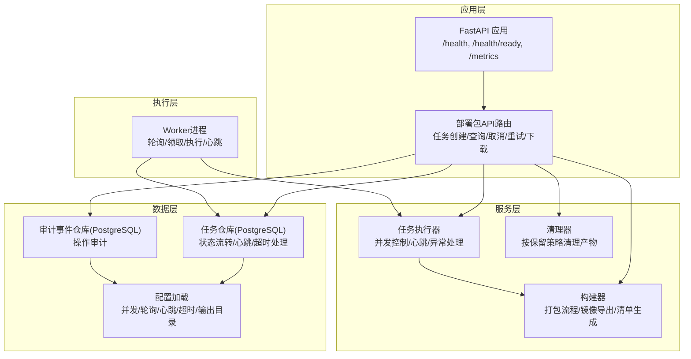
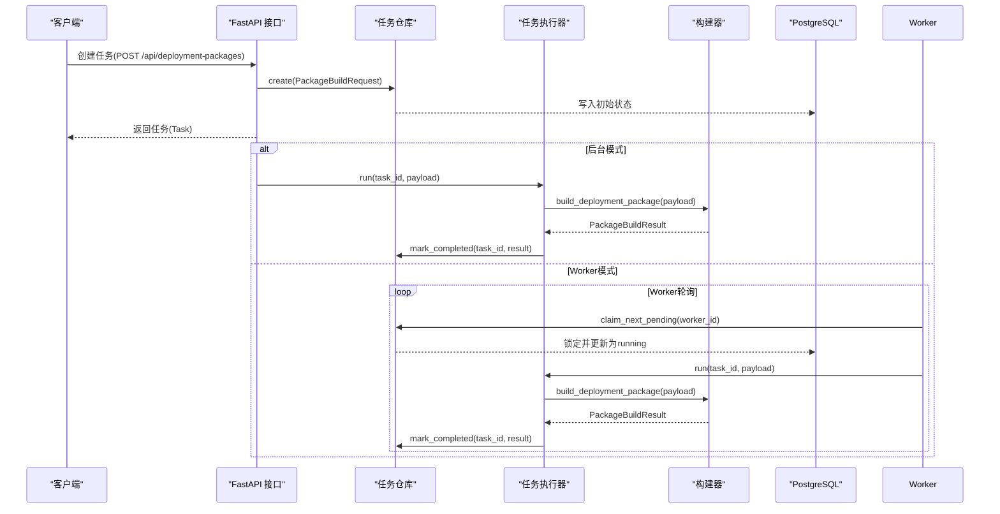
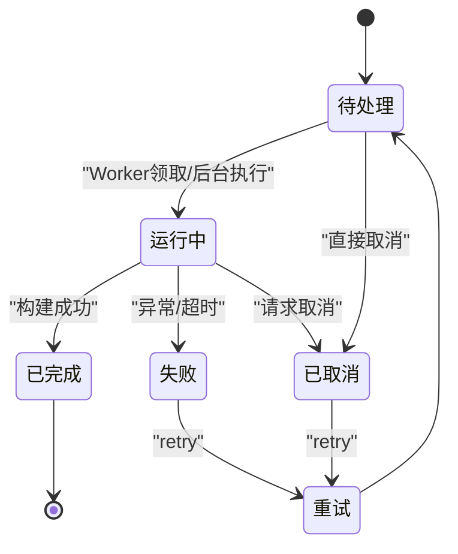
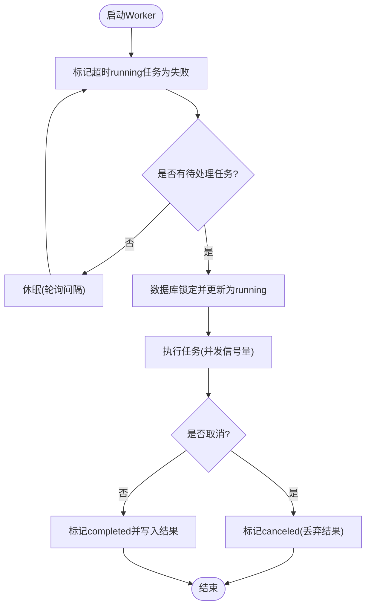
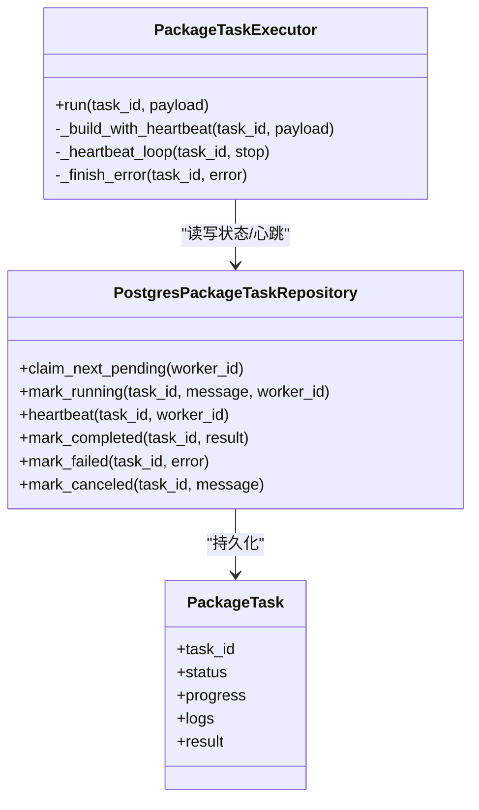
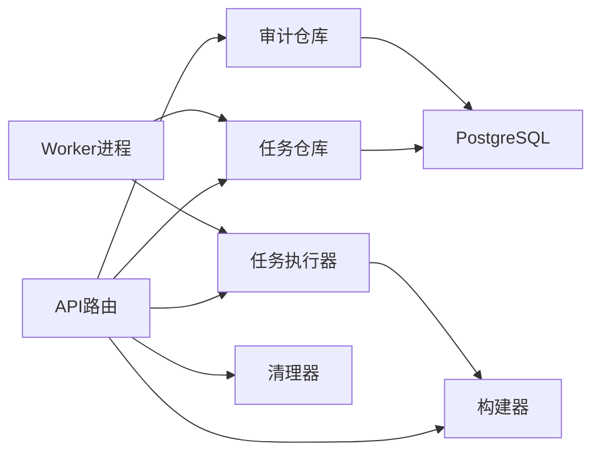

# 任务执行系统

<cite>
**本文档引用的文件**
- [backend/deployment_package_factory/main.py](file://backend/deployment_package_factory/main.py)
- [backend/deployment_package_factory/worker.py](file://backend/deployment_package_factory/worker.py)
- [backend/deployment_package_factory/services/deployment_packages/task_executor.py](file://backend/deployment_package_factory/services/deployment_packages/task_executor.py)
- [backend/deployment_package_factory/services/deployment_packages/models.py](file://backend/deployment_package_factory/services/deployment_packages/models.py)
- [backend/deployment_package_factory/services/deployment_packages/repositories.py](file://backend/deployment_package_factory/services/deployment_packages/repositories.py)
- [backend/deployment_package_factory/services/deployment_packages/postgres_repositories.py](file://backend/deployment_package_factory/services/deployment_packages/postgres_repositories.py)
- [backend/deployment_package_factory/settings.py](file://backend/deployment_package_factory/settings.py)
- [backend/deployment_package_factory/metrics.py](file://backend/deployment_package_factory/metrics.py)
- [backend/deployment_package_factory/readiness.py](file://backend/deployment_package_factory/readiness.py)
- [backend/deployment_package_factory/api/deployment_packages.py](file://backend/deployment_package_factory/api/deployment_packages.py)
- [backend/deployment_package_factory/services/deployment_packages/builder.py](file://backend/deployment_package_factory/services/deployment_packages/builder.py)
- [backend/deployment_package_factory/services/deployment_packages/cleanup.py](file://backend/deployment_package_factory/services/deployment_packages/cleanup.py)
- [backend/deployment_package_factory/auth.py](file://backend/deployment_package_factory/auth.py)
- [backend/tests/test_deployment_package_task_executor.py](file://backend/tests/test_deployment_package_task_executor.py)
- [backend/tests/test_worker.py](file://backend/tests/test_worker.py)
</cite>

## 目录
1. [引言](#引言)
2. [项目结构](#项目结构)
3. [核心组件](#核心组件)
4. [架构总览](#架构总览)
5. [详细组件分析](#详细组件分析)
6. [依赖分析](#依赖分析)
7. [性能考虑](#性能考虑)
8. [故障排查指南](#故障排查指南)
9. [结论](#结论)
10. [附录](#附录)

## 引言
本文件面向部署包工厂任务执行系统，提供从架构设计到运维实践的完整技术文档。重点覆盖异步任务处理、Worker进程模型、任务调度与生命周期管理、并发与资源控制、优先级与超时重试策略，以及监控与故障诊断能力。读者可据此理解系统如何通过HTTP API触发任务、通过后台或Worker模式执行任务，并通过持久化存储与指标监控保障稳定性。

## 项目结构
后端采用FastAPI应用作为入口，提供REST接口；同时提供独立的Worker进程用于后台任务执行。任务状态与审计事件通过PostgreSQL持久化，支持健康检查、就绪检查与Prometheus指标导出。

图表来源
- [backend/deployment_package_factory/main.py:23-64](file://backend/deployment_package_factory/main.py#L23-L64)
- [backend/deployment_package_factory/api/deployment_packages.py:50-103](file://backend/deployment_package_factory/api/deployment_packages.py#L50-L103)
- [backend/deployment_package_factory/worker.py:19-51](file://backend/deployment_package_factory/worker.py#L19-L51)
- [backend/deployment_package_factory/services/deployment_packages/task_executor.py:20-47](file://backend/deployment_package_factory/services/deployment_packages/task_executor.py#L20-L47)
- [backend/deployment_package_factory/services/deployment_packages/postgres_repositories.py:26-318](file://backend/deployment_package_factory/services/deployment_packages/postgres_repositories.py#L26-L318)
- [backend/deployment_package_factory/services/deployment_packages/builder.py:146-246](file://backend/deployment_package_factory/services/deployment_packages/builder.py#L146-L246)

章节来源
- [backend/deployment_package_factory/main.py:23-64](file://backend/deployment_package_factory/main.py#L23-L64)
- [backend/deployment_package_factory/api/deployment_packages.py:50-103](file://backend/deployment_package_factory/api/deployment_packages.py#L50-L103)

## 核心组件
- 任务模型与状态机
  - 任务状态：待处理、运行中、已完成、失败、已取消
  - 关键字段：进度、消息、日志、结果、错误、工作目录、制品路径、心跳时间、工单ID等
- 任务仓库
  - 提供创建、查询、列表、状态更新、心跳、超时标记失败、取消、重试、指标汇总等能力
- 任务执行器
  - 基于信号量的并发控制，心跳循环，异常边界处理，取消请求检测
- 构建器
  - 打包主流程：解析目录、渲染清单、导出镜像归档、生成校验与制品
- Worker
  - 轮询待处理任务、标记领取、执行、心跳、超时失败
- 配置与设置
  - 并发数、轮询间隔、心跳周期、超时分钟数、输出目录、保留天数、最大容量等
- 指标与就绪检查
  - Prometheus指标导出、健康与就绪检查

章节来源
- [backend/deployment_package_factory/services/deployment_packages/models.py:217-237](file://backend/deployment_package_factory/services/deployment_packages/models.py#L217-L237)
- [backend/deployment_package_factory/services/deployment_packages/postgres_repositories.py:31-318](file://backend/deployment_package_factory/services/deployment_packages/postgres_repositories.py#L31-L318)
- [backend/deployment_package_factory/services/deployment_packages/task_executor.py:20-77](file://backend/deployment_package_factory/services/deployment_packages/task_executor.py#L20-L77)
- [backend/deployment_package_factory/services/deployment_packages/builder.py:146-246](file://backend/deployment_package_factory/services/deployment_packages/builder.py#L146-L246)
- [backend/deployment_package_factory/worker.py:19-51](file://backend/deployment_package_factory/worker.py#L19-L51)
- [backend/deployment_package_factory/settings.py:11-57](file://backend/deployment_package_factory/settings.py#L11-L57)
- [backend/deployment_package_factory/metrics.py:4-38](file://backend/deployment_package_factory/metrics.py#L4-L38)
- [backend/deployment_package_factory/readiness.py:14-37](file://backend/deployment_package_factory/readiness.py#L14-L37)

## 架构总览
系统采用“API触发 + 异步执行”的模式，支持两种执行模式：
- 后台模式：API直接调用执行器，适合轻量任务或开发环境
- Worker模式：API仅创建任务，Worker进程轮询并执行，适合生产环境

图表来源
- [backend/deployment_package_factory/api/deployment_packages.py:245-282](file://backend/deployment_package_factory/api/deployment_packages.py#L245-L282)
- [backend/deployment_package_factory/services/deployment_packages/task_executor.py:26-47](file://backend/deployment_package_factory/services/deployment_packages/task_executor.py#L26-L47)
- [backend/deployment_package_factory/services/deployment_packages/builder.py:146-246](file://backend/deployment_package_factory/services/deployment_packages/builder.py#L146-L246)
- [backend/deployment_package_factory/services/deployment_packages/postgres_repositories.py:98-133](file://backend/deployment_package_factory/services/deployment_packages/postgres_repositories.py#L98-L133)
- [backend/deployment_package_factory/worker.py:37-51](file://backend/deployment_package_factory/worker.py#L37-L51)

## 详细组件分析

### 任务生命周期管理
- 创建：API接收请求，进行前置校验与运行时匹配，创建任务并记录审计事件
- 状态流转：pending → running → completed/failed/canceled
- 取消：支持对pending直接取消，对running请求取消，执行器在下一次检查点丢弃结果并标记canceled
- 重试：仅对failed/canceled任务允许重试，复制原请求并创建新任务
- 清理：按保留策略删除制品、校验文件与工作目录，统计释放空间

图表来源
- [backend/deployment_package_factory/services/deployment_packages/postgres_repositories.py:223-272](file://backend/deployment_package_factory/services/deployment_packages/postgres_repositories.py#L223-L272)
- [backend/deployment_package_factory/services/deployment_packages/postgres_repositories.py:244-256](file://backend/deployment_package_factory/services/deployment_packages/postgres_repositories.py#L244-L256)
- [backend/deployment_package_factory/services/deployment_packages/task_executor.py:39-46](file://backend/deployment_package_factory/services/deployment_packages/task_executor.py#L39-L46)

章节来源
- [backend/deployment_package_factory/api/deployment_packages.py:245-282](file://backend/deployment_package_factory/api/deployment_packages.py#L245-L282)
- [backend/deployment_package_factory/api/deployment_packages.py:356-381](file://backend/deployment_package_factory/api/deployment_packages.py#L356-L381)
- [backend/deployment_package_factory/services/deployment_packages/postgres_repositories.py:223-272](file://backend/deployment_package_factory/services/deployment_packages/postgres_repositories.py#L223-L272)

### Worker进程模型与调度
- 轮询与领取
  - 每轮睡眠后扫描待处理任务，使用数据库行级锁尝试领取第一条
  - 成功领取后更新为running并记录worker_id与心跳时间
- 心跳与超时
  - 执行期间定期心跳，超时后由Worker扫描并标记失败
- 并发控制
  - 使用信号量限制同时执行的任务数量
- 单次执行
  - 支持--once参数仅执行一个任务后退出

图表来源
- [backend/deployment_package_factory/worker.py:37-51](file://backend/deployment_package_factory/worker.py#L37-L51)
- [backend/deployment_package_factory/services/deployment_packages/postgres_repositories.py:158-181](file://backend/deployment_package_factory/services/deployment_packages/postgres_repositories.py#L158-L181)
- [backend/deployment_package_factory/services/deployment_packages/task_executor.py:33-42](file://backend/deployment_package_factory/services/deployment_packages/task_executor.py#L33-L42)

章节来源
- [backend/deployment_package_factory/worker.py:19-51](file://backend/deployment_package_factory/worker.py#L19-L51)
- [backend/deployment_package_factory/services/deployment_packages/task_executor.py:20-47](file://backend/deployment_package_factory/services/deployment_packages/task_executor.py#L20-L47)

### 任务执行模型（同步 vs 异步）
- 同步（后台模式）：API在收到创建请求后立即调用执行器，适合短任务或调试
- 异步（Worker模式）：API仅创建任务，由Worker持续轮询执行，适合长耗时任务与高可用场景
- 执行器并发：通过信号量控制最大并发数，避免资源争抢
- 心跳与异常：执行器在构建过程中定期心跳，异常时统一进入失败分支

图表来源
- [backend/deployment_package_factory/services/deployment_packages/task_executor.py:20-77](file://backend/deployment_package_factory/services/deployment_packages/task_executor.py#L20-L77)
- [backend/deployment_package_factory/services/deployment_packages/postgres_repositories.py:98-200](file://backend/deployment_package_factory/services/deployment_packages/postgres_repositories.py#L98-L200)
- [backend/deployment_package_factory/services/deployment_packages/models.py:220-237](file://backend/deployment_package_factory/services/deployment_packages/models.py#L220-L237)

章节来源
- [backend/deployment_package_factory/api/deployment_packages.py:91-103](file://backend/deployment_package_factory/api/deployment_packages.py#L91-L103)
- [backend/deployment_package_factory/settings.py:54-57](file://backend/deployment_package_factory/settings.py#L54-L57)

### 并发控制与资源限制
- 最大并发：通过配置项设置，执行器内部以信号量限制
- 输出目录：可配置制品输出根目录，便于磁盘配额与清理
- 资源清理：按保留天数与总量上限清理制品与工作目录，支持dry-run

章节来源
- [backend/deployment_package_factory/settings.py:17-24](file://backend/deployment_package_factory/settings.py#L17-L24)
- [backend/deployment_package_factory/services/deployment_packages/task_executor.py](file://backend/deployment_package_factory/services/deployment_packages/task_executor.py#L24)
- [backend/deployment_package_factory/services/deployment_packages/cleanup.py:32-58](file://backend/deployment_package_factory/services/deployment_packages/cleanup.py#L32-L58)

### 任务优先级、超时与重试
- 优先级：当前实现未显式支持任务优先级排序，采用“先创建先执行”顺序
- 超时：Worker扫描超时running任务并标记失败；执行器在心跳循环中保持活跃
- 重试：仅对failed/canceled任务允许重试，复制原始请求并创建新任务

章节来源
- [backend/deployment_package_factory/services/deployment_packages/postgres_repositories.py:158-181](file://backend/deployment_package_factory/services/deployment_packages/postgres_repositories.py#L158-L181)
- [backend/deployment_package_factory/services/deployment_packages/postgres_repositories.py:244-256](file://backend/deployment_package_factory/services/deployment_packages/postgres_repositories.py#L244-L256)
- [backend/deployment_package_factory/worker.py:37-41](file://backend/deployment_package_factory/worker.py#L37-L41)

### 监控、性能与运维
- 指标导出：暴露Prometheus格式指标，包含任务总数、按状态计数、可用制品数与字节数、审计事件总数与按动作计数
- 就绪检查：验证数据库连接、元数据表可达性、输出目录可写、镜像导出工具可用性
- 认证：支持Bearer Token、自定义头与特定查询参数（下载相关接口）

章节来源
- [backend/deployment_package_factory/metrics.py:4-38](file://backend/deployment_package_factory/metrics.py#L4-L38)
- [backend/deployment_package_factory/readiness.py:14-37](file://backend/deployment_package_factory/readiness.py#L14-L37)
- [backend/deployment_package_factory/auth.py:10-27](file://backend/deployment_package_factory/auth.py#L10-L27)

## 依赖分析
- 组件耦合
  - API路由依赖任务仓库、审计仓库、执行器、构建器与清理器
  - Worker依赖任务仓库与执行器
  - 执行器依赖仓库与构建器
  - 仓库依赖PostgreSQL驱动与模型
- 外部依赖
  - PostgreSQL：任务与审计事件持久化
  - Docker/Skopeo：镜像导出（可选）
  - Kubernetes：运行时镜像发现（可选）

图表来源
- [backend/deployment_package_factory/api/deployment_packages.py:42-103](file://backend/deployment_package_factory/api/deployment_packages.py#L42-L103)
- [backend/deployment_package_factory/worker.py:22-31](file://backend/deployment_package_factory/worker.py#L22-L31)
- [backend/deployment_package_factory/services/deployment_packages/postgres_repositories.py:26-318](file://backend/deployment_package_factory/services/deployment_packages/postgres_repositories.py#L26-L318)

章节来源
- [backend/deployment_package_factory/services/deployment_packages/repositories.py:10-25](file://backend/deployment_package_factory/services/deployment_packages/repositories.py#L10-L25)
- [backend/deployment_package_factory/services/deployment_packages/postgres_repositories.py:26-318](file://backend/deployment_package_factory/services/deployment_packages/postgres_repositories.py#L26-L318)

## 性能考虑
- 并发度权衡：合理设置最大并发，避免CPU/IO瓶颈；结合磁盘吞吐与网络带宽评估
- 心跳与轮询：心跳周期过短增加数据库压力，轮询间隔过短浪费CPU，需根据任务时长与吞吐调优
- 清理策略：定期清理过期与超量制品，防止磁盘膨胀影响I/O
- 构建阶段优化：镜像导出与压缩过程可受外部工具与网络影响，建议在稳定环境中执行

## 故障排查指南
- 健康与就绪
  - 使用/health与/health/ready接口快速判断服务状态与依赖可用性
- 任务状态异常
  - 若任务长时间处于running且无心跳，检查Worker是否正常运行与数据库连接
  - 使用任务列表与详情接口定位具体任务
- 取消与重试
  - 对running任务请求取消不会立即终止，需等待当前步骤完成；重试会创建新任务
- 下载与校验
  - 下载接口支持Range与If-Range，若返回416需检查Range范围
- 日志与审计
  - 通过审计事件接口查看操作历史，辅助问题定位

章节来源
- [backend/deployment_package_factory/main.py:41-55](file://backend/deployment_package_factory/main.py#L41-L55)
- [backend/deployment_package_factory/api/deployment_packages.py:295-306](file://backend/deployment_package_factory/api/deployment_packages.py#L295-L306)
- [backend/deployment_package_factory/api/deployment_packages.py:392-424](file://backend/deployment_package_factory/api/deployment_packages.py#L392-L424)
- [backend/deployment_package_factory/readiness.py:14-37](file://backend/deployment_package_factory/readiness.py#L14-L37)

## 结论
该系统通过清晰的API、可靠的仓库与执行器、灵活的Worker模式与完善的监控机制，实现了高可用的部署包异步任务执行。生产部署建议启用Worker模式、合理配置并发与超时、定期清理制品，并结合就绪检查与指标监控保障稳定性。

## 附录
- 测试要点
  - 执行器并发与输出目录传递
  - 取消请求后丢弃结果
  - 心跳刷新与超时标记失败
  - Worker单次执行与超时清理

章节来源
- [backend/tests/test_deployment_package_task_executor.py:12-107](file://backend/tests/test_deployment_package_task_executor.py#L12-L107)
- [backend/tests/test_worker.py:11-55](file://backend/tests/test_worker.py#L11-L55)