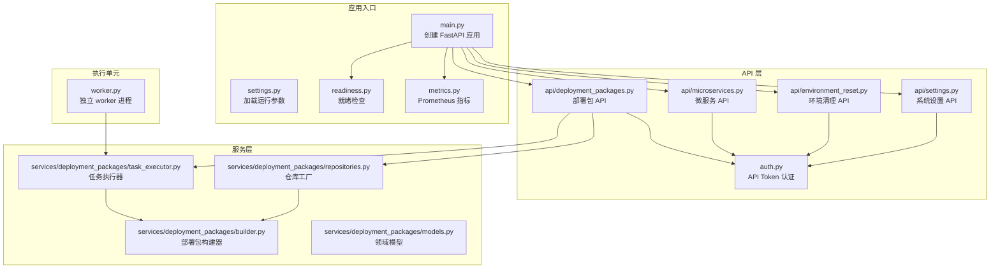
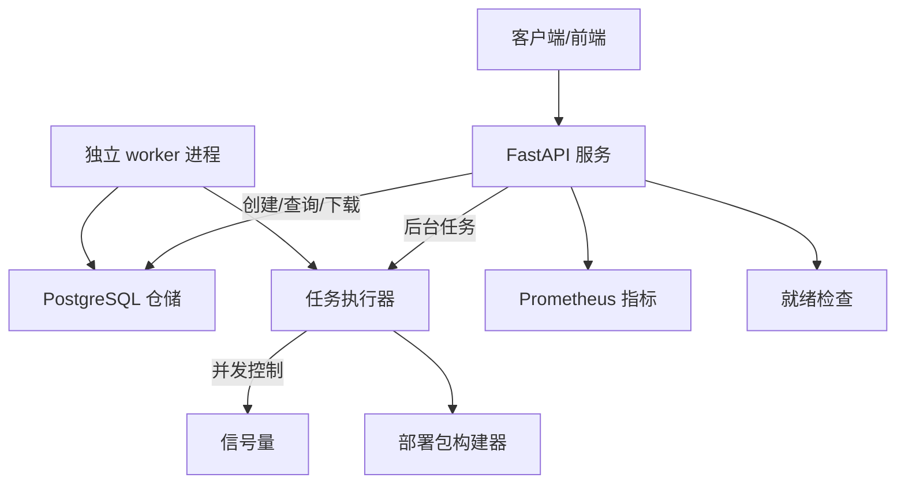
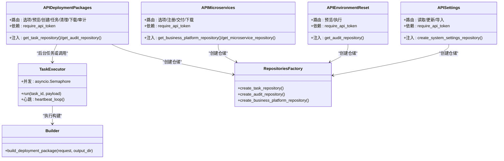
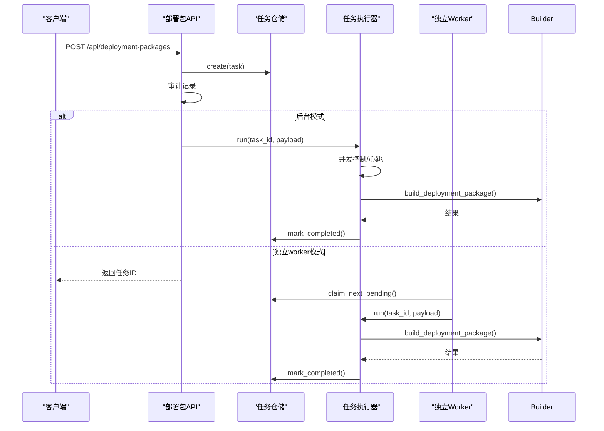
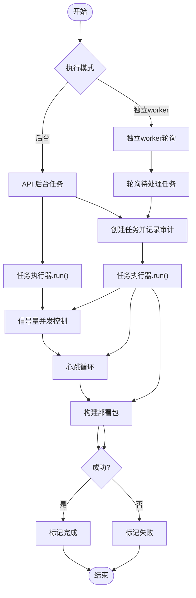
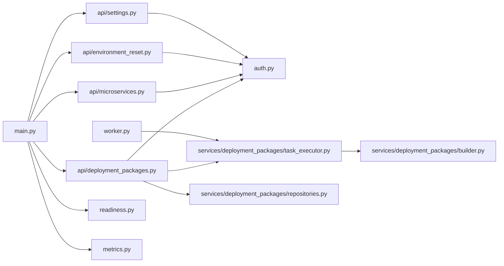

# 后端架构

<cite>
**本文引用的文件**
- [main.py](file://backend/deployment_package_factory/main.py)
- [settings.py](file://backend/deployment_package_factory/settings.py)
- [auth.py](file://backend/deployment_package_factory/auth.py)
- [worker.py](file://backend/deployment_package_factory/worker.py)
- [deployment_packages.py](file://backend/deployment_package_factory/api/deployment_packages.py)
- [microservices.py](file://backend/deployment_package_factory/api/microservices.py)
- [environment_reset.py](file://backend/deployment_package_factory/api/environment_reset.py)
- [settings_api.py](file://backend/deployment_package_factory/api/settings.py)
- [models.py](file://backend/deployment_package_factory/services/deployment_packages/models.py)
- [task_executor.py](file://backend/deployment_package_factory/services/deployment_packages/task_executor.py)
- [repositories.py](file://backend/deployment_package_factory/services/deployment_packages/repositories.py)
- [builder.py](file://backend/deployment_package_factory/services/deployment_packages/builder.py)
- [readiness.py](file://backend/deployment_package_factory/readiness.py)
- [metrics.py](file://backend/deployment_package_factory/metrics.py)
</cite>

## 目录
1. [简介](#简介)
2. [项目结构](#项目结构)
3. [核心组件](#核心组件)
4. [架构总览](#架构总览)
5. [详细组件分析](#详细组件分析)
6. [依赖关系分析](#依赖关系分析)
7. [性能考量](#性能考量)
8. [故障排查指南](#故障排查指南)
9. [结论](#结论)
10. [附录](#附录)

## 简介
本文件面向部署包工厂后端架构，围绕基于 FastAPI 的服务设计进行系统化说明。内容涵盖应用入口与中间件、API 路由与认证授权、分层架构（表示层、业务层、数据访问层）、核心业务模块（部署包生成、微服务注册、系统设置管理、环境清理）、依赖注入与并发控制、任务执行模型（后台任务 vs 独立 worker）、数据库与任务状态管理、审计日志与指标监控等。

## 项目结构
后端采用“应用入口 + API 控制器 + 服务层 + 数据访问层”的分层组织方式，配合独立 worker 进程执行耗时任务，确保 API 响应性与可扩展性。

图示来源
- [main.py:1-68](file://backend/deployment_package_factory/main.py#L1-L68)
- [settings.py:1-57](file://backend/deployment_package_factory/settings.py#L1-L57)
- [auth.py:1-41](file://backend/deployment_package_factory/auth.py#L1-L41)
- [worker.py:1-63](file://backend/deployment_package_factory/worker.py#L1-L63)
- [deployment_packages.py:1-658](file://backend/deployment_package_factory/api/deployment_packages.py#L1-L658)
- [microservices.py:1-211](file://backend/deployment_package_factory/api/microservices.py#L1-L211)
- [environment_reset.py:1-74](file://backend/deployment_package_factory/api/environment_reset.py#L1-L74)
- [settings_api.py:1-69](file://backend/deployment_package_factory/api/settings.py#L1-L69)
- [task_executor.py:1-77](file://backend/deployment_package_factory/services/deployment_packages/task_executor.py#L1-L77)
- [builder.py:1-200](file://backend/deployment_package_factory/services/deployment_packages/builder.py#L1-L200)
- [repositories.py:1-26](file://backend/deployment_package_factory/services/deployment_packages/repositories.py#L1-L26)
- [readiness.py:1-102](file://backend/deployment_package_factory/readiness.py#L1-L102)
- [metrics.py:1-38](file://backend/deployment_package_factory/metrics.py#L1-L38)

章节来源
- [main.py:1-68](file://backend/deployment_package_factory/main.py#L1-L68)
- [settings.py:1-57](file://backend/deployment_package_factory/settings.py#L1-L57)

## 核心组件
- 应用入口与中间件：创建 FastAPI 实例，启用 CORS，挂载各路由，并提供健康检查、就绪检查与指标端点。
- 认证授权：统一的 API Token 校验中间件，支持请求头、查询参数等多种传递方式。
- API 路由：按功能划分为部署包、微服务、环境清理、系统设置四个模块，均依赖统一认证。
- 服务层：封装业务流程，如部署包构建、任务执行、微服务脚手架与交付、环境清理等。
- 数据访问层：通过仓库工厂创建 PostgreSQL 仓储，负责任务、审计事件、业务平台、微服务等持久化。
- 执行模型：支持“后台任务”和“独立 worker”两种模式；后台模式下由 API 在后台线程池中触发任务；独立 worker 模式下由独立进程轮询并执行任务。
- 并发控制：使用信号量限制并发构建数量，心跳机制保障任务存活与超时处理。
- 指标与审计：暴露 Prometheus 指标，记录操作审计事件，便于可观测性与合规追溯。

章节来源
- [main.py:23-68](file://backend/deployment_package_factory/main.py#L23-L68)
- [auth.py:10-41](file://backend/deployment_package_factory/auth.py#L10-L41)
- [deployment_packages.py:50-108](file://backend/deployment_package_factory/api/deployment_packages.py#L50-L108)
- [task_executor.py:20-77](file://backend/deployment_package_factory/services/deployment_packages/task_executor.py#L20-L77)
- [repositories.py:10-26](file://backend/deployment_package_factory/services/deployment_packages/repositories.py#L10-L26)
- [metrics.py:4-38](file://backend/deployment_package_factory/metrics.py#L4-L38)

## 架构总览
后端采用“API 服务 + 独立 worker + 共享存储”的解耦架构。API 仅负责接收请求、调度任务与提供下载能力；worker 负责实际的构建与打包；所有状态与元数据通过 PostgreSQL 仓储持久化，支持就绪检查与指标导出。

图示来源
- [main.py:23-68](file://backend/deployment_package_factory/main.py#L23-L68)
- [worker.py:19-63](file://backend/deployment_package_factory/worker.py#L19-L63)
- [task_executor.py:20-77](file://backend/deployment_package_factory/services/deployment_packages/task_executor.py#L20-L77)
- [builder.py:146-200](file://backend/deployment_package_factory/services/deployment_packages/builder.py#L146-L200)
- [readiness.py:14-37](file://backend/deployment_package_factory/readiness.py#L14-L37)
- [metrics.py:4-38](file://backend/deployment_package_factory/metrics.py#L4-L38)

## 详细组件分析

### 应用入口与中间件
- 创建 FastAPI 应用，启用 CORS，挂载四类路由：部署包、微服务、环境清理、系统设置。
- 提供 /health、/health/ready、/metrics 三个内置端点，分别用于健康探测、就绪检查与指标导出。
- 就绪检查综合数据库连接、输出目录可写性、镜像导出工具可用性等维度，返回 ready/degraded/not_ready。

章节来源
- [main.py:23-68](file://backend/deployment_package_factory/main.py#L23-L68)
- [readiness.py:14-102](file://backend/deployment_package_factory/readiness.py#L14-L102)

### 认证与授权
- 统一中间件 require_api_token 支持 Authorization 头、自定义 X-Deployment-Package-Token 头与查询参数 deployment_package_token。
- 对特定下载接口允许通过查询参数传递令牌，其余接口默认不接受查询令牌以降低泄露风险。
- 通过 secrets.compare_digest 防范时序攻击；未配置令牌时默认放行。

章节来源
- [auth.py:10-41](file://backend/deployment_package_factory/auth.py#L10-L41)

### API 路由设计
- 部署包 API：提供选项查询、预览、创建、任务列表/详情、重试/取消、清理、下载、校验和、脚本下载、审计事件查询等。
- 微服务 API：提供脚手架选项、注册、交付状态与重试、下载等。
- 环境清理 API：提供预览与执行，支持审计记录。
- 系统设置 API：提供读取、更新与从 Excel 导入环境设置的能力。

章节来源
- [deployment_packages.py:50-658](file://backend/deployment_package_factory/api/deployment_packages.py#L50-L658)
- [microservices.py:29-211](file://backend/deployment_package_factory/api/microservices.py#L29-L211)
- [environment_reset.py:16-74](file://backend/deployment_package_factory/api/environment_reset.py#L16-L74)
- [settings_api.py:17-69](file://backend/deployment_package_factory/api/settings.py#L17-L69)

### 分层架构与依赖注入
- 表示层（API 控制器）：集中于 api/*，负责请求解析、鉴权、调用服务层与仓储层、返回响应。
- 业务层（服务类）：集中在 services/deployment_packages/* 与 services/microservices/*，封装具体业务流程。
- 数据访问层（仓库模式）：通过 repositories.py 工厂方法创建 PostgreSQL 仓储，屏蔽数据库细节。
- 依赖注入：API 控制器通过全局惰性初始化函数（如 get_task_repository/get_audit_repository）注入仓储实例；settings.load_settings 提供运行参数。

图示来源
- [deployment_packages.py:63-108](file://backend/deployment_package_factory/api/deployment_packages.py#L63-L108)
- [microservices.py:36-45](file://backend/deployment_package_factory/api/microservices.py#L36-L45)
- [environment_reset.py:21-44](file://backend/deployment_package_factory/api/environment_reset.py#L21-L44)
- [settings_api.py:35-40](file://backend/deployment_package_factory/api/settings.py#L35-L40)
- [task_executor.py:20-77](file://backend/deployment_package_factory/services/deployment_packages/task_executor.py#L20-L77)
- [builder.py:146-200](file://backend/deployment_package_factory/services/deployment_packages/builder.py#L146-L200)
- [repositories.py:10-26](file://backend/deployment_package_factory/services/deployment_packages/repositories.py#L10-L26)

章节来源
- [deployment_packages.py:63-108](file://backend/deployment_package_factory/api/deployment_packages.py#L63-L108)
- [repositories.py:10-26](file://backend/deployment_package_factory/services/deployment_packages/repositories.py#L10-L26)

### 核心业务模块

#### 部署包生成服务
- 预览与校验：解析目录与业务平台，计算运行时配置与镜像条目，确保请求与运行时匹配。
- 创建与执行：创建任务、记录审计、根据执行模式选择后台任务或独立 worker。
- 下载与校验：支持 Range 断点下载、HEAD 获取元信息、校验和文件下载与脚本下载。
- 清理策略：按保留天数与总大小阈值执行清理，支持 Dry Run。

图示来源
- [deployment_packages.py:245-282](file://backend/deployment_package_factory/api/deployment_packages.py#L245-L282)
- [deployment_packages.py:356-381](file://backend/deployment_package_factory/api/deployment_packages.py#L356-L381)
- [worker.py:19-51](file://backend/deployment_package_factory/worker.py#L19-L51)
- [task_executor.py:26-47](file://backend/deployment_package_factory/services/deployment_packages/task_executor.py#L26-L47)
- [builder.py:146-200](file://backend/deployment_package_factory/services/deployment_packages/builder.py#L146-L200)

章节来源
- [deployment_packages.py:126-165](file://backend/deployment_package_factory/api/deployment_packages.py#L126-L165)
- [deployment_packages.py:308-330](file://backend/deployment_package_factory/api/deployment_packages.py#L308-L330)
- [deployment_packages.py:392-460](file://backend/deployment_package_factory/api/deployment_packages.py#L392-L460)

#### 微服务注册服务
- 选项与注册：根据业务平台与系统设置生成脚手架，准备交付配置，最终落库。
- 交付状态：支持刷新与重试，结合系统设置与中间件配置键动态生成。
- 下载：提供脚手架产物下载。

章节来源
- [microservices.py:47-67](file://backend/deployment_package_factory/api/microservices.py#L47-L67)
- [microservices.py:132-156](file://backend/deployment_package_factory/api/microservices.py#L132-L156)
- [microservices.py:159-168](file://backend/deployment_package_factory/api/microservices.py#L159-L168)

#### 系统设置管理
- 读取与更新：提供当前系统设置的读取与全量更新。
- 环境导入：从 Excel 文件导入环境设置，合并当前配置并保存。

章节来源
- [settings_api.py:42-69](file://backend/deployment_package_factory/api/settings.py#L42-L69)

#### 环境清理服务
- 预览与执行：根据配置计算清理范围，执行清理并记录审计事件。

章节来源
- [environment_reset.py:24-44](file://backend/deployment_package_factory/api/environment_reset.py#L24-L44)

### 任务执行模型与并发控制
- 执行模式：支持 background 与 worker 两种模式，由环境变量控制。
- 并发控制：使用 asyncio.Semaphore 限制最大并发构建数。
- 心跳与超时：执行器周期发送心跳，worker 定期标记过期任务为失败。
- 取消与错误处理：支持任务取消、异常捕获与失败标记，保证健壮性。

图示来源
- [settings.py:26-57](file://backend/deployment_package_factory/settings.py#L26-L57)
- [task_executor.py:20-77](file://backend/deployment_package_factory/services/deployment_packages/task_executor.py#L20-L77)
- [worker.py:19-51](file://backend/deployment_package_factory/worker.py#L19-L51)

章节来源
- [settings.py:26-57](file://backend/deployment_package_factory/settings.py#L26-L57)
- [task_executor.py:20-77](file://backend/deployment_package_factory/services/deployment_packages/task_executor.py#L20-L77)
- [worker.py:19-51](file://backend/deployment_package_factory/worker.py#L19-L51)

### 数据模型与仓储
- 领域模型：包含部署包请求/预览/结果、任务状态、审计事件等核心数据结构。
- 仓储工厂：根据数据库 URL 创建任务、审计、业务平台、微服务等仓储实例。
- 错误处理：当数据库 URL 为空时抛出运行时错误，提示需要配置 PostgreSQL。

章节来源
- [models.py:104-251](file://backend/deployment_package_factory/services/deployment_packages/models.py#L104-L251)
- [repositories.py:10-26](file://backend/deployment_package_factory/services/deployment_packages/repositories.py#L10-L26)

## 依赖关系分析

图示来源
- [main.py:7-19](file://backend/deployment_package_factory/main.py#L7-L19)
- [deployment_packages.py:11-46](file://backend/deployment_package_factory/api/deployment_packages.py#L11-L46)
- [microservices.py:8-28](file://backend/deployment_package_factory/api/microservices.py#L8-L28)
- [environment_reset.py:5-14](file://backend/deployment_package_factory/api/environment_reset.py#L5-L14)
- [settings_api.py:9-15](file://backend/deployment_package_factory/api/settings.py#L9-L15)
- [task_executor.py:7-10](file://backend/deployment_package_factory/services/deployment_packages/task_executor.py#L7-L10)
- [builder.py:27-35](file://backend/deployment_package_factory/services/deployment_packages/builder.py#L27-L35)
- [repositories.py:3-7](file://backend/deployment_package_factory/services/deployment_packages/repositories.py#L3-L7)
- [worker.py:10-13](file://backend/deployment_package_factory/worker.py#L10-L13)
- [readiness.py:7-21](file://backend/deployment_package_factory/readiness.py#L7-L21)
- [metrics.py:4](file://backend/deployment_package_factory/metrics.py#L4)

章节来源
- [main.py:7-19](file://backend/deployment_package_factory/main.py#L7-L19)
- [deployment_packages.py:11-46](file://backend/deployment_package_factory/api/deployment_packages.py#L11-L46)
- [repositories.py:3-7](file://backend/deployment_package_factory/services/deployment_packages/repositories.py#L3-L7)

## 性能考量
- 并发与资源：通过最大并发构建数限制 CPU/磁盘/网络资源占用；合理设置 worker 心跳间隔与轮询间隔，避免过度轮询。
- I/O 优化：下载支持 Range 与 HEAD，减少带宽浪费；校验和与脚本下载提供便捷工具链。
- 存储与清理：按保留天数与总大小阈值清理历史产物，防止磁盘膨胀。
- 指标观测：暴露任务总数、按状态分布、可用产物数量与字节数、审计事件计数等指标，便于容量规划与问题定位。

## 故障排查指南
- 就绪检查失败
  - 数据库 URL 未配置：确认 DEPLOYMENT_PACKAGE_DATABASE_URL。
  - 输出目录不可写：确认输出目录存在且可写。
  - 镜像导出工具不可用：安装 skopeo 或具备 Docker CLI 与守护进程权限。
- 任务长时间无进展
  - 检查 worker 是否在运行，确认轮询与心跳配置。
  - 查看任务状态与日志，确认是否被标记为失败或取消。
- 下载异常
  - Range 请求格式错误会返回 416；检查 Range/If-Range 头。
  - 校验和文件缺失时返回 404，确认产物路径与 SHA256。
- 认证失败
  - 确认 API Token 设置正确，请求头或查询参数传递方式符合要求。

章节来源
- [readiness.py:58-101](file://backend/deployment_package_factory/readiness.py#L58-L101)
- [deployment_packages.py:413-416](file://backend/deployment_package_factory/api/deployment_packages.py#L413-L416)
- [auth.py:17-27](file://backend/deployment_package_factory/auth.py#L17-L27)

## 结论
该后端以 FastAPI 为核心，结合独立 worker 与 PostgreSQL 仓储，实现了高可用、可观测、可扩展的部署包工厂服务。通过清晰的分层与依赖注入，业务逻辑与基础设施解耦；通过后台任务与独立 worker 的灵活切换，满足不同部署场景下的吞吐与延迟需求；完善的审计与指标体系为运维与合规提供了坚实基础。

## 附录

### 关键配置项
- 数据目录与输出目录：DEPLOYMENT_PACKAGE_DATA_DIR、DEPLOYMENT_PACKAGE_OUTPUT_DIR
- 数据库连接：DEPLOYMENT_PACKAGE_DATABASE_URL
- API Token：DEPLOYMENT_PACKAGE_API_TOKEN
- 并发与执行：DEPLOYMENT_PACKAGE_MAX_CONCURRENT_BUILDS、DEPLOYMENT_PACKAGE_EXECUTION_MODE
- 轮询与心跳：DEPLOYMENT_PACKAGE_WORKER_POLL_INTERVAL_SECONDS、DEPLOYMENT_PACKAGE_WORKER_HEARTBEAT_SECONDS
- 超时与保留：DEPLOYMENT_PACKAGE_RUNNING_TASK_TIMEOUT_MINUTES、DEPLOYMENT_PACKAGE_RETENTION_DAYS、DEPLOYMENT_PACKAGE_MAX_TOTAL_GB

章节来源
- [settings.py:26-57](file://backend/deployment_package_factory/settings.py#L26-L57)