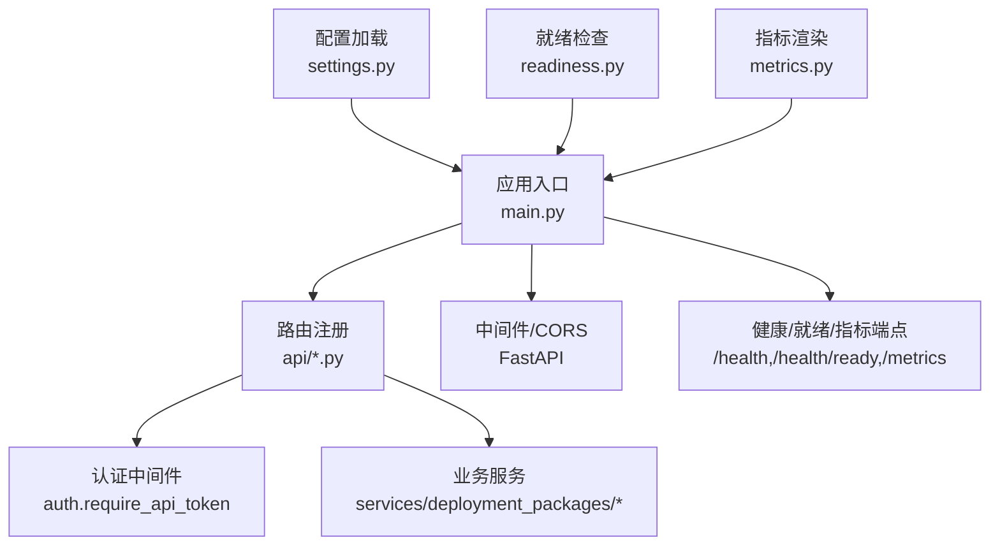
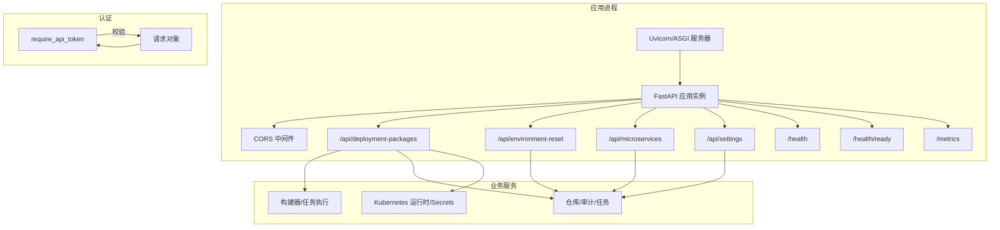
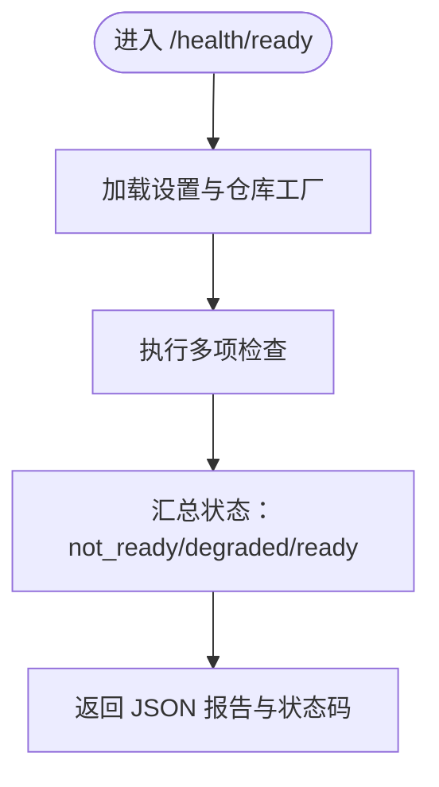
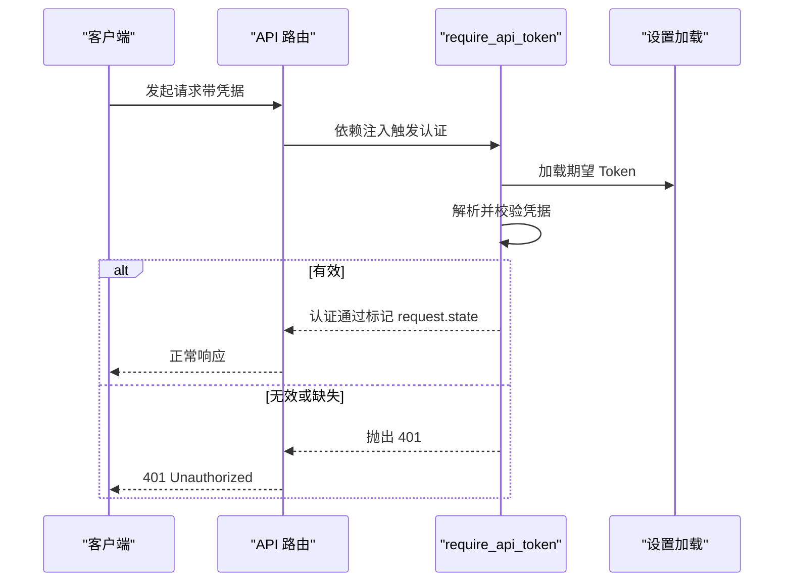
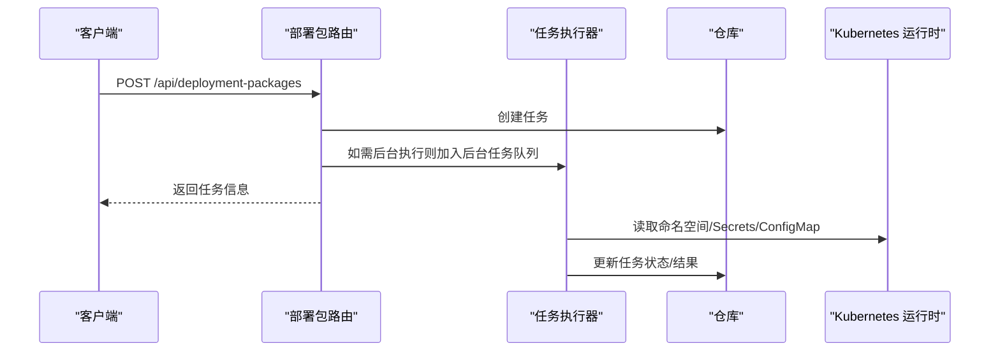
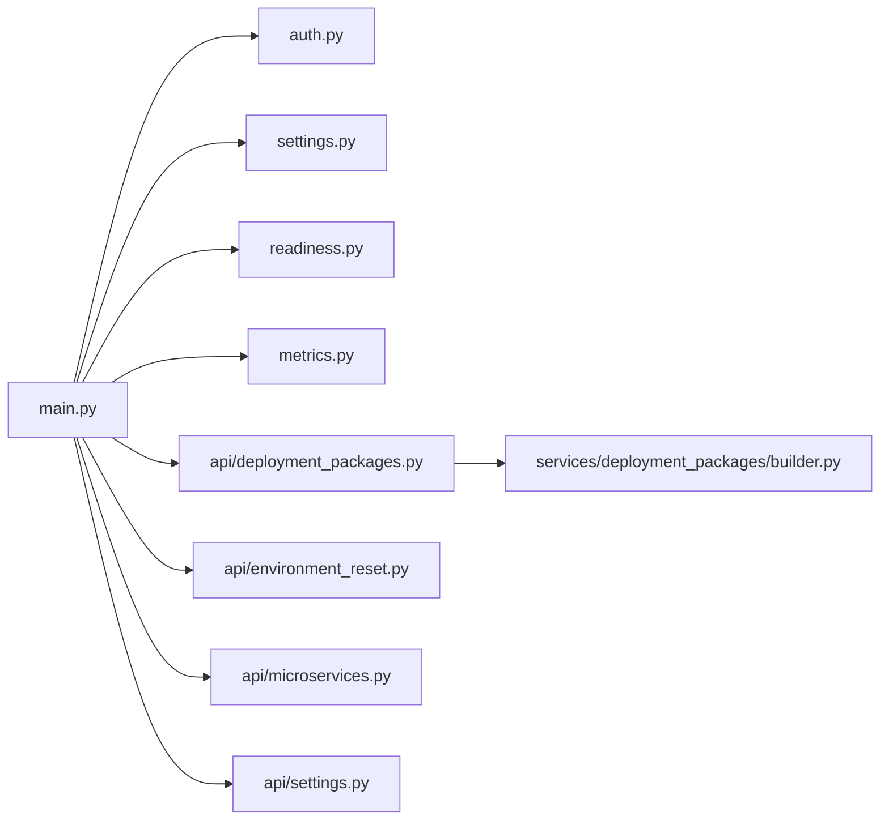

# 应用架构

<cite>
**本文引用的文件**
- [backend/deployment_package_factory/main.py](file://backend/deployment_package_factory/main.py)
- [backend/deployment_package_factory/__init__.py](file://backend/deployment_package_factory/__init__.py)
- [backend/deployment_package_factory/settings.py](file://backend/deployment_package_factory/settings.py)
- [backend/deployment_package_factory/metrics.py](file://backend/deployment_package_factory/metrics.py)
- [backend/deployment_package_factory/readiness.py](file://backend/deployment_package_factory/readiness.py)
- [backend/deployment_package_factory/auth.py](file://backend/deployment_package_factory/auth.py)
- [backend/deployment_package_factory/api/deployment_packages.py](file://backend/deployment_package_factory/api/deployment_packages.py)
- [backend/deployment_package_factory/api/environment_reset.py](file://backend/deployment_package_factory/api/environment_reset.py)
- [backend/deployment_package_factory/api/microservices.py](file://backend/deployment_package_factory/api/microservices.py)
- [backend/deployment_package_factory/api/settings.py](file://backend/deployment_package_factory/api/settings.py)
- [backend/deployment_package_factory/services/deployment_packages/builder.py](file://backend/deployment_package_factory/services/deployment_packages/builder.py)
- [backend/pyproject.toml](file://backend/pyproject.toml)
</cite>

## 目录
1. [引言](#引言)
2. [项目结构](#项目结构)
3. [核心组件](#核心组件)
4. [架构总览](#架构总览)
5. [组件详解](#组件详解)
6. [依赖关系分析](#依赖关系分析)
7. [性能与可扩展性](#性能与可扩展性)
8. [故障排查指南](#故障排查指南)
9. [结论](#结论)
10. [附录](#附录)

## 引言
本技术文档面向“部署包工厂”应用，系统化阐述基于 FastAPI 的应用入口设计、中间件与认证、路由注册机制、健康与就绪检查、指标暴露、配置加载与环境变量管理、安全认证体系、生命周期与优雅关闭、性能监控与日志、以及错误处理策略等关键架构决策。文档以代码为依据，提供分层讲解与可视化图示，帮助读者快速理解并高效运维该服务。

## 项目结构
后端采用模块化组织，核心入口位于应用根目录，API 路由按功能域拆分，业务逻辑集中在 services 子模块，配置与工具分布在 settings、metrics、readiness 等模块。整体遵循“按功能域分层”的组织方式，便于维护与扩展。

图表来源
- [backend/deployment_package_factory/main.py:23-67](file://backend/deployment_package_factory/main.py#L23-L67)
- [backend/deployment_package_factory/api/deployment_packages.py:50-54](file://backend/deployment_package_factory/api/deployment_packages.py#L50-L54)
- [backend/deployment_package_factory/auth.py:10-27](file://backend/deployment_package_factory/auth.py#L10-L27)
- [backend/deployment_package_factory/settings.py:26-41](file://backend/deployment_package_factory/settings.py#L26-L41)
- [backend/deployment_package_factory/readiness.py:14-37](file://backend/deployment_package_factory/readiness.py#L14-L37)
- [backend/deployment_package_factory/metrics.py:4-33](file://backend/deployment_package_factory/metrics.py#L4-L33)

章节来源
- [backend/deployment_package_factory/main.py:1-68](file://backend/deployment_package_factory/main.py#L1-L68)
- [backend/deployment_package_factory/__init__.py:1-2](file://backend/deployment_package_factory/__init__.py#L1-L2)

## 核心组件
- 应用实例与中间件
  - 使用 FastAPI 创建应用实例，启用 CORS 允许任意来源、方法与头，便于前端跨域访问。
  - 注册四个 API 路由器：部署包、环境重置、微服务、系统设置。
- 健康检查与就绪检查
  - /health 返回应用基本状态。
  - /health/ready 综合数据库、元数据存储、输出目录、镜像导出环境等检查项，返回 ready/degraded/not_ready，并映射 200/503。
- 指标暴露
  - /metrics 渲染 Prometheus 文本格式指标，包含任务总数、按状态计数、可用制品数量与字节、审计事件总数与按动作计数。
- 配置加载
  - 从环境变量读取数据目录、输出目录、数据库连接串、API Token、并发构建数、执行模式、心跳间隔、超时、保留天数、最大总空间等，提供默认值与正整数校验。
- 认证体系
  - 通过 require_api_token 校验请求中的 Authorization(Bearer)、自定义头 X-Deployment-Package-Token 或查询参数 deployment_package_token（仅下载相关路径允许）。
  - 使用恒等时间比较避免时序攻击；认证成功后在 request.state 标记已认证。
- 业务路由
  - 部署包路由：预览、创建、取消/重试、清理、下载、校验和、脚本下载、业务平台注册/禁用、镜像导出环境检查等。
  - 环境重置路由：预览与执行环境重置。
  - 微服务路由：脚手架生成、交付状态与重试、下载产物。
  - 系统设置路由：读取/更新系统设置、从 Excel 导入环境设置。

章节来源
- [backend/deployment_package_factory/main.py:23-67](file://backend/deployment_package_factory/main.py#L23-L67)
- [backend/deployment_package_factory/readiness.py:14-101](file://backend/deployment_package_factory/readiness.py#L14-L101)
- [backend/deployment_package_factory/metrics.py:4-37](file://backend/deployment_package_factory/metrics.py#L4-L37)
- [backend/deployment_package_factory/settings.py:26-56](file://backend/deployment_package_factory/settings.py#L26-L56)
- [backend/deployment_package_factory/auth.py:10-40](file://backend/deployment_package_factory/auth.py#L10-L40)
- [backend/deployment_package_factory/api/deployment_packages.py:50-103](file://backend/deployment_package_factory/api/deployment_packages.py#L50-L103)
- [backend/deployment_package_factory/api/environment_reset.py:16-43](file://backend/deployment_package_factory/api/environment_reset.py#L16-L43)
- [backend/deployment_package_factory/api/microservices.py:29-33](file://backend/deployment_package_factory/api/microservices.py#L29-L33)
- [backend/deployment_package_factory/api/settings.py:17-68](file://backend/deployment_package_factory/api/settings.py#L17-L68)

## 架构总览
下图展示应用启动、中间件与认证、路由注册、业务处理与外部依赖的整体交互。

图表来源
- [backend/deployment_package_factory/main.py:23-67](file://backend/deployment_package_factory/main.py#L23-L67)
- [backend/deployment_package_factory/auth.py:10-27](file://backend/deployment_package_factory/auth.py#L10-L27)
- [backend/deployment_package_factory/api/deployment_packages.py:50-103](file://backend/deployment_package_factory/api/deployment_packages.py#L50-L103)
- [backend/deployment_package_factory/services/deployment_packages/builder.py:146-246](file://backend/deployment_package_factory/services/deployment_packages/builder.py#L146-L246)

## 组件详解

### 应用入口与中间件
- 应用实例创建：设置标题、版本、描述。
- CORS 配置：允许任意来源、凭证、方法与头，便于前端直连。
- 路由注册：统一 include 四个业务路由器。
- 内置端点：
  - /health：返回应用与服务状态。
  - /health/ready：综合检查并返回 ready/degraded/not_ready，非 ready 映射 503。
  - /metrics：渲染 Prometheus 文本指标，文本类型与字符集声明明确。

章节来源
- [backend/deployment_package_factory/main.py:23-67](file://backend/deployment_package_factory/main.py#L23-L67)

### 健康与就绪检查
- 就绪检查聚合：
  - 数据库连接串是否配置。
  - 元数据存储可达与基础统计（任务/审计/业务平台/微服务数量）。
  - 输出目录可写性探测。
  - 镜像导出环境可用性（优先 skopeo，其次 docker）。
- 状态计算规则：
  - 任一必检失败：not_ready；否则若存在 warning：degraded；否则：ready。
- HTTP 状态码映射：200 若状态为 ready 或 degraded，否则 503。

图表来源
- [backend/deployment_package_factory/main.py:45-55](file://backend/deployment_package_factory/main.py#L45-L55)
- [backend/deployment_package_factory/readiness.py:14-37](file://backend/deployment_package_factory/readiness.py#L14-L37)

章节来源
- [backend/deployment_package_factory/readiness.py:14-101](file://backend/deployment_package_factory/readiness.py#L14-L101)

### 指标暴露
- 指标内容：
  - deployment_package_tasks_total（counter）
  - deployment_package_tasks_by_status{status=...}（gauge）
  - deployment_package_artifacts_available（gauge）
  - deployment_package_artifacts_bytes（gauge）
  - deployment_package_audit_events_total（counter）
  - deployment_package_audit_events_by_action{action=...}（gauge）
- 渲染规则：按仓库摘要生成键值对，标签值进行转义，输出为纯文本。

章节来源
- [backend/deployment_package_factory/metrics.py:4-37](file://backend/deployment_package_factory/metrics.py#L4-L37)

### 配置加载与环境变量管理
- 关键配置项与默认行为：
  - 数据目录与输出目录：支持用户家目录展开，默认输出目录位于数据目录内。
  - 数据库连接串：必填，用于所有仓库初始化。
  - API Token：可选，为空则跳过认证。
  - 并发构建数、执行模式、轮询/心跳间隔、运行任务超时、保留天数、最大总空间（GB）。
- 类型与边界：
  - 正整数解析，非法或空值回退默认且最小为 1。
  - 执行模式限定为 background/worker，非法值回退 background。

章节来源
- [backend/deployment_package_factory/settings.py:26-56](file://backend/deployment_package_factory/settings.py#L26-L56)

### 安全认证体系
- 认证入口：require_api_token
  - 支持三种凭据来源：Authorization 头（Bearer）、X-Deployment-Package-Token 头、deployment_package_token 查询参数。
  - 对于下载类路径（/download、/checksum、/download-script.ps1、/download-script.sh），允许使用查询参数 token。
  - 使用恒等时间字符串比较确保时序安全。
  - 认证成功后在 request.state 标记已认证，供审计与操作者识别使用。
- 依赖注入：各路由依赖 require_api_token，统一拦截未授权请求。

图表来源
- [backend/deployment_package_factory/auth.py:10-27](file://backend/deployment_package_factory/auth.py#L10-L27)
- [backend/deployment_package_factory/api/deployment_packages.py:50-54](file://backend/deployment_package_factory/api/deployment_packages.py#L50-L54)

章节来源
- [backend/deployment_package_factory/auth.py:10-40](file://backend/deployment_package_factory/auth.py#L10-L40)
- [backend/deployment_package_factory/api/deployment_packages.py:50-54](file://backend/deployment_package_factory/api/deployment_packages.py#L50-L54)

### 路由注册机制与业务流程
- 部署包路由（/api/deployment-packages）
  - 依赖 require_api_token，统一认证。
  - 提供选项、预览、创建、列表、详情、取消/重试、清理、下载、校验和、脚本下载、业务平台注册/禁用、镜像导出环境检查等。
  - 下载支持 Range/If-Range，返回 206 或 200。
- 环境重置路由（/api/environment-reset）
  - 预览与执行环境重置，异常映射为 4xx/5xx。
- 微服务路由（/api/microservices）
  - 脚手架生成、交付状态刷新与重试、产物下载。
- 系统设置路由（/api/settings）
  - 读取/更新系统设置，支持从 Excel 导入环境设置。

图表来源
- [backend/deployment_package_factory/api/deployment_packages.py:245-282](file://backend/deployment_package_factory/api/deployment_packages.py#L245-L282)
- [backend/deployment_package_factory/services/deployment_packages/builder.py:146-246](file://backend/deployment_package_factory/services/deployment_packages/builder.py#L146-L246)

章节来源
- [backend/deployment_package_factory/api/deployment_packages.py:50-103](file://backend/deployment_package_factory/api/deployment_packages.py#L50-L103)
- [backend/deployment_package_factory/api/environment_reset.py:16-43](file://backend/deployment_package_factory/api/environment_reset.py#L16-L43)
- [backend/deployment_package_factory/api/microservices.py:29-33](file://backend/deployment_package_factory/api/microservices.py#L29-L33)
- [backend/deployment_package_factory/api/settings.py:17-68](file://backend/deployment_package_factory/api/settings.py#L17-L68)

### 生命周期管理、启动与优雅关闭
- 启动初始化
  - 应用创建与中间件注册在 create_app 中完成。
  - 路由注册与内置端点挂载。
  - 设置加载在就绪检查与指标渲染中按需调用。
- 优雅关闭
  - 未在应用层显式注册 lifespan/on_event 钩子，未见数据库连接池或长连接资源的显式关闭逻辑。
  - 建议在生产环境中通过 ASGI 服务器（如 uvicorn）的 --workers/--reload 参数配合进程级管理实现优雅重启；如需应用级清理，可在 main.py 中补充 lifespan 事件并在退出时释放资源。

章节来源
- [backend/deployment_package_factory/main.py:23-67](file://backend/deployment_package_factory/main.py#L23-L67)

### 性能监控与日志
- 指标
  - Prometheus 文本格式指标，便于 Prometheus 抓取与 Grafana 可视化。
- 日志
  - 部分业务模块使用标准库 logging，例如部署包构建器模块定义了日志记录器，但未在应用入口集中配置日志级别与格式。
- 建议
  - 在应用入口统一配置日志格式与级别，结合结构化日志输出与采样策略，降低高并发下的 I/O 压力。

章节来源
- [backend/deployment_package_factory/services/deployment_packages/builder.py:63-63](file://backend/deployment_package_factory/services/deployment_packages/builder.py#L63-L63)
- [backend/deployment_package_factory/metrics.py:4-37](file://backend/deployment_package_factory/metrics.py#L4-L37)

### 错误处理策略
- 路由层
  - 对业务异常（如 CatalogError、PackageBuildError、ValueError、KubernetesRuntimeError）捕获并映射为 4xx/5xx。
  - 下载 Range 错误返回 416 并携带 Content-Range。
- 就绪检查
  - 异常转换为 failed/warning（取决于 required），并附加异常类名。
- 审计
  - 审计记录异常被吞掉（不影响主流程），保证操作可用性。

章节来源
- [backend/deployment_package_factory/api/deployment_packages.py:163-164](file://backend/deployment_package_factory/api/deployment_packages.py#L163-L164)
- [backend/deployment_package_factory/readiness.py:43-46](file://backend/deployment_package_factory/readiness.py#L43-L46)
- [backend/deployment_package_factory/api/deployment_packages.py:619-620](file://backend/deployment_package_factory/api/deployment_packages.py#L619-L620)

## 依赖关系分析
- 模块耦合
  - main.py 作为入口，耦合路由模块、认证、配置、就绪检查与指标渲染。
  - 各 API 路由依赖认证与 settings.load_settings，再委派至 services 层。
  - services 层依赖 settings、Kubernetes 运行时与仓库接口。
- 外部依赖
  - FastAPI、Uvicorn、Pydantic、PostgreSQL 驱动等。

图表来源
- [backend/deployment_package_factory/main.py:7-19](file://backend/deployment_package_factory/main.py#L7-L19)
- [backend/deployment_package_factory/api/deployment_packages.py:1-47](file://backend/deployment_package_factory/api/deployment_packages.py#L1-L47)
- [backend/deployment_package_factory/services/deployment_packages/builder.py:1-57](file://backend/deployment_package_factory/services/deployment_packages/builder.py#L1-L57)

章节来源
- [backend/deployment_package_factory/pyproject.toml:6-11](file://backend/pyproject.toml#L6-L11)

## 性能与可扩展性
- 并发与执行模式
  - 通过设置 max_concurrent_builds 控制并发；execution_mode 支持 background 与 worker 两种模式，便于按部署形态选择。
- I/O 与下载
  - 下载支持分片传输，减少大文件传输阻塞；建议在反向代理层开启压缩与缓存。
- 资源限制
  - retention_days 与 max_total_gb 限制磁盘占用，避免资源耗尽。
- 建议
  - 引入连接池与超时配置；对高频指标与审计写入增加异步化或批量化；在生产环境使用多进程与健康探针保障稳定性。

[本节为通用指导，不直接分析具体文件]

## 故障排查指南
- /health/ready 返回 not_ready
  - 检查 DEPLOYMENT_PACKAGE_DATABASE_URL 是否配置。
  - 确认元数据存储可达与表结构正常。
  - 确认输出目录存在且可写。
  - 检查镜像导出工具（skopeo/docker）可用性。
- /metrics 无法抓取
  - 确认路由已注册且未被中间件拦截。
  - 检查仓库指标摘要是否正常。
- 下载失败
  - Range 请求非法返回 416，确认 Range/If-Range 头格式。
  - 校验和文件缺失返回 404，确认制品已生成。
- 认证失败
  - 确认 Authorization 头为 Bearer，或使用允许的查询参数 token。
  - 确保 API Token 与设置一致。

章节来源
- [backend/deployment_package_factory/readiness.py:58-101](file://backend/deployment_package_factory/readiness.py#L58-L101)
- [backend/deployment_package_factory/metrics.py:4-37](file://backend/deployment_package_factory/metrics.py#L4-L37)
- [backend/deployment_package_factory/api/deployment_packages.py:413-415](file://backend/deployment_package_factory/api/deployment_packages.py#L413-L415)
- [backend/deployment_package_factory/auth.py:17-26](file://backend/deployment_package_factory/auth.py#L17-L26)

## 结论
该应用以 FastAPI 为核心，采用清晰的路由分层与统一认证策略，结合就绪检查与指标暴露，形成稳定的服务入口。配置加载与环境变量管理提供了灵活的部署适配能力。建议在生产环境中完善应用级生命周期钩子、日志与监控配置，并对高并发场景进行资源与限流优化。

[本节为总结性内容，不直接分析具体文件]

## 附录
- 环境变量清单（节选）
  - DEPLOYMENT_PACKAGE_DATA_DIR：数据目录
  - DEPLOYMENT_PACKAGE_OUTPUT_DIR：输出目录
  - DEPLOYMENT_PACKAGE_DATABASE_URL：数据库连接串
  - DEPLOYMENT_PACKAGE_API_TOKEN：API Token
  - DEPLOYMENT_PACKAGE_MAX_CONCURRENT_BUILDS：并发构建数
  - DEPLOYMENT_PACKAGE_EXECUTION_MODE：执行模式（background/worker）
  - DEPLOYMENT_PACKAGE_WORKER_POLL_INTERVAL_SECONDS：轮询间隔
  - DEPLOYMENT_PACKAGE_WORKER_HEARTBEAT_SECONDS：心跳间隔
  - DEPLOYMENT_PACKAGE_RUNNING_TASK_TIMEOUT_MINUTES：运行任务超时
  - DEPLOYMENT_PACKAGE_RETENTION_DAYS：保留天数
  - DEPLOYMENT_PACKAGE_MAX_TOTAL_GB：最大总空间（GB）

章节来源
- [backend/deployment_package_factory/settings.py:26-41](file://backend/deployment_package_factory/settings.py#L26-L41)