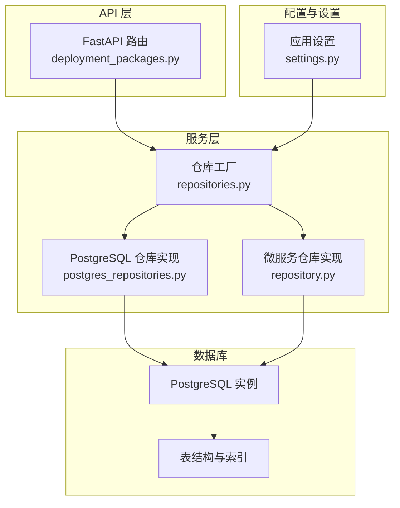
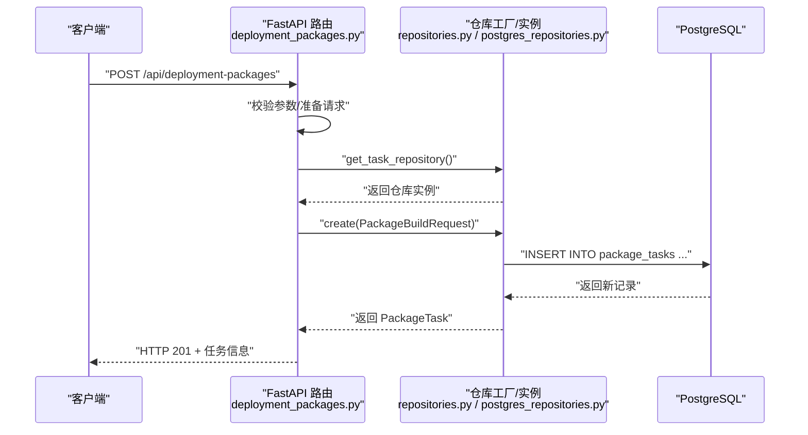
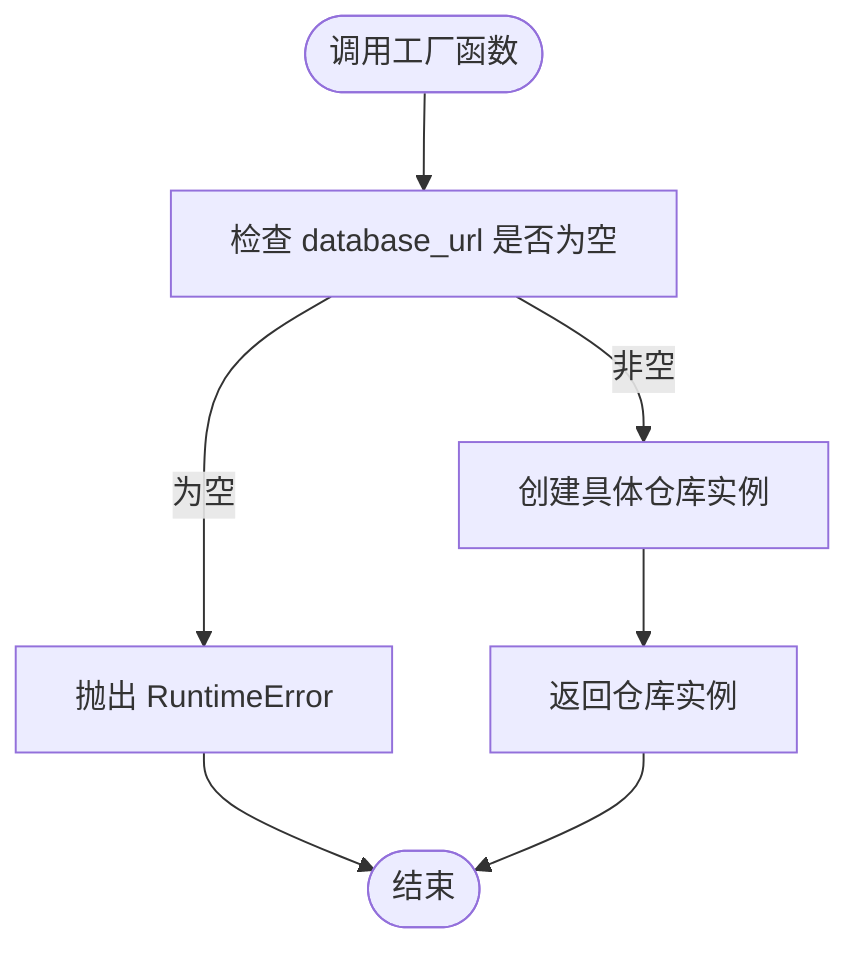
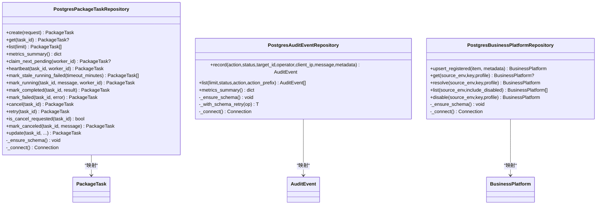
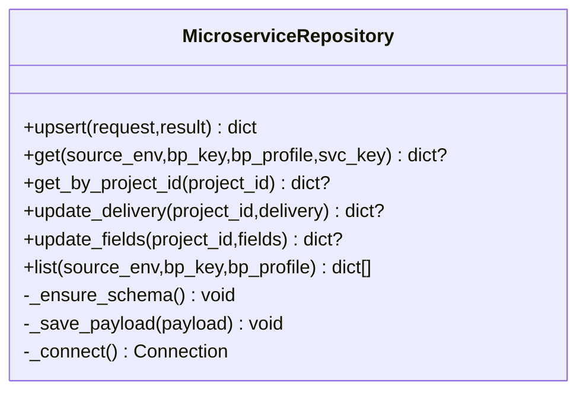
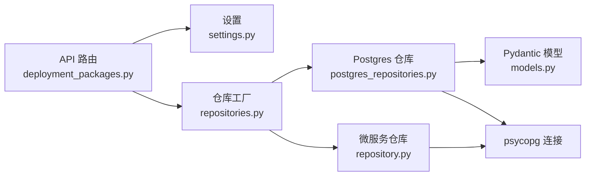

# 数据访问层

<cite>
**本文引用的文件**
- [repositories.py](file://backend/deployment_package_factory/services/deployment_packages/repositories.py)
- [postgres_repositories.py](file://backend/deployment_package_factory/services/deployment_packages/postgres_repositories.py)
- [models.py](file://backend/deployment_package_factory/services/deployment_packages/models.py)
- [settings.py](file://backend/deployment_package_factory/settings.py)
- [main.py](file://backend/deployment_package_factory/main.py)
- [deployment_packages.py](file://backend/deployment_package_factory/api/deployment_packages.py)
- [repository.py](file://backend/deployment_package_factory/services/microservices/repository.py)
- [test_repositories.py](file://backend/tests/test_repositories.py)
- [010_mes_lite_schema.sql](file://templates/overlays/mes-lite/init/dm/010_mes_lite_schema.sql)
</cite>

## 目录
1. [简介](#简介)
2. [项目结构](#项目结构)
3. [核心组件](#核心组件)
4. [架构总览](#架构总览)
5. [组件详解](#组件详解)
6. [依赖关系分析](#依赖关系分析)
7. [性能与优化](#性能与优化)
8. [故障排查指南](#故障排查指南)
9. [结论](#结论)
10. [附录](#附录)

## 简介
本文件面向“部署包工厂”的数据访问层，系统性阐述仓库（Repository）模式的设计理念与实现方式，覆盖 PostgreSQL 访问层的连接管理、事务语义、查询优化、数据模型映射与 ORM 使用、批量操作策略、持久化流程、缓存策略与一致性保障，并补充数据库迁移、索引优化与性能监控等关键技术实践。目标读者既包括后端工程师，也包括对技术细节感兴趣的产品与运维人员。

## 项目结构
数据访问层主要位于后端 Python 包中，围绕“部署包”“审计事件”“业务平台”“微服务”四大领域构建仓库接口与实现，采用工厂函数按需创建具体仓库实例，并通过 FastAPI 路由在运行时注入依赖。

图示来源
- [deployment_packages.py:63-103](file://backend/deployment_package_factory/api/deployment_packages.py#L63-L103)
- [repositories.py:10-25](file://backend/deployment_package_factory/services/deployment_packages/repositories.py#L10-L25)
- [postgres_repositories.py:26-346](file://backend/deployment_package_factory/services/deployment_packages/postgres_repositories.py#L26-L346)
- [repository.py:15-163](file://backend/deployment_package_factory/services/microservices/repository.py#L15-L163)
- [settings.py:26-41](file://backend/deployment_package_factory/settings.py#L26-L41)

章节来源
- [deployment_packages.py:63-103](file://backend/deployment_package_factory/api/deployment_packages.py#L63-L103)
- [repositories.py:10-25](file://backend/deployment_package_factory/services/deployment_packages/repositories.py#L10-L25)
- [postgres_repositories.py:26-346](file://backend/deployment_package_factory/services/deployment_packages/postgres_repositories.py#L26-L346)
- [repository.py:15-163](file://backend/deployment_package_factory/services/microservices/repository.py#L15-L163)
- [settings.py:26-41](file://backend/deployment_package_factory/settings.py#L26-L41)

## 核心组件
- 仓库工厂与依赖注入
  - 通过工厂函数按需创建 PostgreSQL 仓库实例，确保仅在提供数据库连接字符串时才实例化。
  - 在 API 路由中以全局单例方式缓存仓库实例，避免重复创建与连接。
- PostgreSQL 仓库实现
  - 提供任务、审计事件、业务平台、微服务等领域的 CRUD 与聚合查询能力。
  - 内置模式自动检测与重试逻辑，提升部署鲁棒性。
- 数据模型与映射
  - 使用 Pydantic 模型定义领域对象，JSON 字段用于持久化复杂结构。
  - 行到对象的转换函数负责序列化/反序列化与字段映射。
- 连接与事务
  - 基于 psycopg 的连接上下文管理，显式控制事务边界与并发安全。
  - 针对高并发场景使用行级锁与跳过已锁定记录的策略。

章节来源
- [repositories.py:10-25](file://backend/deployment_package_factory/services/deployment_packages/repositories.py#L10-L25)
- [postgres_repositories.py:26-346](file://backend/deployment_package_factory/services/deployment_packages/postgres_repositories.py#L26-L346)
- [models.py:178-251](file://backend/deployment_package_factory/services/deployment_packages/models.py#L178-L251)
- [deployment_packages.py:63-103](file://backend/deployment_package_factory/api/deployment_packages.py#L63-L103)

## 架构总览
下图展示从 API 请求到数据库写入的关键调用链路，以及仓库层与数据库之间的交互。

图示来源
- [deployment_packages.py:245-282](file://backend/deployment_package_factory/api/deployment_packages.py#L245-L282)
- [repositories.py:10-11](file://backend/deployment_package_factory/services/deployment_packages/repositories.py#L10-L11)
- [postgres_repositories.py:31-56](file://backend/deployment_package_factory/services/deployment_packages/postgres_repositories.py#L31-L56)

## 组件详解

### 仓库工厂与依赖注入
- 工厂函数
  - 任务仓库、审计仓库、业务平台仓库均通过工厂创建，内部校验数据库 URL 是否为空，为空则抛出运行时错误。
- 依赖注入
  - API 路由中以全局变量缓存仓库实例，首次调用时根据应用设置中的数据库 URL 创建实例；后续调用直接复用。
- 微服务仓库
  - 同样遵循工厂模式，确保数据库 URL 必填。

图示来源
- [repositories.py:10-25](file://backend/deployment_package_factory/services/deployment_packages/repositories.py#L10-L25)
- [repository.py:160-163](file://backend/deployment_package_factory/services/microservices/repository.py#L160-L163)

章节来源
- [repositories.py:10-25](file://backend/deployment_package_factory/services/deployment_packages/repositories.py#L10-L25)
- [repository.py:160-163](file://backend/deployment_package_factory/services/microservices/repository.py#L160-L163)
- [deployment_packages.py:63-103](file://backend/deployment_package_factory/api/deployment_packages.py#L63-L103)

### PostgreSQL 仓库实现（任务、审计、业务平台）
- 设计要点
  - 每个实体对应一个仓库类，封装 SQL 语句、索引与行/对象映射。
  - 使用上下文管理器统一连接生命周期，避免连接泄漏。
  - 对高并发场景提供行级锁与“跳过已锁定”策略，保证任务领取的幂等与一致性。
- 关键方法
  - 任务仓库：创建、查询、分页、指标汇总、领取任务、心跳、超时失败、运行中状态更新、完成/失败/取消/重试、取消请求检测。
  - 审计仓库：记录事件、条件查询、指标统计、模式缺失时自动重建并重试。
  - 业务平台仓库：UPSERT 注册平台、按多维键查询、解析默认/指定 profile、列表过滤、禁用状态变更。
- 映射与模型
  - 行到对象：通过专用函数将字典行转换为 Pydantic 模型，JSON 字段进行序列化/反序列化。
  - 对象到行：将模型转换为插入/更新所需的元组，确保字段顺序与类型一致。

图示来源
- [postgres_repositories.py:26-346](file://backend/deployment_package_factory/services/deployment_packages/postgres_repositories.py#L26-L346)
- [models.py:220-251](file://backend/deployment_package_factory/services/deployment_packages/models.py#L220-L251)

章节来源
- [postgres_repositories.py:26-346](file://backend/deployment_package_factory/services/deployment_packages/postgres_repositories.py#L26-L346)
- [models.py:220-251](file://backend/deployment_package_factory/services/deployment_packages/models.py#L220-L251)

### 微服务仓库实现
- 设计要点
  - 以 JSON 文本存储完整微服务元数据，支持动态字段扩展。
  - 通过多维键（环境+平台+profile+服务键）唯一约束，UPSERT 更新。
  - 支持按项目 ID 查询、交付状态与字段级更新。
- 关键方法
  - UPSERT、按键获取、按项目 ID 获取、交付状态更新、字段更新、条件列表查询。

图示来源
- [repository.py:15-163](file://backend/deployment_package_factory/services/microservices/repository.py#L15-L163)

章节来源
- [repository.py:15-163](file://backend/deployment_package_factory/services/microservices/repository.py#L15-L163)

### 数据模型与映射机制
- 模型定义
  - 使用 Pydantic BaseModel 定义领域对象，如 PackageTask、AuditEvent、BusinessPlatform、PackageBuildResult 等。
  - 字段命名采用驼峰风格，便于前后端一致。
- 序列化/反序列化
  - JSON 字段用于持久化复杂结构，读取时进行模型验证与反序列化。
  - 行到对象映射函数负责字段对齐与类型转换。
- 批量与聚合
  - 仓库提供聚合查询（如任务状态分布、可用制品统计），减少往返次数。

章节来源
- [models.py:178-251](file://backend/deployment_package_factory/services/deployment_packages/models.py#L178-L251)
- [postgres_repositories.py:591-702](file://backend/deployment_package_factory/services/deployment_packages/postgres_repositories.py#L591-L702)
- [repository.py:166-210](file://backend/deployment_package_factory/services/microservices/repository.py#L166-L210)

### 连接池管理与事务处理
- 连接管理
  - 使用上下文管理器在每次操作中打开/关闭连接，避免连接泄漏。
  - 通过工厂函数集中传入数据库 URL，确保连接参数一致。
- 事务与并发
  - 未显式开启事务块，默认自动提交。
  - 高并发场景通过“for update skip locked”实现行级互斥，避免争抢。
- 错误恢复
  - 审计仓库在遇到“表不存在”异常时自动重建模式并重试，提升部署鲁棒性。

章节来源
- [postgres_repositories.py:343-346](file://backend/deployment_package_factory/services/deployment_packages/postgres_repositories.py#L343-L346)
- [postgres_repositories.py:458-468](file://backend/deployment_package_factory/services/deployment_packages/postgres_repositories.py#L458-L468)
- [repository.py:154-157](file://backend/deployment_package_factory/services/microservices/repository.py#L154-L157)

### 查询优化与索引策略
- 索引设计
  - 任务表：按状态+创建时间、更新时间建立复合索引，支撑分页与状态统计。
  - 审计表：按创建时间、动作建立索引，支撑审计查询与统计。
  - 业务平台表：按状态、命名空间建立索引，支撑快速筛选与解析。
  - 微服务表：按平台维度建立索引，支撑多维过滤。
- 查询模式
  - 列表查询采用 LIMIT 控制结果集大小，避免全表扫描。
  - 条件查询通过 WHERE 子句拼接，参数化防止注入。

章节来源
- [postgres_repositories.py:340-341](file://backend/deployment_package_factory/services/deployment_packages/postgres_repositories.py#L340-L341)
- [postgres_repositories.py:455-456](file://backend/deployment_package_factory/services/deployment_packages/postgres_repositories.py#L455-L456)
- [postgres_repositories.py:582-583](file://backend/deployment_package_factory/services/deployment_packages/postgres_repositories.py#L582-L583)
- [repository.py:132](file://backend/deployment_package_factory/services/microservices/repository.py#L132)

### 数据持久化流程与一致性
- 创建流程
  - API 接收请求 → 校验与预处理 → 仓库创建实体 → 返回结果。
- 更新流程
  - 读取当前状态 → 合并更新字段 → 写回数据库 → 返回最新状态。
- 一致性保障
  - 通过行级锁与原子更新保证并发安全。
  - 任务状态机严格限制可转换状态，避免非法状态推进。
- 审计与可观测性
  - 关键操作均记录审计事件，支持按动作、状态、前缀过滤。

章节来源
- [deployment_packages.py:245-282](file://backend/deployment_package_factory/api/deployment_packages.py#L245-L282)
- [postgres_repositories.py:183-200](file://backend/deployment_package_factory/services/deployment_packages/postgres_repositories.py#L183-L200)
- [postgres_repositories.py:354-390](file://backend/deployment_package_factory/services/deployment_packages/postgres_repositories.py#L354-L390)

### 缓存策略与性能监控
- 缓存策略
  - API 层对仓库实例进行进程内单例缓存，降低重复创建成本。
  - 未引入外部缓存层，所有读写均直达数据库。
- 性能监控
  - 提供指标端点输出任务与审计的统计信息，便于观测系统健康度。

章节来源
- [deployment_packages.py:63-103](file://backend/deployment_package_factory/api/deployment_packages.py#L63-L103)
- [main.py:57-62](file://backend/deployment_package_factory/main.py#L57-L62)
- [postgres_repositories.py:71-96](file://backend/deployment_package_factory/services/deployment_packages/postgres_repositories.py#L71-L96)
- [postgres_repositories.py:423-436](file://backend/deployment_package_factory/services/deployment_packages/postgres_repositories.py#L423-L436)

### 数据库迁移与初始化
- 初始化脚本
  - 提供 MES Lite 专用初始化占位脚本，建议在生产环境中实现模式、角色、种子数据与表空间策略。
- 自动建模
  - 仓库在首次访问时自动创建表与索引，审计仓库在表不存在时自动重建并重试。

章节来源
- [010_mes_lite_schema.sql:1-4](file://templates/overlays/mes-lite/init/dm/010_mes_lite_schema.sql#L1-L4)
- [postgres_repositories.py:319-341](file://backend/deployment_package_factory/services/deployment_packages/postgres_repositories.py#L319-L341)
- [postgres_repositories.py:438-456](file://backend/deployment_package_factory/services/deployment_packages/postgres_repositories.py#L438-L456)
- [repository.py:116-133](file://backend/deployment_package_factory/services/microservices/repository.py#L116-L133)

## 依赖关系分析
- 组件耦合
  - API 路由依赖仓库工厂与设置模块，仓库实现依赖 psycopg 与 Pydantic。
  - 仓库之间低耦合，各自维护独立的表结构与索引。
- 外部依赖
  - psycopg 作为 PostgreSQL 驱动，提供连接与游标支持。
  - Pydantic 用于数据校验与序列化。

图示来源
- [deployment_packages.py:63-103](file://backend/deployment_package_factory/api/deployment_packages.py#L63-L103)
- [settings.py:26-41](file://backend/deployment_package_factory/settings.py#L26-L41)
- [repositories.py:10-25](file://backend/deployment_package_factory/services/deployment_packages/repositories.py#L10-L25)
- [postgres_repositories.py:13-21](file://backend/deployment_package_factory/services/deployment_packages/postgres_repositories.py#L13-L21)
- [repository.py:8](file://backend/deployment_package_factory/services/microservices/repository.py#L8)

章节来源
- [deployment_packages.py:63-103](file://backend/deployment_package_factory/api/deployment_packages.py#L63-L103)
- [settings.py:26-41](file://backend/deployment_package_factory/settings.py#L26-L41)
- [repositories.py:10-25](file://backend/deployment_package_factory/services/deployment_packages/repositories.py#L10-L25)
- [postgres_repositories.py:13-21](file://backend/deployment_package_factory/services/deployment_packages/postgres_repositories.py#L13-L21)
- [repository.py:8](file://backend/deployment_package_factory/services/microservices/repository.py#L8)

## 性能与优化
- 连接与资源
  - 使用上下文管理器确保连接及时释放，避免连接池耗尽。
- 查询与索引
  - 为高频查询字段建立索引，合理使用 LIMIT 与排序字段组合。
- 并发与锁
  - 使用“for update skip locked”避免阻塞，结合心跳与超时策略提升吞吐。
- 批量与聚合
  - 将多次小查询合并为一次聚合查询，减少网络往返。
- 监控与告警
  - 通过指标端点输出关键指标，结合外部监控系统进行告警。

## 故障排查指南
- 数据库 URL 缺失
  - 现象：工厂函数抛出运行时错误。
  - 处理：确保环境变量 DEPLOYMENT_PACKAGE_DATABASE_URL 已正确设置。
- 表不存在或模式未初始化
  - 现象：审计仓库在查询时抛出“UndefinedTable”。
  - 处理：仓库会自动重建表与索引并重试；若持续失败，检查数据库权限与网络连通性。
- 任务领取冲突
  - 现象：多个 Worker 同时尝试领取同一任务。
  - 处理：使用“skip locked”策略，确保只有一个 Worker 成功领取；若长时间无心跳，系统会标记为失败并允许重试。
- 状态机非法转换
  - 现象：尝试对已完成/失败任务进行不被允许的操作。
  - 处理：仓库会拒绝非法转换并返回错误；请先重试或清理任务。

章节来源
- [test_repositories.py:18-27](file://backend/tests/test_repositories.py#L18-L27)
- [test_repositories.py:47-64](file://backend/tests/test_repositories.py#L47-L64)
- [postgres_repositories.py:98-133](file://backend/deployment_package_factory/services/deployment_packages/postgres_repositories.py#L98-L133)
- [postgres_repositories.py:223-242](file://backend/deployment_package_factory/services/deployment_packages/postgres_repositories.py#L223-L242)

## 结论
该数据访问层以仓库模式为核心，结合 PostgreSQL 的原生特性与 psycopg 的连接管理，实现了高并发、可扩展且易维护的数据持久化方案。通过自动建模、索引优化与状态机约束，系统在功能完整性与运行稳定性之间取得良好平衡。建议在生产环境中完善数据库迁移脚本与监控体系，并根据实际负载调整并发参数与索引策略。

## 附录
- 关键配置项
  - DEPLOYMENT_PACKAGE_DATABASE_URL：PostgreSQL 连接字符串。
  - DEPLOYMENT_PACKAGE_MAX_CONCURRENT_BUILDS：最大并发构建数。
  - DEPLOYMENT_PACKAGE_WORKER_HEARTBEAT_SECONDS：Worker 心跳周期。
  - DEPLOYMENT_PACKAGE_RUNNING_TASK_TIMEOUT_MINUTES：运行中超时阈值。
  - DEPLOYMENT_PACKAGE_RETENTION_DAYS：产物保留天数。
  - DEPLOYMENT_PACKAGE_MAX_TOTAL_GB：磁盘配额上限。
- API 与仓库交互参考
  - 任务创建与查询：见 [deployment_packages.py:245-282](file://backend/deployment_package_factory/api/deployment_packages.py#L245-L282) 与 [postgres_repositories.py:31-69](file://backend/deployment_package_factory/services/deployment_packages/postgres_repositories.py#L31-L69)
  - 审计事件记录与查询：见 [deployment_packages.py:285-292](file://backend/deployment_package_factory/api/deployment_packages.py#L285-L292) 与 [postgres_repositories.py:354-421](file://backend/deployment_package_factory/services/deployment_packages/postgres_repositories.py#L354-L421)
  - 业务平台注册与解析：见 [deployment_packages.py:167-197](file://backend/deployment_package_factory/api/deployment_packages.py#L167-L197) 与 [postgres_repositories.py:476-532](file://backend/deployment_package_factory/services/deployment_packages/postgres_repositories.py#L476-L532)
  - 微服务元数据管理：见 [repository.py:20-47](file://backend/deployment_package_factory/services/microservices/repository.py#L20-L47) 与 [repository.py:90-114](file://backend/deployment_package_factory/services/microservices/repository.py#L90-L114)