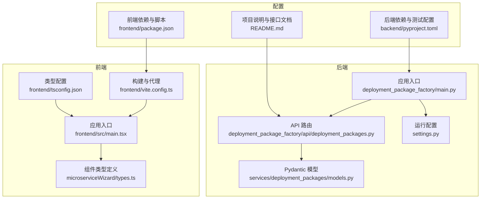
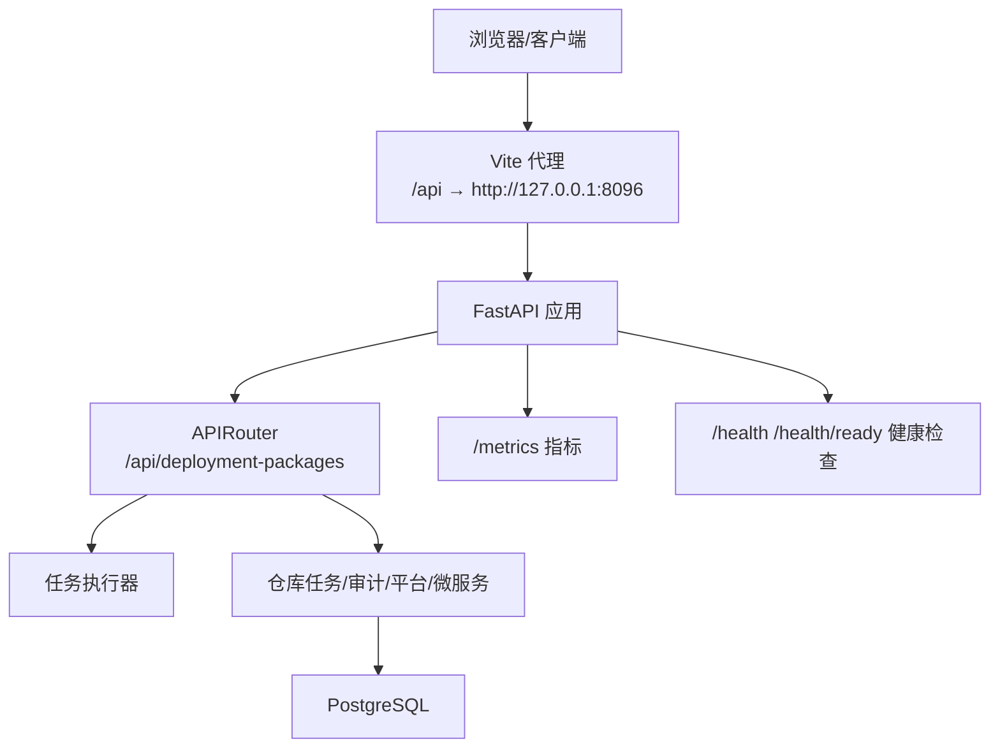
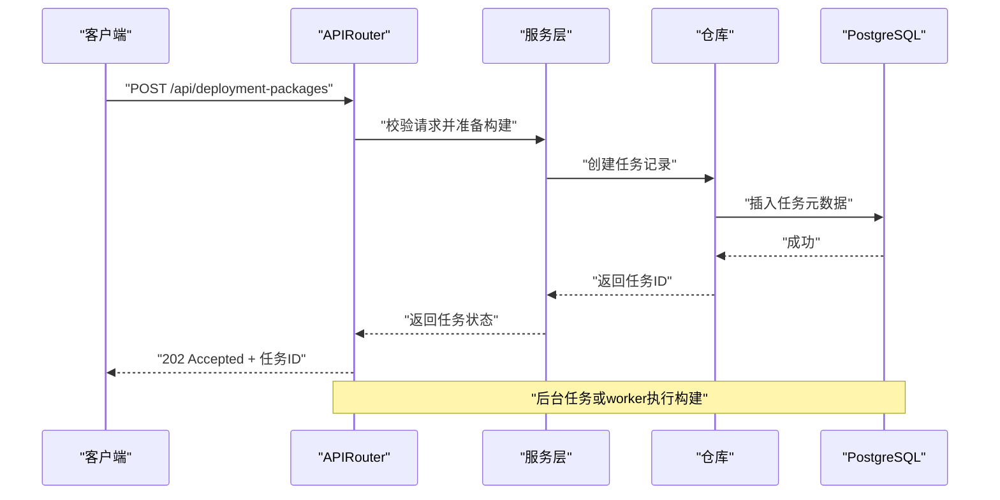
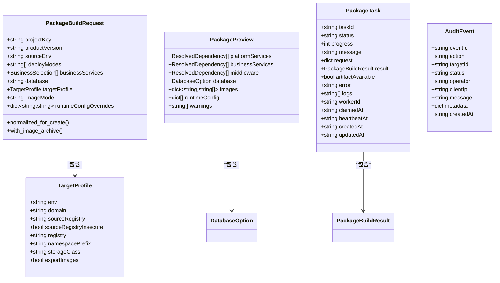
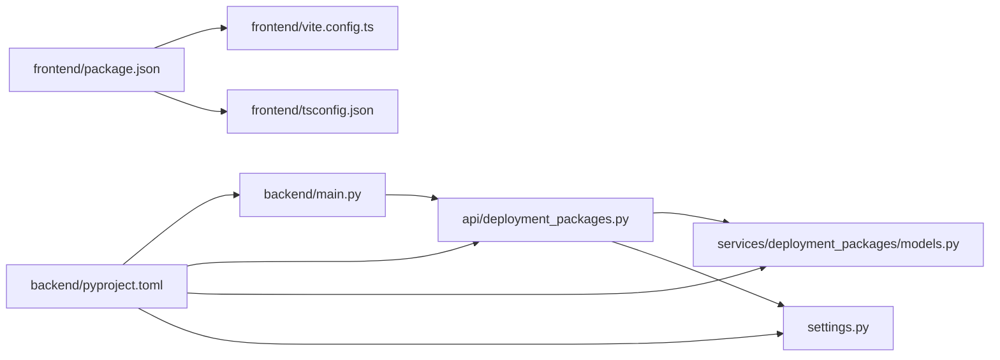

# 代码规范

<cite>
**本文引用的文件**
- [backend/pyproject.toml](file://backend/pyproject.toml)
- [backend/deployment_package_factory/main.py](file://backend/deployment_package_factory/main.py)
- [backend/deployment_package_factory/api/deployment_packages.py](file://backend/deployment_package_factory/api/deployment_packages.py)
- [backend/deployment_package_factory/services/deployment_packages/models.py](file://backend/deployment_package_factory/services/deployment_packages/models.py)
- [backend/deployment_package_factory/settings.py](file://backend/deployment_package_factory/settings.py)
- [frontend/package.json](file://frontend/package.json)
- [frontend/tsconfig.json](file://frontend/tsconfig.json)
- [frontend/vite.config.ts](file://frontend/vite.config.ts)
- [frontend/src/main.tsx](file://frontend/src/main.tsx)
- [frontend/src/views/components/microserviceWizard/types.ts](file://frontend/src/views/components/microserviceWizard/types.ts)
- [README.md](file://README.md)
</cite>

## 目录
1. [简介](#简介)
2. [项目结构](#项目结构)
3. [核心组件](#核心组件)
4. [架构总览](#架构总览)
5. [详细组件分析](#详细组件分析)
6. [依赖关系分析](#依赖关系分析)
7. [性能考虑](#性能考虑)
8. [故障排查指南](#故障排查指南)
9. [结论](#结论)
10. [附录](#附录)

## 简介
本文件为“部署包工厂”项目制定统一的代码规范标准，覆盖后端 Python（FastAPI + Pydantic）、前端 TypeScript（React + Vite）及运维脚本的编码风格、命名约定、注释规范、类型注解、API 设计、模型定义、数据库模型设计原则、格式化与检查工具配置、代码审查清单与最佳实践示例，以及 Git 提交信息规范与分支管理策略。规范以项目现有实现为依据，结合行业最佳实践，确保一致性、可维护性与可扩展性。

## 项目结构
- 后端采用 FastAPI 应用，提供部署包导出、任务编排、审计与度量等接口；通过依赖注入与模块化组织 API 路由与服务层。
- 前端采用 Vite + React，基于 Ant Design 组件库，提供部署包导出、微服务注册、系统设置与环境清理等视图。
- 配置与运行通过环境变量控制，支持本地开发与容器化部署。

图表来源
- [backend/deployment_package_factory/main.py:23-67](file://backend/deployment_package_factory/main.py#L23-L67)
- [backend/deployment_package_factory/api/deployment_packages.py:50-54](file://backend/deployment_package_factory/api/deployment_packages.py#L50-L54)
- [backend/deployment_package_factory/services/deployment_packages/models.py:1-249](file://backend/deployment_package_factory/services/deployment_packages/models.py#L1-L249)
- [backend/deployment_package_factory/settings.py:26-41](file://backend/deployment_package_factory/settings.py#L26-L41)
- [frontend/vite.config.ts:1-42](file://frontend/vite.config.ts#L1-L42)
- [frontend/tsconfig.json:1-23](file://frontend/tsconfig.json#L1-L23)
- [frontend/src/main.tsx:1-81](file://frontend/src/main.tsx#L1-L81)
- [frontend/src/views/components/microserviceWizard/types.ts:1-17](file://frontend/src/views/components/microserviceWizard/types.ts#L1-L17)
- [backend/pyproject.toml:1-30](file://backend/pyproject.toml#L1-L30)
- [frontend/package.json:1-26](file://frontend/package.json#L1-L26)
- [README.md:102-115](file://README.md#L102-L115)

章节来源
- [backend/deployment_package_factory/main.py:23-67](file://backend/deployment_package_factory/main.py#L23-L67)
- [backend/deployment_package_factory/api/deployment_packages.py:50-54](file://backend/deployment_package_factory/api/deployment_packages.py#L50-L54)
- [frontend/vite.config.ts:35-40](file://frontend/vite.config.ts#L35-L40)
- [README.md:102-115](file://README.md#L102-L115)

## 核心组件
- 应用入口与中间件：后端通过应用工厂函数创建 FastAPI 实例，注册 CORS、健康检查、就绪检查与指标端点。
- API 路由：集中于部署包相关路由，包含选项查询、预览、创建、任务管理、清理、下载与校验等。
- Pydantic 模型：统一定义请求/响应、预览、构建结果、任务与审计事件等数据结构。
- 运行配置：通过环境变量加载配置，支持并发构建、执行模式、清理策略等。
- 前端入口与视图：主应用入口组织多 Tab 视图，Vite 配置代理后端 API，TS 配置严格类型检查。

章节来源
- [backend/deployment_package_factory/main.py:23-67](file://backend/deployment_package_factory/main.py#L23-L67)
- [backend/deployment_package_factory/api/deployment_packages.py:110-123](file://backend/deployment_package_factory/api/deployment_packages.py#L110-L123)
- [backend/deployment_package_factory/services/deployment_packages/models.py:102-132](file://backend/deployment_package_factory/services/deployment_packages/models.py#L102-L132)
- [backend/deployment_package_factory/settings.py:26-41](file://backend/deployment_package_factory/settings.py#L26-L41)
- [frontend/src/main.tsx:13-70](file://frontend/src/main.tsx#L13-L70)
- [frontend/vite.config.ts:35-40](file://frontend/vite.config.ts#L35-L40)

## 架构总览
后端采用分层架构：应用入口负责中间件与路由装配；API 层处理请求与响应、依赖注入仓库与执行器；服务层封装业务逻辑；模型层统一数据契约；配置层集中环境变量解析。前端采用组件化与 Hook 管理状态，Vite 提供开发与构建支持。

图表来源
- [backend/deployment_package_factory/main.py:23-67](file://backend/deployment_package_factory/main.py#L23-L67)
- [backend/deployment_package_factory/api/deployment_packages.py:50-54](file://backend/deployment_package_factory/api/deployment_packages.py#L50-L54)
- [README.md:102-115](file://README.md#L102-L115)

## 详细组件分析

### Python 后端代码规范
- 风格与命名
  - 使用类型注解与 __future__ annotations，保持前向兼容与清晰的类型声明。
  - 函数与变量采用 snake_case；常量采用 UPPER_CASE；类名采用 PascalCase。
  - 路由器与仓库采用模块级变量命名，避免全局污染。
- 注释规范
  - 关键函数与复杂逻辑添加简要注释，说明输入、输出与边界条件。
  - 异常处理分支需注释说明可能的错误场景与返回码语义。
- 类型注解
  - 使用 typing.Annotated、typing.Literal、pydantic.BaseModel 明确字段别名与取值范围。
  - 返回类型与参数类型保持一致，避免 Any。
- 错误处理
  - 对外异常统一包装为 HTTPException，包含明确的状态码与错误消息。
  - 审计记录异常被吞掉但记录警告，保证业务不中断。
- 性能与并发
  - 通过配置项限制并发构建数，避免资源争用。
  - 支持后台任务与独立 worker 两种执行模式，按环境选择。

章节来源
- [backend/deployment_package_factory/main.py:1-68](file://backend/deployment_package_factory/main.py#L1-L68)
- [backend/deployment_package_factory/api/deployment_packages.py:1-658](file://backend/deployment_package_factory/api/deployment_packages.py#L1-L658)
- [backend/deployment_package_factory/services/deployment_packages/models.py:1-249](file://backend/deployment_package_factory/services/deployment_packages/models.py#L1-L249)
- [backend/deployment_package_factory/settings.py:26-57](file://backend/deployment_package_factory/settings.py#L26-L57)

### FastAPI 路由设计规范
- 路由组织
  - 使用 APIRouter 按模块划分，前缀统一为 /api/deployment-packages，标签用于 OpenAPI 分组。
  - 依赖注入使用 Depends(require_api_token) 统一鉴权。
- 请求与响应
  - 使用 Pydantic 模型进行请求体与响应体校验，必要时使用 response_model 指定序列化模型。
  - 文件下载与分片流式传输遵循 HTTP Range 规范，正确设置 Content-Range、ETag、Last-Modified。
- 审计与可观测性
  - 每个关键动作记录审计事件，包含操作者、客户端 IP、元数据等。
  - 提供 /metrics 输出 Prometheus 文本格式指标，/health 与 /health/ready 用于健康检查。

图表来源
- [backend/deployment_package_factory/api/deployment_packages.py:245-282](file://backend/deployment_package_factory/api/deployment_packages.py#L245-L282)
- [backend/deployment_package_factory/api/deployment_packages.py:308-330](file://backend/deployment_package_factory/api/deployment_packages.py#L308-L330)
- [backend/deployment_package_factory/api/deployment_packages.py:333-381](file://backend/deployment_package_factory/api/deployment_packages.py#L333-L381)

章节来源
- [backend/deployment_package_factory/api/deployment_packages.py:50-54](file://backend/deployment_package_factory/api/deployment_packages.py#L50-L54)
- [backend/deployment_package_factory/api/deployment_packages.py:245-282](file://backend/deployment_package_factory/api/deployment_packages.py#L245-L282)
- [backend/deployment_package_factory/api/deployment_packages.py:285-330](file://backend/deployment_package_factory/api/deployment_packages.py#L285-L330)
- [backend/deployment_package_factory/api/deployment_packages.py:333-381](file://backend/deployment_package_factory/api/deployment_packages.py#L333-L381)
- [README.md:102-115](file://README.md#L102-L115)

### Pydantic 模型定义规范
- 字段别名与驼峰转蛇形
  - 使用 Field(alias="...") 与 model_config = ConfigDict(populate_by_name=True) 处理别名映射。
- 枚举与取值约束
  - 使用 Literal 约束枚举值，如 imageMode、TaskStatus。
- 嵌套模型与默认值
  - 使用嵌套 BaseModel 与默认工厂函数，避免可变默认值陷阱。
- 序列化与公开字段
  - 公开运行时配置时使用 public_runtime_config，避免泄露内部细节。

图表来源
- [backend/deployment_package_factory/services/deployment_packages/models.py:102-132](file://backend/deployment_package_factory/services/deployment_packages/models.py#L102-L132)
- [backend/deployment_package_factory/services/deployment_packages/models.py:70-100](file://backend/deployment_package_factory/services/deployment_packages/models.py#L70-L100)
- [backend/deployment_package_factory/services/deployment_packages/models.py:191-202](file://backend/deployment_package_factory/services/deployment_packages/models.py#L191-L202)
- [backend/deployment_package_factory/services/deployment_packages/models.py:218-235](file://backend/deployment_package_factory/services/deployment_packages/models.py#L218-L235)
- [backend/deployment_package_factory/services/deployment_packages/models.py:237-249](file://backend/deployment_package_factory/services/deployment_packages/models.py#L237-L249)

章节来源
- [backend/deployment_package_factory/services/deployment_packages/models.py:1-249](file://backend/deployment_package_factory/services/deployment_packages/models.py#L1-L249)

### 数据库模型设计原则
- 元数据与任务分离：任务表保存请求、状态、日志与结果；审计表记录操作行为与元数据。
- 配置与运行时隔离：运行时配置通过公开方法生成，避免直接持久化敏感字段。
- 清理策略：基于保留天数与总容量上限的清理策略，支持 Dry-Run 与实际执行。

章节来源
- [backend/deployment_package_factory/api/deployment_packages.py:308-330](file://backend/deployment_package_factory/api/deployment_packages.py#L308-L330)
- [backend/deployment_package_factory/settings.py:26-41](file://backend/deployment_package_factory/settings.py#L26-L41)

### TypeScript 前端代码规范
- 项目结构与命名
  - 组件采用 PascalCase，文件以 .tsx 结尾；视图组件按功能分层组织。
  - 使用路径别名 @/* 指向 src，提升可移植性。
- 接口与类型
  - 使用 TypeScript 接口描述 props 与表单实例，避免 any。
  - 组件类型定义集中在 views/components/*/types.ts，便于复用与测试。
- 状态管理与副作用
  - 使用 React Hooks 管理局部状态与副作用；跨视图状态通过顶层 Provider 传递。
- 样式与主题
  - 全局样式集中于 styles/global.css；组件样式通过模块化 CSS 组织。
- 构建与代理
  - Vite 代理 /api 与 /health 到后端；手动分包优化第三方库。

章节来源
- [frontend/src/main.tsx:1-81](file://frontend/src/main.tsx#L1-L81)
- [frontend/tsconfig.json:1-23](file://frontend/tsconfig.json#L1-L23)
- [frontend/vite.config.ts:1-42](file://frontend/vite.config.ts#L1-L42)
- [frontend/src/views/components/microserviceWizard/types.ts:1-17](file://frontend/src/views/components/microserviceWizard/types.ts#L1-L17)

### Ruff 与 ESLint 配置建议
- Ruff（Python）
  - 使用 ruff 作为主要格式化与静态检查工具，与 pyproject.toml 集成。
  - 建议启用规则集：兼容 PEP8 风格、类型注解检查、导入排序与冗余空白清理。
  - 在 CI 中强制执行，失败即阻断合并。
- ESLint（TypeScript/React）
  - 使用 @typescript-eslint/eslint-plugin 与 @typescript-eslint/parser。
  - 规则建议：严格类型检查、no-explicit-any、import/order、react/jsx-props-no-spreading 等。
  - 与 Prettier 配合，统一格式化风格。
- 与项目现有配置的衔接
  - 后端 pyproject.toml 已声明 pytest 与 dev 依赖，建议在此基础上增加 ruff 配置。
  - 前端 package.json 已声明 React/Vite/TypeScript，建议新增 eslint 脚本与配置文件。

章节来源
- [backend/pyproject.toml:14-29](file://backend/pyproject.toml#L14-L29)
- [frontend/package.json:1-26](file://frontend/package.json#L1-L26)

### 代码审查检查清单（示例）
- Python
  - 是否使用类型注解与 Pydantic 校验？异常处理是否明确且不吞日志？
  - 路由是否统一鉴权？审计是否覆盖关键操作？并发与资源限制是否合理？
- TypeScript
  - 是否使用严格模式与明确的接口类型？是否存在 any 或隐式类型？
  - 组件是否职责单一？Hook 使用是否合理？样式是否模块化？
- 通用
  - 提交信息是否清晰描述变更与动机？是否包含必要的测试与文档更新？

章节来源
- [backend/deployment_package_factory/api/deployment_packages.py:599-621](file://backend/deployment_package_factory/api/deployment_packages.py#L599-L621)
- [frontend/tsconfig.json:10-11](file://frontend/tsconfig.json#L10-L11)

### 最佳实践示例（路径指引）
- 后端
  - 应用工厂与中间件注册：[应用入口:23-67](file://backend/deployment_package_factory/main.py#L23-L67)
  - 路由与依赖注入：[部署包路由:50-54](file://backend/deployment_package_factory/api/deployment_packages.py#L50-L54)
  - 模型定义与别名映射：[模型定义:102-132](file://backend/deployment_package_factory/services/deployment_packages/models.py#L102-L132)
  - 运行配置加载：[配置加载:26-41](file://backend/deployment_package_factory/settings.py#L26-L41)
- 前端
  - 主应用入口与视图组织：[入口:13-70](file://frontend/src/main.tsx#L13-L70)
  - 类型定义与表单实例：[类型定义:7-16](file://frontend/src/views/components/microserviceWizard/types.ts#L7-L16)
  - 构建与代理配置：[Vite 配置:35-40](file://frontend/vite.config.ts#L35-L40)

章节来源
- [backend/deployment_package_factory/main.py:23-67](file://backend/deployment_package_factory/main.py#L23-L67)
- [backend/deployment_package_factory/api/deployment_packages.py:50-54](file://backend/deployment_package_factory/api/deployment_packages.py#L50-L54)
- [backend/deployment_package_factory/services/deployment_packages/models.py:102-132](file://backend/deployment_package_factory/services/deployment_packages/models.py#L102-L132)
- [backend/deployment_package_factory/settings.py:26-41](file://backend/deployment_package_factory/settings.py#L26-L41)
- [frontend/src/main.tsx:13-70](file://frontend/src/main.tsx#L13-L70)
- [frontend/src/views/components/microserviceWizard/types.ts:7-16](file://frontend/src/views/components/microserviceWizard/types.ts#L7-L16)
- [frontend/vite.config.ts:35-40](file://frontend/vite.config.ts#L35-L40)

### Git 提交信息规范与分支管理策略
- 提交信息规范
  - 标题格式：类型(作用域): 简洁描述（不超过 50 字）
  - 类型：feat、fix、docs、style、refactor、perf、test、chore、revert
  - 正文：说明动机与影响，引用 Issue 编号
- 分支管理策略
  - main/master：保护分支，仅允许通过 Pull Request 合并
  - develop：集成分支，每日构建与测试
  - feature/*：新功能开发分支，完成后合并至 develop
  - hotfix/*：紧急修复分支，直接合并至 main 与 develop
  - Pull Request：强制代码审查，CI 通过后方可合并

章节来源
- [README.md:102-115](file://README.md#L102-L115)

## 依赖关系分析
- 后端依赖
  - FastAPI、Pydantic、Uvicorn、PyYAML、psycopg 等，版本在 pyproject.toml 中声明。
- 前端依赖
  - React、React DOM、Vite、Ant Design、RemixIcon、TypeScript 等，版本在 package.json 中声明。
- 运行时配置
  - 通过环境变量控制数据库连接、输出目录、并发与清理策略等。

图表来源
- [backend/pyproject.toml:1-30](file://backend/pyproject.toml#L1-L30)
- [frontend/package.json:1-26](file://frontend/package.json#L1-L26)
- [backend/deployment_package_factory/main.py:23-67](file://backend/deployment_package_factory/main.py#L23-L67)
- [backend/deployment_package_factory/api/deployment_packages.py:50-54](file://backend/deployment_package_factory/api/deployment_packages.py#L50-L54)
- [backend/deployment_package_factory/services/deployment_packages/models.py:1-249](file://backend/deployment_package_factory/services/deployment_packages/models.py#L1-L249)
- [backend/deployment_package_factory/settings.py:26-41](file://backend/deployment_package_factory/settings.py#L26-L41)
- [frontend/vite.config.ts:1-42](file://frontend/vite.config.ts#L1-L42)
- [frontend/tsconfig.json:1-23](file://frontend/tsconfig.json#L1-L23)

章节来源
- [backend/pyproject.toml:1-30](file://backend/pyproject.toml#L1-L30)
- [frontend/package.json:1-26](file://frontend/package.json#L1-L26)

## 性能考虑
- 并发控制：通过最大并发构建数限制资源占用，避免 OOM 与磁盘 IO 抖动。
- 流式下载：HTTP Range 支持与分块迭代，降低内存峰值与带宽占用。
- 清理策略：基于时间与容量的清理，防止存储膨胀。
- 构建分包：Vite 手动分包策略减少首屏体积，提升加载速度。

章节来源
- [backend/deployment_package_factory/settings.py:34-40](file://backend/deployment_package_factory/settings.py#L34-L40)
- [backend/deployment_package_factory/api/deployment_packages.py:392-424](file://backend/deployment_package_factory/api/deployment_packages.py#L392-L424)
- [frontend/vite.config.ts:8-29](file://frontend/vite.config.ts#L8-L29)

## 故障排查指南
- 健康检查
  - /health：存活检查；/health/ready：就绪检查，包含数据库、产物目录写入与镜像导出工具状态。
- 指标监控
  - /metrics：Prometheus 文本格式指标，便于告警与容量规划。
- 常见问题定位
  - 任务状态异常：检查任务表与日志字段，确认 worker 心跳与超时配置。
  - 下载失败：核对产物路径存在性、Range 解析与 ETag 一致性。
  - 审计缺失：确认审计仓库可用性与异常吞没日志。

章节来源
- [backend/deployment_package_factory/main.py:41-62](file://backend/deployment_package_factory/main.py#L41-L62)
- [README.md:102-115](file://README.md#L102-L115)
- [backend/deployment_package_factory/api/deployment_packages.py:599-621](file://backend/deployment_package_factory/api/deployment_packages.py#L599-L621)

## 结论
本规范以项目现有实现为基础，明确了 Python 后端与 TypeScript 前端的编码风格、API 设计、模型定义与配置管理要点，并给出了工具配置与审查清单建议。建议在团队内推广并纳入 CI 流水线，持续提升代码质量与交付效率。

## 附录
- 快速参考
  - 后端：应用工厂、路由前缀、鉴权依赖、指标与健康端点
  - 前端：Strict Mode、路径别名、代理配置、类型定义位置
  - 运维：环境变量键名、默认值与取值范围

章节来源
- [backend/deployment_package_factory/main.py:23-67](file://backend/deployment_package_factory/main.py#L23-L67)
- [frontend/tsconfig.json:18-20](file://frontend/tsconfig.json#L18-L20)
- [frontend/vite.config.ts:35-40](file://frontend/vite.config.ts#L35-L40)
- [backend/deployment_package_factory/settings.py:26-57](file://backend/deployment_package_factory/settings.py#L26-L57)