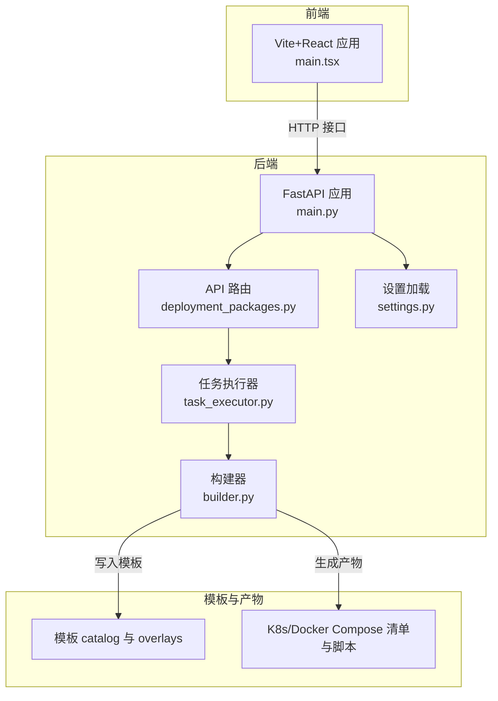
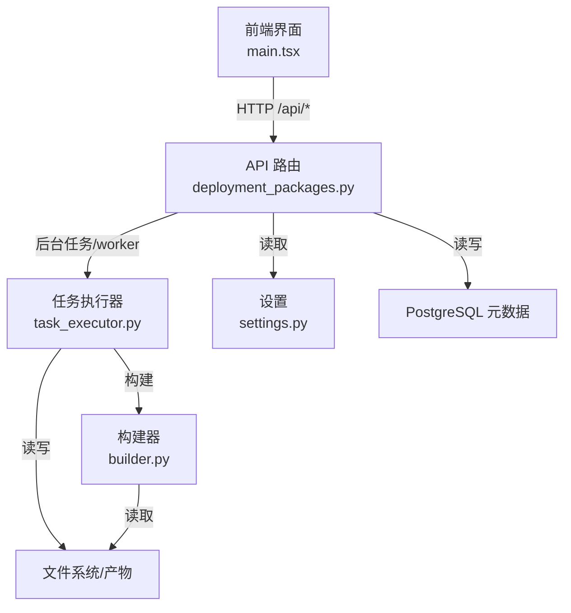
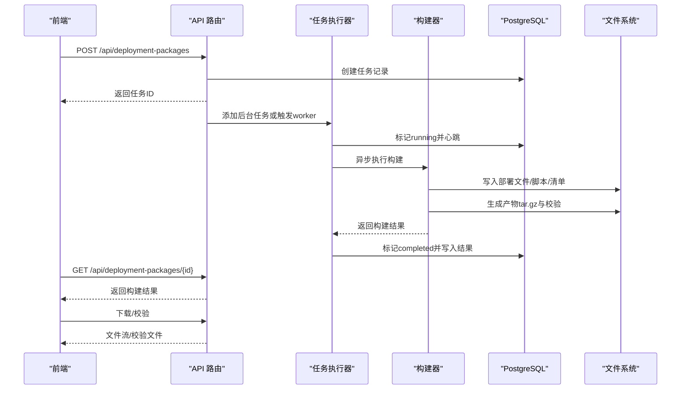
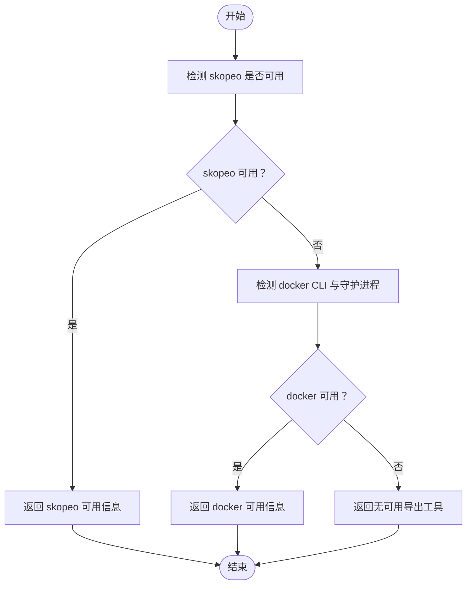
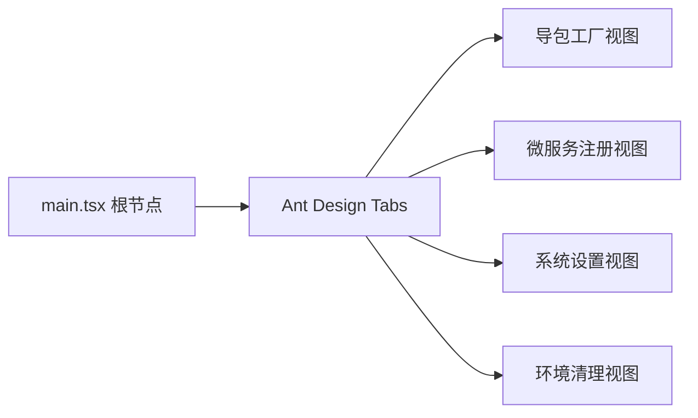
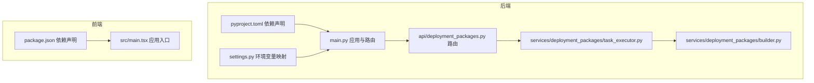

# 开发指南

<cite>
**本文引用的文件**
- [README.md](file://README.md)
- [backend/pyproject.toml](file://backend/pyproject.toml)
- [backend/deployment_package_factory/main.py](file://backend/deployment_package_factory/main.py)
- [backend/deployment_package_factory/settings.py](file://backend/deployment_package_factory/settings.py)
- [backend/deployment_package_factory/services/deployment_packages/builder.py](file://backend/deployment_package_factory/services/deployment_packages/builder.py)
- [backend/deployment_package_factory/api/deployment_packages.py](file://backend/deployment_package_factory/api/deployment_packages.py)
- [backend/deployment_package_factory/services/deployment_packages/task_executor.py](file://backend/deployment_package_factory/services/deployment_packages/task_executor.py)
- [backend/tests/test_main.py](file://backend/tests/test_main.py)
- [frontend/package.json](file://frontend/package.json)
- [frontend/src/main.tsx](file://frontend/src/main.tsx)
- [scripts/validate_microservice_scaffolds.py](file://scripts/validate_microservice_scaffolds.py)
- [Jenkinsfile](file://Jenkinsfile)
- [docs/jenkins-ci-cd.md](file://docs/jenkins-ci-cd.md)
- [AGENTS.md](file://AGENTS.md)
</cite>

## 目录
1. [简介](#简介)
2. [项目结构](#项目结构)
3. [核心组件](#核心组件)
4. [架构总览](#架构总览)
5. [详细组件分析](#详细组件分析)
6. [依赖关系分析](#依赖关系分析)
7. [性能考量](#性能考量)
8. [故障排查指南](#故障排查指南)
9. [结论](#结论)
10. [附录](#附录)

## 简介
本指南面向部署包工厂项目的开发者，提供从环境搭建、代码与提交规范、开发流程（新功能、Bug 修复、重构、发布）、调试技巧、扩展开发（功能/插件/配置/第三方集成），到代码评审、测试与文档更新要求、开发工具与 IDE 配置、以及新成员成长路径的完整实践指引。项目采用前后端分离架构：后端为独立 FastAPI 服务，前端为 Vite+React 页面，模板与产物通过脚本与清单管理。

## 项目结构
- 后端 backend：独立 FastAPI 应用，提供导包任务、预览、下载、清理、审计等接口，支持后台任务与独立 worker 执行模式。
- 前端 frontend：Vite+React 页面，提供导包向导、微服务注册、系统设置、环境清理等功能。
- 模板与产物 templates/ 与 deploy/：基础平台/业务/中间件目录、项目 overlay、K8s/Docker Compose 渲染清单与脚本。
- 脚本 scripts/：镜像打包、部署配置渲染、密钥生成、微服务脚手架验证等。
- 文档 docs/：CI/CD 与实现计划等文档。

图表来源
- [backend/deployment_package_factory/main.py:23-68](file://backend/deployment_package_factory/main.py#L23-L68)
- [backend/deployment_package_factory/api/deployment_packages.py:50-124](file://backend/deployment_package_factory/api/deployment_packages.py#L50-L124)
- [backend/deployment_package_factory/services/deployment_packages/task_executor.py:20-77](file://backend/deployment_package_factory/services/deployment_packages/task_executor.py#L20-L77)
- [backend/deployment_package_factory/services/deployment_packages/builder.py:146-247](file://backend/deployment_package_factory/services/deployment_packages/builder.py#L146-L247)
- [frontend/src/main.tsx:13-81](file://frontend/src/main.tsx#L13-L81)

章节来源
- [README.md:5-39](file://README.md#L5-L39)
- [backend/pyproject.toml:1-30](file://backend/pyproject.toml#L1-L30)
- [frontend/package.json:1-26](file://frontend/package.json#L1-L26)

## 核心组件
- 应用入口与可观测性
  - 应用创建、CORS、路由注册、健康检查、就绪检查、指标导出。
- 设置模块
  - 从环境变量加载运行参数，含并发、执行模式、心跳、超时、保留策略等。
- API 层
  - 提供导包选项、预览、创建、取消/重试、清理、下载、校验等接口；统一审计记录。
- 任务执行器
  - 控制并发、心跳、运行态标记、异常处理与取消。
- 构建器
  - 解析目录、依赖、运行时环境、渲染部署文件、生成镜像清单与归档、产物打包与校验。

章节来源
- [backend/deployment_package_factory/main.py:23-68](file://backend/deployment_package_factory/main.py#L23-L68)
- [backend/deployment_package_factory/settings.py:26-57](file://backend/deployment_package_factory/settings.py#L26-L57)
- [backend/deployment_package_factory/api/deployment_packages.py:110-124](file://backend/deployment_package_factory/api/deployment_packages.py#L110-L124)
- [backend/deployment_package_factory/services/deployment_packages/task_executor.py:20-77](file://backend/deployment_package_factory/services/deployment_packages/task_executor.py#L20-L77)
- [backend/deployment_package_factory/services/deployment_packages/builder.py:146-247](file://backend/deployment_package_factory/services/deployment_packages/builder.py#L146-L247)

## 架构总览
后端采用分层设计：接口层负责鉴权与路由，应用层协调任务执行器，领域层由构建器与目录/依赖解析组成，基础设施层负责与 Kubernetes、PostgreSQL、文件系统交互。前端通过 /api 与后端通信，支持后台任务与独立 worker 两种执行模式。

图表来源
- [backend/deployment_package_factory/api/deployment_packages.py:245-283](file://backend/deployment_package_factory/api/deployment_packages.py#L245-L283)
- [backend/deployment_package_factory/services/deployment_packages/task_executor.py:26-47](file://backend/deployment_package_factory/services/deployment_packages/task_executor.py#L26-L47)
- [backend/deployment_package_factory/services/deployment_packages/builder.py:146-247](file://backend/deployment_package_factory/services/deployment_packages/builder.py#L146-L247)
- [backend/deployment_package_factory/settings.py:26-57](file://backend/deployment_package_factory/settings.py#L26-L57)

## 详细组件分析

### 组件 A：导包任务生命周期（序列）
从创建任务到完成/取消/重试，贯穿 API、任务执行器与构建器。

图表来源
- [backend/deployment_package_factory/api/deployment_packages.py:245-283](file://backend/deployment_package_factory/api/deployment_packages.py#L245-L283)
- [backend/deployment_package_factory/services/deployment_packages/task_executor.py:26-64](file://backend/deployment_package_factory/services/deployment_packages/task_executor.py#L26-L64)
- [backend/deployment_package_factory/services/deployment_packages/builder.py:146-247](file://backend/deployment_package_factory/services/deployment_packages/builder.py#L146-L247)

章节来源
- [backend/deployment_package_factory/api/deployment_packages.py:245-382](file://backend/deployment_package_factory/api/deployment_packages.py#L245-L382)
- [backend/deployment_package_factory/services/deployment_packages/task_executor.py:20-77](file://backend/deployment_package_factory/services/deployment_packages/task_executor.py#L20-L77)
- [backend/deployment_package_factory/services/deployment_packages/builder.py:146-247](file://backend/deployment_package_factory/services/deployment_packages/builder.py#L146-L247)

### 组件 B：运行时环境探测与镜像导出（流程图）
构建器在生成镜像归档前，需要探测可用的镜像导出工具。

图表来源
- [backend/deployment_package_factory/services/deployment_packages/builder.py:105-143](file://backend/deployment_package_factory/services/deployment_packages/builder.py#L105-L143)

章节来源
- [backend/deployment_package_factory/services/deployment_packages/builder.py:105-143](file://backend/deployment_package_factory/services/deployment_packages/builder.py#L105-L143)

### 组件 C：前端应用入口与页面组织
前端以标签页组织四大视图：导包工厂、微服务注册、系统设置、环境清理。

图表来源
- [frontend/src/main.tsx:13-81](file://frontend/src/main.tsx#L13-L81)

章节来源
- [frontend/src/main.tsx:13-81](file://frontend/src/main.tsx#L13-L81)

## 依赖关系分析
- 后端依赖
  - FastAPI、Pydantic、PyYAML、Uvicorn、Psycopg 等；测试与 HTTP 客户端依赖。
- 前端依赖
  - React、Vite、Ant Design、RemixIcon、TypeScript 等。
- 运行时环境
  - PostgreSQL 作为元数据存储；Kubernetes Secret/ConfigMap 读取用于运行时环境解析；镜像导出工具（skopeo 或 docker）决定离线归档能力。

图表来源
- [backend/pyproject.toml:6-12](file://backend/pyproject.toml#L6-L12)
- [backend/deployment_package_factory/settings.py:26-57](file://backend/deployment_package_factory/settings.py#L26-L57)
- [backend/deployment_package_factory/main.py:23-68](file://backend/deployment_package_factory/main.py#L23-L68)
- [backend/deployment_package_factory/api/deployment_packages.py:50-124](file://backend/deployment_package_factory/api/deployment_packages.py#L50-L124)
- [backend/deployment_package_factory/services/deployment_packages/task_executor.py:20-77](file://backend/deployment_package_factory/services/deployment_packages/task_executor.py#L20-L77)
- [backend/deployment_package_factory/services/deployment_packages/builder.py:146-247](file://backend/deployment_package_factory/services/deployment_packages/builder.py#L146-L247)
- [frontend/package.json:12-24](file://frontend/package.json#L12-L24)
- [frontend/src/main.tsx:13-81](file://frontend/src/main.tsx#L13-L81)

章节来源
- [backend/pyproject.toml:1-30](file://backend/pyproject.toml#L1-L30)
- [frontend/package.json:1-26](file://frontend/package.json#L1-L26)

## 性能考量
- 并发与队列
  - 通过设置项控制最大并发构建数，避免资源争抢；后台任务模式下由执行器信号量串行化。
- 产物清理
  - 基于保留天数与总容量上限的清理策略，避免磁盘膨胀。
- 指标与可观测性
  - 暴露 Prometheus 文本格式指标，便于监控导包任务、产物数量与审计事件分布。
- 镜像导出
  - 优先使用 skopeo 无守护导出，降低对宿主环境依赖；失败时回退 docker，但需确保可达镜像仓库。

章节来源
- [backend/deployment_package_factory/settings.py:34-41](file://backend/deployment_package_factory/settings.py#L34-L41)
- [backend/deployment_package_factory/services/deployment_packages/task_executor.py:24-24](file://backend/deployment_package_factory/services/deployment_packages/task_executor.py#L24-L24)
- [backend/deployment_package_factory/api/deployment_packages.py:308-330](file://backend/deployment_package_factory/api/deployment_packages.py#L308-L330)
- [backend/deployment_package_factory/main.py:57-62](file://backend/deployment_package_factory/main.py#L57-L62)
- [backend/deployment_package_factory/services/deployment_packages/builder.py:105-143](file://backend/deployment_package_factory/services/deployment_packages/builder.py#L105-L143)

## 故障排查指南
- 健康与就绪检查
  - 使用 /health 与 /health/ready 检查应用状态；就绪检查会验证数据库连接、元数据仓库、产物输出目录写入能力与镜像导出工具状态。
- 指标核对
  - 通过 /metrics 核对任务总数、按状态分组的任务数、产物数量与字节、审计事件总数与分类。
- 日志与审计
  - API 层统一记录审计事件，便于追踪创建、取消、重试、下载等操作。
- 微服务脚手架验证
  - 使用脚本对生成的骨架进行端到端校验，支持保留输出、指定技术栈、本地构建检查等。
- CI/CD 烟测
  - Jenkins 管道在 Pod 内访问 /health/ready、/metrics、/api/deployment-packages/options，确保服务可用。

章节来源
- [backend/deployment_package_factory/main.py:41-62](file://backend/deployment_package_factory/main.py#L41-L62)
- [backend/deployment_package_factory/api/deployment_packages.py:285-293](file://backend/deployment_package_factory/api/deployment_packages.py#L285-L293)
- [backend/tests/test_main.py:13-89](file://backend/tests/test_main.py#L13-L89)
- [scripts/validate_microservice_scaffolds.py:60-99](file://scripts/validate_microservice_scaffolds.py#L60-L99)
- [Jenkinsfile:240-243](file://Jenkinsfile#L240-L243)

## 结论
本指南提供了从环境搭建到开发流程、调试与扩展的全链路实践建议。建议团队在日常开发中严格遵循代码与提交规范、测试与文档更新要求，并结合 CI/CD 与可观测性保障交付质量与稳定性。

## 附录

### A. 开发环境搭建
- 后端
  - 进入 backend 目录，使用 uvicorn 启动 FastAPI 应用；或使用 docker compose 一键启动。
- 前端
  - 进入 frontend 目录，安装依赖后启动开发服务器，默认代理 /api 到后端。
- 运行配置
  - 通过环境变量调整任务并发、执行模式、心跳、超时、保留策略、产物输出目录等。

章节来源
- [README.md:12-39](file://README.md#L12-L39)
- [README.md:66-87](file://README.md#L66-L87)
- [backend/deployment_package_factory/settings.py:26-57](file://backend/deployment_package_factory/settings.py#L26-L57)

### B. 代码与提交规范
- 代码风格与静态检查
  - 使用 ruff 缓存目录与 hooks.json（位于 .codex/hooks.json）参与代码检查流程。
- 前端约束
  - 组件行数限制、步骤拆分、防错交互、逻辑/UI 分离、子组件提取等。
- 后端约束
  - 分层边界、富域模型、Repository 模式、方法职责单一、避免跨层泄漏。

章节来源
- [.codex/hooks.json](file://.codex/hooks.json)
- [AGENTS.md:19-51](file://AGENTS.md#L19-L51)

### C. 开发流程
- 新功能开发
  - 设计 API 与模型变更，补充测试与文档；在 CI/CD 管道中验证。
- Bug 修复
  - 明确问题定位、最小复现、修复与回归测试；记录审计事件。
- 代码重构
  - 保持分层清晰、域内聚、避免跨层耦合；逐步演进并持续测试。
- 版本发布
  - 通过 Jenkins 管道构建镜像、渲染部署配置、部署到 K8s 并执行烟测。

章节来源
- [Jenkinsfile:35-47](file://Jenkinsfile#L35-L47)
- [docs/jenkins-ci-cd.md:38-59](file://docs/jenkins-ci-cd.md#L38-L59)

### D. 调试技巧
- 工具与命令
  - 健康/就绪/指标接口、下载范围请求、校验文件、微服务脚手架验证脚本。
- 日志与审计
  - 关注审计事件与任务状态变化，结合指标定位异常。
- 性能分析
  - 观察并发与队列占用、产物清理策略、镜像导出工具可用性。

章节来源
- [backend/deployment_package_factory/main.py:41-62](file://backend/deployment_package_factory/main.py#L41-L62)
- [backend/deployment_package_factory/api/deployment_packages.py:392-460](file://backend/deployment_package_factory/api/deployment_packages.py#L392-L460)
- [scripts/validate_microservice_scaffolds.py:60-99](file://scripts/validate_microservice_scaffolds.py#L60-L99)

### E. 扩展开发
- 新功能开发
  - 在 API 层新增路由与模型，应用层协调执行器，领域层完善构建器与渲染器。
- 插件与模板
  - 通过模板 catalog 与 overlays 扩展平台能力与项目组合。
- 配置扩展
  - 通过设置模块与环境变量扩展运行参数。
- 第三方集成
  - 通过 Kubernetes Secret/ConfigMap 读取运行时配置，或通过镜像导出工具对接镜像仓库。

章节来源
- [backend/deployment_package_factory/api/deployment_packages.py:110-124](file://backend/deployment_package_factory/api/deployment_packages.py#L110-L124)
- [backend/deployment_package_factory/services/deployment_packages/builder.py:249-293](file://backend/deployment_package_factory/services/deployment_packages/builder.py#L249-L293)
- [backend/deployment_package_factory/settings.py:26-57](file://backend/deployment_package_factory/settings.py#L26-L57)

### F. 代码评审与测试
- 评审要点
  - 分层边界、域模型内聚、方法职责、UI 交互约束、测试覆盖率。
- 测试
  - 后端测试覆盖健康/就绪、指标导出、设置接口等；微服务脚手架验证脚本提供端到端校验。

章节来源
- [backend/tests/test_main.py:13-146](file://backend/tests/test_main.py#L13-L146)
- [scripts/validate_microservice_scaffolds.py:60-99](file://scripts/validate_microservice_scaffolds.py#L60-L99)

### G. 文档更新要求
- CI/CD 文档与 Jenkinsfile 保持一致，说明参数、阶段与注意事项。
- README 中的功能描述与实际行为一致，便于新成员快速上手。

章节来源
- [docs/jenkins-ci-cd.md:1-59](file://docs/jenkins-ci-cd.md#L1-L59)
- [Jenkinsfile:1-258](file://Jenkinsfile#L1-L258)
- [README.md:117-138](file://README.md#L117-L138)

### H. 开发工具与 IDE 配置
- 后端
  - 使用 FastAPI、Pydantic、PyYAML、Uvicorn、Psycopg；测试使用 pytest 与 httpx。
- 前端
  - 使用 Vite、React、Ant Design、TypeScript；pnpm 管理依赖。
- 建议
  - 配置 TypeScript/ESLint/Prettier；启用 Rustfmt/ruff；在 IDE 中启用断点调试与热重载。

章节来源
- [backend/pyproject.toml:6-18](file://backend/pyproject.toml#L6-L18)
- [frontend/package.json:7-24](file://frontend/package.json#L7-L24)

### I. 新成员成长路径
- 阶段一：环境搭建与基础阅读（README、AGENTS、Jenkinsfile）
- 阶段二：核心组件走读（main、api、executor、builder、settings）
- 阶段三：编写与评审（新增功能、测试、文档）
- 阶段四：CI/CD 与运维（Jenkins 管道、健康/就绪/指标）

章节来源
- [README.md:1-349](file://README.md#L1-L349)
- [AGENTS.md:1-51](file://AGENTS.md#L1-L51)
- [Jenkinsfile:1-258](file://Jenkinsfile#L1-L258)