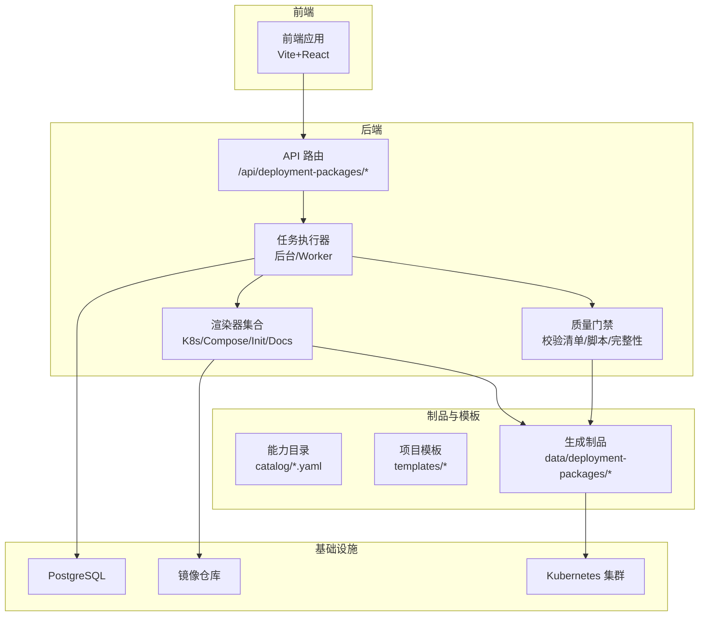
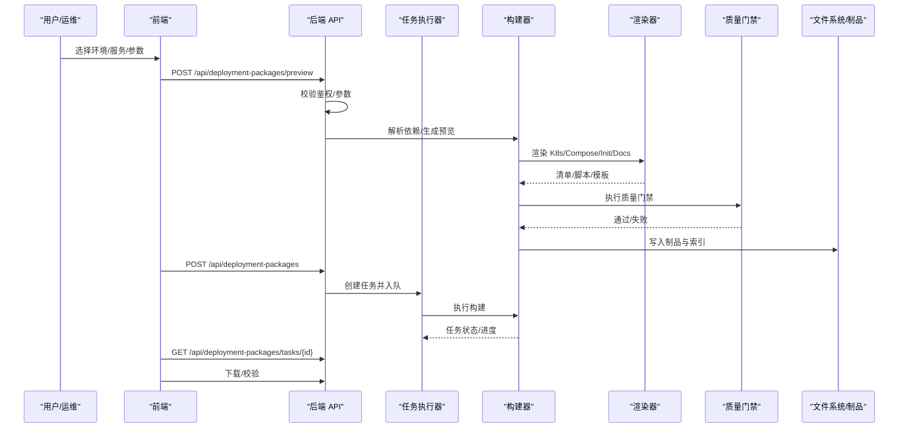
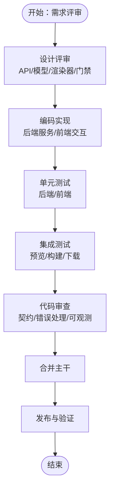
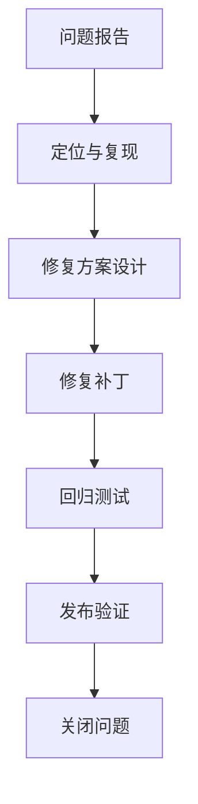
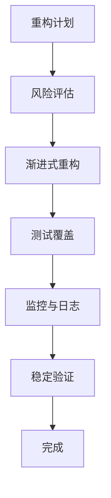
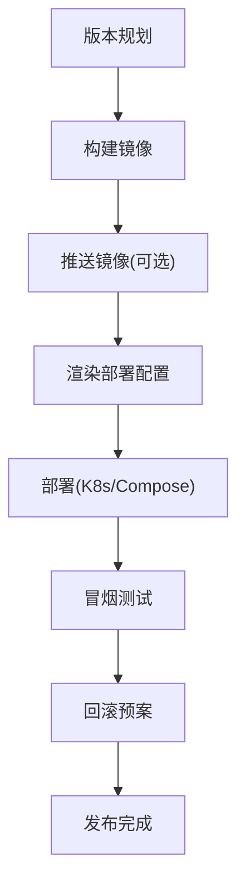
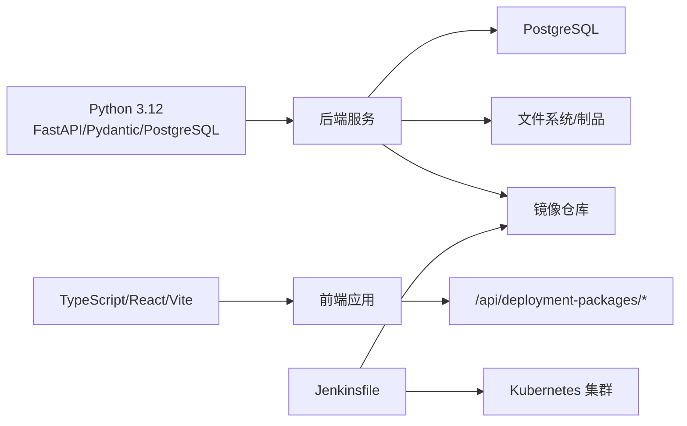

# 开发流程

<cite>
**本文引用的文件**
- [README.md](file://README.md)
- [deployment-package-factory-implementation-plan.md](file://docs/deployment-package-factory-implementation-plan.md)
- [jenkins-ci-cd.md](file://docs/jenkins-ci-cd.md)
- [Jenkinsfile](file://Jenkinsfile)
- [backend/pyproject.toml](file://backend/pyproject.toml)
- [frontend/package.json](file://frontend/package.json)
- [backend/deployment_package_factory/main.py](file://backend/deployment_package_factory/main.py)
- [backend/deployment_package_factory/api/deployment_packages.py](file://backend/deployment_package_factory/api/deployment_packages.py)
- [backend/deployment_package_factory/services/deployment_packages/dependency_resolver.py](file://backend/deployment_package_factory/services/deployment_packages/dependency_resolver.py)
- [backend/deployment_package_factory/services/deployment_packages/builder.py](file://backend/deployment_package_factory/services/deployment_packages/builder.py)
- [backend/tests/test_deployment_package_api.py](file://backend/tests/test_deployment_package_api.py)
- [frontend/src/views/DeploymentPackageExportView.tsx](file://frontend/src/views/DeploymentPackageExportView.tsx)
- [deploy/README.md](file://deploy/README.md)
- [scripts/build-images.sh](file://scripts/build-images.sh)
- [scripts/push-images.sh](file://scripts/push-images.sh)
</cite>

## 目录
1. [简介](#简介)
2. [项目结构](#项目结构)
3. [核心组件](#核心组件)
4. [架构总览](#架构总览)
5. [详细组件分析](#详细组件分析)
6. [依赖分析](#依赖分析)
7. [性能考虑](#性能考虑)
8. [故障排查指南](#故障排查指南)
9. [结论](#结论)
10. [附录](#附录)

## 简介
本文件为“部署包工厂”项目建立标准化的开发流程规范，覆盖需求分析、设计评审、编码实现、测试验证与代码审查的完整生命周期；并针对新功能开发、Bug 修复、重构与版本发布提供可落地的流程与实践，配套 CI/CD 流水线、自动化测试与部署策略，确保交付质量与可追溯性。

## 项目结构
项目采用前后端分离与模板/制品解耦的组织方式：
- 后端（FastAPI）：提供导包 API、任务编排、渲染器、质量门禁与可观测性接口。
- 前端（Vite+React）：提供导包向导、任务管理、审计与下载能力。
- 模板与制品：catalog 目录描述能力与依赖规则，构建阶段产出 K8s/Compose 清单、初始化脚本、质量门禁与镜像归档。
- 部署：提供 K8s 与 Docker Compose 的部署清单与说明。
- CI/CD：Jenkinsfile 定义构建、推送、渲染配置、部署与冒烟测试。

图表来源
- [backend/deployment_package_factory/api/deployment_packages.py:110-123](file://backend/deployment_package_factory/api/deployment_packages.py#L110-L123)
- [backend/deployment_package_factory/services/deployment_packages/builder.py:146-246](file://backend/deployment_package_factory/services/deployment_packages/builder.py#L146-L246)
- [deploy/README.md:97-210](file://deploy/README.md#L97-L210)

章节来源
- [README.md:1-138](file://README.md#L1-L138)
- [deploy/README.md:1-210](file://deploy/README.md#L1-L210)

## 核心组件
- API 层：提供导包选项、预览、创建任务、任务查询、取消/重试、清理、下载与校验等接口；统一鉴权与审计。
- 依赖解析器：基于 catalog 与依赖规则，自动补齐平台/中间件/数据库，输出预览与镜像清单。
- 构建器：编排渲染、质量门禁、镜像导出、打包与校验，生成 tar.gz 产物与索引。
- 前端导包页：封装 API 客户端，提供向导式选择、预览、进度与下载。
- CI/CD：Jenkins 流水线负责镜像构建/推送、部署配置渲染、K8s 部署与冒烟测试。

章节来源
- [backend/deployment_package_factory/api/deployment_packages.py:110-492](file://backend/deployment_package_factory/api/deployment_packages.py#L110-L492)
- [backend/deployment_package_factory/services/deployment_packages/dependency_resolver.py:14-94](file://backend/deployment_package_factory/services/deployment_packages/dependency_resolver.py#L14-L94)
- [backend/deployment_package_factory/services/deployment_packages/builder.py:146-246](file://backend/deployment_package_factory/services/deployment_packages/builder.py#L146-L246)
- [frontend/src/views/DeploymentPackageExportView.tsx:15-135](file://frontend/src/views/DeploymentPackageExportView.tsx#L15-L135)

## 架构总览
后端通过 API 路由接收请求，经鉴权与参数校验后，交由任务执行器调度构建器；构建器按请求选择模板与 catalog，渲染 K8s/Compose 清单、初始化脚本与质量门禁脚本，必要时导出镜像归档，最后打包 tar.gz 并写入校验摘要；前端通过 API 客户端进行交互，支持预览、创建、下载与审计查询。

图表来源
- [backend/deployment_package_factory/api/deployment_packages.py:126-282](file://backend/deployment_package_factory/api/deployment_packages.py#L126-L282)
- [backend/deployment_package_factory/services/deployment_packages/builder.py:146-246](file://backend/deployment_package_factory/services/deployment_packages/builder.py#L146-L246)

## 详细组件分析

### 需求分析与设计评审
- 需求来源：以“实施计划”为依据，明确里程碑与验收标准，将大任务拆分为可独立验证的小任务。
- 设计评审：围绕 API 规范、任务状态机、渲染器职责边界、质量门禁与审计事件进行评审，确保前后端契约清晰、可测试性强。

章节来源
- [deployment-package-factory-implementation-plan.md:47-800](file://docs/deployment-package-factory-implementation-plan.md#L47-L800)

### 编码实现
- API 层：统一鉴权装饰器、错误处理与审计记录；提供选项、预览、任务 CRUD、清理与下载接口。
- 依赖解析：基于 catalog 与依赖规则自动补齐平台/中间件/数据库，输出镜像清单与锁定原因。
- 构建器：编排渲染与质量门禁，支持镜像导出与归档，生成 tar.gz 与校验摘要。
- 前端：封装 API 客户端，提供向导式交互与任务状态可视化。

章节来源
- [backend/deployment_package_factory/api/deployment_packages.py:110-492](file://backend/deployment_package_factory/api/deployment_packages.py#L110-L492)
- [backend/deployment_package_factory/services/deployment_packages/dependency_resolver.py:14-94](file://backend/deployment_package_factory/services/deployment_packages/dependency_resolver.py#L14-L94)
- [backend/deployment_package_factory/services/deployment_packages/builder.py:146-246](file://backend/deployment_package_factory/services/deployment_packages/builder.py#L146-L246)
- [frontend/src/views/DeploymentPackageExportView.tsx:15-135](file://frontend/src/views/DeploymentPackageExportView.tsx#L15-L135)

### 测试验证
- 后端测试：覆盖 API 鉴权、预览依赖解析、任务状态流转、质量门禁与错误路径。
- 前端测试：覆盖导包向导的核心交互与状态展示。
- 质量门禁：K8s/Compose 清单校验、脚本静态检查、完整性校验。

章节来源
- [backend/tests/test_deployment_package_api.py:36-200](file://backend/tests/test_deployment_package_api.py#L36-L200)

### 代码审查
- 审查重点：API 契约一致性、鉴权与审计、错误处理与可观察性、构建器职责边界、质量门禁覆盖度、前端交互与可测试性。
- 审查流程：提交 MR 前自测，触发 CI，审查人关注复杂逻辑、边界条件与回归风险。

章节来源
- [backend/deployment_package_factory/api/deployment_packages.py:599-658](file://backend/deployment_package_factory/api/deployment_packages.py#L599-L658)
- [backend/deployment_package_factory/services/deployment_packages/builder.py:213-246](file://backend/deployment_package_factory/services/deployment_packages/builder.py#L213-L246)

### 新功能开发流程
- 功能设计：基于“实施计划”确定里程碑与验收标准，拆分小任务并形成 PR。
- 技术方案：明确 API/模型变更、依赖解析扩展、渲染器新增与质量门禁补充。
- 实现与测试：实现后端服务与前端交互，补充单元测试与集成测试。
- 验证与评审：通过冒烟测试与代码审查，合并主干并发布。

章节来源
- [deployment-package-factory-implementation-plan.md:763-790](file://docs/deployment-package-factory-implementation-plan.md#L763-L790)
- [backend/deployment_package_factory/api/deployment_packages.py:110-123](file://backend/deployment_package_factory/api/deployment_packages.py#L110-L123)
- [backend/deployment_package_factory/services/deployment_packages/dependency_resolver.py:14-94](file://backend/deployment_package_factory/services/deployment_packages/dependency_resolver.py#L14-L94)

### Bug 修复流程
- 问题报告：收集日志、截图与最小复现步骤，定位 API/构建器/渲染器/质量门禁问题。
- 修复方案：明确修复范围、影响面与回归风险，编写最小化修复与测试用例。
- 回归测试：补充单元测试与集成测试，确保修复生效且不引入新问题。
- 发布验证：通过冒烟测试与质量门禁，确认修复上线。

章节来源
- [backend/deployment_package_factory/api/deployment_packages.py:333-381](file://backend/deployment_package_factory/api/deployment_packages.py#L333-L381)
- [backend/deployment_package_factory/services/deployment_packages/builder.py:213-246](file://backend/deployment_package_factory/services/deployment_packages/builder.py#L213-L246)

### 代码重构流程
- 重构计划：明确重构目标（如渲染器模块化、质量门禁扩展）、风险评估与回退预案。
- 渐进式重构：拆分为多个小改动，逐步替换旧实现，保持对外 API 与行为一致。
- 质量保证：补充测试覆盖，确保构建器与渲染器稳定性，持续监控指标与日志。

章节来源
- [backend/deployment_package_factory/services/deployment_packages/builder.py:146-246](file://backend/deployment_package_factory/services/deployment_packages/builder.py#L146-L246)
- [README.md:98-138](file://README.md#L98-L138)

### 版本发布流程
- 版本规划：依据里程碑与验收标准制定版本计划，明确发布内容与风险。
- 构建打包：通过脚本构建镜像并可选推送至镜像仓库。
- 部署验证：渲染部署配置，部署至 K8s 或 Docker Compose，执行冒烟测试。
- 回滚预案：记录部署配置快照，保留回滚步骤与数据备份策略。

章节来源
- [scripts/build-images.sh:54-96](file://scripts/build-images.sh#L54-L96)
- [scripts/push-images.sh:42-53](file://scripts/push-images.sh#L42-L53)
- [deploy/README.md:43-96](file://deploy/README.md#L43-L96)
- [Jenkinsfile:35-246](file://Jenkinsfile#L35-L246)

## 依赖分析
- 语言与框架：后端使用 FastAPI、Pydantic、PostgreSQL；前端使用 React/Vite。
- 任务执行：支持后台任务与独立 Worker 两种模式，通过心跳与超时控制任务状态。
- 渲染与质量：K8s/Compose 清单、初始化脚本、质量门禁与完整性校验。
- CI/CD：Jenkins 流水线负责镜像构建/推送、部署配置渲染、K8s 部署与冒烟测试。

图表来源
- [backend/pyproject.toml:1-30](file://backend/pyproject.toml#L1-L30)
- [frontend/package.json:1-26](file://frontend/package.json#L1-L26)
- [Jenkinsfile:1-258](file://Jenkinsfile#L1-L258)

章节来源
- [backend/pyproject.toml:1-30](file://backend/pyproject.toml#L1-L30)
- [frontend/package.json:1-26](file://frontend/package.json#L1-L26)
- [Jenkinsfile:1-258](file://Jenkinsfile#L1-L258)

## 性能考虑
- 并发与队列：通过配置限制并发构建数，避免资源争用；Worker 模式下由独立进程执行任务，提升稳定性。
- 产物清理：按保留天数与总容量上限清理过期制品，避免磁盘膨胀。
- 镜像导出：优先使用 daemonless 导出工具，减少对宿主机 Docker 的依赖；本地回退到 Docker CLI。
- 可观测性：暴露健康检查与指标端点，便于监控与告警。

章节来源
- [README.md:66-138](file://README.md#L66-L138)
- [backend/deployment_package_factory/main.py:41-62](file://backend/deployment_package_factory/main.py#L41-L62)

## 故障排查指南
- 健康检查：通过健康与就绪端点快速判断服务状态与依赖可用性。
- 任务状态：查询任务列表与详情，结合审计事件定位失败原因。
- 下载与校验：若下载失败，检查制品是否存在与校验摘要是否匹配。
- 镜像导出：检查导出环境工具可用性与来源镜像仓库可达性。

章节来源
- [backend/deployment_package_factory/main.py:41-62](file://backend/deployment_package_factory/main.py#L41-L62)
- [backend/deployment_package_factory/api/deployment_packages.py:285-492](file://backend/deployment_package_factory/api/deployment_packages.py#L285-L492)

## 结论
通过标准化的开发流程与严格的测试、审查与发布机制，“部署包工厂”能够在多环境、多模板场景下稳定生成高质量的生产交付包。建议持续完善质量门禁、增强可观测性与自动化测试，保障交付效率与可靠性。

## 附录
- CI/CD 配置要点：镜像构建/推送、部署配置渲染、K8s 部署与冒烟测试。
- 部署策略：K8s 与 Docker Compose 两种模式，支持 Worker 与后台任务模式。
- 前后端交互：统一鉴权、错误处理与审计，确保可追溯与可维护。

章节来源
- [jenkins-ci-cd.md:1-59](file://docs/jenkins-ci-cd.md#L1-L59)
- [deploy/README.md:97-210](file://deploy/README.md#L97-L210)
- [backend/deployment_package_factory/api/deployment_packages.py:599-658](file://backend/deployment_package_factory/api/deployment_packages.py#L599-L658)