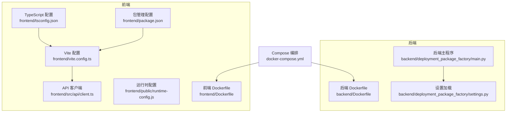
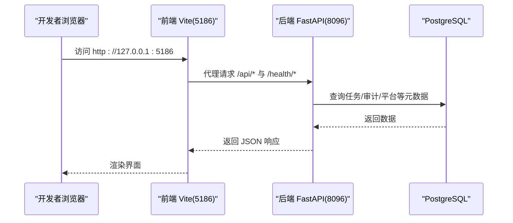
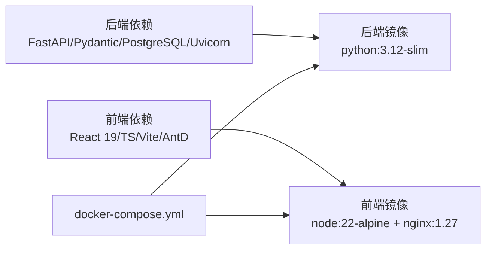

# 开发环境搭建

<cite>
**本文引用的文件**
- [README.md](file://README.md)
- [pyproject.toml](file://backend/pyproject.toml)
- [Dockerfile（后端）](file://backend/Dockerfile)
- [Dockerfile（前端）](file://frontend/Dockerfile)
- [docker-compose.yml](file://docker-compose.yml)
- [settings.py（后端）](file://backend/deployment_package_factory/settings.py)
- [main.py（后端）](file://backend/deployment_package_factory/main.py)
- [package.json（前端）](file://frontend/package.json)
- [vite.config.ts（前端）](file://frontend/vite.config.ts)
- [tsconfig.json（前端）](file://frontend/tsconfig.json)
- [client.ts（前端 API 客户端）](file://frontend/src/api/client.ts)
- [runtime-config.js（前端运行时配置）](file://frontend/public/runtime-config.js)
- [dev-backend.ps1](file://scripts/dev-backend.ps1)
- [dev-frontend.ps1](file://scripts/dev-frontend.ps1)
- [install-source-environments.sh](file://scripts/install-source-environments.sh)
</cite>

## 目录
1. [简介](#简介)
2. [项目结构](#项目结构)
3. [核心组件](#核心组件)
4. [架构总览](#架构总览)
5. [详细组件分析](#详细组件分析)
6. [依赖关系分析](#依赖关系分析)
7. [性能考虑](#性能考虑)
8. [故障排查指南](#故障排查指南)
9. [结论](#结论)
10. [附录](#附录)

## 简介
本指南面向首次参与“部署包工厂”项目的开发者，提供从零开始的完整开发环境搭建方案。内容涵盖：
- Python 3.12+、Node.js 与 Docker 的安装与配置
- 项目克隆、依赖安装与环境变量配置
- 后端（FastAPI、Pydantic、PostgreSQL）与前端（React 19、TypeScript、Vite）开发环境详解
- 本地开发服务器启动、热重载与调试端口设置
- 常见问题排查与跨平台（Windows/macOS/Linux）安装指引

## 项目结构
该项目采用前后端分离架构：
- 后端：独立的 FastAPI 服务，提供能力目录、依赖预览、部署包生成与下载接口
- 前端：独立的 Vite + React 页面，面向实施人员执行导包
- 模板与产物：templates/catalog 与生成的部署包产物
- 部署：deploy 提供 Kubernetes 与 docker-compose 的部署清单

图表来源
- [main.py（后端）:1-68](file://backend/deployment_package_factory/main.py#L1-L68)
- [settings.py（后端）:1-57](file://backend/deployment_package_factory/settings.py#L1-L57)
- [Dockerfile（后端）:1-36](file://backend/Dockerfile#L1-L36)
- [vite.config.ts（前端）:1-42](file://frontend/vite.config.ts#L1-L42)
- [tsconfig.json（前端）:1-23](file://frontend/tsconfig.json#L1-L23)
- [package.json（前端）:1-26](file://frontend/package.json#L1-L26)
- [client.ts（前端 API 客户端）:1-83](file://frontend/src/api/client.ts#L1-L83)
- [runtime-config.js（前端运行时配置）:1-5](file://frontend/public/runtime-config.js#L1-L5)
- [Dockerfile（前端）:1-32](file://frontend/Dockerfile#L1-L32)
- [docker-compose.yml:1-36](file://docker-compose.yml#L1-L36)

章节来源
- [README.md:12-39](file://README.md#L12-L39)
- [docker-compose.yml:1-36](file://docker-compose.yml#L1-L36)

## 核心组件
- 后端服务（FastAPI）
  - 版本与依赖：Python 3.12、FastAPI、Pydantic、PostgreSQL 驱动、Uvicorn
  - 端口：8096
  - 健康检查：/health、/health/ready
  - 指标：/metrics
- 前端应用（Vite + React 19 + TypeScript）
  - 端口：5186（开发）
  - 代理：/api、/health 代理至后端 8096
  - 运行时配置：通过 /runtime-config.js 注入 API 基地址与 Token
- 容器编排（Docker Compose）
  - 后端映射 8096 → 8096，前端映射 5186 → 80
  - 健康检查：后端服务健康探测

章节来源
- [pyproject.toml:1-30](file://backend/pyproject.toml#L1-L30)
- [main.py（后端）:41-62](file://backend/deployment_package_factory/main.py#L41-L62)
- [package.json（前端）:8](file://frontend/package.json#L8)
- [vite.config.ts:35-40](file://frontend/vite.config.ts#L35-L40)
- [runtime-config.js（前端运行时配置）:1-5](file://frontend/public/runtime-config.js#L1-L5)
- [docker-compose.yml:18-22](file://docker-compose.yml#L18-L22)

## 架构总览
下图展示本地开发的典型交互流程：前端通过 Vite 代理访问后端 API，后端连接 PostgreSQL 存储任务与审计元数据。

图表来源
- [vite.config.ts:35-40](file://frontend/vite.config.ts#L35-L40)
- [main.py（后端）:41-62](file://backend/deployment_package_factory/main.py#L41-L62)
- [docker-compose.yml:35](file://docker-compose.yml#L35)

## 详细组件分析

### 后端开发环境（FastAPI、Pydantic、PostgreSQL）
- Python 环境
  - 版本要求：Python 3.12（严格 >=3.12,<3.13）
  - 推荐：使用 pyenv 或官方安装包安装
- 依赖安装
  - 使用 uv（推荐）或 pip 安装后端依赖
  - 测试依赖（可选）：pytest、httpx
- PostgreSQL
  - 必填：设置连接串环境变量
  - 作用：存储任务、审计、平台与微服务注册元数据
- 设置加载
  - 关键环境变量：DEPLOYMENT_PACKAGE_DATABASE_URL、DEPLOYMENT_PACKAGE_DATA_DIR、DEPLOYMENT_PACKAGE_OUTPUT_DIR 等
  - 默认数据目录：项目根 data/
  - 输出目录：data/deployment-packages
- 启动方式
  - 直接运行：uvicorn 启动后端主程序，端口 8096，开启 reload
  - 脚本启动：Windows PowerShell 脚本一键进入 backend 目录并启动
  - 容器启动：docker-compose up --build
- 健康检查与指标
  - /health：应用存活
  - /health/ready：就绪检查（含数据库、输出目录写入、镜像导出工具状态）
  - /metrics：Prometheus 文本格式指标

章节来源
- [pyproject.toml:5](file://backend/pyproject.toml#L5)
- [settings.py（后端）:26-41](file://backend/deployment_package_factory/settings.py#L26-L41)
- [main.py（后端）:41-62](file://backend/deployment_package_factory/main.py#L41-L62)
- [dev-backend.ps1:1-7](file://scripts/dev-backend.ps1#L1-L7)
- [docker-compose.yml:18-22](file://docker-compose.yml#L18-L22)

### 前端开发环境（React 19、TypeScript、Vite）
- Node.js 与包管理
  - Node 版本：前端 Dockerfile 使用 node:22-alpine，实际开发建议使用 nvm 安装 Node LTS
  - 包管理：pnpm（版本在 package.json 中声明），确保启用 corepack
- 依赖安装与构建
  - 安装：pnpm install
  - 开发：pnpm dev（端口 5186，host 0.0.0.0）
  - 预览：pnpm preview（端口 5187）
- TypeScript 与 Vite
  - tsconfig：严格模式、ES2022 目标、Bundler 解析
  - vite.config：代理 /api 与 /health 至后端 8096，别名 @ 指向 src
- 运行时配置
  - /runtime-config.js：注入 apiBaseUrl 与 apiToken
  - 前端运行时优先读取该配置；本地开发可使用 VITE_API_BASE_URL 与 VITE_DEPLOYMENT_PACKAGE_API_TOKEN 作为兜底
- 热重载与调试
  - Vite 默认启用热重载
  - 如需远程调试，使用 host 0.0.0.0 并在防火墙放行对应端口

章节来源
- [package.json（前端）:6](file://frontend/package.json#L6)
- [package.json（前端）:8](file://frontend/package.json#L8)
- [tsconfig.json（前端）:1-23](file://frontend/tsconfig.json#L1-L23)
- [vite.config.ts:1-42](file://frontend/vite.config.ts#L1-L42)
- [client.ts（前端 API 客户端）:24-25](file://frontend/src/api/client.ts#L24-L25)
- [runtime-config.js（前端运行时配置）:1-5](file://frontend/public/runtime-config.js#L1-L5)

### 容器化开发环境（Docker 与 docker-compose）
- 后端镜像
  - 基于 python:3.12-slim
  - 安装 skopeo、ca-certificates，便于镜像导出
  - 暴露 8096，CMD 启动 Uvicorn
- 前端镜像
  - 多阶段构建：第一阶段使用 node:22-alpine 安装 pnpm 与依赖并构建
  - 第二阶段基于 nginx:1.27-alpine 提供静态资源
  - 暴露 80，entrypoint 执行 docker-entrypoint.sh
- Compose 编排
  - 后端：端口映射 8096 → 8096，健康检查探测 /health/ready
  - 前端：端口映射 5186 → 80，依赖后端健康
  - 环境变量：DEPLOYMENT_PACKAGE_DATABASE_URL、DEPLOYMENT_PACKAGE_API_TOKEN、DEPLOYMENT_PACKAGE_FRONTEND_* 等

章节来源
- [Dockerfile（后端）:1-36](file://backend/Dockerfile#L1-L36)
- [Dockerfile（前端）:1-32](file://frontend/Dockerfile#L1-L32)
- [docker-compose.yml:1-36](file://docker-compose.yml#L1-L36)

### 本地开发服务器启动与调试
- 方式一：分别启动后端与前端
  - 后端：进入 backend 目录，uvicorn 启动（端口 8096，reload）
  - 前端：进入 frontend 目录，pnpm dev（端口 5186）
- 方式二：使用脚本
  - Windows：运行 scripts/dev-backend.ps1 与 scripts/dev-frontend.ps1
- 方式三：容器化
  - 在项目根目录执行 docker compose up --build
  - 访问 http://127.0.0.1:5186
- 调试端口
  - 后端：8096
  - 前端：5186（dev）、5187（preview）

章节来源
- [README.md:14-27](file://README.md#L14-L27)
- [dev-backend.ps1:1-7](file://scripts/dev-backend.ps1#L1-L7)
- [dev-frontend.ps1:1-7](file://scripts/dev-frontend.ps1#L1-L7)
- [docker-compose.yml:35](file://docker-compose.yml#L35)

## 依赖关系分析
- 后端依赖
  - FastAPI、Pydantic、PostgreSQL 驱动、YAML、Uvicorn
  - 测试与开发依赖：pytest、httpx
- 前端依赖
  - React 19、TypeScript、Vite、Ant Design、RemixIcon
  - 类型：@types/react、@types/react-dom
- 容器镜像
  - 后端：python:3.12-slim + skopeo
  - 前端：node:22-alpine 构建，nginx:1.27-alpine 提供静态服务

图表来源
- [pyproject.toml:6-12](file://backend/pyproject.toml#L6-L12)
- [package.json（前端）:12-24](file://frontend/package.json#L12-L24)
- [Dockerfile（后端）:1-36](file://backend/Dockerfile#L1-L36)
- [Dockerfile（前端）:1-32](file://frontend/Dockerfile#L1-L32)
- [docker-compose.yml:1-36](file://docker-compose.yml#L1-L36)

章节来源
- [pyproject.toml:1-30](file://backend/pyproject.toml#L1-L30)
- [package.json（前端）:1-26](file://frontend/package.json#L1-L26)

## 性能考虑
- 并发与队列
  - 默认单进程内最大并发构建数为 1；可通过环境变量调整
- 镜像导出
  - 生产优先使用 skopeo；本地回退到 Docker CLI
- 健康检查与可观测性
  - /health/ready 会检查数据库、输出目录写入与镜像导出工具状态
  - /metrics 暴露任务与审计相关指标，便于 Prometheus 抓取

章节来源
- [README.md:68-87](file://README.md#L68-L87)
- [main.py（后端）:45-55](file://backend/deployment_package_factory/main.py#L45-L55)
- [README.md:109-115](file://README.md#L109-L115)

## 故障排查指南
- 端口占用
  - 后端 8096、前端 5186/5187 被占用时，请释放或修改端口
- 健康检查失败
  - /health/ready 返回 503：检查 DEPLOYMENT_PACKAGE_DATABASE_URL 是否正确、输出目录可写、镜像导出工具可用
- 前端无法访问后端 API
  - 确认 Vite 代理配置 /api 与 /health 指向 127.0.0.1:8096
  - 若使用容器，确认前端容器网络与后端健康状态
- API 认证
  - 若后端启用了 DEPLOYMENT_PACKAGE_API_TOKEN，前端需在运行时配置或使用 VITE_DEPLOYMENT_PACKAGE_API_TOKEN
- 容器启动异常
  - 查看 docker-compose 健康检查日志，确认后端 /health/ready 可用
- 源环境安装
  - 使用 scripts/install-source-environments.sh 渲染并应用源环境清单

章节来源
- [vite.config.ts:35-40](file://frontend/vite.config.ts#L35-L40)
- [client.ts（前端 API 客户端）:24-25](file://frontend/src/api/client.ts#L24-L25)
- [docker-compose.yml:18-22](file://docker-compose.yml#L18-L22)
- [install-source-environments.sh:1-9](file://scripts/install-source-environments.sh#L1-L9)

## 结论
通过本指南，您可以在本地快速搭建并运行“部署包工厂”的前后端开发环境。建议优先使用 docker-compose 以获得一致的运行体验；若需深度调试，可分别启动后端与前端。务必正确配置 PostgreSQL 连接串与必要的环境变量，并利用健康检查与指标进行可观测性验证。

## 附录

### 环境变量一览（后端）
- DEPLOYMENT_PACKAGE_DATA_DIR：运行时数据根目录，默认 data/
- DEPLOYMENT_PACKAGE_DATABASE_URL：必填，PostgreSQL 连接串
- DEPLOYMENT_PACKAGE_OUTPUT_DIR：工作目录与产物输出目录，默认 data/deployment-packages
- DEPLOYMENT_PACKAGE_API_TOKEN：可选 API 访问令牌
- DEPLOYMENT_PACKAGE_FRONTEND_API_BASE_URL：前端容器注入的 API 地址
- DEPLOYMENT_PACKAGE_FRONTEND_API_TOKEN：前端容器注入的 API Token
- DEPLOYMENT_PACKAGE_MAX_CONCURRENT_BUILDS：并发构建数，默认 1
- DEPLOYMENT_PACKAGE_EXECUTION_MODE：background 或 worker
- DEPLOYMENT_PACKAGE_WORKER_POLL_INTERVAL_SECONDS：worker 轮询间隔
- DEPLOYMENT_PACKAGE_WORKER_HEARTBEAT_SECONDS：心跳间隔
- DEPLOYMENT_PACKAGE_RUNNING_TASK_TIMEOUT_MINUTES：运行中超时阈值
- DEPLOYMENT_PACKAGE_RETENTION_DAYS：保留天数
- DEPLOYMENT_PACKAGE_MAX_TOTAL_GB：保留总容量上限

章节来源
- [README.md:68-87](file://README.md#L68-L87)
- [settings.py（后端）:26-41](file://backend/deployment_package_factory/settings.py#L26-L41)

### 跨平台安装与配置要点
- Windows
  - 安装 Python 3.12、Node.js 22、Docker Desktop
  - 使用 PowerShell 运行 scripts/dev-backend.ps1 与 scripts/dev-frontend.ps1
  - 如需使用 WSL2，确保 Docker Desktop 挂载驱动盘
- macOS
  - 使用 Homebrew 安装 Python 3.12、Node.js 22、Docker Desktop
  - 前端端口 5186/5187 需放行防火墙
- Linux
  - 使用发行版包管理器安装 Python 3.12、Node.js 22、Docker Engine + Compose
  - 如需代理镜像源，可在构建时传入 APT/NPM 源参数（参考 Dockerfile 中 ARG）

章节来源
- [Dockerfile（后端）:3-6](file://backend/Dockerfile#L3-L6)
- [Dockerfile（前端）:3](file://frontend/Dockerfile#L3)
- [README.md:14-39](file://README.md#L14-L39)