# 微服务模板扩展

<cite>
**本文引用的文件**
- [templates.py](file://backend/deployment_package_factory/services/microservices/templates.py)
- [scaffold.py](file://backend/deployment_package_factory/services/microservices/scaffold.py)
- [java_templates.py](file://backend/deployment_package_factory/services/microservices/java_templates.py)
- [node_templates.py](file://backend/deployment_package_factory/services/microservices/node_templates.py)
- [frontend_templates.py](file://backend/deployment_package_factory/services/microservices/frontend_templates.py)
- [templates_common.py](file://backend/deployment_package_factory/services/microservices/templates_common.py)
- [validation.py](file://backend/deployment_package_factory/services/microservices/validation.py)
- [middleware_plugins.py](file://backend/deployment_package_factory/services/microservices/middleware_plugins.py)
- [middleware_runtime.py](file://backend/deployment_package_factory/services/microservices/middleware_runtime.py)
- [result_metadata.py](file://backend/deployment_package_factory/services/microservices/result_metadata.py)
- [platform.yaml](file://templates/catalog/platform.yaml)
- [projects.yaml](file://templates/catalog/projects.yaml)
- [middleware.yaml](file://templates/catalog/middleware.yaml)
- [validate_microservice_scaffolds.py](file://scripts/validate_microservice_scaffolds.py)
- [README.md](file://README.md)
</cite>

## 目录
1. [简介](#简介)
2. [项目结构](#项目结构)
3. [核心组件](#核心组件)
4. [架构概览](#架构概览)
5. [详细组件分析](#详细组件分析)
6. [依赖分析](#依赖分析)
7. [性能考虑](#性能考虑)
8. [故障排除指南](#故障排除指南)
9. [结论](#结论)
10. [附录](#附录)

## 简介
本指南面向需要扩展微服务模板系统的开发者，提供从零开始创建新微服务技术栈模板的完整方法论。系统支持多种语言（Python、Node.js、Java）与前端框架（Vue3、React），并通过中间件插件机制实现灵活的平台能力集成。文档涵盖模板结构设计原则、变量定义机制、文件渲染系统、模板继承关系、验证机制与错误处理，以及完整的开发示例。

## 项目结构
微服务模板系统主要由以下层次构成：
- 模板渲染层：负责根据请求参数生成具体文件集合
- 技术栈模板层：针对不同语言/框架提供专用模板
- 中间件集成层：动态注入中间件配置与运行时环境
- 验证与结果层：对生成物进行一致性与合规性检查
- 配置目录层：平台能力、项目模板与中间件定义

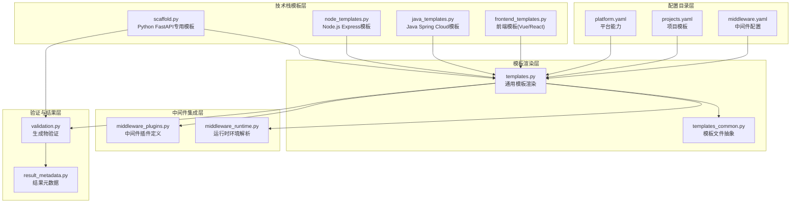

**图表来源**
- [templates.py:1-339](file://backend/deployment_package_factory/services/microservices/templates.py#L1-L339)
- [scaffold.py:1-800](file://backend/deployment_package_factory/services/microservices/scaffold.py#L1-L800)
- [node_templates.py:1-134](file://backend/deployment_package_factory/services/microservices/node_templates.py#L1-L134)
- [java_templates.py:1-151](file://backend/deployment_package_factory/services/microservices/java_templates.py#L1-L151)
- [frontend_templates.py:1-79](file://backend/deployment_package_factory/services/microservices/frontend_templates.py#L1-L79)
- [templates_common.py:1-12](file://backend/deployment_package_factory/services/microservices/templates_common.py#L1-L12)
- [validation.py:1-144](file://backend/deployment_package_factory/services/microservices/validation.py#L1-L144)
- [middleware_plugins.py:1-68](file://backend/deployment_package_factory/services/microservices/middleware_plugins.py#L1-L68)
- [middleware_runtime.py:1-203](file://backend/deployment_package_factory/services/microservices/middleware_runtime.py#L1-L203)
- [platform.yaml:1-66](file://templates/catalog/platform.yaml#L1-L66)
- [projects.yaml:1-54](file://templates/catalog/projects.yaml#L1-L54)
- [middleware.yaml:1-283](file://templates/catalog/middleware.yaml#L1-L283)

**章节来源**
- [README.md:1-349](file://README.md#L1-L349)

## 核心组件
- 模板文件抽象：通过统一的数据类封装文件路径、内容与可执行标志，确保渲染一致性。
- 通用模板渲染器：根据技术栈选择对应渲染逻辑，合并公共文件与特定文件。
- 技术栈专用渲染器：为Python、Node.js、Java与前端框架提供定制化文件集合。
- 中间件插件系统：集中管理中间件键名、环境变量名、默认端点与占位符生成。
- 运行时环境解析：将中间件配置转换为服务可读的运行时环境变量。
- 生成物验证器：对关键文件、语法、流水线片段、Helm模板契约、微前端依赖与归档完整性进行检查。
- 结果元数据生成：计算镜像引用、Git仓库URL、Jenkins作业地址及命令行。

**章节来源**
- [templates_common.py:7-12](file://backend/deployment_package_factory/services/microservices/templates_common.py#L7-L12)
- [templates.py:41-125](file://backend/deployment_package_factory/services/microservices/templates.py#L41-L125)
- [scaffold.py:229-292](file://backend/deployment_package_factory/services/microservices/scaffold.py#L229-L292)
- [middleware_plugins.py:27-68](file://backend/deployment_package_factory/services/microservices/middleware_plugins.py#L27-L68)
- [middleware_runtime.py:22-76](file://backend/deployment_package_factory/services/microservices/middleware_runtime.py#L22-L76)
- [validation.py:9-18](file://backend/deployment_package_factory/services/microservices/validation.py#L9-L18)
- [result_metadata.py:4-28](file://backend/deployment_package_factory/services/microservices/result_metadata.py#L4-L28)

## 架构概览
下图展示了从请求到生成物的完整流程，包括模板选择、文件渲染、中间件注入与验证阶段：

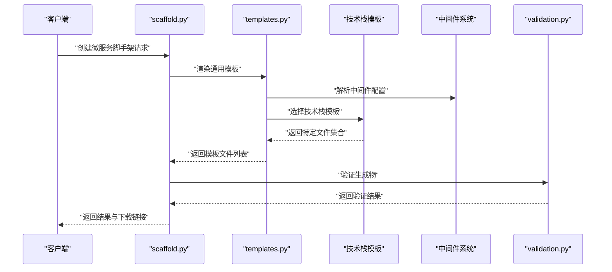

**图表来源**
- [scaffold.py:229-292](file://backend/deployment_package_factory/services/microservices/scaffold.py#L229-L292)
- [templates.py:41-53](file://backend/deployment_package_factory/services/microservices/templates.py#L41-L53)
- [validation.py:9-18](file://backend/deployment_package_factory/services/microservices/validation.py#L9-L18)

## 详细组件分析

### 模板文件抽象与通用渲染
- 模板文件抽象：使用不可变数据类封装文件路径、内容与可执行权限，保证渲染一致性与可测试性。
- 通用渲染流程：根据技术栈选择渲染分支，合并公共文件与特定文件，注入中间件运行时环境变量与占位符。

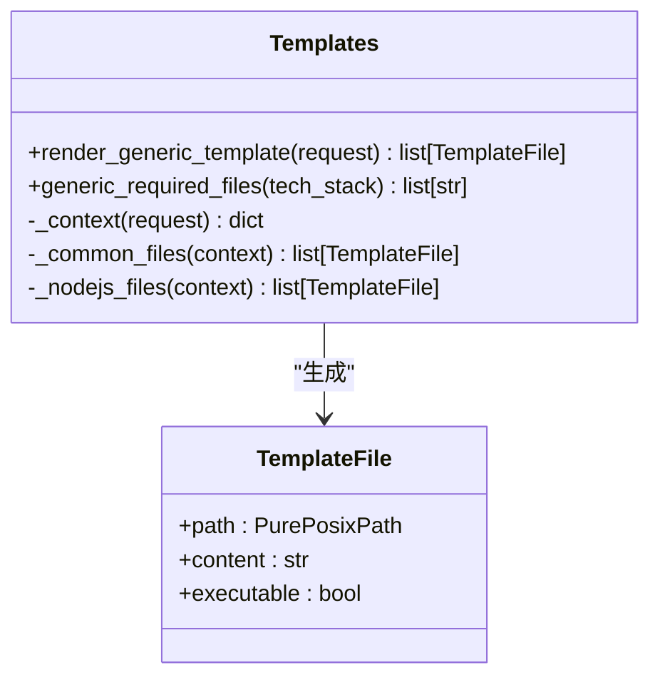

**图表来源**
- [templates_common.py:7-12](file://backend/deployment_package_factory/services/microservices/templates_common.py#L7-L12)
- [templates.py:41-125](file://backend/deployment_package_factory/services/microservices/templates.py#L41-L125)

**章节来源**
- [templates_common.py:7-12](file://backend/deployment_package_factory/services/microservices/templates_common.py#L7-L12)
- [templates.py:41-125](file://backend/deployment_package_factory/services/microservices/templates.py#L41-L125)

### Python FastAPI 模板扩展
- 专用渲染器：提供Python项目的完整目录结构、依赖文件、Dockerfile、Jenkinsfile、本地开发脚本与测试脚本。
- 中间件集成：根据选择的中间件动态注入Redis与PostgreSQL客户端与迁移脚本。
- 验证规则：检查关键文件、Python语法、流水线片段与Helm模板契约。

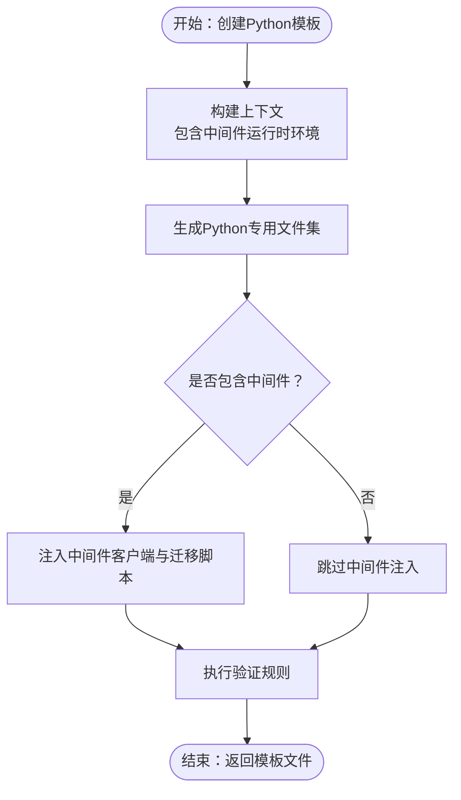

**图表来源**
- [scaffold.py:311-370](file://backend/deployment_package_factory/services/microservices/scaffold.py#L311-L370)
- [validation.py:9-18](file://backend/deployment_package_factory/services/microservices/validation.py#L9-L18)

**章节来源**
- [scaffold.py:29-80](file://backend/deployment_package_factory/services/microservices/scaffold.py#L29-L80)
- [scaffold.py:311-370](file://backend/deployment_package_factory/services/microservices/scaffold.py#L311-L370)
- [validation.py:95-122](file://backend/deployment_package_factory/services/microservices/validation.py#L95-L122)

### Node.js Express 模板扩展
- 模板结构：提供TypeScript配置、领域模型、应用用例、基础设施与HTTP路由等模块化结构。
- 中间件客户端：自动生成中间件健康检查客户端，支持非阻塞运行时检查。
- 验证规则：检查包管理配置、路由与设置文件、微前端依赖（如适用）。

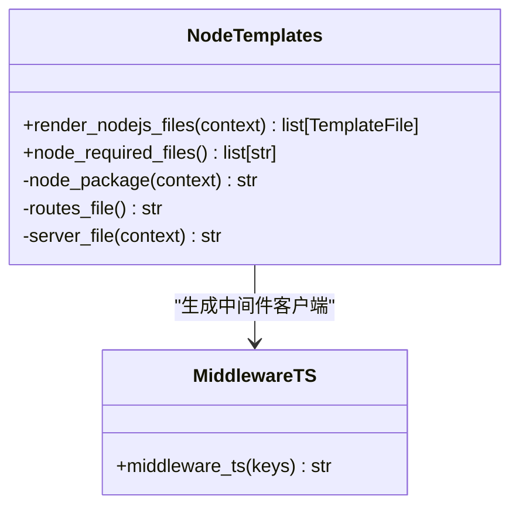

**图表来源**
- [node_templates.py:9-23](file://backend/deployment_package_factory/services/microservices/node_templates.py#L9-L23)
- [node_templates.py:61-98](file://backend/deployment_package_factory/services/microservices/node_templates.py#L61-L98)

**章节来源**
- [node_templates.py:9-40](file://backend/deployment_package_factory/services/microservices/node_templates.py#L9-L40)
- [node_templates.py:61-134](file://backend/deployment_package_factory/services/microservices/node_templates.py#L61-L134)

### Java Spring Cloud 模板扩展
- 模板结构：基于Maven的Spring Boot项目，包含Nacos服务发现与JPA数据访问示例。
- 运行时环境：根据中间件配置生成应用配置文件与依赖声明。
- 验证规则：检查POM依赖、配置文件与主类注解。

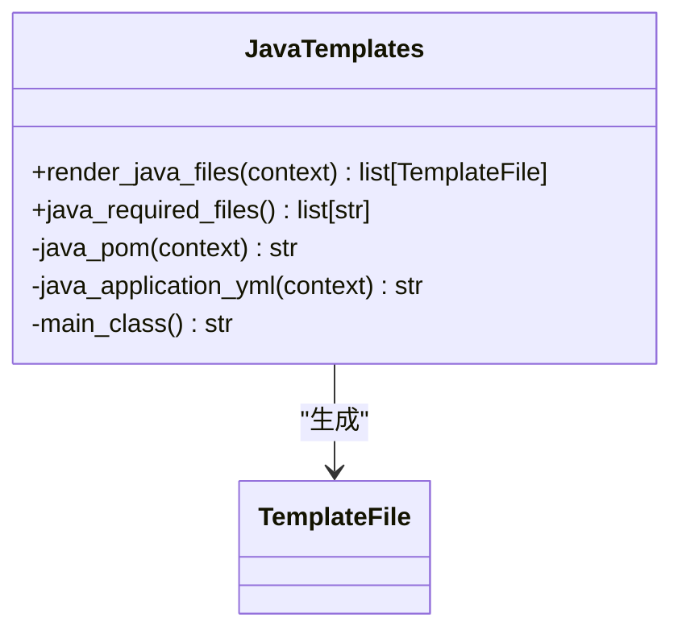

**图表来源**
- [java_templates.py:8-16](file://backend/deployment_package_factory/services/microservices/java_templates.py#L8-L16)
- [java_templates.py:29-76](file://backend/deployment_package_factory/services/microservices/java_templates.py#L29-L76)

**章节来源**
- [java_templates.py:8-27](file://backend/deployment_package_factory/services/microservices/java_templates.py#L8-L27)
- [java_templates.py:29-151](file://backend/deployment_package_factory/services/microservices/java_templates.py#L29-L151)

### 前端模板扩展（Vue3/React）
- 模板结构：根据技术栈生成Vite配置、TypeScript配置与入口文件。
- 微前端集成：根据选择的微前端框架（qiankun/wujie）自动注入相应依赖。
- 验证规则：检查包管理配置、路由与构建插件。

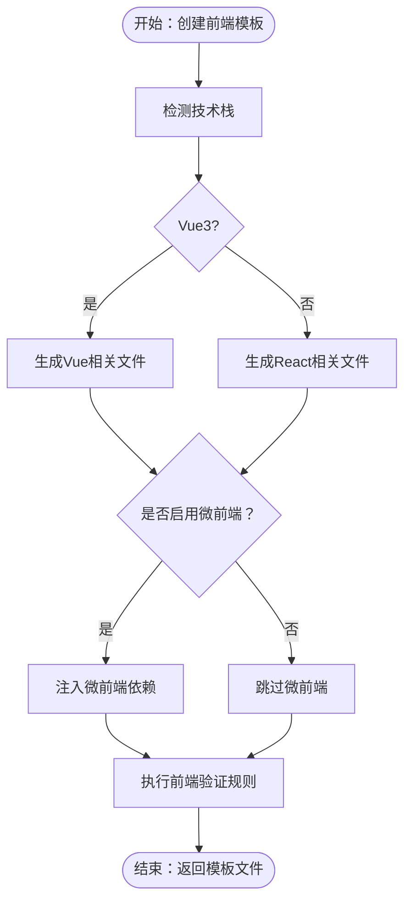

**图表来源**
- [frontend_templates.py:8-21](file://backend/deployment_package_factory/services/microservices/frontend_templates.py#L8-L21)
- [frontend_templates.py:48-54](file://backend/deployment_package_factory/services/microservices/frontend_templates.py#L48-L54)
- [frontend_templates.py:71-79](file://backend/deployment_package_factory/services/microservices/frontend_templates.py#L71-L79)

**章节来源**
- [frontend_templates.py:8-29](file://backend/deployment_package_factory/services/microservices/frontend_templates.py#L8-L29)
- [frontend_templates.py:31-79](file://backend/deployment_package_factory/services/microservices/frontend_templates.py#L31-L79)

### 中间件插件系统与运行时环境
- 插件定义：集中管理中间件键名、环境变量名、默认端点与占位符生成。
- 运行时解析：将中间件配置规范化，生成服务可读的运行时环境变量（含敏感信息标记）。
- 技术栈适配：为不同技术栈生成对应的环境变量格式（如Redis URL、PostgreSQL DSN）。

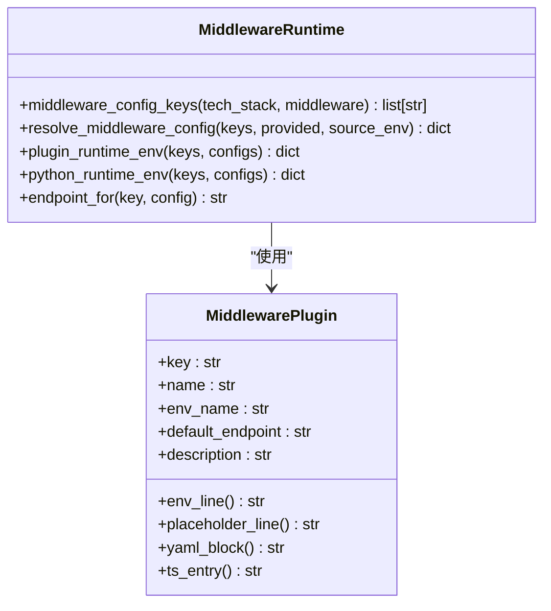

**图表来源**
- [middleware_plugins.py:6-25](file://backend/deployment_package_factory/services/microservices/middleware_plugins.py#L6-L25)
- [middleware_runtime.py:22-76](file://backend/deployment_package_factory/services/microservices/middleware_runtime.py#L22-L76)

**章节来源**
- [middleware_plugins.py:27-68](file://backend/deployment_package_factory/services/microservices/middleware_plugins.py#L27-L68)
- [middleware_runtime.py:22-144](file://backend/deployment_package_factory/services/microservices/middleware_runtime.py#L22-L144)

### 生成物验证机制
- 关键文件检查：确保所有必需文件存在。
- 语法检查：对Python源码进行编译检查。
- 流水线与模板检查：验证Dockerfile、Jenkinsfile、Helm模板完整性与契约。
- 中间件占位符检查：确保环境模板与配置文件包含必要的占位符。
- 归档完整性：验证生成的压缩包可读且包含预期内容。

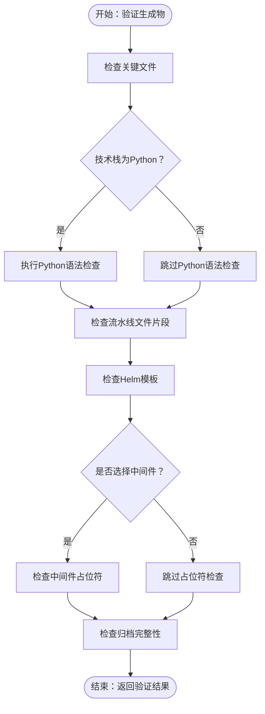

**图表来源**
- [validation.py:9-18](file://backend/deployment_package_factory/services/microservices/validation.py#L9-L18)
- [validation.py:21-37](file://backend/deployment_package_factory/services/microservices/validation.py#L21-L37)
- [validation.py:39-55](file://backend/deployment_package_factory/services/microservices/validation.py#L39-L55)
- [validation.py:57-83](file://backend/deployment_package_factory/services/microservices/validation.py#L57-L83)
- [validation.py:85-93](file://backend/deployment_package_factory/services/microservices/validation.py#L85-L93)
- [validation.py:137-144](file://backend/deployment_package_factory/services/microservices/validation.py#L137-L144)

**章节来源**
- [validation.py:9-18](file://backend/deployment_package_factory/services/microservices/validation.py#L9-L18)
- [validation.py:21-144](file://backend/deployment_package_factory/services/microservices/validation.py#L21-L144)

### 添加新的项目类型、平台支持与中间件集成

#### 新增项目类型（以Python为例）
- 在通用模板中注册技术栈映射与项目类型约束
- 实现专用渲染器，生成该技术栈所需的文件集合
- 在验证器中添加技术栈契约检查
- 更新选项生成逻辑，使前端可选择新类型

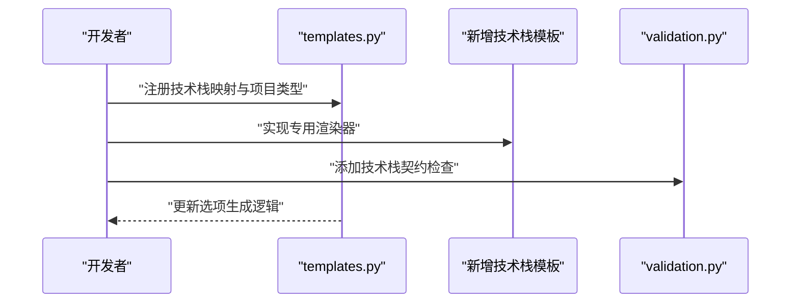

**图表来源**
- [templates.py:12-36](file://backend/deployment_package_factory/services/microservices/templates.py#L12-L36)
- [templates.py:41-53](file://backend/deployment_package_factory/services/microservices/templates.py#L41-L53)
- [validation.py:95-122](file://backend/deployment_package_factory/services/microservices/validation.py#L95-L122)

#### 新增平台支持
- 在平台配置中添加新平台条目，定义名称、命名空间组、镜像与依赖
- 在项目模板中引用该平台作为默认平台服务之一
- 确保中间件配置与平台能力匹配

**章节来源**
- [platform.yaml:1-66](file://templates/catalog/platform.yaml#L1-L66)
- [projects.yaml:1-54](file://templates/catalog/projects.yaml#L1-L54)

#### 新增中间件集成
- 在中间件插件定义中添加新中间件键与默认端点
- 在运行时解析中实现相应的端点生成与DSN构造
- 在模板渲染中注入中间件相关的配置文件与客户端代码
- 在验证器中添加占位符检查与契约验证

**章节来源**
- [middleware_plugins.py:27-68](file://backend/deployment_package_factory/services/microservices/middleware_plugins.py#L27-L68)
- [middleware_runtime.py:78-144](file://backend/deployment_package_factory/services/microservices/middleware_runtime.py#L78-L144)
- [templates.py:124-125](file://backend/deployment_package_factory/services/microservices/templates.py#L124-L125)
- [validation.py:85-93](file://backend/deployment_package_factory/services/microservices/validation.py#L85-L93)

### 模板开发示例

#### 目录结构设计原则
- 通用文件：放置所有技术栈共用的文件（Dockerfile、Jenkinsfile、部署脚本等）
- 特定文件：按技术栈组织专属文件（Python的src、Node.js的src、Java的src/main等）
- 配置文件：中间件配置示例与运行时环境模板
- 验证规则：确保生成物符合技术栈与中间件契约

#### 配置文件
- 中间件配置示例：提供YAML格式的中间件配置模板，包含端点与描述
- 运行时环境模板：生成.env.template文件，包含所有中间件的占位符

#### 初始化脚本与验证规则
- 初始化脚本：根据中间件类型生成相应的初始化脚本（数据库迁移、对象存储桶创建等）
- 验证规则：确保生成物包含所有必需文件、语法正确、模板完整且占位符齐全

**章节来源**
- [templates.py:124-125](file://backend/deployment_package_factory/services/microservices/templates.py#L124-L125)
- [validation.py:21-93](file://backend/deployment_package_factory/services/microservices/validation.py#L21-L93)

### 错误处理与调试方法
- 输入验证：使用Pydantic模型对请求参数进行严格校验，包括服务键、端口、命名空间等
- 生成过程：捕获渲染异常与文件写入错误，确保生成过程可恢复
- 验证失败：详细记录失败原因，区分缺失文件、语法错误、模板问题与归档问题
- 调试工具：提供端到端验证脚本，支持选择性案例、保留输出与本地构建检查

**章节来源**
- [scaffold.py:52-170](file://backend/deployment_package_factory/services/microservices/scaffold.py#L52-L170)
- [validate_microservice_scaffolds.py:102-130](file://scripts/validate_microservice_scaffolds.py#L102-L130)
- [validate_microservice_scaffolds.py:228-246](file://scripts/validate_microservice_scaffolds.py#L228-L246)

## 依赖分析
模板系统的核心依赖关系如下：
- 模板渲染依赖于中间件插件与运行时解析
- 技术栈模板依赖于通用模板与中间件系统
- 验证器依赖于生成物与中间件配置
- 结果元数据依赖于请求参数与生成物信息

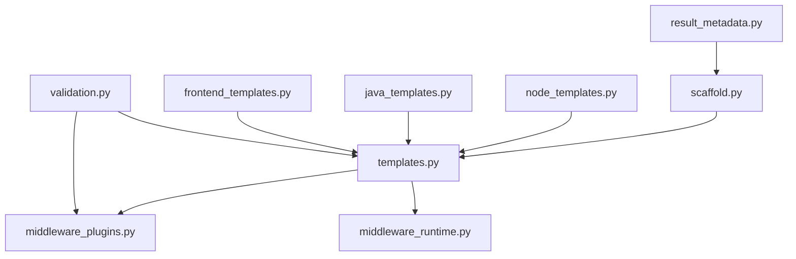

**图表来源**
- [templates.py:5-10](file://backend/deployment_package_factory/services/microservices/templates.py#L5-L10)
- [scaffold.py:26-35](file://backend/deployment_package_factory/services/microservices/scaffold.py#L26-L35)
- [validation.py:6-7](file://backend/deployment_package_factory/services/microservices/validation.py#L6-L7)

**章节来源**
- [templates.py:5-10](file://backend/deployment_package_factory/services/microservices/templates.py#L5-L10)
- [scaffold.py:26-35](file://backend/deployment_package_factory/services/microservices/scaffold.py#L26-L35)
- [validation.py:6-7](file://backend/deployment_package_factory/services/microservices/validation.py#L6-L7)

## 性能考虑
- 模板渲染：采用惰性生成与一次性写入，减少磁盘I/O
- 验证阶段：优先进行快速检查（文件存在性），再进行耗时检查（语法与模板）
- 并发控制：通过环境变量限制并发构建任务数量，避免资源争用
- 缓存策略：利用生成物的哈希值进行缓存命中判断，避免重复构建

## 故障排除指南
- 生成物验证失败：检查缺失文件列表与错误详情，确保所有必需文件存在且内容完整
- 中间件占位符缺失：确认中间件配置中包含必要的占位符，避免生产密钥泄露
- 技术栈契约不符：核对生成物是否满足技术栈的最小契约要求（如依赖、配置文件、路由等）
- 归档不可读：检查压缩包完整性与权限，确保生成物可正常下载与解压

**章节来源**
- [validation.py:21-144](file://backend/deployment_package_factory/services/microservices/validation.py#L21-L144)
- [validate_microservice_scaffolds.py:86-130](file://scripts/validate_microservice_scaffolds.py#L86-L130)

## 结论
微服务模板扩展系统通过清晰的分层架构与严格的验证机制，实现了多语言、多框架与中间件的灵活组合。开发者可通过遵循本文档的设计原则与实践指南，快速扩展新的技术栈模板、平台能力与中间件集成，确保生成物的一致性、安全性与可维护性。

## 附录
- 端到端验证：使用内置脚本对所有技术栈组合进行验证，支持选择性案例与本地构建检查
- 配置参考：平台能力、项目模板与中间件配置的完整参考
- 最佳实践：模板开发、错误处理与调试的实用建议

**章节来源**
- [validate_microservice_scaffolds.py:60-100](file://scripts/validate_microservice_scaffolds.py#L60-L100)
- [README.md:40-65](file://README.md#L40-L65)
- [platform.yaml:1-66](file://templates/catalog/platform.yaml#L1-L66)
- [projects.yaml:1-54](file://templates/catalog/projects.yaml#L1-L54)
- [middleware.yaml:1-283](file://templates/catalog/middleware.yaml#L1-L283)