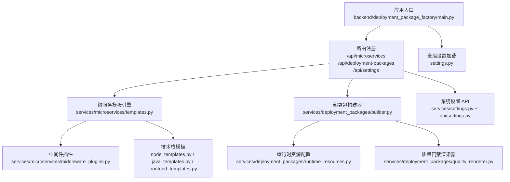
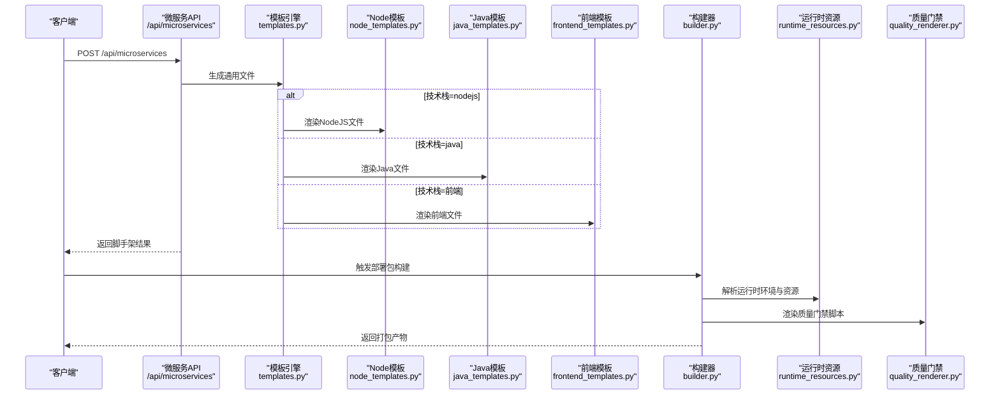
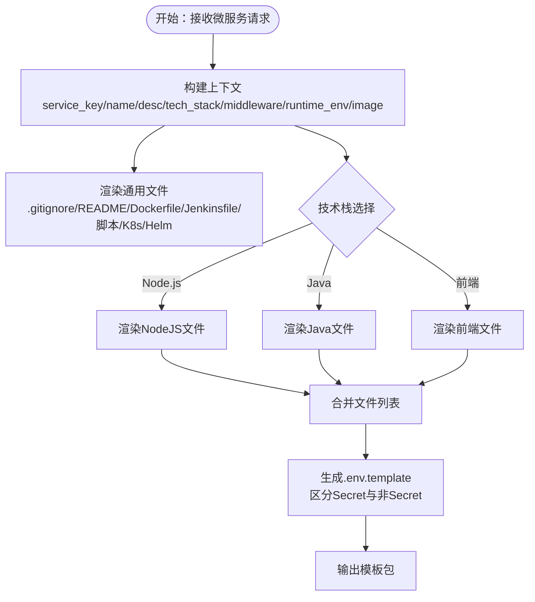
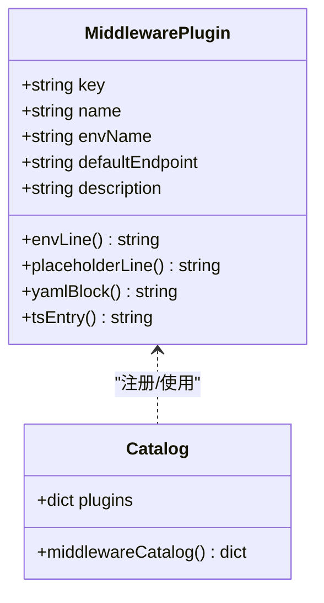
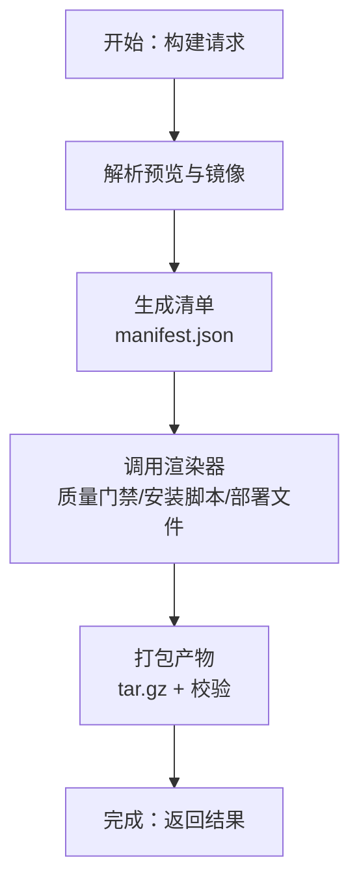
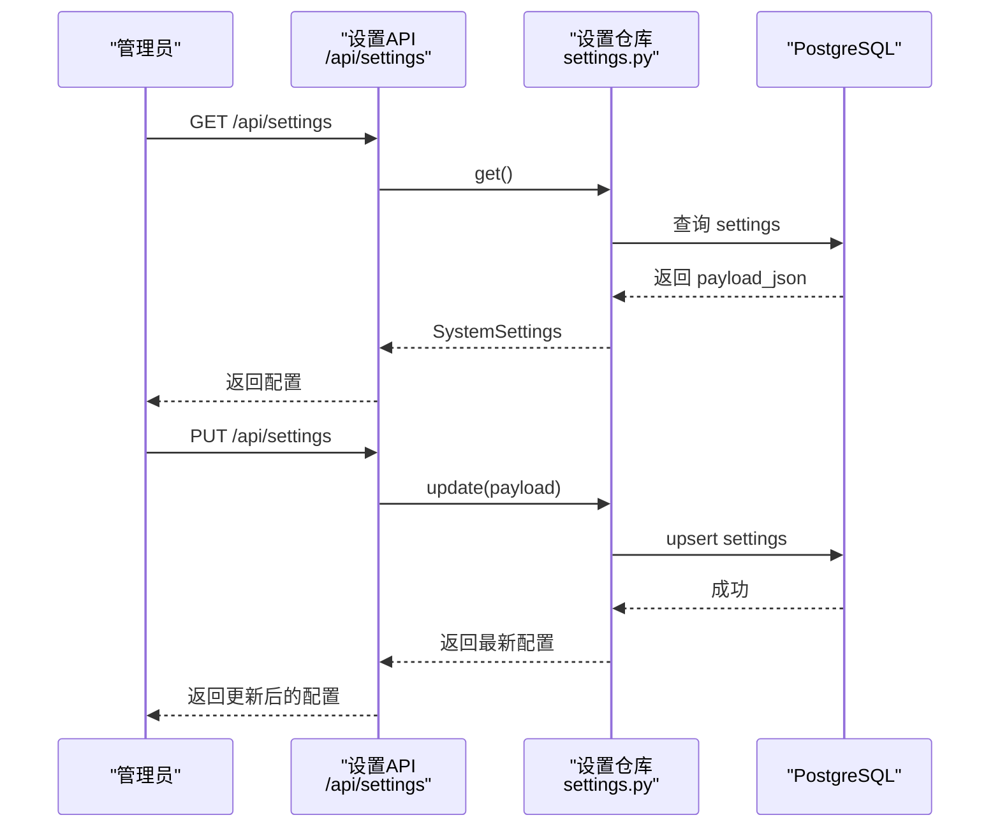
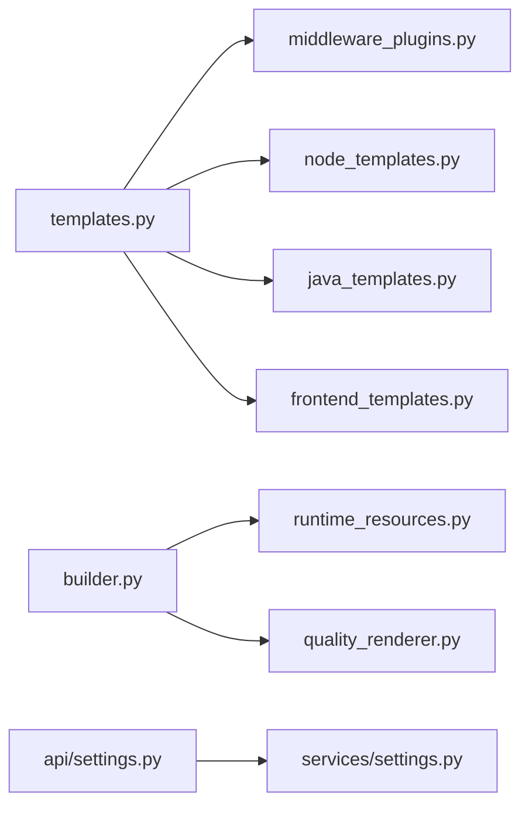

# 扩展开发

<cite>
**本文引用的文件**
- [backend/deployment_package_factory/main.py](file://backend/deployment_package_factory/main.py)
- [backend/deployment_package_factory/settings.py](file://backend/deployment_package_factory/settings.py)
- [backend/deployment_package_factory/api/microservices.py](file://backend/deployment_package_factory/api/microservices.py)
- [backend/deployment_package_factory/api/settings.py](file://backend/deployment_package_factory/api/settings.py)
- [backend/deployment_package_factory/services/microservices/templates.py](file://backend/deployment_package_factory/services/microservices/templates.py)
- [backend/deployment_package_factory/services/microservices/middleware_plugins.py](file://backend/deployment_package_factory/services/microservices/middleware_plugins.py)
- [backend/deployment_package_factory/services/microservices/node_templates.py](file://backend/deployment_package_factory/services/microservices/node_templates.py)
- [backend/deployment_package_factory/services/microservices/java_templates.py](file://backend/deployment_package_factory/services/microservices/java_templates.py)
- [backend/deployment_package_factory/services/microservices/frontend_templates.py](file://backend/deployment_package_factory/services/microservices/frontend_templates.py)
- [backend/deployment_package_factory/services/deployment_packages/models.py](file://backend/deployment_package_factory/services/deployment_packages/models.py)
- [backend/deployment_package_factory/services/deployment_packages/builder.py](file://backend/deployment_package_factory/services/deployment_packages/builder.py)
- [backend/deployment_package_factory/services/deployment_packages/runtime_resources.py](file://backend/deployment_package_factory/services/deployment_packages/runtime_resources.py)
- [backend/deployment_package_factory/services/deployment_packages/quality_renderer.py](file://backend/deployment_package_factory/services/deployment_packages/quality_renderer.py)
- [backend/deployment_package_factory/services/settings.py](file://backend/deployment_package_factory/services/settings.py)
- [templates/catalog/business.yaml](file://templates/catalog/business.yaml)
</cite>

## 目录
1. [简介](#简介)
2. [项目结构](#项目结构)
3. [核心组件](#核心组件)
4. [架构总览](#架构总览)
5. [详细组件分析](#详细组件分析)
6. [依赖分析](#依赖分析)
7. [性能考虑](#性能考虑)
8. [故障排查指南](#故障排查指南)
9. [结论](#结论)
10. [附录](#附录)

## 简介
本指南面向需要扩展“部署包工厂”的工程师，围绕以下目标提供系统化、可操作的扩展方法与最佳实践：
- 开发新的微服务模板：模板结构设计、变量定义、文件渲染与验证机制
- 中间件插件系统扩展：新增中间件支持、配置管理与集成测试
- 部署包构建器扩展点：新增部署模式、自定义渲染器与质量检查扩展
- 系统设置扩展：新增配置项、Excel 导入导出扩展与验证规则定制
- 第三方服务集成：API 扩展方法与配置文件扩展策略
- 提供完整扩展示例与测试验证方法

## 项目结构
后端采用 FastAPI 应用入口，路由按功能模块划分（微服务脚手架、部署包、系统设置等），核心逻辑分布在 services 子模块中；前端通过独立仓库构建并由后端提供静态资源与运行时配置。

图示来源
- [backend/deployment_package_factory/main.py:23-64](file://backend/deployment_package_factory/main.py#L23-L64)
- [backend/deployment_package_factory/api/microservices.py:29-33](file://backend/deployment_package_factory/api/microservices.py#L29-L33)
- [backend/deployment_package_factory/api/settings.py:17-21](file://backend/deployment_package_factory/api/settings.py#L17-L21)
- [backend/deployment_package_factory/services/microservices/templates.py:41-53](file://backend/deployment_package_factory/services/microservices/templates.py#L41-L53)
- [backend/deployment_package_factory/services/deployment_packages/builder.py:146-246](file://backend/deployment_package_factory/services/deployment_packages/builder.py#L146-L246)
- [backend/deployment_package_factory/services/deployment_packages/runtime_resources.py:25-52](file://backend/deployment_package_factory/services/deployment_packages/runtime_resources.py#L25-L52)
- [backend/deployment_package_factory/services/deployment_packages/quality_renderer.py:18-23](file://backend/deployment_package_factory/services/deployment_packages/quality_renderer.py#L18-L23)
- [backend/deployment_package_factory/services/settings.py:159-167](file://backend/deployment_package_factory/services/settings.py#L159-L167)
- [backend/deployment_package_factory/settings.py:26-41](file://backend/deployment_package_factory/settings.py#L26-L41)

章节来源
- [backend/deployment_package_factory/main.py:23-64](file://backend/deployment_package_factory/main.py#L23-L64)
- [backend/deployment_package_factory/settings.py:26-41](file://backend/deployment_package_factory/settings.py#L26-L41)

## 核心组件
- 应用入口与路由
  - 创建 FastAPI 实例，注册 CORS、健康检查、就绪检查与指标端点，并挂载各模块路由。
- 微服务模板引擎
  - 统一上下文生成与通用文件渲染，按技术栈分派到具体模板渲染器。
- 中间件插件系统
  - 插件元数据、默认值占位、YAML/TS 输出与所需环境变量解析。
- 部署包构建器
  - 包装配方解析、运行时镜像发现、清单生成、质量门禁与产物打包。
- 运行时资源配置
  - 基于探针与目录配置合并环境变量，生成资源组与覆盖项。
- 质量门禁渲染器
  - 渲染跨平台质量检查脚本与报告。
- 系统设置
  - Git/Jenkins/Harbor/K8s/Middleware 等配置模型与持久化存储。

章节来源
- [backend/deployment_package_factory/main.py:23-64](file://backend/deployment_package_factory/main.py#L23-L64)
- [backend/deployment_package_factory/services/microservices/templates.py:41-53](file://backend/deployment_package_factory/services/microservices/templates.py#L41-L53)
- [backend/deployment_package_factory/services/microservices/middleware_plugins.py:27-68](file://backend/deployment_package_factory/services/microservices/middleware_plugins.py#L27-L68)
- [backend/deployment_package_factory/services/deployment_packages/builder.py:146-246](file://backend/deployment_package_factory/services/deployment_packages/builder.py#L146-L246)
- [backend/deployment_package_factory/services/deployment_packages/runtime_resources.py:25-52](file://backend/deployment_package_factory/services/deployment_packages/runtime_resources.py#L25-L52)
- [backend/deployment_package_factory/services/deployment_packages/quality_renderer.py:18-23](file://backend/deployment_package_factory/services/deployment_packages/quality_renderer.py#L18-L23)
- [backend/deployment_package_factory/services/settings.py:159-167](file://backend/deployment_package_factory/services/settings.py#L159-L167)

## 架构总览
下图展示从请求到产物的关键流程：微服务脚手架生成模板文件，部署包构建器汇总镜像与配置，渲染质量门禁与安装脚本，最终打包输出。

图示来源
- [backend/deployment_package_factory/api/microservices.py:52-67](file://backend/deployment_package_factory/api/microservices.py#L52-L67)
- [backend/deployment_package_factory/services/microservices/templates.py:41-53](file://backend/deployment_package_factory/services/microservices/templates.py#L41-L53)
- [backend/deployment_package_factory/services/microservices/node_templates.py:9-23](file://backend/deployment_package_factory/services/microservices/node_templates.py#L9-L23)
- [backend/deployment_package_factory/services/microservices/java_templates.py:8-16](file://backend/deployment_package_factory/services/microservices/java_templates.py#L8-L16)
- [backend/deployment_package_factory/services/microservices/frontend_templates.py:8-21](file://backend/deployment_package_factory/services/microservices/frontend_templates.py#L8-L21)
- [backend/deployment_package_factory/services/deployment_packages/builder.py:146-246](file://backend/deployment_package_factory/services/deployment_packages/builder.py#L146-L246)
- [backend/deployment_package_factory/services/deployment_packages/runtime_resources.py:25-52](file://backend/deployment_package_factory/services/deployment_packages/runtime_resources.py#L25-L52)
- [backend/deployment_package_factory/services/deployment_packages/quality_renderer.py:18-23](file://backend/deployment_package_factory/services/deployment_packages/quality_renderer.py#L18-L23)

## 详细组件分析

### 微服务模板系统扩展
- 模板结构设计
  - 通用文件集合：.gitignore、README、Dockerfile、Jenkinsfile、构建/部署脚本、K8s/Helm 清单等。
  - 技术栈特化：Node.js、Java、前端分别提供各自源码与配置文件。
  - 中间件注入：根据选中的中间件生成 .env.template、K8s ConfigMap/Secret 与 Helm values。
- 变量定义与上下文
  - 上下文包含服务键、名称、描述、技术栈、中间件列表、运行时环境、命名空间、镜像信息等。
  - 运行时环境由中间件配置与探针合并生成，确保敏感信息分离至 Secret。
- 文件渲染与验证
  - 每个技术栈模板返回一组 TemplateFile，包含路径、内容与可执行标志。
  - 渲染前进行参数校验（如不支持的技术栈抛出异常）。
- 新增技术栈模板步骤
  - 在 templates.py 中扩展 render_generic_template 分支与 required_files 列表。
  - 在对应技术栈模块中实现渲染函数与必需文件清单。
  - 在中间件插件侧补充运行时环境映射与占位符。
- 集成测试建议
  - 使用单元测试对渲染函数输出进行断言（文件路径、关键片段存在性）。
  - 使用集成测试模拟真实请求，生成临时项目并校验产物完整性。

图示来源
- [backend/deployment_package_factory/services/microservices/templates.py:78-101](file://backend/deployment_package_factory/services/microservices/templates.py#L78-L101)
- [backend/deployment_package_factory/services/microservices/templates.py:104-125](file://backend/deployment_package_factory/services/microservices/templates.py#L104-L125)
- [backend/deployment_package_factory/services/microservices/node_templates.py:9-23](file://backend/deployment_package_factory/services/microservices/node_templates.py#L9-L23)
- [backend/deployment_package_factory/services/microservices/java_templates.py:8-16](file://backend/deployment_package_factory/services/microservices/java_templates.py#L8-L16)
- [backend/deployment_package_factory/services/microservices/frontend_templates.py:8-21](file://backend/deployment_package_factory/services/microservices/frontend_templates.py#L8-L21)

章节来源
- [backend/deployment_package_factory/services/microservices/templates.py:41-53](file://backend/deployment_package_factory/services/microservices/templates.py#L41-L53)
- [backend/deployment_package_factory/services/microservices/templates.py:78-101](file://backend/deployment_package_factory/services/microservices/templates.py#L78-L101)
- [backend/deployment_package_factory/services/microservices/templates.py:104-125](file://backend/deployment_package_factory/services/microservices/templates.py#L104-L125)
- [backend/deployment_package_factory/services/microservices/node_templates.py:9-23](file://backend/deployment_package_factory/services/microservices/node_templates.py#L9-L23)
- [backend/deployment_package_factory/services/microservices/java_templates.py:8-16](file://backend/deployment_package_factory/services/microservices/java_templates.py#L8-L16)
- [backend/deployment_package_factory/services/microservices/frontend_templates.py:8-21](file://backend/deployment_package_factory/services/microservices/frontend_templates.py#L8-L21)

### 中间件插件系统扩展
- 插件定义与目录
  - 插件类包含键、名称、环境变量名、默认端点与描述，提供占位符、默认值与 YAML/TS 片段生成。
  - 插件目录用于 UI 展示与模板渲染时的键值映射。
- 配置管理
  - 通过中间件配置键收集所需环境变量名，结合源环境与系统设置解析最终值。
  - 支持占位符与默认值注入，敏感信息写入 Secret。
- 新增中间件步骤
  - 在插件字典中新增条目，完善默认端点与描述。
  - 在模板侧调用插件生成 .env.template、K8s ConfigMap/Secret 与 Helm values。
  - 在系统设置中为该中间件提供默认端点配置项。
- 集成测试建议
  - 测试插件占位符与默认值生成是否符合预期。
  - 测试中间件配置解析在不同源环境下的行为。

图示来源
- [backend/deployment_package_factory/services/microservices/middleware_plugins.py:6-25](file://backend/deployment_package_factory/services/microservices/middleware_plugins.py#L6-L25)
- [backend/deployment_package_factory/services/microservices/middleware_plugins.py:39-40](file://backend/deployment_package_factory/services/microservices/middleware_plugins.py#L39-L40)
- [backend/deployment_package_factory/services/microservices/middleware_plugins.py:55-58](file://backend/deployment_package_factory/services/microservices/middleware_plugins.py#L55-L58)

章节来源
- [backend/deployment_package_factory/services/microservices/middleware_plugins.py:27-68](file://backend/deployment_package_factory/services/microservices/middleware_plugins.py#L27-L68)
- [backend/deployment_package_factory/services/microservices/templates.py:80-101](file://backend/deployment_package_factory/services/microservices/templates.py#L80-L101)

### 部署包构建器扩展点
- 新增部署模式
  - 在部署模式枚举与质量门禁检查中增加新模式标识，确保渲染器按模式启用相应脚本。
- 自定义渲染器开发
  - 新增渲染器模块，遵循 RenderedQualityFile 结构，返回路径、内容与可执行标志。
  - 在构建主流程中调用新渲染器并写入产物目录。
- 质量检查扩展
  - 在质量门禁清单中加入新检查项，编写跨平台脚本并在报告中记录结果。
- 运行时资源扩展
  - 在运行时资源配置中新增资源探测或默认策略，确保敏感信息正确分流至 Secret。

图示来源
- [backend/deployment_package_factory/services/deployment_packages/builder.py:146-246](file://backend/deployment_package_factory/services/deployment_packages/builder.py#L146-L246)
- [backend/deployment_package_factory/services/deployment_packages/quality_renderer.py:18-23](file://backend/deployment_package_factory/services/deployment_packages/quality_renderer.py#L18-L23)
- [backend/deployment_package_factory/services/deployment_packages/runtime_resources.py:25-52](file://backend/deployment_package_factory/services/deployment_packages/runtime_resources.py#L25-L52)

章节来源
- [backend/deployment_package_factory/services/deployment_packages/builder.py:146-246](file://backend/deployment_package_factory/services/deployment_packages/builder.py#L146-L246)
- [backend/deployment_package_factory/services/deployment_packages/quality_renderer.py:18-23](file://backend/deployment_package_factory/services/deployment_packages/quality_renderer.py#L18-L23)
- [backend/deployment_package_factory/services/deployment_packages/runtime_resources.py:25-52](file://backend/deployment_package_factory/services/deployment_packages/runtime_resources.py#L25-L52)

### 系统设置扩展方法
- 新增配置项
  - 在 SystemSettings 模型中添加字段，定义校验器（如字符串裁剪、正则校验、端口范围）。
  - 在持久化仓库中处理序列化/反序列化与数据库 schema 初始化。
- Excel 导入导出扩展
  - 通过导入接口接收二进制 Excel，解析并合并到当前设置，返回导入字段与告警。
- 验证规则定制
  - 使用 Pydantic 字段校验器统一约束输入，保证配置合法性与一致性。
- API 扩展策略
  - 在 /api/settings 下提供 GET/PUT 接口；新增导入接口以支持批量环境配置迁移。

图示来源
- [backend/deployment_package_factory/api/settings.py:42-49](file://backend/deployment_package_factory/api/settings.py#L42-L49)
- [backend/deployment_package_factory/services/settings.py:170-199](file://backend/deployment_package_factory/services/settings.py#L170-L199)

章节来源
- [backend/deployment_package_factory/services/settings.py:159-167](file://backend/deployment_package_factory/services/settings.py#L159-L167)
- [backend/deployment_package_factory/services/settings.py:170-199](file://backend/deployment_package_factory/services/settings.py#L170-L199)
- [backend/deployment_package_factory/api/settings.py:52-68](file://backend/deployment_package_factory/api/settings.py#L52-L68)

### 第三方服务集成指南
- API 扩展方法
  - 在现有路由基础上新增子模块与依赖鉴权，复用已有的认证与响应模型。
- 配置文件扩展策略
  - 将外部服务的连接参数纳入系统设置模型，通过校验器保证格式与范围。
  - 在中间件插件侧提供默认端点与占位符，便于模板渲染时注入。

章节来源
- [backend/deployment_package_factory/api/microservices.py:29-33](file://backend/deployment_package_factory/api/microservices.py#L29-L33)
- [backend/deployment_package_factory/services/settings.py:148-157](file://backend/deployment_package_factory/services/settings.py#L148-L157)

## 依赖分析
- 组件耦合
  - 模板引擎依赖中间件插件与技术栈模板；构建器依赖运行时资源与质量门禁；设置模块贯穿系统配置与持久化。
- 外部依赖
  - Kubernetes 访问令牌、Docker/Skopeo 工具、PostgreSQL 存储等。
- 潜在循环依赖
  - 当前模块间为单向依赖，未见循环。

图示来源
- [backend/deployment_package_factory/services/microservices/templates.py:5-10](file://backend/deployment_package_factory/services/microservices/templates.py#L5-L10)
- [backend/deployment_package_factory/services/deployment_packages/builder.py:21-57](file://backend/deployment_package_factory/services/deployment_packages/builder.py#L21-L57)
- [backend/deployment_package_factory/api/settings.py:11-15](file://backend/deployment_package_factory/api/settings.py#L11-L15)

章节来源
- [backend/deployment_package_factory/services/microservices/templates.py:5-10](file://backend/deployment_package_factory/services/microservices/templates.py#L5-L10)
- [backend/deployment_package_factory/services/deployment_packages/builder.py:21-57](file://backend/deployment_package_factory/services/deployment_packages/builder.py#L21-L57)
- [backend/deployment_package_factory/api/settings.py:11-15](file://backend/deployment_package_factory/api/settings.py#L11-L15)

## 性能考虑
- 并行与并发
  - 构建器在镜像导出与打包阶段应避免阻塞，必要时引入异步任务与心跳上报。
- 资源占用
  - 控制并发构建数量与保留策略，避免磁盘与内存压力过大。
- 渲染效率
  - 对大文件采用流式写入与增量计算，减少重复 I/O。

## 故障排查指南
- 健康与就绪检查
  - 通过 /health 与 /health/ready 获取服务状态与依赖可用性。
- 日志与错误
  - 构建器内部捕获工具不可用与权限问题，返回明确提示。
- 设置校验失败
  - 系统设置校验器会在字段不符合规范时抛出异常，需检查输入格式与范围。

章节来源
- [backend/deployment_package_factory/main.py:41-55](file://backend/deployment_package_factory/main.py#L41-L55)
- [backend/deployment_package_factory/services/deployment_packages/builder.py:105-143](file://backend/deployment_package_factory/services/deployment_packages/builder.py#L105-L143)
- [backend/deployment_package_factory/services/settings.py:25-46](file://backend/deployment_package_factory/services/settings.py#L25-L46)

## 结论
通过以上扩展点与最佳实践，开发者可以安全地为部署包工厂添加新的微服务模板、中间件、部署模式与系统配置，同时保持代码清晰、测试完备与运维可观测。

## 附录
- 配置项示例与校验
  - Git/GitLab/GitHub 提供商、组名与路径段校验
  - Harbor 注册表与项目路径校验
  - Jenkins 基础地址与凭据字段校验
  - Kubernetes 集群与命名空间配置
  - 中间件端点的主机、端口与数据库字段校验
- 模板与清单示例
  - 业务域能力清单示例，展示依赖关系与中间件声明

章节来源
- [backend/deployment_package_factory/services/settings.py:15-47](file://backend/deployment_package_factory/services/settings.py#L15-L47)
- [backend/deployment_package_factory/services/settings.py:49-80](file://backend/deployment_package_factory/services/settings.py#L49-L80)
- [backend/deployment_package_factory/services/settings.py:82-105](file://backend/deployment_package_factory/services/settings.py#L82-L105)
- [backend/deployment_package_factory/services/settings.py:107-121](file://backend/deployment_package_factory/services/settings.py#L107-L121)
- [backend/deployment_package_factory/services/settings.py:123-146](file://backend/deployment_package_factory/services/settings.py#L123-L146)
- [backend/deployment_package_factory/services/settings.py:148-157](file://backend/deployment_package_factory/services/settings.py#L148-L157)
- [templates/catalog/business.yaml:1-60](file://templates/catalog/business.yaml#L1-L60)