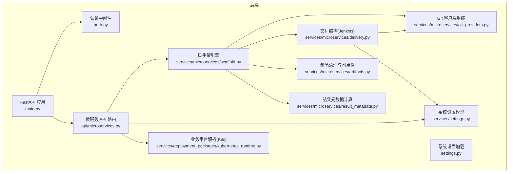
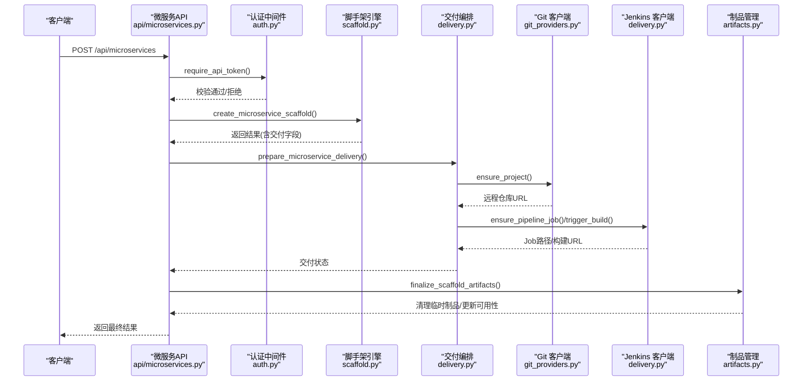
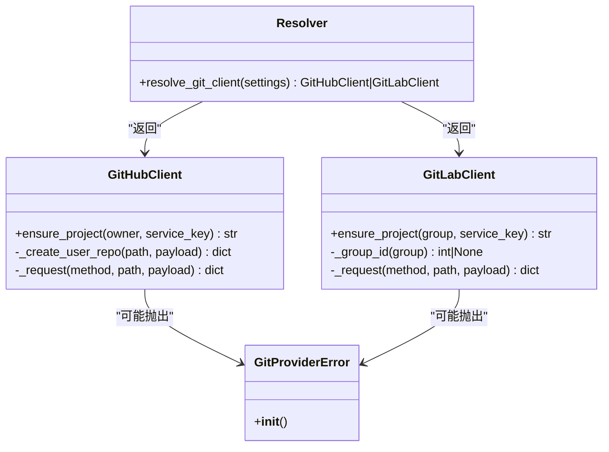
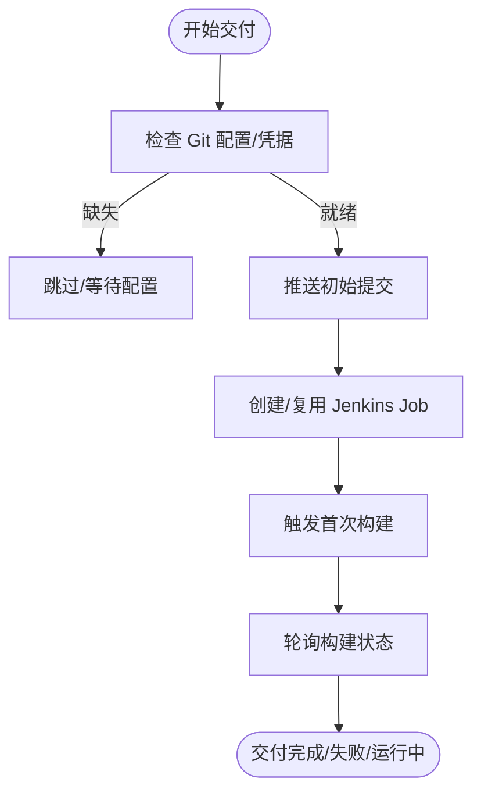
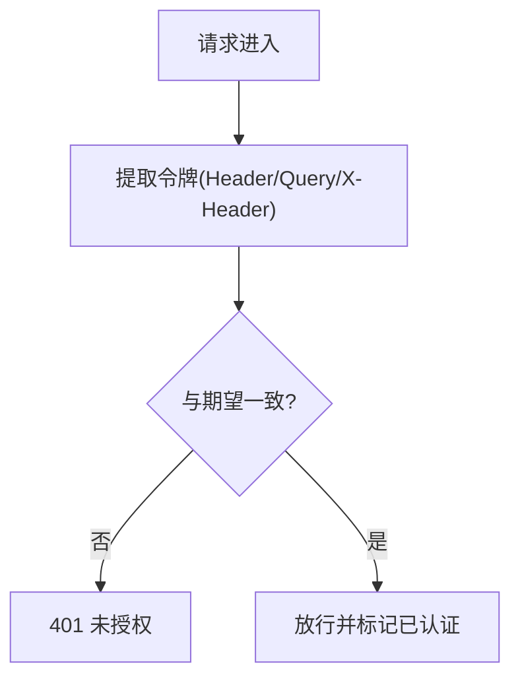
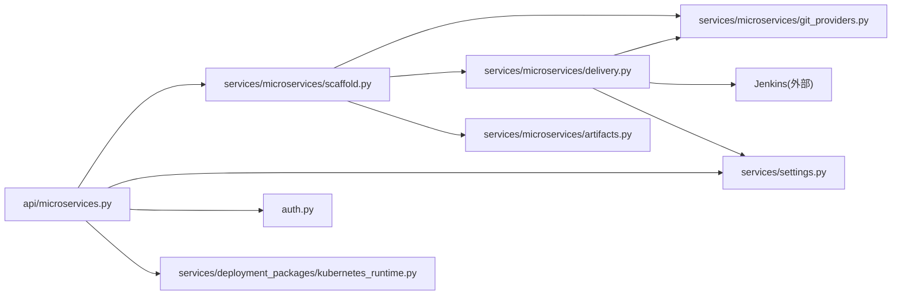

# 第三方服务集成

<cite>
**本文档引用的文件**
- [backend/deployment_package_factory/services/microservices/git_providers.py](file://backend/deployment_package_factory/services/microservices/git_providers.py)
- [backend/deployment_package_factory/services/microservices/delivery.py](file://backend/deployment_package_factory/services/microservices/delivery.py)
- [backend/deployment_package_factory/services/microservices/scaffold.py](file://backend/deployment_package_factory/services/microservices/scaffold.py)
- [backend/deployment_package_factory/services/microservices/artifacts.py](file://backend/deployment_package_factory/services/microservices/artifacts.py)
- [backend/deployment_package_factory/services/microservices/result_metadata.py](file://backend/deployment_package_factory/services/microservices/result_metadata.py)
- [backend/deployment_package_factory/api/microservices.py](file://backend/deployment_package_factory/api/microservices.py)
- [backend/deployment_package_factory/auth.py](file://backend/deployment_package_factory/auth.py)
- [backend/deployment_package_factory/settings.py](file://backend/deployment_package_factory/settings.py)
- [backend/deployment_package_factory/main.py](file://backend/deployment_package_factory/main.py)
- [backend/deployment_package_factory/services/settings.py](file://backend/deployment_package_factory/services/settings.py)
- [backend/deployment_package_factory/services/deployment_packages/kubernetes_runtime.py](file://backend/deployment_package_factory/services/deployment_packages/kubernetes_runtime.py)
</cite>

## 目录
1. [简介](#简介)
2. [项目结构](#项目结构)
3. [核心组件](#核心组件)
4. [架构总览](#架构总览)
5. [详细组件分析](#详细组件分析)
6. [依赖分析](#依赖分析)
7. [性能考虑](#性能考虑)
8. [故障排查指南](#故障排查指南)
9. [结论](#结论)
10. [附录](#附录)

## 简介
本指南面向需要在“部署包工厂”中集成第三方服务的开发者，覆盖以下目标：
- 如何集成新的外部服务：Git 提供商（GitHub、GitLab）、镜像仓库、CI/CD 系统（Jenkins）与云服务（Kubernetes）。
- 认证机制：当前使用 API Token；如何扩展以支持 OAuth、JWT 与企业级认证。
- API 调用封装与配置管理：统一的客户端封装、环境变量驱动的配置加载。
- 完整集成示例：配置文件、API 客户端与错误处理。

## 项目结构
后端采用 FastAPI 应用，核心模块围绕“微服务脚手架”展开，包含 Git 供应商、交付流程（含 Jenkins）、制品管理与认证等子系统。前端通过 API 路由访问后端能力。

图表来源
- [backend/deployment_package_factory/main.py:23-64](file://backend/deployment_package_factory/main.py#L23-L64)
- [backend/deployment_package_factory/api/microservices.py:29-33](file://backend/deployment_package_factory/api/microservices.py#L29-L33)
- [backend/deployment_package_factory/services/microservices/scaffold.py:228-285](file://backend/deployment_package_factory/services/microservices/scaffold.py#L228-L285)
- [backend/deployment_package_factory/services/microservices/git_providers.py:84-88](file://backend/deployment_package_factory/services/microservices/git_providers.py#L84-L88)
- [backend/deployment_package_factory/services/microservices/delivery.py:17-26](file://backend/deployment_package_factory/services/microservices/delivery.py#L17-L26)
- [backend/deployment_package_factory/services/microservices/artifacts.py:14-19](file://backend/deployment_package_factory/services/microservices/artifacts.py#L14-L19)
- [backend/deployment_package_factory/services/microservices/result_metadata.py:4-27](file://backend/deployment_package_factory/services/microservices/result_metadata.py#L4-L27)
- [backend/deployment_package_factory/services/settings.py:48-82](file://backend/deployment_package_factory/services/settings.py#L48-L82)
- [backend/deployment_package_factory/services/deployment_packages/kubernetes_runtime.py:77-95](file://backend/deployment_package_factory/services/deployment_packages/kubernetes_runtime.py#L77-L95)

章节来源
- [backend/deployment_package_factory/main.py:23-64](file://backend/deployment_package_factory/main.py#L23-L64)
- [backend/deployment_package_factory/api/microservices.py:29-33](file://backend/deployment_package_factory/api/microservices.py#L29-L33)

## 核心组件
- 认证与令牌校验：require_api_token 支持 Header、查询参数与 X-Header 三种方式，对下载类接口允许通过查询参数传递令牌。
- 系统设置加载：从环境变量读取数据库、输出目录、并发数、保留策略等；支持执行模式与心跳间隔等。
- 微服务脚手架：根据请求生成项目骨架、制品归档、校验与元信息计算。
- Git 客户端封装：统一 GitHub/GitLab 客户端，自动解析提供商类型，封装项目创建与请求。
- 交付编排：按步骤准备 Git 项目与 Jenkins Job，支持状态刷新与重试。
- 制品管理：根据交付状态决定是否清理临时制品，维护可下载性与克隆命令。
- 结果元数据：计算镜像引用、Git 仓库 URL、Jenkins Job URL、构建/部署命令等。

章节来源
- [backend/deployment_package_factory/auth.py:10-27](file://backend/deployment_package_factory/auth.py#L10-L27)
- [backend/deployment_package_factory/settings.py:26-41](file://backend/deployment_package_factory/settings.py#L26-L41)
- [backend/deployment_package_factory/services/microservices/scaffold.py:228-285](file://backend/deployment_package_factory/services/microservices/scaffold.py#L228-L285)
- [backend/deployment_package_factory/services/microservices/git_providers.py:84-88](file://backend/deployment_package_factory/services/microservices/git_providers.py#L84-L88)
- [backend/deployment_package_factory/services/microservices/delivery.py:17-26](file://backend/deployment_package_factory/services/microservices/delivery.py#L17-L26)
- [backend/deployment_package_factory/services/microservices/artifacts.py:14-19](file://backend/deployment_package_factory/services/microservices/artifacts.py#L14-L19)
- [backend/deployment_package_factory/services/microservices/result_metadata.py:4-27](file://backend/deployment_package_factory/services/microservices/result_metadata.py#L4-L27)

## 架构总览
下图展示从 API 请求到交付完成的关键交互路径，包括认证、脚手架生成、Git 与 Jenkins 交付以及制品清理。

图表来源
- [backend/deployment_package_factory/api/microservices.py:52-67](file://backend/deployment_package_factory/api/microservices.py#L52-L67)
- [backend/deployment_package_factory/auth.py:10-27](file://backend/deployment_package_factory/auth.py#L10-L27)
- [backend/deployment_package_factory/services/microservices/scaffold.py:228-285](file://backend/deployment_package_factory/services/microservices/scaffold.py#L228-L285)
- [backend/deployment_package_factory/services/microservices/delivery.py:17-26](file://backend/deployment_package_factory/services/microservices/delivery.py#L17-L26)
- [backend/deployment_package_factory/services/microservices/git_providers.py:13-41](file://backend/deployment_package_factory/services/microservices/git_providers.py#L13-L41)
- [backend/deployment_package_factory/services/microservices/artifacts.py:14-19](file://backend/deployment_package_factory/services/microservices/artifacts.py#L14-L19)

## 详细组件分析

### Git 提供商集成（GitHub、GitLab）
- 统一入口：resolve_git_client 根据配置自动识别 GitHub 或 GitLab，并返回对应客户端。
- GitHub 客户端：支持组织与用户仓库创建，自动回退到已存在仓库；使用 Bearer Token。
- GitLab 客户端：支持组 ID 解析与项目创建；使用 PRIVATE-TOKEN。
- 错误处理：统一抛出 GitProviderError，便于上层捕获与提示。

图表来源
- [backend/deployment_package_factory/services/microservices/git_providers.py:9-119](file://backend/deployment_package_factory/services/microservices/git_providers.py#L9-L119)

章节来源
- [backend/deployment_package_factory/services/microservices/git_providers.py:84-88](file://backend/deployment_package_factory/services/microservices/git_providers.py#L84-L88)
- [backend/deployment_package_factory/services/microservices/git_providers.py:13-41](file://backend/deployment_package_factory/services/microservices/git_providers.py#L13-L41)
- [backend/deployment_package_factory/services/microservices/git_providers.py:43-81](file://backend/deployment_package_factory/services/microservices/git_providers.py#L43-L81)

### 交付编排（Jenkins）
- 步骤化交付：先确保 Git 项目，再创建/触发 Jenkins Job，最后汇总整体状态。
- Jenkins 客户端：支持创建流水线 Job（基于 XML）、触发构建、读取构建状态。
- 状态刷新：根据 Jenkins 构建状态动态更新交付状态（running/success/failed）。

图表来源
- [backend/deployment_package_factory/services/microservices/delivery.py:41-81](file://backend/deployment_package_factory/services/microservices/delivery.py#L41-L81)
- [backend/deployment_package_factory/services/microservices/delivery.py:93-134](file://backend/deployment_package_factory/services/microservices/delivery.py#L93-L134)

章节来源
- [backend/deployment_package_factory/services/microservices/delivery.py:17-26](file://backend/deployment_package_factory/services/microservices/delivery.py#L17-L26)
- [backend/deployment_package_factory/services/microservices/delivery.py:61-81](file://backend/deployment_package_factory/services/microservices/delivery.py#L61-L81)
- [backend/deployment_package_factory/services/microservices/delivery.py:115-134](file://backend/deployment_package_factory/services/microservices/delivery.py#L115-L134)

### 制品管理与清理
- 根据交付状态决定是否清理工作区与制品文件，避免磁盘占用。
- 更新 artifactAvailable 与 cloneCommand，便于前端/CLI 使用。

章节来源
- [backend/deployment_package_factory/services/microservices/artifacts.py:14-19](file://backend/deployment_package_factory/services/microservices/artifacts.py#L14-L19)
- [backend/deployment_package_factory/services/microservices/artifacts.py:22-29](file://backend/deployment_package_factory/services/microservices/artifacts.py#L22-L29)
- [backend/deployment_package_factory/services/microservices/artifacts.py:32-44](file://backend/deployment_package_factory/services/microservices/artifacts.py#L32-L44)

### 结果元数据与命令生成
- 计算镜像引用、Git 仓库 URL、Jenkins Job URL、构建/部署命令等，贯穿交付链路。

章节来源
- [backend/deployment_package_factory/services/microservices/result_metadata.py:4-27](file://backend/deployment_package_factory/services/microservices/result_metadata.py#L4-L27)

### 认证与配置管理
- 认证：require_api_token 支持多种令牌传递方式，下载接口允许查询参数。
- 配置：load_settings 从环境变量加载数据库、输出目录、并发、保留策略等；系统设置（Harbor/Jenkins）由 SystemSettings 统一校验与解析。

图表来源
- [backend/deployment_package_factory/auth.py:10-27](file://backend/deployment_package_factory/auth.py#L10-L27)

章节来源
- [backend/deployment_package_factory/auth.py:10-27](file://backend/deployment_package_factory/auth.py#L10-L27)
- [backend/deployment_package_factory/settings.py:26-41](file://backend/deployment_package_factory/settings.py#L26-L41)
- [backend/deployment_package_factory/services/settings.py:48-82](file://backend/deployment_package_factory/services/settings.py#L48-L82)

## 依赖分析
- 模块内聚：Git 客户端、交付编排、制品管理职责清晰，耦合度低。
- 外部依赖：urllib、subprocess、psycopg 等；错误通过自定义异常向上抛出。
- 配置驱动：所有外部系统（Git、Jenkins、Harbor）均通过系统设置与环境变量控制。

图表来源
- [backend/deployment_package_factory/api/microservices.py:19-28](file://backend/deployment_package_factory/api/microservices.py#L19-L28)
- [backend/deployment_package_factory/services/microservices/scaffold.py:228-285](file://backend/deployment_package_factory/services/microservices/scaffold.py#L228-L285)
- [backend/deployment_package_factory/services/microservices/git_providers.py:84-88](file://backend/deployment_package_factory/services/microservices/git_providers.py#L84-L88)
- [backend/deployment_package_factory/services/microservices/delivery.py:17-26](file://backend/deployment_package_factory/services/microservices/delivery.py#L17-L26)
- [backend/deployment_package_factory/services/microservices/artifacts.py:14-19](file://backend/deployment_package_factory/services/microservices/artifacts.py#L14-L19)
- [backend/deployment_package_factory/services/settings.py:48-82](file://backend/deployment_package_factory/services/settings.py#L48-L82)
- [backend/deployment_package_factory/services/deployment_packages/kubernetes_runtime.py:77-95](file://backend/deployment_package_factory/services/deployment_packages/kubernetes_runtime.py#L77-L95)

## 性能考虑
- 并发与超时：Git/Lab 请求与 Jenkins API 请求均设置超时；建议在高并发场景下限制最大并发与重试次数。
- 本地操作：Git 推送依赖本地 git 命令，建议在容器或受控环境中运行，避免权限问题。
- 磁盘清理：交付完成后及时清理工作区与制品，防止磁盘膨胀。

## 故障排查指南
- 认证失败
  - 确认 DEPLOYMENT_PACKAGE_API_TOKEN 已设置且与请求头一致。
  - 下载接口可使用查询参数 deployment_package_token。
- Git 项目创建失败
  - 检查 git.base_url 与 git.token 是否正确；GitHub/GitLab 类型识别逻辑会根据 provider/base_url 自动选择。
  - 若 409/422 等特定错误码，客户端会尝试回退到查询已存在项目。
- Jenkins 交付失败
  - 检查 jenkins.base_url、username、password 是否配置。
  - 确认 Jenkins 文件夹权限与 Git 插件可用。
  - 可通过“重试交付”或“刷新状态”接口定位问题。
- 制品不可用
  - 若 Git 项目未就绪，将保留临时制品以便调试；就绪后会清理并更新 artifactAvailable 与 cloneCommand。

章节来源
- [backend/deployment_package_factory/auth.py:17-27](file://backend/deployment_package_factory/auth.py#L17-L27)
- [backend/deployment_package_factory/services/microservices/git_providers.py:23-29](file://backend/deployment_package_factory/services/microservices/git_providers.py#L23-L29)
- [backend/deployment_package_factory/services/microservices/delivery.py:61-81](file://backend/deployment_package_factory/services/microservices/delivery.py#L61-L81)
- [backend/deployment_package_factory/services/microservices/delivery.py:29-38](file://backend/deployment_package_factory/services/microservices/delivery.py#L29-L38)
- [backend/deployment_package_factory/services/microservices/artifacts.py:14-19](file://backend/deployment_package_factory/services/microservices/artifacts.py#L14-L19)

## 结论
该系统通过“配置驱动 + 统一封装”的方式，实现了对 Git、Jenkins、镜像仓库与 Kubernetes 的可插拔集成。认证与交付流程清晰，具备良好的扩展性与可观测性。后续如需新增服务，建议遵循现有封装模式与错误处理规范，确保一致性与稳定性。

## 附录

### 扩展指南：新增 Git 提供商
- 新增客户端类：参考 GitHubClient/GitLabClient 的结构，实现 ensure_project 与内部 _request。
- 注册解析器：在 resolve_git_client 中增加类型判断与返回实例。
- 错误处理：统一抛出 GitProviderError，便于上层捕获。
- 测试：编写单元测试覆盖项目创建、回退查询与异常分支。

章节来源
- [backend/deployment_package_factory/services/microservices/git_providers.py:84-97](file://backend/deployment_package_factory/services/microservices/git_providers.py#L84-L97)
- [backend/deployment_package_factory/services/microservices/git_providers.py:13-41](file://backend/deployment_package_factory/services/microservices/git_providers.py#L13-L41)
- [backend/deployment_package_factory/services/microservices/git_providers.py:43-81](file://backend/deployment_package_factory/services/microservices/git_providers.py#L43-L81)

### 扩展指南：新增 CI/CD 系统
- 新增客户端类：仿照 JenkinsClient，实现 ensure_pipeline_job/trigger_build/read_build_status。
- 在交付流程中接入：在 prepare_microservice_delivery 中新增步骤并合并状态。
- 配置项：在 SystemSettings 中新增对应字段并添加校验。
- 错误处理：抛出 DeliveryError，保持与现有异常体系一致。

章节来源
- [backend/deployment_package_factory/services/microservices/delivery.py:93-134](file://backend/deployment_package_factory/services/microservices/delivery.py#L93-L134)
- [backend/deployment_package_factory/services/microservices/delivery.py:17-26](file://backend/deployment_package_factory/services/microservices/delivery.py#L17-L26)
- [backend/deployment_package_factory/services/settings.py:81-120](file://backend/deployment_package_factory/services/settings.py#L81-L120)

### 扩展指南：新增镜像仓库
- 在 SystemSettings 中新增仓库配置（registry/project/凭证），并添加校验。
- 在脚手架与结果元数据中使用新配置生成镜像引用与部署命令。
- 在制品上传/推送环节替换为新仓库客户端。

章节来源
- [backend/deployment_package_factory/services/settings.py:48-82](file://backend/deployment_package_factory/services/settings.py#L48-L82)
- [backend/deployment_package_factory/services/microservices/result_metadata.py:4-5](file://backend/deployment_package_factory/services/microservices/result_metadata.py#L4-L5)

### 扩展指南：新增云服务（Kubernetes）
- 业务平台命名空间解析：参考 kubernetes_runtime 的命名规则与列表逻辑。
- 凭据与 RBAC：确保 ServiceAccount 与 Secret 配置正确，必要时在交付流程中注入 kubeconfig。

章节来源
- [backend/deployment_package_factory/services/deployment_packages/kubernetes_runtime.py:71-95](file://backend/deployment_package_factory/services/deployment_packages/kubernetes_runtime.py#L71-L95)

### 认证扩展：OAuth/JWT/企业级认证
- 当前认证：require_api_token 支持 Bearer Token 与查询参数；下载接口允许 query token。
- 扩展思路：
  - 新增认证处理器：在 auth.py 中新增 require_oauth/require_jwt 等函数。
  - 适配企业认证：在中间件中对接 SSO/OIDC/JWT 解析与缓存。
  - 令牌传递：统一通过 Header 或查询参数，保持与现有 _extract_token/_allows_query_token 兼容。
- 注意事项：确保令牌比较使用常量时间算法，避免时序攻击。

章节来源
- [backend/deployment_package_factory/auth.py:10-27](file://backend/deployment_package_factory/auth.py#L10-L27)
- [backend/deployment_package_factory/auth.py:30-41](file://backend/deployment_package_factory/auth.py#L30-L41)

### 配置管理最佳实践
- 环境变量优先：所有外部系统配置通过环境变量注入，避免硬编码。
- 设置校验：在 SystemSettings 中对必填字段进行校验与默认值处理。
- 分层配置：业务平台、Harbor、Jenkins 等分层管理，便于多租户与多环境。

章节来源
- [backend/deployment_package_factory/settings.py:26-41](file://backend/deployment_package_factory/settings.py#L26-L41)
- [backend/deployment_package_factory/services/settings.py:48-82](file://backend/deployment_package_factory/services/settings.py#L48-L82)