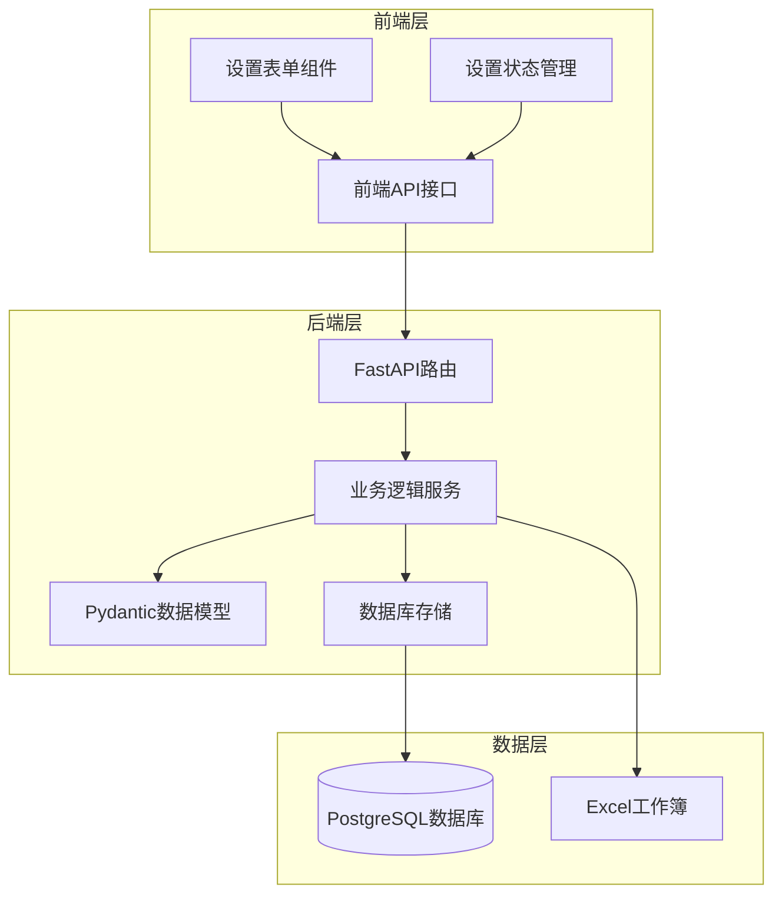
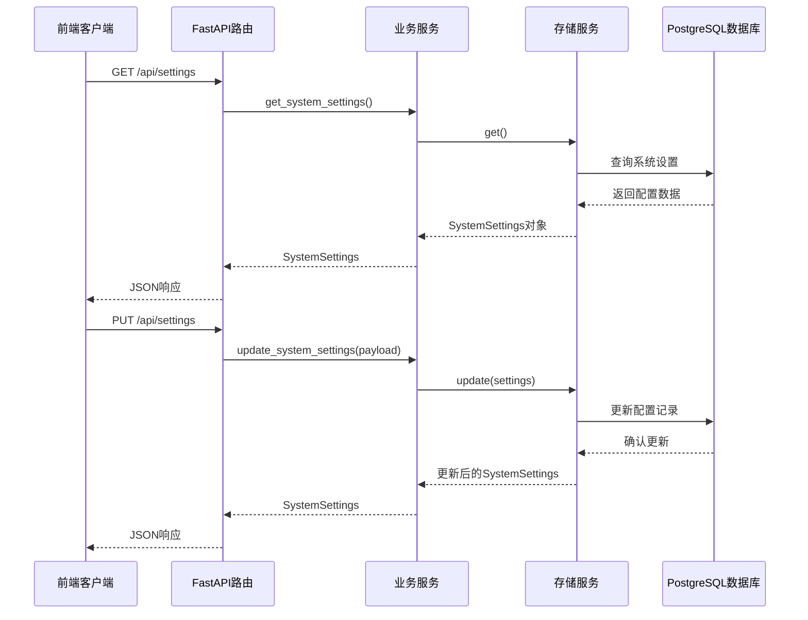
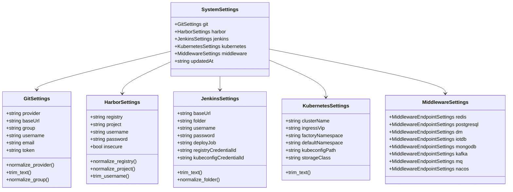
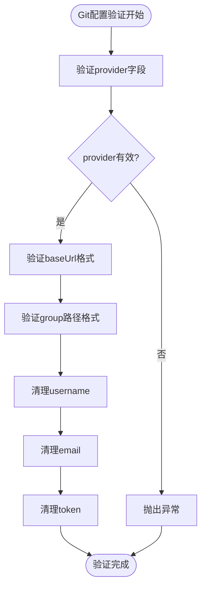
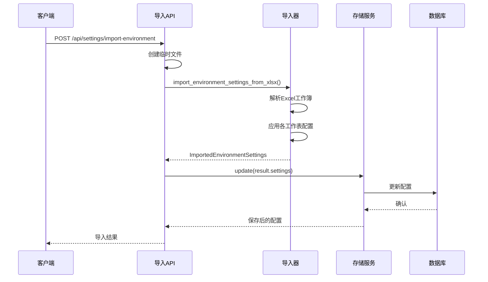
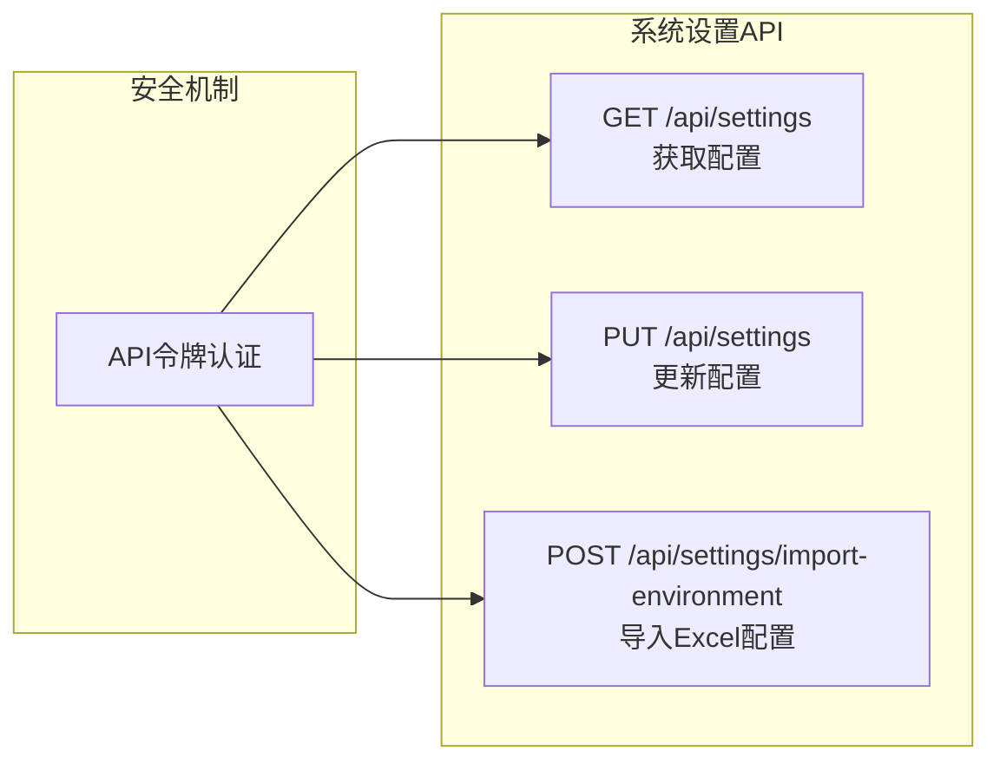
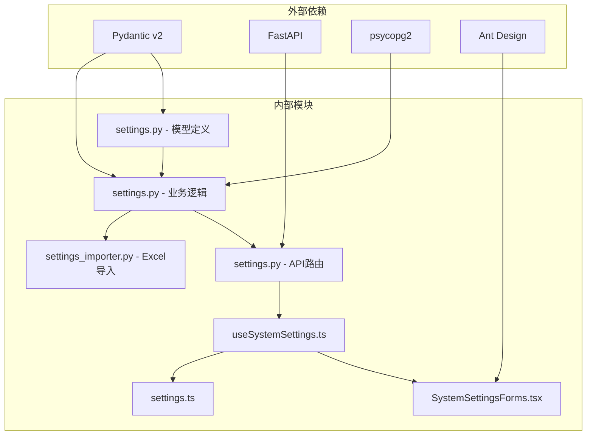
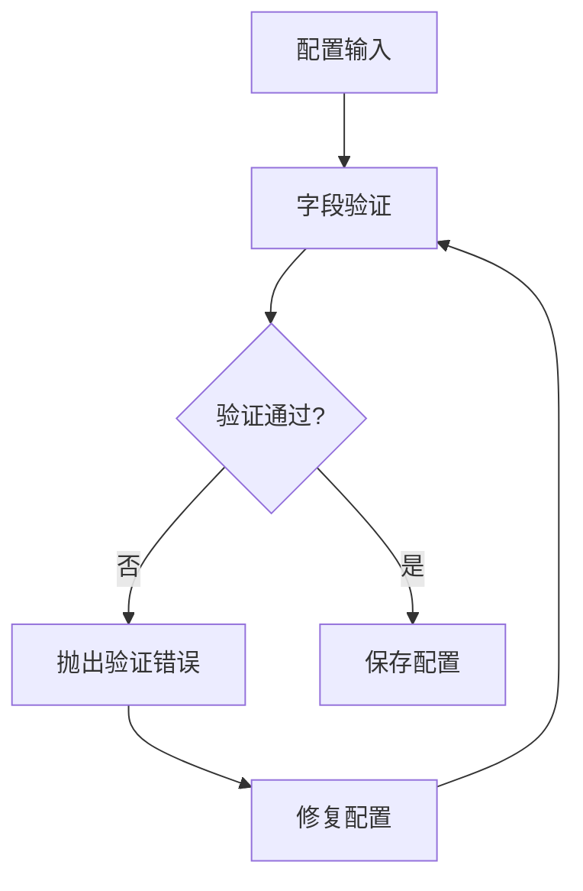

# 系统设置扩展

<cite>
**本文档引用的文件**
- [settings.py](file://backend/deployment_package_factory/settings.py)
- [settings.py](file://backend/deployment_package_factory/services/settings.py)
- [settings.py](file://backend/deployment_package_factory/api/settings.py)
- [settings_importer.py](file://backend/deployment_package_factory/services/settings_importer.py)
- [SystemSettingsForms.tsx](file://frontend/src/views/components/SystemSettingsForms.tsx)
- [useSystemSettings.ts](file://frontend/src/views/hooks/useSystemSettings.ts)
- [settings.ts](file://frontend/src/api/settings.ts)
- [SystemSettingsView.tsx](file://frontend/src/views/SystemSettingsView.tsx)
- [test_settings.py](file://backend/tests/test_settings.py)
</cite>

## 目录
1. [简介](#简介)
2. [项目结构](#项目结构)
3. [核心组件](#核心组件)
4. [架构概览](#架构概览)
5. [详细组件分析](#详细组件分析)
6. [依赖关系分析](#依赖关系分析)
7. [性能考虑](#性能考虑)
8. [故障排除指南](#故障排除指南)
9. [结论](#结论)
10. [附录](#附录)

## 简介

系统设置扩展是部署包工厂系统中的核心配置管理模块，负责管理所有外部服务配置、环境变量和系统行为参数。该模块采用Pydantic数据模型驱动的设计，提供了完整的配置验证、持久化存储和导入导出功能。

本指南将详细说明如何：
- 添加新的配置项和扩展Excel导入导出功能
- 定制验证规则和处理默认值
- 扩展设置API以支持新的配置类型
- 开发设置验证规则和测试策略

## 项目结构

系统设置扩展涉及前后端分离的完整实现，包含以下关键层次：

**图表来源**
- [settings.py:1-69](file://backend/deployment_package_factory/api/settings.py#L1-L69)
- [settings.py:1-222](file://backend/deployment_package_factory/services/settings.py#L1-L222)

**章节来源**
- [settings.py:1-57](file://backend/deployment_package_factory/settings.py#L1-L57)
- [settings.py:1-222](file://backend/deployment_package_factory/services/settings.py#L1-L222)

## 核心组件

系统设置扩展由多个相互协作的组件构成，每个组件都有明确的职责分工：

### 数据模型层
- **SystemSettings**: 主要配置容器，包含所有子配置类型的聚合
- **GitSettings**: Git仓库配置（GitLab/GitHub）
- **HarborSettings**: Harbor镜像仓库配置
- **JenkinsSettings**: Jenkins CI/CD配置
- **KubernetesSettings**: Kubernetes集群配置
- **MiddlewareSettings**: 中间件配置集合

### 业务服务层
- **SystemSettingsRepository**: 配置持久化服务
- **settings_importer**: Excel配置导入器

### 接口层
- **FastAPI路由**: REST API接口
- **前端组件**: 用户界面交互

**章节来源**
- [settings.py:14-167](file://backend/deployment_package_factory/services/settings.py#L14-L167)
- [settings.py:1-69](file://backend/deployment_package_factory/api/settings.py#L1-L69)

## 架构概览

系统设置扩展采用分层架构设计，确保了良好的关注点分离和可扩展性：

**图表来源**
- [settings.py:42-49](file://backend/deployment_package_factory/api/settings.py#L42-L49)
- [settings.py:169-198](file://backend/deployment_package_factory/services/settings.py#L169-L198)

## 详细组件分析

### 数据模型设计原理

系统设置的数据模型基于Pydantic v2，采用了以下设计原则：

#### 验证规则模式
每个配置类都实现了严格的字段验证规则：

**图表来源**
- [settings.py:14-167](file://backend/deployment_package_factory/services/settings.py#L14-L167)

#### 默认值处理机制
系统采用多层次的默认值处理策略：

1. **Pydantic默认值**: 在模型定义中直接指定默认值
2. **运行时验证**: 使用field_validator进行动态验证和修正
3. **环境变量回退**: 通过load_settings函数处理环境变量

**章节来源**
- [settings.py:14-167](file://backend/deployment_package_factory/services/settings.py#L14-L167)
- [settings.py:26-57](file://backend/deployment_package_factory/settings.py#L26-L57)

### 配置分类管理

系统设置按照功能域进行分类管理，每种配置类型都有专门的验证规则：

#### Git配置管理

**图表来源**
- [settings.py:24-45](file://backend/deployment_package_factory/services/settings.py#L24-L45)

#### Harbor镜像仓库配置
Harbor配置包含了严格的主机名和项目名验证：

- **主机名校验**: 不允许包含斜杠或空白字符
- **项目名校验**: 必须符合小写路径片段格式
- **认证信息**: 支持机器人账号和密码

**章节来源**
- [settings.py:48-79](file://backend/deployment_package_factory/services/settings.py#L48-L79)

### Excel导入导出功能

系统提供了完整的Excel配置导入功能，支持从Excel工作簿中提取环境配置：

#### 导入流程

**图表来源**
- [settings.py:52-68](file://backend/deployment_package_factory/api/settings.py#L52-L68)
- [settings_importer.py:21-35](file://backend/deployment_package_factory/services/settings_importer.py#L21-L35)

#### 工作表映射规则
系统支持多个工作表的配置映射：

| 工作表名称 | 映射字段 |
|-----------|----------|
| 总览 | K8S VIP, Namespace, 镜像仓库 |
| VM与基础设施 | Harbor, Jenkins连接信息 |
| 导包工厂环境 | K8s命名空间, 代码仓库 |
| Jenkins与发布 | 凭据ID, 发布作业 |
| 环境分区规划 | 命名空间组, 服务类型 |

**章节来源**
- [settings_importer.py:38-106](file://backend/deployment_package_factory/services/settings_importer.py#L38-L106)

### 设置API扩展

系统API设计遵循RESTful原则，提供了完整的CRUD操作：

#### API端点设计

**图表来源**
- [settings.py:17-21](file://backend/deployment_package_factory/api/settings.py#L17-L21)

**章节来源**
- [settings.py:1-69](file://backend/deployment_package_factory/api/settings.py#L1-L69)

## 依赖关系分析

系统设置扩展的依赖关系清晰且模块化：

**图表来源**
- [settings.py:1-9](file://backend/deployment_package_factory/services/settings.py#L1-L9)
- [settings.py:1-15](file://backend/deployment_package_factory/api/settings.py#L1-L15)

**章节来源**
- [settings.py:1-222](file://backend/deployment_package_factory/services/settings.py#L1-L222)
- [settings.py:1-69](file://backend/deployment_package_factory/api/settings.py#L1-L69)

## 性能考虑

系统设置扩展在设计时充分考虑了性能和可扩展性：

### 数据库优化
- **单一记录存储**: 使用键值对存储整个配置对象
- **JSON序列化**: 高效的二进制存储格式
- **事务保证**: 原子性更新操作

### 缓存策略
- **连接池**: 使用psycopg连接池减少连接开销
- **内存缓存**: API层的全局仓库实例避免重复初始化

### 并发处理
- **异步API**: FastAPI原生支持异步请求处理
- **线程安全**: Pydantic模型的不可变特性

## 故障排除指南

### 常见问题诊断

#### 配置验证错误
当配置不符合验证规则时，系统会抛出详细的错误信息：

#### 数据库连接问题
如果数据库URL配置错误，系统会在启动时检测并报告：

**章节来源**
- [settings.py:218-222](file://backend/deployment_package_factory/services/settings.py#L218-L222)

### 调试技巧

1. **启用详细日志**: 检查数据库连接和查询执行
2. **验证Excel格式**: 确保工作簿结构符合预期
3. **测试API端点**: 使用curl或Postman验证接口功能

**章节来源**
- [test_settings.py:1-108](file://backend/tests/test_settings.py#L1-L108)

## 结论

系统设置扩展通过精心设计的架构和严格的验证机制，为部署包工厂系统提供了强大而灵活的配置管理能力。其主要优势包括：

- **强类型安全**: Pydantic模型确保配置的完整性和一致性
- **灵活扩展**: 模块化的架构支持轻松添加新的配置类型
- **用户友好**: 完整的前端界面和Excel导入功能
- **可靠持久化**: 基于PostgreSQL的安全存储方案

该系统为未来的功能扩展奠定了坚实的基础，开发者可以在此基础上添加更多外部服务配置和高级验证规则。

## 附录

### 开发最佳实践

#### 添加新配置类型的步骤
1. 在`SystemSettings`中添加新的字段
2. 创建对应的Pydantic模型类
3. 实现必要的验证规则
4. 更新API路由和前端组件
5. 编写单元测试和集成测试

#### 验证规则开发指南
- 使用`@field_validator`装饰器实现字段级验证
- 使用正则表达式确保格式正确性
- 提供有意义的错误消息
- 考虑边界情况和异常输入

#### 测试策略
- 单元测试：验证模型验证逻辑
- 集成测试：测试API端点功能
- 端到端测试：验证完整工作流程
- 性能测试：评估并发处理能力