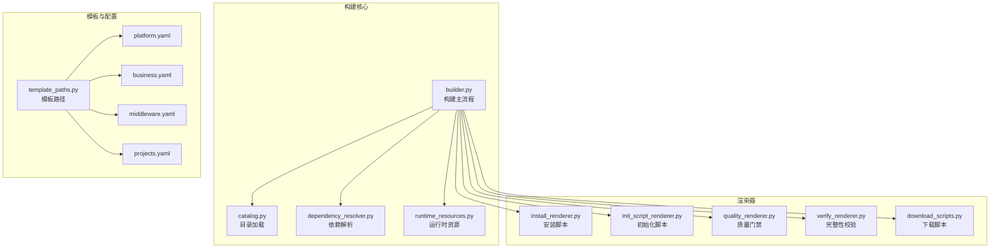
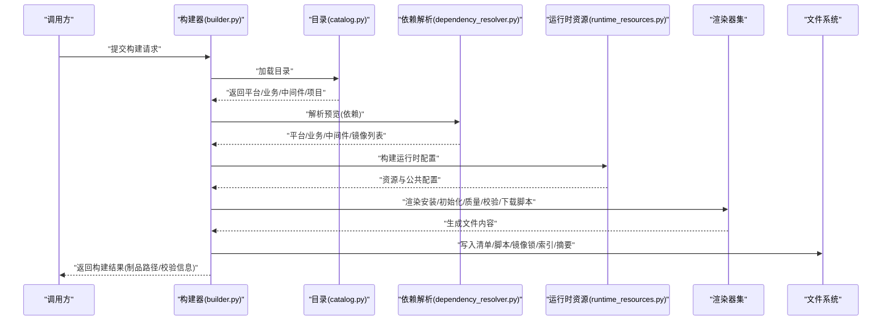
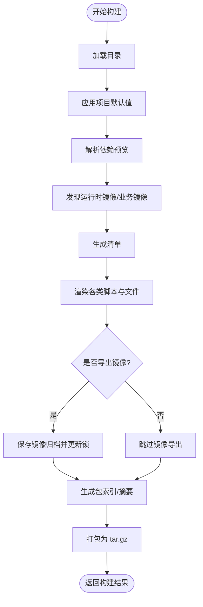
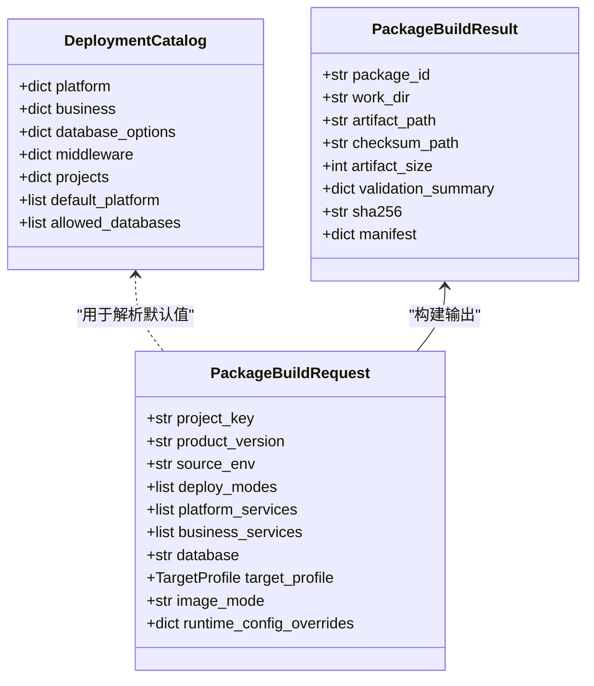
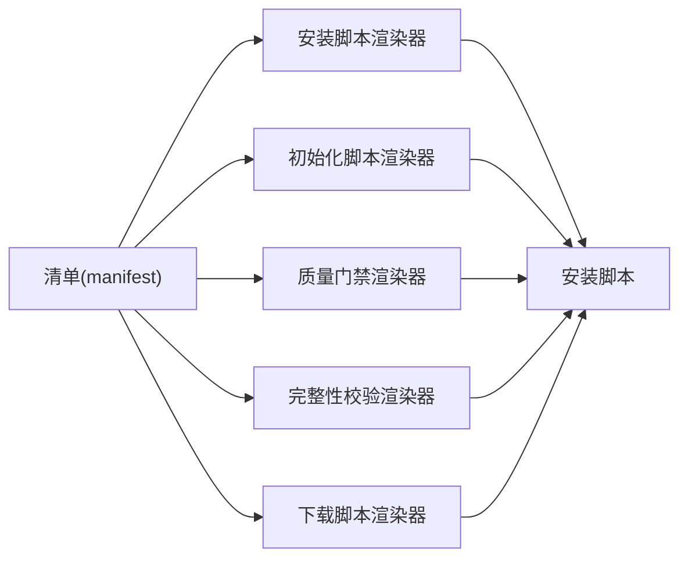
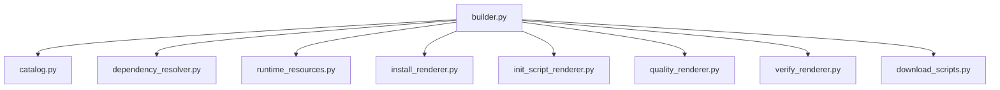

# 部署包构建器扩展

<cite>
**本文档引用的文件**
- [builder.py](file://backend/deployment_package_factory/services/deployment_packages/builder.py)
- [models.py](file://backend/deployment_package_factory/services/deployment_packages/models.py)
- [catalog.py](file://backend/deployment_package_factory/services/deployment_packages/catalog.py)
- [dependency_resolver.py](file://backend/deployment_package_factory/services/deployment_packages/dependency_resolver.py)
- [download_scripts.py](file://backend/deployment_package_factory/services/deployment_packages/download_scripts.py)
- [init_script_renderer.py](file://backend/deployment_package_factory/services/deployment_packages/init_script_renderer.py)
- [install_renderer.py](file://backend/deployment_package_factory/services/deployment_packages/install_renderer.py)
- [quality_renderer.py](file://backend/deployment_package_factory/services/deployment_packages/quality_renderer.py)
- [verify_renderer.py](file://backend/deployment_package_factory/services/deployment_packages/verify_renderer.py)
- [runtime_resources.py](file://backend/deployment_package_factory/services/deployment_packages/runtime_resources.py)
- [template_paths.py](file://backend/deployment_package_factory/services/deployment_packages/template_paths.py)
- [root_install_shell.py](file://backend/deployment_package_factory/services/deployment_packages/root_install_shell.py)
- [root_install_powershell.py](file://backend/deployment_package_factory/services/deployment_packages/root_install_powershell.py)
- [platform.yaml](file://templates/catalog/platform.yaml)
- [business.yaml](file://templates/catalog/business.yaml)
- [middleware.yaml](file://templates/catalog/middleware.yaml)
- [projects.yaml](file://templates/catalog/projects.yaml)
</cite>

## 目录
1. [简介](#简介)
2. [项目结构](#项目结构)
3. [核心组件](#核心组件)
4. [架构总览](#架构总览)
5. [详细组件分析](#详细组件分析)
6. [依赖分析](#依赖分析)
7. [性能考虑](#性能考虑)
8. [故障排除指南](#故障排除指南)
9. [结论](#结论)
10. [附录](#附录)

## 简介
本指南面向需要扩展“部署包构建器”的开发者，围绕以下目标展开：
- 支持新的部署模式（如新增安装方式或校验流程）
- 自定义渲染器（新增脚本、配置或模板）
- 新增质量检查规则（扩展质量门禁）
- 理解构建流程的各阶段：镜像导出、文件渲染、依赖解析、产物打包
- 添加新的下载脚本、初始化脚本、安装脚本
- 构建器扩展的最佳实践：错误处理、性能优化、测试策略

## 项目结构
后端采用分层与功能域结合的组织方式：
- services/deployment_packages：部署包构建相关的核心逻辑与渲染器
- templates/catalog：平台、业务、中间件与项目配置目录
- data/deployment-packages：构建产物输出目录（工作区与制品）

**图表来源**
- [builder.py:146-246](file://backend/deployment_package_factory/services/deployment_packages/builder.py#L146-L246)
- [catalog.py:44-79](file://backend/deployment_package_factory/services/deployment_packages/catalog.py#L44-L79)
- [dependency_resolver.py:14-94](file://backend/deployment_package_factory/services/deployment_packages/dependency_resolver.py#L14-L94)
- [runtime_resources.py:25-52](file://backend/deployment_package_factory/services/deployment_packages/runtime_resources.py#L25-L52)
- [install_renderer.py:21-26](file://backend/deployment_package_factory/services/deployment_packages/install_renderer.py#L21-L26)
- [init_script_renderer.py:28-49](file://backend/deployment_package_factory/services/deployment_packages/init_script_renderer.py#L28-L49)
- [quality_renderer.py:18-23](file://backend/deployment_package_factory/services/deployment_packages/quality_renderer.py#L18-L23)
- [verify_renderer.py:17-21](file://backend/deployment_package_factory/services/deployment_packages/verify_renderer.py#L17-L21)
- [download_scripts.py:6-14](file://backend/deployment_package_factory/services/deployment_packages/download_scripts.py#L6-L14)
- [template_paths.py:7-21](file://backend/deployment_package_factory/services/deployment_packages/template_paths.py#L7-L21)
- [platform.yaml:1-66](file://templates/catalog/platform.yaml#L1-L66)
- [business.yaml:1-60](file://templates/catalog/business.yaml#L1-L60)
- [middleware.yaml:1-283](file://templates/catalog/middleware.yaml#L1-L283)
- [projects.yaml:1-54](file://templates/catalog/projects.yaml#L1-L54)

**章节来源**
- [builder.py:146-246](file://backend/deployment_package_factory/services/deployment_packages/builder.py#L146-L246)
- [template_paths.py:7-21](file://backend/deployment_package_factory/services/deployment_packages/template_paths.py#L7-L21)

## 核心组件
- 构建主流程：负责工作区准备、清单生成、文件渲染、镜像导出、产物打包与摘要计算
- 目录与模型：定义平台、业务、中间件、项目与请求/结果模型
- 依赖解析：根据选择的服务与规则推导所需平台、业务与中间件集合
- 运行时资源：从环境与探针中提取数据库、桶、集合等资源，并生成公开配置
- 渲染器：安装脚本、初始化脚本、质量门禁、完整性校验、下载脚本
- 模板路径：模板目录解析与覆盖模板目录定位

**章节来源**
- [builder.py:146-246](file://backend/deployment_package_factory/services/deployment_packages/builder.py#L146-L246)
- [models.py:54-249](file://backend/deployment_package_factory/services/deployment_packages/models.py#L54-L249)
- [catalog.py:44-79](file://backend/deployment_package_factory/services/deployment_packages/catalog.py#L44-L79)
- [dependency_resolver.py:14-94](file://backend/deployment_package_factory/services/deployment_packages/dependency_resolver.py#L14-L94)
- [runtime_resources.py:25-52](file://backend/deployment_package_factory/services/deployment_packages/runtime_resources.py#L25-L52)
- [install_renderer.py:21-26](file://backend/deployment_package_factory/services/deployment_packages/install_renderer.py#L21-L26)
- [init_script_renderer.py:28-49](file://backend/deployment_package_factory/services/deployment_packages/init_script_renderer.py#L28-L49)
- [quality_renderer.py:18-23](file://backend/deployment_package_factory/services/deployment_packages/quality_renderer.py#L18-L23)
- [verify_renderer.py:17-21](file://backend/deployment_package_factory/services/deployment_packages/verify_renderer.py#L17-L21)
- [download_scripts.py:6-14](file://backend/deployment_package_factory/services/deployment_packages/download_scripts.py#L6-L14)
- [template_paths.py:7-21](file://backend/deployment_package_factory/services/deployment_packages/template_paths.py#L7-L21)

## 架构总览
构建器遵循“目录加载 → 依赖解析 → 运行时资源构建 → 文件渲染 → 镜像导出 → 打包”的流水线。

**图表来源**
- [builder.py:146-246](file://backend/deployment_package_factory/services/deployment_packages/builder.py#L146-L246)
- [catalog.py:44-79](file://backend/deployment_package_factory/services/deployment_packages/catalog.py#L44-L79)
- [dependency_resolver.py:14-94](file://backend/deployment_package_factory/services/deployment_packages/dependency_resolver.py#L14-L94)
- [runtime_resources.py:25-52](file://backend/deployment_package_factory/services/deployment_packages/runtime_resources.py#L25-L52)

## 详细组件分析

### 构建主流程（builder.py）
- 关键职责
  - 准备工作区与制品目录
  - 加载目录、应用项目默认值、解析预览
  - 发现运行时镜像与业务镜像，生成镜像条目
  - 渲染安装、验证、质量门禁、验收报告、部署、初始化、项目覆盖、值文件等
  - 可选镜像导出与镜像锁更新
  - 生成包索引、SHA256SUMS、打包为 tar.gz 并计算摘要
- 错误处理
  - 使用专用异常类型包装错误
  - 对工具可用性（skopeo/docker）进行环境检测
  - 对未知项目/版本、缺失镜像来源等进行显式报错
- 性能要点
  - 仅对必要文件执行哈希与比较
  - 基于清单与索引进行最小化校验
  - 避免重复写入与冗余渲染

**图表来源**
- [builder.py:146-246](file://backend/deployment_package_factory/services/deployment_packages/builder.py#L146-L246)

**章节来源**
- [builder.py:146-246](file://backend/deployment_package_factory/services/deployment_packages/builder.py#L146-L246)

### 目录与模型（catalog.py, models.py）
- 目录加载
  - 读取 platform.yaml、business.yaml、middleware.yaml、dependency-rules.yaml、projects.yaml
  - 校验重复键、依赖合法性、数据库允许列表
- 模型
  - 定义 Capability、MiddlewareOption、DatabaseOption、DeploymentCatalog、ProjectProfile、TargetProfile、PackagePreview、PackageBuildResult 等
  - 请求模型支持镜像模式与运行时配置覆盖

**图表来源**
- [models.py:54-249](file://backend/deployment_package_factory/services/deployment_packages/models.py#L54-L249)
- [catalog.py:44-79](file://backend/deployment_package_factory/services/deployment_packages/catalog.py#L44-L79)

**章节来源**
- [catalog.py:44-79](file://backend/deployment_package_factory/services/deployment_packages/catalog.py#L44-L79)
- [models.py:54-249](file://backend/deployment_package_factory/services/deployment_packages/models.py#L54-L249)

### 依赖解析（dependency_resolver.py）
- 输入：PackagePreviewRequest 与 DeploymentCatalog
- 输出：PackagePreview（含平台/业务/中间件依赖、镜像集合、警告）
- 规则：
  - 默认平台服务与必选服务
  - 业务服务触发平台与中间件依赖
  - 平台服务的依赖传递闭包
  - 中间件依赖的传递闭包
  - 数据库选项替换为具体数据库键

**章节来源**
- [dependency_resolver.py:14-94](file://backend/deployment_package_factory/services/deployment_packages/dependency_resolver.py#L14-L94)

### 运行时资源（runtime_resources.py）
- 输入：请求、预览、中间件配置、运行时环境、探针
- 输出：运行时配置（分组+资源），并提供公共视图
- 资源类型：
  - databaseSchema：从 DSN 解析数据库名、schema、用户名、密码
  - bucket：从环境变量解析 MinIO 桶
  - collection：从环境变量解析 Qdrant 集合与向量维度
- 覆盖与去重：支持资源覆盖与去重，保证共享与变更追踪

**章节来源**
- [runtime_resources.py:25-52](file://backend/deployment_package_factory/services/deployment_packages/runtime_resources.py#L25-L52)
- [runtime_resources.py:95-220](file://backend/deployment_package_factory/services/deployment_packages/runtime_resources.py#L95-L220)

### 渲染器体系
- 安装脚本（install_renderer.py）
  - 生成 install.sh 与 install.ps1，默认部署模式基于 deployModes 推断
- 初始化脚本（init_script_renderer.py）
  - 生成 init/run-init.sh 与数据库/中间件初始化脚本
  - 支持项目级 init 资产合并
- 质量门禁（quality_renderer.py）
  - 生成 quality-gate.sh/ps1 与质量报告文档
  - 支持 verify、k8s 客户端 dry-run、docker-compose 配置校验
- 完整性校验（verify_renderer.py）
  - 生成 verify.sh/ps1，校验清单、索引、SHA256SUMS、镜像归档锁定
- 下载脚本（download_scripts.py）
  - 生成跨平台下载脚本，支持断点续传与校验

**图表来源**
- [install_renderer.py:21-26](file://backend/deployment_package_factory/services/deployment_packages/install_renderer.py#L21-L26)
- [init_script_renderer.py:28-49](file://backend/deployment_package_factory/services/deployment_packages/init_script_renderer.py#L28-L49)
- [quality_renderer.py:18-23](file://backend/deployment_package_factory/services/deployment_packages/quality_renderer.py#L18-L23)
- [verify_renderer.py:17-21](file://backend/deployment_package_factory/services/deployment_packages/verify_renderer.py#L17-L21)
- [download_scripts.py:6-14](file://backend/deployment_package_factory/services/deployment_packages/download_scripts.py#L6-L14)

**章节来源**
- [install_renderer.py:21-26](file://backend/deployment_package_factory/services/deployment_packages/install_renderer.py#L21-L26)
- [init_script_renderer.py:28-49](file://backend/deployment_package_factory/services/deployment_packages/init_script_renderer.py#L28-L49)
- [quality_renderer.py:18-23](file://backend/deployment_package_factory/services/deployment_packages/quality_renderer.py#L18-L23)
- [verify_renderer.py:17-21](file://backend/deployment_package_factory/services/deployment_packages/verify_renderer.py#L17-L21)
- [download_scripts.py:6-14](file://backend/deployment_package_factory/services/deployment_packages/download_scripts.py#L6-L14)

### 模板路径与覆盖（template_paths.py）
- 解析模板目录优先级：环境变量 > 当前工作目录 > 项目根目录 > 固定路径
- 提供目录：default_catalog_dir、default_overlay_template_dir

**章节来源**
- [template_paths.py:7-21](file://backend/deployment_package_factory/services/deployment_packages/template_paths.py#L7-L21)

### 安装脚本实现（root_install_shell.py, root_install_powershell.py）
- Bash 版本：解析参数、执行 verify、按模式执行 dry-run/install、健康检查与诊断
- PowerShell 版本：增强磁盘空间检查、镜像归档预检与加载、Compose 环境文件校验、健康检查与诊断

**章节来源**
- [root_install_shell.py:4-86](file://backend/deployment_package_factory/services/deployment_packages/root_install_shell.py#L4-L86)
- [root_install_powershell.py:4-174](file://backend/deployment_package_factory/services/deployment_packages/root_install_powershell.py#L4-L174)

## 依赖分析
- 组件耦合
  - builder.py 作为编排者，依赖 catalog、dependency_resolver、runtime_resources 与各渲染器
  - 渲染器之间低耦合，通过 manifest 与模板路径交互
- 外部依赖
  - Kubernetes API（读取 Secret/ConfigMap/Pod）、Docker/Skopeo（镜像导出）
  - Python 标准库与第三方库（Pydantic、yaml、subprocess 等）

**图表来源**
- [builder.py:21-57](file://backend/deployment_package_factory/services/deployment_packages/builder.py#L21-L57)

**章节来源**
- [builder.py:21-57](file://backend/deployment_package_factory/services/deployment_packages/builder.py#L21-L57)

## 性能考虑
- 最小化文件操作：仅在必要时重新渲染与写入
- 基于清单与索引的增量校验：避免全量哈希
- 镜像导出条件控制：仅在需要时执行导出与锁更新
- 并行化潜力：渲染器与校验脚本可并行生成；镜像导出可并行处理多个归档
- I/O 优化：使用 tarfile.filter 控制元数据，减少无关文件写入

## 故障排除指南
- 环境检查失败
  - 症状：无法找到 skopeo 或 docker，或 docker info 失败
  - 处理：安装 skopeo 或提供具备访问权限的 Docker CLI；确保容器守护进程可用
- 未知项目/版本
  - 症状：抛出包构建错误，提示未知项目或不支持的版本
  - 处理：确认项目键与版本存在于 projects.yaml
- 依赖不合法
  - 症状：目录校验失败，提示未知平台/中间件或依赖冲突
  - 处理：修正 platform.yaml/business.yaml/middleware.yaml 中的 dependsOn 与 middleware 字段
- 镜像来源缺失
  - 症状：运行时镜像未匹配，标记为缺失
  - 处理：确认来源环境命名空间与镜像标签一致；或调整默认标签策略
- 校验失败
  - 症状：verify.sh/ps1 报告缺少文件、校验和不匹配、索引不一致
  - 处理：对照清单与索引修复遗漏文件或更新 SHA256SUMS；核对镜像归档锁定

**章节来源**
- [builder.py:105-143](file://backend/deployment_package_factory/services/deployment_packages/builder.py#L105-L143)
- [builder.py:384-412](file://backend/deployment_package_factory/services/deployment_packages/builder.py#L384-L412)
- [catalog.py:82-121](file://backend/deployment_package_factory/services/deployment_packages/catalog.py#L82-L121)
- [verify_renderer.py:24-183](file://backend/deployment_package_factory/services/deployment_packages/verify_renderer.py#L24-L183)

## 结论
通过模块化与清晰的职责划分，部署包构建器提供了良好的扩展点。新增部署模式、自定义渲染器与质量检查规则的关键在于：
- 在目录中声明新能力与依赖规则
- 在渲染器中实现对应文件生成
- 在构建流程中接入渲染步骤
- 通过模板路径与覆盖机制支持项目级定制
- 严格遵循错误处理与性能优化最佳实践

## 附录

### 如何扩展新的部署模式
- 在目录中定义新模式所需的平台/业务/中间件能力与依赖
- 在安装渲染器中增加模式分支与对应脚本
- 在质量门禁渲染器中增加新模式的干跑与配置校验
- 在构建主流程中将新模式纳入清单与渲染序列

**章节来源**
- [platform.yaml:1-66](file://templates/catalog/platform.yaml#L1-L66)
- [business.yaml:1-60](file://templates/catalog/business.yaml#L1-L60)
- [middleware.yaml:1-283](file://templates/catalog/middleware.yaml#L1-L283)
- [install_renderer.py:21-26](file://backend/deployment_package_factory/services/deployment_packages/install_renderer.py#L21-L26)
- [quality_renderer.py:18-23](file://backend/deployment_package_factory/services/deployment_packages/quality_renderer.py#L18-L23)

### 如何添加新的下载脚本
- 使用下载脚本渲染器提供的接口，按 shell/powershell 生成脚本内容
- 注意断点续传、范围请求与校验逻辑的一致性

**章节来源**
- [download_scripts.py:6-14](file://backend/deployment_package_factory/services/deployment_packages/download_scripts.py#L6-L14)

### 如何添加新的初始化脚本
- 在初始化脚本渲染器中注册新中间件/数据库的初始化逻辑
- 通过项目覆盖模板目录合并项目级初始化资产

**章节来源**
- [init_script_renderer.py:28-49](file://backend/deployment_package_factory/services/deployment_packages/init_script_renderer.py#L28-L49)
- [template_paths.py:28-29](file://backend/deployment_package_factory/services/deployment_packages/template_paths.py#L28-L29)

### 如何添加新的安装脚本
- 在安装脚本渲染器中生成新脚本，并在构建主流程中写入
- 在 PowerShell/Bash 安装脚本中完善前置检查、干跑与健康检查

**章节来源**
- [install_renderer.py:21-26](file://backend/deployment_package_factory/services/deployment_packages/install_renderer.py#L21-L26)
- [root_install_shell.py:4-86](file://backend/deployment_package_factory/services/deployment_packages/root_install_shell.py#L4-L86)
- [root_install_powershell.py:4-174](file://backend/deployment_package_factory/services/deployment_packages/root_install_powershell.py#L4-L174)

### 如何新增质量检查规则
- 在质量门禁渲染器中扩展检查项与报告
- 在完整性校验渲染器中补充必要的校验逻辑

**章节来源**
- [quality_renderer.py:18-23](file://backend/deployment_package_factory/services/deployment_packages/quality_renderer.py#L18-L23)
- [verify_renderer.py:17-21](file://backend/deployment_package_factory/services/deployment_packages/verify_renderer.py#L17-L21)

### 构建流程阶段详解
- 镜像导出：根据镜像模式决定是否导出归档并更新镜像锁
- 文件渲染：安装、初始化、质量门禁、完整性校验、下载脚本、部署与值文件
- 依赖解析：根据选择的服务与规则推导平台/业务/中间件集合
- 产物打包：生成包索引、摘要文件，打包为 tar.gz

**章节来源**
- [builder.py:213-226](file://backend/deployment_package_factory/services/deployment_packages/builder.py#L213-L226)
- [builder.py:196-208](file://backend/deployment_package_factory/services/deployment_packages/builder.py#L196-L208)
- [dependency_resolver.py:14-94](file://backend/deployment_package_factory/services/deployment_packages/dependency_resolver.py#L14-L94)