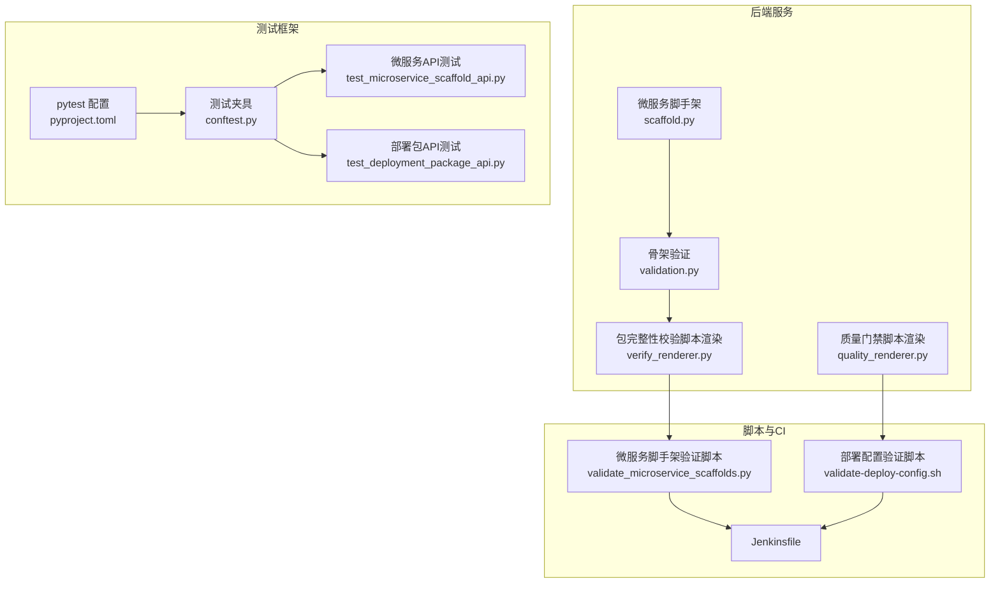
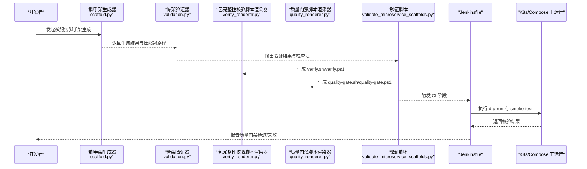
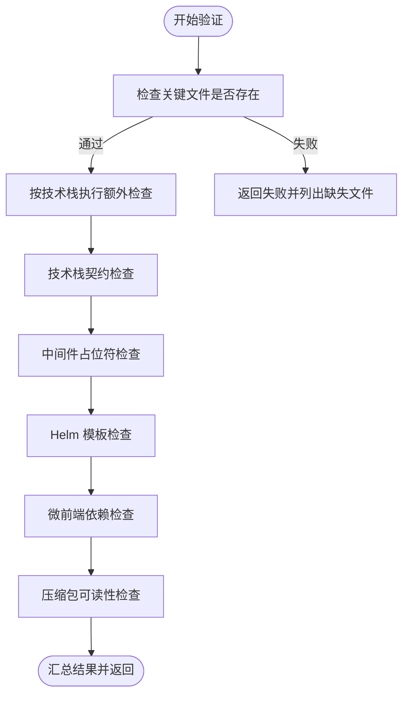
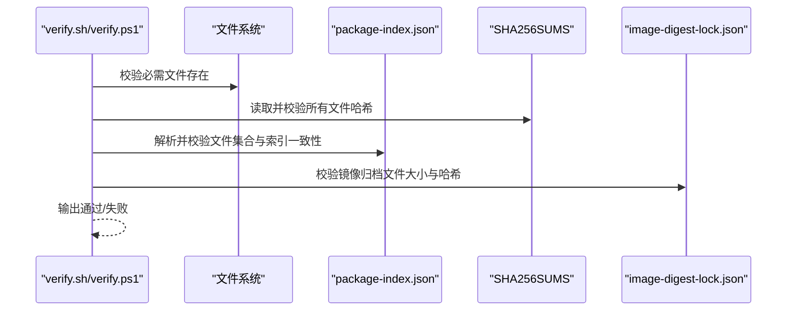
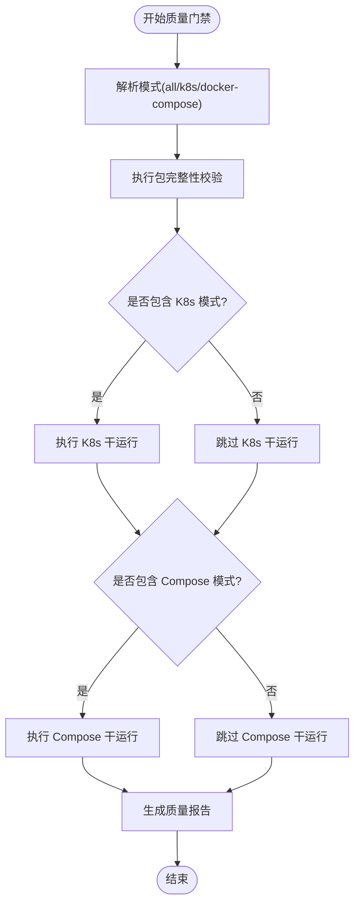
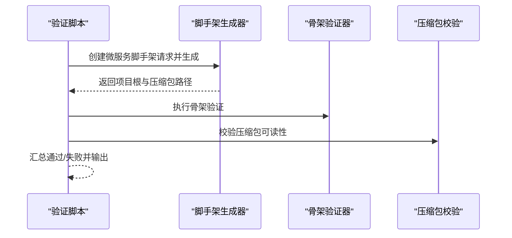
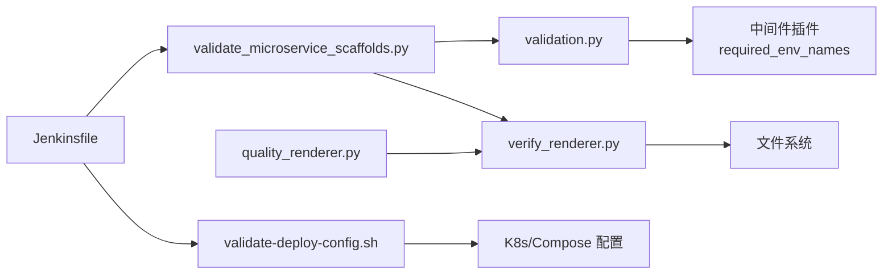

# 验证与测试扩展

<cite>
**本文引用的文件**
- [validation.py](file://backend/deployment_package_factory/services/microservices/validation.py)
- [verify_renderer.py](file://backend/deployment_package_factory/services/deployment_packages/verify_renderer.py)
- [quality_renderer.py](file://backend/deployment_package_factory/services/deployment_packages/quality_renderer.py)
- [validate_microservice_scaffolds.py](file://scripts/validate_microservice_scaffolds.py)
- [validate-deploy-config.sh](file://scripts/validate-deploy-config.sh)
- [conftest.py](file://backend/tests/conftest.py)
- [pyproject.toml](file://backend/pyproject.toml)
- [Jenkinsfile](file://Jenkinsfile)
- [jenkins-ci-cd.md](file://docs/jenkins-ci-cd.md)
- [deployment-package-factory-delivery-audit.md](file://docs/deployment-package-factory-delivery-audit.md)
- [test_microservice_scaffold_api.py](file://backend/tests/test_microservice_scaffold_api.py)
- [test_deployment_package_api.py](file://backend/tests/test_deployment_package_api.py)
- [scaffold.py](file://backend/deployment_package_factory/services/microservices/scaffold.py)
</cite>

## 目录
1. [简介](#简介)
2. [项目结构](#项目结构)
3. [核心组件](#核心组件)
4. [架构总览](#架构总览)
5. [详细组件分析](#详细组件分析)
6. [依赖分析](#依赖分析)
7. [性能考虑](#性能考虑)
8. [故障排查指南](#故障排查指南)
9. [结论](#结论)
10. [附录](#附录)

## 简介
本开发指南面向需要扩展“部署包工厂”项目验证与测试体系的工程师，目标是帮助你：
- 扩展项目骨架验证规则（微服务脚手架生成后的质量检查）
- 扩展部署包质量检查与自动化测试框架
- 设计与实现验证脚本、测试用例与持续集成配置
- 添加新的验证规则、测试场景与覆盖率指标
- 实践测试驱动开发（TDD），覆盖单元测试、集成测试与端到端测试

## 项目结构
项目采用前后端分离与多语言混合的结构，验证与测试相关的关键位置如下：
- 后端 Python 验证与渲染：位于 backend/deployment_package_factory/services 下的验证与质量门禁渲染模块
- 微服务脚手架验证脚本：位于 scripts/validate_microservice_scaffolds.py
- 部署配置验证脚本：位于 scripts/validate-deploy-config.sh
- 后端测试框架：pytest，位于 backend/tests，配合 conftest.py 与 pyproject.toml
- 持续集成：Jenkinsfile 与文档说明

图表来源
- [scaffold.py:1-200](file://backend/deployment_package_factory/services/microservices/scaffold.py#L1-L200)
- [validation.py:1-144](file://backend/deployment_package_factory/services/microservices/validation.py#L1-L144)
- [verify_renderer.py:1-346](file://backend/deployment_package_factory/services/deployment_packages/verify_renderer.py#L1-L346)
- [quality_renderer.py:1-170](file://backend/deployment_package_factory/services/deployment_packages/quality_renderer.py#L1-L170)
- [validate_microservice_scaffolds.py:1-280](file://scripts/validate_microservice_scaffolds.py#L1-L280)
- [validate-deploy-config.sh:1-64](file://scripts/validate-deploy-config.sh#L1-L64)
- [pyproject.toml:1-30](file://backend/pyproject.toml#L1-L30)
- [conftest.py:1-10](file://backend/tests/conftest.py#L1-L10)
- [test_microservice_scaffold_api.py:1-200](file://backend/tests/test_microservice_scaffold_api.py#L1-L200)
- [test_deployment_package_api.py:1-200](file://backend/tests/test_deployment_package_api.py#L1-L200)
- [Jenkinsfile:1-258](file://Jenkinsfile#L1-L258)

章节来源
- [pyproject.toml:1-30](file://backend/pyproject.toml#L1-L30)
- [conftest.py:1-10](file://backend/tests/conftest.py#L1-L10)
- [Jenkinsfile:1-258](file://Jenkinsfile#L1-L258)

## 核心组件
- 骨架验证器：负责对生成的微服务脚手架进行文件存在性、技术栈契约、中间件占位符、压缩包可读性等检查
- 包完整性校验脚本渲染器：生成 verify.sh/verify.ps1，对包内必需文件、SHA256SUMS、package-index.json、镜像归档锁进行严格校验
- 质量门禁脚本渲染器：生成 quality-gate.sh/quality-gate.ps1，串联包完整性校验与 K8s/Compose 干运行检查，并输出质量报告
- 微服务脚手架验证脚本：以测试驱动的方式批量生成并验证多种技术栈与微前端框架组合
- 部署配置验证脚本：对 K8s/Compose 生成配置进行占位符检查与关键文件/片段校验
- 后端测试框架：pytest 配置与测试用例，覆盖 API 行为、选项发现、鉴权、预览依赖解析等

章节来源
- [validation.py:1-144](file://backend/deployment_package_factory/services/microservices/validation.py#L1-L144)
- [verify_renderer.py:1-346](file://backend/deployment_package_factory/services/deployment_packages/verify_renderer.py#L1-L346)
- [quality_renderer.py:1-170](file://backend/deployment_package_factory/services/deployment_packages/quality_renderer.py#L1-L170)
- [validate_microservice_scaffolds.py:1-280](file://scripts/validate_microservice_scaffolds.py#L1-L280)
- [validate-deploy-config.sh:1-64](file://scripts/validate-deploy-config.sh#L1-L64)
- [pyproject.toml:27-30](file://backend/pyproject.toml#L27-L30)

## 架构总览
下图展示了从“生成骨架”到“质量门禁”的端到端流程，以及 CI 中的验证步骤。

图表来源
- [scaffold.py:1-200](file://backend/deployment_package_factory/services/microservices/scaffold.py#L1-L200)
- [validation.py:1-144](file://backend/deployment_package_factory/services/microservices/validation.py#L1-L144)
- [verify_renderer.py:1-346](file://backend/deployment_package_factory/services/deployment_packages/verify_renderer.py#L1-L346)
- [quality_renderer.py:1-170](file://backend/deployment_package_factory/services/deployment_packages/quality_renderer.py#L1-L170)
- [validate_microservice_scaffolds.py:1-280](file://scripts/validate_microservice_scaffolds.py#L1-L280)
- [Jenkinsfile:1-258](file://Jenkinsfile#L1-L258)

## 详细组件分析

### 组件A：骨架验证器（validation.py）
- 功能职责
  - 校验生成的微服务脚手架是否包含关键文件
  - 针对特定技术栈（如 Python）进行语法检查
  - 检查 CI/CD 与部署相关文件是否存在及内容片段
  - 校验 Helm 模板完整性与约定
  - 校验中间件占位符是否齐全
  - 校验技术栈契约（关键文件与内容片段）
  - 校验微前端框架依赖
  - 校验压缩包可读性
- 复杂度与性能
  - 时间复杂度：O(N)（逐文件检查），N 为生成文件数量
  - 性能关注：Python 语法检查在大型项目中可能成为瓶颈，建议在 CI 中按需启用
- 错误处理
  - 对缺失文件、语法错误、模板问题、占位符缺失等情况给出明确消息
- 可扩展性
  - 新增规则只需新增检查函数并加入主流程返回字典

图表来源
- [validation.py:9-144](file://backend/deployment_package_factory/services/microservices/validation.py#L9-L144)

章节来源
- [validation.py:1-144](file://backend/deployment_package_factory/services/microservices/validation.py#L1-L144)

### 组件B：包完整性校验脚本渲染器（verify_renderer.py）
- 功能职责
  - 渲染跨平台的 verify.sh/verify.ps1，确保部署包完整性
  - 校验必需文件存在性
  - 使用系统 sha256sum 或 shasum 校验 SHA256SUMS
  - 解析 package-index.json 并校验文件集合一致性
  - 校验镜像归档锁与镜像归档文件的大小与哈希
- 复杂度与性能
  - 时间复杂度：O(M)（M 为包内文件数），I/O 密集
- 错误处理
  - 对缺失文件、校验失败、索引不一致、镜像归档不匹配等情况抛出明确错误
- 可扩展性
  - 可在渲染逻辑中增加更多校验项（如签名、SBOM）

图表来源
- [verify_renderer.py:17-183](file://backend/deployment_package_factory/services/deployment_packages/verify_renderer.py#L17-L183)
- [verify_renderer.py:186-345](file://backend/deployment_package_factory/services/deployment_packages/verify_renderer.py#L186-L345)

章节来源
- [verify_renderer.py:1-346](file://backend/deployment_package_factory/services/deployment_packages/verify_renderer.py#L1-L346)

### 组件C：质量门禁脚本渲染器（quality_renderer.py）
- 功能职责
  - 渲染跨平台的质量门禁脚本，串联包完整性校验与 K8s/Compose 干运行
  - 支持三种模式：all/k8s/docker-compose
  - 生成质量报告，记录每个检查项的结果
- 复杂度与性能
  - 时间复杂度：O(1) 主流程，干运行检查取决于外部工具
- 错误处理
  - 检查失败即退出并记录失败原因
- 可扩展性
  - 可新增更多干运行检查（如 kubeconform、shellcheck）

图表来源
- [quality_renderer.py:18-95](file://backend/deployment_package_factory/services/deployment_packages/quality_renderer.py#L18-L95)
- [quality_renderer.py:98-146](file://backend/deployment_package_factory/services/deployment_packages/quality_renderer.py#L98-L146)

章节来源
- [quality_renderer.py:1-170](file://backend/deployment_package_factory/services/deployment_packages/quality_renderer.py#L1-L170)

### 组件D：微服务脚手架验证脚本（validate_microservice_scaffolds.py）
- 功能职责
  - 以测试驱动方式批量生成并验证多种技术栈与微前端框架组合
  - 支持过滤用例、输出 JSON、可选执行构建检查
  - 对生成的压缩包进行可读性校验
- 复杂度与性能
  - 时间复杂度：O(C×F)（C 为用例数，F 为文件检查），构建检查取决于工具链
- 错误处理
  - 使用期望断言收集失败项并汇总输出
- 可扩展性
  - 新增用例只需在 CASES 中添加 Case，并在对应验证函数中补充断言

图表来源
- [validate_microservice_scaffolds.py:60-129](file://scripts/validate_microservice_scaffolds.py#L60-L129)
- [validate_microservice_scaffolds.py:102-129](file://scripts/validate_microservice_scaffolds.py#L102-L129)

章节来源
- [validate_microservice_scaffolds.py:1-280](file://scripts/validate_microservice_scaffolds.py#L1-L280)

### 组件E：部署配置验证脚本（validate-deploy-config.sh）
- 功能职责
  - 校验 K8s/Compose 生成配置的关键文件与片段
  - 拒绝残留占位符
  - 校验 PVC 存储类、Secret 环境变量等
- 复杂度与性能
  - 时间复杂度：O(K)（K 为配置文件行数），文本匹配为主
- 错误处理
  - 对缺失文件、占位符残留、关键片段缺失等情况立即失败

章节来源
- [validate-deploy-config.sh:1-64](file://scripts/validate-deploy-config.sh#L1-L64)

### 组件F：后端测试框架（pytest）
- 功能职责
  - 提供 API 行为测试、鉴权测试、选项发现测试、依赖解析测试等
  - 使用 TestClient 与内存仓库模拟真实环境
- 复杂度与性能
  - 单测开销小，适合高频回归
- 错误处理
  - 断言失败即报错，便于定位问题

章节来源
- [pyproject.toml:27-30](file://backend/pyproject.toml#L27-L30)
- [conftest.py:1-10](file://backend/tests/conftest.py#L1-L10)
- [test_microservice_scaffold_api.py:1-200](file://backend/tests/test_microservice_scaffold_api.py#L1-L200)
- [test_deployment_package_api.py:1-200](file://backend/tests/test_deployment_package_api.py#L1-L200)

## 依赖分析
- 组件耦合
  - 骨架验证器依赖中间件插件提供的占位符键集合
  - 质量门禁脚本依赖包完整性校验脚本的输出
  - 验证脚本依赖后端服务的生成接口与验证结果
- 外部依赖
  - Jenkinsfile 依赖 docker、kubectl、git 等工具
  - 质量门禁脚本依赖 kubectl 干运行与 docker compose 配置校验

图表来源
- [validation.py:6-18](file://backend/deployment_package_factory/services/microservices/validation.py#L6-L18)
- [verify_renderer.py:17-345](file://backend/deployment_package_factory/services/deployment_packages/verify_renderer.py#L17-L345)
- [quality_renderer.py:18-146](file://backend/deployment_package_factory/services/deployment_packages/quality_renderer.py#L18-L146)
- [validate_microservice_scaffolds.py:20-24](file://scripts/validate_microservice_scaffolds.py#L20-L24)
- [validate-deploy-config.sh:25-61](file://scripts/validate-deploy-config.sh#L25-L61)
- [Jenkinsfile:104-108](file://Jenkinsfile#L104-L108)

章节来源
- [validation.py:1-144](file://backend/deployment_package_factory/services/microservices/validation.py#L1-L144)
- [verify_renderer.py:1-346](file://backend/deployment_package_factory/services/deployment_packages/verify_renderer.py#L1-L346)
- [quality_renderer.py:1-170](file://backend/deployment_package_factory/services/deployment_packages/quality_renderer.py#L1-L170)
- [validate_microservice_scaffolds.py:1-280](file://scripts/validate_microservice_scaffolds.py#L1-L280)
- [validate-deploy-config.sh:1-64](file://scripts/validate-deploy-config.sh#L1-L64)
- [Jenkinsfile:1-258](file://Jenkinsfile#L1-L258)

## 性能考虑
- 验证器
  - Python 语法检查在大型项目中可能较慢，建议仅在必要时启用
  - 压缩包可读性检查为 O(1)，但解压过程可能消耗 I/O
- 质量门禁
  - 干运行检查依赖外部工具，建议在 CI 中按需启用
- CI
  - 使用 NO_CACHE 控制镜像构建缓存，平衡速度与一致性
  - 将敏感文件归档与清理策略纳入流水线，避免泄露

## 故障排查指南
- 验证失败
  - 关注骨架验证器返回的检查项名称与消息，逐项修复缺失文件或内容片段
  - 对于压缩包不可读，检查 tar 文件是否完整与权限
- 包完整性校验失败
  - 检查 SHA256SUMS 与 package-index.json 是否同步更新
  - 确认镜像归档锁与归档文件一致
- 质量门禁失败
  - 查看质量报告，确认具体失败的检查项
  - 对于 K8s/Compose 干运行失败，检查资源配置与外部依赖
- CI 失败
  - 检查 Jenkins 凭据与参数设置
  - 确认 kubeconfig 路径与集群可达性

章节来源
- [validate-deploy-config.sh:7-16](file://scripts/validate-deploy-config.sh#L7-L16)
- [verify_renderer.py:36-59](file://backend/deployment_package_factory/services/deployment_packages/verify_renderer.py#L36-L59)
- [quality_renderer.py:38-49](file://backend/deployment_package_factory/services/deployment_packages/quality_renderer.py#L38-L49)
- [jenkins-ci-cd.md:13-36](file://docs/jenkins-ci-cd.md#L13-L36)

## 结论
本指南提供了从骨架验证、包完整性校验到质量门禁与 CI 的完整扩展路径。通过在现有验证器与渲染器中新增规则、在验证脚本中扩展用例、在 CI 中引入更强的干运行与静态检查，可以显著提升部署包工厂的工程质量与交付稳定性。建议优先完善质量门禁与前端自动化测试，逐步引入供应链安全与企业级治理能力。

## 附录

### A. 开发验证规则扩展方法
- 新增骨架验证规则
  - 在骨架验证器中新增检查函数，并在主流程中加入返回字典
  - 示例参考：[validation.py:9-18](file://backend/deployment_package_factory/services/microservices/validation.py#L9-L18)
- 新增包完整性校验规则
  - 在 verify_renderer 中增加校验逻辑（如签名、SBOM）
  - 示例参考：[verify_renderer.py:17-345](file://backend/deployment_package_factory/services/deployment_packages/verify_renderer.py#L17-L345)
- 新增质量门禁检查
  - 在 quality_renderer 中新增干运行检查或静态分析
  - 示例参考：[quality_renderer.py:18-146](file://backend/deployment_package_factory/services/deployment_packages/quality_renderer.py#L18-L146)

章节来源
- [validation.py:9-18](file://backend/deployment_package_factory/services/microservices/validation.py#L9-L18)
- [verify_renderer.py:17-345](file://backend/deployment_package_factory/services/deployment_packages/verify_renderer.py#L17-L345)
- [quality_renderer.py:18-146](file://backend/deployment_package_factory/services/deployment_packages/quality_renderer.py#L18-L146)

### B. 测试用例设计与覆盖率指标
- 单元测试
  - 使用 pytest 与 TestClient，覆盖 API 行为与选项发现
  - 示例参考：[test_microservice_scaffold_api.py:1-200](file://backend/tests/test_microservice_scaffold_api.py#L1-L200)
- 集成测试
  - 通过内存仓库模拟真实环境，验证依赖解析与鉴权
  - 示例参考：[test_deployment_package_api.py:1-200](file://backend/tests/test_deployment_package_api.py#L1-L200)
- 端到端测试
  - 使用验证脚本批量生成并验证多种组合，结合 CI 执行
  - 示例参考：[validate_microservice_scaffolds.py:60-129](file://scripts/validate_microservice_scaffolds.py#L60-L129)

章节来源
- [test_microservice_scaffold_api.py:1-200](file://backend/tests/test_microservice_scaffold_api.py#L1-L200)
- [test_deployment_package_api.py:1-200](file://backend/tests/test_deployment_package_api.py#L1-L200)
- [validate_microservice_scaffolds.py:60-129](file://scripts/validate_microservice_scaffolds.py#L60-L129)

### C. 持续集成配置扩展
- Jenkins 参数与凭据
  - 参考：[jenkins-ci-cd.md:13-36](file://docs/jenkins-ci-cd.md#L13-L36)
- 流水线阶段
  - Build Images、Push Images、Render Deploy Config、Ensure Test Namespace、Ensure Test Postgres、Deploy to K8s、Smoke Test
  - 参考：[Jenkinsfile:35-245](file://Jenkinsfile#L35-L245)
- 部署配置验证
  - 在 Render Deploy Config 阶段调用部署配置验证脚本
  - 参考：[Jenkinsfile:104-108](file://Jenkinsfile#L104-L108)

章节来源
- [jenkins-ci-cd.md:1-59](file://docs/jenkins-ci-cd.md#L1-L59)
- [Jenkinsfile:35-245](file://Jenkinsfile#L35-L245)
- [Jenkinsfile:104-108](file://Jenkinsfile#L104-L108)

### D. 测试驱动开发最佳实践
- 先写失败用例，再实现最小可行逻辑
- 使用夹具隔离仓库与环境变量，保证测试可重复
- 通过验证脚本批量回归，减少手工验证成本
- 在 CI 中引入更强的干运行与静态检查，前置质量门禁

章节来源
- [conftest.py:1-10](file://backend/tests/conftest.py#L1-L10)
- [validate_microservice_scaffolds.py:60-129](file://scripts/validate_microservice_scaffolds.py#L60-L129)
- [deployment-package-factory-delivery-audit.md:216-242](file://docs/deployment-package-factory-delivery-audit.md#L216-L242)