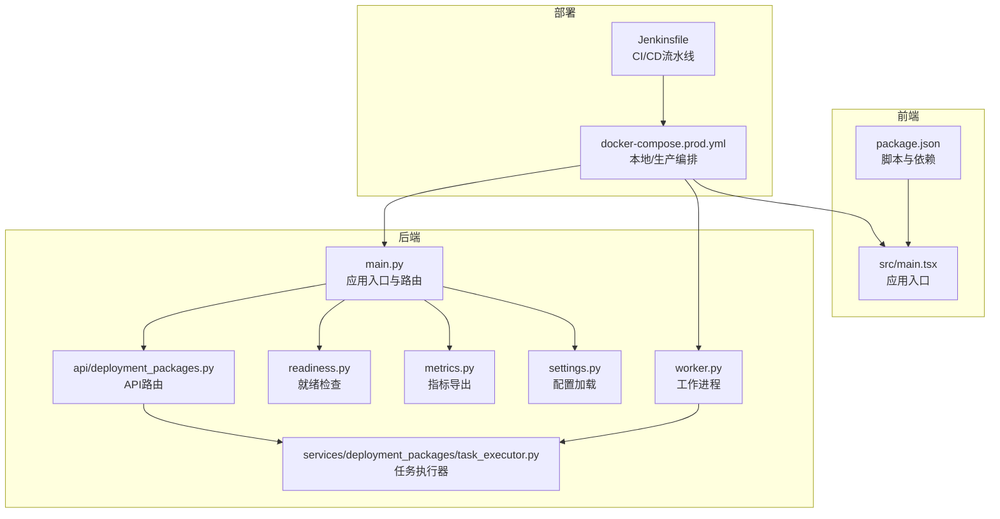
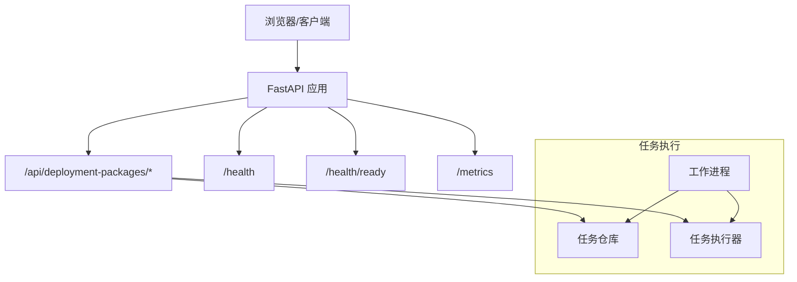
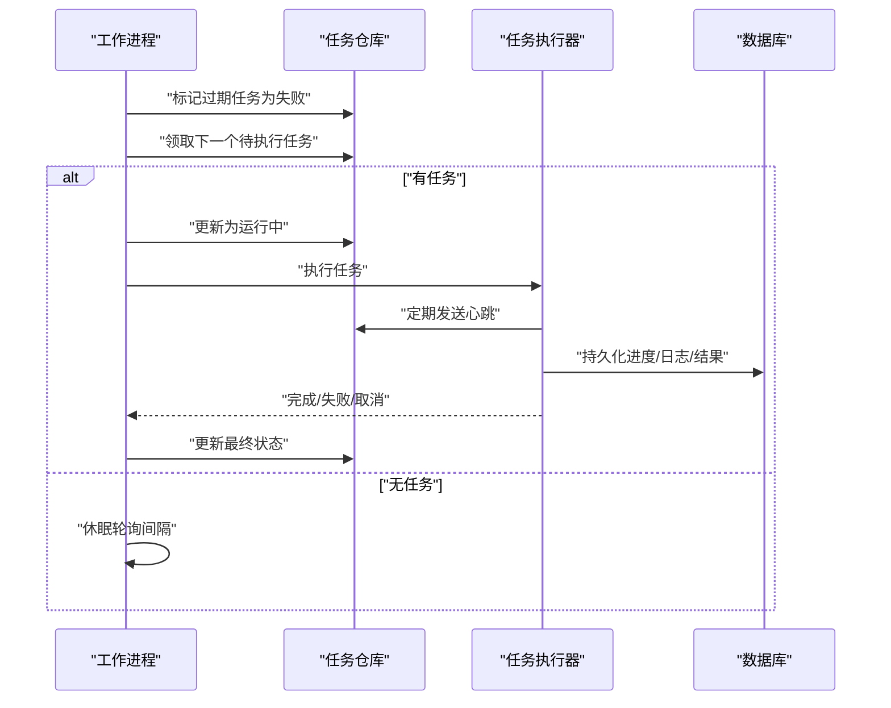
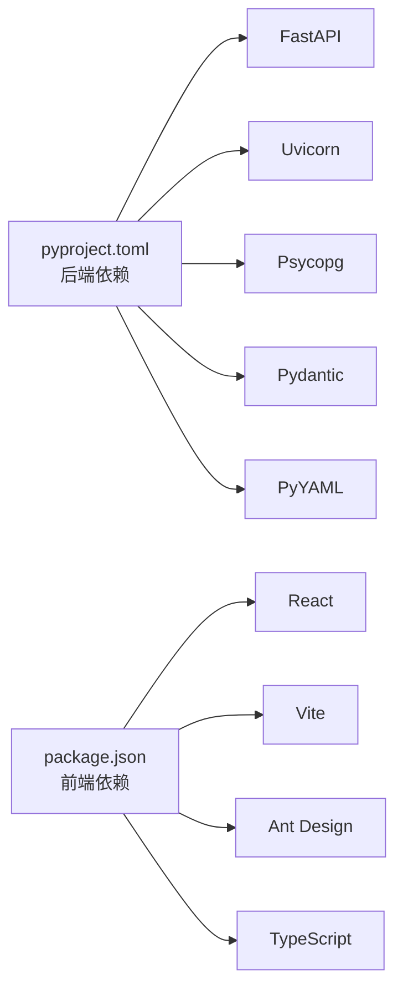

# 调试技巧

<cite>
**本文引用的文件**
- [backend/deployment_package_factory/main.py](file://backend/deployment_package_factory/main.py)
- [backend/deployment_package_factory/settings.py](file://backend/deployment_package_factory/settings.py)
- [backend/deployment_package_factory/worker.py](file://backend/deployment_package_factory/worker.py)
- [backend/deployment_package_factory/readiness.py](file://backend/deployment_package_factory/readiness.py)
- [backend/deployment_package_factory/metrics.py](file://backend/deployment_package_factory/metrics.py)
- [backend/deployment_package_factory/api/deployment_packages.py](file://backend/deployment_package_factory/api/deployment_packages.py)
- [backend/deployment_package_factory/services/deployment_packages/task_executor.py](file://backend/deployment_package_factory/services/deployment_packages/task_executor.py)
- [backend/pyproject.toml](file://backend/pyproject.toml)
- [frontend/package.json](file://frontend/package.json)
- [frontend/src/main.tsx](file://frontend/src/main.tsx)
- [deploy/docker-compose.prod.yml](file://deploy/docker-compose.prod.yml)
- [Jenkinsfile](file://Jenkinsfile)
- [scripts/dev-backend.ps1](file://scripts/dev-backend.ps1)
- [scripts/dev-frontend.ps1](file://scripts/dev-frontend.ps1)
</cite>

## 目录
1. [简介](#简介)
2. [项目结构](#项目结构)
3. [核心组件](#核心组件)
4. [架构总览](#架构总览)
5. [详细组件分析](#详细组件分析)
6. [依赖分析](#依赖分析)
7. [性能考虑](#性能考虑)
8. [故障排除指南](#故障排除指南)
9. [结论](#结论)
10. [附录](#附录)

## 简介
本指南面向部署包工厂项目的开发与运维人员，提供从Python后端到前端React应用、Docker容器、Kubernetes以及CI/CD流水线的全栈调试方法。内容覆盖断点调试、日志分析、性能分析、内存泄漏检测、FastAPI应用调试配置、数据库查询调试、异步任务调试、浏览器开发者工具、组件状态与网络请求监控、TypeScript错误排查、容器与K8s调试、以及CI/CD问题诊断与故障排除流程。

## 项目结构
- 后端采用FastAPI框架，提供健康检查、就绪检查、指标导出等接口，并通过工作进程执行异步构建任务。
- 前端基于Vite+React+Ant Design，提供多视图界面与运行时配置注入。
- 部署层使用docker-compose与Kubernetes清单，支持生产与测试环境。
- CI/CD通过Jenkinsfile编排镜像构建、推送、渲染部署配置与K8s部署验证。

图表来源
- [backend/deployment_package_factory/main.py:23-67](file://backend/deployment_package_factory/main.py#L23-L67)
- [backend/deployment_package_factory/settings.py:26-57](file://backend/deployment_package_factory/settings.py#L26-L57)
- [backend/deployment_package_factory/readiness.py:14-37](file://backend/deployment_package_factory/readiness.py#L14-L37)
- [backend/deployment_package_factory/metrics.py:4-33](file://backend/deployment_package_factory/metrics.py#L4-L33)
- [backend/deployment_package_factory/worker.py:19-58](file://backend/deployment_package_factory/worker.py#L19-L58)
- [backend/deployment_package_factory/api/deployment_packages.py:50-108](file://backend/deployment_package_factory/api/deployment_packages.py#L50-L108)
- [backend/deployment_package_factory/services/deployment_packages/task_executor.py:20-77](file://backend/deployment_package_factory/services/deployment_packages/task_executor.py#L20-L77)
- [frontend/package.json:7-11](file://frontend/package.json#L7-L11)
- [frontend/src/main.tsx:1-81](file://frontend/src/main.tsx#L1-L81)
- [deploy/docker-compose.prod.yml:1-65](file://deploy/docker-compose.prod.yml#L1-L65)
- [Jenkinsfile:1-258](file://Jenkinsfile#L1-L258)

章节来源
- [backend/deployment_package_factory/main.py:23-67](file://backend/deployment_package_factory/main.py#L23-L67)
- [deploy/docker-compose.prod.yml:1-65](file://deploy/docker-compose.prod.yml#L1-L65)

## 核心组件
- 应用入口与路由：定义CORS、挂载各模块路由、健康/就绪/指标端点。
- 配置加载：统一读取环境变量并校验默认值。
- 就绪检查：数据库连接、元数据存储可用性、输出目录可写性、镜像导出环境检查。
- 指标导出：Prometheus格式指标，便于外部监控。
- 工作进程：周期轮询任务、心跳、超时处理、并发控制。
- API路由：部署包预览、业务平台注册、后台任务触发等。
- 任务执行器：并发信号量、心跳循环、异常边界处理。

章节来源
- [backend/deployment_package_factory/main.py:23-67](file://backend/deployment_package_factory/main.py#L23-L67)
- [backend/deployment_package_factory/settings.py:26-57](file://backend/deployment_package_factory/settings.py#L26-L57)
- [backend/deployment_package_factory/readiness.py:14-37](file://backend/deployment_package_factory/readiness.py#L14-L37)
- [backend/deployment_package_factory/metrics.py:4-33](file://backend/deployment_package_factory/metrics.py#L4-L33)
- [backend/deployment_package_factory/worker.py:19-58](file://backend/deployment_package_factory/worker.py#L19-L58)
- [backend/deployment_package_factory/api/deployment_packages.py:50-108](file://backend/deployment_package_factory/api/deployment_packages.py#L50-L108)
- [backend/deployment_package_factory/services/deployment_packages/task_executor.py:20-77](file://backend/deployment_package_factory/services/deployment_packages/task_executor.py#L20-L77)

## 架构总览
后端由FastAPI应用驱动，通过API路由协调任务仓库与执行器；工作进程独立于HTTP服务，负责实际构建任务。前端通过Vite开发服务器运行，生产环境由Nginx提供静态资源。部署层通过docker-compose或Kubernetes管理后端、工作进程与前端服务。

图表来源
- [backend/deployment_package_factory/main.py:41-62](file://backend/deployment_package_factory/main.py#L41-L62)
- [backend/deployment_package_factory/api/deployment_packages.py:110-123](file://backend/deployment_package_factory/api/deployment_packages.py#L110-L123)
- [backend/deployment_package_factory/services/deployment_packages/task_executor.py:26-47](file://backend/deployment_package_factory/services/deployment_packages/task_executor.py#L26-L47)
- [backend/deployment_package_factory/worker.py:19-51](file://backend/deployment_package_factory/worker.py#L19-L51)

## 详细组件分析

### FastAPI应用调试配置
- 开发启动：使用Uvicorn热重载监听指定端口，便于快速迭代。
- CORS与路由：允许跨域访问，挂载多个子路由，便于分模块调试。
- 健康/就绪/指标：提供标准端点，便于容器健康检查与监控集成。
- 日志：建议在开发阶段开启更详细的日志级别，定位请求链路与异常。

调试要点
- 使用脚本启动后端，观察启动日志与端口绑定情况。
- 访问 /health 与 /health/ready 确认服务可用与就绪状态。
- 使用 /metrics 验证指标导出是否正常。

章节来源
- [scripts/dev-backend.ps1:6-6](file://scripts/dev-backend.ps1#L6-L6)
- [backend/deployment_package_factory/main.py:23-67](file://backend/deployment_package_factory/main.py#L23-L67)
- [backend/deployment_package_factory/readiness.py:14-37](file://backend/deployment_package_factory/readiness.py#L14-L37)
- [backend/deployment_package_factory/metrics.py:4-33](file://backend/deployment_package_factory/metrics.py#L4-L33)

### 数据库查询调试
- 配置加载：统一从环境变量读取数据库URL，确保连接字符串正确。
- 就绪检查：对元数据存储进行可达性与模式检查，失败时返回详细原因。
- 仓库初始化：API路由中按需延迟创建仓库实例，避免重复初始化。

调试要点
- 在就绪检查失败时，优先检查数据库URL与网络连通性。
- 使用最小权限账户验证连接，确认迁移与表存在。
- 对慢查询进行追踪，结合应用日志定位具体SQL与参数。

章节来源
- [backend/deployment_package_factory/settings.py:26-41](file://backend/deployment_package_factory/settings.py#L26-L41)
- [backend/deployment_package_factory/readiness.py:64-83](file://backend/deployment_package_factory/readiness.py#L64-L83)
- [backend/deployment_package_factory/api/deployment_packages.py:63-88](file://backend/deployment_package_factory/api/deployment_packages.py#L63-L88)

### 异步任务调试技巧（工作进程与执行器）
- 工作进程：周期轮询、心跳、超时标记失败任务、并发限制。
- 执行器：信号量控制并发、心跳循环、异常边界处理、取消与完成状态更新。
- 并发与资源：根据CPU/IO特性调整最大并发数与心跳间隔。

调试要点
- 观察工作进程日志中的“claim/running/heartbeat”事件，判断任务卡住位置。
- 使用任务ID在仓库中核对状态流转，定位异常分支。
- 在高并发场景下逐步降低并发，验证稳定性。

图表来源
- [backend/deployment_package_factory/worker.py:37-51](file://backend/deployment_package_factory/worker.py#L37-L51)
- [backend/deployment_package_factory/services/deployment_packages/task_executor.py:26-77](file://backend/deployment_package_factory/services/deployment_packages/task_executor.py#L26-L77)

章节来源
- [backend/deployment_package_factory/worker.py:19-58](file://backend/deployment_package_factory/worker.py#L19-L58)
- [backend/deployment_package_factory/services/deployment_packages/task_executor.py:20-77](file://backend/deployment_package_factory/services/deployment_packages/task_executor.py#L20-L77)

### 前端React应用调试方法
- 开发服务器：Vite提供热更新与TypeScript类型检查。
- 组件入口：根节点挂载多标签页视图，便于分模块调试。
- 运行时配置：通过注入脚本提供前端运行时参数，便于切换后端地址与令牌。

调试要点
- 浏览器开发者工具：Network面板监控API调用，Console查看TypeScript错误，Elements检查DOM结构，Performance分析渲染性能。
- 组件状态：利用React DevTools查看组件树与状态变化，定位不必要重渲染。
- 网络请求：拦截与模拟请求，验证鉴权头与响应格式。
- TypeScript：启用严格模式，修复未使用变量与类型不匹配问题。

章节来源
- [frontend/package.json:7-11](file://frontend/package.json#L7-L11)
- [frontend/src/main.tsx:1-81](file://frontend/src/main.tsx#L1-L81)

### Docker容器调试技巧
- 本地编排：通过docker-compose定义后端、工作进程与前端服务，暴露健康检查与端口映射。
- 健康检查：后端容器内置就绪探针，确保依赖可用后再对外提供服务。
- 卷与环境：数据卷用于持久化产物，环境变量集中管理配置。

调试要点
- 使用docker compose logs查看容器日志，定位启动失败与异常。
- 进入容器执行curl或python脚本验证内部端点与指标。
- 检查卷挂载路径与权限，确认输出目录可写。

章节来源
- [deploy/docker-compose.prod.yml:18-22](file://deploy/docker-compose.prod.yml#L18-L22)
- [deploy/docker-compose.prod.yml:42-44](file://deploy/docker-compose.prod.yml#L42-L44)

### Kubernetes调试方法
- 渲染与部署：Jenkins流水线渲染K8s清单并应用，包含命名空间、Secret、Deployment与Service。
- 就绪与滚动：通过kubectl rollout status监控部署状态，describe定位事件与错误。
- 探测与日志：就绪探针与存活探针配合，容器日志与事件是主要线索。

调试要点
- 使用kubectl get pods/rollout describe定位Pod状态与事件。
- 查看后端容器内健康/指标端点，确认内部服务可用。
- 检查Secret与镜像拉取密钥配置，避免拉取失败。

章节来源
- [Jenkinsfile:204-221](file://Jenkinsfile#L204-L221)
- [Jenkinsfile:223-244](file://Jenkinsfile#L223-L244)

### CI/CD流水线问题诊断
- 参数与凭据：Registry、仓库、镜像Tag、Kubeconfig路径、数据库URL与API Token等。
- 阶段化流程：准备、构建镜像、推送、渲染部署、部署到K8s、冒烟测试。
- 冒烟测试：就绪检查、指标导出、关键API鉴权访问。

调试要点
- 分阶段执行并保留中间产物，定位失败阶段。
- 在渲染与部署前打印关键变量，核对环境一致性。
- 冒烟测试失败时，先检查后端就绪端点与鉴权头。

章节来源
- [Jenkinsfile:10-26](file://Jenkinsfile#L10-L26)
- [Jenkinsfile:86-109](file://Jenkinsfile#L86-L109)
- [Jenkinsfile:204-244](file://Jenkinsfile#L204-L244)

## 依赖分析
- 后端依赖：FastAPI、Uvicorn、Pydantic、PyYAML、Psycopg等，测试与HTTP工具在开发依赖中。
- 前端依赖：React、Vite、Ant Design、TypeScript等，开发脚本提供本地开发与预览。
- 配置耦合：后端通过settings统一读取环境变量，API路由与工作进程共享配置对象。

图表来源
- [backend/pyproject.toml:6-12](file://backend/pyproject.toml#L6-L12)
- [frontend/package.json:12-24](file://frontend/package.json#L12-L24)

章节来源
- [backend/pyproject.toml:1-30](file://backend/pyproject.toml#L1-L30)
- [frontend/package.json:1-26](file://frontend/package.json#L1-L26)

## 性能考虑
- 并发与限流：工作进程与执行器通过信号量限制并发，避免资源争用。
- 心跳与超时：合理的心跳间隔与任务超时，防止僵尸任务占用资源。
- 指标监控：导出Prometheus指标，结合外部监控系统进行趋势分析。
- I/O优化：输出目录与数据库I/O应位于高性能存储，避免成为瓶颈。

章节来源
- [backend/deployment_package_factory/services/deployment_packages/task_executor.py:24-24](file://backend/deployment_package_factory/services/deployment_packages/task_executor.py#L24-L24)
- [backend/deployment_package_factory/worker.py:25-30](file://backend/deployment_package_factory/worker.py#L25-L30)
- [backend/deployment_package_factory/metrics.py:4-33](file://backend/deployment_package_factory/metrics.py#L4-L33)

## 故障排除指南
- 启动失败
  - 检查后端端口占用与CORS配置。
  - 核对数据库URL与网络连通性。
  - 查看容器日志与K8s事件。
- 就绪失败
  - 关注就绪检查项：数据库URL、元数据存储、输出目录可写、镜像导出环境。
- 任务卡住
  - 检查工作进程日志与心跳频率。
  - 核对任务状态与取消标志。
- 指标缺失
  - 确认/health/ready返回200，/metrics可访问。
- 前端无法访问
  - 核对前端运行时配置注入与后端API基础URL。
  - 检查浏览器Network面板与CORS策略。
- CI/CD失败
  - 分阶段回溯，重点检查渲染与部署阶段的变量与凭据。

章节来源
- [backend/deployment_package_factory/readiness.py:14-37](file://backend/deployment_package_factory/readiness.py#L14-L37)
- [backend/deployment_package_factory/worker.py:37-51](file://backend/deployment_package_factory/worker.py#L37-L51)
- [Jenkinsfile:223-244](file://Jenkinsfile#L223-L244)

## 结论
通过统一的配置加载、清晰的就绪检查、完善的指标导出与并发可控的任务执行机制，部署包工厂具备良好的可观测性与可调试性。结合容器与Kubernetes的健康检查、Jenkins流水线的阶段化验证，能够快速定位并解决问题。建议在开发与测试环境中持续完善日志与指标，形成闭环的调试与监控体系。

## 附录
- 调试工具推荐
  - Python：pdb、日志级别、pytest、httpx。
  - 前端：React DevTools、Vite Dev Server、浏览器Network/Performance。
  - 容器/K8s：docker compose logs/exec、kubectl get/describe/rollout。
  - 监控：Prometheus/Grafana、APM（如需要）。
- 常见问题定位流程
  - 从健康/就绪端点开始，逐步深入到指标与日志。
  - 对照配置文件与环境变量，确保一致性。
  - 在流水线中分阶段验证，保留关键日志与产物。