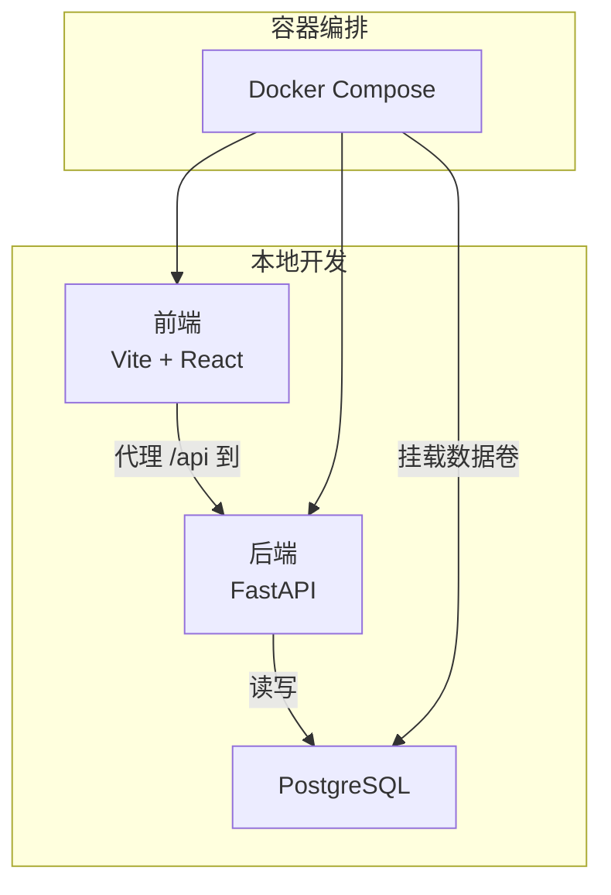
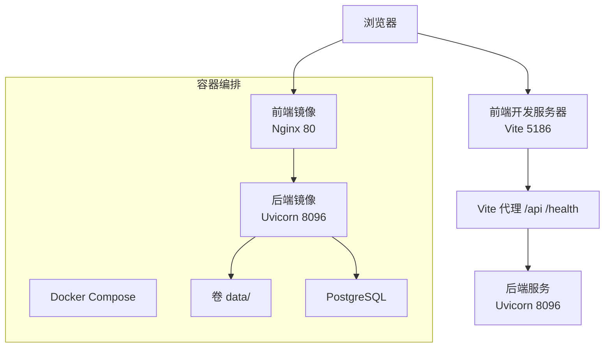
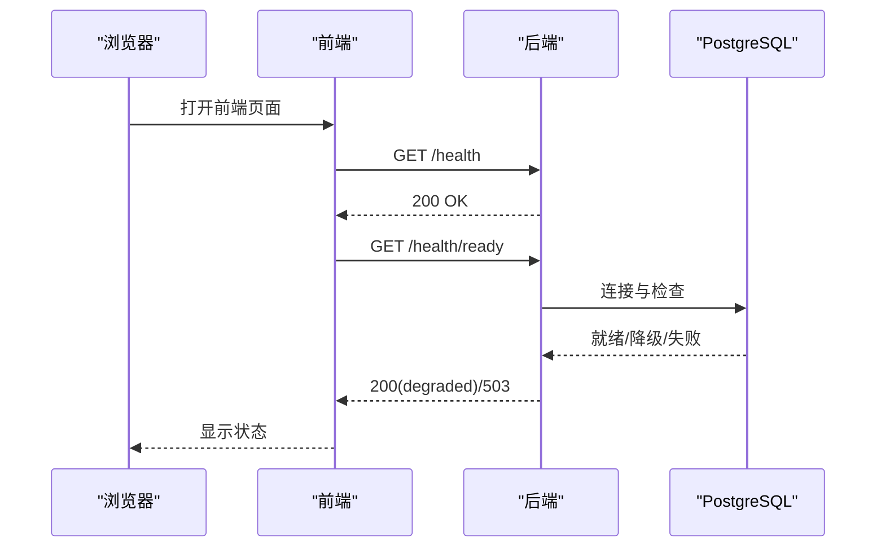
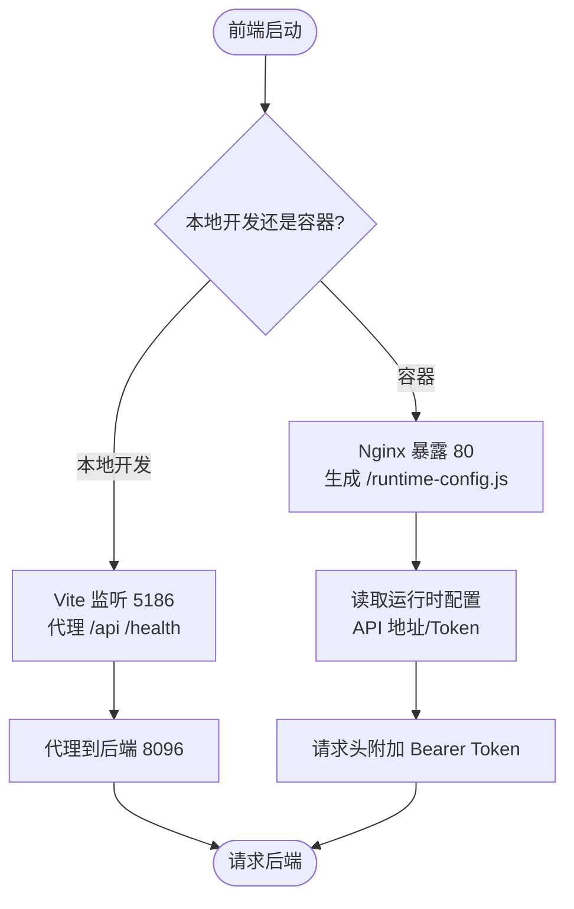
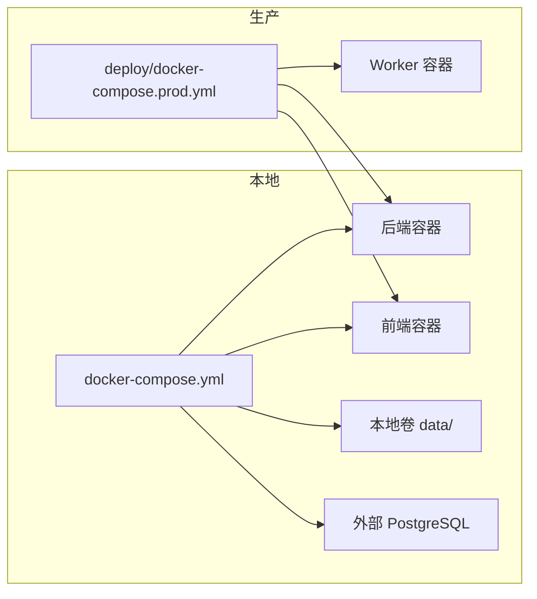

# 快速开始

<cite>
**本文引用的文件**
- [README.md](file://README.md)
- [docker-compose.yml](file://docker-compose.yml)
- [deploy/README.md](file://deploy/README.md)
- [deploy/docker-compose.prod.yml](file://deploy/docker-compose.prod.yml)
- [backend/Dockerfile](file://backend/Dockerfile)
- [frontend/Dockerfile](file://frontend/Dockerfile)
- [backend/pyproject.toml](file://backend/pyproject.toml)
- [frontend/package.json](file://frontend/package.json)
- [frontend/vite.config.ts](file://frontend/vite.config.ts)
- [backend/deployment_package_factory/main.py](file://backend/deployment_package_factory/main.py)
- [backend/deployment_package_factory/settings.py](file://backend/deployment_package_factory/settings.py)
- [frontend/public/runtime-config.js](file://frontend/public/runtime-config.js)
- [frontend/src/api/client.ts](file://frontend/src/api/client.ts)
- [frontend/src/main.tsx](file://frontend/src/main.tsx)
- [scripts/dev-backend.ps1](file://scripts/dev-backend.ps1)
- [scripts/dev-frontend.ps1](file://scripts/dev-frontend.ps1)
</cite>

## 目录
1. [简介](#简介)
2. [项目结构](#项目结构)
3. [核心组件](#核心组件)
4. [架构总览](#架构总览)
5. [详细组件分析](#详细组件分析)
6. [依赖分析](#依赖分析)
7. [性能考虑](#性能考虑)
8. [故障排除指南](#故障排除指南)
9. [结论](#结论)
10. [附录](#附录)

## 简介
本指南面向不同技术水平的用户，帮助您在本地快速完成环境搭建与验证，涵盖本地开发、依赖安装、数据库准备、前后端启动与代理配置，以及 Docker Compose 一键部署。完成后，您将能够访问前端界面并进行基本的导包任务验证。

## 项目结构
- 后端：独立的 FastAPI 服务，提供导包任务、审计、微服务注册等接口。
- 前端：独立的 Vite + React 页面，提供导包向导、微服务注册、系统设置与环境清理等功能。
- 模板与目录：templates/catalog 提供平台、产品、中间件与项目模板；deploy 提供生产部署清单与一键部署脚本。
- 数据目录：默认在本地 data/ 目录下生成运行时数据与导包产物。

图表来源
- [docker-compose.yml:1-36](file://docker-compose.yml#L1-L36)
- [backend/Dockerfile:1-36](file://backend/Dockerfile#L1-L36)
- [frontend/Dockerfile:1-32](file://frontend/Dockerfile#L1-L32)

章节来源
- [README.md:5-11](file://README.md#L5-L11)
- [docker-compose.yml:1-36](file://docker-compose.yml#L1-L36)

## 核心组件
- 后端服务
  - 使用 Uvicorn 运行，监听 8096 端口，提供健康检查、就绪检查与 Prometheus 指标端点。
  - 通过环境变量控制数据目录、数据库连接、API Token、并发与清理策略等。
- 前端服务
  - Vite 开发服务器默认监听 5186 端口，通过代理将 /api 与 /health 请求转发至后端。
  - 构建产物由 Nginx 提供静态服务，默认暴露 80 端口。
- 数据库
  - 需要 PostgreSQL 连接串，用于保存任务、审计、注册与元数据。
- 容器化
  - docker-compose.yml 提供本地一键启动；deploy/docker-compose.prod.yml 提供生产镜像与网络配置。

章节来源
- [backend/deployment_package_factory/main.py:41-62](file://backend/deployment_package_factory/main.py#L41-L62)
- [backend/deployment_package_factory/settings.py:26-57](file://backend/deployment_package_factory/settings.py#L26-L57)
- [frontend/vite.config.ts:35-40](file://frontend/vite.config.ts#L35-L40)
- [backend/Dockerfile:33-35](file://backend/Dockerfile#L33-L35)
- [frontend/Dockerfile:30-32](file://frontend/Dockerfile#L30-L32)
- [docker-compose.yml:6-17](file://docker-compose.yml#L6-L17)

## 架构总览
下图展示本地与容器两种运行模式的关键交互：前端通过代理访问后端 API，后端连接数据库并写入本地或容器卷的数据目录。

图表来源
- [frontend/vite.config.ts:35-40](file://frontend/vite.config.ts#L35-L40)
- [backend/Dockerfile:33-35](file://backend/Dockerfile#L33-L35)
- [frontend/Dockerfile:30-32](file://frontend/Dockerfile#L30-L32)
- [docker-compose.yml:1-36](file://docker-compose.yml#L1-L36)

## 详细组件分析

### 后端（FastAPI）
- 启动与端口
  - 本地开发：使用 uvicorn 在 8096 端口启动，支持热更新。
  - 容器：镜像以 Uvicorn 运行，暴露 8096 端口。
- 关键端点
  - /health：基础健康检查。
  - /health/ready：就绪检查，验证数据库、元数据仓库、产物目录写入与镜像导出工具状态。
  - /metrics：Prometheus 文本格式指标。
- 配置加载
  - 通过环境变量加载数据目录、数据库连接、输出目录、API Token、并发与清理策略等。
- 任务执行模式
  - 本地默认后台任务模式；生产可切换为 worker 模式，由独立 worker 领取与执行任务。

图表来源
- [backend/deployment_package_factory/main.py:41-55](file://backend/deployment_package_factory/main.py#L41-L55)
- [backend/deployment_package_factory/settings.py:26-57](file://backend/deployment_package_factory/settings.py#L26-L57)

章节来源
- [backend/deployment_package_factory/main.py:23-68](file://backend/deployment_package_factory/main.py#L23-L68)
- [backend/Dockerfile:33-35](file://backend/Dockerfile#L33-L35)
- [backend/pyproject.toml:1-30](file://backend/pyproject.toml#L1-L30)

### 前端（React + Vite）
- 启动与端口
  - 本地开发：Vite 监听 5186 端口，支持热更新。
  - 容器：Nginx 提供静态服务，暴露 80 端口。
- 代理配置
  - 将 /api 与 /health 请求代理到后端 8096 端口，便于本地联调。
- 运行时配置
  - 前端容器启动时生成 /runtime-config.js，优先读取后端注入的 API 地址与 Token；本地开发可通过 Vite 环境变量兜底。
- 认证头
  - 若配置了 API Token，请求头会自动附加 Bearer Token。

图表来源
- [frontend/vite.config.ts:35-40](file://frontend/vite.config.ts#L35-L40)
- [frontend/public/runtime-config.js:1-5](file://frontend/public/runtime-config.js#L1-L5)
- [frontend/src/api/client.ts:24-43](file://frontend/src/api/client.ts#L24-L43)

章节来源
- [frontend/package.json:8-10](file://frontend/package.json#L8-L10)
- [frontend/Dockerfile:20-32](file://frontend/Dockerfile#L20-L32)
- [frontend/vite.config.ts:35-40](file://frontend/vite.config.ts#L35-L40)
- [frontend/public/runtime-config.js:1-5](file://frontend/public/runtime-config.js#L1-L5)
- [frontend/src/api/client.ts:24-67](file://frontend/src/api/client.ts#L24-L67)

### 数据库（PostgreSQL）
- 连接串
  - 必填项，用于保存任务、审计、注册与元数据。
- 本地与容器
  - 本地开发需自备 PostgreSQL 实例；docker-compose.yml 通过环境变量注入连接串。
- 就绪检查
  - /health/ready 会验证数据库连通性与元数据仓库可用性。

章节来源
- [README.md:73](file://README.md#L73)
- [docker-compose.yml:10](file://docker-compose.yml#L10)
- [backend/deployment_package_factory/main.py:45-55](file://backend/deployment_package_factory/main.py#L45-L55)

### 容器化部署（Docker Compose）
- 本地一键启动
  - docker-compose.yml 提供后端、前端与健康检查；后端容器暴露 8096，前端映射 5186。
- 生产镜像与网络
  - deploy/docker-compose.prod.yml 提供独立后端、worker 与前端镜像，使用自定义网络与命名卷。
- 环境变量
  - 包括数据目录、数据库连接、API Token、并发、清理策略、镜像仓库凭据等。

图表来源
- [docker-compose.yml:1-36](file://docker-compose.yml#L1-L36)
- [deploy/docker-compose.prod.yml:1-65](file://deploy/docker-compose.prod.yml#L1-L65)

章节来源
- [docker-compose.yml:1-36](file://docker-compose.yml#L1-L36)
- [deploy/docker-compose.prod.yml:1-65](file://deploy/docker-compose.prod.yml#L1-L65)

## 依赖分析
- 后端依赖
  - FastAPI、Uvicorn、Pydantic、PyYAML、psycopg 等，测试与开发依赖分离。
- 前端依赖
  - React、Vite、Ant Design、TypeScript 等，开发脚本提供 dev/build/preview。
- 容器镜像
  - 后端镜像内置 skopeo 与证书，便于离线镜像导出；前端镜像基于 Node 构建、Nginx 提供静态服务。

章节来源
- [backend/pyproject.toml:6-18](file://backend/pyproject.toml#L6-L18)
- [frontend/package.json:12-24](file://frontend/package.json#L12-L24)
- [backend/Dockerfile:13-18](file://backend/Dockerfile#L13-L18)
- [frontend/Dockerfile:15-26](file://frontend/Dockerfile#L15-L26)

## 性能考虑
- 并发与队列
  - 通过环境变量控制最大并发构建数，避免资源争用。
- 指标监控
  - /metrics 提供任务总数、按状态分组的任务数、产物数量与字节数、审计事件计数等，便于观察系统负载。
- 镜像导出
  - 生产优先使用 skopeo 无守护导出，减少对 Docker daemon 的依赖；本地回退到 Docker CLI。

章节来源
- [README.md:78-86](file://README.md#L78-L86)
- [README.md:109-115](file://README.md#L109-L115)
- [README.md:139-151](file://README.md#L139-L151)

## 故障排除指南
- 健康检查失败
  - 使用 /health/ready 检查数据库、元数据仓库、产物目录写入与镜像导出工具状态；失败时返回 503，降级时返回 degraded。
- 数据库连接问题
  - 确认 DEPLOYMENT_PACKAGE_DATABASE_URL 正确；docker-compose.yml 中已注入该变量。
- 前端无法访问后端
  - 确认 Vite 代理配置 /api 与 /health 指向 8096；容器模式下确认前端容器已依赖后端且健康。
- API Token 未生效
  - 确认前端运行时配置或 Vite 环境变量已设置；后端若启用 API Token，请求头需包含 Bearer Token。
- 端口冲突
  - 本地开发端口 8096（后端）、5186（前端），请确保未被占用。
- Worker 模式任务卡住
  - 检查 worker 心跳与轮询间隔配置，超时后会标记失败以便重试。

章节来源
- [backend/deployment_package_factory/main.py:41-55](file://backend/deployment_package_factory/main.py#L41-L55)
- [docker-compose.yml:18-22](file://docker-compose.yml#L18-L22)
- [frontend/vite.config.ts:35-40](file://frontend/vite.config.ts#L35-L40)
- [frontend/src/api/client.ts:24-43](file://frontend/src/api/client.ts#L24-L43)
- [README.md:75-77](file://README.md#L75-L77)

## 结论
通过本指南，您可以完成本地开发环境搭建、依赖安装、数据库准备与前后端启动验证，并掌握 Docker Compose 一键部署方法。遇到问题时，可依据健康检查与日志定位，结合环境变量与代理配置逐步排查。

## 附录

### 环境搭建步骤（本地开发）
- 安装依赖
  - 后端：进入 backend 目录，使用 uvicorn 启动服务。
  - 前端：进入 frontend 目录，安装依赖并启动开发服务器。
- 配置数据库
  - 设置 DEPLOYMENT_PACKAGE_DATABASE_URL 环境变量，指向可用的 PostgreSQL 实例。
- 启动与验证
  - 访问 http://127.0.0.1:5186，确认前端可访问后端 /health 与 /health/ready。
- 代理设置
  - Vite 已将 /api 与 /health 代理到后端 8096 端口。

章节来源
- [scripts/dev-backend.ps1:6](file://scripts/dev-backend.ps1#L6)
- [scripts/dev-frontend.ps1:6](file://scripts/dev-frontend.ps1#L6)
- [README.md:14-29](file://README.md#L14-L29)
- [frontend/vite.config.ts:35-40](file://frontend/vite.config.ts#L35-L40)

### Docker Compose 一键部署
- 本地一键启动
  - 在仓库根目录执行 docker compose up --build，等待后端健康检查通过后访问前端。
- 生产部署
  - 使用 deploy/docker-compose.prod.yml，配合 scripts/validate-deploy-config.sh 与生成的 factory.env 完成部署。
- 网络与卷
  - 生产镜像使用自定义网络与命名卷 deployment-package-data，确保后端与 worker 可共享产物目录。

章节来源
- [README.md:31-38](file://README.md#L31-L38)
- [deploy/README.md:63-96](file://deploy/README.md#L63-L96)
- [deploy/docker-compose.prod.yml:1-65](file://deploy/docker-compose.prod.yml#L1-L65)

### 前后端启动命令与端口
- 后端
  - 本地：uvicorn deployment_package_factory.main:app --reload --port 8096
  - 容器：镜像暴露 8096 端口
- 前端
  - 本地：Vite dev 监听 5186，代理 /api 与 /health
  - 容器：Nginx 暴露 80 端口

章节来源
- [README.md:14-29](file://README.md#L14-L29)
- [backend/Dockerfile:33-35](file://backend/Dockerfile#L33-L35)
- [frontend/Dockerfile:30-32](file://frontend/Dockerfile#L30-L32)
- [frontend/package.json:8](file://frontend/package.json#L8)
- [frontend/vite.config.ts:35-40](file://frontend/vite.config.ts#L35-L40)

### API 与认证
- 认证方式
  - 前端请求头附加 Bearer Token；也可通过查询参数携带 token。
- 关键端点
  - /health、/health/ready、/metrics、导包任务管理、审计事件、清理过期产物、下载部署包等。

章节来源
- [frontend/src/api/client.ts:24-67](file://frontend/src/api/client.ts#L24-L67)
- [backend/deployment_package_factory/main.py:41-62](file://backend/deployment_package_factory/main.py#L41-L62)
- [README.md:283-322](file://README.md#L283-L322)