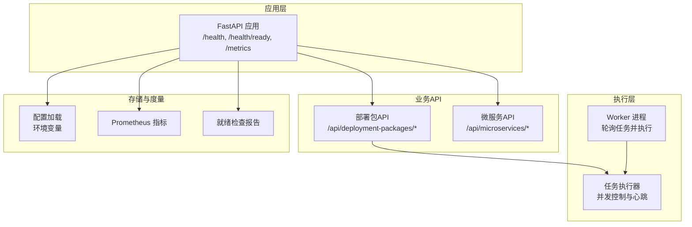
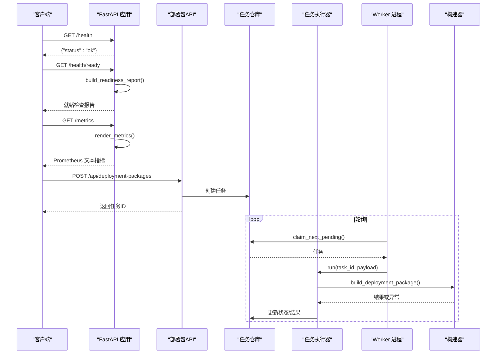
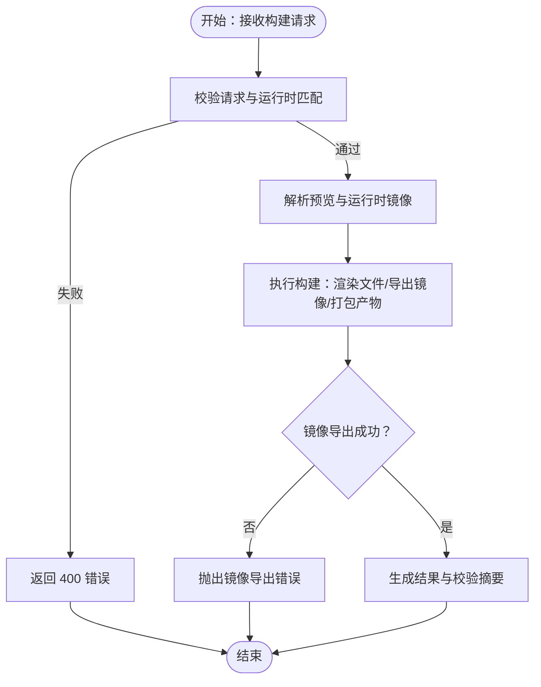
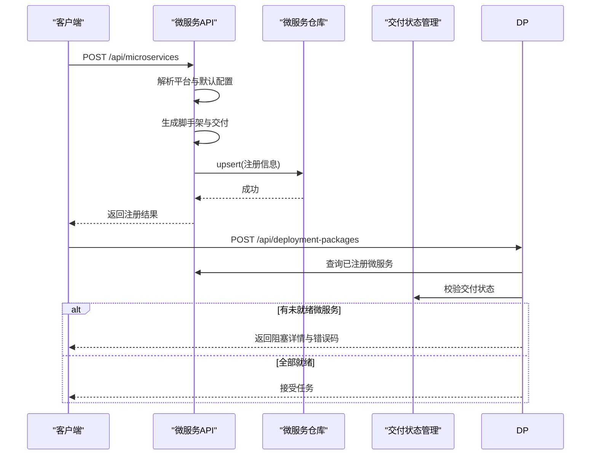
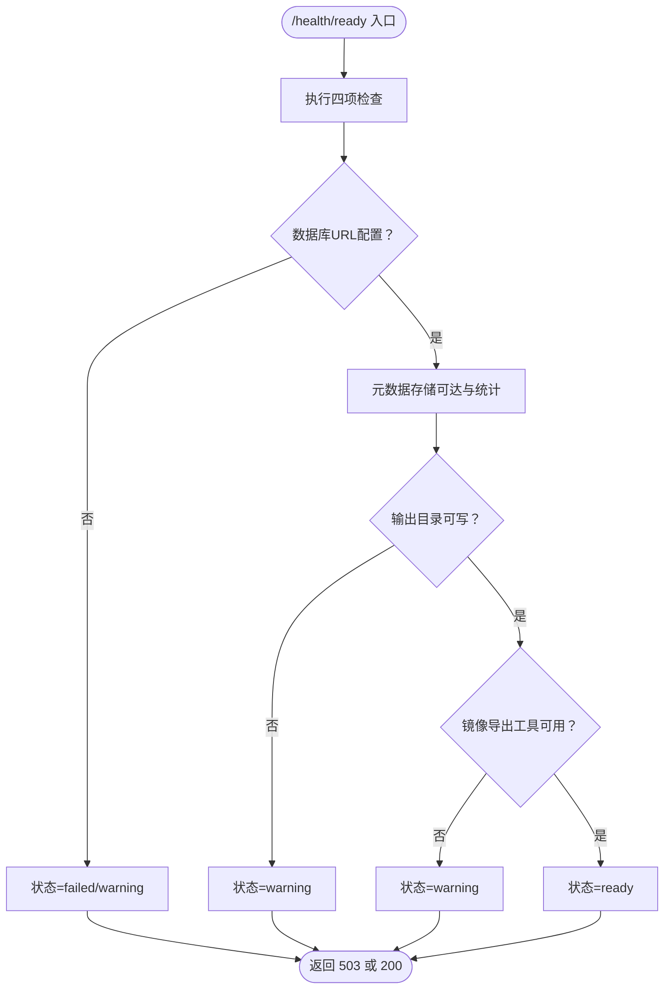
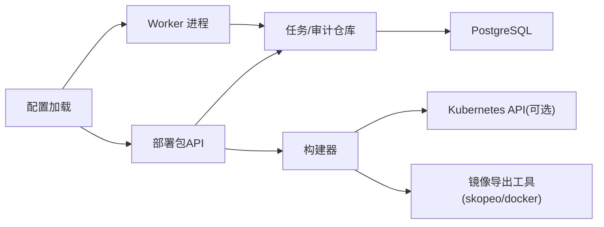

# 常见问题诊断

<cite>
**本文引用的文件**
- [backend/deployment_package_factory/main.py](file://backend/deployment_package_factory/main.py)
- [backend/deployment_package_factory/readiness.py](file://backend/deployment_package_factory/readiness.py)
- [backend/deployment_package_factory/metrics.py](file://backend/deployment_package_factory/metrics.py)
- [backend/deployment_package_factory/settings.py](file://backend/deployment_package_factory/settings.py)
- [backend/deployment_package_factory/worker.py](file://backend/deployment_package_factory/worker.py)
- [backend/deployment_package_factory/api/deployment_packages.py](file://backend/deployment_package_factory/api/deployment_packages.py)
- [backend/deployment_package_factory/services/deployment_packages/builder.py](file://backend/deployment_package_factory/services/deployment_packages/builder.py)
- [backend/deployment_package_factory/services/deployment_packages/models.py](file://backend/deployment_package_factory/services/deployment_packages/models.py)
- [backend/deployment_package_factory/services/deployment_packages/task_executor.py](file://backend/deployment_package_factory/services/deployment_packages/task_executor.py)
- [backend/deployment_package_factory/services/deployment_packages/cleanup.py](file://backend/deployment_package_factory/services/deployment_packages/cleanup.py)
- [backend/deployment_package_factory/api/microservices.py](file://backend/deployment_package_factory/api/microservices.py)
- [backend/deployment_package_factory/services/microservices/repository.py](file://backend/deployment_package_factory/services/microservices/repository.py)
- [backend/deployment_package_factory/services/deployment_packages/microservice_delivery.py](file://backend/deployment_package_factory/services/deployment_packages/microservice_delivery.py)
</cite>

## 目录
1. [简介](#简介)
2. [项目结构](#项目结构)
3. [核心组件](#核心组件)
4. [架构总览](#架构总览)
5. [详细组件分析](#详细组件分析)
6. [依赖关系分析](#依赖关系分析)
7. [性能考量](#性能考量)
8. [故障排查指南](#故障排查指南)
9. [结论](#结论)
10. [附录](#附录)

## 简介
本文件面向部署包工厂系统的运维与开发人员，提供常见问题的诊断流程与解决方案。内容覆盖部署包生成失败、微服务注册异常、系统设置错误、环境清理失败等典型问题，并结合健康检查端点、监控指标与日志分析，帮助快速定位根因。同时给出构建超时、镜像导出失败、文件渲染错误等典型场景的排查步骤，以及通过系统状态检查与依赖验证进行快速识别的方法。

## 项目结构
后端采用 FastAPI 应用，提供部署包与微服务相关 API；工作进程负责后台任务执行；健康检查与指标端点用于系统可观测性；配置由环境变量加载，支持多种执行模式（后台/工作进程）。

图表来源
- [backend/deployment_package_factory/main.py:23-68](file://backend/deployment_package_factory/main.py#L23-L68)
- [backend/deployment_package_factory/worker.py:19-63](file://backend/deployment_package_factory/worker.py#L19-L63)
- [backend/deployment_package_factory/services/deployment_packages/task_executor.py:20-77](file://backend/deployment_package_factory/services/deployment_packages/task_executor.py#L20-L77)
- [backend/deployment_package_factory/metrics.py:4-38](file://backend/deployment_package_factory/metrics.py#L4-L38)
- [backend/deployment_package_factory/readiness.py:14-102](file://backend/deployment_package_factory/readiness.py#L14-L102)
- [backend/deployment_package_factory/settings.py:26-57](file://backend/deployment_package_factory/settings.py#L26-L57)

章节来源
- [backend/deployment_package_factory/main.py:23-68](file://backend/deployment_package_factory/main.py#L23-L68)
- [backend/deployment_package_factory/settings.py:26-57](file://backend/deployment_package_factory/settings.py#L26-L57)

## 核心组件
- 应用入口与路由：提供健康检查、就绪检查、指标导出与各业务 API 路由。
- 配置系统：从环境变量读取数据目录、输出目录、数据库连接、并发与超时等参数。
- 工作进程：按轮询间隔拉取待执行任务，执行构建并上报心跳。
- 任务执行器：控制并发、标记运行状态、记录日志与结果。
- 部署包构建器：解析请求、发现运行时镜像与环境、渲染模板、导出镜像归档、打包产物。
- 微服务仓库：基于 PostgreSQL 存储微服务注册元数据。
- 就绪检查：校验数据库、元数据存储、输出目录可写、镜像导出工具可用性。
- 指标导出：统计任务总数、按状态计数、审计事件计数等。

章节来源
- [backend/deployment_package_factory/main.py:23-68](file://backend/deployment_package_factory/main.py#L23-L68)
- [backend/deployment_package_factory/settings.py:26-57](file://backend/deployment_package_factory/settings.py#L26-L57)
- [backend/deployment_package_factory/worker.py:19-63](file://backend/deployment_package_factory/worker.py#L19-L63)
- [backend/deployment_package_factory/services/deployment_packages/task_executor.py:20-77](file://backend/deployment_package_factory/services/deployment_packages/task_executor.py#L20-L77)
- [backend/deployment_package_factory/services/deployment_packages/builder.py:146-247](file://backend/deployment_package_factory/services/deployment_packages/builder.py#L146-L247)
- [backend/deployment_package_factory/services/microservices/repository.py:15-164](file://backend/deployment_package_factory/services/microservices/repository.py#L15-L164)
- [backend/deployment_package_factory/readiness.py:14-102](file://backend/deployment_package_factory/readiness.py#L14-L102)
- [backend/deployment_package_factory/metrics.py:4-38](file://backend/deployment_package_factory/metrics.py#L4-L38)

## 架构总览
下图展示从客户端到后端服务、工作进程与构建器的整体调用链路，以及健康检查与指标导出的关键节点。

图表来源
- [backend/deployment_package_factory/main.py:41-62](file://backend/deployment_package_factory/main.py#L41-L62)
- [backend/deployment_package_factory/readiness.py:14-37](file://backend/deployment_package_factory/readiness.py#L14-L37)
- [backend/deployment_package_factory/metrics.py:4-33](file://backend/deployment_package_factory/metrics.py#L4-L33)
- [backend/deployment_package_factory/api/deployment_packages.py:245-282](file://backend/deployment_package_factory/api/deployment_packages.py#L245-L282)
- [backend/deployment_package_factory/worker.py:19-51](file://backend/deployment_package_factory/worker.py#L19-L51)
- [backend/deployment_package_factory/services/deployment_packages/task_executor.py:26-47](file://backend/deployment_package_factory/services/deployment_packages/task_executor.py#L26-L47)
- [backend/deployment_package_factory/services/deployment_packages/builder.py:146-247](file://backend/deployment_package_factory/services/deployment_packages/builder.py#L146-L247)

## 详细组件分析

### 组件A：部署包构建流程与错误类型
- 典型错误类型
  - 请求校验失败：如项目键未知、版本不支持、运行时镜像缺失且要求运行时来源。
  - 目录/权限问题：输出目录不可写。
  - 镜像导出工具不可用：既无 skopeo 也无可用 Docker。
  - 并发与超时：并发过高导致资源争用，或运行超时被标记失败。
- 关键路径
  - 预览与校验：预览解析、运行时匹配、微服务交付状态校验。
  - 构建执行：渲染文件、导出镜像归档、打包产物、生成校验摘要。
  - 清理策略：按保留天数与总量阈值清理过期产物与工作目录。

图表来源
- [backend/deployment_package_factory/api/deployment_packages.py:126-165](file://backend/deployment_package_factory/api/deployment_packages.py#L126-L165)
- [backend/deployment_package_factory/services/deployment_packages/builder.py:146-247](file://backend/deployment_package_factory/services/deployment_packages/builder.py#L146-L247)
- [backend/deployment_package_factory/services/deployment_packages/builder.py:105-143](file://backend/deployment_package_factory/services/deployment_packages/builder.py#L105-L143)

章节来源
- [backend/deployment_package_factory/api/deployment_packages.py:126-165](file://backend/deployment_package_factory/api/deployment_packages.py#L126-L165)
- [backend/deployment_package_factory/services/deployment_packages/builder.py:105-143](file://backend/deployment_package_factory/services/deployment_packages/builder.py#L105-L143)
- [backend/deployment_package_factory/services/deployment_packages/builder.py:146-247](file://backend/deployment_package_factory/services/deployment_packages/builder.py#L146-L247)

### 组件B：微服务注册与交付状态
- 注册流程
  - 解析业务平台命名空间与默认配置。
  - 生成脚手架、准备交付状态、落库。
- 交付状态校验
  - 若微服务未构建成功，阻止部署包创建并返回阻塞详情。
- 仓库行为
  - 基于 PostgreSQL 存储微服务元数据，支持查询、更新与索引。

图表来源
- [backend/deployment_package_factory/api/microservices.py:52-67](file://backend/deployment_package_factory/api/microservices.py#L52-L67)
- [backend/deployment_package_factory/services/microservices/repository.py:15-89](file://backend/deployment_package_factory/services/microservices/repository.py#L15-L89)
- [backend/deployment_package_factory/services/deployment_packages/microservice_delivery.py:46-54](file://backend/deployment_package_factory/services/deployment_packages/microservice_delivery.py#L46-L54)

章节来源
- [backend/deployment_package_factory/api/microservices.py:52-67](file://backend/deployment_package_factory/api/microservices.py#L52-L67)
- [backend/deployment_package_factory/services/microservices/repository.py:15-89](file://backend/deployment_package_factory/services/microservices/repository.py#L15-L89)
- [backend/deployment_package_factory/services/deployment_packages/microservice_delivery.py:46-54](file://backend/deployment_package_factory/services/deployment_packages/microservice_delivery.py#L46-L54)

### 组件C：系统就绪检查与健康状态
- 就绪检查项
  - 数据库连接字符串是否配置。
  - 元数据存储可达与基本统计。
  - 输出目录可写性探针。
  - 镜像导出工具可用性（优先 skopeo，其次 Docker）。
- 健康与就绪响应
  - /health：应用存活探测。
  - /health/ready：综合就绪检查，非 ready/ degraded 返回 503。

图表来源
- [backend/deployment_package_factory/readiness.py:14-37](file://backend/deployment_package_factory/readiness.py#L14-L37)
- [backend/deployment_package_factory/readiness.py:58-101](file://backend/deployment_package_factory/readiness.py#L58-L101)
- [backend/deployment_package_factory/main.py:45-55](file://backend/deployment_package_factory/main.py#L45-L55)

章节来源
- [backend/deployment_package_factory/readiness.py:14-37](file://backend/deployment_package_factory/readiness.py#L14-L37)
- [backend/deployment_package_factory/readiness.py:58-101](file://backend/deployment_package_factory/readiness.py#L58-L101)
- [backend/deployment_package_factory/main.py:45-55](file://backend/deployment_package_factory/main.py#L45-L55)

## 依赖关系分析
- 外部依赖
  - PostgreSQL：微服务注册与任务/审计仓库持久化。
  - Kubernetes：运行时镜像发现与 Secret/ConfigMap 读取（可选）。
  - 镜像导出工具：skopeo 或 Docker CLI+daemon。
- 内部耦合
  - API 层依赖配置加载与仓库工厂。
  - 执行器依赖仓库接口与构建器。
  - 就绪检查聚合多个仓库与工具检测。

图表来源
- [backend/deployment_package_factory/settings.py:26-57](file://backend/deployment_package_factory/settings.py#L26-L57)
- [backend/deployment_package_factory/api/deployment_packages.py:63-103](file://backend/deployment_package_factory/api/deployment_packages.py#L63-L103)
- [backend/deployment_package_factory/worker.py:20-31](file://backend/deployment_package_factory/worker.py#L20-L31)
- [backend/deployment_package_factory/services/deployment_packages/builder.py:105-143](file://backend/deployment_package_factory/services/deployment_packages/builder.py#L105-L143)

章节来源
- [backend/deployment_package_factory/settings.py:26-57](file://backend/deployment_package_factory/settings.py#L26-L57)
- [backend/deployment_package_factory/api/deployment_packages.py:63-103](file://backend/deployment_package_factory/api/deployment_packages.py#L63-L103)
- [backend/deployment_package_factory/worker.py:20-31](file://backend/deployment_package_factory/worker.py#L20-L31)
- [backend/deployment_package_factory/services/deployment_packages/builder.py:105-143](file://backend/deployment_package_factory/services/deployment_packages/builder.py#L105-L143)

## 性能考量
- 并发与吞吐
  - 通过并发上限限制构建数量，避免资源争用。
  - 心跳周期影响任务可见性与重试行为。
- I/O 与磁盘
  - 输出目录与工件大小直接影响磁盘占用与清理策略。
- 导出效率
  - 镜像导出工具的选择与可用性直接决定构建耗时与成功率。

章节来源
- [backend/deployment_package_factory/services/deployment_packages/task_executor.py:12-25](file://backend/deployment_package_factory/services/deployment_packages/task_executor.py#L12-L25)
- [backend/deployment_package_factory/worker.py:38-50](file://backend/deployment_package_factory/worker.py#L38-L50)
- [backend/deployment_package_factory/services/deployment_packages/builder.py:146-247](file://backend/deployment_package_factory/services/deployment_packages/builder.py#L146-L247)

## 故障排查指南

### 一、部署包生成失败
- 症状
  - 创建任务后长时间处于 pending/running，最终失败。
  - 下载产物时报 404（任务不存在或产物缺失）。
- 可能原因
  - 请求校验失败：项目键未知、版本不支持、运行时镜像缺失且要求运行时来源。
  - 镜像导出失败：缺少 skopeo 或 Docker，或工具不可用。
  - 输出目录不可写或磁盘空间不足。
  - 并发过高导致资源争用，或运行超时被标记失败。
- 排查步骤
  1) 观察就绪检查：访问 /health/ready，确认镜像导出工具可用与输出目录可写。
  2) 查看任务状态：GET /api/deployment-packages/tasks/{task_id}，关注错误字段与日志。
  3) 检查镜像导出环境：GET /api/deployment-packages/image-export-environment。
  4) 校验请求与运行时匹配：POST /api/deployment-packages/preview 获取预览与警告。
  5) 检查微服务交付状态：若包含未就绪微服务，将阻断创建。
  6) 查看指标：GET /metrics，关注任务总数与按状态分布。
  7) 检查工作进程：确认 Worker 是否正常轮询并上报心跳。
- 相关实现路径
  - [backend/deployment_package_factory/api/deployment_packages.py:245-282](file://backend/deployment_package_factory/api/deployment_packages.py#L245-L282)
  - [backend/deployment_package_factory/services/deployment_packages/builder.py:105-143](file://backend/deployment_package_factory/services/deployment_packages/builder.py#L105-L143)
  - [backend/deployment_package_factory/services/deployment_packages/builder.py:146-247](file://backend/deployment_package_factory/services/deployment_packages/builder.py#L146-L247)
  - [backend/deployment_package_factory/services/deployment_packages/microservice_delivery.py:46-54](file://backend/deployment_package_factory/services/deployment_packages/microservice_delivery.py#L46-L54)

章节来源
- [backend/deployment_package_factory/api/deployment_packages.py:245-282](file://backend/deployment_package_factory/api/deployment_packages.py#L245-L282)
- [backend/deployment_package_factory/services/deployment_packages/builder.py:105-143](file://backend/deployment_package_factory/services/deployment_packages/builder.py#L105-L143)
- [backend/deployment_package_factory/services/deployment_packages/builder.py:146-247](file://backend/deployment_package_factory/services/deployment_packages/builder.py#L146-L247)
- [backend/deployment_package_factory/services/deployment_packages/microservice_delivery.py:46-54](file://backend/deployment_package_factory/services/deployment_packages/microservice_delivery.py#L46-L54)

### 二、微服务注册异常
- 症状
  - 注册接口返回 404（平台未注册）或 409（冲突/非法状态）。
  - 创建部署包时提示阻塞，列出未就绪微服务。
- 可能原因
  - 业务平台未注册或被禁用。
  - 微服务交付状态未成功，触发阻断。
  - 数据库连接未配置，导致仓库初始化失败。
- 排查步骤
  1) 确认业务平台注册：GET /api/deployment-packages/business-platforms/register。
  2) 查询微服务列表：GET /api/microservices。
  3) 刷新交付状态：GET /api/microservices/{project_id}/delivery/status。
  4) 检查系统设置：POST /api/microservices 时会合并系统默认配置。
  5) 校验数据库：/health/ready 报告中“元数据存储”应可达。
- 相关实现路径
  - [backend/deployment_package_factory/api/microservices.py:91-110](file://backend/deployment_package_factory/api/microservices.py#L91-L110)
  - [backend/deployment_package_factory/api/microservices.py:148-156](file://backend/deployment_package_factory/api/microservices.py#L148-L156)
  - [backend/deployment_package_factory/services/microservices/repository.py:160-163](file://backend/deployment_package_factory/services/microservices/repository.py#L160-L163)
  - [backend/deployment_package_factory/services/deployment_packages/microservice_delivery.py:46-54](file://backend/deployment_package_factory/services/deployment_packages/microservice_delivery.py#L46-L54)

章节来源
- [backend/deployment_package_factory/api/microservices.py:91-110](file://backend/deployment_package_factory/api/microservices.py#L91-L110)
- [backend/deployment_package_factory/api/microservices.py:148-156](file://backend/deployment_package_factory/api/microservices.py#L148-L156)
- [backend/deployment_package_factory/services/microservices/repository.py:160-163](file://backend/deployment_package_factory/services/microservices/repository.py#L160-L163)
- [backend/deployment_package_factory/services/deployment_packages/microservice_delivery.py:46-54](file://backend/deployment_package_factory/services/deployment_packages/microservice_delivery.py#L46-L54)

### 三、系统设置错误
- 症状
  - 启动报错或功能异常，如数据库 URL 为空、并发配置无效。
- 可能原因
  - 环境变量未正确设置或格式非法。
  - 执行模式非法，默认回退为 background。
- 排查步骤
  1) 检查环境变量：DEPLOYMENT_PACKAGE_DATABASE_URL、DEPLOYMENT_PACKAGE_OUTPUT_DIR、DEPLOYMENT_PACKAGE_MAX_CONCURRENT_BUILDS、DEPLOYMENT_PACKAGE_EXECUTION_MODE 等。
  2) 加载逻辑：查看配置加载函数对非法值的处理与默认值。
  3) 重启应用后再次 /health/ready 验证。
- 相关实现路径
  - [backend/deployment_package_factory/settings.py:26-57](file://backend/deployment_package_factory/settings.py#L26-L57)

章节来源
- [backend/deployment_package_factory/settings.py:26-57](file://backend/deployment_package_factory/settings.py#L26-L57)

### 四、环境清理失败
- 症状
  - 清理接口返回清理结果，但磁盘占用未减少或日志提示删除失败。
- 可能原因
  - 产物路径不存在或权限不足。
  - 并发清理与其他进程竞争。
- 排查步骤
  1) 使用 GET /api/deployment-packages/cleanup 执行 dry-run 获取计划。
  2) 检查任务状态与产物路径：确认 artifact/checksum/work_dir 是否存在。
  3) 查看清理结果中的 freed_bytes 与 deleted_paths。
- 相关实现路径
  - [backend/deployment_package_factory/api/deployment_packages.py:308-331](file://backend/deployment_package_factory/api/deployment_packages.py#L308-L331)
  - [backend/deployment_package_factory/services/deployment_packages/cleanup.py:32-92](file://backend/deployment_package_factory/services/deployment_packages/cleanup.py#L32-L92)

章节来源
- [backend/deployment_package_factory/api/deployment_packages.py:308-331](file://backend/deployment_package_factory/api/deployment_packages.py#L308-L331)
- [backend/deployment_package_factory/services/deployment_packages/cleanup.py:32-92](file://backend/deployment_package_factory/services/deployment_packages/cleanup.py#L32-L92)

### 五、部署包构建超时
- 症状
  - 任务长时间 running，最终被标记失败。
- 可能原因
  - 运行超时时间过短、并发过高、镜像导出耗时长。
- 排查步骤
  1) 调整运行超时：DEPLOYMENT_PACKAGE_RUNNING_TASK_TIMEOUT_MINUTES。
  2) 降低并发：DEPLOYMENT_PACKAGE_MAX_CONCURRENT_BUILDS。
  3) 查看 Worker 日志与心跳频率：DEPLOYMENT_PACKAGE_WORKER_HEARTBEAT_SECONDS。
- 相关实现路径
  - [backend/deployment_package_factory/worker.py:38-50](file://backend/deployment_package_factory/worker.py#L38-L50)
  - [backend/deployment_package_factory/services/deployment_packages/task_executor.py:66-77](file://backend/deployment_package_factory/services/deployment_packages/task_executor.py#L66-L77)

章节来源
- [backend/deployment_package_factory/worker.py:38-50](file://backend/deployment_package_factory/worker.py#L38-L50)
- [backend/deployment_package_factory/services/deployment_packages/task_executor.py:66-77](file://backend/deployment_package_factory/services/deployment_packages/task_executor.py#L66-L77)

### 六、镜像导出失败
- 症状
  - 导出镜像归档阶段报错，或就绪检查镜像导出工具不可用。
- 可能原因
  - 缺少 skopeo 或 Docker，或工具不可用。
  - TLS 校验失败或私有仓库认证问题。
- 排查步骤
  1) 访问 GET /api/deployment-packages/image-export-environment 获取工具可用性与版本信息。
  2) 在 Worker 镜像中安装 skopeo 或启用 Docker CLI+daemon。
  3) 检查源镜像仓库配置与 TLS 设置。
- 相关实现路径
  - [backend/deployment_package_factory/services/deployment_packages/builder.py:105-143](file://backend/deployment_package_factory/services/deployment_packages/builder.py#L105-L143)

章节来源
- [backend/deployment_package_factory/services/deployment_packages/builder.py:105-143](file://backend/deployment_package_factory/services/deployment_packages/builder.py#L105-L143)

### 七、文件渲染错误
- 症状
  - 生成的脚本/配置文件内容异常或缺失。
- 可能原因
  - 运行时环境探测失败，导致密钥/端口/DSN 未注入。
  - 模板路径或权限问题。
- 排查步骤
  1) 检查运行时环境探测：GET /api/deployment-packages/options 与预览接口。
  2) 核对运行时配置与密钥来源（Secret/ConfigMap）。
  3) 查看构建日志与工件中的渲染文件。
- 相关实现路径
  - [backend/deployment_package_factory/api/deployment_packages.py:110-124](file://backend/deployment_package_factory/api/deployment_packages.py#L110-L124)
  - [backend/deployment_package_factory/services/deployment_packages/builder.py:249-293](file://backend/deployment_package_factory/services/deployment_packages/builder.py#L249-L293)

章节来源
- [backend/deployment_package_factory/api/deployment_packages.py:110-124](file://backend/deployment_package_factory/api/deployment_packages.py#L110-L124)
- [backend/deployment_package_factory/services/deployment_packages/builder.py:249-293](file://backend/deployment_package_factory/services/deployment_packages/builder.py#L249-L293)

### 八、系统状态检查与依赖验证
- 健康检查
  - /health：应用存活。
  - /health/ready：综合就绪检查，非 ready/ degraded 返回 503。
- 指标导出
  - /metrics：任务总数、按状态计数、审计事件计数等。
- 依赖验证清单
  - 数据库连接字符串配置。
  - 元数据存储可达与统计。
  - 输出目录可写。
  - 镜像导出工具可用。
- 相关实现路径
  - [backend/deployment_package_factory/main.py:41-62](file://backend/deployment_package_factory/main.py#L41-L62)
  - [backend/deployment_package_factory/readiness.py:14-37](file://backend/deployment_package_factory/readiness.py#L14-L37)
  - [backend/deployment_package_factory/metrics.py:4-33](file://backend/deployment_package_factory/metrics.py#L4-L33)

章节来源
- [backend/deployment_package_factory/main.py:41-62](file://backend/deployment_package_factory/main.py#L41-L62)
- [backend/deployment_package_factory/readiness.py:14-37](file://backend/deployment_package_factory/readiness.py#L14-L37)
- [backend/deployment_package_factory/metrics.py:4-33](file://backend/deployment_package_factory/metrics.py#L4-L33)

## 结论
通过健康检查、就绪检查、指标导出与日志联动，可以快速定位部署包工厂的常见问题。针对不同场景（构建失败、微服务注册异常、系统设置错误、清理失败），建议按照“状态检查—依赖验证—具体路径—修复落地”的顺序推进，确保最小化停机与风险可控。

## 附录
- 常用端点速查
  - /health：存活探测
  - /health/ready：就绪检查
  - /metrics：Prometheus 指标
  - /api/deployment-packages：部署包相关
  - /api/microservices：微服务相关
- 关键模型与类型
  - PackageBuildRequest/PackageBuildResult/PackageTask/AuditEvent 等定义参见模型文件。
- 相关实现路径
  - [backend/deployment_package_factory/services/deployment_packages/models.py:104-251](file://backend/deployment_package_factory/services/deployment_packages/models.py#L104-L251)