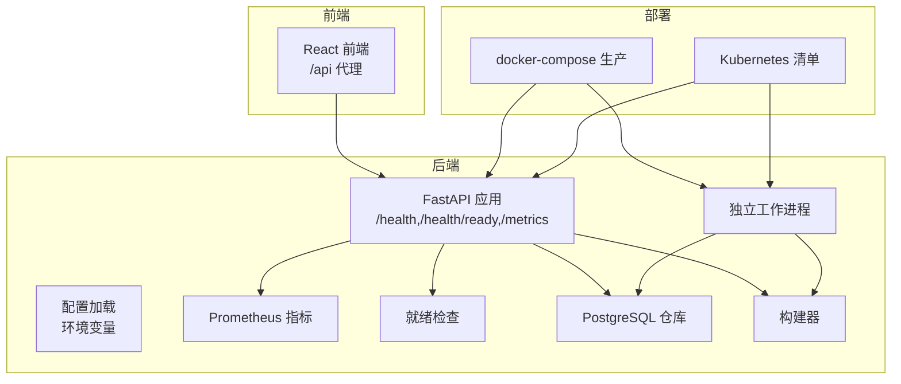
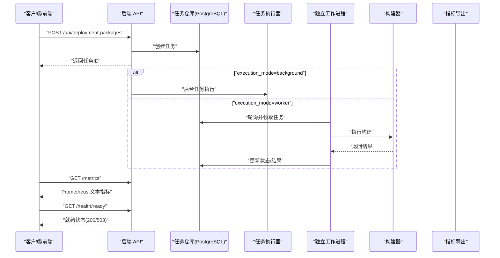
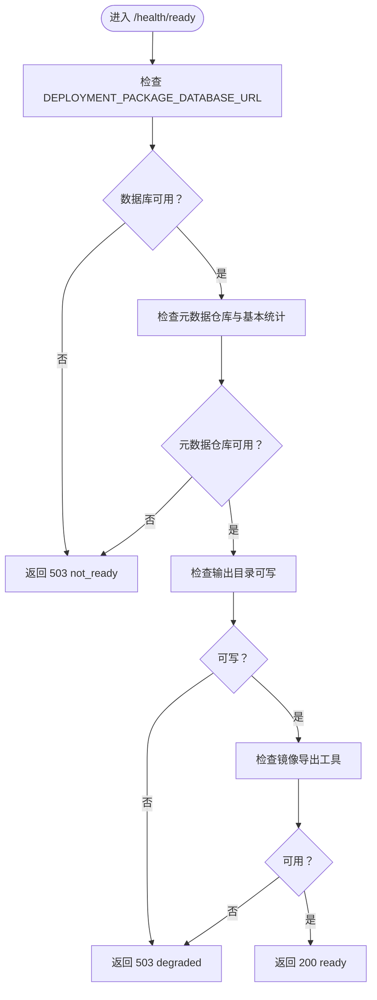
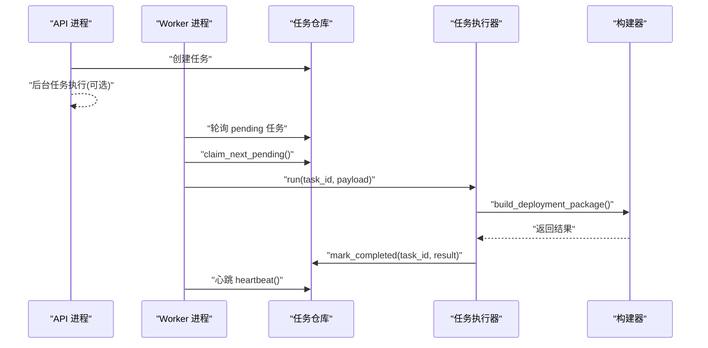
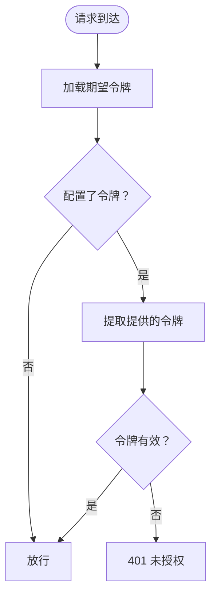
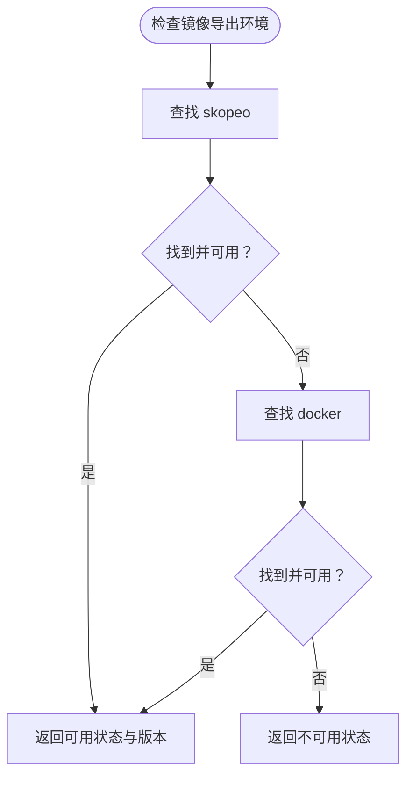
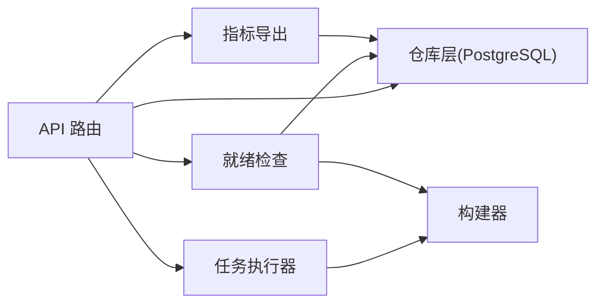

# 故障排除

<cite>
**本文引用的文件**
- [backend/deployment_package_factory/main.py](file://backend/deployment_package_factory/main.py)
- [backend/deployment_package_factory/settings.py](file://backend/deployment_package_factory/settings.py)
- [backend/deployment_package_factory/metrics.py](file://backend/deployment_package_factory/metrics.py)
- [backend/deployment_package_factory/readiness.py](file://backend/deployment_package_factory/readiness.py)
- [backend/deployment_package_factory/worker.py](file://backend/deployment_package_factory/worker.py)
- [backend/deployment_package_factory/api/deployment_packages.py](file://backend/deployment_package_factory/api/deployment_packages.py)
- [backend/deployment_package_factory/services/deployment_packages/builder.py](file://backend/deployment_package_factory/services/deployment_packages/builder.py)
- [backend/deployment_package_factory/services/deployment_packages/task_executor.py](file://backend/deployment_package_factory/services/deployment_packages/task_executor.py)
- [backend/deployment_package_factory/services/deployment_packages/models.py](file://backend/deployment_package_factory/services/deployment_packages/models.py)
- [backend/deployment_package_factory/services/deployment_packages/repositories.py](file://backend/deployment_package_factory/services/deployment_packages/repositories.py)
- [backend/deployment_package_factory/auth.py](file://backend/deployment_package_factory/auth.py)
- [backend/tests/test_deployment_package_api.py](file://backend/tests/test_deployment_package_api.py)
- [backend/tests/test_worker.py](file://backend/tests/test_worker.py)
- [deploy/docker-compose.prod.yml](file://deploy/docker-compose.prod.yml)
- [README.md](file://README.md)
- [docs/deployment-package-factory-delivery-audit.md](file://docs/deployment-package-factory-delivery-audit.md)
- [docs/deployment-package-factory-implementation-plan.md](file://docs/deployment-package-factory-implementation-plan.md)
</cite>

## 目录
1. [简介](#简介)
2. [项目结构](#项目结构)
3. [核心组件](#核心组件)
4. [架构总览](#架构总览)
5. [详细组件分析](#详细组件分析)
6. [依赖分析](#依赖分析)
7. [性能考虑](#性能考虑)
8. [故障排除指南](#故障排除指南)
9. [结论](#结论)
10. [附录](#附录)

## 简介
本文件面向部署包工厂（Deployment Package Factory）的运维与开发团队，提供系统化的故障排除指南。内容涵盖部署问题、配置问题、性能问题与兼容性问题的诊断与解决方法；详述错误诊断流程（日志分析、错误码解读、系统状态检查、依赖验证）；阐述监控指标分析（健康检查端点、Prometheus 指标、性能瓶颈识别）；并给出维护指南（系统维护、数据备份、升级策略、紧急恢复）、故障预防与应急预案、灾难恢复方案，以及问题报告模板与技术支持流程。

## 项目结构
- 后端服务基于 FastAPI，提供导包 API、就绪检查、指标导出与工作进程。
- 前端为独立的 React 应用，通过 /api 代理访问后端。
- 部署清单提供 Docker Compose 与 Kubernetes 的生产级编排。
- 测试覆盖 API 行为、令牌鉴权、worker 超时与清理逻辑。

图表来源
- [backend/deployment_package_factory/main.py:23-68](file://backend/deployment_package_factory/main.py#L23-L68)
- [backend/deployment_package_factory/worker.py:19-63](file://backend/deployment_package_factory/worker.py#L19-L63)
- [deploy/docker-compose.prod.yml:1-65](file://deploy/docker-compose.prod.yml#L1-L65)

章节来源
- [README.md:1-349](file://README.md#L1-L349)
- [deploy/docker-compose.prod.yml:1-65](file://deploy/docker-compose.prod.yml#L1-L65)

## 核心组件
- 应用入口与路由：提供 /health、/health/ready、/metrics 与 /api/deployment-packages 路由。
- 配置系统：从环境变量加载运行参数，如数据库连接、输出目录、并发与超时等。
- 就绪检查：验证数据库连接、元数据仓库可达性、输出目录可写、镜像导出工具可用性。
- 指标导出：以 Prometheus 文本格式导出任务与审计事件统计。
- 工作进程：独立 worker 模式下从任务表领取并执行构建，支持心跳与超时恢复。
- API 层：封装任务创建、预览、下载、取消/重试、清理等接口，并进行 API 令牌鉴权。
- 构建器：根据请求生成部署包，支持镜像清单与镜像归档两种模式。
- 仓库层：基于 PostgreSQL 的任务、审计、业务平台与微服务注册信息持久化。

章节来源
- [backend/deployment_package_factory/main.py:23-68](file://backend/deployment_package_factory/main.py#L23-L68)
- [backend/deployment_package_factory/settings.py:26-57](file://backend/deployment_package_factory/settings.py#L26-L57)
- [backend/deployment_package_factory/readiness.py:14-37](file://backend/deployment_package_factory/readiness.py#L14-L37)
- [backend/deployment_package_factory/metrics.py:4-38](file://backend/deployment_package_factory/metrics.py#L4-L38)
- [backend/deployment_package_factory/worker.py:19-63](file://backend/deployment_package_factory/worker.py#L19-L63)
- [backend/deployment_package_factory/api/deployment_packages.py:50-108](file://backend/deployment_package_factory/api/deployment_packages.py#L50-L108)
- [backend/deployment_package_factory/services/deployment_packages/builder.py:105-143](file://backend/deployment_package_factory/services/deployment_packages/builder.py#L105-L143)
- [backend/deployment_package_factory/services/deployment_packages/repositories.py:10-26](file://backend/deployment_package_factory/services/deployment_packages/repositories.py#L10-L26)

## 架构总览
后端服务通过 FastAPI 提供 REST API，任务状态与审计事件持久化至 PostgreSQL。在 worker 模式下，独立进程负责执行构建任务，API 进程仅负责接收请求与状态管理。Prometheus 可抓取 /metrics 获取任务与审计事件统计；/health/ready 用于容器编排的就绪探测。

图表来源
- [backend/deployment_package_factory/main.py:41-62](file://backend/deployment_package_factory/main.py#L41-L62)
- [backend/deployment_package_factory/worker.py:19-51](file://backend/deployment_package_factory/worker.py#L19-L51)
- [backend/deployment_package_factory/services/deployment_packages/task_executor.py:26-51](file://backend/deployment_package_factory/services/deployment_packages/task_executor.py#L26-L51)
- [backend/deployment_package_factory/services/deployment_packages/builder.py:146-246](file://backend/deployment_package_factory/services/deployment_packages/builder.py#L146-L246)

## 详细组件分析

### 组件A：就绪检查与健康端点
- /health：简单存活探针，返回应用标识。
- /health/ready：综合检查数据库连接、元数据仓库、输出目录可写、镜像导出工具可用性；必要项失败返回 503，镜像导出工具不可用返回 degraded。
- 检查项：
  - 数据库连接字符串配置。
  - 元数据仓库可达与基本统计。
  - 输出目录可写性。
  - 镜像导出工具（skopeo 或 docker）可用性与版本信息。

图表来源
- [backend/deployment_package_factory/readiness.py:14-37](file://backend/deployment_package_factory/readiness.py#L14-L37)
- [backend/deployment_package_factory/readiness.py:58-101](file://backend/deployment_package_factory/readiness.py#L58-L101)

章节来源
- [backend/deployment_package_factory/main.py:41-55](file://backend/deployment_package_factory/main.py#L41-L55)
- [backend/deployment_package_factory/readiness.py:14-37](file://backend/deployment_package_factory/readiness.py#L14-L37)

### 组件B：任务执行与工作进程
- API 后台任务模式：execution_mode=background 时，API 进程通过后台任务执行构建。
- 独立 worker 模式：execution_mode=worker 时，独立进程轮询任务、心跳上报、超时恢复。
- 超时与恢复：worker 会将长时间 running 的任务标记为 failed，便于重试。
- 并发控制：通过 max_concurrent_builds 控制同时执行的任务数。

图表来源
- [backend/deployment_package_factory/worker.py:19-51](file://backend/deployment_package_factory/worker.py#L19-L51)
- [backend/deployment_package_factory/services/deployment_packages/task_executor.py:26-64](file://backend/deployment_package_factory/services/deployment_packages/task_executor.py#L26-L64)
- [backend/deployment_package_factory/services/deployment_packages/builder.py:146-246](file://backend/deployment_package_factory/services/deployment_packages/builder.py#L146-L246)

章节来源
- [backend/deployment_package_factory/worker.py:19-63](file://backend/deployment_package_factory/worker.py#L19-L63)
- [backend/tests/test_worker.py:40-55](file://backend/tests/test_worker.py#L40-L55)

### 组件C：API 鉴权与令牌
- 支持 Authorization: Bearer 与 X-Deployment-Package-Token 头部传递令牌。
- 对于 /download、/checksum、/download-script.* 等下载接口允许 query 参数传入令牌。
- 未配置令牌时放行；配置后未提供有效令牌返回 401。

图表来源
- [backend/deployment_package_factory/auth.py:10-27](file://backend/deployment_package_factory/auth.py#L10-L27)
- [backend/deployment_package_factory/auth.py:38-41](file://backend/deployment_package_factory/auth.py#L38-L41)

章节来源
- [backend/deployment_package_factory/auth.py:10-41](file://backend/deployment_package_factory/auth.py#L10-L41)
- [backend/tests/test_deployment_package_api.py:109-145](file://backend/tests/test_deployment_package_api.py#L109-L145)

### 组件D：镜像导出环境检查
- 优先检测 skopeo，若不可用则回退到 docker；若两者均不可用则返回不可用。
- 返回可用性、工具版本与消息，用于前端预检与就绪检查。

图表来源
- [backend/deployment_package_factory/services/deployment_packages/builder.py:105-143](file://backend/deployment_package_factory/services/deployment_packages/builder.py#L105-L143)

章节来源
- [backend/deployment_package_factory/services/deployment_packages/builder.py:105-143](file://backend/deployment_package_factory/services/deployment_packages/builder.py#L105-L143)

## 依赖分析
- 外部依赖
  - PostgreSQL：任务、审计、业务平台与微服务注册信息持久化。
  - Kubernetes：在 K8s 模式下需要访问 API 以读取 Pod、Secret、ConfigMap 信息（当使用运行时镜像发现时）。
  - 镜像导出工具：skopeo 或 docker，用于镜像归档模式。
- 内部耦合
  - API 路由依赖仓库层与执行器。
  - 执行器依赖构建器与仓库层。
  - 就绪检查依赖仓库层与镜像导出检查。
  - 指标导出依赖仓库层的统计接口。

图表来源
- [backend/deployment_package_factory/api/deployment_packages.py:63-103](file://backend/deployment_package_factory/api/deployment_packages.py#L63-L103)
- [backend/deployment_package_factory/services/deployment_packages/repositories.py:10-26](file://backend/deployment_package_factory/services/deployment_packages/repositories.py#L10-L26)
- [backend/deployment_package_factory/readiness.py:14-37](file://backend/deployment_package_factory/readiness.py#L14-L37)
- [backend/deployment_package_factory/metrics.py:4-38](file://backend/deployment_package_factory/metrics.py#L4-L38)

章节来源
- [backend/deployment_package_factory/api/deployment_packages.py:63-103](file://backend/deployment_package_factory/api/deployment_packages.py#L63-L103)
- [backend/deployment_package_factory/services/deployment_packages/repositories.py:10-26](file://backend/deployment_package_factory/services/deployment_packages/repositories.py#L10-L26)

## 性能考虑
- 并发与队列
  - max_concurrent_builds 控制同时执行的任务数，避免资源争用。
  - worker_poll_interval_seconds 控制 worker 轮询间隔，平衡延迟与 CPU 占用。
  - worker_heartbeat_seconds 控制心跳频率，影响任务超时判定精度。
- I/O 与磁盘
  - 输出目录与 artifacts 目录的磁盘空间与 IO 性能直接影响构建速度与稳定性。
  - retention_days 与 max_total_gb 影响磁盘清理策略与可用空间。
- 网络与镜像
  - 镜像导出模式在 K8s worker 中优先使用 skopeo，减少对 Docker daemon 的依赖。
  - 镜像仓库访问速度与带宽影响镜像归档效率。
- 指标与可观测性
  - /metrics 提供任务总数、按状态分组的任务数、可用产物数量与字节数、审计事件总数与按动作分组的事件数。
  - Prometheus 抓取后可用于识别慢任务、失败率上升、磁盘空间不足等趋势。

章节来源
- [backend/deployment_package_factory/settings.py:26-57](file://backend/deployment_package_factory/settings.py#L26-L57)
- [backend/deployment_package_factory/metrics.py:4-38](file://backend/deployment_package_factory/metrics.py#L4-L38)
- [README.md:98-116](file://README.md#L98-L116)

## 故障排除指南

### 一、部署问题
- 症状：容器启动后持续重启或无法就绪
  - 检查 /health/ready 返回状态与消息，定位数据库、输出目录或镜像导出工具问题。
  - 查看容器健康检查配置与日志，确认 DEPLOYMENT_PACKAGE_DATABASE_URL、DEPLOYMENT_PACKAGE_OUTPUT_DIR 等环境变量是否正确。
  - 若使用 worker 模式，确认独立 worker 服务已随后端一起启动。
- 症状：前端无法访问 API
  - 确认前端 /runtime-config.js 中 API 基础地址与令牌配置正确。
  - 检查 Nginx 或反向代理是否正确转发 /api 前缀。
- 症状：下载接口 401
  - 确认已配置 DEPLOYMENT_PACKAGE_API_TOKEN，或在下载接口使用允许的 query 参数传入令牌。

章节来源
- [backend/deployment_package_factory/main.py:41-55](file://backend/deployment_package_factory/main.py#L41-L55)
- [deploy/docker-compose.prod.yml:18-22](file://deploy/docker-compose.prod.yml#L18-L22)
- [backend/deployment_package_factory/auth.py:10-41](file://backend/deployment_package_factory/auth.py#L10-L41)
- [README.md:66-87](file://README.md#L66-L87)

### 二、配置问题
- 症状：/health/ready 返回 not_ready 或 degraded
  - 数据库连接字符串为空：检查 DEPLOYMENT_PACKAGE_DATABASE_URL。
  - 元数据仓库不可达：检查 PostgreSQL 服务与网络连通性。
  - 输出目录不可写：检查输出目录权限与磁盘空间。
  - 镜像导出工具不可用：检查 worker 镜像是否包含 skopeo 或本地是否安装 docker。
- 症状：任务创建后无进展
  - 检查 execution_mode：background 或 worker。
  - 若为 worker 模式，确认 worker 进程正常运行且轮询间隔合理。
- 症状：任务超时失败
  - 检查 DEPLOYMENT_PACKAGE_RUNNING_TASK_TIMEOUT_MINUTES 设置是否过短。
  - 查看 worker 日志，确认是否存在长时间阻塞的 I/O 或网络拉取。

章节来源
- [backend/deployment_package_factory/readiness.py:14-37](file://backend/deployment_package_factory/readiness.py#L14-L37)
- [backend/deployment_package_factory/settings.py:26-57](file://backend/deployment_package_factory/settings.py#L26-L57)
- [backend/tests/test_worker.py:40-55](file://backend/tests/test_worker.py#L40-L55)

### 三、性能问题
- 症状：任务执行缓慢
  - 检查并发设置：max_concurrent_builds 是否过高导致资源争用。
  - 检查磁盘性能与空间：artifacts 与 work 目录所在卷的吞吐与剩余空间。
  - 检查镜像仓库访问：网络延迟与带宽是否成为瓶颈。
- 症状：CPU/内存占用高
  - 减少并发或提升资源配额。
  - 检查是否有大量日志输出导致 I/O 压力。
- 症状：Prometheus 指标异常
  - 检查 /metrics 返回的任务总数、失败数、可用产物数是否符合预期。
  - 关注任务状态分布，识别是否存在大量 failed 或 pending。

章节来源
- [backend/deployment_package_factory/metrics.py:4-38](file://backend/deployment_package_factory/metrics.py#L4-L38)
- [backend/deployment_package_factory/settings.py:26-57](file://backend/deployment_package_factory/settings.py#L26-L57)

### 四、兼容性问题
- 症状：K8s 模式下镜像导出失败
  - 确认 worker 镜像包含 skopeo；若无，回退到本地模式并确保 docker 可用。
  - 确认镜像仓库凭据与 TLS 配置正确。
- 症状：Docker Compose 模式下 .env 占位符未替换
  - 安装前会进行 secret-check，若仍存在占位符将直接失败。请补齐真实密钥后再执行安装。

章节来源
- [backend/deployment_package_factory/services/deployment_packages/builder.py:105-143](file://backend/deployment_package_factory/services/deployment_packages/builder.py#L105-L143)
- [README.md:139-151](file://README.md#L139-L151)

### 五、错误诊断流程
- 步骤1：确认健康与就绪
  - 访问 /health 与 /health/ready，记录返回状态与消息。
- 步骤2：检查配置
  - 校验所有环境变量，特别是数据库连接、输出目录、API 令牌、并发与超时参数。
- 步骤3：查看日志
  - 后端：关注 API 与 worker 的日志，定位异常堆栈与错误上下文。
  - 前端：检查 /runtime-config.js 与网络请求错误。
- 步骤4：验证依赖
  - 镜像导出工具可用性检查。
  - PostgreSQL 连接与权限。
  - 磁盘空间与权限。
- 步骤5：采集指标
  - 抓取 /metrics，观察任务状态分布与失败趋势。

章节来源
- [backend/deployment_package_factory/main.py:41-62](file://backend/deployment_package_factory/main.py#L41-L62)
- [backend/deployment_package_factory/readiness.py:14-37](file://backend/deployment_package_factory/readiness.py#L14-L37)
- [backend/deployment_package_factory/metrics.py:4-38](file://backend/deployment_package_factory/metrics.py#L4-L38)

### 六、监控指标分析
- 指标说明
  - deployment_package_tasks_total：导包任务总数。
  - deployment_package_tasks_by_status：按状态分组的任务数量（pending/running/completed/failed/canceled）。
  - deployment_package_artifacts_available：可用的已完成包数量。
  - deployment_package_artifacts_bytes：可用包的总字节数。
  - deployment_package_audit_events_total：审计事件总数。
  - deployment_package_audit_events_by_action：按动作分组的审计事件数量。
- 使用建议
  - 建立告警：失败率、pending 积压、可用产物字节下降。
  - 结合 /health/ready 与日志定位异常时段的根因。

章节来源
- [backend/deployment_package_factory/metrics.py:4-38](file://backend/deployment_package_factory/metrics.py#L4-L38)
- [README.md:98-116](file://README.md#L98-L116)

### 七、维护指南
- 系统维护
  - 定期清理过期产物：使用 /api/deployment-packages/cleanup，结合 retention_days 与 max_total_gb。
  - 任务状态与日志定期归档，避免日志膨胀。
- 数据备份
  - PostgreSQL 元数据备份：任务、审计、业务平台与微服务注册信息。
  - 产物备份：artifacts 与 work 目录的 tar.gz 与工作目录。
- 升级策略
  - 先升级后端镜像，再升级 worker 镜像，最后升级前端镜像。
  - 升级前执行清理与备份，升级后验证 /health/ready 与 /metrics。
- 紧急恢复
  - 回滚：使用上一个稳定镜像版本。
  - 重建：重新初始化数据库 schema（如需要），恢复 artifacts 与 work 目录。

章节来源
- [backend/deployment_package_factory/api/deployment_packages.py:308-330](file://backend/deployment_package_factory/api/deployment_packages.py#L308-L330)
- [backend/deployment_package_factory/settings.py:26-57](file://backend/deployment_package_factory/settings.py#L26-L57)
- [README.md:306-314](file://README.md#L306-L314)

### 八、故障预防与应急预案
- 预防措施
  - 设定合理的并发与超时参数，避免资源争用与僵尸任务。
  - 定期检查磁盘空间与镜像仓库连通性。
  - 在 CI 中加入 /health/ready 与 /metrics 的回归检查。
- 应急预案
  - worker 崩溃：重启 worker，确认心跳与超时逻辑生效。
  - 数据库异常：快速切换到备用实例或回滚迁移。
  - 磁盘空间不足：触发清理策略，必要时扩容卷。
- 灾难恢复
  - 基于备份恢复 PostgreSQL 与产物目录。
  - 重新部署后验证所有健康检查与指标。

章节来源
- [docs/deployment-package-factory-delivery-audit.md:265-318](file://docs/deployment-package-factory-delivery-audit.md#L265-L318)
- [docs/deployment-package-factory-implementation-plan.md:645-705](file://docs/deployment-package-factory-implementation-plan.md#L645-L705)

### 九、问题报告模板
- 问题标题
- 重现步骤
- 期望行为
- 实际行为
- 环境信息
  - 版本号、部署方式（Compose/K8s）、执行模式（background/worker）
  - 操作系统与内核版本
- 配置片段
  - 关键环境变量（DEPLOYMENT_PACKAGE_DATABASE_URL、DEPLOYMENT_PACKAGE_OUTPUT_DIR、DEPLOYMENT_PACKAGE_API_TOKEN 等）
- 日志与指标
  - 后端日志片段（含时间戳与错误堆栈）
  - /health/ready 与 /metrics 的截图或文本
- 附加信息
  - 前端错误截图或控制台输出
  - 相关的 PR/变更记录链接

### 十、技术支持流程
- 自助排查
  - 参考本故障排除文档的各章节进行逐项验证。
- 提交工单
  - 使用上述模板填写问题详情。
- 响应与跟进
  - 维护团队将在约定时间内响应并推进修复。
- 验证与关闭
  - 修复后由报告人复验并通过后关闭。

## 结论
本故障排除文档围绕部署包工厂的核心组件与运行机制，提供了从部署、配置、性能到兼容性的全链路诊断方法与维护策略。通过健康检查、就绪检查、指标导出与日志分析，可快速定位问题根因并采取针对性措施。建议在生产环境中持续完善监控与告警体系，严格执行备份与演练，确保系统稳定与可恢复性。

## 附录
- 相关文档与资源
  - 项目 README：包含运行配置、部署与可观测性说明。
  - 审计与实施计划文档：提供阶段性交付与后续硬化建议。
- 社区与支持
  - 仓库与问题跟踪：请在仓库中提交 issue 并附上问题报告模板。
  - 变更与发布：参考交付审计文档中的里程碑与验收标准。

章节来源
- [README.md:1-349](file://README.md#L1-L349)
- [docs/deployment-package-factory-delivery-audit.md:1-458](file://docs/deployment-package-factory-delivery-audit.md#L1-L458)
- [docs/deployment-package-factory-implementation-plan.md:1-800](file://docs/deployment-package-factory-implementation-plan.md#L1-L800)