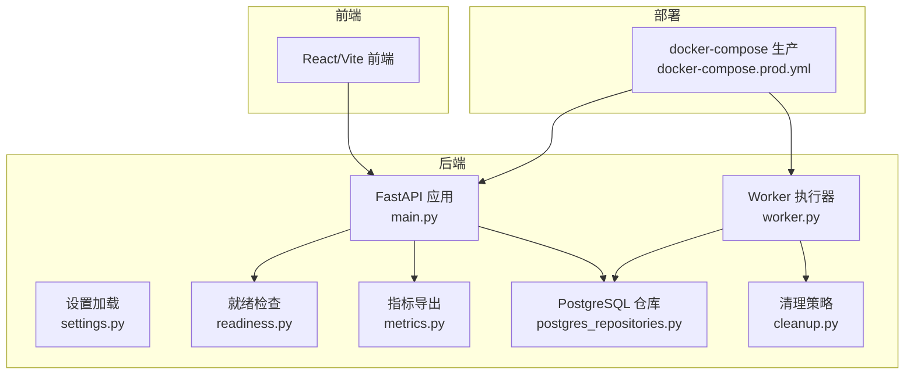
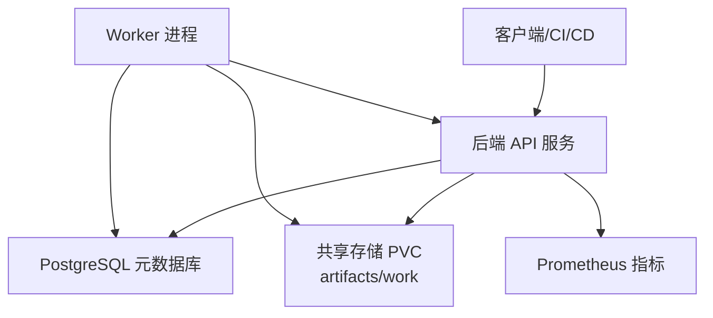
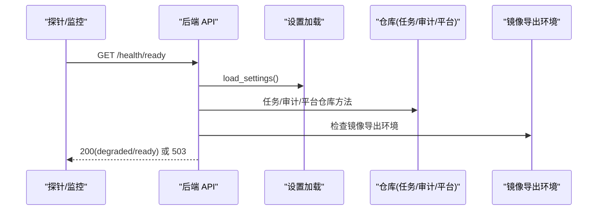
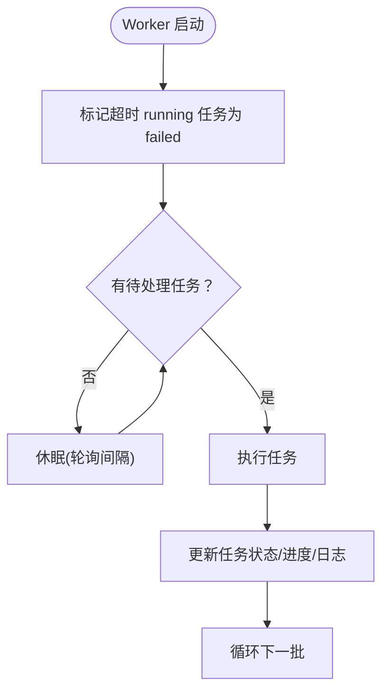
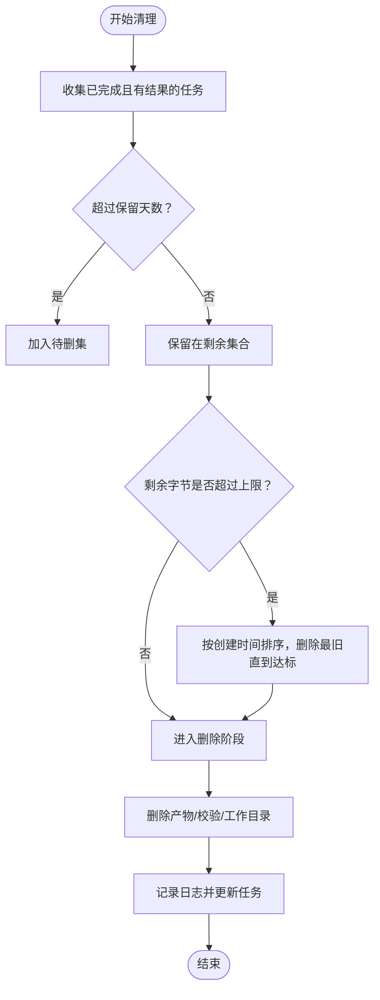
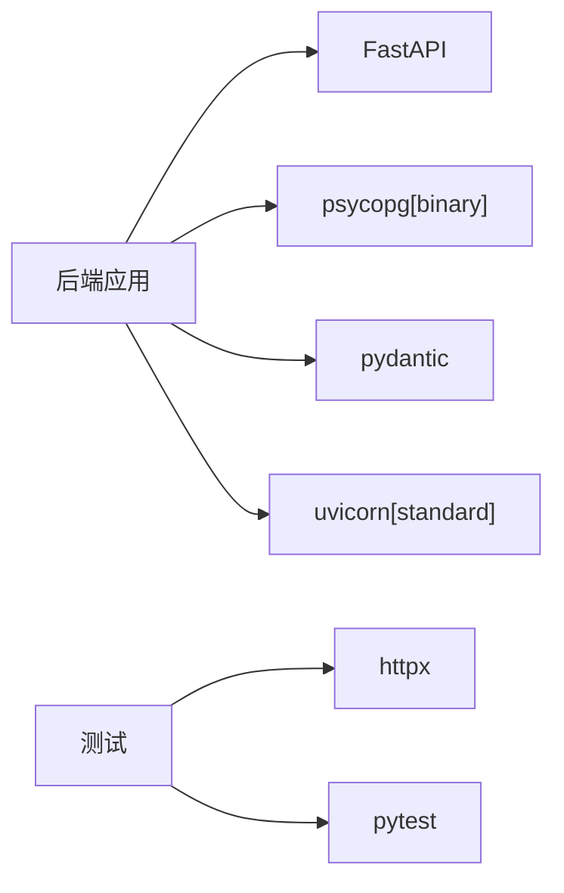

# 系统维护指南

<cite>
**本文引用的文件**
- [backend/deployment_package_factory/main.py](file://backend/deployment_package_factory/main.py)
- [backend/deployment_package_factory/settings.py](file://backend/deployment_package_factory/settings.py)
- [backend/deployment_package_factory/metrics.py](file://backend/deployment_package_factory/metrics.py)
- [backend/deployment_package_factory/readiness.py](file://backend/deployment_package_factory/readiness.py)
- [backend/deployment_package_factory/worker.py](file://backend/deployment_package_factory/worker.py)
- [backend/deployment_package_factory/services/deployment_packages/repositories.py](file://backend/deployment_package_factory/services/deployment_packages/repositories.py)
- [backend/deployment_package_factory/services/deployment_packages/postgres_repositories.py](file://backend/deployment_package_factory/services/deployment_packages/postgres_repositories.py)
- [backend/deployment_package_factory/services/deployment_packages/cleanup.py](file://backend/deployment_package_factory/services/deployment_packages/cleanup.py)
- [backend/deployment_package_factory/services/deployment_packages/models.py](file://backend/deployment_package_factory/services/deployment_packages/models.py)
- [backend/pyproject.toml](file://backend/pyproject.toml)
- [deploy/docker-compose.prod.yml](file://deploy/docker-compose.prod.yml)
- [scripts/build-images.sh](file://scripts/build-images.sh)
- [scripts/render-deploy-images.sh](file://scripts/render-deploy-images.sh)
- [scripts/validate-deploy-config.sh](file://scripts/validate-deploy-config.sh)
- [README.md](file://README.md)
</cite>

## 目录
1. [简介](#简介)
2. [项目结构](#项目结构)
3. [核心组件](#核心组件)
4. [架构总览](#架构总览)
5. [详细组件分析](#详细组件分析)
6. [依赖分析](#依赖分析)
7. [性能考虑](#性能考虑)
8. [故障排查指南](#故障排查指南)
9. [结论](#结论)
10. [附录](#附录)

## 简介
本指南面向部署包工厂（Deployment Package Factory）的运维与平台工程团队，提供系统健康检查、性能监控、日志轮转与磁盘空间管理、数据备份策略、升级与回滚策略、紧急恢复程序、维护检查清单、自动化维护脚本与维护窗口规划建议。系统基于 FastAPI 提供 API 服务，使用 PostgreSQL 存储任务与审计等元数据，支持容器化部署并通过 Worker 模式执行打包任务。

## 项目结构
- 后端服务：FastAPI 应用、健康与就绪检查、指标导出、Worker 执行器、PostgreSQL 仓库层、清理策略、设置加载。
- 前端：独立的 React/Vite 前端，提供交互界面与系统设置。
- 部署：docker-compose 与 Kubernetes 清单，支持生产环境部署。
- 脚本：镜像构建、部署配置渲染与校验、微服务脚手架验证等。

**图表来源**
- [backend/deployment_package_factory/main.py:23-68](file://backend/deployment_package_factory/main.py#L23-L68)
- [backend/deployment_package_factory/settings.py:26-57](file://backend/deployment_package_factory/settings.py#L26-L57)
- [backend/deployment_package_factory/readiness.py:14-37](file://backend/deployment_package_factory/readiness.py#L14-L37)
- [backend/deployment_package_factory/metrics.py:4-38](file://backend/deployment_package_factory/metrics.py#L4-L38)
- [backend/deployment_package_factory/worker.py:19-51](file://backend/deployment_package_factory/worker.py#L19-L51)
- [backend/deployment_package_factory/services/deployment_packages/postgres_repositories.py:26-346](file://backend/deployment_package_factory/services/deployment_packages/postgres_repositories.py#L26-L346)
- [backend/deployment_package_factory/services/deployment_packages/cleanup.py:32-58](file://backend/deployment_package_factory/services/deployment_packages/cleanup.py#L32-L58)
- [deploy/docker-compose.prod.yml:1-65](file://deploy/docker-compose.prod.yml#L1-L65)

**章节来源**
- [README.md:1-349](file://README.md#L1-L349)
- [deploy/docker-compose.prod.yml:1-65](file://deploy/docker-compose.prod.yml#L1-L65)

## 核心组件
- 应用入口与路由：提供健康检查、就绪检查、指标导出与各业务路由。
- 设置加载：集中管理数据目录、数据库连接、输出目录、并发与超时参数等。
- 就绪检查：验证数据库连接、元数据仓库可达性、输出目录可写、镜像导出环境。
- 指标导出：Prometheus 文本格式指标，覆盖任务与审计统计。
- Worker：周期轮询、心跳、超时失败标记与任务执行。
- PostgreSQL 仓库：任务、审计、业务平台等表的持久化与模式保证。
- 清理策略：基于保留天数与总容量上限的产物清理。
- 部署与脚本：镜像构建、部署配置渲染与校验。

**章节来源**
- [backend/deployment_package_factory/main.py:23-68](file://backend/deployment_package_factory/main.py#L23-L68)
- [backend/deployment_package_factory/settings.py:26-57](file://backend/deployment_package_factory/settings.py#L26-L57)
- [backend/deployment_package_factory/readiness.py:14-102](file://backend/deployment_package_factory/readiness.py#L14-L102)
- [backend/deployment_package_factory/metrics.py:4-38](file://backend/deployment_package_factory/metrics.py#L4-L38)
- [backend/deployment_package_factory/worker.py:19-63](file://backend/deployment_package_factory/worker.py#L19-L63)
- [backend/deployment_package_factory/services/deployment_packages/postgres_repositories.py:26-346](file://backend/deployment_package_factory/services/deployment_packages/postgres_repositories.py#L26-L346)
- [backend/deployment_package_factory/services/deployment_packages/cleanup.py:32-137](file://backend/deployment_package_factory/services/deployment_packages/cleanup.py#L32-L137)

## 架构总览
系统采用“API 服务 + Worker 执行 + PostgreSQL 元数据 + PVC 共享存储”的架构。API 服务负责对外提供接口与可观测性，Worker 负责实际的打包任务执行，PostgreSQL 存储任务与审计等元数据，Kubernetes 生产环境通过 PVC 提供共享的产物与工作目录存储。

**图表来源**
- [backend/deployment_package_factory/main.py:41-62](file://backend/deployment_package_factory/main.py#L41-L62)
- [backend/deployment_package_factory/worker.py:19-51](file://backend/deployment_package_factory/worker.py#L19-L51)
- [deploy/docker-compose.prod.yml:1-65](file://deploy/docker-compose.prod.yml#L1-L65)

## 详细组件分析

### 健康与就绪检查
- /health：基础存活检查。
- /health/ready：综合检查数据库连接、元数据仓库可达性、输出目录可写、镜像导出工具可用性，必要项失败返回 503，镜像导出不可用返回 degraded。
- /metrics：导出任务与审计指标，供 Prometheus 抓取。

**图表来源**
- [backend/deployment_package_factory/main.py:41-55](file://backend/deployment_package_factory/main.py#L41-L55)
- [backend/deployment_package_factory/readiness.py:14-37](file://backend/deployment_package_factory/readiness.py#L14-L37)
- [backend/deployment_package_factory/metrics.py:4-38](file://backend/deployment_package_factory/metrics.py#L4-L38)

**章节来源**
- [backend/deployment_package_factory/main.py:41-62](file://backend/deployment_package_factory/main.py#L41-L62)
- [backend/deployment_package_factory/readiness.py:14-102](file://backend/deployment_package_factory/readiness.py#L14-L102)
- [backend/deployment_package_factory/metrics.py:4-38](file://backend/deployment_package_factory/metrics.py#L4-L38)

### 性能监控与指标
- 指标包括：任务总数、按状态分组的任务数量、可用产物数量与字节总量、审计事件总数与按动作分组的数量。
- 在 Kubernetes 部署中，后端 Service 已带有 Prometheus 抓取注解，可直接采集。

**章节来源**
- [backend/deployment_package_factory/metrics.py:4-38](file://backend/deployment_package_factory/metrics.py#L4-L38)
- [README.md:98-116](file://README.md#L98-L116)

### Worker 与任务生命周期
- Worker 周期性轮询待处理任务，领取后执行，定期发送心跳；若心跳超时则标记失败。
- 任务状态包括 pending/running/completed/failed/canceled，支持取消与重试。

**图表来源**
- [backend/deployment_package_factory/worker.py:19-51](file://backend/deployment_package_factory/worker.py#L19-L51)
- [backend/deployment_package_factory/services/deployment_packages/postgres_repositories.py:158-181](file://backend/deployment_package_factory/services/deployment_packages/postgres_repositories.py#L158-L181)

**章节来源**
- [backend/deployment_package_factory/worker.py:19-63](file://backend/deployment_package_factory/worker.py#L19-L63)
- [backend/deployment_package_factory/services/deployment_packages/postgres_repositories.py:158-201](file://backend/deployment_package_factory/services/deployment_packages/postgres_repositories.py#L158-L201)

### 数据库与元数据仓库
- 使用 PostgreSQL 存储任务、审计、业务平台等信息，仓库层提供模式保证与查询/更新方法。
- 关键表：package_tasks、audit_events、business_platforms 等，均包含必要的索引以支撑查询与统计。

**章节来源**
- [backend/deployment_package_factory/services/deployment_packages/postgres_repositories.py:26-346](file://backend/deployment_package_factory/services/deployment_packages/postgres_repositories.py#L26-L346)
- [backend/deployment_package_factory/services/deployment_packages/repositories.py:10-25](file://backend/deployment_package_factory/services/deployment_packages/repositories.py#L10-L25)

### 清理策略与磁盘空间管理
- 基于保留天数与总容量上限进行清理，优先删除最旧的产物；支持 dry-run。
- 清理范围：产物 tar.gz、校验文件与工作目录；不删除数据库记录。

**图表来源**
- [backend/deployment_package_factory/services/deployment_packages/cleanup.py:32-92](file://backend/deployment_package_factory/services/deployment_packages/cleanup.py#L32-L92)

**章节来源**
- [backend/deployment_package_factory/services/deployment_packages/cleanup.py:32-137](file://backend/deployment_package_factory/services/deployment_packages/cleanup.py#L32-L137)
- [README.md:306-315](file://README.md#L306-L315)

### 配置与环境变量
- 关键环境变量：数据目录、数据库连接串、输出目录、API Token、最大并发、执行模式、Worker 轮询/心跳/超时、保留天数与总容量上限等。
- 生产环境建议使用 worker 模式，独立进程执行任务。

**章节来源**
- [backend/deployment_package_factory/settings.py:26-57](file://backend/deployment_package_factory/settings.py#L26-L57)
- [README.md:66-87](file://README.md#L66-L87)
- [deploy/docker-compose.prod.yml:5-44](file://deploy/docker-compose.prod.yml#L5-L44)

### 部署与镜像管理
- docker-compose 生产：后端、Worker、前端三服务，健康检查与数据卷。
- 镜像构建与部署配置渲染脚本：支持指定 Registry、仓库、Tag、输出目录、端口、数据库 URL、StorageClass 等。

**章节来源**
- [deploy/docker-compose.prod.yml:1-65](file://deploy/docker-compose.prod.yml#L1-L65)
- [scripts/build-images.sh:1-97](file://scripts/build-images.sh#L1-L97)
- [scripts/render-deploy-images.sh:1-141](file://scripts/render-deploy-images.sh#L1-L141)

## 依赖分析
- 运行时依赖：FastAPI、PostgreSQL 驱动、Pydantic、PyYAML、Uvicorn。
- 测试与开发：HTTPX、PyTest。
- 版本约束与包路径在后端 pyproject.toml 中定义。

**图表来源**
- [backend/pyproject.toml:6-12](file://backend/pyproject.toml#L6-L12)
- [backend/pyproject.toml:15-18](file://backend/pyproject.toml#L15-L18)

**章节来源**
- [backend/pyproject.toml:1-30](file://backend/pyproject.toml#L1-L30)

## 性能考虑
- 并发与队列：通过最大并发参数控制同时执行的任务数，避免资源争抢。
- 超时与心跳：合理设置 Worker 心跳与运行超时，确保长时间任务不会阻塞队列。
- 存储与清理：定期清理过期产物与工作目录，控制 PVC 空间占用。
- 指标监控：结合 /metrics 与 /health/ready，持续观察任务积压与系统健康状况。

[本节为通用指导，无需具体文件分析]

## 故障排查指南
- 健康检查失败
  - 使用 /health/ready 检查数据库连接、元数据仓库可达性、输出目录可写与镜像导出环境。
  - 若返回 degraded，关注镜像导出工具状态。
- Worker 任务卡住
  - 检查 /metrics 中 running 任务数量与心跳频率；必要时重启 Worker。
  - 查看任务日志与错误字段，定位失败原因。
- 数据库异常
  - 确认数据库 URL 正确；检查仓库层模式是否完整（首次访问自动创建）。
- 清理策略误删
  - 使用 dry-run 预演清理结果；核对保留天数与总容量上限。

**章节来源**
- [backend/deployment_package_factory/main.py:41-55](file://backend/deployment_package_factory/main.py#L41-L55)
- [backend/deployment_package_factory/readiness.py:14-102](file://backend/deployment_package_factory/readiness.py#L14-L102)
- [backend/deployment_package_factory/worker.py:19-51](file://backend/deployment_package_factory/worker.py#L19-L51)
- [backend/deployment_package_factory/services/deployment_packages/postgres_repositories.py:319-346](file://backend/deployment_package_factory/services/deployment_packages/postgres_repositories.py#L319-L346)
- [backend/deployment_package_factory/services/deployment_packages/cleanup.py:32-58](file://backend/deployment_package_factory/services/deployment_packages/cleanup.py#L32-L58)

## 结论
通过健康检查、就绪检查、指标导出与 Worker 生命周期管理，部署包工厂具备良好的可观测性与稳定性。配合 PostgreSQL 元数据与 PVC 共享存储，可实现可靠的打包与交付流程。建议在生产环境中启用 worker 模式、定期清理产物并建立完善的备份与回滚策略。

[本节为总结，无需具体文件分析]

## 附录

### 日常维护任务清单
- 每日
  - 检查 /health/ready 与 /metrics，关注任务积压与可用产物字节。
  - 核对输出目录与 PVC 空间使用情况。
- 每周
  - 运行清理策略（可先 dry-run），评估保留天数与总容量上限配置。
  - 备份 PostgreSQL 元数据（见“数据备份策略”）。
- 每月
  - 检查镜像导出工具可用性与网络访问权限。
  - 回顾审计事件，识别高频动作与失败原因。

[本节为通用指导，无需具体文件分析]

### 自动化维护脚本
- 镜像构建
  - [scripts/build-images.sh:1-97](file://scripts/build-images.sh#L1-L97)
- 部署配置渲染
  - [scripts/render-deploy-images.sh:1-141](file://scripts/render-deploy-images.sh#L1-L141)
- 部署配置校验
  - [scripts/validate-deploy-config.sh:1-64](file://scripts/validate-deploy-config.sh#L1-L64)

**章节来源**
- [scripts/build-images.sh:1-97](file://scripts/build-images.sh#L1-L97)
- [scripts/render-deploy-images.sh:1-141](file://scripts/render-deploy-images.sh#L1-L141)
- [scripts/validate-deploy-config.sh:1-64](file://scripts/validate-deploy-config.sh#L1-L64)

### 数据备份策略
- 数据库备份
  - PostgreSQL 元数据：使用数据库厂商提供的备份工具（如 pg_dump）定期备份 package_tasks、audit_events、business_platforms 等表。
- 配置文件备份
  - docker-compose 与 K8s 清单：备份 deploy/ 目录与 scripts/ 目录中的配置文件。
- 工件存储备份
  - PVC 上的产物与工作目录：根据业务需要制定快照或归档策略，注意保留天数与总容量上限的配置一致性。

**章节来源**
- [deploy/docker-compose.prod.yml:1-65](file://deploy/docker-compose.prod.yml#L1-L65)
- [README.md:306-315](file://README.md#L306-L315)

### 升级与回滚策略
- 版本兼容性检查
  - 检查后端 pyproject.toml 中的依赖版本与运行时要求（Python 版本）。
  - 确认数据库 schema 是否需要迁移（仓库层具备首次访问自动建表能力）。
- 升级步骤
  - 使用 scripts/build-images.sh 重新构建后端、Worker、前端镜像。
  - 使用 scripts/render-deploy-images.sh 生成部署配置并校验。
  - 应用 docker-compose 或 K8s 清单，滚动更新服务。
- 回滚方案
  - 回滚至上一个稳定镜像标签；如需恢复历史数据，使用数据库备份进行恢复。

**章节来源**
- [backend/pyproject.toml:5-12](file://backend/pyproject.toml#L5-L12)
- [scripts/build-images.sh:1-97](file://scripts/build-images.sh#L1-L97)
- [scripts/render-deploy-images.sh:1-141](file://scripts/render-deploy-images.sh#L1-L141)
- [scripts/validate-deploy-config.sh:1-64](file://scripts/validate-deploy-config.sh#L1-L64)

### 紧急恢复程序
- 故障切换
  - 如 Worker 异常退出导致任务停滞，重启 Worker 后系统会将超时任务标记为失败，后续可重试。
- 数据恢复
  - 使用数据库备份恢复 PostgreSQL 元数据；确认仓库层模式存在。
- 系统重建
  - 重新应用 docker-compose 或 K8s 清单，恢复服务与存储；校验 /health/ready 与 /metrics。

**章节来源**
- [backend/deployment_package_factory/worker.py:19-51](file://backend/deployment_package_factory/worker.py#L19-L51)
- [backend/deployment_package_factory/services/deployment_packages/postgres_repositories.py:319-346](file://backend/deployment_package_factory/services/deployment_packages/postgres_repositories.py#L319-L346)
- [deploy/docker-compose.prod.yml:1-65](file://deploy/docker-compose.prod.yml#L1-L65)

### 维护窗口规划建议
- 选择业务低峰时段进行升级与大规模清理。
- 预留足够时间用于回滚与数据恢复演练。
- 在维护窗口内执行 dry-run 清理与配置校验，降低风险。

[本节为通用指导，无需具体文件分析]