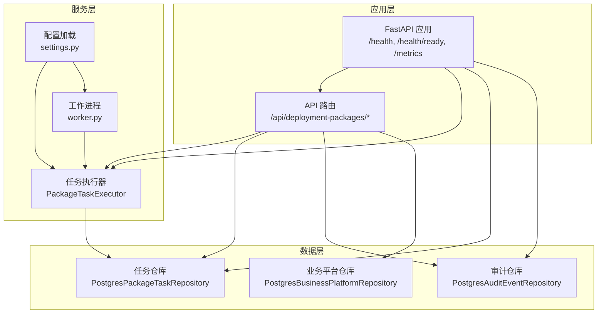
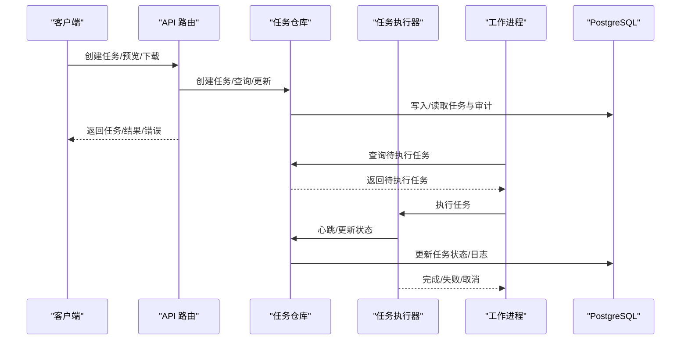
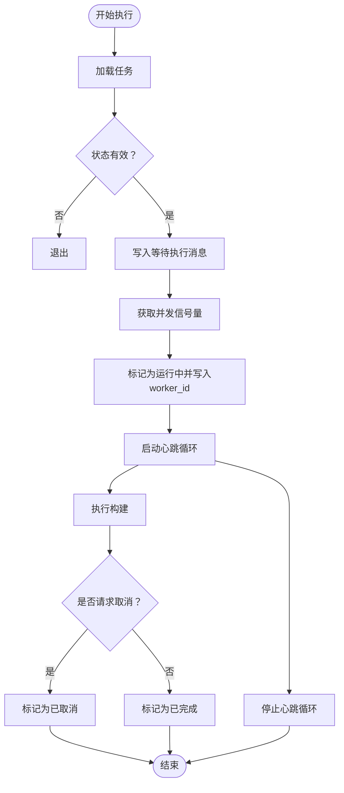
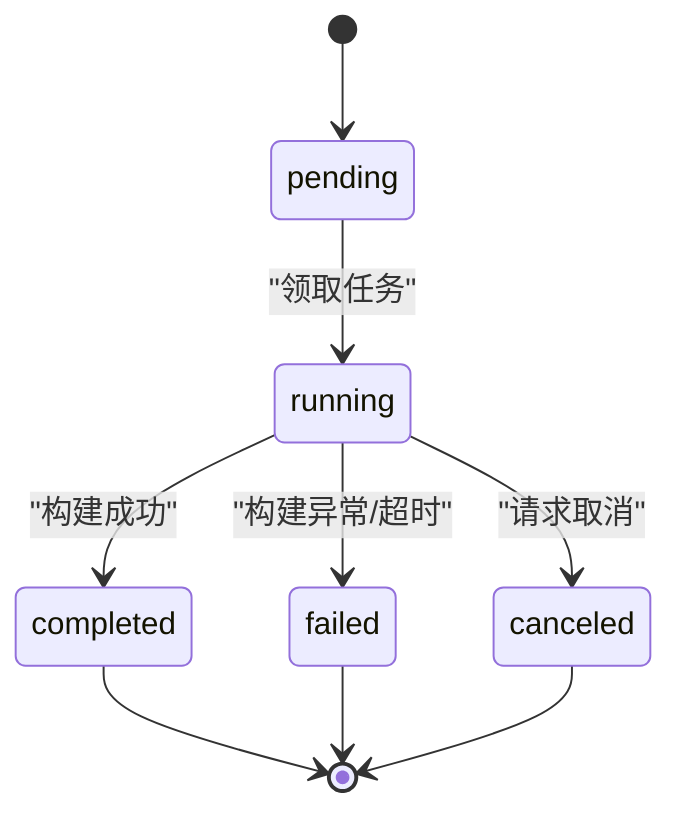
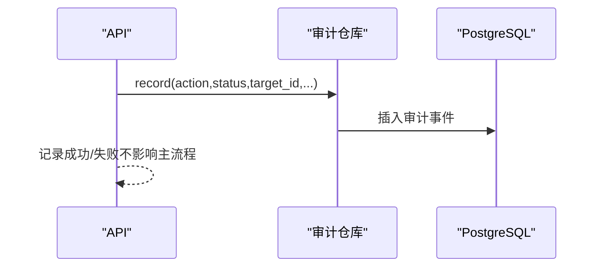
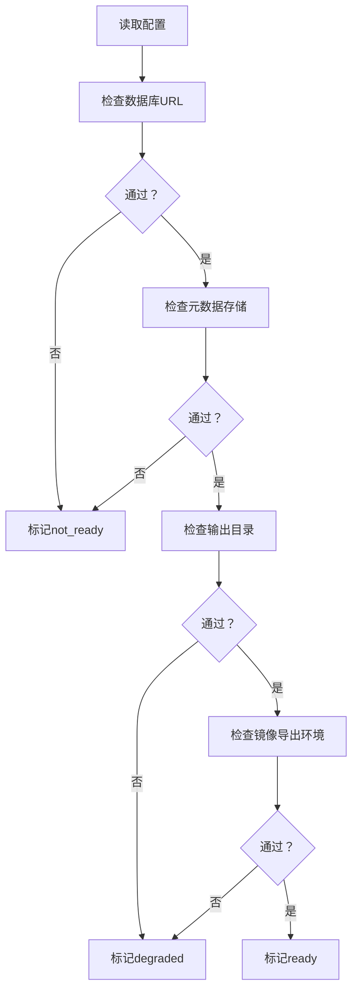
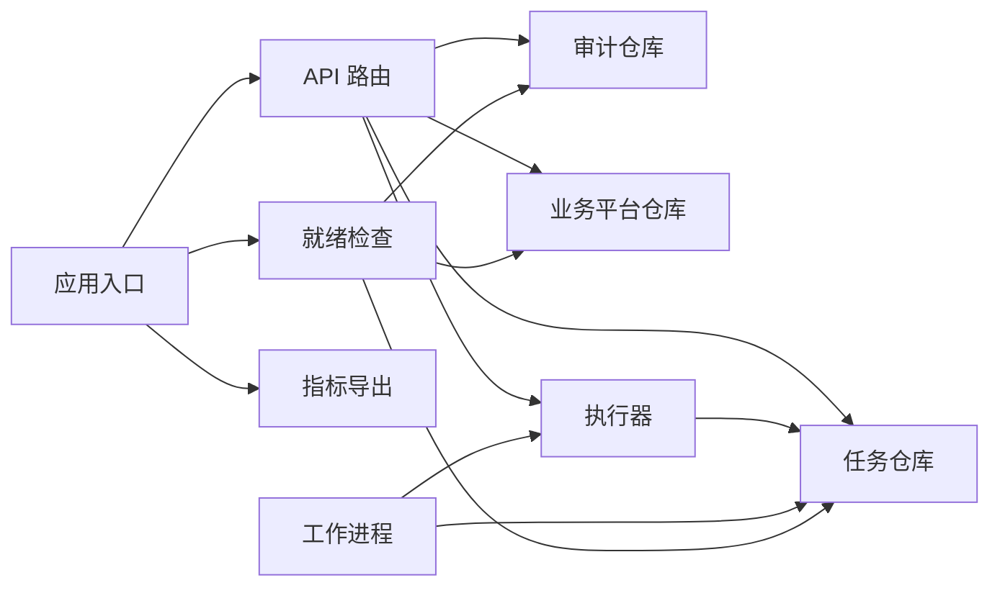

# 错误诊断与处理

<cite>
**本文引用的文件**
- [backend/deployment_package_factory/main.py](file://backend/deployment_package_factory/main.py)
- [backend/deployment_package_factory/metrics.py](file://backend/deployment_package_factory/metrics.py)
- [backend/deployment_package_factory/readiness.py](file://backend/deployment_package_factory/readiness.py)
- [backend/deployment_package_factory/settings.py](file://backend/deployment_package_factory/settings.py)
- [backend/deployment_package_factory/services/deployment_packages/models.py](file://backend/deployment_package_factory/services/deployment_packages/models.py)
- [backend/deployment_package_factory/services/deployment_packages/postgres_repositories.py](file://backend/deployment_package_factory/services/deployment_packages/postgres_repositories.py)
- [backend/deployment_package_factory/services/deployment_packages/repositories.py](file://backend/deployment_package_factory/services/deployment_packages/repositories.py)
- [backend/deployment_package_factory/services/deployment_packages/task_executor.py](file://backend/deployment_package_factory/services/deployment_packages/task_executor.py)
- [backend/deployment_package_factory/worker.py](file://backend/deployment_package_factory/worker.py)
- [backend/deployment_package_factory/api/deployment_packages.py](file://backend/deployment_package_factory/api/deployment_packages.py)
</cite>

## 目录
1. [简介](#简介)
2. [项目结构](#项目结构)
3. [核心组件](#核心组件)
4. [架构总览](#架构总览)
5. [详细组件分析](#详细组件分析)
6. [依赖分析](#依赖分析)
7. [性能考量](#性能考量)
8. [故障排查指南](#故障排查指南)
9. [结论](#结论)
10. [附录](#附录)

## 简介
本文件面向部署包工厂系统的运维与开发人员，提供一套系统化的“错误诊断与处理”指南。内容覆盖错误码与状态语义、日志分析方法、调试技巧、Prometheus 指标解读、任务状态变化分析、性能瓶颈定位、错误处理最佳实践（异常捕获、错误恢复、降级策略）、系统监控阈值建议以及基于审计事件的溯源分析流程。

## 项目结构
后端采用 FastAPI 应用，包含以下关键模块：
- 应用入口与路由：FastAPI 应用、健康检查、就绪检查、指标导出
- 任务执行：工作进程、并发控制、心跳保活、超时失败标记
- 数据持久化：PostgreSQL 仓库（任务、审计、业务平台）
- 监控与就绪检查：Prometheus 指标渲染、就绪报告
- API 层：请求校验、错误映射、审计记录

图表来源
- [backend/deployment_package_factory/main.py:23-68](file://backend/deployment_package_factory/main.py#L23-L68)
- [backend/deployment_package_factory/api/deployment_packages.py:50-108](file://backend/deployment_package_factory/api/deployment_packages.py#L50-L108)
- [backend/deployment_package_factory/services/deployment_packages/task_executor.py:20-77](file://backend/deployment_package_factory/services/deployment_packages/task_executor.py#L20-L77)
- [backend/deployment_package_factory/worker.py:19-63](file://backend/deployment_package_factory/worker.py#L19-L63)
- [backend/deployment_package_factory/services/deployment_packages/postgres_repositories.py:26-588](file://backend/deployment_package_factory/services/deployment_packages/postgres_repositories.py#L26-L588)

章节来源
- [backend/deployment_package_factory/main.py:23-68](file://backend/deployment_package_factory/main.py#L23-L68)
- [backend/deployment_package_factory/api/deployment_packages.py:50-108](file://backend/deployment_package_factory/api/deployment_packages.py#L50-L108)

## 核心组件
- 任务模型与状态机
  - 任务状态：pending、running、completed、failed、canceled
  - 任务字段：进度、消息、错误、日志、工件路径、校验和等
- 任务仓库
  - 提供创建、查询、列表、更新、心跳、取消、重试、超时失败标记等能力
  - 指标汇总：按状态分组计数、可用工厂数量、字节总量
- 审计仓库
  - 记录操作动作、目标、状态、操作者、客户端 IP、元数据
  - 指标汇总：总事件数、按动作分组计数
- 执行器与工作进程
  - 并发限制、心跳循环、异常捕获、取消请求处理
  - 工作进程轮询、超时扫描、任务领取与执行
- 就绪检查与指标导出
  - 就绪报告：数据库连接、输出目录可写、镜像导出环境
  - Prometheus 指标：任务总数、按状态分布、可用工厂数与体积、审计事件总数与按动作分布

章节来源
- [backend/deployment_package_factory/services/deployment_packages/models.py:215-249](file://backend/deployment_package_factory/services/deployment_packages/models.py#L215-L249)
- [backend/deployment_package_factory/services/deployment_packages/postgres_repositories.py:71-96](file://backend/deployment_package_factory/services/deployment_packages/postgres_repositories.py#L71-L96)
- [backend/deployment_package_factory/services/deployment_packages/postgres_repositories.py:423-436](file://backend/deployment_package_factory/services/deployment_packages/postgres_repositories.py#L423-L436)
- [backend/deployment_package_factory/services/deployment_packages/task_executor.py:20-77](file://backend/deployment_package_factory/services/deployment_packages/task_executor.py#L20-L77)
- [backend/deployment_package_factory/worker.py:19-63](file://backend/deployment_package_factory/worker.py#L19-L63)
- [backend/deployment_package_factory/readiness.py:14-102](file://backend/deployment_package_factory/readiness.py#L14-L102)
- [backend/deployment_package_factory/metrics.py:4-38](file://backend/deployment_package_factory/metrics.py#L4-L38)

## 架构总览
下图展示从 API 到执行器再到数据库的关键交互路径，以及指标与就绪检查的输出位置。

图表来源
- [backend/deployment_package_factory/api/deployment_packages.py:245-282](file://backend/deployment_package_factory/api/deployment_packages.py#L245-L282)
- [backend/deployment_package_factory/services/deployment_packages/task_executor.py:26-51](file://backend/deployment_package_factory/services/deployment_packages/task_executor.py#L26-L51)
- [backend/deployment_package_factory/worker.py:37-51](file://backend/deployment_package_factory/worker.py#L37-L51)
- [backend/deployment_package_factory/services/deployment_packages/postgres_repositories.py:31-61](file://backend/deployment_package_factory/services/deployment_packages/postgres_repositories.py#L31-L61)

## 详细组件分析

### 组件A：任务执行器与工作进程
- 并发控制：通过信号量限制同时运行的任务数量
- 心跳保活：后台任务定期上报心跳，避免被判定为超时
- 异常处理：捕获构建与目录错误，统一转为失败状态；对未知异常进行兜底
- 取消请求：检测到取消后丢弃当前结果并标记为 canceled
- 超时失败：工作进程周期扫描长时间未心跳的任务并标记失败

图表来源
- [backend/deployment_package_factory/services/deployment_packages/task_executor.py:26-77](file://backend/deployment_package_factory/services/deployment_packages/task_executor.py#L26-L77)

章节来源
- [backend/deployment_package_factory/services/deployment_packages/task_executor.py:20-77](file://backend/deployment_package_factory/services/deployment_packages/task_executor.py#L20-L77)
- [backend/deployment_package_factory/worker.py:19-63](file://backend/deployment_package_factory/worker.py#L19-L63)

### 组件B：任务仓库与状态流转
- 关键能力
  - 创建：初始化任务状态、日志、时间戳
  - 领取：锁定并更新为 running，写入 worker_id 和心跳时间
  - 心跳：校验 worker_id，更新心跳与更新时间
  - 更新：原子更新状态、进度、消息、错误、日志、结果等
  - 取消：pending 直接取消；运行中仅记录取消意图
  - 重试：失败或取消的任务可重试，复制请求并创建新任务
  - 超时：扫描长时间未心跳的任务并标记失败
  - 指标：统计总数、按状态分布、可用工厂数量与体积
- 状态语义
  - pending：等待执行槽位
  - running：正在执行，有 worker_id
  - completed：成功完成，携带结果
  - failed：执行失败，记录错误
  - canceled：用户请求取消，最终状态

图表来源
- [backend/deployment_package_factory/services/deployment_packages/postgres_repositories.py:71-96](file://backend/deployment_package_factory/services/deployment_packages/postgres_repositories.py#L71-L96)
- [backend/deployment_package_factory/services/deployment_packages/postgres_repositories.py:183-272](file://backend/deployment_package_factory/services/deployment_packages/postgres_repositories.py#L183-L272)

章节来源
- [backend/deployment_package_factory/services/deployment_packages/postgres_repositories.py:26-318](file://backend/deployment_package_factory/services/deployment_packages/postgres_repositories.py#L26-L318)
- [backend/deployment_package_factory/services/deployment_packages/models.py:215-249](file://backend/deployment_package_factory/services/deployment_packages/models.py#L215-L249)

### 组件C：审计事件与溯源
- 审计事件字段：动作、目标、状态、操作者、客户端 IP、消息、元数据、时间
- API 层在关键操作（创建、取消、重试、下载、清理）记录审计事件
- 指标：总事件数、按动作分组计数
- 溯源建议：结合任务 ID、操作者、客户端 IP、元数据定位问题

图表来源
- [backend/deployment_package_factory/api/deployment_packages.py:599-621](file://backend/deployment_package_factory/api/deployment_packages.py#L599-L621)
- [backend/deployment_package_factory/services/deployment_packages/postgres_repositories.py:354-390](file://backend/deployment_package_factory/services/deployment_packages/postgres_repositories.py#L354-L390)

章节来源
- [backend/deployment_package_factory/api/deployment_packages.py:285-330](file://backend/deployment_package_factory/api/deployment_packages.py#L285-L330)
- [backend/deployment_package_factory/services/deployment_packages/postgres_repositories.py:423-436](file://backend/deployment_package_factory/services/deployment_packages/postgres_repositories.py#L423-L436)

### 组件D：就绪检查与健康接口
- 就绪检查项
  - 数据库连接字符串存在
  - 元数据存储可达且模式检查通过（任务/审计/业务平台）
  - 输出目录可写
  - 镜像导出环境可用（版本、工具）
- 健康接口返回应用状态
- 就绪接口根据必填项失败/警告决定状态

图表来源
- [backend/deployment_package_factory/readiness.py:14-102](file://backend/deployment_package_factory/readiness.py#L14-L102)
- [backend/deployment_package_factory/main.py:41-55](file://backend/deployment_package_factory/main.py#L41-L55)

章节来源
- [backend/deployment_package_factory/readiness.py:14-102](file://backend/deployment_package_factory/readiness.py#L14-L102)
- [backend/deployment_package_factory/main.py:41-55](file://backend/deployment_package_factory/main.py#L41-L55)

### 组件E：指标导出与解读
- 指标定义
  - deployment_package_tasks_total：任务总数
  - deployment_package_tasks_by_status：按状态分布（pending/running/completed/failed/canceled）
  - deployment_package_artifacts_available：可用工厂数量
  - deployment_package_artifacts_bytes：可用工件总字节数
  - deployment_package_audit_events_total：审计事件总数
  - deployment_package_audit_events_by_action：按动作分组计数
- 解读要点
  - 总体趋势：观察任务总数与工厂数量变化，判断吞吐与积压
  - 状态分布：failed/canceled 异常增多需重点排查
  - 工件体积：异常增长可能与清理策略或工件过大有关
  - 审计动作：异常高频的动作（如 cancel/retry）提示流程问题

章节来源
- [backend/deployment_package_factory/metrics.py:4-38](file://backend/deployment_package_factory/metrics.py#L4-L38)
- [backend/deployment_package_factory/services/deployment_packages/postgres_repositories.py:71-96](file://backend/deployment_package_factory/services/deployment_packages/postgres_repositories.py#L71-L96)
- [backend/deployment_package_factory/services/deployment_packages/postgres_repositories.py:423-436](file://backend/deployment_package_factory/services/deployment_packages/postgres_repositories.py#L423-L436)

## 依赖分析
- 组件耦合
  - API 路由依赖任务/审计/业务平台仓库与执行器
  - 执行器依赖任务仓库与构建器
  - 工作进程依赖任务仓库与执行器
  - 指标与就绪检查依赖仓库的 metrics_summary
- 外部依赖
  - PostgreSQL：任务、审计、业务平台三张表
  - 环境变量：数据库连接、输出目录、并发、心跳、超时、保留天数、最大容量等

图表来源
- [backend/deployment_package_factory/api/deployment_packages.py:63-103](file://backend/deployment_package_factory/api/deployment_packages.py#L63-L103)
- [backend/deployment_package_factory/services/deployment_packages/task_executor.py:20-24](file://backend/deployment_package_factory/services/deployment_packages/task_executor.py#L20-L24)
- [backend/deployment_package_factory/worker.py:22-31](file://backend/deployment_package_factory/worker.py#L22-L31)
- [backend/deployment_package_factory/main.py:17-62](file://backend/deployment_package_factory/main.py#L17-L62)
- [backend/deployment_package_factory/readiness.py:14-37](file://backend/deployment_package_factory/readiness.py#L14-L37)

章节来源
- [backend/deployment_package_factory/services/deployment_packages/repositories.py:10-25](file://backend/deployment_package_factory/services/deployment_packages/repositories.py#L10-L25)
- [backend/deployment_package_factory/settings.py:26-57](file://backend/deployment_package_factory/settings.py#L26-L57)

## 性能考量
- 并发与资源
  - 通过并发参数控制同时构建数量，避免资源争抢
  - 输出目录磁盘空间与 IO 影响构建与下载性能
- 心跳与超时
  - 心跳间隔过短增加数据库压力；过长可能导致误判超时
  - 运行超时分钟数应结合任务平均耗时设定
- 清理策略
  - 保留天数与最大总大小影响存储占用与查询范围
- 指标监控
  - 关注 pending 积压、failed 率、工件体积增长、下载带宽使用

## 故障排查指南

### 一、错误码与状态语义
- 任务状态
  - pending：等待执行槽位，常见于高并发或 worker 未就绪
  - running：执行中，关注心跳是否持续
  - completed：成功，检查工件路径与校验和
  - failed：失败，查看错误消息与日志
  - canceled：取消，检查取消请求来源与日志
- HTTP 状态与错误
  - 400：请求参数错误、构建前置条件不满足
  - 404：任务/工件不存在
  - 409：状态不允许的操作（如非 failed/canceled 重试）
  - 5xx：内部错误（通常由就绪检查失败或数据库异常导致）

章节来源
- [backend/deployment_package_factory/services/deployment_packages/models.py:215-249](file://backend/deployment_package_factory/services/deployment_packages/models.py#L215-L249)
- [backend/deployment_package_factory/api/deployment_packages.py:163-164](file://backend/deployment_package_factory/api/deployment_packages.py#L163-L164)
- [backend/deployment_package_factory/api/deployment_packages.py:333-353](file://backend/deployment_package_factory/api/deployment_packages.py#L333-L353)
- [backend/deployment_package_factory/api/deployment_packages.py:356-381](file://backend/deployment_package_factory/api/deployment_packages.py#L356-L381)

### 二、日志分析方法
- 日志来源
  - 任务日志：创建、领取、心跳、更新、取消、失败、完成
  - 审计日志：操作动作、目标、状态、操作者、客户端 IP、元数据
  - 工作进程日志：任务领取、超时标记、执行开始/结束
- 分析要点
  - 时间线：按 created_at/updated_at/heartbeat_at 排序，定位卡点
  - 关键节点：pending → running 的延迟、running → completed/failed 的耗时
  - 异常模式：大量 failed 或 canceled，结合审计动作定位根因

章节来源
- [backend/deployment_package_factory/services/deployment_packages/postgres_repositories.py:284-317](file://backend/deployment_package_factory/services/deployment_packages/postgres_repositories.py#L284-L317)
- [backend/deployment_package_factory/worker.py:37-51](file://backend/deployment_package_factory/worker.py#L37-L51)
- [backend/deployment_package_factory/api/deployment_packages.py:599-621](file://backend/deployment_package_factory/api/deployment_packages.py#L599-L621)

### 三、调试技巧
- 快速验证
  - 使用就绪接口确认数据库、输出目录、镜像导出环境
  - 查看指标是否异常（pending 积压、failed 率上升）
- 逐步缩小
  - 单次执行：工作进程支持只执行一个任务后退出，便于复现
  - 降低并发：临时调低并发参数，排除资源争用
- 审计回放
  - 按动作前缀过滤审计事件，回溯操作链路

章节来源
- [backend/deployment_package_factory/main.py:41-55](file://backend/deployment_package_factory/main.py#L41-L55)
- [backend/deployment_package_factory/metrics.py:4-38](file://backend/deployment_package_factory/metrics.py#L4-L38)
- [backend/deployment_package_factory/worker.py:53-63](file://backend/deployment_package_factory/worker.py#L53-L63)
- [backend/deployment_package_factory/api/deployment_packages.py:285-292](file://backend/deployment_package_factory/api/deployment_packages.py#L285-L292)

### 四、Prometheus 指标解读与阈值建议
- deployment_package_tasks_total
  - 建议：短期波动正常，若持续上升且 completed 不匹配，可能存在积压
- deployment_package_tasks_by_status
  - 建议：failed/canceled 比例超过 5% 视为异常；pending 持续高位需扩容
- deployment_package_artifacts_available / bytes
  - 建议：bytes 异常增长触发清理策略告警；available 数量下降需检查工件删除/过期
- deployment_package_audit_events_total / by_action
  - 建议：cancel/retry 高频出现需调查前端或外部脚本行为

章节来源
- [backend/deployment_package_factory/metrics.py:4-38](file://backend/deployment_package_factory/metrics.py#L4-L38)
- [backend/deployment_package_factory/services/deployment_packages/postgres_repositories.py:71-96](file://backend/deployment_package_factory/services/deployment_packages/postgres_repositories.py#L71-L96)
- [backend/deployment_package_factory/services/deployment_packages/postgres_repositories.py:423-436](file://backend/deployment_package_factory/services/deployment_packages/postgres_repositories.py#L423-L436)

### 五、任务状态变化与性能瓶颈识别
- 常见瓶颈
  - 数据库锁竞争：pending → running 领取延迟
  - IO 压力：输出目录磁盘不足或慢盘
  - 资源不足：CPU/内存不足导致构建缓慢
- 识别方法
  - 对比 pending 与 running 的时间差，评估领取延迟
  - 观察 completed 速率与失败率，评估执行稳定性
  - 结合审计事件与日志，定位具体环节

章节来源
- [backend/deployment_package_factory/services/deployment_packages/postgres_repositories.py:98-133](file://backend/deployment_package_factory/services/deployment_packages/postgres_repositories.py#L98-L133)
- [backend/deployment_package_factory/services/deployment_packages/postgres_repositories.py:158-181](file://backend/deployment_package_factory/services/deployment_packages/postgres_repositories.py#L158-L181)

### 六、错误处理最佳实践
- 异常捕获
  - API 层捕获目录/构建错误并映射为 400
  - 执行器捕获构建与目录错误，统一标记失败
  - 审计记录异常不中断主流程，确保可观测性
- 错误恢复
  - 失败/取消任务可重试，自动复制请求并创建新任务
  - 超时任务自动标记失败，避免僵尸任务
- 降级策略
  - 就绪检查失败时返回 degraded/ready 状态，避免全站不可用
  - 下载接口支持 Range，缓解大文件传输压力

章节来源
- [backend/deployment_package_factory/api/deployment_packages.py:163-164](file://backend/deployment_package_factory/api/deployment_packages.py#L163-L164)
- [backend/deployment_package_factory/services/deployment_packages/task_executor.py:43-51](file://backend/deployment_package_factory/services/deployment_packages/task_executor.py#L43-L51)
- [backend/deployment_package_factory/services/deployment_packages/postgres_repositories.py:244-256](file://backend/deployment_package_factory/services/deployment_packages/postgres_repositories.py#L244-L256)
- [backend/deployment_package_factory/services/deployment_packages/postgres_repositories.py:158-181](file://backend/deployment_package_factory/services/deployment_packages/postgres_repositories.py#L158-L181)
- [backend/deployment_package_factory/api/deployment_packages.py:412-424](file://backend/deployment_package_factory/api/deployment_packages.py#L412-L424)

### 七、通过审计事件分析追踪问题
- 步骤
  - 按动作过滤（如 package.create、task.cancel、package.download）
  - 按目标 ID（任务/包 ID）筛选
  - 按时间窗口回溯，结合任务日志与错误消息
- 关注点
  - 操作者与客户端 IP 是否符合预期
  - 元数据是否包含关键上下文（项目、环境、服务选择）

章节来源
- [backend/deployment_package_factory/api/deployment_packages.py:285-292](file://backend/deployment_package_factory/api/deployment_packages.py#L285-L292)
- [backend/deployment_package_factory/api/deployment_packages.py:599-621](file://backend/deployment_package_factory/api/deployment_packages.py#L599-L621)

## 结论
通过“状态机清晰、指标完备、审计可追溯”的设计，部署包工厂具备良好的可观测性与可诊断性。建议在生产环境中：
- 设定合理的并发、心跳与超时阈值
- 建立基于指标的告警与自动清理策略
- 将审计事件纳入统一日志平台，实现跨系统关联分析
- 在高峰期启用单次执行与降级策略，保障系统稳定

## 附录

### A. 关键环境变量与默认值
- 数据目录、输出目录、数据库连接、API Token
- 并发构建数、执行模式、轮询与心跳间隔、运行超时、保留天数、最大总容量

章节来源
- [backend/deployment_package_factory/settings.py:26-57](file://backend/deployment_package_factory/settings.py#L26-L57)

### B. API 与错误映射参考
- 预览/创建/取消/重试/下载/清理等接口的 HTTP 状态与错误原因

章节来源
- [backend/deployment_package_factory/api/deployment_packages.py:126-164](file://backend/deployment_package_factory/api/deployment_packages.py#L126-L164)
- [backend/deployment_package_factory/api/deployment_packages.py:333-381](file://backend/deployment_package_factory/api/deployment_packages.py#L333-L381)
- [backend/deployment_package_factory/api/deployment_packages.py:392-460](file://backend/deployment_package_factory/api/deployment_packages.py#L392-L460)