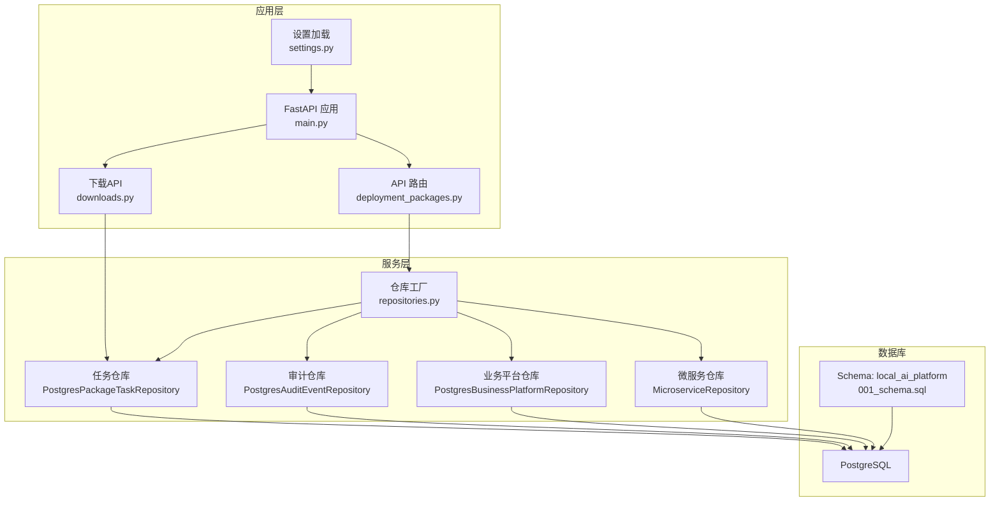
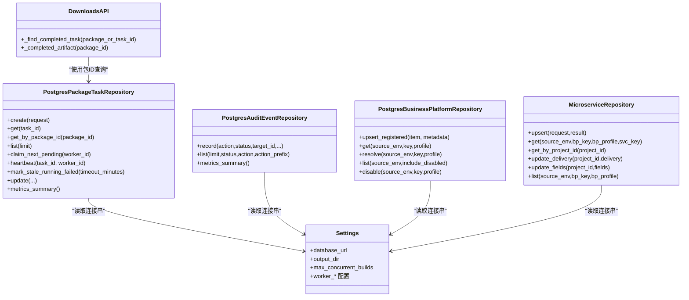
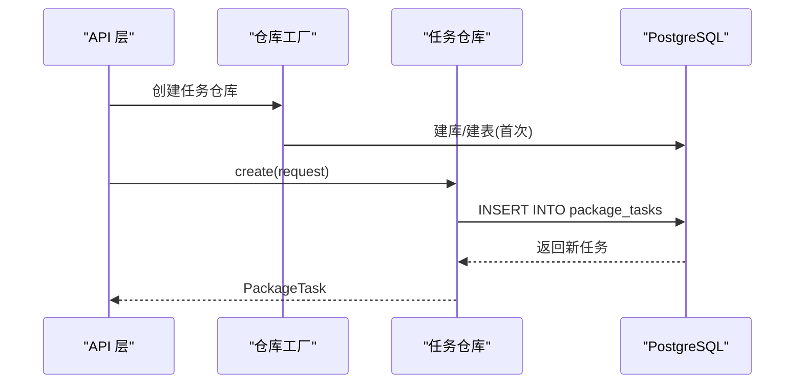
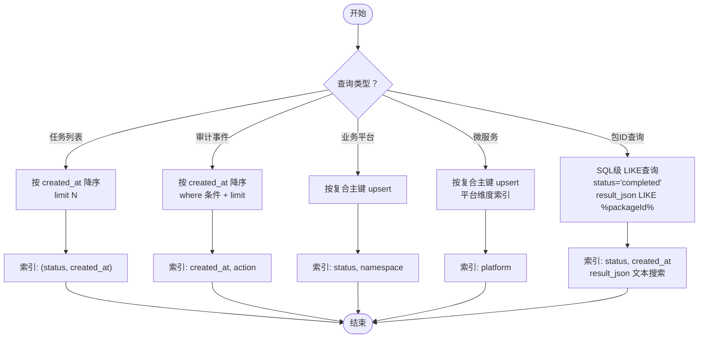
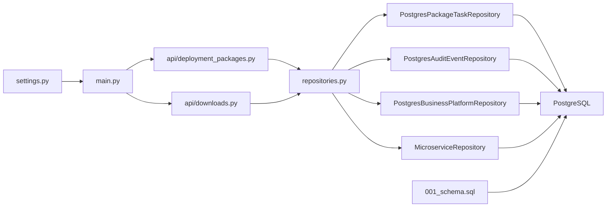

# 数据库架构设计

<cite>
**本文引用的文件**
- [postgres_repositories.py](file://backend/deployment_package_factory/services/deployment_packages/postgres_repositories.py)
- [repositories.py](file://backend/deployment_package_factory/services/deployment_packages/repositories.py)
- [models.py](file://backend/deployment_package_factory/services/deployment_packages/models.py)
- [settings.py](file://backend/deployment_package_factory/settings.py)
- [main.py](file://backend/deployment_package_factory/main.py)
- [deployment_packages.py](file://backend/deployment_package_factory/api/deployment_packages.py)
- [repository.py](file://backend/deployment_package_factory/services/microservices/repository.py)
- [downloads.py](file://backend/deployment_package_factory/api/downloads.py)
- [fakes.py](file://backend/tests/fakes.py)
- [001_schema.sql](file://data/deployment-packages/work/pkg-20260628063833-fb3486e6/local-ai-prod-package-pkg-20260628063833-fb3486e6/init/postgres/001_schema.sql)
- [business.yaml](file://templates/catalog/business.yaml)
</cite>

## 目录
1. [简介](#简介)
2. [项目结构](#项目结构)
3. [核心组件](#核心组件)
4. [架构总览](#架构总览)
5. [详细组件分析](#详细组件分析)
6. [依赖关系分析](#依赖关系分析)
7. [性能考量](#性能考量)
8. [故障排查指南](#故障排查指南)
9. [结论](#结论)
10. [附录](#附录)

## 简介
本文件面向"部署包工厂"的数据库架构，系统性梳理数据库表结构设计、字段定义、数据类型与约束关系，阐明主键与外键设计、索引策略与查询优化方案；解释数据访问层的仓库模式实现与数据库连接管理；阐述数据一致性保障机制、事务处理策略与并发控制方案；给出数据库迁移脚本与版本管理策略建议；并提供性能监控指标与数据库维护最佳实践。

## 项目结构
后端数据库相关代码主要集中在以下模块：
- 数据模型与仓库实现：services/deployment_packages 下的 models.py、postgres_repositories.py、repositories.py
- 微服务元数据仓库：services/microservices/repository.py
- 应用入口与设置：settings.py、api/deployment_packages.py、main.py
- 下载API路由：api/downloads.py
- 初始化脚本示例：data/.../init/postgres/001_schema.sql
- 业务模板：templates/catalog/business.yaml

图表来源
- [deployment_packages.py:63-88](file://backend/deployment_package_factory/api/deployment_packages.py#L63-L88)
- [downloads.py:132-139](file://backend/deployment_package_factory/api/downloads.py#L132-L139)
- [repositories.py:10-25](file://backend/deployment_package_factory/services/deployment_packages/repositories.py#L10-L25)
- [postgres_repositories.py:26-347](file://backend/deployment_package_factory/services/deployment_packages/postgres_repositories.py#L26-L347)
- [repository.py:15-157](file://backend/deployment_package_factory/services/microservices/repository.py#L15-L157)
- [001_schema.sql:9-9](file://data/deployment-packages/work/pkg-20260628063833-fb3486e6/local-ai-prod-package-pkg-20260628063833-fb3486e6/init/postgres/001_schema.sql#L9-L9)

章节来源
- [settings.py:26-41](file://backend/deployment_package_factory/settings.py#L26-L41)
- [main.py:23-64](file://backend/deployment_package_factory/main.py#L23-L64)
- [deployment_packages.py:63-88](file://backend/deployment_package_factory/api/deployment_packages.py#L63-L88)

## 核心组件
- 仓库工厂：集中创建各领域仓库实例，统一注入数据库连接串
- 任务仓库：持久化部署包构建任务的状态、进度、日志、结果等，包含高性能的包ID查询方法
- 审计仓库：记录操作审计事件，支持按动作、状态过滤
- 业务平台仓库：注册与解析业务平台，支持多配置文件(profile)场景
- 微服务仓库：持久化微服务模板与交付元数据，支持 upsert 与按条件查询
- 下载API：提供部署包下载、校验和获取等功能，集成包ID查询优化

章节来源
- [repositories.py:10-25](file://backend/deployment_package_factory/services/deployment_packages/repositories.py#L10-L25)
- [postgres_repositories.py:26-347](file://backend/deployment_package_factory/services/deployment_packages/postgres_repositories.py#L26-L347)
- [repository.py:15-157](file://backend/deployment_package_factory/services/microservices/repository.py#L15-L157)
- [downloads.py:132-139](file://backend/deployment_package_factory/api/downloads.py#L132-L139)

## 架构总览
数据库层采用 PostgreSQL，使用 JSON 文本字段存储复杂对象序列化内容（如请求体、结果、元数据），并通过索引提升查询效率。应用通过仓库模式抽象数据访问，每个仓库负责一个实体域的 CRUD 与聚合查询。特别地，任务仓库实现了高性能的包ID查询方法，避免了Python层面的全表扫描。

图表来源
- [postgres_repositories.py:26-347](file://backend/deployment_package_factory/services/deployment_packages/postgres_repositories.py#L26-L347)
- [repository.py:15-157](file://backend/deployment_package_factory/services/microservices/repository.py#L15-L157)
- [downloads.py:132-139](file://backend/deployment_package_factory/api/downloads.py#L132-L139)
- [settings.py:26-41](file://backend/deployment_package_factory/settings.py#L26-L41)

## 详细组件分析

### 表结构与字段定义

#### package_tasks
- 设计要点
  - 主键：task_id（文本）
  - 状态字段：status（文本枚举值 pending/running/completed/failed/canceled）
  - 进度字段：progress（整数 0..100）
  - 请求/结果/错误/日志：JSON 文本字段，便于灵活扩展
  - 时间戳：created_at、updated_at（ISO 字符串）
  - 工作器标识：worker_id、claimed_at、heartbeat_at
- 索引策略
  - 组合索引：(status, created_at) 用于按状态分页与筛选
  - 单列索引：updated_at 用于最近更新排序
- 查询优化
  - 任务领取：使用 for update skip locked 实现乐观并发下的互斥
  - 超时检测：基于 heartbeat_at 或 updated_at 的时间窗口判定
  - **新增**：包ID查询使用SQL级 LIKE操作避免全表扫描

章节来源
- [postgres_repositories.py:323-341](file://backend/deployment_package_factory/services/deployment_packages/postgres_repositories.py#L323-L341)
- [postgres_repositories.py:98-133](file://backend/deployment_package_factory/services/deployment_packages/postgres_repositories.py#L98-L133)
- [postgres_repositories.py:158-181](file://backend/deployment_package_factory/services/deployment_packages/postgres_repositories.py#L158-L181)
- [postgres_repositories.py:63-73](file://backend/deployment_package_factory/services/deployment_packages/postgres_repositories.py#L63-L73)

#### audit_events
- 设计要点
  - 主键：event_id（文本）
  - 动作/目标/状态/操作者/IP/消息：文本字段
  - 元数据：JSON 文本字段
  - 时间戳：created_at（ISO 字符串）
- 索引策略
  - created_at：倒序查询审计事件
  - action：按动作过滤
- 查询优化
  - 支持 status/action/action_prefix 条件组合查询
  - 限流：最大返回条数限制

章节来源
- [postgres_repositories.py:442-456](file://backend/deployment_package_factory/services/deployment_packages/postgres_repositories.py#L442-L456)
- [postgres_repositories.py:392-421](file://backend/deployment_package_factory/services/deployment_packages/postgres_repositories.py#L392-L421)

#### business_platforms
- 设计要点
  - 复合主键：(source_env, business_key, profile)
  - 名称/命名空间/状态/元数据：文本与 JSON
  - 时间戳：created_at、updated_at
- 索引策略
  - status、namespace 辅助筛选与排序
- 查询优化
  - upsert 使用 ON CONFLICT 更新
  - 解析逻辑支持默认 profile 与唯一性校验

章节来源
- [postgres_repositories.py:568-583](file://backend/deployment_package_factory/services/deployment_packages/postgres_repositories.py#L568-L583)
- [postgres_repositories.py:476-532](file://backend/deployment_package_factory/services/deployment_packages/postgres_repositories.py#L476-L532)

#### microservices
- 设计要点
  - 复合主键：(source_env, business_platform_key, business_platform_profile, service_key)
  - payload_json：完整服务元数据（含交付信息、镜像、制品等）
  - 时间戳：created_at、updated_at
- 索引策略
  - 平台维度索引：辅助按平台查询
- 查询优化
  - upsert 使用 ON CONFLICT 更新
  - 按项目 ID 全量扫描以定位服务（仅在需要时）

章节来源
- [repository.py:120-133](file://backend/deployment_package_factory/services/microservices/repository.py#L120-L133)
- [repository.py:20-47](file://backend/deployment_package_factory/services/microservices/repository.py#L20-L47)

### 数据模型与序列化
- 包装模型：PackageTask、PackageBuildResult、AuditEvent、BusinessPlatform 等均使用 Pydantic 模型进行字段定义与序列化
- JSON 存储：请求体、结果、元数据均以 JSON 文本存入数据库，便于跨版本演进
- 字段别名：大量字段使用 alias 映射，确保与前端/调用方一致

章节来源
- [models.py:218-249](file://backend/deployment_package_factory/services/deployment_packages/models.py#L218-L249)
- [postgres_repositories.py:591-626](file://backend/deployment_package_factory/services/deployment_packages/postgres_repositories.py#L591-L626)
- [postgres_repositories.py:629-654](file://backend/deployment_package_factory/services/deployment_packages/postgres_repositories.py#L629-L654)
- [repository.py:166-207](file://backend/deployment_package_factory/services/microservices/repository.py#L166-L207)

### 仓库模式与连接管理
- 仓库工厂函数：create_task_repository/create_audit_repository/create_business_platform_repository/create_microservice_repository
- 连接管理：每个仓库内部使用上下文管理器打开/关闭连接，避免连接泄漏
- 设置注入：从环境变量 DEPLOYMENT_PACKAGE_DATABASE_URL 获取连接串，未配置则抛出运行时异常

图表来源
- [repositories.py:10-25](file://backend/deployment_package_factory/services/deployment_packages/repositories.py#L10-L25)
- [postgres_repositories.py:319-347](file://backend/deployment_package_factory/services/deployment_packages/postgres_repositories.py#L319-L347)
- [postgres_repositories.py:46-56](file://backend/deployment_package_factory/services/deployment_packages/postgres_repositories.py#L46-L56)

章节来源
- [repositories.py:10-25](file://backend/deployment_package_factory/services/deployment_packages/repositories.py#L10-L25)
- [postgres_repositories.py:343-347](file://backend/deployment_package_factory/services/deployment_packages/postgres_repositories.py#L343-L347)
- [repository.py:154-157](file://backend/deployment_package_factory/services/microservices/repository.py#L154-L157)

### 并发控制与一致性
- 任务领取：SELECT ... FOR UPDATE SKIP LOCKED 实现互斥，避免重复领取
- upsert：ON CONFLICT DO UPDATE 保证幂等写入
- 超时恢复：基于心跳时间窗口判定长时间无心跳的任务并标记失败
- 事务边界：单次更新操作在连接范围内执行，未见显式 BEGIN/COMMIT，遵循库默认行为

章节来源
- [postgres_repositories.py:101-133](file://backend/deployment_package_factory/services/deployment_packages/postgres_repositories.py#L101-L133)
- [postgres_repositories.py:492-506](file://backend/deployment_package_factory/services/deployment_packages/postgres_repositories.py#L492-L506)
- [postgres_repositories.py:158-181](file://backend/deployment_package_factory/services/deployment_packages/postgres_repositories.py#L158-L181)

### 查询流程与优化
- 任务列表：按 created_at 降序分页，结合 (status, created_at) 索引
- 审计事件：按 created_at 降序，支持 action/status 前缀过滤
- 业务平台：按复合主键 upsert，按 status/namespace 辅助查询
- 微服务：按复合主键 upsert，按平台维度索引加速查询
- **新增**：包ID查询：使用SQL级 LIKE操作在已完成任务中查找指定包ID，避免Python层面的全表扫描

图表来源
- [postgres_repositories.py:63-69](file://backend/deployment_package_factory/services/deployment_packages/postgres_repositories.py#L63-L69)
- [postgres_repositories.py:414-421](file://backend/deployment_package_factory/services/deployment_packages/postgres_repositories.py#L414-L421)
- [postgres_repositories.py:568-583](file://backend/deployment_package_factory/services/deployment_packages/postgres_repositories.py#L568-L583)
- [repository.py:120-133](file://backend/deployment_package_factory/services/microservices/repository.py#L120-L133)
- [postgres_repositories.py:63-73](file://backend/deployment_package_factory/services/deployment_packages/postgres_repositories.py#L63-L73)

## 依赖关系分析
- 应用层依赖设置模块加载数据库连接串
- API 层通过仓库工厂创建具体仓库实例
- 下载API通过仓库工厂获取任务仓库，使用包ID查询优化
- 各仓库依赖 PostgreSQL，使用 JSON 文本字段承载复杂对象
- 初始化脚本示例定义了 Schema 命名空间，便于隔离不同环境

图表来源
- [settings.py:26-41](file://backend/deployment_package_factory/settings.py#L26-L41)
- [main.py:23-64](file://backend/deployment_package_factory/main.py#L23-L64)
- [deployment_packages.py:63-88](file://backend/deployment_package_factory/api/deployment_packages.py#L63-L88)
- [downloads.py:132-139](file://backend/deployment_package_factory/api/downloads.py#L132-L139)
- [repositories.py:10-25](file://backend/deployment_package_factory/services/deployment_packages/repositories.py#L10-L25)
- [postgres_repositories.py:26-347](file://backend/deployment_package_factory/services/deployment_packages/postgres_repositories.py#L26-L347)
- [repository.py:15-157](file://backend/deployment_package_factory/services/microservices/repository.py#L15-L157)
- [001_schema.sql:9-9](file://data/deployment-packages/work/pkg-20260628063833-fb3486e6/local-ai-prod-package-pkg-20260628063833-fb3486e6/init/postgres/001_schema.sql#L9-L9)

章节来源
- [deployment_packages.py:63-88](file://backend/deployment_package_factory/api/deployment_packages.py#L63-L88)
- [repositories.py:10-25](file://backend/deployment_package_factory/services/deployment_packages/repositories.py#L10-L25)

## 性能考量
- 连接管理
  - 使用上下文管理器确保连接及时释放，避免连接池耗尽
  - 建议在生产环境引入连接池（例如 psycopg pool manager）以提升吞吐
- 索引策略
  - 已有关键索引：(status, created_at)、updated_at、created_at、action、status/namespace
  - 建议对高频过滤字段增加独立索引或复合索引，如 worker_id、target_id
  - **新增**：包ID查询使用现有索引组合，避免额外索引开销
- 查询优化
  - 列表接口限制返回条数上限，防止大结果集
  - 使用 LIMIT/N 分页，避免全表扫描
  - **新增**：包ID查询使用SQL级 LIKE操作，避免Python层面的全表扫描
- JSON 字段
  - JSON 文本字段便于扩展，但不参与索引；对常用查询字段可考虑拆分或物化
- 并发与锁
  - 任务领取使用 SKIP LOCKED，减少锁竞争
  - 心跳超时检测降低死锁风险

**更新** 新增包ID查询性能优化：get_by_package_id()方法使用SQL级LIKE查询替代Python全表扫描，显著提升包检索性能

章节来源
- [postgres_repositories.py:63-73](file://backend/deployment_package_factory/services/deployment_packages/postgres_repositories.py#L63-L73)
- [downloads.py:132-139](file://backend/deployment_package_factory/api/downloads.py#L132-L139)

## 故障排查指南
- 连接串缺失
  - 现象：启动时报错提示需要 DEPLOYMENT_PACKAGE_DATABASE_URL
  - 排查：确认环境变量已正确设置，且数据库可达
- 仓库初始化失败
  - 现象：UndefinedTable 错误
  - 排查：仓库实现包含自动建表逻辑，若仍失败，检查权限与网络
- 任务领取冲突
  - 现象：多个 Worker 同时领取同一任务
  - 排查：确认使用 for update skip locked；检查数据库锁等待情况
- 心跳超时
  - 现象：运行中任务被标记失败
  - 排查：调整超时阈值；检查 Worker 心跳间隔与网络延迟
- **新增**：包ID查询失败
  - 现象：使用包ID无法找到对应的部署包
  - 排查：确认任务状态为completed且result_json包含正确的packageId字段

章节来源
- [repositories.py:22-25](file://backend/deployment_package_factory/services/deployment_packages/repositories.py#L22-L25)
- [postgres_repositories.py:458-468](file://backend/deployment_package_factory/services/deployment_packages/postgres_repositories.py#L458-L468)
- [postgres_repositories.py:101-133](file://backend/deployment_package_factory/services/deployment_packages/postgres_repositories.py#L101-L133)
- [postgres_repositories.py:158-181](file://backend/deployment_package_factory/services/deployment_packages/postgres_repositories.py#L158-L181)
- [postgres_repositories.py:63-73](file://backend/deployment_package_factory/services/deployment_packages/postgres_repositories.py#L63-L73)

## 结论
该数据库架构以仓库模式为核心，围绕任务、审计、业务平台与微服务四个领域构建，采用 JSON 文本字段承载复杂对象，配合关键索引与并发控制策略，满足高并发任务调度与审计追踪需求。**最新优化**通过get_by_package_id()方法实现了高效的包ID查询，避免了Python层面的全表扫描，显著提升了部署包检索性能。建议在生产环境中引入连接池、完善索引覆盖与物化视图，并持续评估查询模式以优化性能。

## 附录

### 数据库迁移脚本与版本管理策略
- 初始化脚本
  - 示例脚本定义了 Schema 命名空间，建议所有业务表置于该 Schema 下，便于隔离与备份
- 版本管理
  - 建议采用迁移工具（如 Flyway/liquibase）管理 DDL 变更
  - 迁移文件命名规范：前缀递增序号 + 功能描述，如 001_initial.sql、002_add_indexes.sql
  - 变更前先在测试环境验证，再灰度到生产
- 兼容性
  - 新增字段建议默认值与非空约束分离，逐步迁移
  - JSON 字段变更需向前兼容，避免破坏历史数据解析

章节来源
- [001_schema.sql:9-9](file://data/deployment-packages/work/pkg-20260628063833-fb3486e6/local-ai-prod-package-pkg-20260628063833-fb3486e6/init/postgres/001_schema.sql#L9-L9)

### 数据一致性与事务策略
- 任务状态机：pending → running → completed/failed/canceled
- upsert 幂等：通过复合主键与 ON CONFLICT 保证重复导入安全
- 超时回滚：基于心跳时间窗口自动失败，避免僵尸任务
- 事务边界：单次更新在连接范围内执行，建议在需要时显式开启事务块

章节来源
- [postgres_repositories.py:183-200](file://backend/deployment_package_factory/services/deployment_packages/postgres_repositories.py#L183-L200)
- [postgres_repositories.py:244-256](file://backend/deployment_package_factory/services/deployment_packages/postgres_repositories.py#L244-L256)
- [postgres_repositories.py:492-506](file://backend/deployment_package_factory/services/deployment_packages/postgres_repositories.py#L492-L506)

### 性能监控指标
- 任务队列
  - 待处理任务数、运行中任务数、失败率、平均处理时长
- 数据库
  - 连接数、慢查询数量、索引命中率、锁等待时间
- 审计
  - 每分钟审计事件数、按动作分布、错误率
- **新增**：包ID查询性能
  - 包ID查询响应时间、成功率、缓存命中率

章节来源
- [postgres_repositories.py:71-96](file://backend/deployment_package_factory/services/deployment_packages/postgres_repositories.py#L71-L96)
- [postgres_repositories.py:423-436](file://backend/deployment_package_factory/services/deployment_packages/postgres_repositories.py#L423-L436)

### 数据库维护最佳实践
- 定期清理过期任务与产物，控制存储占用
- 监控索引使用情况，定期重建碎片化索引
- 对热点表进行分区或物化视图，降低热路径压力
- 备份策略：全量+增量，保留至少 7 天可恢复点
- **新增**：监控包ID查询性能，根据实际使用情况优化查询策略