# 数据模型设计

<cite>
**本文档引用的文件**
- [models.py](file://backend/deployment_package_factory/services/deployment_packages/models.py)
- [postgres_repositories.py](file://backend/deployment_package_factory/services/deployment_packages/postgres_repositories.py)
- [repository.py](file://backend/deployment_package_factory/services/microservices/repository.py)
- [settings.py](file://backend/deployment_package_factory/services/settings.py)
- [010_mes_lite_schema.sql](file://templates/overlays/mes-lite/init/dm/010_mes_lite_schema.sql)
- [cleanup.py](file://backend/deployment_package_factory/services/deployment_packages/cleanup.py)
</cite>

## 目录
1. [简介](#简介)
2. [项目结构](#项目结构)
3. [核心数据实体](#核心数据实体)
4. [架构概览](#架构概览)
5. [详细组件分析](#详细组件分析)
6. [依赖关系分析](#依赖关系分析)
7. [性能考虑](#性能考虑)
8. [故障排除指南](#故障排除指南)
9. [结论](#结论)

## 简介

部署包工厂数据模型设计围绕四个核心数据实体构建：部署包任务模型、微服务注册模型、系统设置模型和审计事件模型。该数据架构采用PostgreSQL作为主要存储引擎，通过JSON字段实现灵活的数据结构，同时保持强一致性的约束关系。

系统通过严格的主键/外键设计确保数据完整性，通过索引策略优化查询性能，并实现了完整的数据生命周期管理机制。所有数据操作都遵循统一的验证规则和业务约束，确保系统的可靠性和可维护性。

## 项目结构

数据模型架构采用分层设计，每个核心实体都有对应的Pydantic模型定义和PostgreSQL仓库实现：

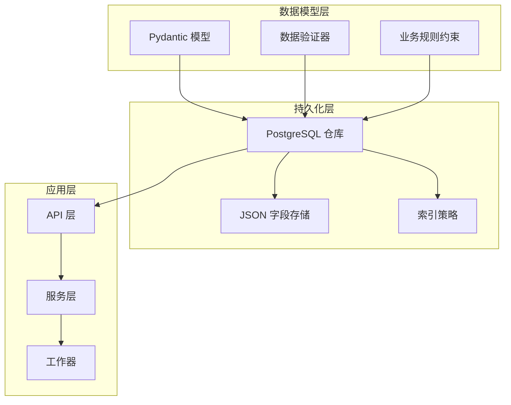

**图表来源**
- [models.py:1-251](file://backend/deployment_package_factory/services/deployment_packages/models.py#L1-L251)
- [postgres_repositories.py:1-703](file://backend/deployment_package_factory/services/deployment_packages/postgres_repositories.py#L1-L703)

**章节来源**
- [models.py:1-251](file://backend/deployment_package_factory/services/deployment_packages/models.py#L1-L251)
- [postgres_repositories.py:1-703](file://backend/deployment_package_factory/services/deployment_packages/postgres_repositories.py#L1-L703)

## 核心数据实体

### 部署包任务模型

部署包任务模型是整个系统的核心数据实体，负责跟踪部署包的完整生命周期。

**主键设计**: 使用自动生成的UUID格式任务ID，确保全局唯一性
**状态管理**: 支持待处理、运行中、已完成、失败、取消等状态转换
**进度跟踪**: 0-100的进度百分比，配合详细日志记录

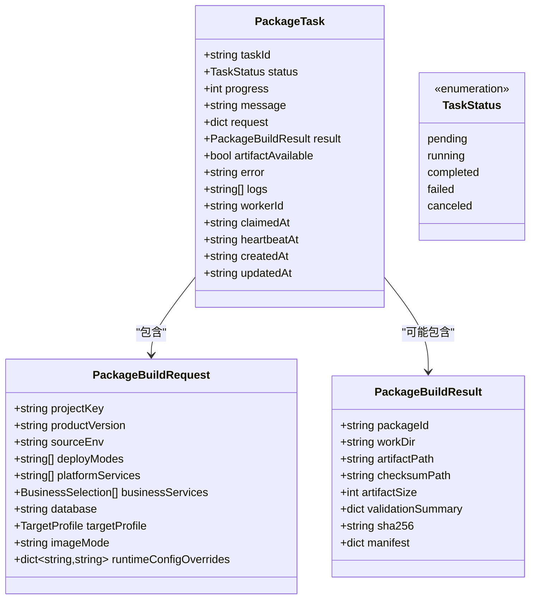

**图表来源**
- [models.py:220-237](file://backend/deployment_package_factory/services/deployment_packages/models.py#L220-L237)
- [models.py:116-134](file://backend/deployment_package_factory/services/deployment_packages/models.py#L116-L134)
- [models.py:206-215](file://backend/deployment_package_factory/services/deployment_packages/models.py#L206-L215)

### 微服务注册模型

微服务注册模型采用JSON文档存储方式，支持灵活的微服务配置和元数据管理。

**复合主键**: (source_env, business_platform_key, business_platform_profile, service_key)
**索引策略**: 主键索引 + 平台维度索引，优化查询性能
**版本控制**: 通过createdAt和updatedAt字段实现数据变更追踪

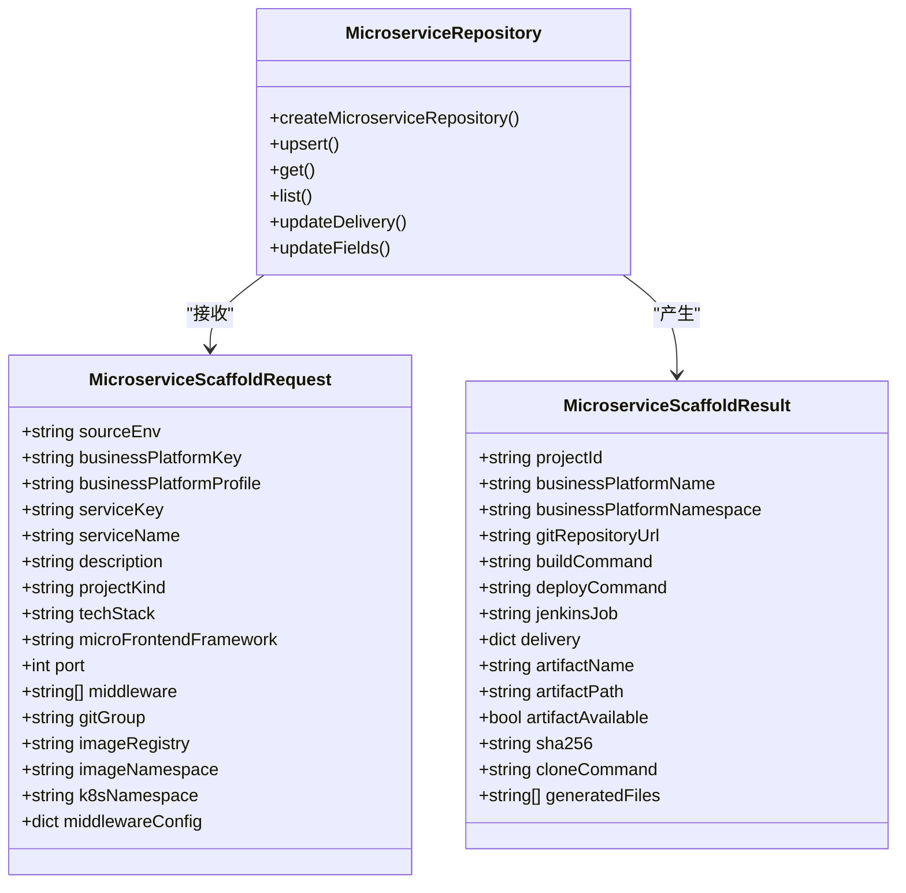

**图表来源**
- [repository.py:15-211](file://backend/deployment_package_factory/services/microservices/repository.py#L15-L211)

### 系统设置模型

系统设置模型采用单表存储设计，使用JSON字段存储复杂的配置结构。

**单一表设计**: key字段为主键，确保全局唯一性
**配置层次**: Git、Harbor、Jenkins、Kubernetes、中间件等多层级配置
**验证规则**: 通过Pydantic验证器确保配置数据的有效性

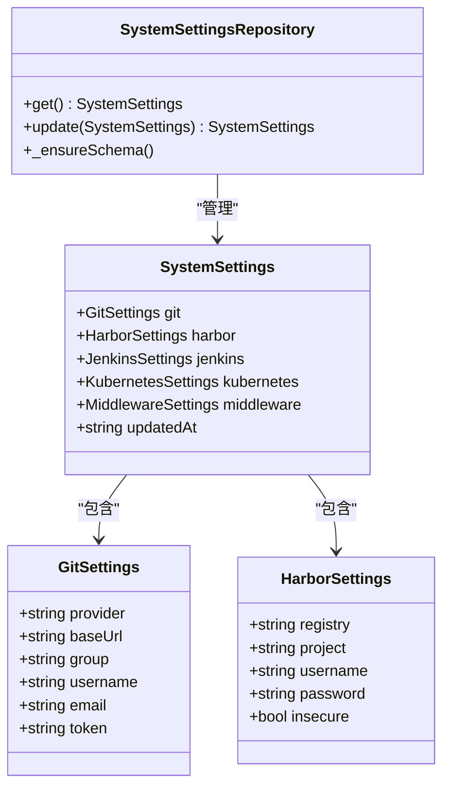

**图表来源**
- [settings.py:160-224](file://backend/deployment_package_factory/services/settings.py#L160-L224)

### 审计事件模型

审计事件模型提供完整的操作追踪能力，支持合规性和审计需求。

**事件标识**: 自动生成的事件ID，格式为"audit-YYYYMMDDHHMMSS-随机字符串"
**时间戳**: UTC时间格式，确保全球一致性
**元数据支持**: JSON字段存储任意结构的审计元数据

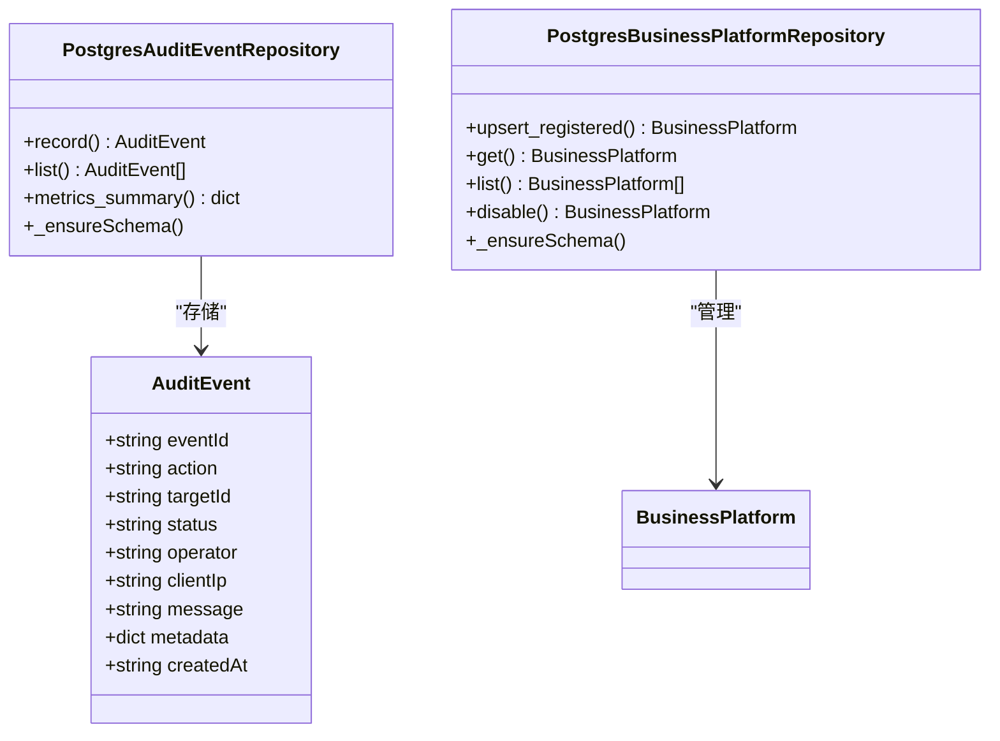

**图表来源**
- [models.py:239-251](file://backend/deployment_package_factory/services/deployment_packages/models.py#L239-L251)
- [postgres_repositories.py:349-469](file://backend/deployment_package_factory/services/deployment_packages/postgres_repositories.py#L349-L469)

**章节来源**
- [models.py:1-251](file://backend/deployment_package_factory/services/deployment_packages/models.py#L1-L251)
- [repository.py:15-211](file://backend/deployment_package_factory/services/microservices/repository.py#L15-L211)
- [settings.py:160-224](file://backend/deployment_package_factory/services/settings.py#L160-L224)

## 架构概览

系统采用三层架构设计，每层都有明确的职责分离：

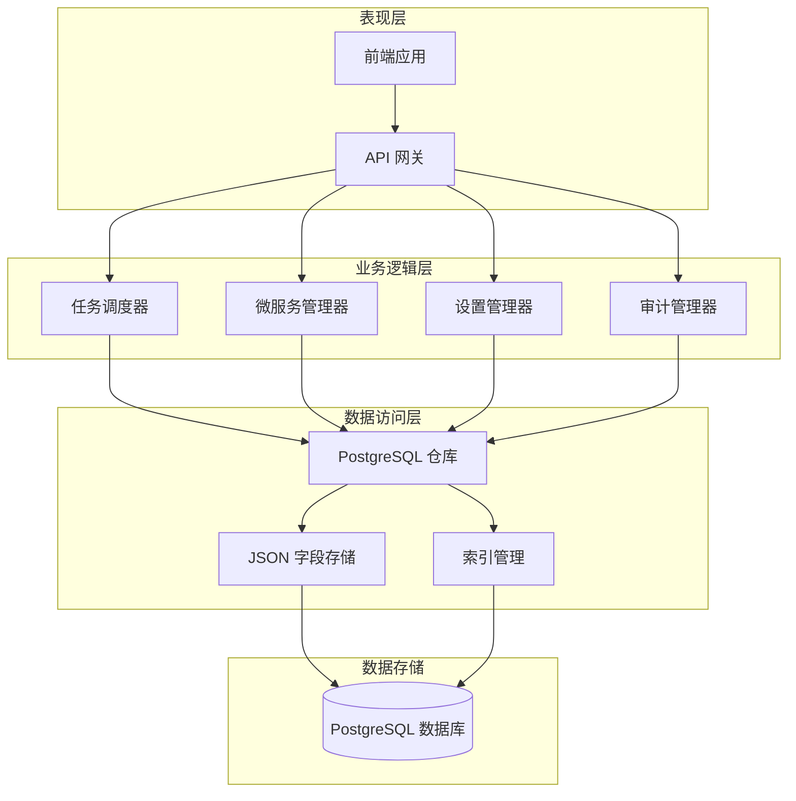

**图表来源**
- [postgres_repositories.py:26-703](file://backend/deployment_package_factory/services/deployment_packages/postgres_repositories.py#L26-L703)
- [repository.py:15-211](file://backend/deployment_package_factory/services/microservices/repository.py#L15-L211)

### 数据流处理

系统通过以下流程处理数据操作：

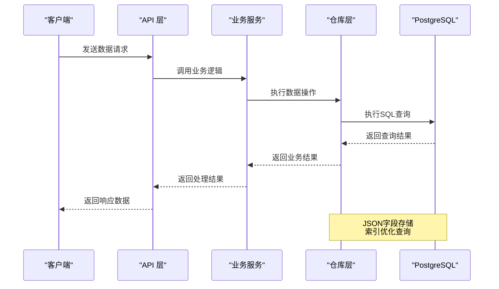

**图表来源**
- [postgres_repositories.py:31-640](file://backend/deployment_package_factory/services/deployment_packages/postgres_repositories.py#L31-L640)

## 详细组件分析

### 部署包任务仓库

部署包任务仓库实现了完整的任务生命周期管理：

**核心功能**:
- 任务创建和状态转换
- 任务领取和心跳检测
- 任务重试和取消机制
- 性能指标统计

**事务处理**:
- 使用PostgreSQL事务确保数据一致性
- 锁机制防止并发冲突
- 超时检测自动失败处理

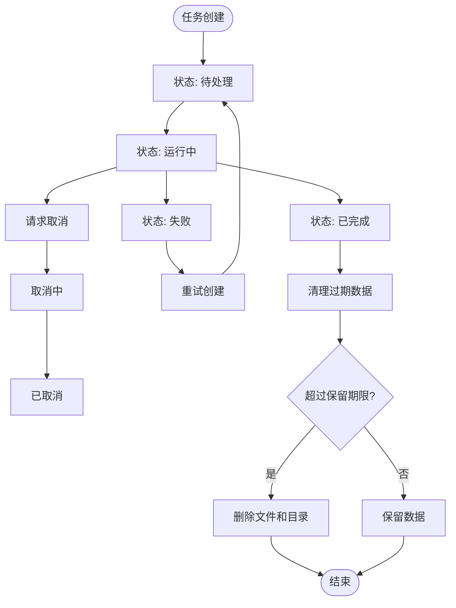

**图表来源**
- [postgres_repositories.py:98-273](file://backend/deployment_package_factory/services/deployment_packages/postgres_repositories.py#L98-L273)

**章节来源**
- [postgres_repositories.py:26-347](file://backend/deployment_package_factory/services/deployment_packages/postgres_repositories.py#L26-L347)

### 微服务仓库

微服务仓库提供了灵活的微服务注册和管理功能：

**存储策略**:
- JSON文档存储微服务完整配置
- 复合主键确保唯一性
- 索引优化常用查询场景

**查询优化**:
- 平台维度查询支持
- 分页查询优化
- 条件过滤查询

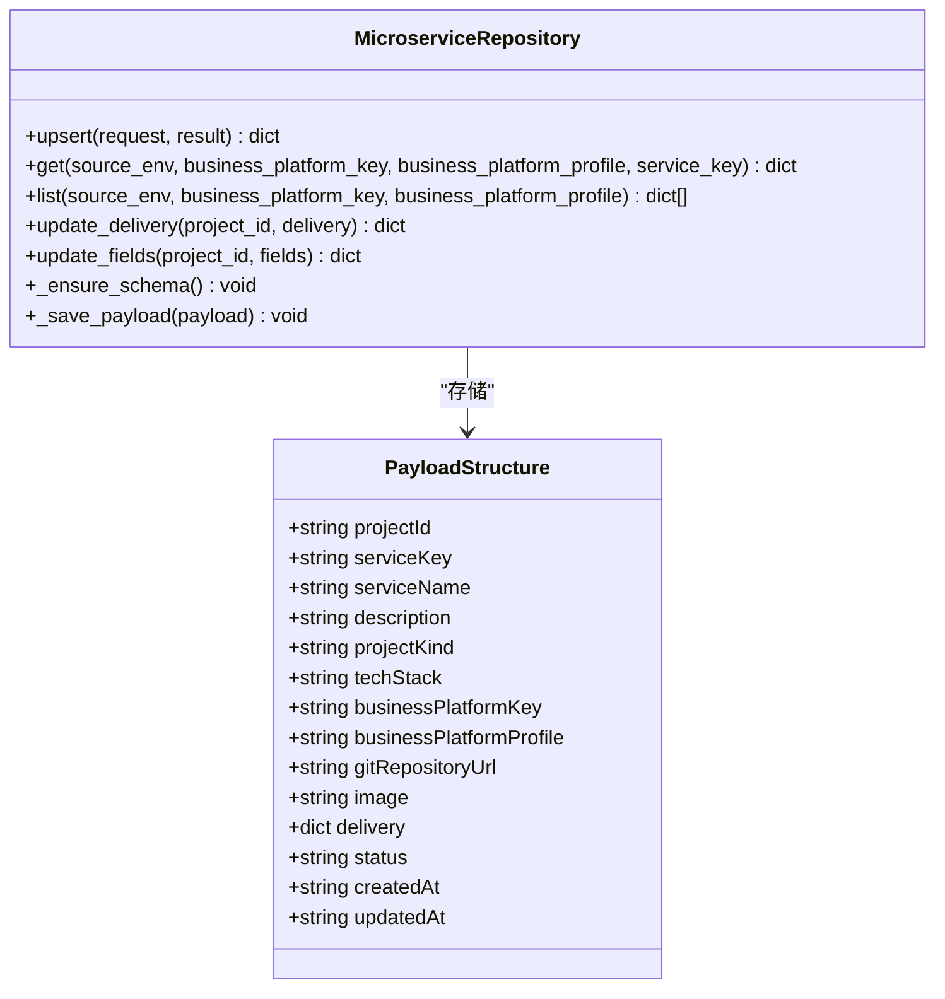

**图表来源**
- [repository.py:20-153](file://backend/deployment_package_factory/services/microservices/repository.py#L20-L153)

**章节来源**
- [repository.py:15-211](file://backend/deployment_package_factory/services/microservices/repository.py#L15-L211)

### 系统设置仓库

系统设置仓库实现了集中化的配置管理：

**配置验证**:
- Git提供商验证（gitlab/github）
- Harbor注册表验证
- Jenkins配置验证
- Kubernetes集群配置验证

**数据完整性**:
- 单表设计确保配置一致性
- JSON字段支持复杂配置结构
- 版本追踪机制

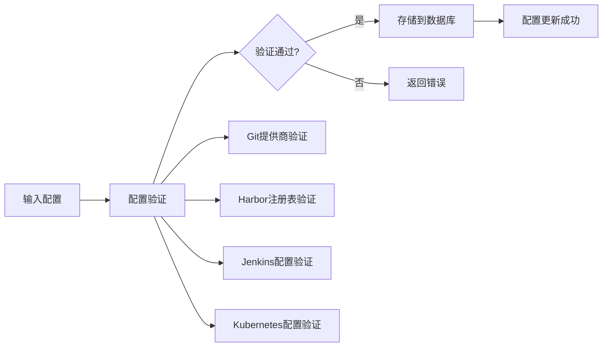

**图表来源**
- [settings.py:26-147](file://backend/deployment_package_factory/services/settings.py#L26-L147)

**章节来源**
- [settings.py:171-224](file://backend/deployment_package_factory/services/settings.py#L171-L224)

### 审计事件仓库

审计事件仓库提供了完整的操作追踪能力：

**事件分类**:
- 用户操作审计
- 系统状态变更
- 错误和异常记录
- 性能指标监控

**查询优化**:
- 时间戳索引优化排序
- 动作类型索引优化过滤
- 分页查询支持大量数据

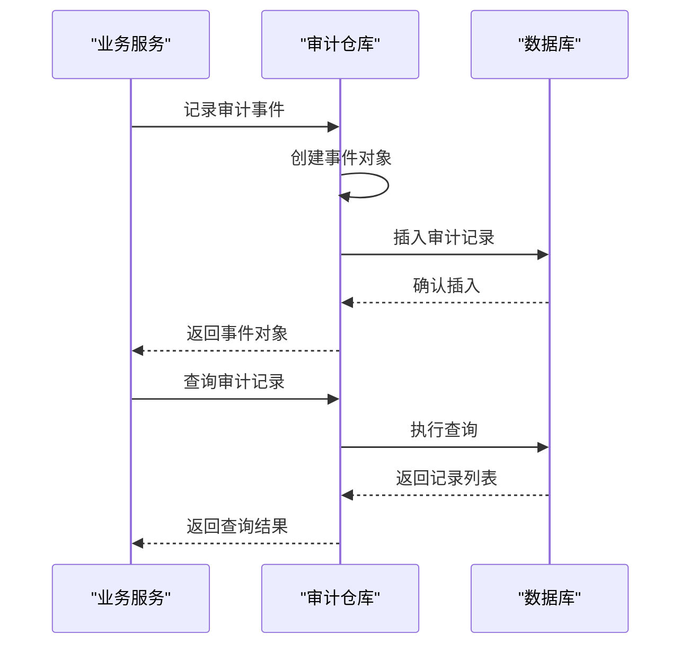

**图表来源**
- [postgres_repositories.py:354-436](file://backend/deployment_package_factory/services/deployment_packages/postgres_repositories.py#L354-L436)

**章节来源**
- [postgres_repositories.py:349-469](file://backend/deployment_package_factory/services/deployment_packages/postgres_repositories.py#L349-L469)

## 依赖关系分析

系统各组件之间的依赖关系如下：

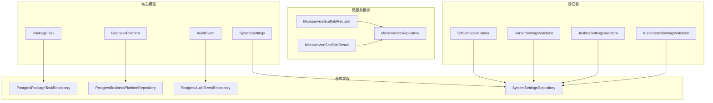

**图表来源**
- [models.py:1-251](file://backend/deployment_package_factory/services/deployment_packages/models.py#L1-L251)
- [postgres_repositories.py:1-703](file://backend/deployment_package_factory/services/deployment_packages/postgres_repositories.py#L1-L703)
- [repository.py:1-211](file://backend/deployment_package_factory/services/microservices/repository.py#L1-L211)

### 数据完整性约束

系统通过多种机制确保数据完整性：

**主键约束**:
- 部署包任务: task_id (UUID)
- 微服务注册: (source_env, business_platform_key, business_platform_profile, service_key)
- 业务平台: (source_env, business_key, profile)
- 系统设置: key (固定值"global")

**外键约束**:
- 无显式外键，通过业务逻辑保证引用完整性
- JSON字段存储避免外键复杂性

**检查约束**:
- 字符串字段长度限制
- 数值范围验证
- 正则表达式验证

**章节来源**
- [postgres_repositories.py:323-583](file://backend/deployment_package_factory/services/deployment_packages/postgres_repositories.py#L323-L583)
- [repository.py:120-132](file://backend/deployment_package_factory/services/microservices/repository.py#L120-L132)

## 性能考虑

### 索引策略

系统采用多层次索引策略优化查询性能：

**部署包任务表索引**:
- 主键索引: task_id
- 复合索引: (status, created_at) - 支持状态查询和排序
- 单列索引: updated_at - 支持最近更新查询

**微服务表索引**:
- 主键索引: (source_env, business_platform_key, business_platform_profile, service_key)
- 复合索引: (source_env, business_platform_key) - 支持平台维度查询

**审计事件表索引**:
- 主键索引: event_id
- 单列索引: created_at - 支持时间范围查询
- 单列索引: action - 支持动作类型过滤

### 查询优化

**批量操作**:
- 使用批量插入减少网络往返
- 分页查询避免大数据集加载
- 条件查询结合索引使用

**缓存策略**:
- 系统设置缓存短期有效
- 经常访问的配置数据缓存
- 查询结果缓存热点数据

**连接池管理**:
- PostgreSQL连接池复用
- 连接超时和重试机制
- 异常连接自动恢复

### 性能监控

**指标收集**:
- 查询响应时间
- 连接池使用率
- 索引命中率
- 数据库负载

**性能调优**:
- 定期分析查询计划
- 索引维护和重建
- 统计信息更新
- 硬件资源监控

## 故障排除指南

### 常见问题诊断

**数据库连接问题**:
- 检查DEPLOYMENT_PACKAGE_DATABASE_URL环境变量
- 验证PostgreSQL服务可用性
- 检查网络连接和防火墙设置

**数据一致性问题**:
- 检查事务提交状态
- 验证主键唯一性约束
- 确认JSON字段格式正确

**性能问题**:
- 分析慢查询日志
- 检查索引使用情况
- 监控数据库资源使用

### 数据修复

**表结构修复**:
- 自动检测和创建缺失表
- 索引重建和优化
- 数据迁移脚本执行

**数据清理**:
- 过期数据自动清理
- 存储空间回收
- 历史数据归档

**章节来源**
- [postgres_repositories.py:458-464](file://backend/deployment_package_factory/services/deployment_packages/postgres_repositories.py#L458-L464)
- [cleanup.py:13-29](file://backend/deployment_package_factory/services/deployment_packages/cleanup.py#L13-L29)

## 结论

部署包工厂数据模型设计体现了现代企业级应用的数据架构最佳实践。通过合理的实体设计、严格的约束机制和完善的性能优化策略，系统能够高效地管理复杂的部署包生命周期。

**关键优势**:
- 灵活的JSON存储支持动态配置
- 强一致性的主键设计确保数据完整性
- 多层次索引优化查询性能
- 完整的审计追踪机制
- 清晰的数据生命周期管理

**未来改进方向**:
- 实现更细粒度的权限控制
- 增加数据备份和恢复机制
- 优化大规模数据场景的性能
- 增强数据迁移工具链

该数据模型为部署包工厂提供了坚实的技术基础，支持系统的稳定运行和持续发展。