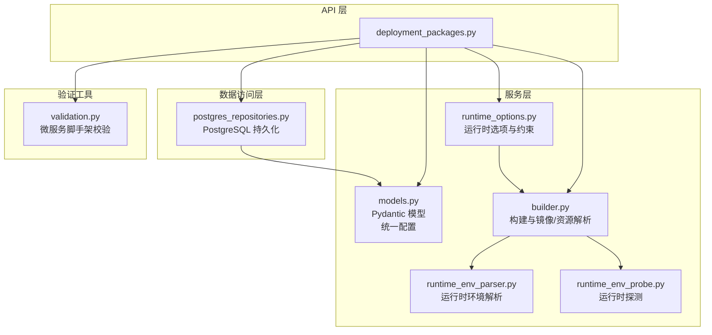
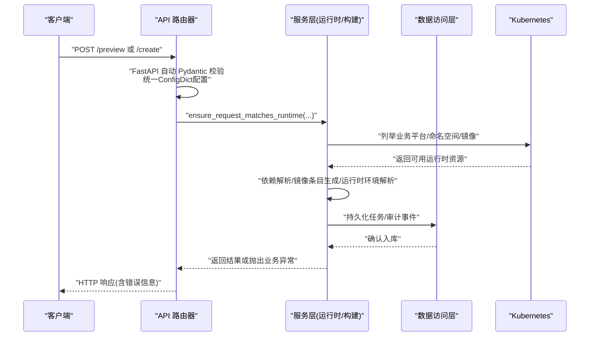
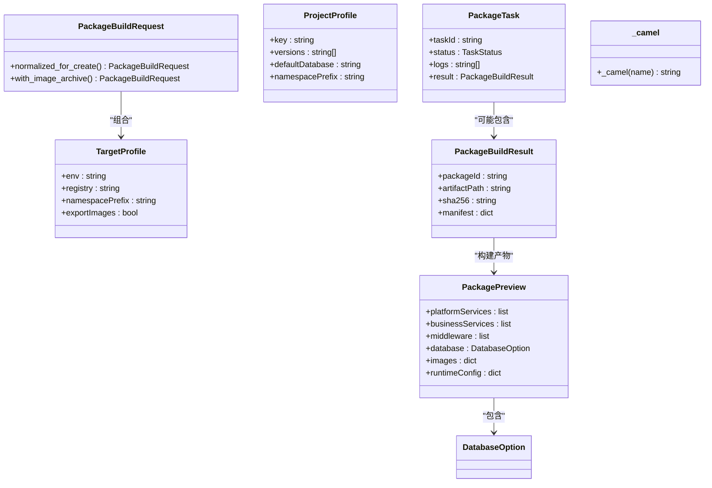
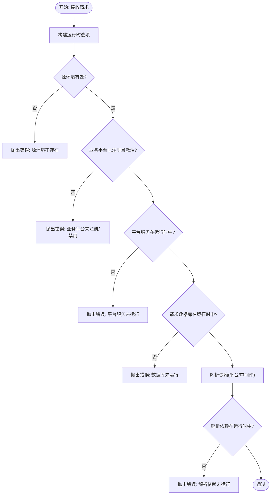
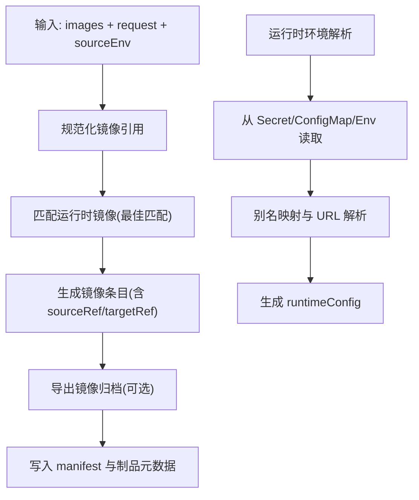
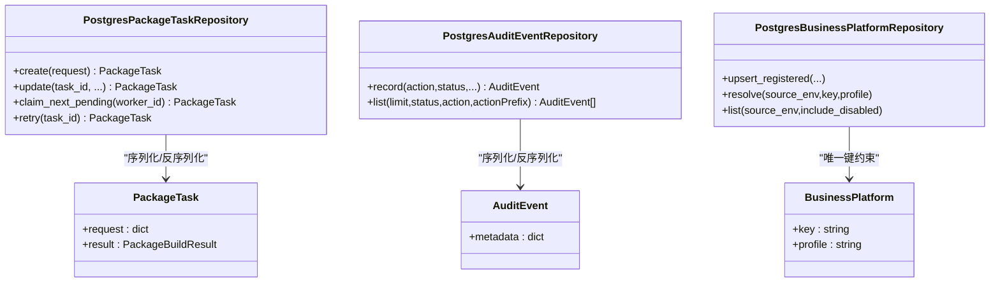
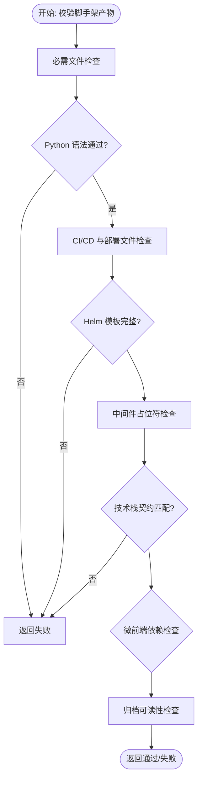
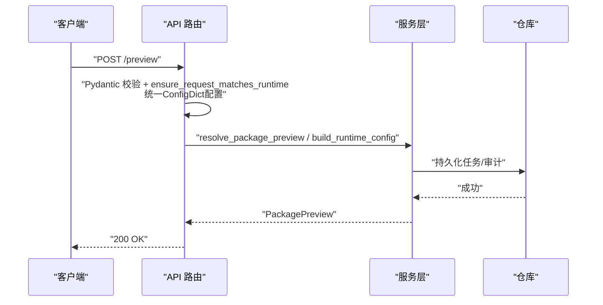
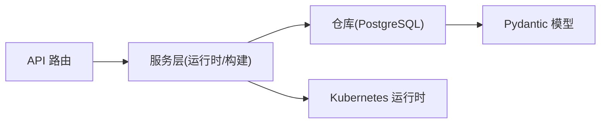

# 数据验证与约束

<cite>
**本文引用的文件**
- [models.py](file://backend/deployment_package_factory/services/deployment_packages/models.py)
- [validation.py](file://backend/deployment_package_factory/services/microservices/validation.py)
- [deployment_packages.py](file://backend/deployment_package_factory/api/deployment_packages.py)
- [builder.py](file://backend/deployment_package_factory/services/deployment_packages/builder.py)
- [runtime_options.py](file://backend/deployment_package_factory/services/deployment_packages/runtime_options.py)
- [runtime_env_parser.py](file://backend/deployment_package_factory/services/deployment_packages/runtime_env_parser.py)
- [runtime_env_probe.py](file://backend/deployment_package_factory/services/deployment_packages/runtime_env_probe.py)
- [postgres_repositories.py](file://backend/deployment_package_factory/services/deployment_packages/postgres_repositories.py)
- [settings.py](file://backend/deployment_package_factory/services/settings.py)
- [test_deployment_package_api.py](file://backend/tests/test_deployment_package_api.py)
</cite>

## 更新摘要
**所做更改**
- 更新了Pydantic配置一致性改进的相关内容
- 新增了统一ConfigDict配置和alias_generator函数的详细说明
- 增强了camelCase命名约定一致性的技术细节
- 扩展了数据验证在各层应用的配置策略

## 目录
1. [引言](#引言)
2. [项目结构](#项目结构)
3. [核心组件](#核心组件)
4. [架构总览](#架构总览)
5. [详细组件分析](#详细组件分析)
6. [依赖分析](#依赖分析)
7. [性能考虑](#性能考虑)
8. [故障排查指南](#故障排查指南)
9. [结论](#结论)
10. [附录](#附录)

## 引言
本文件系统性梳理部署包工厂在"数据验证与约束"方面的设计与实现，覆盖 Pydantic 模型的字段类型与校验、业务规则与依赖关系校验、运行时环境探测与解析、以及在 API 层、服务层与数据访问层的分层验证策略。特别关注Pydantic配置一致性改进，所有模型现在使用统一的ConfigDict配置和alias_generator函数，确保camelCase命名约定的一致性。同时给出常见错误的定位方法、最佳实践与调试技巧，并以图示展示关键流程。

## 项目结构
围绕数据验证的关键模块分布如下：
- API 层：接收请求、进行基础参数校验与异常转换，触发服务层逻辑
- 服务层：核心业务规则校验（运行时环境匹配、依赖解析）、数据装配与产物生成
- 数据访问层：持久化对象的序列化/反序列化与一致性保障
- 验证工具：微服务脚手架产物的二次校验（文件清单、模板、契约等）

**图表来源**
- [deployment_packages.py:1-658](file://backend/deployment_package_factory/api/deployment_packages.py#L1-L658)
- [models.py:1-255](file://backend/deployment_package_factory/services/deployment_packages/models.py#L1-L255)
- [runtime_options.py:1-295](file://backend/deployment_package_factory/services/deployment_packages/runtime_options.py#L1-L295)
- [builder.py:1-800](file://backend/deployment_package_factory/services/deployment_packages/builder.py#L1-L800)
- [runtime_env_parser.py:1-97](file://backend/deployment_package_factory/services/deployment_packages/runtime_env_parser.py#L1-L97)
- [runtime_env_probe.py:1-166](file://backend/deployment_package_factory/services/deployment_packages/runtime_env_probe.py#L1-L166)
- [postgres_repositories.py:1-703](file://backend/deployment_package_factory/services/deployment_packages/postgres_repositories.py#L1-L703)
- [validation.py:1-144](file://backend/deployment_package_factory/services/microservices/validation.py#L1-L144)

**章节来源**
- [deployment_packages.py:1-658](file://backend/deployment_package_factory/api/deployment_packages.py#L1-L658)
- [models.py:1-255](file://backend/deployment_package_factory/services/deployment_packages/models.py#L1-L255)

## 核心组件
- **Pydantic 模型与字段约束**
  - 统一使用ConfigDict(populate_by_name=True, alias_generator=_camel)配置
  - camelCase命名约定确保API与内部一致
  - 大量使用 Field(default_factory=...) 提供安全默认值
  - 使用 Literal 约束枚举值域
- **运行时选项与业务规则校验**
  - ensure_request_matches_runtime：对源环境、平台/业务/中间件/数据库的可用性进行强约束
- **构建期镜像与运行时环境解析**
  - 镜像引用规范化、导出路径与标签推断、运行时镜像匹配
  - 运行时环境变量解析与别名映射
- **数据访问层的序列化/反序列化**
  - JSON 字段的 model_validate/model_validate_json，保证入库/出库一致性
- **微服务脚手架二次校验**
  - 关键文件存在性、语法、模板完整性、契约符合度、归档可读性

**章节来源**
- [models.py:1-255](file://backend/deployment_package_factory/services/deployment_packages/models.py#L1-L255)
- [runtime_options.py:96-160](file://backend/deployment_package_factory/services/deployment_packages/runtime_options.py#L96-L160)
- [builder.py:384-413](file://backend/deployment_package_factory/services/deployment_packages/builder.py#L384-L413)
- [runtime_env_parser.py:10-97](file://backend/deployment_package_factory/services/deployment_packages/runtime_env_parser.py#L10-L97)
- [postgres_repositories.py:31-626](file://backend/deployment_package_factory/services/deployment_packages/postgres_repositories.py#L31-L626)
- [validation.py:9-144](file://backend/deployment_package_factory/services/microservices/validation.py#L9-L144)

## 架构总览
下图展示从 API 到服务层再到数据访问层的验证与约束链路，以及运行时环境探测与解析的交互。

**图表来源**
- [deployment_packages.py:126-165](file://backend/deployment_package_factory/api/deployment_packages.py#L126-L165)
- [runtime_options.py:96-160](file://backend/deployment_package_factory/services/deployment_packages/runtime_options.py#L96-L160)
- [builder.py:146-247](file://backend/deployment_package_factory/services/deployment_packages/builder.py#L146-L247)
- [postgres_repositories.py:31-317](file://backend/deployment_package_factory/services/deployment_packages/postgres_repositories.py#L31-L317)

## 详细组件分析

### Pydantic 模型与字段约束
- **设计要点**
  - 所有模型统一配置ConfigDict(populate_by_name=True, alias_generator=_camel)，确保camelCase命名约定的一致性
  - _camel函数实现下划线到驼峰的自动转换
  - 大量集合/字典字段采用 default_factory，避免可变默认陷阱
  - 使用 Literal 约束状态、模式等枚举值域
- **关键模型与约束**
  - PackageBuildRequest：包含镜像模式、运行时覆盖等，提供 normalized_for_create 与 with_image_archive 的派生行为
  - PackagePreview/PackageBuildResult：用于预览与最终产物的结构化输出
  - PackageTask：任务生命周期与状态机，包含日志、错误等
  - TargetProfile/ProjectProfile：目标环境与项目默认值的约束
- **自定义验证器与派生逻辑**
  - 通过 model_copy/update 实现不可变更新与派生对象
  - 在 API 层使用 model_validate 将请求体转为 Pydantic 对象，确保类型安全

**图表来源**
- [models.py:103-255](file://backend/deployment_package_factory/services/deployment_packages/models.py#L103-L255)

**章节来源**
- [models.py:1-255](file://backend/deployment_package_factory/services/deployment_packages/models.py#L1-L255)

### 运行时选项与业务规则校验
- **核心职责**
  - 构建运行时选项：根据注册的业务平台与可用镜像，动态生成 sourceEnvs、平台/业务/中间件/数据库选项
  - 强约束：确保请求中的 sourceEnv、平台服务、业务平台、数据库、中间件均在运行时环境中实际可用
  - 依赖解析：结合 catalog 与运行时镜像，计算解析后的平台/中间件依赖
- **错误场景**
  - 请求的源环境不在运行时发现的环境中
  - 请求的业务平台未注册或处于禁用状态
  - 请求的平台服务未在运行时中运行
  - 请求的数据库或解析后依赖的中间件未在运行时中运行

**图表来源**
- [runtime_options.py:96-160](file://backend/deployment_package_factory/services/deployment_packages/runtime_options.py#L96-L160)

**章节来源**
- [runtime_options.py:96-160](file://backend/deployment_package_factory/services/deployment_packages/runtime_options.py#L96-L160)

### 构建期镜像与运行时环境解析
- **镜像处理**
  - 规范化镜像引用（补全标签、去除冗余前缀）
  - 计算 sourceRef/targetRef/sourceExportRef，支持导出镜像归档
  - 匹配运行时镜像，优先级基于 registry 与匹配度评分
- **运行时环境解析**
  - 从 Secret/ConfigMap/环境变量中提取键值，支持别名映射与 URL 解析
  - 支持按容器挂载的子路径过滤键集

**图表来源**
- [builder.py:439-492](file://backend/deployment_package_factory/services/deployment_packages/builder.py#L439-L492)
- [builder.py:316-372](file://backend/deployment_package_factory/services/deployment_packages/builder.py#L316-L372)
- [runtime_env_parser.py:10-97](file://backend/deployment_package_factory/services/deployment_packages/runtime_env_parser.py#L10-L97)

**章节来源**
- [builder.py:384-413](file://backend/deployment_package_factory/services/deployment_packages/builder.py#L384-L413)
- [builder.py:439-492](file://backend/deployment_package_factory/services/deployment_packages/builder.py#L439-L492)
- [runtime_env_parser.py:10-97](file://backend/deployment_package_factory/services/deployment_packages/runtime_env_parser.py#L10-L97)

### 数据访问层的验证与约束
- **任务仓库**
  - 使用 model_dump(by_alias=True)/model_validate_json 确保 request/result 字段的序列化/反序列化一致性
  - 状态机更新严格控制进度范围与日志追加
- **审计仓库**
  - 通过 model_validate_json 保证 metadata 字段结构正确
- **业务平台仓库**
  - 冲突键约束（source_env, business_key, profile），确保唯一性

**图表来源**
- [postgres_repositories.py:31-317](file://backend/deployment_package_factory/services/deployment_packages/postgres_repositories.py#L31-L317)
- [postgres_repositories.py:354-421](file://backend/deployment_package_factory/services/deployment_packages/postgres_repositories.py#L354-L421)
- [postgres_repositories.py:471-548](file://backend/deployment_package_factory/services/deployment_packages/postgres_repositories.py#L471-L548)

**章节来源**
- [postgres_repositories.py:31-317](file://backend/deployment_package_factory/services/deployment_packages/postgres_repositories.py#L31-L317)

### 微服务脚手架二次校验
- **能力范围**
  - 必需文件存在性
  - Python 源码语法检查
  - CI/CD 与部署文件存在性与片段匹配
  - Helm 模板完整性与约定检查
  - 中间件占位符完整性
  - 技术栈契约匹配
  - 微前端框架依赖检查
  - 归档文件可读性
- **返回结构**
  - 包含每个检查项的名称、是否通过、消息与文件计数

**图表来源**
- [validation.py:9-144](file://backend/deployment_package_factory/services/microservices/validation.py#L9-L144)

**章节来源**
- [validation.py:9-144](file://backend/deployment_package_factory/services/microservices/validation.py#L9-L144)

### API 层验证策略
- **入参校验**
  - FastAPI 自动基于 Pydantic 模型进行类型与字段校验
  - 对于复杂对象（如 PackageBuildRequest），在路由入口处显式调用 model_validate
  - 统一使用ConfigDict配置确保camelCase命名一致性
- **业务异常转换**
  - 将 CatalogError、PackageBuildError、ValueError 等转换为 HTTP 400
- **审计与操作员识别**
  - 通过头部与请求上下文记录操作员与客户端 IP

**图表来源**
- [deployment_packages.py:126-165](file://backend/deployment_package_factory/api/deployment_packages.py#L126-L165)
- [deployment_packages.py:245-282](file://backend/deployment_package_factory/api/deployment_packages.py#L245-L282)

**章节来源**
- [deployment_packages.py:126-165](file://backend/deployment_package_factory/api/deployment_packages.py#L126-L165)
- [deployment_packages.py:245-282](file://backend/deployment_package_factory/api/deployment_packages.py#L245-L282)

## 依赖分析
- **组件耦合**
  - API 层依赖服务层与仓库层；服务层依赖运行时探测与解析模块
  - 仓库层依赖 Pydantic 模型进行 JSON 序列化/反序列化
- **可能的循环依赖**
  - 当前模块间为单向依赖，未见循环
- **外部依赖**
  - PostgreSQL（psycopg）、Kubernetes API（通过运行时模块封装）

**图表来源**
- [deployment_packages.py:1-658](file://backend/deployment_package_factory/api/deployment_packages.py#L1-L658)
- [postgres_repositories.py:1-703](file://backend/deployment_package_factory/services/deployment_packages/postgres_repositories.py#L1-L703)
- [models.py:1-255](file://backend/deployment_package_factory/services/deployment_packages/models.py#L1-L255)

**章节来源**
- [deployment_packages.py:1-658](file://backend/deployment_package_factory/api/deployment_packages.py#L1-L658)
- [postgres_repositories.py:1-703](file://backend/deployment_package_factory/services/deployment_packages/postgres_repositories.py#L1-L703)

## 性能考虑
- **镜像匹配与运行时扫描**
  - 运行时镜像列表与最佳匹配涉及多次字符串比较，建议限制扫描命名空间数量或缓存结果
- **仓库查询**
  - 分页与索引（状态、时间戳）有助于提升查询性能
- **序列化成本**
  - 大对象（manifest、日志）的 JSON 序列化/反序列化应避免重复计算
- **统一配置优化**
  - ConfigDict统一配置减少了重复设置，提升了配置管理效率

## 故障排查指南
- **常见错误与定位**
  - "源环境未发现于运行时"：检查 DEPLOYMENT_PACKAGE_SOURCE_ENVS 与业务平台注册状态
  - "业务平台未注册/禁用"：确认业务平台在 Kubernetes 中的状态与 profile
  - "平台服务未运行"：核查对应命名空间中的 Pod/Service 状态
  - "数据库/中间件未运行"：核对 catalog 与运行时镜像匹配
  - "请求体类型不匹配"：确认请求体字段与 Pydantic 模型一致（camelCase命名）
  - "配置不一致"：检查ConfigDict配置是否统一应用到所有模型
- **调试技巧**
  - 使用测试客户端构造最小复现请求，逐步缩小范围
  - 查看审计事件与任务日志，定位具体失败阶段
  - 对比 API 层 model_validate 与服务层 model_dump(by_alias=True) 的差异
  - 验证camelCase命名转换是否正确应用
- **最佳实践**
  - 在 API 层统一进行 Pydantic 校验，避免裸字典进入服务层
  - 对外部系统（K8s、数据库）调用增加超时与重试
  - 对大对象序列化进行必要性评估，避免冗余 IO
  - 确保所有新模型都继承统一的ConfigDict配置

**章节来源**
- [test_deployment_package_api.py:147-200](file://backend/tests/test_deployment_package_api.py#L147-L200)
- [deployment_packages.py:163-165](file://backend/deployment_package_factory/api/deployment_packages.py#L163-L165)
- [postgres_repositories.py:31-317](file://backend/deployment_package_factory/services/deployment_packages/postgres_repositories.py#L31-L317)

## 结论
本项目通过 Pydantic 模型、运行时选项校验、镜像与环境解析、仓库层序列化约束以及微服务脚手架二次校验，形成了从 API 到持久化的多层数据验证体系。最新的Pydantic配置一致性改进确保了所有模型使用统一的ConfigDict配置和camelCase命名约定，显著提升了系统的可维护性和数据一致性。遵循本文的分层策略与最佳实践，可显著提升系统的可靠性与可维护性。

## 附录
- **配置加载与环境变量**
  - 设置项包括并发构建数、执行模式、心跳间隔、保留策略等，均提供默认值与正整数校验
- **统一配置规范**
  - 所有Pydantic模型必须使用ConfigDict(populate_by_name=True, alias_generator=_camel)
  - camelCase命名转换函数实现下划线到驼峰的自动转换
  - 确保前后端数据交换的一致性

**章节来源**
- [settings.py:26-57](file://backend/deployment_package_factory/services/settings.py#L26-L57)