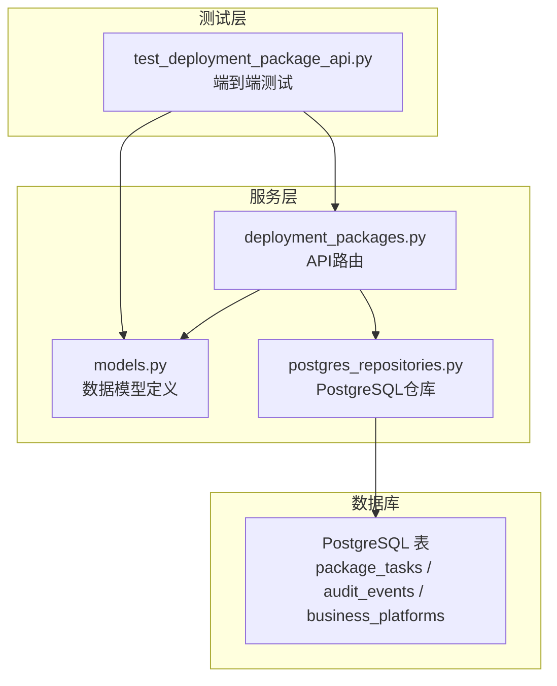
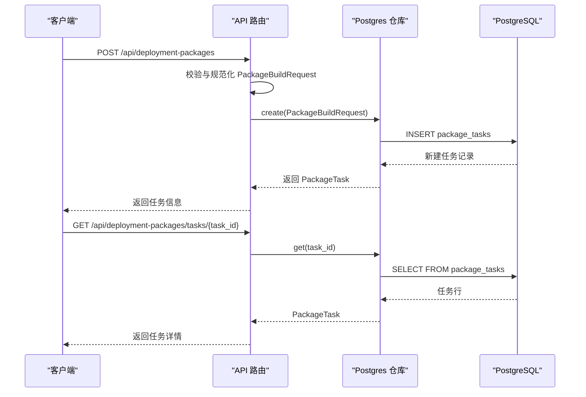
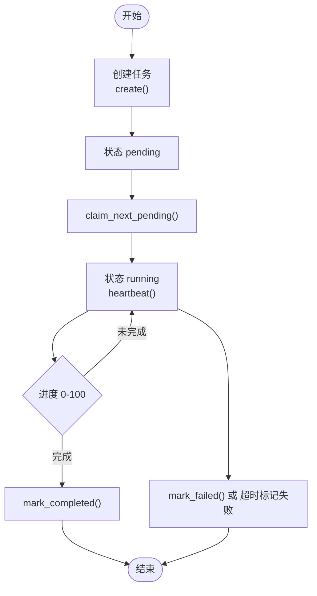
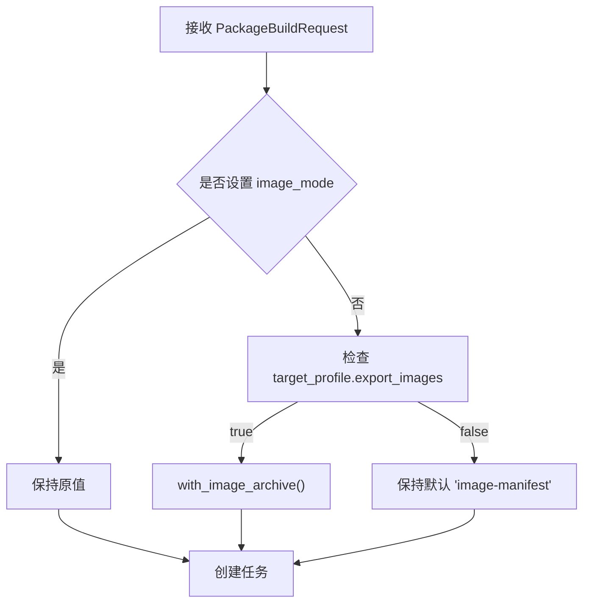
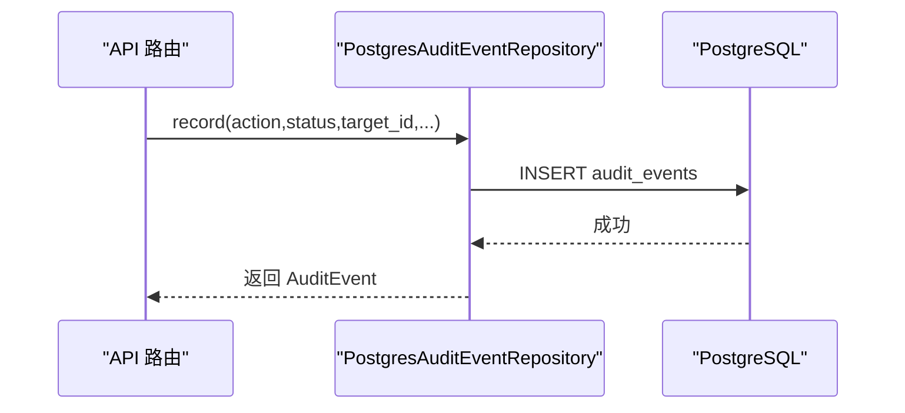
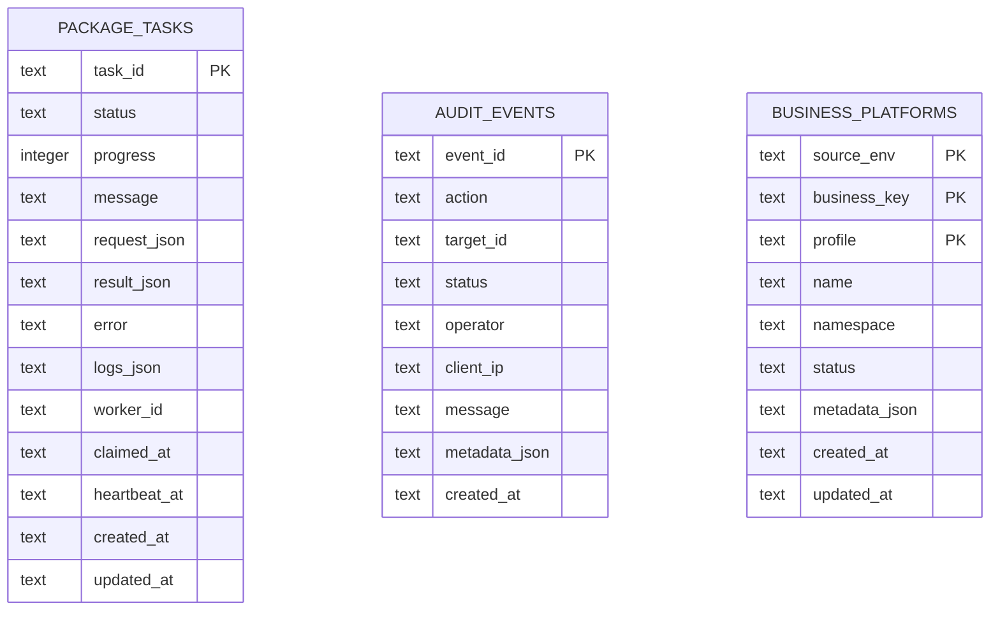

# 核心数据实体

<cite>
**本文档引用的文件**
- [models.py](file://backend/deployment_package_factory/services/deployment_packages/models.py)
- [postgres_repositories.py](file://backend/deployment_package_factory/services/deployment_packages/postgres_repositories.py)
- [deployment_packages.py](file://backend/deployment_package_factory/api/deployment_packages.py)
- [test_deployment_package_api.py](file://backend/tests/test_deployment_package_api.py)
</cite>

## 目录
1. [引言](#引言)
2. [项目结构](#项目结构)
3. [核心组件](#核心组件)
4. [架构总览](#架构总览)
5. [详细组件分析](#详细组件分析)
6. [依赖分析](#依赖分析)
7. [性能考虑](#性能考虑)
8. [故障排查指南](#故障排查指南)
9. [结论](#结论)
10. [附录](#附录)

## 引言
本文件聚焦于部署包工厂的核心数据实体，系统性梳理并解释以下关键模型：
- PackageTask 任务模型
- PackageBuildRequest 构建请求模型
- PackagePreview 预览模型
- AuditEvent 审计事件模型

内容涵盖字段定义、数据类型、默认值、验证规则、实体间关系与依赖、序列化/反序列化机制，以及与数据库的映射关系，并通过测试与API调用路径提供实际使用示例。

## 项目结构
核心数据模型位于服务层，数据库访问通过PostgreSQL仓库实现，API层负责对外暴露REST接口并编排业务流程。

图表来源
- [models.py:116-251](file://backend/deployment_package_factory/services/deployment_packages/models.py#L116-L251)
- [postgres_repositories.py:26-703](file://backend/deployment_package_factory/services/deployment_packages/postgres_repositories.py#L26-L703)
- [deployment_packages.py:1-658](file://backend/deployment_package_factory/api/deployment_packages.py#L1-L658)

章节来源
- [models.py:1-251](file://backend/deployment_package_factory/services/deployment_packages/models.py#L1-L251)
- [postgres_repositories.py:1-703](file://backend/deployment_package_factory/services/deployment_packages/postgres_repositories.py#L1-L703)
- [deployment_packages.py:1-658](file://backend/deployment_package_factory/api/deployment_packages.py#L1-L658)

## 核心组件
本节对四个核心数据模型进行逐项解析，包含字段、类型、默认值、验证规则及用途。

- PackageBuildRequest（构建请求）
  - 继承自 PackagePreviewRequest，新增 image_mode 与 runtime_config_overrides 字段
  - 关键字段
    - project_key: 字符串，默认空
    - product_version: 字符串，默认空
    - source_env: 字符串，默认 "test"
    - deploy_modes: 字符串列表，默认空
    - platform_services: 字符串列表，默认空
    - business_services: BusinessSelection 列表，默认空
    - database: 字符串，默认空
    - target_profile: TargetProfile 对象，默认空
    - image_mode: "image-manifest" 或 "image-archive"，默认 "image-manifest"
    - runtime_config_overrides: 字典，默认空
  - 验证与行为
    - normalized_for_create(): 根据 image_mode 与 target_profile.export_images 自动规范化为镜像归档模式
    - with_image_archive(): 返回复制后的对象，强制设置 image_mode 为 "image-archive" 并开启 export_images
  - 使用场景
    - 创建部署包任务时的输入载体；在API中经校验后写入任务仓库

- PackagePreview（预览结果）
  - 关键字段
    - platform_services: ResolvedDependency 列表
    - business_services: ResolvedDependency 列表
    - middleware: ResolvedDependency 列表
    - database: DatabaseOption
    - images: 字典[str, list[str]]
    - image_entries: 列表，默认空
    - runtime_config: 字典，默认空
    - warnings: 字符串列表，默认空
  - 使用场景
    - 预览阶段汇总平台/业务中间件依赖、镜像清单、运行时配置与告警信息

- PackageTask（任务）
  - 关键字段
    - task_id: 字符串，主键
    - status: "pending" | "running" | "completed" | "failed" | "canceled"
    - progress: 整数，0-100
    - message: 字符串
    - request: 字典（保存原始请求）
    - result: PackageBuildResult | None
    - artifact_available: 布尔，默认 False
    - error: 字符串
    - logs: 字符串列表
    - worker_id: 字符串，默认空
    - claimed_at / heartbeat_at / created_at / updated_at: ISO时间字符串
  - 使用场景
    - 任务生命周期管理（创建、领取、心跳、更新、完成、失败、取消、重试）

- AuditEvent（审计事件）
  - 关键字段
    - event_id: 字符串，主键
    - action: 字符串
    - target_id: 字符串，默认空
    - status: 字符串
    - operator: 字符串，默认空
    - client_ip: 字符串，默认空
    - message: 字符串，默认空
    - metadata: 字典，默认空
    - created_at: ISO时间字符串
  - 使用场景
    - 记录用户操作、任务状态变更、下载等关键动作

章节来源
- [models.py:104-251](file://backend/deployment_package_factory/services/deployment_packages/models.py#L104-L251)

## 架构总览
下图展示从API到仓库再到数据库的数据流，以及模型在各层的职责分工。

图表来源
- [deployment_packages.py:245-305](file://backend/deployment_package_factory/api/deployment_packages.py#L245-L305)
- [postgres_repositories.py:31-134](file://backend/deployment_package_factory/services/deployment_packages/postgres_repositories.py#L31-L134)

## 详细组件分析

### PackageTask 模型
- 设计要点
  - 采用 Pydantic BaseModel，支持别名映射（如 taskId → task_id）
  - 状态机：pending → running → completed/failed/canceled
  - 进度范围约束：0-100
  - 日志与错误字段用于追踪执行过程
- 数据库映射
  - 表：package_tasks
  - 主键：task_id
  - JSON列：request_json、result_json、logs_json、metadata_json（审计事件）
  - 索引：按 status+created_at、updated_at 排序查询优化
- 生命周期方法
  - claim_next_pending：公平抢占式领取任务
  - heartbeat：保活与超时检测
  - update：原子更新状态、进度、日志、结果等
  - mark_completed/mark_failed/cancel/retry：状态转换与重试逻辑
- 实际使用示例（参考测试）
  - 创建任务后轮询获取状态，或触发取消/重试

图表来源
- [postgres_repositories.py:98-272](file://backend/deployment_package_factory/services/deployment_packages/postgres_repositories.py#L98-L272)

章节来源
- [models.py:220-237](file://backend/deployment_package_factory/services/deployment_packages/models.py#L220-L237)
- [postgres_repositories.py:319-342](file://backend/deployment_package_factory/services/deployment_packages/postgres_repositories.py#L319-L342)
- [deployment_packages.py:245-305](file://backend/deployment_package_factory/api/deployment_packages.py#L245-L305)

### PackageBuildRequest 模型
- 设计要点
  - 扩展预览请求，增加镜像打包模式与运行时覆盖
  - 提供规范化方法，确保创建时的默认行为一致
- 验证与默认值
  - image_mode 默认 "image-manifest"
  - 当未显式设置且目标导出镜像时，自动切换为 "image-archive"
- 实际使用示例（参考API）
  - 在创建部署包时调用 normalized_for_create() 规范化请求

图表来源
- [models.py:120-133](file://backend/deployment_package_factory/services/deployment_packages/models.py#L120-L133)

章节来源
- [models.py:116-133](file://backend/deployment_package_factory/services/deployment_packages/models.py#L116-L133)
- [deployment_packages.py:252-282](file://backend/deployment_package_factory/api/deployment_packages.py#L252-L282)

### PackagePreview 模型
- 设计要点
  - 聚合依赖解析结果、镜像清单、运行时配置与警告
  - 便于前端渲染与用户确认
- 实际使用示例（参考测试）
  - 预览接口返回该模型，包含镜像条目与运行时配置

章节来源
- [models.py:193-204](file://backend/deployment_package_factory/services/deployment_packages/models.py#L193-L204)
- [deployment_packages.py:126-165](file://backend/deployment_package_factory/api/deployment_packages.py#L126-L165)

### AuditEvent 模型
- 设计要点
  - 记录操作者、来源IP、动作、目标、状态、元数据与时间戳
  - 支持按 action/status 查询与统计
- 数据库映射
  - 表：audit_events
  - 主键：event_id
  - JSON列：metadata_json
  - 索引：created_at、action
- 实际使用示例（参考API）
  - 各类操作均通过 _audit() 记录审计事件

图表来源
- [postgres_repositories.py:354-390](file://backend/deployment_package_factory/services/deployment_packages/postgres_repositories.py#L354-L390)

章节来源
- [models.py:239-251](file://backend/deployment_package_factory/services/deployment_packages/models.py#L239-L251)
- [postgres_repositories.py:438-457](file://backend/deployment_package_factory/services/deployment_packages/postgres_repositories.py#L438-L457)
- [deployment_packages.py:599-621](file://backend/deployment_package_factory/api/deployment_packages.py#L599-L621)

## 依赖分析
- 模型与仓库的映射关系
  - PackageTask ↔ package_tasks 表（JSON列保存 request/result/logs）
  - AuditEvent ↔ audit_events 表（JSON列保存 metadata）
  - BusinessPlatform ↔ business_platforms 表（复合主键：source_env, business_key, profile）
- 外部依赖
  - PostgreSQL（psycopg）作为持久化存储
  - FastAPI（API层）与Pydantic（模型校验）
- 参考测试
  - 通过测试验证模型在序列化/反序列化、API交互中的正确性

图表来源
- [postgres_repositories.py:323-339](file://backend/deployment_package_factory/services/deployment_packages/postgres_repositories.py#L323-L339)
- [postgres_repositories.py:442-453](file://backend/deployment_package_factory/services/deployment_packages/postgres_repositories.py#L442-L453)
- [postgres_repositories.py:568-583](file://backend/deployment_package_factory/services/deployment_packages/postgres_repositories.py#L568-L583)

章节来源
- [postgres_repositories.py:319-584](file://backend/deployment_package_factory/services/deployment_packages/postgres_repositories.py#L319-L584)

## 性能考虑
- 索引策略
  - package_tasks：按 (status, created_at) 与 updated_at 建立索引，提升查询与排序效率
  - audit_events：按 created_at 与 action 建立索引，支持高频检索
- JSON列处理
  - request_json/result_json/logs_json/metadata_json 采用文本存储，避免复杂嵌套结构导致的查询开销
- 心跳与超时
  - 通过 heartbeat_at 与 updated_at 的组合判断任务存活，超时自动标记失败，降低僵尸任务影响

## 故障排查指南
- 任务状态异常
  - 检查 heartbeat 是否持续更新；若超时则会被标记失败
  - 查看 logs 中的错误信息与最后一条日志
- 无法获取任务
  - 确认 task_id 正确；检查 created_at 排序与 limit 参数
- 审计事件缺失
  - 确认 _audit() 调用链；仓库会自动创建表并重试 UndefinedTable 错误
- 下载失败
  - 确认 artifact_path 存在且可读；校验 SHA256 与 ETag

章节来源
- [postgres_repositories.py:135-181](file://backend/deployment_package_factory/services/deployment_packages/postgres_repositories.py#L135-L181)
- [postgres_repositories.py:358-464](file://backend/deployment_package_factory/services/deployment_packages/postgres_repositories.py#L358-L464)
- [deployment_packages.py:392-460](file://backend/deployment_package_factory/api/deployment_packages.py#L392-L460)

## 结论
本文档系统梳理了部署包工厂的核心数据实体及其与数据库的映射关系，明确了字段语义、默认值与验证规则，并通过API与测试展示了典型使用场景。建议在扩展新功能时遵循现有模型与仓库模式，确保数据一致性与可维护性。

## 附录

### 序列化与反序列化机制
- Python 层
  - Pydantic 模型支持 model_dump()/model_dump_json() 与 model_validate_json()
  - 别名映射：如 taskId ↔ task_id、targetProfile ↔ target_profile 等
- 数据库存储
  - JSON 文本列保存复杂对象（request/result/logs/metadata），读取时再反序列化为模型实例
- 典型流程
  - 写入：模型 → model_dump_json(by_alias=True) → INSERT
  - 读取：SELECT → json.loads → model_validate_json()

章节来源
- [models.py:116-251](file://backend/deployment_package_factory/services/deployment_packages/models.py#L116-L251)
- [postgres_repositories.py:591-654](file://backend/deployment_package_factory/services/deployment_packages/postgres_repositories.py#L591-L654)

### 实际使用示例（路径指引）
- 创建部署包任务
  - API：POST /api/deployment-packages
  - 测试：[test_create_get_and_download_deployment_package:400-462](file://backend/tests/test_deployment_package_api.py#L400-L462)
- 获取任务详情
  - API：GET /api/deployment-packages/tasks/{task_id}
  - 测试：同上
- 预览部署包
  - API：POST /api/deployment-packages/preview
  - 测试：[test_deployment_package_preview_returns_resolved_dependencies:147-178](file://backend/tests/test_deployment_package_api.py#L147-L178)
- 审计事件查询
  - API：GET /api/deployment-packages/audit-events
  - 实现：[list:392-421](file://backend/deployment_package_factory/services/deployment_packages/postgres_repositories.py#L392-L421)