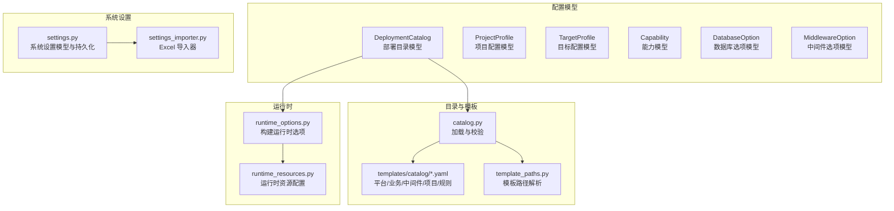
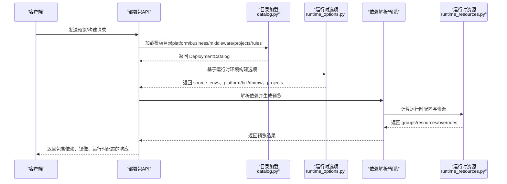
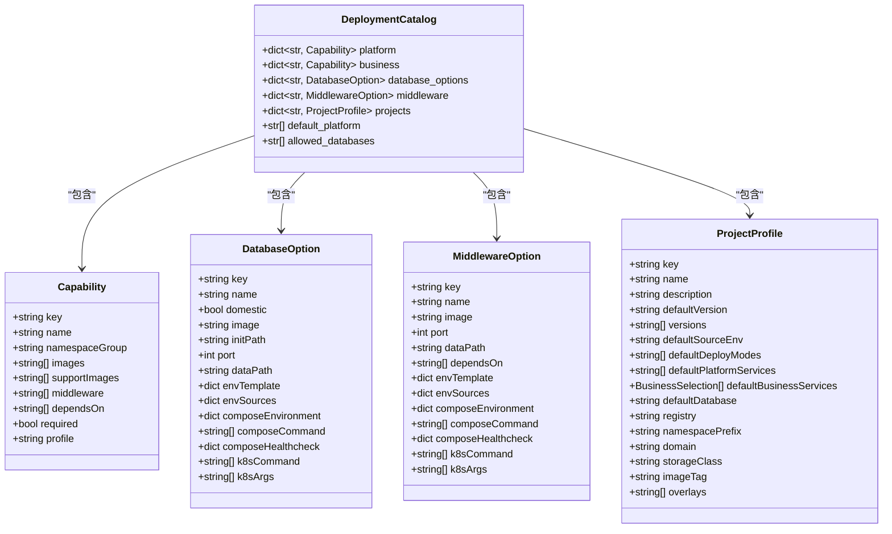
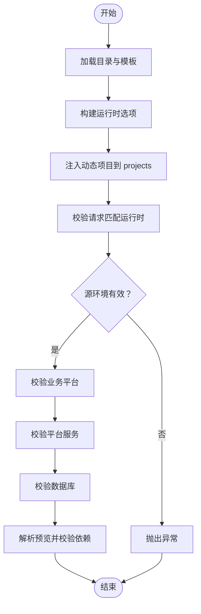
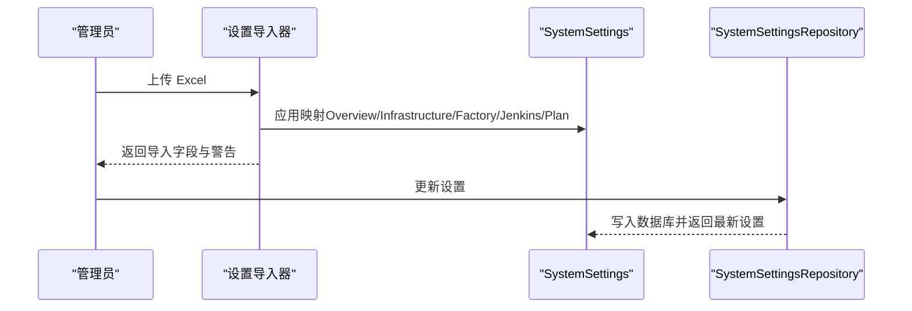
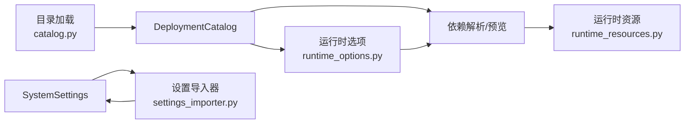

# 配置数据模型

<cite>
**本文引用的文件**
- [models.py](file://backend/deployment_package_factory/services/deployment_packages/models.py)
- [runtime_options.py](file://backend/deployment_package_factory/services/deployment_packages/runtime_options.py)
- [catalog.py](file://backend/deployment_package_factory/services/deployment_packages/catalog.py)
- [settings.py](file://backend/deployment_package_factory/services/settings.py)
- [settings_importer.py](file://backend/deployment_package_factory/services/settings_importer.py)
- [runtime_resources.py](file://backend/deployment_package_factory/services/deployment_packages/runtime_resources.py)
- [platform.yaml](file://templates/catalog/platform.yaml)
- [business.yaml](file://templates/catalog/business.yaml)
- [middleware.yaml](file://templates/catalog/middleware.yaml)
- [projects.yaml](file://templates/catalog/projects.yaml)
- [dependency-rules.yaml](file://templates/catalog/dependency-rules.yaml)
- [template_paths.py](file://backend/deployment_package_factory/services/deployment_packages/template_paths.py)
- [test_deployment_package_api.py](file://backend/tests/test_deployment_package_api.py)
</cite>

## 目录
1. [简介](#简介)
2. [项目结构](#项目结构)
3. [核心组件](#核心组件)
4. [架构总览](#架构总览)
5. [详细组件分析](#详细组件分析)
6. [依赖分析](#依赖分析)
7. [性能考虑](#性能考虑)
8. [故障排查指南](#故障排查指南)
9. [结论](#结论)
10. [附录](#附录)

## 简介
本文件面向部署包工厂的配置数据模型，系统性梳理并解释以下核心模型：DeploymentCatalog（部署目录模型）、ProjectProfile（项目配置模型）、TargetProfile（目标配置模型），以及 DatabaseOption、MiddlewareOption、Capability 等选项模型的设计与用途。文档重点阐述：
- 模型的层次结构、继承关系与组合模式
- 配置验证规则、默认值设置与业务含义
- 在不同场景下的使用方式与最佳实践
- 配置模型与系统设置的关系，以及配置的导入导出机制

## 项目结构
配置数据模型主要分布在后端服务层的“部署包”子模块中，并由模板目录中的 YAML 文件提供运行时能力与默认配置来源。关键位置如下：
- 数据模型定义：backend/deployment_package_factory/services/deployment_packages/models.py
- 目录加载与校验：backend/deployment_package_factory/services/deployment_packages/catalog.py
- 运行时选项构建：backend/deployment_package_factory/services/deployment_packages/runtime_options.py
- 运行时资源与环境配置：backend/deployment_package_factory/services/deployment_packages/runtime_resources.py
- 系统设置与持久化：backend/deployment_package_factory/services/settings.py
- 系统设置导入器（Excel 导入）：backend/deployment_package_factory/services/settings_importer.py
- 模板路径解析：backend/deployment_package_factory/services/deployment_packages/template_paths.py
- 模板目录（YAML）：templates/catalog/*.yaml

图表来源
- [models.py:54-100](file://backend/deployment_package_factory/services/deployment_packages/models.py#L54-L100)
- [catalog.py:44-79](file://backend/deployment_package_factory/services/deployment_packages/catalog.py#L44-L79)
- [runtime_options.py:26-85](file://backend/deployment_package_factory/services/deployment_packages/runtime_options.py#L26-L85)
- [runtime_resources.py:25-52](file://backend/deployment_package_factory/services/deployment_packages/runtime_resources.py#L25-L52)
- [settings.py:158-166](file://backend/deployment_package_factory/services/settings.py#L158-L166)
- [settings_importer.py:21-35](file://backend/deployment_package_factory/services/settings_importer.py#L21-L35)
- [template_paths.py:24-25](file://backend/deployment_package_factory/services/deployment_packages/template_paths.py#L24-L25)

章节来源
- [models.py:54-100](file://backend/deployment_package_factory/services/deployment_packages/models.py#L54-L100)
- [catalog.py:44-79](file://backend/deployment_package_factory/services/deployment_packages/catalog.py#L44-L79)
- [runtime_options.py:26-85](file://backend/deployment_package_factory/services/deployment_packages/runtime_options.py#L26-L85)
- [runtime_resources.py:25-52](file://backend/deployment_package_factory/services/deployment_packages/runtime_resources.py#L25-L52)
- [settings.py:158-166](file://backend/deployment_package_factory/services/settings.py#L158-L166)
- [settings_importer.py:21-35](file://backend/deployment_package_factory/services/settings_importer.py#L21-L35)
- [template_paths.py:24-25](file://backend/deployment_package_factory/services/deployment_packages/template_paths.py#L24-L25)

## 核心组件
本节对四大核心模型进行逐项说明，包括字段语义、默认值、别名映射与典型用法。

- DeploymentCatalog（部署目录模型）
  - 作用：聚合平台能力、业务能力、数据库选项、中间件选项、项目配置与全局默认策略。
  - 关键字段与默认值：
    - platform: 平台能力字典（Capability）
    - business: 业务能力字典（Capability）
    - database_options: 数据库选项字典（DatabaseOption）
    - middleware: 中间件选项字典（MiddlewareOption）
    - projects: 项目配置字典（ProjectProfile，默认空）
    - default_platform: 默认平台服务列表（默认空）
    - allowed_databases: 允许的数据库键集合（默认空）
  - 业务含义：作为部署包构建的“知识库”，驱动依赖解析、预览与构建流程。

- ProjectProfile（项目配置模型）
  - 作用：描述一个可交付项目的默认行为与部署参数。
  - 关键字段与默认值：
    - key/name/description：标识与描述
    - defaultVersion：默认版本号（默认空）
    - versions：可用版本列表（默认空）
    - defaultSourceEnv：默认源环境（默认 test）
    - defaultDeployModes：默认部署模式列表（默认空）
    - defaultPlatformServices：默认平台服务键列表（默认空）
    - defaultBusinessServices：默认业务服务选择列表（默认空）
    - defaultDatabase：默认数据库键（默认 postgres）
    - registry/namespacePrefix/domain/storageClass/imageTag：部署命名空间与镜像标签等（见模板示例）
    - overlays：叠加模板名称列表（默认空）

- TargetProfile（目标配置模型）
  - 作用：描述目标环境的部署参数（如命名空间前缀、域名、镜像仓库等）。
  - 关键字段与默认值：
    - env（默认 prod）、domain（默认 prod.example.com）
    - sourceRegistry/sourceRegistryInsecure：源镜像仓库与不安全标志
    - registry：目标镜像仓库
    - namespacePrefix（默认 prod）、storageClass（默认空）
    - exportImages（默认 False）

- Capability（能力模型）
  - 作用：抽象平台或业务能力，用于声明依赖关系与命名空间分组。
  - 关键字段与默认值：
    - key/name/namespace_group（别名 namespaceGroup）
    - images/support_images：运行镜像与支持镜像
    - middleware：依赖的中间件键列表
    - depends_on：依赖的平台服务键列表
    - required（默认 False）、profile（默认空）

- DatabaseOption（数据库选项模型）
  - 作用：描述可选数据库及其运行参数（镜像、端口、初始化路径、环境模板与来源、Compose/K8s 启动命令与健康检查等）。
  - 关键字段与默认值：
    - key/name/domestic/image/initPath/port/dataPath
    - env_template/env_sources/compose_environment/compose_command/compose_healthcheck
    - k8s_command/k8s_args

- MiddlewareOption（中间件选项模型）
  - 作用：描述可选中间件及其运行参数（镜像、端口、依赖、环境模板与来源、Compose/K8s 启动命令与健康检查等）。
  - 关键字段与默认值：
    - key/name/image/port/dataPath/depends_on
    - env_template/env_sources/compose_environment/compose_command/compose_healthcheck
    - k8s_command/k8s_args

章节来源
- [models.py:54-100](file://backend/deployment_package_factory/services/deployment_packages/models.py#L54-L100)
- [models.py:70-87](file://backend/deployment_package_factory/services/deployment_packages/models.py#L70-L87)
- [models.py:90-99](file://backend/deployment_package_factory/services/deployment_packages/models.py#L90-L99)
- [models.py:6-17](file://backend/deployment_package_factory/services/deployment_packages/models.py#L6-L17)
- [models.py:19-35](file://backend/deployment_package_factory/services/deployment_packages/models.py#L19-L35)
- [models.py:37-52](file://backend/deployment_package_factory/services/deployment_packages/models.py#L37-L52)

## 架构总览
配置数据模型围绕“目录加载—运行时选项—构建预览—运行时资源”的主干流程工作。模板 YAML 提供静态能力与默认值，系统设置负责运行时环境参数，最终在请求阶段被规范化与校验。

图表来源
- [catalog.py:44-79](file://backend/deployment_package_factory/services/deployment_packages/catalog.py#L44-L79)
- [runtime_options.py:26-85](file://backend/deployment_package_factory/services/deployment_packages/runtime_options.py#L26-L85)
- [runtime_resources.py:25-52](file://backend/deployment_package_factory/services/deployment_packages/runtime_resources.py#L25-L52)

## 详细组件分析

### DeploymentCatalog 目录模型
- 层次结构与组合模式
  - 顶层聚合多个字典：platform、business、database_options、middleware、projects
  - 通过 default_platform 与 allowed_databases 提供全局默认策略
- 加载与校验
  - 从模板目录读取 YAML，构造各模型实例并执行跨模型一致性校验
  - 校验规则包括：平台与业务键冲突、中间件依赖未知、项目引用了不存在的能力或数据库等
- 默认值与业务含义
  - default_platform 用于在无显式选择时的最小平台集
  - allowed_databases 控制可选数据库范围

图表来源
- [models.py:54-100](file://backend/deployment_package_factory/services/deployment_packages/models.py#L54-L100)
- [models.py:6-17](file://backend/deployment_package_factory/services/deployment_packages/models.py#L6-L17)
- [models.py:19-35](file://backend/deployment_package_factory/services/deployment_packages/models.py#L19-L35)
- [models.py:37-52](file://backend/deployment_package_factory/services/deployment_packages/models.py#L37-L52)
- [models.py:70-87](file://backend/deployment_package_factory/services/deployment_packages/models.py#L70-L87)

章节来源
- [catalog.py:44-79](file://backend/deployment_package_factory/services/deployment_packages/catalog.py#L44-L79)
- [catalog.py:82-121](file://backend/deployment_package_factory/services/deployment_packages/catalog.py#L82-L121)
- [platform.yaml:1-66](file://templates/catalog/platform.yaml#L1-L66)
- [business.yaml:1-60](file://templates/catalog/business.yaml#L1-L60)
- [middleware.yaml:1-283](file://templates/catalog/middleware.yaml#L1-L283)
- [projects.yaml:1-54](file://templates/catalog/projects.yaml#L1-L54)
- [dependency-rules.yaml:1-9](file://templates/catalog/dependency-rules.yaml#L1-L9)

### ProjectProfile 项目配置模型
- 字段与默认值
  - defaultSourceEnv、defaultDatabase、namespacePrefix、domain、storageClass、imageTag 等均来自模板示例与模型定义
- 业务含义
  - 描述一个可交付项目的默认版本、默认平台/业务服务、默认数据库、命名空间前缀、镜像标签与叠加模板等
- 与运行时的关系
  - 运行时会基于注册的业务平台动态注入项目条目，扩展 DeploymentCatalog 的 projects 字典

章节来源
- [models.py:70-87](file://backend/deployment_package_factory/services/deployment_packages/models.py#L70-L87)
- [runtime_options.py:203-240](file://backend/deployment_package_factory/services/deployment_packages/runtime_options.py#L203-L240)
- [projects.yaml:1-54](file://templates/catalog/projects.yaml#L1-L54)

### TargetProfile 目标配置模型
- 字段与默认值
  - env、domain、namespacePrefix、storageClass、exportImages 等均有默认值
- 业务含义
  - 描述目标环境的命名空间前缀、域名、镜像仓库与是否导出镜像等
- 与构建流程的关系
  - 在构建请求中可覆盖默认目标配置，影响镜像打包与导出策略

章节来源
- [models.py:90-99](file://backend/deployment_package_factory/services/deployment_packages/models.py#L90-L99)

### Capability、DatabaseOption、MiddlewareOption 选项模型
- Capability
  - 用于声明平台/业务能力的依赖关系（depends_on）、命名空间分组（namespace_group）、镜像与中间件依赖
- DatabaseOption/MiddlewareOption
  - 描述运行参数：镜像、端口、数据目录、环境模板与来源、Compose/K8s 启动命令与健康检查
  - 支持别名映射（如 namespaceGroup、initPath、envTemplate 等），便于与模板保持一致

章节来源
- [models.py:6-17](file://backend/deployment_package_factory/services/deployment_packages/models.py#L6-L17)
- [models.py:19-35](file://backend/deployment_package_factory/services/deployment_packages/models.py#L19-L35)
- [models.py:37-52](file://backend/deployment_package_factory/services/deployment_packages/models.py#L37-L52)
- [platform.yaml:1-66](file://templates/catalog/platform.yaml#L1-L66)
- [business.yaml:1-60](file://templates/catalog/business.yaml#L1-L60)
- [middleware.yaml:1-283](file://templates/catalog/middleware.yaml#L1-L283)

### 运行时选项构建与校验
- 构建流程
  - 读取注册的业务平台与运行时镜像，推导可用的 source_envs、平台服务、业务服务、数据库选项、中间件与项目
  - 将动态项目注入到 DeploymentCatalog 的 projects 字典中
- 校验逻辑
  - 确保请求的源环境存在于运行时
  - 校验业务/平台/数据库/中间件的依赖在运行时处于活跃状态
  - 对预览结果再次校验数据库与解析后的依赖

图表来源
- [runtime_options.py:26-85](file://backend/deployment_package_factory/services/deployment_packages/runtime_options.py#L26-L85)
- [runtime_options.py:96-160](file://backend/deployment_package_factory/services/deployment_packages/runtime_options.py#L96-L160)

章节来源
- [runtime_options.py:26-85](file://backend/deployment_package_factory/services/deployment_packages/runtime_options.py#L26-L85)
- [runtime_options.py:96-160](file://backend/deployment_package_factory/services/deployment_packages/runtime_options.py#L96-L160)

### 运行时资源配置
- 功能概述
  - 基于请求、预览结果与运行时环境，合并探针值与覆盖项，生成运行时配置组与资源清单
  - 自动探测数据库 DSN、MinIO Bucket、Qdrant Collection 等资源，并去重与应用覆盖
- 关键点
  - 支持敏感值标记与公开配置过滤
  - 支持从 Pod 环境变量与模板环境变量中解析值

章节来源
- [runtime_resources.py:25-52](file://backend/deployment_package_factory/services/deployment_packages/runtime_resources.py#L25-L52)
- [runtime_resources.py:82-92](file://backend/deployment_package_factory/services/deployment_packages/runtime_resources.py#L82-L92)
- [runtime_resources.py:95-127](file://backend/deployment_package_factory/services/deployment_packages/runtime_resources.py#L95-L127)
- [runtime_resources.py:159-203](file://backend/deployment_package_factory/services/deployment_packages/runtime_resources.py#L159-L203)

### 系统设置与导入导出
- 系统设置模型
  - 包含 Git、Harbor、Jenkins、Kubernetes、中间件等配置，支持字段校验与默认值
  - 提供持久化仓库（PostgreSQL），支持读取与更新
- 设置导入器
  - 从 Excel 工作簿中解析多张表，按字段映射更新 SystemSettings
  - 支持多种字段识别与警告提示

图表来源
- [settings_importer.py:21-35](file://backend/deployment_package_factory/services/settings_importer.py#L21-L35)
- [settings_importer.py:38-106](file://backend/deployment_package_factory/services/settings_importer.py#L38-L106)
- [settings.py:158-198](file://backend/deployment_package_factory/services/settings.py#L158-L198)

章节来源
- [settings.py:158-198](file://backend/deployment_package_factory/services/settings.py#L158-L198)
- [settings_importer.py:21-35](file://backend/deployment_package_factory/services/settings_importer.py#L21-L35)
- [settings_importer.py:38-106](file://backend/deployment_package_factory/services/settings_importer.py#L38-L106)

## 依赖分析
- 组件耦合与内聚
  - DeploymentCatalog 是核心聚合体，被目录加载、运行时选项构建与依赖解析广泛依赖
  - 运行时选项构建依赖目录与业务平台注册信息，形成“目录→运行时→请求”的链路
- 外部依赖与集成点
  - 模板目录（YAML）提供静态能力与默认值
  - 系统设置通过持久化仓库与导入器参与配置闭环
- 潜在循环依赖
  - 当前设计以单向依赖为主：目录→运行时→请求；未发现循环依赖迹象

图表来源
- [catalog.py:44-79](file://backend/deployment_package_factory/services/deployment_packages/catalog.py#L44-L79)
- [runtime_options.py:26-85](file://backend/deployment_package_factory/services/deployment_packages/runtime_options.py#L26-L85)
- [runtime_resources.py:25-52](file://backend/deployment_package_factory/services/deployment_packages/runtime_resources.py#L25-L52)
- [settings_importer.py:21-35](file://backend/deployment_package_factory/services/settings_importer.py#L21-L35)

章节来源
- [catalog.py:44-79](file://backend/deployment_package_factory/services/deployment_packages/catalog.py#L44-L79)
- [runtime_options.py:26-85](file://backend/deployment_package_factory/services/deployment_packages/runtime_options.py#L26-L85)
- [runtime_resources.py:25-52](file://backend/deployment_package_factory/services/deployment_packages/runtime_resources.py#L25-L52)
- [settings_importer.py:21-35](file://backend/deployment_package_factory/services/settings_importer.py#L21-L35)

## 性能考虑
- 目录加载与校验
  - YAML 解析与模型校验为 O(N) 级别，N 为能力与选项数量；建议缓存目录结果以减少重复加载
- 运行时选项构建
  - 镜像扫描与候选环境筛选为 O(E×M) 级别，E 为候选环境数，M 为镜像数；可通过限制候选环境列表（环境变量）优化
- 运行时资源配置
  - 探针与去重操作为线性复杂度；建议在大规模服务场景下批量处理与缓存探针结果

## 故障排查指南
- 目录校验错误
  - 常见原因：平台与业务键冲突、依赖未知、缺少数据库选项
  - 定位方法：查看目录校验函数的错误消息，核对模板 YAML 的键与依赖声明
- 请求与运行时不匹配
  - 常见原因：请求的源环境不在运行时、业务/平台/数据库/中间件未就绪
  - 定位方法：使用运行时选项校验函数输出的缺失项列表，确认运行时镜像与注册状态
- 系统设置导入失败
  - 常见原因：Excel 表格格式不符、字段无法识别
  - 定位方法：检查导入器返回的警告列表，确认映射字段与工作簿结构

章节来源
- [catalog.py:82-121](file://backend/deployment_package_factory/services/deployment_packages/catalog.py#L82-L121)
- [runtime_options.py:96-160](file://backend/deployment_package_factory/services/deployment_packages/runtime_options.py#L96-L160)
- [settings_importer.py:21-35](file://backend/deployment_package_factory/services/settings_importer.py#L21-L35)

## 结论
配置数据模型以 DeploymentCatalog 为核心，结合模板目录与运行时环境，实现了从静态能力到动态部署的完整闭环。通过严格的校验与默认值策略，确保了配置的一致性与可维护性；通过系统设置与导入导出机制，进一步完善了配置的生命周期管理。在实际使用中，建议：
- 明确平台/业务/中间件的依赖关系与命名空间分组
- 合理设置默认值与允许范围，避免不必要的校验失败
- 利用运行时选项构建与校验功能，提前发现潜在问题
- 使用系统设置与导入器统一管理环境参数，保障一致性

## 附录
- 使用示例（场景化说明）
  - 场景一：标准 EAM 项目预览
    - 选择源环境、部署模式、默认平台与业务服务、默认数据库，触发依赖解析与运行时资源配置
    - 参考接口与断言：[test_deployment_package_api.py:147-178](file://backend/tests/test_deployment_package_api.py#L147-L178)
  - 场景二：MES 轻量项目与国产数据库
    - 选择 dm 数据库与轻量 overlay，验证镜像条目与运行时配置
    - 参考接口与断言：[test_deployment_package_api.py:180-200](file://backend/tests/test_deployment_package_api.py#L180-L200)
  - 场景三：系统设置导入
    - 从 Excel 导入环境配置，检查导入字段与警告
    - 参考实现：[settings_importer.py:21-35](file://backend/deployment_package_factory/services/settings_importer.py#L21-L35)

章节来源
- [test_deployment_package_api.py:147-178](file://backend/tests/test_deployment_package_api.py#L147-L178)
- [test_deployment_package_api.py:180-200](file://backend/tests/test_deployment_package_api.py#L180-L200)
- [settings_importer.py:21-35](file://backend/deployment_package_factory/services/settings_importer.py#L21-L35)