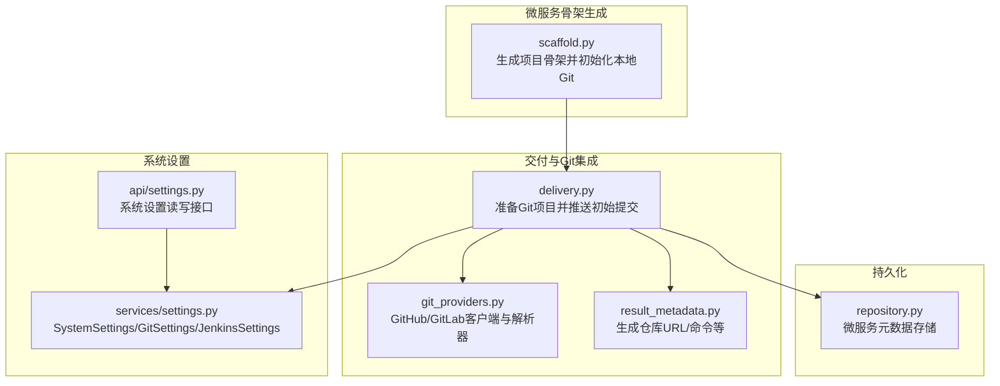
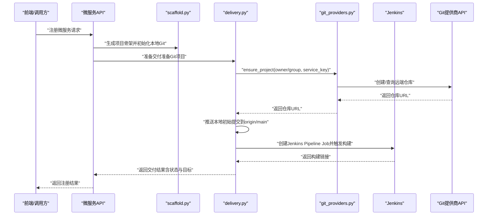
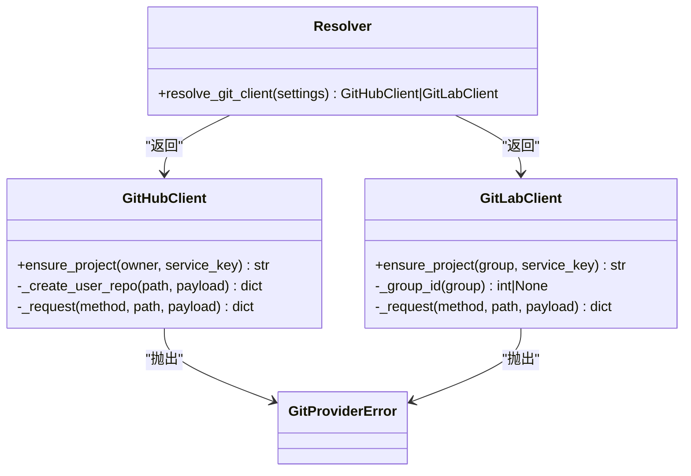
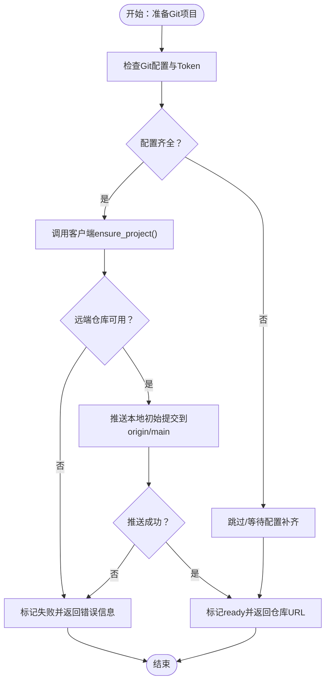
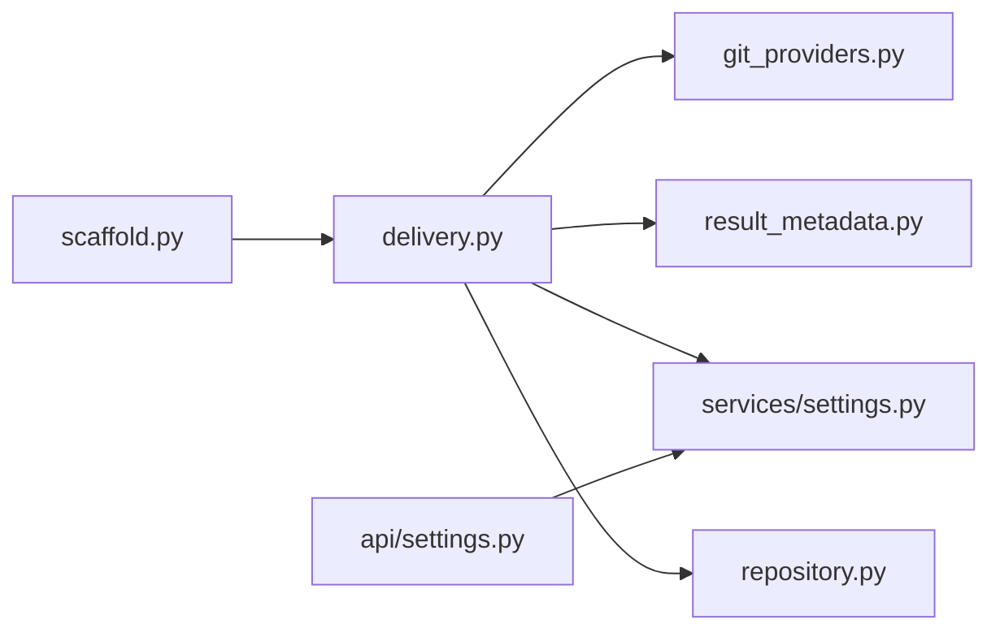

# Git集成

<cite>
**本文引用的文件**
- [git_providers.py](file://backend/deployment_package_factory/services/microservices/git_providers.py)
- [delivery.py](file://backend/deployment_package_factory/services/microservices/delivery.py)
- [scaffold.py](file://backend/deployment_package_factory/services/microservices/scaffold.py)
- [result_metadata.py](file://backend/deployment_package_factory/services/microservices/result_metadata.py)
- [settings.py](file://backend/deployment_package_factory/services/settings.py)
- [settings.py](file://backend/deployment_package_factory/api/settings.py)
- [repository.py](file://backend/deployment_package_factory/services/microservices/repository.py)
- [test_microservice_scaffold_api.py](file://backend/tests/test_microservice_scaffold_api.py)
</cite>

## 目录
1. [简介](#简介)
2. [项目结构](#项目结构)
3. [核心组件](#核心组件)
4. [架构总览](#架构总览)
5. [详细组件分析](#详细组件分析)
6. [依赖分析](#依赖分析)
7. [性能考量](#性能考量)
8. [故障排查指南](#故障排查指南)
9. [结论](#结论)
10. [附录](#附录)

## 简介
本文件面向微服务“部署包工厂”后端中的Git集成能力，系统性阐述以下主题：
- Git仓库初始化与提交管理：如何在生成微服务项目骨架时初始化本地Git仓库，并在具备远端配置时推送初始提交。
- 版本控制集成机制：如何通过Git提供商客户端确保远端仓库存在并返回可克隆URL；如何在交付流程中将远端仓库与Jenkins流水线打通。
- 支持的Git提供商与认证：统一解析GitHub/GitLab客户端，按提供商选择不同的认证头与API路径；支持私有化部署的自定义Base URL。
- 仓库URL生成与分支管理：根据请求参数与系统设置生成远端仓库URL；推送策略固定使用main分支。
- Git工作流设计：从项目生成到仓库管理的完整流程，包括步骤状态机、重试与回退策略。
- 错误处理与安全最佳实践：网络异常、权限不足、仓库冲突等场景的处理策略与安全建议。

## 项目结构
与Git集成直接相关的模块分布如下：
- 提供商客户端与解析器：git_providers.py
- 交付流程与推送：delivery.py
- 项目骨架生成与本地Git初始化：scaffold.py
- URL与命令生成工具：result_metadata.py
- 系统设置与持久化：services/settings.py、api/settings.py
- 微服务元数据持久化：repository.py
- 测试用例：tests/test_microservice_scaffold_api.py

图表来源
- [scaffold.py](file://backend/deployment_package_factory/services/microservices/scaffold.py)
- [delivery.py](file://backend/deployment_package_factory/services/microservices/delivery.py)
- [git_providers.py](file://backend/deployment_package_factory/services/microservices/git_providers.py)
- [result_metadata.py](file://backend/deployment_package_factory/services/microservices/result_metadata.py)
- [settings.py](file://backend/deployment_package_factory/services/settings.py)
- [settings.py](file://backend/deployment_package_factory/api/settings.py)
- [repository.py](file://backend/deployment_package_factory/services/microservices/repository.py)

章节来源
- [scaffold.py](file://backend/deployment_package_factory/services/microservices/scaffold.py)
- [delivery.py](file://backend/deployment_package_factory/services/microservices/delivery.py)
- [git_providers.py](file://backend/deployment_package_factory/services/microservices/git_providers.py)
- [result_metadata.py](file://backend/deployment_package_factory/services/microservices/result_metadata.py)
- [settings.py](file://backend/deployment_package_factory/services/settings.py)
- [settings.py](file://backend/deployment_package_factory/api/settings.py)
- [repository.py](file://backend/deployment_package_factory/services/microservices/repository.py)

## 核心组件
- Git提供商客户端
  - GitHubClient：负责组织或用户级仓库创建、错误分支处理（组织不存在走用户回退）、返回clone_url或html_url。
  - GitLabClient：负责组级仓库创建、命名空间注入、返回http_url_to_repo或web_url。
  - 解析器resolve_git_client：依据provider或base_url自动判定GitHub/GitLab。
- 交付流程
  - prepare_microservice_delivery：串联Git项目准备与Jenkins Job创建。
  - _prepare_git_project：校验配置、调用客户端创建远端仓库、推送本地初始提交。
  - _push_initial_commit：通过git命令行推送至origin/main，使用Basic或Bearer认证头。
- 项目骨架与本地Git
  - _initialize_git：在生成骨架时初始化本地仓库并提交，便于后续推送。
- URL与命令生成
  - git_repository_url：基于git_base_url与git_group生成远端仓库URL。
  - jenkins_job：基于jenkins_base_url与jenkins_folder生成Jenkins Job路径。
- 系统设置
  - SystemSettings/GitSettings/JenkinsSettings：集中管理Git/GitHub/GitLab/Jenkins配置。
- 持久化
  - MicroserviceRepository：保存微服务注册信息，含gitRepositoryUrl、delivery状态等。

章节来源
- [git_providers.py](file://backend/deployment_package_factory/services/microservices/git_providers.py)
- [delivery.py](file://backend/deployment_package_factory/services/microservices/delivery.py)
- [scaffold.py](file://backend/deployment_package_factory/services/microservices/scaffold.py)
- [result_metadata.py](file://backend/deployment_package_factory/services/microservices/result_metadata.py)
- [settings.py](file://backend/deployment_package_factory/services/settings.py)
- [repository.py](file://backend/deployment_package_factory/services/microservices/repository.py)

## 架构总览
下图展示了从微服务注册到Git仓库创建与推送的整体流程，以及与Jenkins的联动。

图表来源
- [delivery.py](file://backend/deployment_package_factory/services/microservices/delivery.py)
- [git_providers.py](file://backend/deployment_package_factory/services/microservices/git_providers.py)
- [scaffold.py](file://backend/deployment_package_factory/services/microservices/scaffold.py)

## 详细组件分析

### Git提供商客户端与解析器
- GitHubClient
  - 组织仓库优先：尝试组织级创建，若组织不存在则回退到用户级创建；若仓库已存在则查询。
  - 认证头：Bearer Token，带标准GitHub API版本头。
  - 返回值：优先clone_url，其次html_url，最后拼接web_base。
- GitLabClient
  - 组命名空间：通过group解析namespace_id并注入到创建payload。
  - 认证头：PRIVATE-TOKEN。
  - 返回值：优先http_url_to_repo，其次web_url。
- 解析器resolve_git_client
  - 自动判定：当base_url包含github或provider为github时强制GitHub；否则默认GitLab。
  - 返回对应客户端实例。

图表来源
- [git_providers.py](file://backend/deployment_package_factory/services/microservices/git_providers.py)

章节来源
- [git_providers.py](file://backend/deployment_package_factory/services/microservices/git_providers.py)

### 交付流程与推送策略
- prepare_microservice_delivery
  - 组合步骤：先准备Git项目，再准备Jenkins Job。
- _prepare_git_project
  - 配置检查：若未配置git.base_url则跳过远端创建；若未配置token则等待补全。
  - 客户端调用：resolve_git_client(settings).ensure_project(...)。
  - 推送条件：仅当本地项目根存在时才推送；否则提示需要重新生成骨架或远端已有初始化代码。
  - 错误处理：捕获DeliveryError/GitProviderError并转为失败步骤。
- _push_initial_commit
  - 使用git命令行添加origin并推送至main分支。
  - 认证用户名：GitHub默认x-access-token，其他默认oauth2，可由settings.git.username覆盖。
- _prepare_jenkins_job
  - 依赖Git：只有Git步骤为ready才继续。
  - 配置检查：若Jenkins未配置或凭据缺失则跳过或等待。
  - 创建Job：构造Pipeline XML并POST到Jenkins。
  - 触发构建：返回构建URL以便后续轮询状态。

图表来源
- [delivery.py](file://backend/deployment_package_factory/services/microservices/delivery.py)

章节来源
- [delivery.py](file://backend/deployment_package_factory/services/microservices/delivery.py)

### 项目骨架生成与本地Git初始化
- _initialize_git
  - 初始化本地仓库并切换到main分支。
  - 添加所有文件并提交，提交信息为“Initial scaffold”。

章节来源
- [scaffold.py](file://backend/deployment_package_factory/services/microservices/scaffold.py)

### URL与命令生成工具
- git_repository_url
  - 优先使用git_base_url与git_group拼接；若未提供则回退为service_key。
- jenkins_job
  - 基于jenkins_base_url与jenkins_folder生成层级路径。
- build_command/deploy_command
  - 基于镜像引用生成构建与部署命令。

章节来源
- [result_metadata.py](file://backend/deployment_package_factory/services/microservices/result_metadata.py)

### 系统设置与持久化
- SystemSettings/GitSettings/JenkinsSettings
  - 集中式配置：provider/base_url/group/token/username/email等。
  - 字段校验：group必须为小写路径段；folder也需满足路径段规则。
- SystemSettingsRepository
  - 将SystemSettings以JSON形式存入PostgreSQL表system_settings。
- API路由
  - GET /api/settings：读取当前系统设置。
  - PUT /api/settings：更新系统设置。
  - POST /api/settings/import-environment：从Excel导入环境设置。

章节来源
- [settings.py](file://backend/deployment_package_factory/services/settings.py)
- [settings.py](file://backend/deployment_package_factory/api/settings.py)

### 微服务元数据持久化
- MicroserviceRepository
  - 存储微服务注册信息，含gitRepositoryUrl、delivery状态、生成文件列表等。
  - 提供upsert/get/list/update_*等方法，支持按业务平台维度检索。

章节来源
- [repository.py](file://backend/deployment_package_factory/services/microservices/repository.py)

## 依赖分析
- 组件耦合
  - delivery.py依赖git_providers.py进行远端仓库管理，依赖result_metadata.py生成URL与命令，依赖SystemSettings进行配置解析。
  - scaffold.py在生成骨架时初始化本地Git，为后续推送做准备。
  - repository.py承载微服务注册后的元数据持久化。
- 外部依赖
  - Git命令行工具：用于本地初始化与推送。
  - HTTP客户端：GitHub/GitLab API调用。
  - Jenkins REST API：创建Pipeline Job与触发构建。
- 潜在循环依赖
  - 当前模块间无循环导入，职责清晰分离。

图表来源
- [delivery.py](file://backend/deployment_package_factory/services/microservices/delivery.py)
- [git_providers.py](file://backend/deployment_package_factory/services/microservices/git_providers.py)
- [result_metadata.py](file://backend/deployment_package_factory/services/microservices/result_metadata.py)
- [settings.py](file://backend/deployment_package_factory/services/settings.py)
- [scaffold.py](file://backend/deployment_package_factory/services/microservices/scaffold.py)
- [repository.py](file://backend/deployment_package_factory/services/microservices/repository.py)
- [settings.py](file://backend/deployment_package_factory/api/settings.py)

章节来源
- [delivery.py](file://backend/deployment_package_factory/services/microservices/delivery.py)
- [git_providers.py](file://backend/deployment_package_factory/services/microservices/git_providers.py)
- [scaffold.py](file://backend/deployment_package_factory/services/microservices/scaffold.py)
- [repository.py](file://backend/deployment_package_factory/services/microservices/repository.py)
- [settings.py](file://backend/deployment_package_factory/services/settings.py)
- [settings.py](file://backend/deployment_package_factory/api/settings.py)

## 性能考量
- API调用超时
  - HTTP请求统一设置15秒超时，避免阻塞长时间IO。
- 步骤耗时统计
  - 每个步骤记录elapsedMs，便于监控与优化。
- 本地Git操作
  - 仅在本地存在git命令时执行初始化与推送，避免不必要的失败开销。
- 分支策略
  - 固定使用main分支，减少分支管理复杂度与潜在冲突。

## 故障排查指南
- 常见错误与定位
  - Git配置缺失：若未配置git.base_url或token，Git步骤会标记pending/skipped，请在系统设置中补齐。
  - 远端仓库冲突：当仓库已存在且非预期状态时，客户端会尝试查询；如遇权限问题请检查Token权限范围。
  - 本地项目不存在：若本地项目根目录不存在，推送步骤会失败，请重新生成骨架或确保远端已有初始化代码。
  - Jenkins配置缺失：若未配置Jenkins地址或凭据，Jenkins步骤会跳过或等待，请在系统设置中补齐。
  - 网络异常：HTTPError/URLError会被转换为可读的错误消息，检查网络连通性与代理设置。
- 错误类型
  - GitProviderError：封装HTTP/URL错误，便于上层统一处理。
  - DeliveryError：封装HTTP/URL与git命令失败，便于步骤状态机识别可重试性。
- 可重试性
  - 步骤状态retryable字段为true时，可在配置允许的情况下重试。

章节来源
- [delivery.py](file://backend/deployment_package_factory/services/microservices/delivery.py)
- [git_providers.py](file://backend/deployment_package_factory/services/microservices/git_providers.py)

## 结论
该Git集成功能以清晰的职责划分实现了从项目骨架生成到远端仓库创建与推送的闭环，并与Jenkins流水线自然衔接。通过统一的系统设置与错误处理机制，提升了可维护性与可观测性。建议在生产环境中结合CI/CD最佳实践，强化Token轮换、网络超时与重试策略，并持续监控交付步骤的耗时与成功率。

## 附录

### 仓库URL生成与分支管理
- 仓库URL生成
  - git_repository_url：优先使用git_base_url与git_group拼接；若未提供则回退为service_key。
- 分支管理
  - 推送策略固定使用main分支；客户端不负责分支创建，仅推送现有分支。

章节来源
- [result_metadata.py](file://backend/deployment_package_factory/services/microservices/result_metadata.py)
- [delivery.py](file://backend/deployment_package_factory/services/microservices/delivery.py)

### 认证流程与提供商选择
- 提供商选择
  - resolve_provider：当base_url包含github或provider为github时强制GitHub；否则默认GitLab。
- 认证头
  - GitHub：Bearer Token + 标准API版本头。
  - GitLab：PRIVATE-TOKEN。
- 推送用户名
  - GitHub默认x-access-token；其他默认oauth2，可由settings.git.username覆盖。

章节来源
- [git_providers.py](file://backend/deployment_package_factory/services/microservices/git_providers.py)
- [delivery.py](file://backend/deployment_package_factory/services/microservices/delivery.py)

### 代码示例（以路径代替具体代码）
- 创建远端仓库并返回URL
  - [GitHubClient.ensure_project](file://backend/deployment_package_factory/services/microservices/git_providers.py)
  - [GitLabClient.ensure_project](file://backend/deployment_package_factory/services/microservices/git_providers.py)
- 解析Git客户端
  - [resolve_git_client](file://backend/deployment_package_factory/services/microservices/git_providers.py)
- 准备Git项目并推送
  - [prepare_microservice_delivery](file://backend/deployment_package_factory/services/microservices/delivery.py)
  - [_prepare_git_project](file://backend/deployment_package_factory/services/microservices/delivery.py)
  - [_push_initial_commit](file://backend/deployment_package_factory/services/microservices/delivery.py)
- 生成仓库URL与命令
  - [git_repository_url](file://backend/deployment_package_factory/services/microservices/result_metadata.py)
  - [jenkins_job](file://backend/deployment_package_factory/services/microservices/result_metadata.py)
- 更新系统设置
  - [PUT /api/settings](file://backend/deployment_package_factory/api/settings.py)
  - [SystemSettingsRepository.update](file://backend/deployment_package_factory/services/settings.py)

### 测试参考
- 注册微服务并验证生成物
  - [test_register_microservice_generates_fastapi_project_for_business_platform](file://backend/tests/test_microservice_scaffold_api.py)