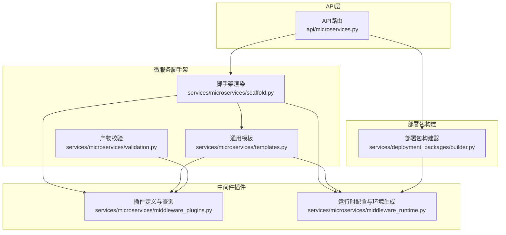
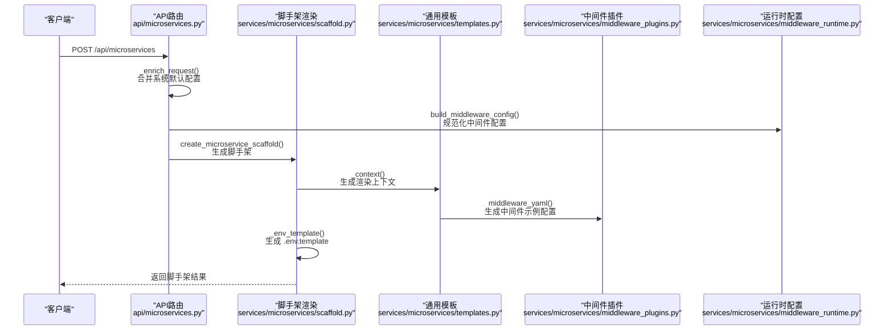
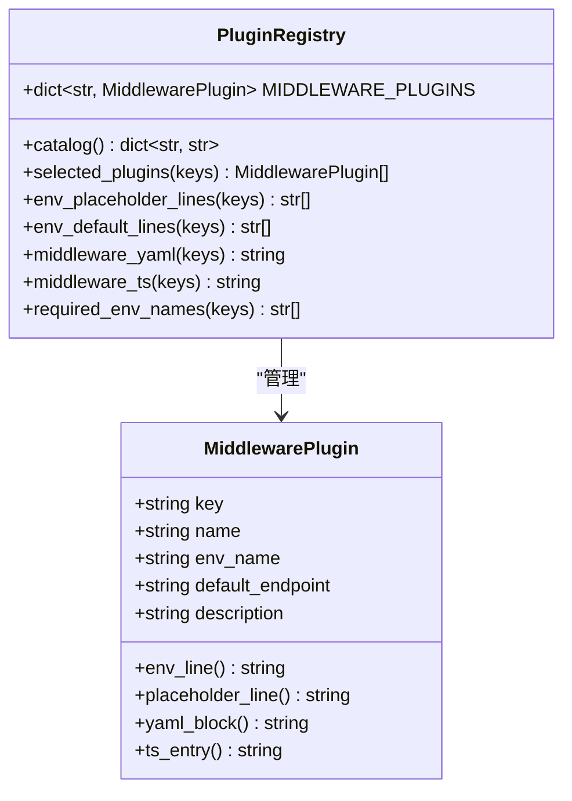
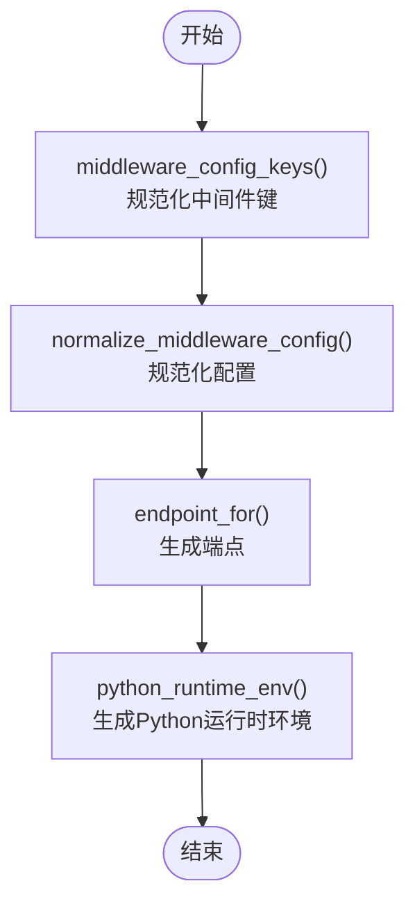
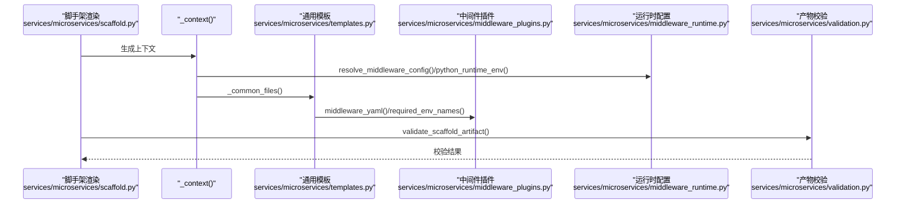
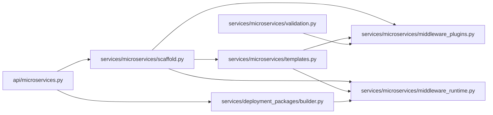

# 中间件插件系统

<cite>
**本文档引用的文件**
- [middleware_plugins.py](file://backend/deployment_package_factory/services/microservices/middleware_plugins.py)
- [middleware_runtime.py](file://backend/deployment_package_factory/services/microservices/middleware_runtime.py)
- [scaffold.py](file://backend/deployment_package_factory/services/microservices/scaffold.py)
- [templates.py](file://backend/deployment_package_factory/services/microservices/templates.py)
- [validation.py](file://backend/deployment_package_factory/services/microservices/validation.py)
- [microservices.py](file://backend/deployment_package_factory/api/microservices.py)
- [builder.py](file://backend/deployment_package_factory/services/deployment_packages/builder.py)
- [result_metadata.py](file://backend/deployment_package_factory/services/microservices/result_metadata.py)
</cite>

## 目录
1. [简介](#简介)
2. [项目结构](#项目结构)
3. [核心组件](#核心组件)
4. [架构总览](#架构总览)
5. [详细组件分析](#详细组件分析)
6. [依赖关系分析](#依赖关系分析)
7. [性能考虑](#性能考虑)
8. [故障排除指南](#故障排除指南)
9. [结论](#结论)
10. [附录](#附录)

## 简介
本文件面向微服务中间件插件系统，系统化阐述中间件插件架构与实现，覆盖以下主题：
- 中间件插件注册与配置键体系
- 运行时环境生成与依赖注入机制
- 配置解析、占位符与占位符校验
- 动态加载与模板渲染流程
- 扩展新中间件的支持路径与最佳实践
- 具体代码示例的路径定位（以源码片段路径代替具体代码）

该系统同时服务于微服务脚手架生成与部署包构建两大场景：前者面向本地开发与CI/CD流水线，后者面向生产环境的运行时配置解析与注入。

## 项目结构
中间件插件系统主要由以下模块构成：
- 插件定义与查询：middleware_plugins.py
- 运行时配置与环境生成：middleware_runtime.py
- 脚手架渲染与产物交付：scaffold.py、templates.py
- API入口与请求处理：api/microservices.py
- 部署包构建与运行时注入：services/deployment_packages/builder.py
- 校验与元数据：validation.py、result_metadata.py

**图表来源**
- [microservices.py:1-211](file://backend/deployment_package_factory/api/microservices.py#L1-L211)
- [scaffold.py:1-800](file://backend/deployment_package_factory/services/microservices/scaffold.py#L1-L800)
- [templates.py:1-339](file://backend/deployment_package_factory/services/microservices/templates.py#L1-L339)
- [middleware_plugins.py:1-68](file://backend/deployment_package_factory/services/microservices/middleware_plugins.py#L1-L68)
- [middleware_runtime.py:1-203](file://backend/deployment_package_factory/services/microservices/middleware_runtime.py#L1-L203)
- [builder.py:250-449](file://backend/deployment_package_factory/services/deployment_packages/builder.py#L250-L449)

**章节来源**
- [microservices.py:1-211](file://backend/deployment_package_factory/api/microservices.py#L1-L211)
- [scaffold.py:1-800](file://backend/deployment_package_factory/services/microservices/scaffold.py#L1-L800)
- [templates.py:1-339](file://backend/deployment_package_factory/services/microservices/templates.py#L1-L339)
- [middleware_plugins.py:1-68](file://backend/deployment_package_factory/services/microservices/middleware_plugins.py#L1-L68)
- [middleware_runtime.py:1-203](file://backend/deployment_package_factory/services/microservices/middleware_runtime.py#L1-L203)
- [builder.py:250-449](file://backend/deployment_package_factory/services/deployment_packages/builder.py#L250-L449)

## 核心组件
- 中间件插件定义与查询
  - 提供插件清单、按键筛选、占位符与默认值生成、YAML与TypeScript配置片段生成等能力。
  - 关键函数路径：[middleware_plugins.py:27-68](file://backend/deployment_package_factory/services/microservices/middleware_plugins.py#L27-L68)

- 运行时配置与环境生成
  - 将用户输入或系统默认的中间件配置规范化，生成统一的运行时环境字典，支持不同中间件的端点格式与DSN拼接。
  - 关键函数路径：[middleware_runtime.py:22-143](file://backend/deployment_package_factory/services/microservices/middleware_runtime.py#L22-L143)

- 脚手架渲染与产物校验
  - 统一上下文生成，渲染.env.template、Helm/Kubernetes资源与中间件示例配置；校验占位符完整性与模板正确性。
  - 关键函数路径：[scaffold.py:373-434](file://backend/deployment_package_factory/services/microservices/scaffold.py#L373-L434)，[validation.py:8-18](file://backend/deployment_package_factory/services/microservices/validation.py#L8-L18)

- API入口与请求处理
  - 解析业务平台、合并系统默认配置、生成中间件配置与运行时环境，并返回标准化结果。
  - 关键函数路径：[microservices.py:70-88](file://backend/deployment_package_factory/api/microservices.py#L70-L88)

- 部署包构建与运行时注入
  - 在部署包构建阶段解析运行时环境，从Kubernetes Secret与环境变量中解析敏感值，注入到最终清单。
  - 关键函数路径：[builder.py:295-331](file://backend/deployment_package_factory/services/deployment_packages/builder.py#L295-L331)

**章节来源**
- [middleware_plugins.py:1-68](file://backend/deployment_package_factory/services/microservices/middleware_plugins.py#L1-L68)
- [middleware_runtime.py:1-203](file://backend/deployment_package_factory/services/microservices/middleware_runtime.py#L1-L203)
- [scaffold.py:1-800](file://backend/deployment_package_factory/services/microservices/scaffold.py#L1-L800)
- [validation.py:1-144](file://backend/deployment_package_factory/services/microservices/validation.py#L1-L144)
- [microservices.py:1-211](file://backend/deployment_package_factory/api/microservices.py#L1-L211)
- [builder.py:250-449](file://backend/deployment_package_factory/services/deployment_packages/builder.py#L250-L449)

## 架构总览
中间件插件系统在两条主线上协同工作：
- 微服务脚手架生成链路：API接收请求 → 合并系统默认配置 → 规范化中间件配置 → 渲染模板与产物 → 校验占位符与模板契约
- 部署包构建链路：构建请求 → 解析中间件配置 → 解析运行时环境（Secret/Env）→ 注入运行时配置 → 生成最终清单

**图表来源**
- [microservices.py:70-88](file://backend/deployment_package_factory/api/microservices.py#L70-L88)
- [scaffold.py:373-434](file://backend/deployment_package_factory/services/microservices/scaffold.py#L373-L434)
- [templates.py:104-125](file://backend/deployment_package_factory/services/microservices/templates.py#L104-L125)
- [middleware_plugins.py:55-58](file://backend/deployment_package_factory/services/microservices/middleware_plugins.py#L55-L58)
- [middleware_runtime.py:29-34](file://backend/deployment_package_factory/services/microservices/middleware_runtime.py#L29-L34)

## 详细组件分析

### 中间件插件定义与查询
- 数据模型
  - MiddlewarePlugin：包含键名、显示名称、环境变量名、默认端点、描述等字段，并提供生成占位符、默认值、YAML块、TypeScript条目的方法。
  - 参考路径：[middleware_plugins.py:6-25](file://backend/deployment_package_factory/services/microservices/middleware_plugins.py#L6-L25)

- 插件注册与查询
  - MIDDLEWARE_PLUGINS：集中注册所有中间件插件，键为小写标识。
  - 工具函数：catalog查询、按键筛选、占位符/默认值生成、YAML/TS片段生成、所需环境变量列表。
  - 参考路径：[middleware_plugins.py:27-68](file://backend/deployment_package_factory/services/microservices/middleware_plugins.py#L27-L68)

**图表来源**
- [middleware_plugins.py:6-68](file://backend/deployment_package_factory/services/microservices/middleware_plugins.py#L6-L68)

**章节来源**
- [middleware_plugins.py:1-68](file://backend/deployment_package_factory/services/microservices/middleware_plugins.py#L1-L68)

### 运行时配置与环境生成
- 配置键规范
  - middleware_config_keys：去重并根据技术栈自动补齐必要中间件（如Java-Spring-Cloud-Alibaba自动补齐Nacos）。
  - 参考路径：[middleware_runtime.py:22-26](file://backend/deployment_package_factory/services/microservices/middleware_runtime.py#L22-L26)

- 配置规范化与端点生成
  - normalize_middleware_config：统一字段（启用、主机、端口、用户名、密码、数据库、命名空间、显式端点），计算合格主机与解析后的端点。
  - endpoint_for：根据中间件类型生成端点字符串，优先显式端点，其次按协议规则拼接。
  - 参考路径：[middleware_runtime.py:128-143](file://backend/deployment_package_factory/services/microservices/middleware_runtime.py#L128-L143)，[middleware_runtime.py:78-101](file://backend/deployment_package_factory/services/microservices/middleware_runtime.py#L78-L101)

- Python运行时环境生成
  - python_runtime_env：针对Redis与PostgreSQL生成专用环境变量（如REDIS_URL、POSTGRES_DSN），其他中间件复用插件环境变量。
  - 参考路径：[middleware_runtime.py:67-75](file://backend/deployment_package_factory/services/microservices/middleware_runtime.py#L67-L75)

**图表来源**
- [middleware_runtime.py:22-75](file://backend/deployment_package_factory/services/microservices/middleware_runtime.py#L22-L75)
- [middleware_runtime.py:78-143](file://backend/deployment_package_factory/services/microservices/middleware_runtime.py#L78-L143)

**章节来源**
- [middleware_runtime.py:1-203](file://backend/deployment_package_factory/services/microservices/middleware_runtime.py#L1-L203)

### 脚手架渲染与产物校验
- 上下文生成
  - _context：聚合服务信息、技术栈、中间件键、规范化后的中间件配置、运行时环境，用于模板渲染。
  - 参考路径：[scaffold.py:373-399](file://backend/deployment_package_factory/services/microservices/scaffold.py#L373-L399)

- 模板渲染
  - _env_template：生成.env.template，包含基础环境变量与运行时环境变量。
  - _common_files/_helm_*：生成Kubernetes与Helm资源，将非密钥环境变量写入ConfigMap，密钥环境变量写入Secret。
  - 参考路径：[scaffold.py:466-477](file://backend/deployment_package_factory/services/microservices/scaffold.py#L466-L477)，[templates.py:104-125](file://backend/deployment_package_factory/services/microservices/templates.py#L104-L125)

- 产物校验
  - validate_scaffold_artifact：检查关键文件、Python语法、流水线文件、Helm模板、技术栈契约、微前端契约、中间件占位符、归档有效性。
  - 参考路径：[validation.py:8-18](file://backend/deployment_package_factory/services/microservices/validation.py#L8-L18)，[validation.py:85-92](file://backend/deployment_package_factory/services/microservices/validation.py#L85-L92)

**图表来源**
- [scaffold.py:373-434](file://backend/deployment_package_factory/services/microservices/scaffold.py#L373-L434)
- [templates.py:104-125](file://backend/deployment_package_factory/services/microservices/templates.py#L104-L125)
- [middleware_plugins.py:55-68](file://backend/deployment_package_factory/services/microservices/middleware_plugins.py#L55-L68)
- [middleware_runtime.py:37-75](file://backend/deployment_package_factory/services/microservices/middleware_runtime.py#L37-L75)
- [validation.py:8-18](file://backend/deployment_package_factory/services/microservices/validation.py#L8-L18)

**章节来源**
- [scaffold.py:1-800](file://backend/deployment_package_factory/services/microservices/scaffold.py#L1-L800)
- [templates.py:1-339](file://backend/deployment_package_factory/services/microservices/templates.py#L1-L339)
- [validation.py:1-144](file://backend/deployment_package_factory/services/microservices/validation.py#L1-L144)

### API入口与请求处理
- 请求富化
  - _enrich_request：解析业务平台、填充系统默认值（镜像仓库、命名空间、Git/Jenkins配置）、生成中间件配置。
  - 参考路径：[microservices.py:70-88](file://backend/deployment_package_factory/api/microservices.py#L70-L88)

- 结果交付
  - create_microservice_scaffold：生成脚手架产物，准备交付状态，最终化产物（清理临时目录或保留Git项目）。
  - 参考路径：[microservices.py:52-67](file://backend/deployment_package_factory/api/microservices.py#L52-L67)，[scaffold.py:229-286](file://backend/deployment_package_factory/services/microservices/scaffold.py#L229-L286)

**章节来源**
- [microservices.py:1-211](file://backend/deployment_package_factory/api/microservices.py#L1-L211)
- [scaffold.py:1-800](file://backend/deployment_package_factory/services/microservices/scaffold.py#L1-L800)

### 部署包构建与运行时注入
- 中间件配置与运行时环境解析
  - _middleware_config：从预览清单与目录中收集中间件配置。
  - _resolve_runtime_env：遍历中间件定义中的环境模板与来源，优先从Kubernetes Secret解析，回退到环境变量。
  - 参考路径：[builder.py:295-331](file://backend/deployment_package_factory/services/deployment_packages/builder.py#L295-L331)

- 运行时配置注入
  - 构建完成后将解析得到的运行时环境更新到最终清单，确保生产环境正确注入敏感配置。
  - 参考路径：[builder.py:257-268](file://backend/deployment_package_factory/services/deployment_packages/builder.py#L257-L268)

**章节来源**
- [builder.py:250-449](file://backend/deployment_package_factory/services/deployment_packages/builder.py#L250-L449)

## 依赖关系分析
- 组件内聚与耦合
  - middleware_plugins与middleware_runtime高内聚，共同完成插件定义与运行时配置生成。
  - scaffold与templates解耦模板渲染与上下文生成，通过公共接口（middleware_yaml、required_env_names）交互。
  - API层仅负责请求富化与结果交付，不直接参与复杂逻辑，降低耦合度。
  - builder在部署包构建阶段独立解析运行时环境，避免与脚手架阶段的逻辑耦合。

- 外部依赖与集成点
  - Kubernetes Secret读取：builder通过读取Secret解析敏感值。
  - 环境变量：脚手架与部署包构建均支持从环境变量读取运行时值。
  - 中间件端点解析：基于插件定义与规范化配置生成统一端点格式。

**图表来源**
- [microservices.py:1-211](file://backend/deployment_package_factory/api/microservices.py#L1-L211)
- [scaffold.py:1-800](file://backend/deployment_package_factory/services/microservices/scaffold.py#L1-L800)
- [templates.py:1-339](file://backend/deployment_package_factory/services/microservices/templates.py#L1-L339)
- [middleware_plugins.py:1-68](file://backend/deployment_package_factory/services/microservices/middleware_plugins.py#L1-L68)
- [middleware_runtime.py:1-203](file://backend/deployment_package_factory/services/microservices/middleware_runtime.py#L1-L203)
- [builder.py:250-449](file://backend/deployment_package_factory/services/deployment_packages/builder.py#L250-L449)
- [validation.py:1-144](file://backend/deployment_package_factory/services/microservices/validation.py#L1-L144)

**章节来源**
- [microservices.py:1-211](file://backend/deployment_package_factory/api/microservices.py#L1-L211)
- [scaffold.py:1-800](file://backend/deployment_package_factory/services/microservices/scaffold.py#L1-L800)
- [templates.py:1-339](file://backend/deployment_package_factory/services/microservices/templates.py#L1-L339)
- [middleware_plugins.py:1-68](file://backend/deployment_package_factory/services/microservices/middleware_plugins.py#L1-L68)
- [middleware_runtime.py:1-203](file://backend/deployment_package_factory/services/microservices/middleware_runtime.py#L1-L203)
- [builder.py:250-449](file://backend/deployment_package_factory/services/deployment_packages/builder.py#L250-L449)
- [validation.py:1-144](file://backend/deployment_package_factory/services/microservices/validation.py#L1-L144)

## 性能考虑
- 配置规范化与端点生成
  - 使用字典映射与常量表（默认端口、默认主机、默认数据库、默认用户）减少重复计算。
  - 参考路径：[middleware_runtime.py:7-20](file://backend/deployment_package_factory/services/microservices/middleware_runtime.py#L7-L20)

- 运行时环境解析缓存
  - builder对Kubernetes Secret进行缓存，避免重复读取同一命名空间下的相同Secret。
  - 参考路径：[builder.py:316-357](file://backend/deployment_package_factory/services/deployment_packages/builder.py#L316-L357)

- 字符串拼接与URL编码
  - DSN与端点拼接采用安全的URL编码策略，避免特殊字符导致的连接失败。
  - 参考路径：[middleware_runtime.py:116-125](file://backend/deployment_package_factory/services/microservices/middleware_runtime.py#L116-L125)

[本节为一般性指导，无需特定文件分析]

## 故障排除指南
- 中间件占位符缺失
  - 症状：校验失败提示缺失占位符。
  - 排查：确认中间件示例配置与.env.template是否包含required_env_names输出的环境变量。
  - 参考路径：[validation.py:85-92](file://backend/deployment_package_factory/services/microservices/validation.py#L85-L92)，[middleware_plugins.py:66-68](file://backend/deployment_package_factory/services/microservices/middleware_plugins.py#L66-L68)

- 技术栈契约不满足
  - 症状：校验失败提示缺失关键文件或内容。
  - 排查：对照技术栈契约期望的文件与内容片段，逐项核对生成结果。
  - 参考路径：[validation.py:95-122](file://backend/deployment_package_factory/services/microservices/validation.py#L95-L122)

- Python语法错误
  - 症状：校验失败提示Python语法错误及行号。
  - 排查：检查生成的Python源码文件，修复语法错误。
  - 参考路径：[validation.py:26-36](file://backend/deployment_package_factory/services/microservices/validation.py#L26-L36)

- 运行时环境解析为空
  - 症状：生产环境缺少敏感配置。
  - 排查：确认Kubernetes Secret是否存在且包含所需键，或环境变量是否设置。
  - 参考路径：[builder.py:334-357](file://backend/deployment_package_factory/services/deployment_packages/builder.py#L334-L357)

**章节来源**
- [validation.py:1-144](file://backend/deployment_package_factory/services/microservices/validation.py#L1-L144)
- [middleware_plugins.py:1-68](file://backend/deployment_package_factory/services/microservices/middleware_plugins.py#L1-L68)
- [builder.py:250-449](file://backend/deployment_package_factory/services/deployment_packages/builder.py#L250-L449)

## 结论
中间件插件系统通过“插件定义—运行时配置—模板渲染—产物校验”的闭环设计，实现了对多种中间件（Redis、PostgreSQL、达梦、IoTDB、MongoDB、Kafka、消息队列、Nacos）的一致化支持。系统在脚手架阶段保证本地开发体验，在部署包构建阶段确保生产环境的安全与正确注入。通过清晰的职责划分与可扩展的插件注册机制，开发者可以便捷地扩展新的中间件类型并自定义配置选项。

[本节为总结性内容，无需特定文件分析]

## 附录

### 中间件插件开发指南
- 新增中间件步骤
  - 在插件注册表中添加新中间件键与默认配置，参考：[middleware_plugins.py:27-36](file://backend/deployment_package_factory/services/microservices/middleware_plugins.py#L27-L36)
  - 实现端点生成与DSN拼接逻辑，参考：[middleware_runtime.py:78-125](file://backend/deployment_package_factory/services/microservices/middleware_runtime.py#L78-L125)
  - 在模板中生成示例配置与占位符，参考：[templates.py:124](file://backend/deployment_package_factory/services/microservices/templates.py#L124)，[validation.py:85-92](file://backend/deployment_package_factory/services/microservices/validation.py#L85-L92)
  - 在脚手架中按需生成基础设施代码（如Redis客户端、PostgreSQL仓储），参考：[scaffold.py:361-370](file://backend/deployment_package_factory/services/microservices/scaffold.py#L361-L370)

- 自定义配置选项
  - 在规范化配置中增加字段处理逻辑，参考：[middleware_runtime.py:128-143](file://backend/deployment_package_factory/services/microservices/middleware_runtime.py#L128-L143)
  - 在模板中渲染对应环境变量，参考：[templates.py:252-270](file://backend/deployment_package_factory/services/microservices/templates.py#L252-L270)

- 示例路径定位
  - 插件注册与查询：[middleware_plugins.py:27-68](file://backend/deployment_package_factory/services/microservices/middleware_plugins.py#L27-L68)
  - 运行时环境生成：[middleware_runtime.py:67-75](file://backend/deployment_package_factory/services/microservices/middleware_runtime.py#L67-L75)
  - 脚手架上下文生成：[scaffold.py:373-399](file://backend/deployment_package_factory/services/microservices/scaffold.py#L373-L399)
  - API请求富化：[microservices.py:70-88](file://backend/deployment_package_factory/api/microservices.py#L70-L88)
  - 部署包运行时解析：[builder.py:316-331](file://backend/deployment_package_factory/services/deployment_packages/builder.py#L316-L331)

**章节来源**
- [middleware_plugins.py:1-68](file://backend/deployment_package_factory/services/microservices/middleware_plugins.py#L1-L68)
- [middleware_runtime.py:1-203](file://backend/deployment_package_factory/services/microservices/middleware_runtime.py#L1-L203)
- [scaffold.py:1-800](file://backend/deployment_package_factory/services/microservices/scaffold.py#L1-L800)
- [templates.py:1-339](file://backend/deployment_package_factory/services/microservices/templates.py#L1-L339)
- [validation.py:1-144](file://backend/deployment_package_factory/services/microservices/validation.py#L1-L144)
- [microservices.py:1-211](file://backend/deployment_package_factory/api/microservices.py#L1-L211)
- [builder.py:250-449](file://backend/deployment_package_factory/services/deployment_packages/builder.py#L250-L449)