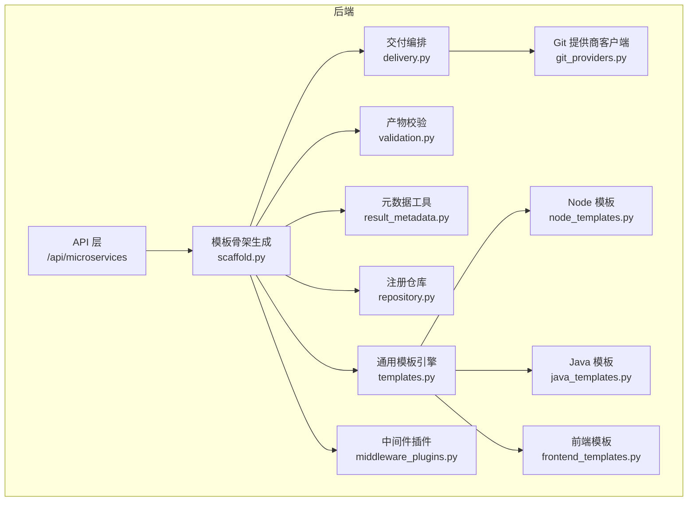
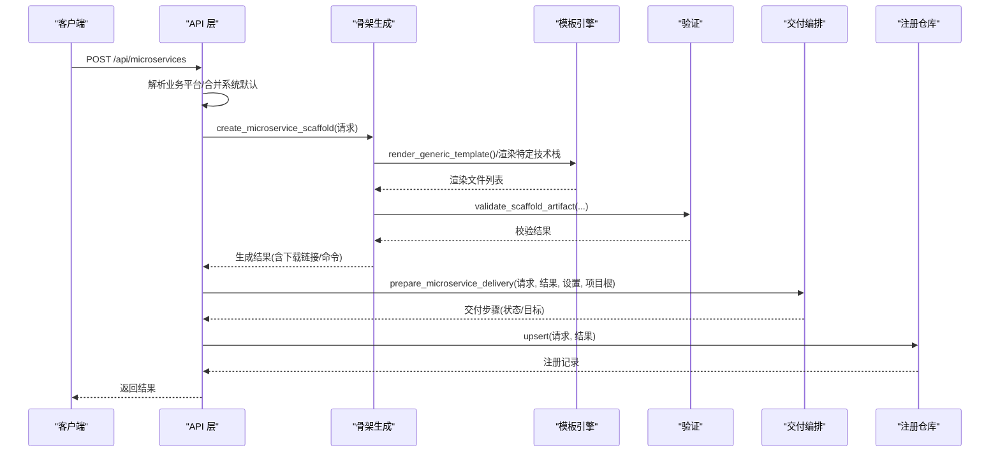
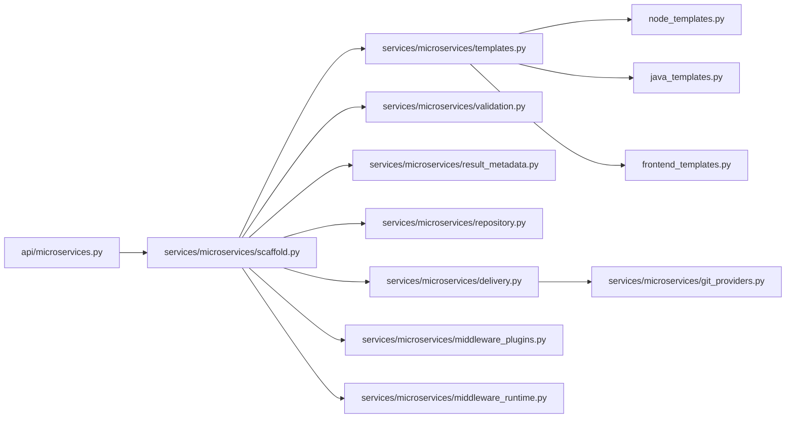

# 微服务注册

<cite>
**本文引用的文件**
- [backend/deployment_package_factory/api/microservices.py](file://backend/deployment_package_factory/api/microservices.py)
- [backend/deployment_package_factory/services/microservices/scaffold.py](file://backend/deployment_package_factory/services/microservices/scaffold.py)
- [backend/deployment_package_factory/services/microservices/templates.py](file://backend/deployment_package_factory/services/microservices/templates.py)
- [backend/deployment_package_factory/services/microservices/validation.py](file://backend/deployment_package_factory/services/microservices/validation.py)
- [backend/deployment_package_factory/services/microservices/middleware_plugins.py](file://backend/deployment_package_factory/services/microservices/middleware_plugins.py)
- [backend/deployment_package_factory/services/microservices/repository.py](file://backend/deployment_package_factory/services/microservices/repository.py)
- [backend/deployment_package_factory/services/microservices/delivery.py](file://backend/deployment_package_factory/services/microservices/delivery.py)
- [backend/deployment_package_factory/services/microservices/artifacts.py](file://backend/deployment_package_factory/services/microservices/artifacts.py)
- [backend/deployment_package_factory/services/microservices/result_metadata.py](file://backend/deployment_package_factory/services/microservices/result_metadata.py)
- [backend/deployment_package_factory/services/microservices/git_providers.py](file://backend/deployment_package_factory/services/microservices/git_providers.py)
- [backend/deployment_package_factory/services/microservices/node_templates.py](file://backend/deployment_package_factory/services/microservices/node_templates.py)
- [backend/deployment_package_factory/services/microservices/java_templates.py](file://backend/deployment_package_factory/services/microservices/java_templates.py)
- [backend/deployment_package_factory/services/microservices/frontend_templates.py](file://backend/deployment_package_factory/services/microservices/frontend_templates.py)
</cite>

## 目录
1. [简介](#简介)
2. [项目结构](#项目结构)
3. [核心组件](#核心组件)
4. [架构总览](#架构总览)
5. [详细组件分析](#详细组件分析)
6. [依赖关系分析](#依赖关系分析)
7. [性能考虑](#性能考虑)
8. [故障排查指南](#故障排查指南)
9. [结论](#结论)
10. [附录：扩展与最佳实践](#附录扩展与最佳实践)

## 简介
本文件面向“微服务注册”能力，系统化阐述从请求到交付的全流程：模板选择机制、技术栈与前端框架支持、中间件插件系统、模板渲染引擎、Git 集成方案、验证流程、项目交付机制以及注册仓库管理。同时提供扩展开发指南与最佳实践，帮助读者快速上手并安全地定制与运维。

## 项目结构
后端采用 FastAPI 提供 REST 接口，核心逻辑集中在 services/microservices 子模块中，围绕“请求模型 → 渲染模板 → 校验产物 → 交付到 Git/Jenkins → 持久化注册”的主干流程展开；前端提供可视化向导与结果面板，调用后端接口完成注册与交付查询。

图表来源
- [backend/deployment_package_factory/api/microservices.py:1-211](file://backend/deployment_package_factory/api/microservices.py#L1-L211)
- [backend/deployment_package_factory/services/microservices/scaffold.py:1-800](file://backend/deployment_package_factory/services/microservices/scaffold.py#L1-L800)
- [backend/deployment_package_factory/services/microservices/templates.py:1-339](file://backend/deployment_package_factory/services/microservices/templates.py#L1-L339)
- [backend/deployment_package_factory/services/microservices/validation.py:1-144](file://backend/deployment_package_factory/services/microservices/validation.py#L1-L144)
- [backend/deployment_package_factory/services/microservices/delivery.py:1-235](file://backend/deployment_package_factory/services/microservices/delivery.py#L1-L235)
- [backend/deployment_package_factory/services/microservices/repository.py:1-211](file://backend/deployment_package_factory/services/microservices/repository.py#L1-L211)
- [backend/deployment_package_factory/services/microservices/result_metadata.py:1-28](file://backend/deployment_package_factory/services/microservices/result_metadata.py#L1-L28)
- [backend/deployment_package_factory/services/microservices/git_providers.py:1-119](file://backend/deployment_package_factory/services/microservices/git_providers.py#L1-L119)
- [backend/deployment_package_factory/services/microservices/node_templates.py:1-134](file://backend/deployment_package_factory/services/microservices/node_templates.py#L1-L134)
- [backend/deployment_package_factory/services/microservices/java_templates.py:1-151](file://backend/deployment_package_factory/services/microservices/java_templates.py#L1-L151)
- [backend/deployment_package_factory/services/microservices/frontend_templates.py:1-79](file://backend/deployment_package_factory/services/microservices/frontend_templates.py#L1-L79)
- [backend/deployment_package_factory/services/microservices/middleware_plugins.py:1-68](file://backend/deployment_package_factory/services/microservices/middleware_plugins.py#L1-L68)

章节来源
- [backend/deployment_package_factory/api/microservices.py:1-211](file://backend/deployment_package_factory/api/microservices.py#L1-L211)

## 核心组件
- 请求模型与选项
  - MicroserviceScaffoldRequest：标准化输入字段，含服务键、名称、描述、项目类型、技术栈、中间件、源环境、业务平台信息、镜像与 Git/Jenkins 基础配置等，并内置多处字段校验器。
  - MicroserviceScaffoldOptions：输出可用的项目类型、技术栈、前端框架、中间件列表。
- 模板渲染引擎
  - 支持 Python FastAPI、Node.js Express、Java Spring Cloud Alibaba、Vue3 Vite、React Vite 等技术栈；通用模板按技术栈分支生成通用文件与特定语言文件。
- 中间件插件系统
  - 定义中间件插件清单与占位符/默认值/TS 注入等，统一生成 .env.template 与 config/middleware.example.yaml。
- 验证与校验
  - 必需文件、Python 语法、流水线文件片段、Helm 模板完整性、技术栈契约、微前端依赖、中间件占位符、归档包可读性等。
- 交付编排
  - Git 项目初始化与推送、Jenkins Job 创建与首次构建触发、构建状态轮询与汇总状态计算。
- 注册仓库
  - 使用 PostgreSQL 表 microservices 存储注册记录，支持 upsert、查询、更新交付状态与字段。
- 元数据与工具
  - 生成镜像引用、Git 仓库 URL、Jenkins Job URL、构建/部署命令等。

章节来源
- [backend/deployment_package_factory/services/microservices/scaffold.py:52-202](file://backend/deployment_package_factory/services/microservices/scaffold.py#L52-L202)
- [backend/deployment_package_factory/services/microservices/scaffold.py:220-226](file://backend/deployment_package_factory/services/microservices/scaffold.py#L220-L226)
- [backend/deployment_package_factory/services/microservices/templates.py:12-36](file://backend/deployment_package_factory/services/microservices/templates.py#L12-L36)
- [backend/deployment_package_factory/services/microservices/middleware_plugins.py:27-68](file://backend/deployment_package_factory/services/microservices/middleware_plugins.py#L27-L68)
- [backend/deployment_package_factory/services/microservices/validation.py:9-18](file://backend/deployment_package_factory/services/microservices/validation.py#L9-L18)
- [backend/deployment_package_factory/services/microservices/delivery.py:17-39](file://backend/deployment_package_factory/services/microservices/delivery.py#L17-L39)
- [backend/deployment_package_factory/services/microservices/repository.py:15-47](file://backend/deployment_package_factory/services/microservices/repository.py#L15-L47)
- [backend/deployment_package_factory/services/microservices/result_metadata.py:4-27](file://backend/deployment_package_factory/services/microservices/result_metadata.py#L4-L27)

## 架构总览
下图展示“注册微服务”的端到端时序：客户端提交请求 → API 校验与平台解析 → 生成骨架与产物 → 准备交付（Git/Jenkins）→ 归档产物 → 持久化注册 → 返回结果。

图表来源
- [backend/deployment_package_factory/api/microservices.py:52-67](file://backend/deployment_package_factory/api/microservices.py#L52-L67)
- [backend/deployment_package_factory/services/microservices/scaffold.py:229-286](file://backend/deployment_package_factory/services/microservices/scaffold.py#L229-L286)
- [backend/deployment_package_factory/services/microservices/validation.py:9-18](file://backend/deployment_package_factory/services/microservices/validation.py#L9-L18)
- [backend/deployment_package_factory/services/microservices/delivery.py:17-26](file://backend/deployment_package_factory/services/microservices/delivery.py#L17-L26)
- [backend/deployment_package_factory/services/microservices/repository.py:20-47](file://backend/deployment_package_factory/services/microservices/repository.py#L20-L47)

## 详细组件分析

### 组件A：微服务注册 API
- 功能要点
  - 获取选项：返回项目类型、技术栈、前端框架、中间件的可用集合。
  - 注册接口：解析业务平台、合并系统默认、生成骨架、准备交付、归档产物、持久化注册。
  - 列表查询：按源环境/平台键/配置档过滤。
  - 交付重试与状态刷新：根据现有注册记录重建交付步骤并更新状态。
  - 下载产物：返回打包好的 .tar.gz。
- 关键路径
  - 注册主流程：register_microservice → _resolve_business_platform/_enrich_request → create_microservice_scaffold → prepare_microservice_delivery → finalize_scaffold_artifacts → upsert。
  - 交付重试：retry_microservice_delivery → _request_from_registered/_result_stub → prepare_microservice_delivery → update_delivery/update_fields。
  - 状态刷新：get_microservice_delivery_status → refresh_delivery_status。

章节来源
- [backend/deployment_package_factory/api/microservices.py:47-211](file://backend/deployment_package_factory/api/microservices.py#L47-L211)

### 组件B：模板渲染引擎
- 技术栈支持
  - Python FastAPI：内置专用渲染函数，生成 src/app/*、tests/*、deploy/k8s/*、deploy/helm/*、脚本与 Jenkinsfile 等。
  - 通用模板：render_generic_template 按 tech_stack 分支，调用 Node/Java/Vue/React 模板模块。
- 前端框架集成
  - Vue3 Vite 与 React Vite：生成 package.json、vite.config.ts、入口 HTML/TSX、路由与样式等；支持微前端框架（qiankun/wujie）作为额外依赖。
- 中间件注入
  - 依据所选中间件生成 .env.template 占位符与 config/middleware.example.yaml 示例。

章节来源
- [backend/deployment_package_factory/services/microservices/scaffold.py:289-370](file://backend/deployment_package_factory/services/microservices/scaffold.py#L289-L370)
- [backend/deployment_package_factory/services/microservices/templates.py:41-53](file://backend/deployment_package_factory/services/microservices/templates.py#L41-L53)
- [backend/deployment_package_factory/services/microservices/node_templates.py:9-23](file://backend/deployment_package_factory/services/microservices/node_templates.py#L9-L23)
- [backend/deployment_package_factory/services/microservices/java_templates.py:8-16](file://backend/deployment_package_factory/services/microservices/java_templates.py#L8-L16)
- [backend/deployment_package_factory/services/microservices/frontend_templates.py:8-21](file://backend/deployment_package_factory/services/microservices/frontend_templates.py#L8-L21)

### 组件C：中间件插件系统
- 插件定义
  - 提供 key、名称、环境变量名、默认端点、描述等；支持占位符行、YAML 块、TS 注入等。
- 运行时环境
  - 将中间件配置规范化为 host/port/namespace/endpoint 等；生成运行时环境变量（含敏感标记），并针对 Python/Node 的特有变量（如 REDIS_URL、POSTGRES_DSN）做映射。
- 选择与校验
  - 通过 middleware_config_keys 自动补齐 Java 所需的 nacos；校验中间件是否受支持；校验 .env.template 与 middleware.example.yaml 是否包含必要占位符。

章节来源
- [backend/deployment_package_factory/services/microservices/middleware_plugins.py:6-68](file://backend/deployment_package_factory/services/microservices/middleware_plugins.py#L6-L68)
- [backend/deployment_package_factory/services/microservices/middleware_runtime.py:22-76](file://backend/deployment_package_factory/services/microservices/middleware_runtime.py#L22-L76)
- [backend/deployment_package_factory/services/microservices/validation.py:85-92](file://backend/deployment_package_factory/services/microservices/validation.py#L85-L92)

### 组件D：验证与校验
- 校验维度
  - 必需文件：根据技术栈确定清单。
  - Python 语法：对生成的 .py 文件进行 compile 校验。
  - 流水线文件：检查 Dockerfile/Jenkinsfile/deploy.sh/deploy/k8s/deployment.yaml 片段。
  - Helm 模板：Chart/values/templates 完整性与挂载/模板引用一致性。
  - 技术栈契约：不同技术栈的关键文件与片段存在性。
  - 微前端依赖：根据所选框架检查 package.json 中的依赖。
  - 中间件占位符：确保 .env.template 与 middleware.example.yaml 包含所需占位符。
  - 归档包：校验 .tar.gz 可读性。
- 输出结构
  - 返回 passed、checks 列表与文件计数，便于前端展示。

章节来源
- [backend/deployment_package_factory/services/microservices/validation.py:9-144](file://backend/deployment_package_factory/services/microservices/validation.py#L9-L144)

### 组件E：交付编排与 Git 集成
- Git 步骤
  - 若配置可用且本地项目存在，则创建远程仓库并推送初始提交；否则记录 pending/skipped/failed。
- Jenkins 步骤
  - 等待 Git 就绪后创建 Pipeline Job 并触发首次构建；若配置不足则 pending/skipped；异常时记录 failed。
- 状态汇总
  - 整体状态由各步骤状态聚合；结合 Jenkins 构建状态动态更新为 queued/running/success/failed。
- Git 提供商
  - 支持 GitHub/GitLab，自动识别提供商并构造 API/URL；封装 HTTP 请求与错误处理。

章节来源
- [backend/deployment_package_factory/services/microservices/delivery.py:17-82](file://backend/deployment_package_factory/services/microservices/delivery.py#L17-L82)
- [backend/deployment_package_factory/services/microservices/delivery.py:89-235](file://backend/deployment_package_factory/services/microservices/delivery.py#L89-L235)
- [backend/deployment_package_factory/services/microservices/git_providers.py:13-119](file://backend/deployment_package_factory/services/microservices/git_providers.py#L13-L119)

### 组件F：注册仓库与产物清理
- 注册存储
  - 以 (source_env, business_platform_key, business_platform_profile, service_key) 为主键，存储完整注册 JSON；支持 upsert、按条件查询、按 project_id 查询与更新。
- 产物清理
  - 当 Git 项目就绪后，清理工作区与归档产物，仅保留克隆方式；保持 artifactAvailable 字段同步。
- 下载接口
  - 根据 project_id 查找对应归档，不存在则 404。

章节来源
- [backend/deployment_package_factory/services/microservices/repository.py:15-114](file://backend/deployment_package_factory/services/microservices/repository.py#L15-L114)
- [backend/deployment_package_factory/services/microservices/artifacts.py:14-44](file://backend/deployment_package_factory/services/microservices/artifacts.py#L14-L44)

### 组件G：数据模型与元数据
- MicroserviceScaffoldRequest/MicroserviceScaffoldResult
  - 输入/输出模型均使用 Pydantic，包含字段别名、校验器与后处理校验，确保数据一致性与约束。
- 元数据工具
  - 生成镜像引用、Git 仓库 URL、Jenkins Job URL、构建/部署命令等，贯穿交付链路。

章节来源
- [backend/deployment_package_factory/services/microservices/scaffold.py:52-202](file://backend/deployment_package_factory/services/microservices/scaffold.py#L52-L202)
- [backend/deployment_package_factory/services/microservices/result_metadata.py:4-27](file://backend/deployment_package_factory/services/microservices/result_metadata.py#L4-L27)

## 依赖关系分析
- 模块耦合
  - API 层仅负责参数解析与编排，核心逻辑分布在 scaffold、templates、validation、delivery、repository 等模块，职责清晰。
  - 模板引擎对 Node/Java/前端模板模块存在分支依赖，但通过通用接口解耦具体实现。
- 外部依赖
  - Git 命令行（git）用于初始化与推送；Jenkins 通过 HTTP API 创建 Job 与触发构建；Git 提供商通过 REST API 创建仓库。
- 潜在循环
  - 未见直接循环导入；模板渲染与中间件运行时通过函数式组合避免类继承循环。

图表来源
- [backend/deployment_package_factory/api/microservices.py:1-211](file://backend/deployment_package_factory/api/microservices.py#L1-L211)
- [backend/deployment_package_factory/services/microservices/scaffold.py:1-800](file://backend/deployment_package_factory/services/microservices/scaffold.py#L1-L800)
- [backend/deployment_package_factory/services/microservices/templates.py:1-339](file://backend/deployment_package_factory/services/microservices/templates.py#L1-L339)
- [backend/deployment_package_factory/services/microservices/validation.py:1-144](file://backend/deployment_package_factory/services/microservices/validation.py#L1-L144)
- [backend/deployment_package_factory/services/microservices/delivery.py:1-235](file://backend/deployment_package_factory/services/microservices/delivery.py#L1-L235)
- [backend/deployment_package_factory/services/microservices/git_providers.py:1-119](file://backend/deployment_package_factory/services/microservices/git_providers.py#L1-L119)
- [backend/deployment_package_factory/services/microservices/node_templates.py:1-134](file://backend/deployment_package_factory/services/microservices/node_templates.py#L1-L134)
- [backend/deployment_package_factory/services/microservices/java_templates.py:1-151](file://backend/deployment_package_factory/services/microservices/java_templates.py#L1-L151)
- [backend/deployment_package_factory/services/microservices/frontend_templates.py:1-79](file://backend/deployment_package_factory/services/microservices/frontend_templates.py#L1-L79)
- [backend/deployment_package_factory/services/microservices/middleware_plugins.py:1-68](file://backend/deployment_package_factory/services/microservices/middleware_plugins.py#L1-L68)
- [backend/deployment_package_factory/services/microservices/middleware_runtime.py:1-203](file://backend/deployment_package_factory/services/microservices/middleware_runtime.py#L1-L203)

## 性能考虑
- 生成阶段
  - 大量文件写入与 tar 打包可能产生 IO 压力；建议将 data_dir 挂载到高性能磁盘，控制并发生成数量。
- 校验阶段
  - Python 语法检查与归档包读取为 CPU/IO 密集；可在 CI 环境离线执行，或对大项目分批校验。
- 交付阶段
  - Git 推送与 Jenkins API 调用受网络与第三方服务影响；建议增加超时与重试策略，避免阻塞主流程。
- 数据持久化
  - PostgreSQL 写入使用 upsert，注意索引命中与事务大小；批量操作时合并更新减少往返。

## 故障排查指南
- 注册失败
  - 平台解析失败：确认 source_env/business_platform_key/profile 与已注册平台匹配；查看 404/409 错误详情。
  - 字段校验失败：检查 service_key/K8s 命名规范、端口范围、技术栈/项目类型一致性、中间件支持列表。
- 产物校验失败
  - 缺失关键文件：核对 required_files 与实际生成文件；Python 语法错误定位到具体行号。
  - Helm 模板问题：检查 Chart/values/templates 完整性与 envFrom 引用。
  - 技术栈契约：对照各技术栈期望文件与片段。
  - 中间件占位符：确认 .env.template 与 middleware.example.yaml 包含所有必需占位符。
- 交付失败
  - Git 步骤：检查 git 命令可用性、远程仓库创建权限、Token 权限；若本地项目不存在，需重新注册生成骨架。
  - Jenkins 步骤：检查 Jenkins 地址/凭据、文件夹权限、Git 插件；可通过“重试交付”恢复。
- 产物下载失败
  - 确认 project_id 格式正确；归档文件是否存在且可读；若 Git 项目已就绪，工作区与归档会被清理，改用克隆方式。

章节来源
- [backend/deployment_package_factory/api/microservices.py:56-59](file://backend/deployment_package_factory/api/microservices.py#L56-L59)
- [backend/deployment_package_factory/services/microservices/validation.py:21-144](file://backend/deployment_package_factory/services/microservices/validation.py#L21-L144)
- [backend/deployment_package_factory/services/microservices/delivery.py:41-82](file://backend/deployment_package_factory/services/microservices/delivery.py#L41-L82)
- [backend/deployment_package_factory/services/microservices/artifacts.py:42-44](file://backend/deployment_package_factory/services/microservices/artifacts.py#L42-L44)

## 结论
该微服务注册体系以清晰的数据模型与模块化设计为核心，覆盖从模板渲染、中间件注入、产物校验到 Git/Jenkins 交付与持久化的全链路。通过标准化的请求/响应模型与严格的校验机制，确保生成物质量与可交付性；通过可扩展的模板与中间件插件，满足多技术栈与多平台需求。

## 附录：扩展与最佳实践

### 如何注册一个新微服务
- 步骤概览
  - 准备请求：填写 serviceKey/serviceName/description/projectKind/techStack/middleware/sourceEnv/businessPlatformKey 等字段。
  - 发起注册：POST /api/microservices，等待返回结果（包含下载链接/命令、交付状态）。
  - 查看交付：GET /api/microservices/{project_id}/delivery/status 或点击“重试交付”。
  - 下载产物：GET /api/microservices/{project_id}/download（若仍可下载）。
- 参考路径
  - [注册接口:52-67](file://backend/deployment_package_factory/api/microservices.py#L52-L67)
  - [交付准备:17-26](file://backend/deployment_package_factory/services/microservices/delivery.py#L17-L26)
  - [产物清理与下载:14-19](file://backend/deployment_package_factory/services/microservices/artifacts.py#L14-L19)

### 如何管理现有微服务项目
- 列表查询：GET /api/microservices，支持按 source_env/business_platform_key/business_platform_profile 过滤。
- 交付重试：POST /api/microservices/{project_id}/delivery/retry，重建交付步骤并更新状态。
- 状态刷新：GET /api/microservices/{project_id}/delivery/status，轮询 Jenkins 构建状态。
- 参考路径
  - [列表查询:119-129](file://backend/deployment_package_factory/api/microservices.py#L119-L129)
  - [重试交付:132-145](file://backend/deployment_package_factory/api/microservices.py#L132-L145)
  - [状态刷新:148-156](file://backend/deployment_package_factory/api/microservices.py#L148-L156)

### 微服务模板扩展指南
- 新增技术栈
  - 在 templates.py 中扩展 TECH_STACKS/TECH_STACK_PROJECT_KIND，并在 render_generic_template 分支中添加渲染函数。
  - 实现对应语言模板模块（参考 node_templates.py/java_templates.py/frontend_templates.py），提供 required_files 与渲染函数。
  - 在 scaffold.py 中补充 _render_* 分支与必要文件清单。
- 新增前端框架
  - 在 templates.py 中扩展 MICRO_FRONTEND_FRAMEWORKS；在 frontend_templates.py 中实现依赖注入与入口文件生成。
- 最佳实践
  - 保持 required_files 与技术栈契约一致；确保 Jenkinsfile/Helm 模板片段完整；为中间件生成占位符与默认值。

章节来源
- [backend/deployment_package_factory/services/microservices/templates.py:17-36](file://backend/deployment_package_factory/services/microservices/templates.py#L17-L36)
- [backend/deployment_package_factory/services/microservices/templates.py:41-53](file://backend/deployment_package_factory/services/microservices/templates.py#L41-L53)
- [backend/deployment_package_factory/services/microservices/node_templates.py:9-23](file://backend/deployment_package_factory/services/microservices/node_templates.py#L9-L23)
- [backend/deployment_package_factory/services/microservices/java_templates.py:8-16](file://backend/deployment_package_factory/services/microservices/java_templates.py#L8-L16)
- [backend/deployment_package_factory/services/microservices/frontend_templates.py:8-21](file://backend/deployment_package_factory/services/microservices/frontend_templates.py#L8-L21)
- [backend/deployment_package_factory/services/microservices/scaffold.py:289-293](file://backend/deployment_package_factory/services/microservices/scaffold.py#L289-L293)

### 自定义中间件插件开发
- 定义插件
  - 在 middleware_plugins.py 中新增 MiddlewarePlugin，指定 key、名称、环境变量名、默认端点与描述。
  - 更新 middleware_catalog 与相关生成函数（env_default_lines/env_placeholder_lines/middleware_yaml/middleware_ts）。
- 运行时映射
  - 在 middleware_runtime.py 中扩展 endpoint_for/DSN/url 生成逻辑；在 python_runtime_env 中映射到 Python 特有变量。
- 校验与占位符
  - 确保 validation.py 的中间件占位符检查能覆盖新增插件；在模板中生成相应占位符与示例配置。
- 最佳实践
  - 默认端点应指向集群内可解析域名（带 namespace 后缀）；敏感信息（密码）标记为 secret 并避免硬编码。

章节来源
- [backend/deployment_package_factory/services/microservices/middleware_plugins.py:6-68](file://backend/deployment_package_factory/services/microservices/middleware_plugins.py#L6-L68)
- [backend/deployment_package_factory/services/microservices/middleware_runtime.py:78-143](file://backend/deployment_package_factory/services/microservices/middleware_runtime.py#L78-L143)
- [backend/deployment_package_factory/services/microservices/validation.py:85-92](file://backend/deployment_package_factory/services/microservices/validation.py#L85-L92)

### 项目交付最佳实践
- Git 集成
  - 建议在系统设置中配置 Git 提供商与 Token；优先使用已就绪的 Git 项目，避免重复创建。
- Jenkins 集成
  - 确保 Jenkins 文件夹存在且具备写权限；首次构建后定期检查构建日志与制品。
- 产物管理
  - Git 就绪后清理本地归档与工作区，降低存储压力；提供克隆命令替代下载。
- 监控与回滚
  - 通过 refresh_delivery_status 跟踪构建状态；失败时使用“重试交付”恢复；必要时回滚到上一版本。

章节来源
- [backend/deployment_package_factory/services/microservices/delivery.py:29-39](file://backend/deployment_package_factory/services/microservices/delivery.py#L29-L39)
- [backend/deployment_package_factory/services/microservices/artifacts.py:22-29](file://backend/deployment_package_factory/services/microservices/artifacts.py#L22-L29)