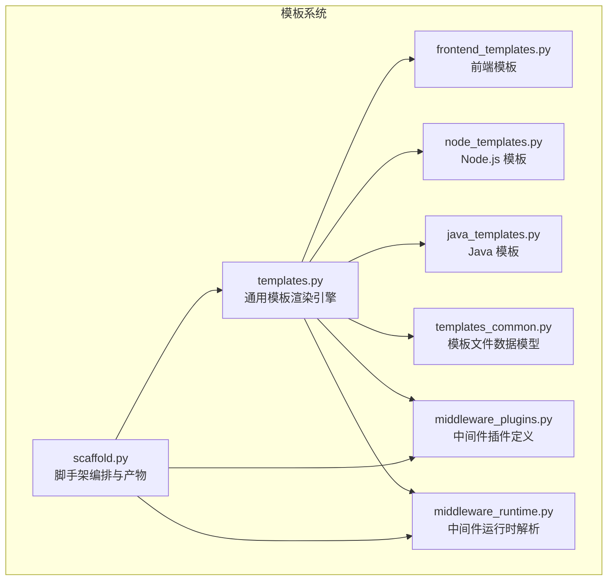
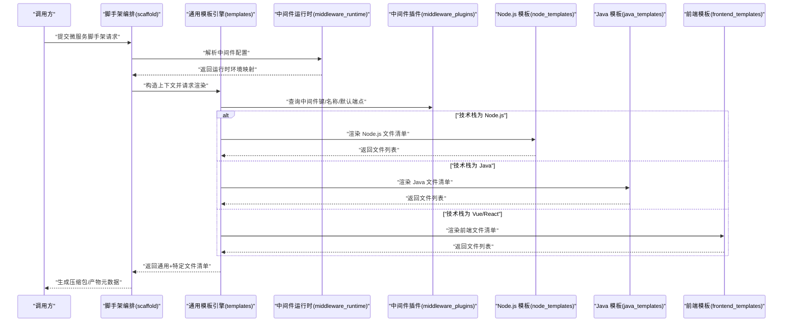
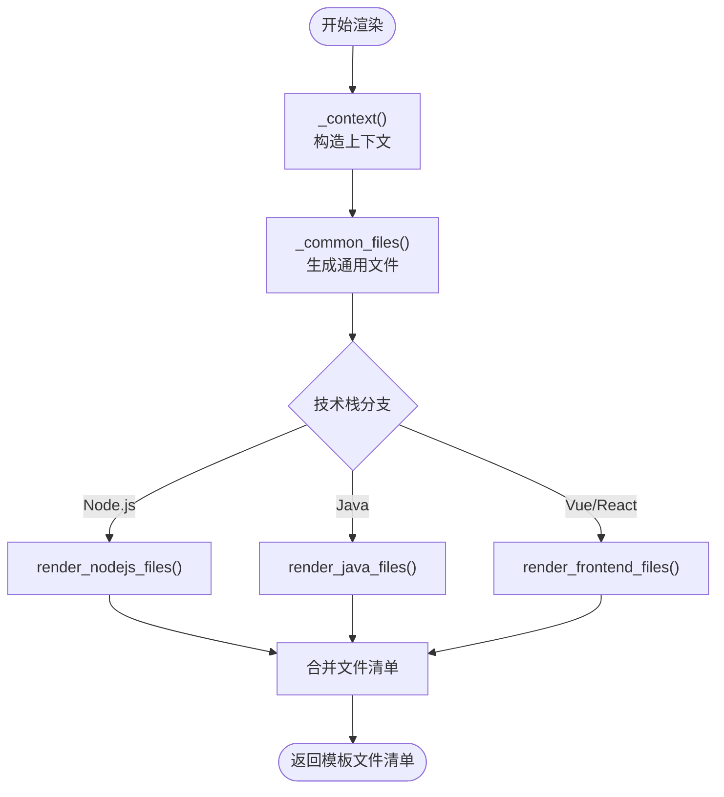
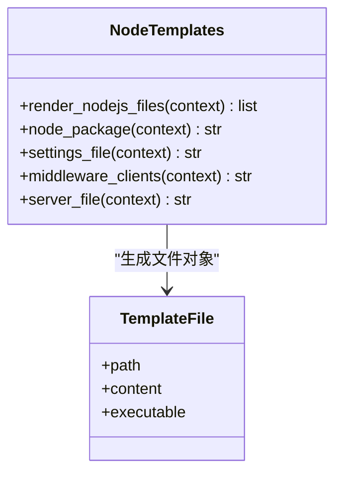
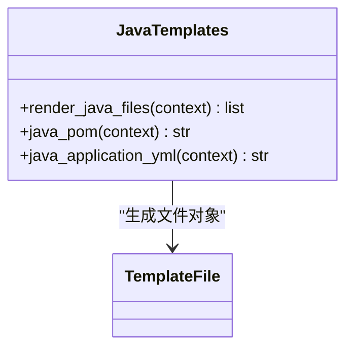
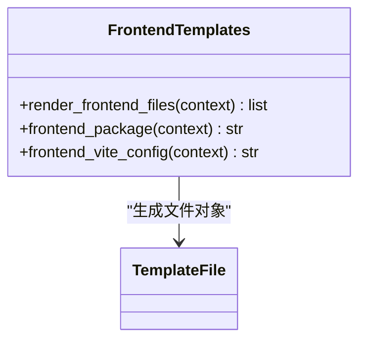
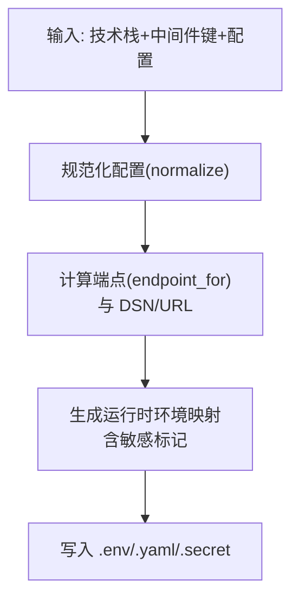
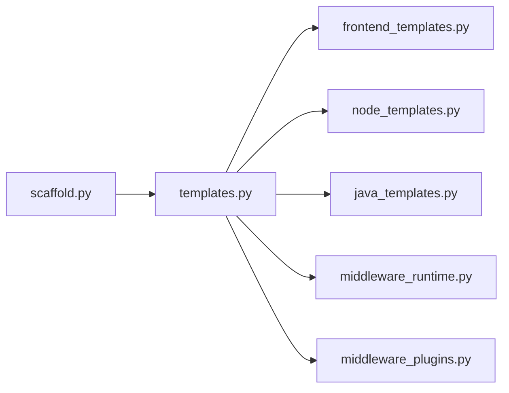

# 模板系统

<cite>
**本文引用的文件**
- [templates.py](file://backend/deployment_package_factory/services/microservices/templates.py)
- [templates_common.py](file://backend/deployment_package_factory/services/microservices/templates_common.py)
- [frontend_templates.py](file://backend/deployment_package_factory/services/microservices/frontend_templates.py)
- [node_templates.py](file://backend/deployment_package_factory/services/microservices/node_templates.py)
- [java_templates.py](file://backend/deployment_package_factory/services/microservices/java_templates.py)
- [middleware_plugins.py](file://backend/deployment_package_factory/services/microservices/middleware_plugins.py)
- [middleware_runtime.py](file://backend/deployment_package_factory/services/microservices/middleware_runtime.py)
- [scaffold.py](file://backend/deployment_package_factory/services/microservices/scaffold.py)
- [business.yaml](file://templates/catalog/business.yaml)
- [platform.yaml](file://templates/catalog/platform.yaml)
- [projects.yaml](file://templates/catalog/projects.yaml)
- [dependency-rules.yaml](file://templates/catalog/dependency-rules.yaml)
</cite>

## 目录
1. [简介](#简介)
2. [项目结构](#项目结构)
3. [核心组件](#核心组件)
4. [架构总览](#架构总览)
5. [详细组件分析](#详细组件分析)
6. [依赖分析](#依赖分析)
7. [性能考虑](#性能考虑)
8. [故障排查指南](#故障排查指南)
9. [结论](#结论)
10. [附录：扩展开发指南](#附录扩展开发指南)

## 简介
本模板系统用于生成标准化的微服务与前端工程脚手架，覆盖通用模板渲染引擎、技术栈特定模板（Python/FastAPI、Node.js/Express、Java/Spring Cloud Alibaba）、以及前端框架模板（React/Vite、Vue3/Vite）。系统通过“上下文变量 + 文件清单”的方式实现模板渲染，结合中间件插件与运行时环境解析，动态生成容器镜像构建、CI/CD 流水线、Kubernetes/Helm 部署所需文件。同时提供模板变量系统、占位符替换机制与条件渲染逻辑，支持模板目录结构、文件组织与模板继承关系的清晰表达。

## 项目结构
模板系统位于后端服务模块中，采用按功能域分层的组织方式：
- 渲染引擎与通用模板：templates.py、templates_common.py
- 技术栈模板：node_templates.py、java_templates.py
- 前端框架模板：frontend_templates.py
- 中间件插件与运行时：middleware_plugins.py、middleware_runtime.py
- 脚手架编排与产物：scaffold.py
- 平台与业务模板目录：templates/catalog 下的业务、平台、项目与依赖规则

图表来源
- [templates.py:1-339](file://backend/deployment_package_factory/services/microservices/templates.py#L1-L339)
- [frontend_templates.py:1-79](file://backend/deployment_package_factory/services/microservices/frontend_templates.py#L1-L79)
- [node_templates.py:1-134](file://backend/deployment_package_factory/services/microservices/node_templates.py#L1-L134)
- [java_templates.py:1-151](file://backend/deployment_package_factory/services/microservices/java_templates.py#L1-L151)
- [templates_common.py:1-12](file://backend/deployment_package_factory/services/microservices/templates_common.py#L1-L12)
- [middleware_plugins.py:1-68](file://backend/deployment_package_factory/services/microservices/middleware_plugins.py#L1-L68)
- [middleware_runtime.py:1-203](file://backend/deployment_package_factory/services/microservices/middleware_runtime.py#L1-L203)
- [scaffold.py:1-800](file://backend/deployment_package_factory/services/microservices/scaffold.py#L1-L800)

章节来源
- [templates.py:1-339](file://backend/deployment_package_factory/services/microservices/templates.py#L1-L339)
- [scaffold.py:1-800](file://backend/deployment_package_factory/services/microservices/scaffold.py#L1-L800)

## 核心组件
- 通用模板渲染引擎
  - 统一入口函数负责根据技术栈选择渲染分支，拼接通用文件与特定技术栈文件。
  - 提供通用文件清单（如 README、Dockerfile、Jenkinsfile、Kubernetes/Helm 配置等）与变量上下文构造。
- 技术栈模板
  - Node.js 模板：生成 Express 应用骨架、TypeScript 配置、中间件客户端、测试文件等。
  - Java 模板：生成 Spring Boot + Nacos + JPA 的 Maven 工程骨架。
  - Python/FastAPI 模板：在脚手架编排中单独处理，生成多层级源码结构与测试、迁移脚本。
- 前端框架模板
  - Vue3/Vite 与 React/Vite 模板，分别生成对应入口文件、路由/组件、依赖与构建配置。
- 中间件插件与运行时
  - 定义中间件键值、默认端点、环境变量名与占位符；解析用户提供的中间件配置，生成运行时环境映射与 Kubernetes/Secret/ConfigMap 内容。
- 模板文件数据模型
  - 使用不可变的数据类封装单个模板文件路径、内容与可执行标志，便于统一处理。

章节来源
- [templates.py:41-125](file://backend/deployment_package_factory/services/microservices/templates.py#L41-L125)
- [node_templates.py:9-23](file://backend/deployment_package_factory/services/microservices/node_templates.py#L9-L23)
- [java_templates.py:8-16](file://backend/deployment_package_factory/services/microservices/java_templates.py#L8-L16)
- [frontend_templates.py:8-21](file://backend/deployment_package_factory/services/microservices/frontend_templates.py#L8-L21)
- [middleware_plugins.py:27-67](file://backend/deployment_package_factory/services/microservices/middleware_plugins.py#L27-L67)
- [middleware_runtime.py:22-64](file://backend/deployment_package_factory/services/microservices/middleware_runtime.py#L22-L64)
- [templates_common.py:7-12](file://backend/deployment_package_factory/services/microservices/templates_common.py#L7-L12)

## 架构总览
模板系统以“请求 → 上下文 → 通用文件 + 特定模板 → 文件清单 → 产物”为主线，贯穿中间件运行时解析与 Kubernetes/Helm 渲染。

图表来源
- [scaffold.py:289-293](file://backend/deployment_package_factory/services/microservices/scaffold.py#L289-L293)
- [templates.py:41-53](file://backend/deployment_package_factory/services/microservices/templates.py#L41-L53)
- [node_templates.py:9-23](file://backend/deployment_package_factory/services/microservices/node_templates.py#L9-L23)
- [java_templates.py:8-16](file://backend/deployment_package_factory/services/microservices/java_templates.py#L8-L16)
- [frontend_templates.py:8-21](file://backend/deployment_package_factory/services/microservices/frontend_templates.py#L8-L21)
- [middleware_runtime.py:37-42](file://backend/deployment_package_factory/services/microservices/middleware_runtime.py#L37-L42)
- [middleware_plugins.py:39-67](file://backend/deployment_package_factory/services/microservices/middleware_plugins.py#L39-L67)

## 详细组件分析

### 通用模板渲染引擎
- 功能要点
  - 根据技术栈选择渲染分支，拼接通用文件与特定模板文件。
  - 通用文件包括：.gitignore、.env.template、README、Dockerfile、Jenkinsfile、构建/部署脚本、Kubernetes 与 Helm 配置。
  - 变量上下文包含服务标识、名称、描述、技术栈、中间件、运行时环境、镜像与命名空间等。
- 条件渲染
  - Node.js：追加 Node.js 特有文件与依赖。
  - Java：追加 Spring Boot 工程骨架与配置。
  - 前端：根据 Vue/React 分支生成不同入口与路由/组件。
- 占位符与替换
  - Jenkinsfile、Helm/K8s 模板中使用占位符，最终由运行时解析结果替换为具体值。

图表来源
- [templates.py:41-125](file://backend/deployment_package_factory/services/microservices/templates.py#L41-L125)
- [node_templates.py:9-23](file://backend/deployment_package_factory/services/microservices/node_templates.py#L9-L23)
- [java_templates.py:8-16](file://backend/deployment_package_factory/services/microservices/java_templates.py#L8-L16)
- [frontend_templates.py:8-21](file://backend/deployment_package_factory/services/microservices/frontend_templates.py#L8-L21)

章节来源
- [templates.py:41-125](file://backend/deployment_package_factory/services/microservices/templates.py#L41-L125)

### 技术栈模板：Node.js/Express
- 文件清单
  - package.json、tsconfig.json、源码目录（domain/application/infrastructure/interfaces）、测试文件、中间件客户端与健康检查路由。
- 变量与占位符
  - 运行时环境变量注入到设置文件与中间件客户端，用于健康检查。
- 条件渲染
  - 根据所选中间件动态生成 Redis/PostgreSQL 客户端与健康检查。

图表来源
- [node_templates.py:9-23](file://backend/deployment_package_factory/services/microservices/node_templates.py#L9-L23)
- [templates_common.py:7-12](file://backend/deployment_package_factory/services/microservices/templates_common.py#L7-L12)

章节来源
- [node_templates.py:1-134](file://backend/deployment_package_factory/services/microservices/node_templates.py#L1-L134)

### 技术栈模板：Java/Spring Cloud Alibaba
- 文件清单
  - pom.xml、application.yml、领域模型、应用服务、控制器与主类。
- 变量与占位符
  - 端口、应用名、Nacos 地址等从上下文注入。
- 条件渲染
  - 自动补齐 Nacos（当未显式选择时）。

图表来源
- [java_templates.py:8-16](file://backend/deployment_package_factory/services/microservices/java_templates.py#L8-L16)
- [templates_common.py:7-12](file://backend/deployment_package_factory/services/microservices/templates_common.py#L7-L12)

章节来源
- [java_templates.py:1-151](file://backend/deployment_package_factory/services/microservices/java_templates.py#L1-L151)

### 前端框架模板：React/Vite 与 Vue3/Vite
- 文件清单
  - package.json、tsconfig.json、vite.config.ts、入口 HTML 与 TS 入口、样式与路由/组件。
- 变量与占位符
  - 端口、服务名、描述等注入到入口与组件。
- 条件渲染
  - Vue 模板补充路由与 App 组件；React 模板引入 Ant Design 示例。
  - 支持微前端框架依赖（qiankun/wujie），按框架与技术栈组合注入。

图表来源
- [frontend_templates.py:8-21](file://backend/deployment_package_factory/services/microservices/frontend_templates.py#L8-L21)
- [templates_common.py:7-12](file://backend/deployment_package_factory/services/microservices/templates_common.py#L7-L12)

章节来源
- [frontend_templates.py:1-79](file://backend/deployment_package_factory/services/microservices/frontend_templates.py#L1-L79)

### 中间件插件与运行时解析
- 插件定义
  - 键值、显示名、环境变量名、默认端点、描述；提供占位符行、YAML 块、TS 注入项与必需环境名。
- 运行时解析
  - 将用户提供的中间件配置规范化，计算集群内 qualified host、DSN/URL、是否含密码等。
  - 生成运行时环境映射（含敏感标记），用于 .env/.yaml/.secret 等文件。
- 条件渲染
  - 根据中间件集合决定生成 Redis/PostgreSQL 客户端或健康检查。

图表来源
- [middleware_plugins.py:27-67](file://backend/deployment_package_factory/services/microservices/middleware_plugins.py#L27-L67)
- [middleware_runtime.py:29-64](file://backend/deployment_package_factory/services/microservices/middleware_runtime.py#L29-L64)

章节来源
- [middleware_plugins.py:1-68](file://backend/deployment_package_factory/services/microservices/middleware_plugins.py#L1-L68)
- [middleware_runtime.py:1-203](file://backend/deployment_package_factory/services/microservices/middleware_runtime.py#L1-L203)

### 模板变量系统与占位符替换
- 变量来源
  - 请求参数（服务键/名、描述、技术栈、中间件、端口、命名空间、镜像仓库等）
  - 中间件运行时解析结果（端点、DSN、是否敏感）
- 替换范围
  - Jenkinsfile、Helm/K8s 模板、脚本、配置文件与源码模板中的占位符。
- 敏感信息处理
  - 对包含密码的值进行敏感标记，写入 Secret 并避免明文暴露。

章节来源
- [templates.py:78-101](file://backend/deployment_package_factory/services/microservices/templates.py#L78-L101)
- [middleware_runtime.py:55-64](file://backend/deployment_package_factory/services/microservices/middleware_runtime.py#L55-L64)

### 模板目录结构与文件组织
- 通用模板
  - 顶层：README、Dockerfile、Jenkinsfile、构建/部署脚本、.env.template
  - deploy/k8s：Kubernetes YAML
  - deploy/helm：Helm Chart/values 与模板
  - config：中间件示例配置
- Node.js 模板
  - src/*：domain/application/infrastructure/interfaces 多层架构
  - tests：单元测试
- Java 模板
  - src/main/java/*：domain/application/interfaces/Application 主类
  - src/main/resources：application.yml
- 前端模板
  - 根目录：package.json、tsconfig.json、vite.config.ts、index.html
  - src：main.ts/tsx、router、App.vue 或组件

章节来源
- [templates.py:104-125](file://backend/deployment_package_factory/services/microservices/templates.py#L104-L125)
- [node_templates.py:9-23](file://backend/deployment_package_factory/services/microservices/node_templates.py#L9-L23)
- [java_templates.py:8-16](file://backend/deployment_package_factory/services/microservices/java_templates.py#L8-L16)
- [frontend_templates.py:8-21](file://backend/deployment_package_factory/services/microservices/frontend_templates.py#L8-L21)

### 模板继承关系
- 通用模板作为基座，技术栈模板在其基础上叠加特定文件与配置。
- 前端模板进一步在通用模板之上增加框架入口与路由/组件。
- 中间件运行时解析结果贯穿所有模板，确保端点与环境变量一致。

章节来源
- [templates.py:41-53](file://backend/deployment_package_factory/services/microservices/templates.py#L41-L53)

## 依赖分析
- 组件耦合
  - templates.py 依赖前端/Node/Java 模板模块与中间件插件/运行时，形成“通用引擎 + 特定模板 + 中间件运行时”的解耦结构。
  - scaffold.py 作为上层编排，依赖模板引擎与中间件运行时，负责生成产物与校验。
- 外部依赖
  - Kubernetes/Helm 渲染依赖于上下文中的命名空间、镜像与端口等变量。
  - CI/CD 依赖 Jenkins 凭证 ID 与 kubeconfig 凭证 ID。

图表来源
- [scaffold.py:26-34](file://backend/deployment_package_factory/services/microservices/scaffold.py#L26-L34)
- [templates.py:5-10](file://backend/deployment_package_factory/services/microservices/templates.py#L5-L10)

章节来源
- [scaffold.py:1-800](file://backend/deployment_package_factory/services/microservices/scaffold.py#L1-L800)
- [templates.py:1-339](file://backend/deployment_package_factory/services/microservices/templates.py#L1-L339)

## 性能考虑
- 模板渲染复杂度
  - 渲染流程为线性遍历与字符串拼接，时间复杂度近似 O(N)，N 为生成文件数。
- 中间件解析复杂度
  - 规范化与端点计算为 O(M)，M 为中间件数量。
- I/O 优化
  - 批量写入文件并一次性打包归档，减少磁盘往返。
- 建议
  - 对大体量模板可引入缓存策略（如已生成文件的哈希缓存）与并发写入。
  - 在 CI/CD 中复用中间件解析结果，避免重复计算。

## 故障排查指南
- 常见问题
  - 技术栈不支持：确认请求中的技术栈在支持列表中。
  - 中间件键无效：检查中间件键是否在插件目录中。
  - 端口/命名空间非法：遵循 Kubernetes 名称规范与端口范围。
  - 中间件端点解析异常：检查显式端点、主机、命名空间与默认端口。
- 排查步骤
  - 校验请求模型与字段验证器。
  - 查看生成的 .env.template 与中间件示例配置，确认敏感信息是否正确写入 Secret。
  - 检查 Jenkinsfile 与 Helm/K8s 模板中的占位符是否被替换。
  - 使用内置校验函数验证生成物完整性。

章节来源
- [scaffold.py:52-170](file://backend/deployment_package_factory/services/microservices/scaffold.py#L52-L170)
- [middleware_runtime.py:128-143](file://backend/deployment_package_factory/services/microservices/middleware_runtime.py#L128-L143)

## 结论
该模板系统通过“通用引擎 + 技术栈模板 + 中间件运行时”的分层设计，实现了高可扩展、可维护的微服务与前端脚手架生成能力。其变量系统、占位符替换与条件渲染逻辑保证了产物的一致性与安全性，配合 Kubernetes/Helm 与 CI/CD 流水线，满足生产级交付需求。

## 附录：扩展开发指南

### 添加新的技术栈支持
- 步骤
  - 在通用模板中新增技术栈分支与文件清单。
  - 实现该技术栈的模板文件生成函数，返回模板文件清单。
  - 在通用模板的“必需文件”清单中加入该技术栈特有的文件。
  - 在脚手架编排中为该技术栈补充特定处理（如 Python/FastAPI 的多层结构）。
- 参考位置
  - 通用模板分支与通用文件清单：[templates.py:41-75](file://backend/deployment_package_factory/services/microservices/templates.py#L41-L75)
  - 新增模板函数与必需文件清单：[templates.py:128-129](file://backend/deployment_package_factory/services/microservices/templates.py#L128-L129)

章节来源
- [templates.py:41-75](file://backend/deployment_package_factory/services/microservices/templates.py#L41-L75)
- [templates.py:128-129](file://backend/deployment_package_factory/services/microservices/templates.py#L128-L129)

### 添加新的前端框架模板
- 步骤
  - 在前端模板模块中新增入口文件与路由/组件生成逻辑。
  - 在通用模板中根据技术栈分支调用前端模板渲染函数。
  - 更新“必需文件”清单以包含新框架的入口与配置。
- 参考位置
  - 前端模板渲染入口与必需文件：[frontend_templates.py:8-28](file://backend/deployment_package_factory/services/microservices/frontend_templates.py#L8-L28)
  - 通用模板前端分支：[templates.py:49-50](file://backend/deployment_package_factory/services/microservices/templates.py#L49-L50)

章节来源
- [frontend_templates.py:8-28](file://backend/deployment_package_factory/services/microservices/frontend_templates.py#L8-L28)
- [templates.py:49-50](file://backend/deployment_package_factory/services/microservices/templates.py#L49-L50)

### 添加新的中间件插件
- 步骤
  - 在中间件插件模块中新增插件定义，包含键值、默认端点、环境变量名与描述。
  - 在运行时解析模块中完善端点计算与 DSN/URL 生成逻辑。
  - 在通用模板中更新中间件示例配置与运行时环境映射。
- 参考位置
  - 插件定义与示例配置：[middleware_plugins.py:27-67](file://backend/deployment_package_factory/services/microservices/middleware_plugins.py#L27-L67)
  - 运行时解析与端点计算：[middleware_runtime.py:78-101](file://backend/deployment_package_factory/services/microservices/middleware_runtime.py#L78-L101)
  - 通用模板中间件示例：[templates.py:124](file://backend/deployment_package_factory/services/microservices/templates.py#L124)

章节来源
- [middleware_plugins.py:27-67](file://backend/deployment_package_factory/services/microservices/middleware_plugins.py#L27-L67)
- [middleware_runtime.py:78-101](file://backend/deployment_package_factory/services/microservices/middleware_runtime.py#L78-L101)
- [templates.py:124](file://backend/deployment_package_factory/services/microservices/templates.py#L124)

### 模板渲染过程示例（路径引用）
- 通用模板渲染入口与上下文构造：[templates.py:41-101](file://backend/deployment_package_factory/services/microservices/templates.py#L41-L101)
- Node.js 模板渲染与文件清单：[node_templates.py:9-23](file://backend/deployment_package_factory/services/microservices/node_templates.py#L9-L23)
- Java 模板渲染与文件清单：[java_templates.py:8-16](file://backend/deployment_package_factory/services/microservices/java_templates.py#L8-L16)
- 前端模板渲染与文件清单：[frontend_templates.py:8-21](file://backend/deployment_package_factory/services/microservices/frontend_templates.py#L8-L21)
- 中间件运行时解析与环境映射：[middleware_runtime.py:37-64](file://backend/deployment_package_factory/services/microservices/middleware_runtime.py#L37-L64)
- Jenkinsfile/Helm/K8s 占位符替换：[templates.py:166-192](file://backend/deployment_package_factory/services/microservices/templates.py#L166-L192), [templates.py:273-338](file://backend/deployment_package_factory/services/microservices/templates.py#L273-L338)

### 配置选项参考
- 通用模板配置项（示例）
  - 服务键/名、描述、技术栈、中间件、端口、命名空间、镜像仓库与凭证 ID
  - 参考：[templates.py:78-101](file://backend/deployment_package_factory/services/microservices/templates.py#L78-L101)
- 中间件配置项（示例）
  - enabled、host、port、username、password、database、namespace、endpoint
  - 参考：[middleware_runtime.py:128-143](file://backend/deployment_package_factory/services/microservices/middleware_runtime.py#L128-L143)

### 平台与业务模板目录
- 业务域与平台服务定义、项目模板与依赖规则
  - 业务域：[business.yaml:1-60](file://templates/catalog/business.yaml#L1-L60)
  - 平台服务：[platform.yaml:1-66](file://templates/catalog/platform.yaml#L1-L66)
  - 项目模板：[projects.yaml:1-54](file://templates/catalog/projects.yaml#L1-L54)
  - 依赖规则：[dependency-rules.yaml:1-9](file://templates/catalog/dependency-rules.yaml#L1-L9)