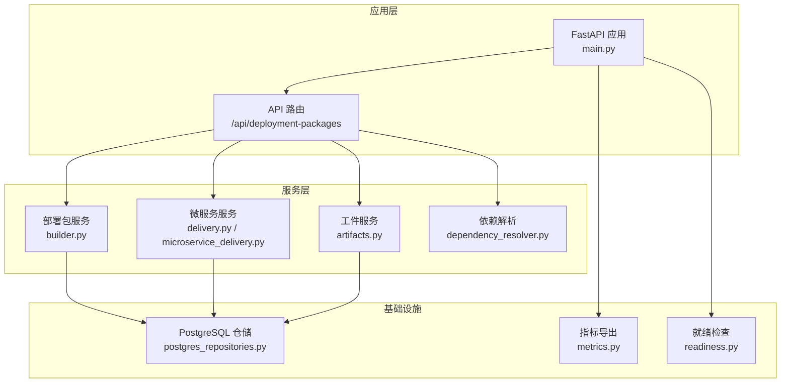
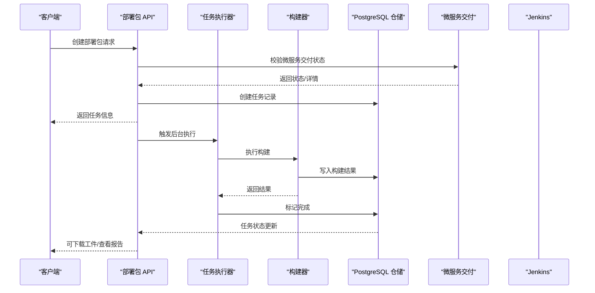
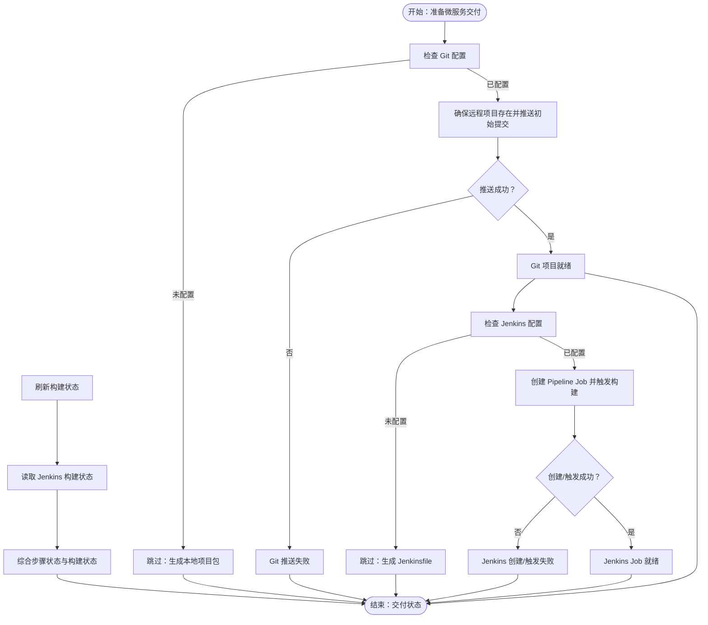
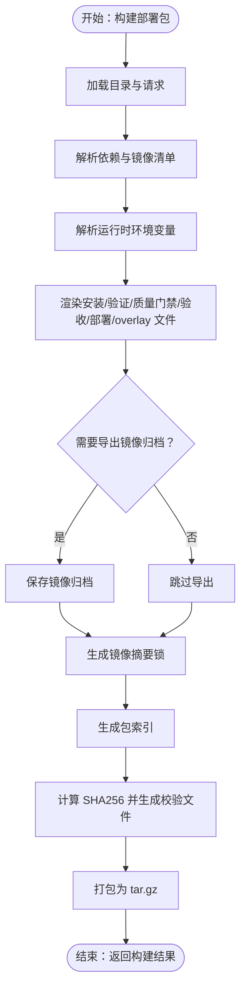
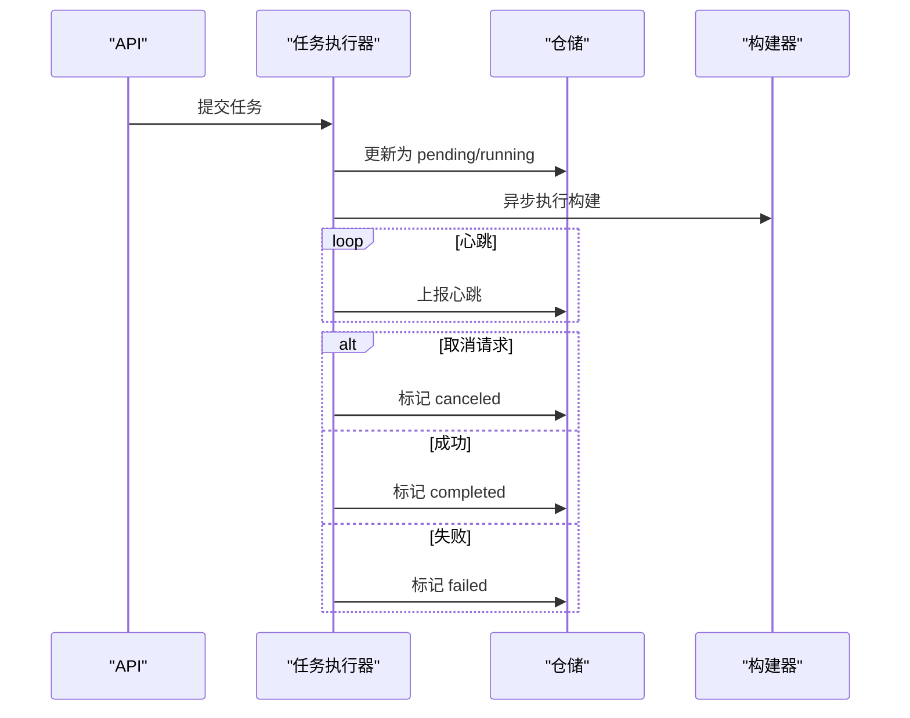
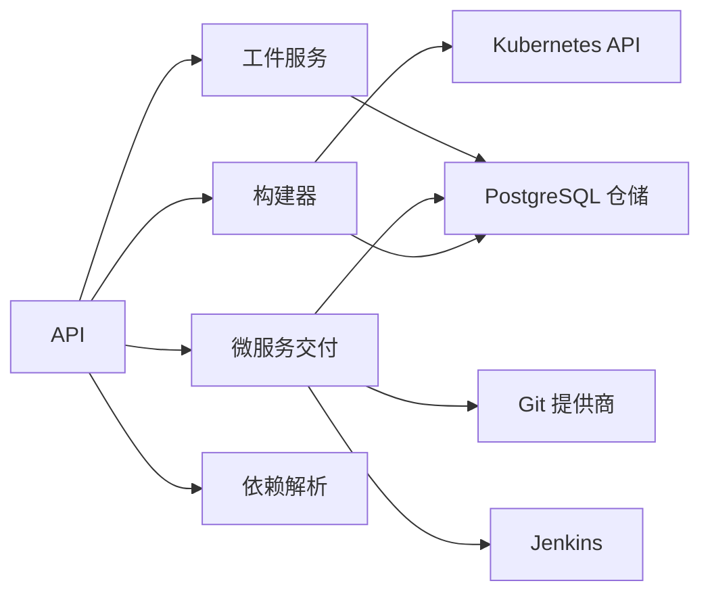

# 项目交付流程

<cite>
**本文档引用的文件**
- [backend/deployment_package_factory/services/microservices/delivery.py](file://backend/deployment_package_factory/services/microservices/delivery.py)
- [backend/deployment_package_factory/services/deployment_packages/microservice_delivery.py](file://backend/deployment_package_factory/services/deployment_packages/microservice_delivery.py)
- [backend/deployment_package_factory/services/microservices/artifacts.py](file://backend/deployment_package_factory/services/microservices/artifacts.py)
- [backend/deployment_package_factory/services/deployment_packages/models.py](file://backend/deployment_package_factory/services/deployment_packages/models.py)
- [backend/deployment_package_factory/api/deployment_packages.py](file://backend/deployment_package_factory/api/deployment_packages.py)
- [backend/deployment_package_factory/services/deployment_packages/builder.py](file://backend/deployment_package_factory/services/deployment_packages/builder.py)
- [backend/deployment_package_factory/services/deployment_packages/task_executor.py](file://backend/deployment_package_factory/services/deployment_packages/task_executor.py)
- [backend/deployment_package_factory/services/microservices/result_metadata.py](file://backend/deployment_package_factory/services/microservices/result_metadata.py)
- [backend/deployment_package_factory/services/deployment_packages/repositories.py](file://backend/deployment_package_factory/services/deployment_packages/repositories.py)
- [backend/deployment_package_factory/main.py](file://backend/deployment_package_factory/main.py)
- [backend/deployment_package_factory/services/deployment_packages/postgres_repositories.py](file://backend/deployment_package_factory/services/deployment_packages/postgres_repositories.py)
- [backend/deployment_package_factory/services/deployment_packages/dependency_resolver.py](file://backend/deployment_package_factory/services/deployment_packages/dependency_resolver.py)
- [backend/deployment_package_factory/settings.py](file://backend/deployment_package_factory/settings.py)
- [backend/deployment_package_factory/metrics.py](file://backend/deployment_package_factory/metrics.py)
- [backend/deployment_package_factory/readiness.py](file://backend/deployment_package_factory/readiness.py)
</cite>

## 目录
1. [简介](#简介)
2. [项目结构](#项目结构)
3. [核心组件](#核心组件)
4. [架构总览](#架构总览)
5. [详细组件分析](#详细组件分析)
6. [依赖分析](#依赖分析)
7. [性能考虑](#性能考虑)
8. [故障排查指南](#故障排查指南)
9. [结论](#结论)
10. [附录](#附录)

## 简介
本文件面向微服务项目的交付流程，系统性阐述从“请求预览/创建”到“工件生成、验证检查、元数据管理、交付状态跟踪”的完整生命周期。文档覆盖交付结果的数据模型、验证规则与质量保证机制，解释错误处理、重试策略与回滚（取消）机制，并提供监控与审计能力说明及交付报告生成方法。文末附带关键流程的状态转换图与序列图，帮助读者快速定位实现位置与调用链。

## 项目结构
后端采用 FastAPI 应用，核心模块围绕“部署包 API → 任务执行器 → 构建器 → 持久化存储/审计”的职责划分组织。前端通过 API 与后端交互，后端通过 PostgreSQL 存储任务与审计事件，同时提供健康检查、就绪检查与指标导出接口。

图表来源
- [backend/deployment_package_factory/main.py:23-68](file://backend/deployment_package_factory/main.py#L23-L68)
- [backend/deployment_package_factory/api/deployment_packages.py:50-104](file://backend/deployment_package_factory/api/deployment_packages.py#L50-L104)
- [backend/deployment_package_factory/services/deployment_packages/builder.py:146-247](file://backend/deployment_package_factory/services/deployment_packages/builder.py#L146-L247)
- [backend/deployment_package_factory/services/deployment_packages/postgres_repositories.py:26-342](file://backend/deployment_package_factory/services/deployment_packages/postgres_repositories.py#L26-L342)
- [backend/deployment_package_factory/metrics.py:4-38](file://backend/deployment_package_factory/metrics.py#L4-L38)
- [backend/deployment_package_factory/readiness.py:14-38](file://backend/deployment_package_factory/readiness.py#L14-L38)

章节来源
- [backend/deployment_package_factory/main.py:23-68](file://backend/deployment_package_factory/main.py#L23-L68)
- [backend/deployment_package_factory/api/deployment_packages.py:50-104](file://backend/deployment_package_factory/api/deployment_packages.py#L50-L104)

## 核心组件
- 部署包 API：负责接收请求、校验前置条件（微服务交付状态）、创建任务、下载工件、清理输出、审计记录等。
- 任务执行器：并发控制与心跳维护，串行/并行执行构建任务，支持取消与重试。
- 构建器：根据请求与目录解析生成部署包，渲染安装/验证/质量门禁/验收报告等文件，打包并计算校验值。
- 微服务交付：准备 Git 项目与 Jenkins Job，轮询构建状态，提供整体交付状态。
- 工件服务：在 Git 就绪后清理临时骨架产物，判定可交付工件可用性。
- 数据模型：统一的任务、结果、审计事件、业务平台等模型定义。
- 仓储层：PostgreSQL 实现的任务、审计、业务平台持久化。
- 就绪与指标：健康检查、就绪检查、Prometheus 指标导出。

章节来源
- [backend/deployment_package_factory/services/deployment_packages/models.py:204-249](file://backend/deployment_package_factory/services/deployment_packages/models.py#L204-L249)
- [backend/deployment_package_factory/services/deployment_packages/postgres_repositories.py:26-342](file://backend/deployment_package_factory/services/deployment_packages/postgres_repositories.py#L26-L342)
- [backend/deployment_package_factory/services/deployment_packages/builder.py:146-247](file://backend/deployment_package_factory/services/deployment_packages/builder.py#L146-L247)
- [backend/deployment_package_factory/services/microservices/delivery.py:17-26](file://backend/deployment_package_factory/services/microservices/delivery.py#L17-L26)
- [backend/deployment_package_factory/services/microservices/artifacts.py:14-44](file://backend/deployment_package_factory/services/microservices/artifacts.py#L14-L44)

## 架构总览
下图展示交付流程从 API 到构建器与仓储的关键交互路径，以及微服务交付与部署包构建之间的约束关系。

图表来源
- [backend/deployment_package_factory/api/deployment_packages.py:245-282](file://backend/deployment_package_factory/api/deployment_packages.py#L245-L282)
- [backend/deployment_package_factory/services/deployment_packages/task_executor.py:26-52](file://backend/deployment_package_factory/services/deployment_packages/task_executor.py#L26-L52)
- [backend/deployment_package_factory/services/deployment_packages/builder.py:146-247](file://backend/deployment_package_factory/services/deployment_packages/builder.py#L146-L247)
- [backend/deployment_package_factory/services/deployment_packages/postgres_repositories.py:202-211](file://backend/deployment_package_factory/services/deployment_packages/postgres_repositories.py#L202-L211)
- [backend/deployment_package_factory/services/microservices/delivery.py:29-38](file://backend/deployment_package_factory/services/microservices/delivery.py#L29-L38)

## 详细组件分析

### 1) 微服务交付与状态跟踪
- Git 项目准备：根据请求与系统设置，确保远程仓库存在并推送初始提交；若配置缺失则返回“跳过/待定/失败”状态。
- Jenkins Job 创建与触发：在 Git 就绪后创建 Pipeline Job 并触发首次构建；若配置缺失则返回相应状态。
- 构建状态刷新：通过 Jenkins API 获取构建状态，综合“步骤状态+构建状态”得出最终交付状态。
- 步骤元数据：每个步骤包含名称、阶段、动作、消息、目标、提示、是否可重试、耗时等字段，便于前端展示与审计。

图表来源
- [backend/deployment_package_factory/services/microservices/delivery.py:17-82](file://backend/deployment_package_factory/services/microservices/delivery.py#L17-L82)
- [backend/deployment_package_factory/services/microservices/delivery.py:29-38](file://backend/deployment_package_factory/services/microservices/delivery.py#L29-L38)

章节来源
- [backend/deployment_package_factory/services/microservices/delivery.py:17-82](file://backend/deployment_package_factory/services/microservices/delivery.py#L17-L82)
- [backend/deployment_package_factory/services/microservices/delivery.py:89-178](file://backend/deployment_package_factory/services/microservices/delivery.py#L89-L178)
- [backend/deployment_package_factory/services/microservices/result_metadata.py:8-19](file://backend/deployment_package_factory/services/microservices/result_metadata.py#L8-L19)

### 2) 部署包构建与质量保证
- 请求预览与依赖解析：根据目录与请求解析平台/业务/中间件依赖，生成镜像清单与运行时配置。
- 运行时环境发现：从来源环境的命名空间、Pod、Secret/ConfigMap 中解析运行时变量，用于质量门禁与安装脚本。
- 文件渲染：安装脚本、验证脚本、质量门禁、验收报告、部署清单、overlay 等。
- 镜像导出：按需导出镜像归档，生成镜像摘要锁文件。
- 校验与打包：计算 SHA256，生成校验文件，打包为 tar.gz。
- 结果模型：包含包 ID、工作目录、工件路径、校验值、清单等。

图表来源
- [backend/deployment_package_factory/services/deployment_packages/builder.py:146-247](file://backend/deployment_package_factory/services/deployment_packages/builder.py#L146-L247)
- [backend/deployment_package_factory/services/deployment_packages/dependency_resolver.py:14-94](file://backend/deployment_package_factory/services/deployment_packages/dependency_resolver.py#L14-L94)

章节来源
- [backend/deployment_package_factory/services/deployment_packages/builder.py:146-247](file://backend/deployment_package_factory/services/deployment_packages/builder.py#L146-L247)
- [backend/deployment_package_factory/services/deployment_packages/dependency_resolver.py:14-94](file://backend/deployment_package_factory/services/deployment_packages/dependency_resolver.py#L14-L94)
- [backend/deployment_package_factory/services/deployment_packages/models.py:204-249](file://backend/deployment_package_factory/services/deployment_packages/models.py#L204-L249)

### 3) 任务执行器与并发控制
- 并发限制：通过信号量限制最大并发构建数。
- 心跳与超时：定期向仓储上报心跳，超时后标记失败。
- 取消与重试：支持取消请求与失败/取消任务的重试创建。
- 错误边界：捕获目录/构建异常，确保后台执行不会崩溃。

图表来源
- [backend/deployment_package_factory/services/deployment_packages/task_executor.py:26-77](file://backend/deployment_package_factory/services/deployment_packages/task_executor.py#L26-L77)
- [backend/deployment_package_factory/services/deployment_packages/postgres_repositories.py:183-221](file://backend/deployment_package_factory/services/deployment_packages/postgres_repositories.py#L183-L221)

章节来源
- [backend/deployment_package_factory/services/deployment_packages/task_executor.py:26-77](file://backend/deployment_package_factory/services/deployment_packages/task_executor.py#L26-L77)
- [backend/deployment_package_factory/services/deployment_packages/postgres_repositories.py:223-256](file://backend/deployment_package_factory/services/deployment_packages/postgres_repositories.py#L223-L256)

### 4) 工件可用性与清理
- 在 Git 项目就绪后，清理骨架临时产物，生成克隆命令与工件可用性标识。
- 工件可用性基于输出目录中对应文件是否存在判断。

章节来源
- [backend/deployment_package_factory/services/microservices/artifacts.py:14-44](file://backend/deployment_package_factory/services/microservices/artifacts.py#L14-L44)

### 5) 数据模型与验证规则
- 任务模型：包含状态、进度、消息、请求体、结果、错误、日志、工件可用性、心跳等字段。
- 审计事件模型：记录操作、目标、状态、操作者、客户端 IP、消息与元数据。
- 验证规则：创建部署包前校验微服务交付状态；质量门禁脚本与验收报告用于交付前质量把关。

章节来源
- [backend/deployment_package_factory/services/deployment_packages/models.py:218-249](file://backend/deployment_package_factory/services/deployment_packages/models.py#L218-L249)
- [backend/deployment_package_factory/services/deployment_packages/microservice_delivery.py:4-54](file://backend/deployment_package_factory/services/deployment_packages/microservice_delivery.py#L4-L54)

### 6) 错误处理、重试与回滚（取消）
- 错误处理：捕获目录/构建异常，标记失败并记录错误；后台执行异常进行兜底处理。
- 重试策略：仅允许失败/取消状态的任务进行重试，复制原请求并创建新任务。
- 回滚（取消）：支持取消进行中的任务，已完成的任务不可取消；取消请求会在当前步骤结束后丢弃结果。

章节来源
- [backend/deployment_package_factory/services/deployment_packages/task_executor.py:43-51](file://backend/deployment_package_factory/services/deployment_packages/task_executor.py#L43-L51)
- [backend/deployment_package_factory/services/deployment_packages/postgres_repositories.py:223-242](file://backend/deployment_package_factory/services/deployment_packages/postgres_repositories.py#L223-L242)

### 7) 监控与审计
- 审计事件：所有关键操作均记录审计事件，支持按状态/动作筛选与统计。
- 指标导出：暴露 Prometheus 格式指标，包含任务总数、按状态分布、可用工厂数量与字节大小、审计事件总数与按动作分布。
- 就绪检查：检查数据库连接、输出目录可写性、镜像导出工具可用性等。

章节来源
- [backend/deployment_package_factory/api/deployment_packages.py:285-293](file://backend/deployment_package_factory/api/deployment_packages.py#L285-L293)
- [backend/deployment_package_factory/metrics.py:4-38](file://backend/deployment_package_factory/metrics.py#L4-L38)
- [backend/deployment_package_factory/readiness.py:14-38](file://backend/deployment_package_factory/readiness.py#L14-L38)

## 依赖分析
- 组件耦合：API 层依赖服务层；服务层依赖仓储层；构建器依赖目录与运行时探测；微服务交付依赖外部系统（Git/Jenkins）。
- 外部依赖：Jenkins、Git 提供商、Kubernetes API（读取 Secret/ConfigMap/Pod）、PostgreSQL。
- 潜在循环：未见直接循环依赖；各模块职责清晰，通过仓储接口解耦。

图表来源
- [backend/deployment_package_factory/api/deployment_packages.py:50-104](file://backend/deployment_package_factory/api/deployment_packages.py#L50-L104)
- [backend/deployment_package_factory/services/deployment_packages/builder.py:36-46](file://backend/deployment_package_factory/services/deployment_packages/builder.py#L36-L46)
- [backend/deployment_package_factory/services/microservices/delivery.py:93-134](file://backend/deployment_package_factory/services/microservices/delivery.py#L93-L134)

## 性能考虑
- 并发控制：通过配置项限制并发构建数量，避免资源争抢。
- 心跳与超时：合理设置心跳间隔与运行超时，平衡响应性与稳定性。
- 输出目录：确保输出目录具备足够磁盘空间与权限，避免构建失败。
- 镜像导出：优先使用容器化导出工具，减少对宿主机环境的依赖。

## 故障排查指南
- 健康与就绪：访问健康与就绪接口，确认数据库连接、输出目录可写、镜像导出工具可用。
- 任务状态：查询任务列表与详情，关注状态、错误与日志。
- 审计事件：按动作/状态筛选审计事件，定位问题根因。
- 微服务交付：检查 Git 与 Jenkins 配置，确认步骤状态与构建状态。
- 清理策略：按保留天数与总大小上限清理历史工件，释放空间。

章节来源
- [backend/deployment_package_factory/main.py:41-62](file://backend/deployment_package_factory/main.py#L41-L62)
- [backend/deployment_package_factory/readiness.py:14-38](file://backend/deployment_package_factory/readiness.py#L14-L38)
- [backend/deployment_package_factory/api/deployment_packages.py:295-306](file://backend/deployment_package_factory/api/deployment_packages.py#L295-L306)
- [backend/deployment_package_factory/api/deployment_packages.py:308-330](file://backend/deployment_package_factory/api/deployment_packages.py#L308-L330)

## 结论
该交付流程以“可验证、可观测、可恢复”为核心设计原则：通过前置校验与质量门禁保障交付质量；通过任务执行器与仓储实现可靠的状态持久化与并发控制；通过审计与指标实现全流程可追溯与可视化；通过重试与取消机制提升系统韧性。结合 Git 与 Jenkins 的自动化集成，形成从微服务交付到部署包生成的闭环。

## 附录
- 关键实现位置参考
  - 微服务交付准备与状态刷新：[backend/deployment_package_factory/services/microservices/delivery.py:17-82](file://backend/deployment_package_factory/services/microservices/delivery.py#L17-L82)
  - 部署包构建主流程：[backend/deployment_package_factory/services/deployment_packages/builder.py:146-247](file://backend/deployment_package_factory/services/deployment_packages/builder.py#L146-L247)
  - 任务执行与心跳：[backend/deployment_package_factory/services/deployment_packages/task_executor.py:26-77](file://backend/deployment_package_factory/services/deployment_packages/task_executor.py#L26-L77)
  - 任务与审计仓储：[backend/deployment_package_factory/services/deployment_packages/postgres_repositories.py:26-342](file://backend/deployment_package_factory/services/deployment_packages/postgres_repositories.py#L26-L342)
  - API 入口与审计：[backend/deployment_package_factory/api/deployment_packages.py:245-282](file://backend/deployment_package_factory/api/deployment_packages.py#L245-L282)
  - 数据模型定义：[backend/deployment_package_factory/services/deployment_packages/models.py:204-249](file://backend/deployment_package_factory/services/deployment_packages/models.py#L204-L249)
  - 就绪检查与指标：[backend/deployment_package_factory/readiness.py:14-38](file://backend/deployment_package_factory/readiness.py#L14-L38)，[backend/deployment_package_factory/metrics.py:4-38](file://backend/deployment_package_factory/metrics.py#L4-L38)
  - 设置参数：[backend/deployment_package_factory/settings.py:26-57](file://backend/deployment_package_factory/settings.py#L26-L57)