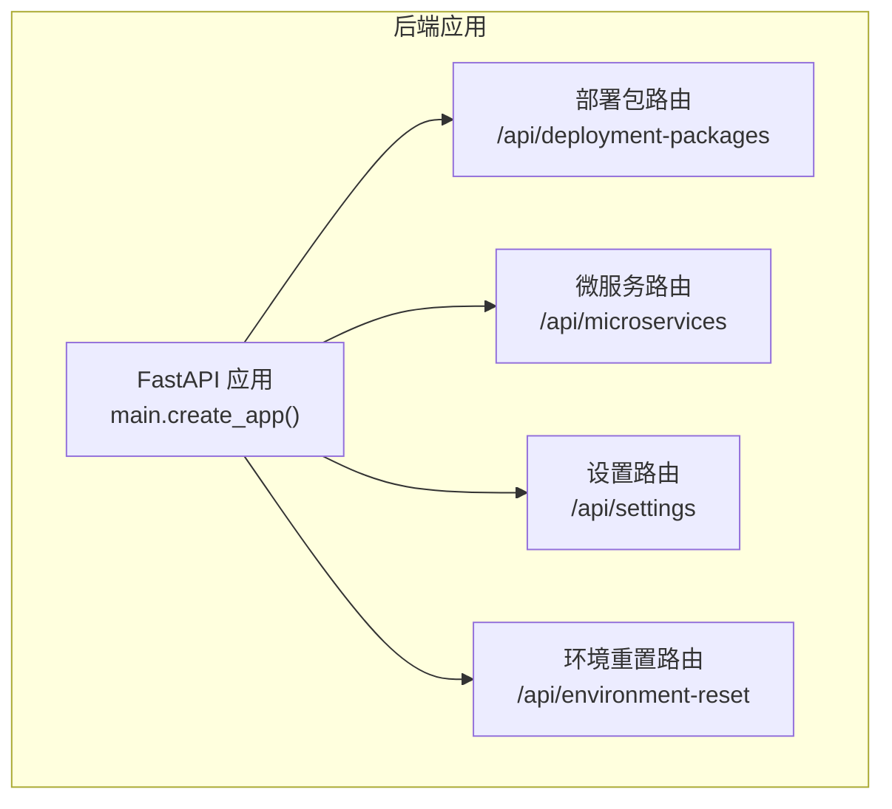
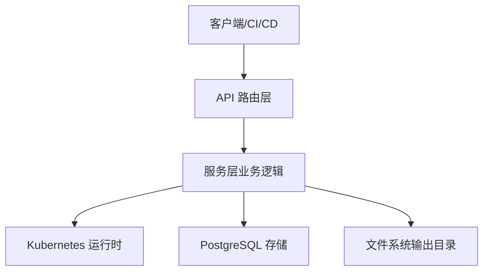
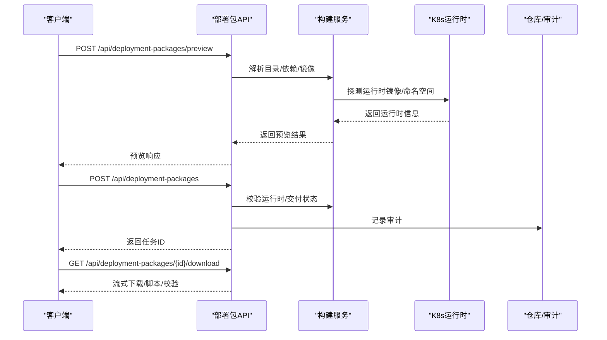
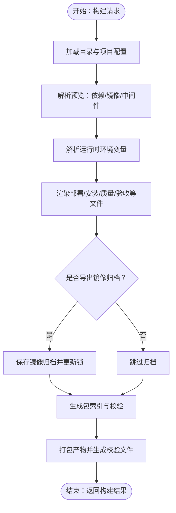
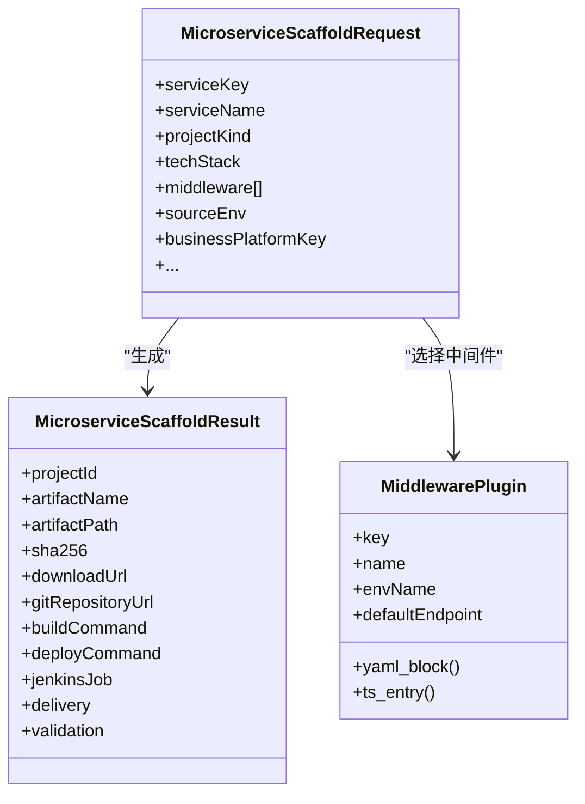
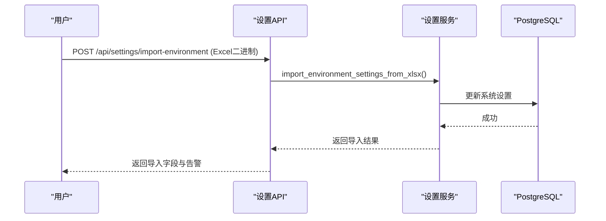
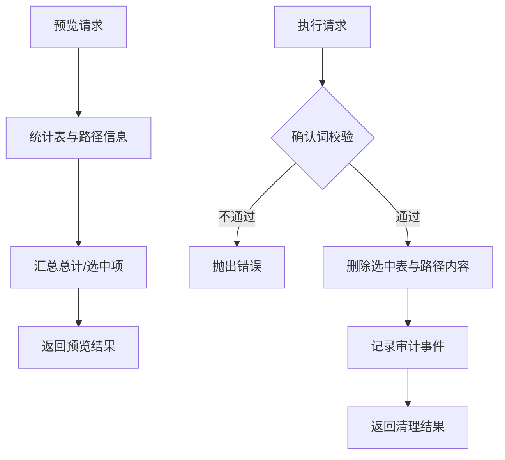
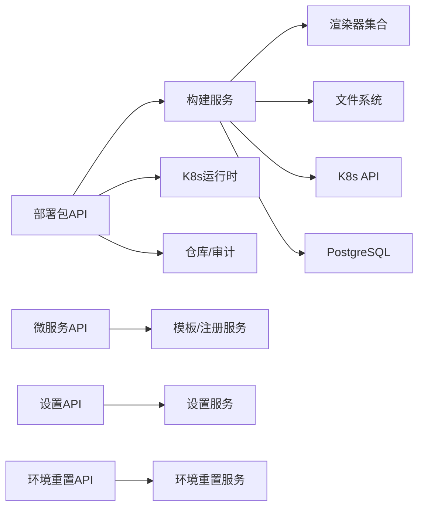

# 核心功能

<cite>
**本文引用的文件**
- [backend/deployment_package_factory/main.py](file://backend/deployment_package_factory/main.py)
- [backend/deployment_package_factory/api/deployment_packages.py](file://backend/deployment_package_factory/api/deployment_packages.py)
- [backend/deployment_package_factory/api/microservices.py](file://backend/deployment_package_factory/api/microservices.py)
- [backend/deployment_package_factory/api/settings.py](file://backend/deployment_package_factory/api/settings.py)
- [backend/deployment_package_factory/api/environment_reset.py](file://backend/deployment_package_factory/api/environment_reset.py)
- [backend/deployment_package_factory/services/deployment_packages/models.py](file://backend/deployment_package_factory/services/deployment_packages/models.py)
- [backend/deployment_package_factory/services/deployment_packages/builder.py](file://backend/deployment_package_factory/services/deployment_packages/builder.py)
- [backend/deployment_package_factory/services/deployment_packages/cleanup.py](file://backend/deployment_package_factory/services/deployment_packages/cleanup.py)
- [backend/deployment_package_factory/services/deployment_packages/dependency_resolver.py](file://backend/deployment_package_factory/services/deployment_packages/dependency_resolver.py)
- [backend/deployment_package_factory/services/deployment_packages/download_streaming.py](file://backend/deployment_package_factory/services/deployment_packages/download_streaming.py)
- [backend/deployment_package_factory/services/deployment_packages/kubernetes_runtime.py](file://backend/deployment_package_factory/services/deployment_packages/kubernetes_runtime.py)
- [backend/deployment_package_factory/services/deployment_packages/task_executor.py](file://backend/deployment_package_factory/services/deployment_packages/task_executor.py)
- [backend/deployment_package_factory/services/deployment_packages/runtime_resources.py](file://backend/deployment_package_factory/services/deployment_packages/runtime_resources.py)
- [backend/deployment_package_factory/services/deployment_packages/runtime_env_probe.py](file://backend/deployment_package_factory/services/deployment_packages/runtime_env_probe.py)
- [backend/deployment_package_factory/services/deployment_packages/runtime_env_values.py](file://backend/deployment_package_factory/services/deployment_packages/runtime_env_values.py)
- [backend/deployment_package_factory/services/deployment_packages/runtime_env_parser.py](file://backend/deployment_package_factory/services/deployment_packages/runtime_env_parser.py)
- [backend/deployment_package_factory/services/deployment_packages/runtime_env_aliases.py](file://backend/deployment_package_factory/services/deployment_packages/runtime_env_aliases.py)
- [backend/deployment_package_factory/services/deployment_packages/runtime_config_items.py](file://backend/deployment_package_factory/services/deployment_packages/runtime_config_items.py)
- [backend/deployment_package_factory/services/deployment_packages/runtime_resource_ops.py](file://backend/deployment_package_factory/services/deployment_packages/runtime_resource_ops.py)
- [backend/deployment_package_factory/services/deployment_packages/values_renderer.py](file://backend/deployment_package_factory/services/deployment_packages/values_renderer.py)
- [backend/deployment_package_factory/services/deployment_packages/project_overlay_renderer.py](file://backend/deployment_package_factory/services/deployment_packages/project_overlay_renderer.py)
- [backend/deployment_package_factory/services/deployment_packages/acceptance_report_renderer.py](file://backend/deployment_package_factory/services/deployment_packages/acceptance_report_renderer.py)
- [backend/deployment_package_factory/services/deployment_packages/diagnostics_renderer.py](file://backend/deployment_package_factory/services/deployment_packages/diagnostics_renderer.py)
- [backend/deployment_package_factory/services/deployment_packages/install_renderer.py](file://backend/deployment_package_factory/services/deployment_packages/install_renderer.py)
- [backend/deployment_package_factory/services/deployment_packages/init_script_renderer.py](file://backend/deployment_package_factory/services/deployment_packages/init_script_renderer.py)
- [backend/deployment_package_factory/services/deployment_packages/quality_renderer.py](file://backend/deployment_package_factory/services/deployment_packages/quality_renderer.py)
- [backend/deployment_package_factory/services/deployment_packages/verify_renderer.py](file://backend/deployment_package_factory/services/deployment_packages/verify_renderer.py)
- [backend/deployment_package_factory/services/deployment_packages/download_scripts.py](file://backend/deployment_package_factory/services/deployment_packages/download_scripts.py)
- [backend/deployment_package_factory/services/deployment_packages/repositories.py](file://backend/deployment_package_factory/services/deployment_packages/repositories.py)
- [backend/deployment_package_factory/services/deployment_packages/postgres_repositories.py](file://backend/deployment_package_factory/services/deployment_packages/postgres_repositories.py)
- [backend/deployment_package_factory/services/microservices/scaffold.py](file://backend/deployment_package_factory/services/microservices/scaffold.py)
- [backend/deployment_package_factory/services/microservices/artifacts.py](file://backend/deployment_package_factory/services/microservices/artifacts.py)
- [backend/deployment_package_factory/services/microservices/delivery.py](file://backend/deployment_package_factory/services/microservices/delivery.py)
- [backend/deployment_package_factory/services/microservices/git_providers.py](file://backend/deployment_package_factory/services/microservices/git_providers.py)
- [backend/deployment_package_factory/services/microservices/java_templates.py](file://backend/deployment_package_factory/services/microservices/java_templates.py)
- [backend/deployment_package_factory/services/microservices/node_templates.py](file://backend/deployment_package_factory/services/microservices/node_templates.py)
- [backend/deployment_package_factory/services/microservices/frontend_templates.py](file://backend/deployment_package_factory/services/microservices/frontend_templates.py)
- [backend/deployment_package_factory/services/microservices/templates.py](file://backend/deployment_package_factory/services/microservices/templates.py)
- [backend/deployment_package_factory/services/microservices/templates_common.py](file://backend/deployment_package_factory/services/microservices/templates_common.py)
- [backend/deployment_package_factory/services/microservices/validation.py](file://backend/deployment_package_factory/services/microservices/validation.py)
- [backend/deployment_package_factory/services/microservices/repository.py](file://backend/deployment_package_factory/services/microservices/repository.py)
- [backend/deployment_package_factory/services/microservices/result_metadata.py](file://backend/deployment_package_factory/services/microservices/result_metadata.py)
- [backend/deployment_package_factory/services/microservices/middleware_runtime.py](file://backend/deployment_package_factory/services/microservices/middleware_runtime.py)
- [backend/deployment_package_factory/services/microservices/middleware_plugins.py](file://backend/deployment_package_factory/services/microservices/middleware_plugins.py)
- [backend/deployment_package_factory/services/settings.py](file://backend/deployment_package_factory/services/settings.py)
- [backend/deployment_package_factory/services/settings_importer.py](file://backend/deployment_package_factory/services/settings_importer.py)
- [backend/deployment_package_factory/services/environment_reset.py](file://backend/deployment_package_factory/services/environment_reset.py)
- [templates/catalog/projects.yaml](file://templates/catalog/projects.yaml)
- [templates/catalog/platform.yaml](file://templates/catalog/platform.yaml)
- [templates/catalog/business.yaml](file://templates/catalog/business.yaml)
</cite>

## 目录
1. [简介](#简介)
2. [项目结构](#项目结构)
3. [核心组件](#核心组件)
4. [架构总览](#架构总览)
5. [详细组件分析](#详细组件分析)
6. [依赖关系分析](#依赖关系分析)
7. [性能考量](#性能考量)
8. [故障排除指南](#故障排除指南)
9. [结论](#结论)
10. [附录](#附录)

## 简介
本文件面向部署包工厂的核心功能，系统性梳理并解释四大模块：部署包生成、微服务注册、系统设置管理、环境清理。文档从代码级视角出发，结合数据流与处理逻辑，提供可操作的使用场景、配置选项、最佳实践与故障排除建议，帮助读者快速掌握系统能力与边界。

## 项目结构
后端采用 FastAPI 应用入口集中挂载四个 API 命名空间：
- 部署包相关：/api/deployment-packages（构建、预览、下载、清理、任务）
- 微服务相关：/api/microservices（注册、交付状态、下载）
- 设置相关：/api/settings（读取/更新/Excel 导入）
- 环境重置：/api/environment-reset（预览/执行）

图表来源
- [backend/deployment_package_factory/main.py:23-64](file://backend/deployment_package_factory/main.py#L23-L64)
- [backend/deployment_package_factory/api/deployment_packages.py:50-54](file://backend/deployment_package_factory/api/deployment_packages.py#L50-L54)
- [backend/deployment_package_factory/api/microservices.py:29-33](file://backend/deployment_package_factory/api/microservices.py#L29-L33)
- [backend/deployment_package_factory/api/settings.py:17-21](file://backend/deployment_package_factory/api/settings.py#L17-L21)
- [backend/deployment_package_factory/api/environment_reset.py:16-19](file://backend/deployment_package_factory/api/environment_reset.py#L16-L19)

章节来源
- [backend/deployment_package_factory/main.py:23-64](file://backend/deployment_package_factory/main.py#L23-L64)

## 核心组件
- 部署包生成：接收请求，解析目录与依赖，渲染部署清单与脚本，导出镜像归档，生成校验与索引，支持预览与质量门禁。
- 微服务注册：根据技术栈与中间件生成工程骨架，注入交付元数据，支持 Git 初始化与后续交付状态刷新。
- 系统设置管理：定义 Git/Harbor/Jenkins/K8s/Middleware 等配置模型，提供读取/更新与 Excel 导入能力。
- 环境清理：对数据库表与输出目录进行预览与清理，支持确认词校验与审计记录。

章节来源
- [backend/deployment_package_factory/api/deployment_packages.py:110-123](file://backend/deployment_package_factory/api/deployment_packages.py#L110-L123)
- [backend/deployment_package_factory/api/microservices.py:47-67](file://backend/deployment_package_factory/api/microservices.py#L47-L67)
- [backend/deployment_package_factory/api/settings.py:42-49](file://backend/deployment_package_factory/api/settings.py#L42-L49)
- [backend/deployment_package_factory/api/environment_reset.py:24-43](file://backend/deployment_package_factory/api/environment_reset.py#L24-L43)

## 架构总览
系统通过 API 层协调服务层与基础设施，核心交互如下：

图表来源
- [backend/deployment_package_factory/api/deployment_packages.py:23-29](file://backend/deployment_package_factory/api/deployment_packages.py#L23-L29)
- [backend/deployment_package_factory/services/deployment_packages/builder.py:146-246](file://backend/deployment_package_factory/services/deployment_packages/builder.py#L146-L246)
- [backend/deployment_package_factory/services/environment_reset.py:99-112](file://backend/deployment_package_factory/services/environment_reset.py#L99-L112)

## 详细组件分析

### 部署包生成（生成、预览、下载、清理、任务）
- 入口与控制流
  - 预览：解析目录、计算镜像条目、合并运行时环境与中间件配置，返回预览结果。
  - 创建：校验运行时匹配、阻断未就绪的微服务交付，持久化任务并记录审计事件。
  - 下载：支持 Range 分块与校验头，提供脚本与校验文件下载。
  - 清理：按保留期与大小阈值清理输出产物，支持 Dry-Run。
  - 任务：查询、取消、重试，后台模式下交由任务执行器异步运行。

图表来源
- [backend/deployment_package_factory/api/deployment_packages.py:126-162](file://backend/deployment_package_factory/api/deployment_packages.py#L126-L162)
- [backend/deployment_package_factory/api/deployment_packages.py:245-282](file://backend/deployment_package_factory/api/deployment_packages.py#L245-L282)
- [backend/deployment_package_factory/api/deployment_packages.py:392-424](file://backend/deployment_package_factory/api/deployment_packages.py#L392-L424)
- [backend/deployment_package_factory/services/deployment_packages/builder.py:146-246](file://backend/deployment_package_factory/services/deployment_packages/builder.py#L146-L246)
- [backend/deployment_package_factory/services/deployment_packages/kubernetes_runtime.py:1-200](file://backend/deployment_package_factory/services/deployment_packages/kubernetes_runtime.py#L1-L200)

- 关键流程与算法
  - 镜像解析与导出
    - 依据目录与运行时命名空间匹配镜像，生成源/目标镜像引用与归档文件名。
    - 支持镜像清单与归档两种模式；归档模式下导出镜像并更新摘要锁。
  - 运行时环境解析
    - 从 K8s Secret/ConfigMap 与环境变量解析中间件环境变量别名映射。
  - 质量门禁与验收
    - 渲染质量门禁与验收报告文件，生成 SHA256 汇总与校验文件。
  - 下载与分块
    - Range 头解析与内容范围响应，支持 If-Range 快速失败。

图表来源
- [backend/deployment_package_factory/services/deployment_packages/builder.py:146-246](file://backend/deployment_package_factory/services/deployment_packages/builder.py#L146-L246)
- [backend/deployment_package_factory/services/deployment_packages/quality_renderer.py:1-200](file://backend/deployment_package_factory/services/deployment_packages/quality_renderer.py#L1-L200)
- [backend/deployment_package_factory/services/deployment_packages/acceptance_report_renderer.py:1-200](file://backend/deployment_package_factory/services/deployment_packages/acceptance_report_renderer.py#L1-L200)
- [backend/deployment_package_factory/services/deployment_packages/download_streaming.py:1-200](file://backend/deployment_package_factory/services/deployment_packages/download_streaming.py#L1-L200)

章节来源
- [backend/deployment_package_factory/api/deployment_packages.py:126-162](file://backend/deployment_package_factory/api/deployment_packages.py#L126-L162)
- [backend/deployment_package_factory/api/deployment_packages.py:245-282](file://backend/deployment_package_factory/api/deployment_packages.py#L245-L282)
- [backend/deployment_package_factory/api/deployment_packages.py:308-330](file://backend/deployment_package_factory/api/deployment_packages.py#L308-L330)
- [backend/deployment_package_factory/api/deployment_packages.py:392-424](file://backend/deployment_package_factory/api/deployment_packages.py#L392-L424)
- [backend/deployment_package_factory/services/deployment_packages/builder.py:146-246](file://backend/deployment_package_factory/services/deployment_packages/builder.py#L146-L246)
- [backend/deployment_package_factory/services/deployment_packages/download_streaming.py:1-200](file://backend/deployment_package_factory/services/deployment_packages/download_streaming.py#L1-L200)

### 微服务注册（模板生成、Git 集成、中间件插件）
- 功能要点
  - 选项与校验：提供项目类型、技术栈、微前端框架、中间件列表，并对输入进行严格校验。
  - 模板渲染：按技术栈生成工程骨架（含 Helm/Deployment/YAML/脚本），注入中间件配置与运行时环境。
  - Git 初始化：在宿主具备 git 时自动初始化仓库并提交。
  - 交付元数据：生成构建/部署命令、镜像引用、Jenkins Job 等元数据，便于后续交付。
  - 中间件插件：内置多种中间件的默认端点与环境变量占位，支持 YAML/TS 输出。

图表来源
- [backend/deployment_package_factory/services/microservices/scaffold.py:54-81](file://backend/deployment_package_factory/services/microservices/scaffold.py#L54-L81)
- [backend/deployment_package_factory/services/microservices/scaffold.py:174-204](file://backend/deployment_package_factory/services/microservices/scaffold.py#L174-L204)
- [backend/deployment_package_factory/services/microservices/middleware_plugins.py:6-36](file://backend/deployment_package_factory/services/microservices/middleware_plugins.py#L6-L36)

章节来源
- [backend/deployment_package_factory/api/microservices.py:47-67](file://backend/deployment_package_factory/api/microservices.py#L47-L67)
- [backend/deployment_package_factory/services/microservices/scaffold.py:231-288](file://backend/deployment_package_factory/services/microservices/scaffold.py#L231-L288)
- [backend/deployment_package_factory/services/microservices/middleware_plugins.py:27-68](file://backend/deployment_package_factory/services/microservices/middleware_plugins.py#L27-L68)

### 系统设置管理（数据模型、Excel 导入、配置验证）
- 数据模型
  - GitSettings、HarborSettings、JenkinsSettings、KubernetesSettings、MiddlewareSettings 及其字段校验规则。
  - SystemSettingsRepository 提供 PostgreSQL 持久化，包含 schema 初始化、读取与更新。
- Excel 导入
  - 将 Excel 转换为系统设置对象，合并当前配置，保存并返回导入字段与告警。

图表来源
- [backend/deployment_package_factory/api/settings.py:52-68](file://backend/deployment_package_factory/api/settings.py#L52-L68)
- [backend/deployment_package_factory/services/settings.py:160-223](file://backend/deployment_package_factory/services/settings.py#L160-L223)
- [backend/deployment_package_factory/services/settings_importer.py:1-200](file://backend/deployment_package_factory/services/settings_importer.py#L1-L200)

章节来源
- [backend/deployment_package_factory/services/settings.py:16-223](file://backend/deployment_package_factory/services/settings.py#L16-L223)
- [backend/deployment_package_factory/api/settings.py:52-68](file://backend/deployment_package_factory/api/settings.py#L52-L68)

### 环境清理（策略、预览、审计）
- 功能要点
  - 预览：统计待删除表行数与路径文件/字节规模。
  - 执行：基于确认词校验，删除选中的表与路径内容，记录审计事件。
  - 安全：限制仅能清理输出根目录下的子路径，防止越权删除。

图表来源
- [backend/deployment_package_factory/api/environment_reset.py:24-43](file://backend/deployment_package_factory/api/environment_reset.py#L24-L43)
- [backend/deployment_package_factory/services/environment_reset.py:99-112](file://backend/deployment_package_factory/services/environment_reset.py#L99-L112)
- [backend/deployment_package_factory/services/environment_reset.py:151-189](file://backend/deployment_package_factory/services/environment_reset.py#L151-L189)

章节来源
- [backend/deployment_package_factory/api/environment_reset.py:24-43](file://backend/deployment_package_factory/api/environment_reset.py#L24-L43)
- [backend/deployment_package_factory/services/environment_reset.py:99-112](file://backend/deployment_package_factory/services/environment_reset.py#L99-L112)

## 依赖关系分析
- 组件耦合
  - API 层依赖服务层与仓库/审计模块，统一注入任务执行器与存储连接。
  - 服务层依赖目录/模板渲染器、K8s 运行时、下载与校验工具链。
- 外部依赖
  - Kubernetes API（Secret/ConfigMap/Pod 列表）、PostgreSQL（任务/审计/平台/微服务/设置）、文件系统（输出目录）。
- 直接/间接依赖
  - 部署包构建依赖目录解析、依赖解析、运行时环境探测、镜像导出、文件渲染与打包。
  - 微服务注册依赖模板引擎、中间件插件、交付元数据与 Git 工具。

图表来源
- [backend/deployment_package_factory/api/deployment_packages.py:63-103](file://backend/deployment_package_factory/api/deployment_packages.py#L63-L103)
- [backend/deployment_package_factory/services/deployment_packages/builder.py:146-246](file://backend/deployment_package_factory/services/deployment_packages/builder.py#L146-L246)
- [backend/deployment_package_factory/api/microservices.py:36-45](file://backend/deployment_package_factory/api/microservices.py#L36-L45)
- [backend/deployment_package_factory/api/settings.py:35-39](file://backend/deployment_package_factory/api/settings.py#L35-L39)
- [backend/deployment_package_factory/api/environment_reset.py:21-22](file://backend/deployment_package_factory/api/environment_reset.py#L21-L22)

章节来源
- [backend/deployment_package_factory/api/deployment_packages.py:63-103](file://backend/deployment_package_factory/api/deployment_packages.py#L63-L103)
- [backend/deployment_package_factory/services/deployment_packages/builder.py:146-246](file://backend/deployment_package_factory/services/deployment_packages/builder.py#L146-L246)

## 性能考量
- 并发与后台执行
  - 任务执行器支持并发构建上限与心跳检测，后台模式下异步运行，避免阻塞 API。
- I/O 优化
  - 使用流式下载与 Range 支持，减少大包传输压力；归档镜像采用 tarball 压缩。
- 运行时探测
  - 优先从运行时命名空间拉取镜像以降低导出成本；镜像匹配采用路径与基础名评分，提升命中率。
- 存储清理
  - 基于保留天数与总大小阈值清理，Dry-Run 预览避免误删。

章节来源
- [backend/deployment_package_factory/api/deployment_packages.py:91-103](file://backend/deployment_package_factory/api/deployment_packages.py#L91-L103)
- [backend/deployment_package_factory/services/deployment_packages/download_streaming.py:1-200](file://backend/deployment_package_factory/services/deployment_packages/download_streaming.py#L1-L200)
- [backend/deployment_package_factory/services/deployment_packages/builder.py:618-680](file://backend/deployment_package_factory/services/deployment_packages/builder.py#L618-L680)
- [backend/deployment_package_factory/api/deployment_packages.py:308-330](file://backend/deployment_package_factory/api/deployment_packages.py#L308-L330)

## 故障排除指南
- 部署包构建
  - 镜像导出环境检查：若缺少导出工具或 Docker 不可用，需安装 skopeo 或提供带守护进程的 Docker CLI。
  - 运行时镜像缺失：当启用“需要运行时源镜像”但未在命名空间中匹配到镜像时，构建会标记缺失并提示来源环境。
  - 质量门禁失败：检查质量门禁与验收报告文件是否生成，确保所有必需文件存在且校验通过。
- 微服务注册
  - 技术栈/中间件不支持：确认技术栈与中间件在支持列表内；前端项目不可指定非前端中间件。
  - Git 初始化失败：宿主需安装 git，或手动初始化仓库。
- 系统设置
  - PostgreSQL 连接：未配置数据库 URL 时无法持久化设置；导入 Excel 后需检查告警与导入字段。
- 环境清理
  - 确认词错误：必须完全匹配“RESET deployment-package-factory”，否则拒绝执行。
  - 路径越界：仅允许清理输出根目录下的 artifacts/work 子目录，越界将被拒绝。

章节来源
- [backend/deployment_package_factory/services/deployment_packages/builder.py:105-143](file://backend/deployment_package_factory/services/deployment_packages/builder.py#L105-L143)
- [backend/deployment_package_factory/services/deployment_packages/builder.py:494-517](file://backend/deployment_package_factory/services/deployment_packages/builder.py#L494-L517)
- [backend/deployment_package_factory/services/microservices/scaffold.py:82-171](file://backend/deployment_package_factory/services/microservices/scaffold.py#L82-L171)
- [backend/deployment_package_factory/api/settings.py:220-223](file://backend/deployment_package_factory/api/settings.py#L220-L223)
- [backend/deployment_package_factory/services/environment_reset.py:106-108](file://backend/deployment_package_factory/services/environment_reset.py#L106-L108)
- [backend/deployment_package_factory/services/environment_reset.py:264-266](file://backend/deployment_package_factory/services/environment_reset.py#L264-L266)

## 结论
部署包工厂围绕“目录/依赖/镜像/文件/质量门禁”的闭环流程，提供可扩展的模板与中间件体系，配合系统设置与环境清理能力，形成完整的生产交付流水线。通过严格的输入校验、运行时探测与审计记录，系统在保证一致性的同时兼顾易用性与可观测性。

## 附录
- 使用场景与最佳实践
  - 部署包生成：优先使用预览接口核对镜像与依赖；启用归档模式以固化镜像版本；在 CI 中先执行质量门禁脚本。
  - 微服务注册：统一中间件配置与命名空间；在本地开发阶段允许中间件占位，生产阶段补齐密钥。
  - 系统设置：通过 Excel 导入批量更新环境参数；定期备份系统设置表。
  - 环境清理：在维护窗口执行清理；先 Dry-Run 再执行；保留关键审计与任务记录以便追溯。
- 配置选项速查
  - 部署包：项目键、产品版本、来源环境、部署模式、平台/业务服务、数据库、目标配置、镜像模式、运行时覆盖。
  - 微服务：项目类型、技术栈、微前端框架、中间件、端口、业务平台键/命名空间、镜像仓库/命名空间、Git/Jenkins 凭据。
  - 设置：Git 提供商/基础地址/组、Harbor 注册中心/项目、Jenkins 基础地址/目录、K8s 集群/命名空间、中间件端点。
  - 环境重置：选择清理表与路径、确认短语。

章节来源
- [backend/deployment_package_factory/services/deployment_packages/models.py:104-134](file://backend/deployment_package_factory/services/deployment_packages/models.py#L104-L134)
- [backend/deployment_package_factory/services/microservices/scaffold.py:54-81](file://backend/deployment_package_factory/services/microservices/scaffold.py#L54-L81)
- [backend/deployment_package_factory/services/settings.py:160-168](file://backend/deployment_package_factory/services/settings.py#L160-L168)
- [backend/deployment_package_factory/services/environment_reset.py:22-32](file://backend/deployment_package_factory/services/environment_reset.py#L22-L32)
- [templates/catalog/projects.yaml:1-54](file://templates/catalog/projects.yaml#L1-L54)
- [templates/catalog/platform.yaml:1-66](file://templates/catalog/platform.yaml#L1-L66)
- [templates/catalog/business.yaml:1-60](file://templates/catalog/business.yaml#L1-L60)