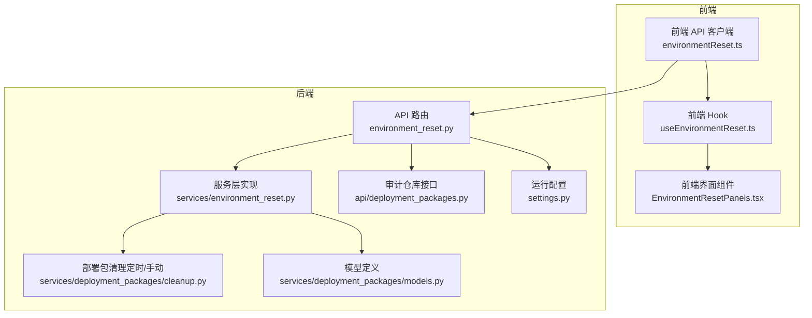
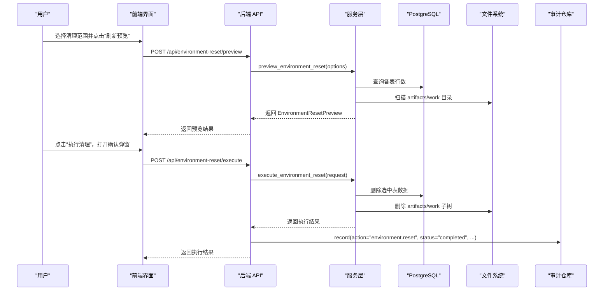
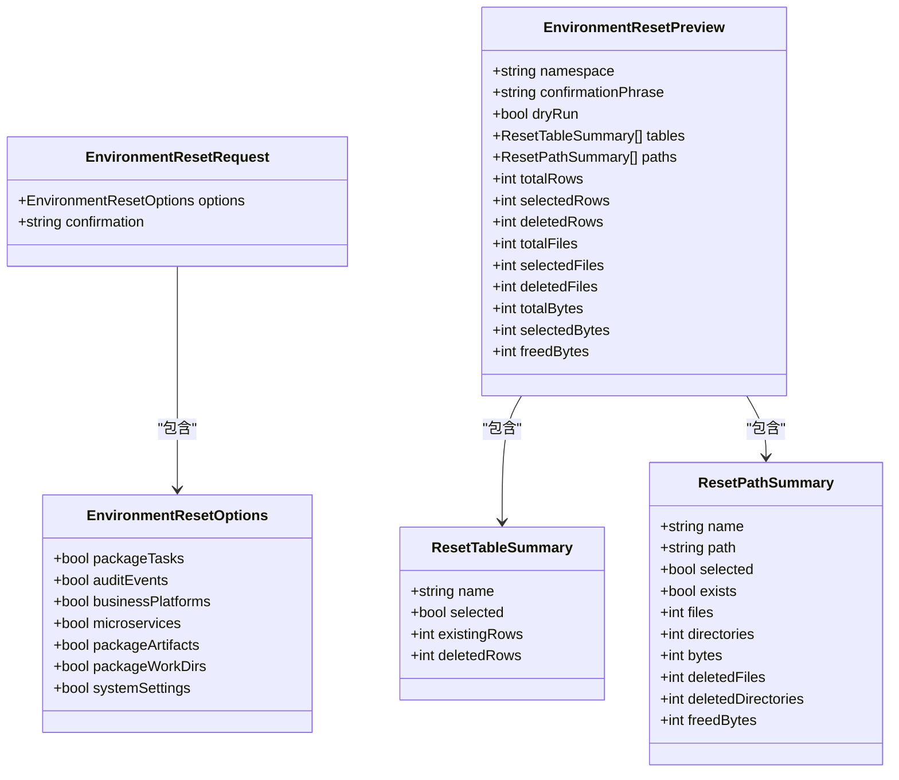
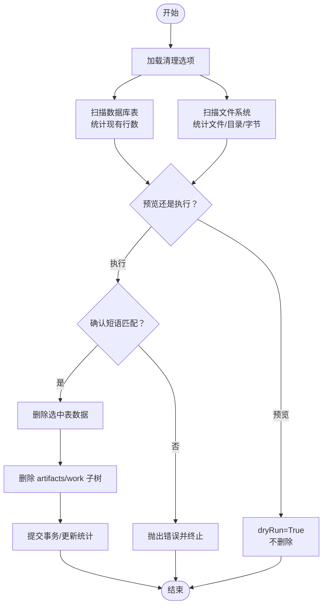
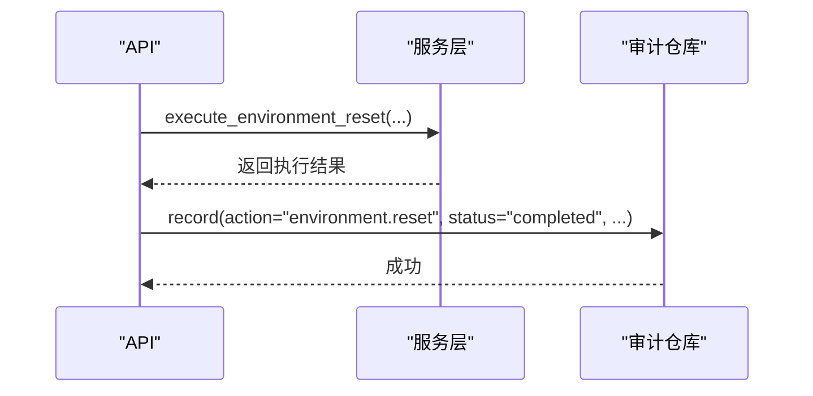
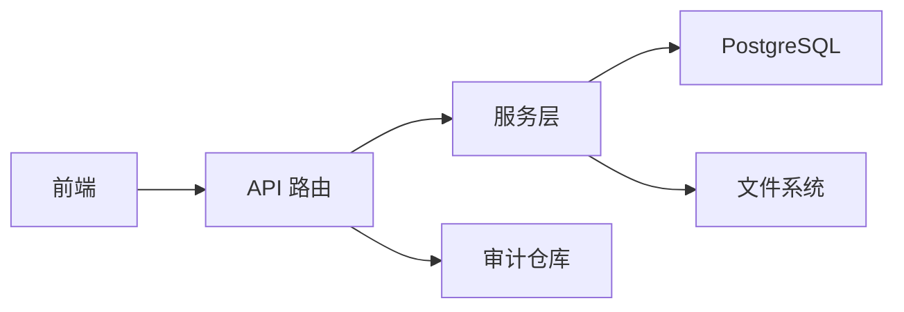

# 环境清理

<cite>
**本文引用的文件列表**
- [environment_reset.py](file://backend/deployment_package_factory/api/environment_reset.py)
- [environment_reset.py](file://backend/deployment_package_factory/services/environment_reset.py)
- [cleanup.py](file://backend/deployment_package_factory/services/deployment_packages/cleanup.py)
- [models.py](file://backend/deployment_package_factory/services/deployment_packages/models.py)
- [environmentReset.ts](file://frontend/src/api/environmentReset.ts)
- [EnvironmentResetPanels.tsx](file://frontend/src/views/components/EnvironmentResetPanels.tsx)
- [useEnvironmentReset.ts](file://frontend/src/views/hooks/useEnvironmentReset.ts)
- [deployment_packages.py](file://backend/deployment_package_factory/api/deployment_packages.py)
- [settings.py](file://backend/deployment_package_factory/settings.py)
- [test_environment_reset_api.py](file://backend/tests/test_environment_reset_api.py)
- [README.md](file://README.md)
</cite>

## 目录
1. [简介](#简介)
2. [项目结构](#项目结构)
3. [核心组件](#核心组件)
4. [架构概览](#架构概览)
5. [详细组件分析](#详细组件分析)
6. [依赖分析](#依赖分析)
7. [性能考量](#性能考量)
8. [故障排除指南](#故障排除指南)
9. [结论](#结论)
10. [附录](#附录)

## 简介
本文件面向“环境清理”功能，系统性阐述其策略设计与执行机制，涵盖数据库表清理、文件系统清理与审计日志清理的实现细节；详解 EnvironmentResetRequest 数据模型、清理预览与确认执行流程；说明安全保障、回滚机制与审计日志记录；解释清理级别选择、批量处理与错误恢复策略；并提供最佳实践、风险评估与操作注意事项及使用示例与故障排除方法。

## 项目结构
环境清理功能由后端 API、服务层、前端交互与测试共同组成，前后端通过 REST 接口协同完成“预览—确认—执行”的闭环。

图表来源
- [environmentReset.ts:1-73](file://frontend/src/api/environmentReset.ts#L1-L73)
- [useEnvironmentReset.ts:1-82](file://frontend/src/views/hooks/useEnvironmentReset.ts#L1-L82)
- [EnvironmentResetPanels.tsx:1-145](file://frontend/src/views/components/EnvironmentResetPanels.tsx#L1-L145)
- [environment_reset.py:1-74](file://backend/deployment_package_factory/api/environment_reset.py#L1-L74)
- [environment_reset.py:1-292](file://backend/deployment_package_factory/services/environment_reset.py#L1-L292)
- [cleanup.py:1-137](file://backend/deployment_package_factory/services/deployment_packages/cleanup.py#L1-L137)
- [models.py:1-251](file://backend/deployment_package_factory/services/deployment_packages/models.py#L1-L251)
- [deployment_packages.py:1-658](file://backend/deployment_package_factory/api/deployment_packages.py#L1-L658)
- [settings.py:1-57](file://backend/deployment_package_factory/settings.py#L1-L57)

章节来源
- [environmentReset.ts:1-73](file://frontend/src/api/environmentReset.ts#L1-L73)
- [useEnvironmentReset.ts:1-82](file://frontend/src/views/hooks/useEnvironmentReset.ts#L1-L82)
- [EnvironmentResetPanels.tsx:1-145](file://frontend/src/views/components/EnvironmentResetPanels.tsx#L1-L145)
- [environment_reset.py:1-74](file://backend/deployment_package_factory/api/environment_reset.py#L1-L74)
- [environment_reset.py:1-292](file://backend/deployment_package_factory/services/environment_reset.py#L1-L292)
- [cleanup.py:1-137](file://backend/deployment_package_factory/services/deployment_packages/cleanup.py#L1-L137)
- [models.py:1-251](file://backend/deployment_package_factory/services/deployment_packages/models.py#L1-L251)
- [deployment_packages.py:1-658](file://backend/deployment_package_factory/api/deployment_packages.py#L1-L658)
- [settings.py:1-57](file://backend/deployment_package_factory/settings.py#L1-L57)

## 核心组件
- 数据模型与请求体
  - EnvironmentResetOptions：定义可选清理范围（如导包任务、审计日志、业务平台、微服务、部署包产物、工作目录、系统设置）
  - EnvironmentResetRequest：封装 options 与确认短语
  - EnvironmentResetPreview：预览/执行结果汇总（含表格统计、路径统计、总计/选中/删除计数）
  - ResetTableSummary、ResetPathSummary：分别描述数据库表与文件系统的清理统计
- 服务层
  - preview_environment_reset：基于选项扫描数据库与文件系统，生成预览
  - execute_environment_reset：执行清理，严格校验确认短语
  - _table_summaries/_delete_tables：统计与删除指定表
  - _path_summaries/_delete_paths：扫描与删除 artifacts/work 目录
  - _ensure_child_path：路径安全校验，防止越权删除
- API 层
  - /api/environment-reset/preview：POST 预览
  - /api/environment-reset/execute：POST 执行，记录审计事件
- 前端
  - 提供选项面板、预览面板、确认弹窗与执行钩子
  - 默认全选，谨慎项（系统设置）默认关闭
- 审计与安全
  - 执行后记录 action="environment.reset" 的审计事件
  - 强制确认短语，防止误操作
  - 路径删除前进行安全校验

章节来源
- [environment_reset.py:22-82](file://backend/deployment_package_factory/services/environment_reset.py#L22-L82)
- [environment_reset.py:24-58](file://backend/deployment_package_factory/api/environment_reset.py#L24-L58)
- [environmentReset.ts:3-48](file://frontend/src/api/environmentReset.ts#L3-L48)
- [EnvironmentResetPanels.tsx:11-49](file://frontend/src/views/components/EnvironmentResetPanels.tsx#L11-L49)
- [useEnvironmentReset.ts:11-82](file://frontend/src/views/hooks/useEnvironmentReset.ts#L11-L82)

## 架构概览
环境清理的端到端流程如下：

图表来源
- [environment_reset.py:24-58](file://backend/deployment_package_factory/api/environment_reset.py#L24-L58)
- [environment_reset.py:99-112](file://backend/deployment_package_factory/services/environment_reset.py#L99-L112)
- [deployment_packages.py:69-74](file://backend/deployment_package_factory/api/deployment_packages.py#L69-L74)

## 详细组件分析

### 数据模型与请求体
- EnvironmentResetOptions
  - 字段含义：布尔开关控制是否清理对应范围
  - 默认行为：除 system_settings 外均默认开启
- EnvironmentResetRequest
  - 字段含义：options + confirmation（确认短语）
  - 约束：confirmation 必须与固定短语完全一致
- EnvironmentResetPreview
  - 字段含义：namespace、dryRun、tables、paths、总计/选中/删除计数
- ResetTableSummary/ResetPathSummary
  - 字段含义：名称、是否存在、文件/目录/字节统计、删除计数、释放字节等

图表来源
- [environment_reset.py:22-82](file://backend/deployment_package_factory/services/environment_reset.py#L22-L82)

章节来源
- [environment_reset.py:22-82](file://backend/deployment_package_factory/services/environment_reset.py#L22-L82)
- [environmentReset.ts:3-48](file://frontend/src/api/environmentReset.ts#L3-L48)

### 清理策略与执行机制
- 数据库表清理
  - 可清理表集合：package_tasks、audit_events、business_platforms、microservices、system_settings
  - 统计逻辑：遍历表，查询 count(*)，捕获 UndefinedTable 时视为 0
  - 删除逻辑：对选中表执行 delete from table，回滚 UndefinedTable 错误
  - 事务：每张表删除后提交一次，确保一致性
- 文件系统清理
  - artifacts/work 两处目录
  - 扫描：递归统计文件/目录/字节
  - 删除：删除文件/符号链接与目录树，计算释放字节
  - 安全校验：确保删除路径为输出目录的子路径，拒绝越界
- 预览与执行
  - 预览：dryRun=True，不实际删除
  - 执行：dryRun=False，严格校验确认短语后执行
- 总计统计
  - 自动汇总 total/selected/deleted 各类计数，便于用户决策

图表来源
- [environment_reset.py:99-112](file://backend/deployment_package_factory/services/environment_reset.py#L99-L112)
- [environment_reset.py:130-189](file://backend/deployment_package_factory/services/environment_reset.py#L130-L189)

章节来源
- [environment_reset.py:99-189](file://backend/deployment_package_factory/services/environment_reset.py#L99-L189)
- [environment_reset.py:207-266](file://backend/deployment_package_factory/services/environment_reset.py#L207-L266)

### 审计日志与安全保障
- 审计记录
  - 执行完成后记录 action="environment.reset"，status="completed"
  - 记录 operator（显式头或 API Token）、client IP、目标 namespace、元数据（执行结果）
- 安全保障
  - 强制确认短语：必须与固定短语完全一致
  - 路径安全：_ensure_child_path 确保删除路径为输出目录子路径
  - 异常处理：UndefinedTable 回滚；其他异常转换为 HTTP 503/400
- 回滚机制
  - 服务层未实现显式回滚；删除操作在事务中提交，无法撤销
  - 建议：执行前务必预览并核对，必要时备份数据库与输出目录

图表来源
- [environment_reset.py:46-58](file://backend/deployment_package_factory/api/environment_reset.py#L46-L58)
- [deployment_packages.py:69-74](file://backend/deployment_package_factory/api/deployment_packages.py#L69-L74)

章节来源
- [environment_reset.py:46-58](file://backend/deployment_package_factory/api/environment_reset.py#L46-L58)
- [deployment_packages.py:69-74](file://backend/deployment_package_factory/api/deployment_packages.py#L69-L74)

### 前端交互与使用示例
- 选项面板
  - 支持勾选/取消勾选各清理范围
  - 系统设置为危险项，默认关闭
- 预览面板
  - 展示选中数据行、文件数、释放空间
  - 显示数据库表与文件目录的明细
- 确认弹窗
  - 输入确认短语后方可执行
- 使用示例
  - 通过前端界面选择清理范围，点击“刷新预览”查看统计
  - 确认无误后打开确认弹窗，输入确认短语并点击“确认清理”

章节来源
- [EnvironmentResetPanels.tsx:11-49](file://frontend/src/views/components/EnvironmentResetPanels.tsx#L11-L49)
- [EnvironmentResetPanels.tsx:53-81](file://frontend/src/views/components/EnvironmentResetPanels.tsx#L53-L81)
- [EnvironmentResetPanels.tsx:83-104](file://frontend/src/views/components/EnvironmentResetPanels.tsx#L83-L104)
- [useEnvironmentReset.ts:11-82](file://frontend/src/views/hooks/useEnvironmentReset.ts#L11-L82)

## 依赖分析
- 组件耦合
  - API 层依赖服务层；服务层依赖数据库连接与文件系统；API 层依赖审计仓库接口
  - 前端通过 API 客户端与后端交互
- 外部依赖
  - PostgreSQL：用于存储导包任务、审计事件、业务平台与微服务注册等元数据
  - 文件系统：artifacts 与 work 目录存放产物与中间目录
- 潜在循环依赖
  - 未发现循环依赖；模块职责清晰

图表来源
- [environment_reset.py:1-74](file://backend/deployment_package_factory/api/environment_reset.py#L1-L74)
- [environment_reset.py:1-292](file://backend/deployment_package_factory/services/environment_reset.py#L1-L292)
- [deployment_packages.py:69-74](file://backend/deployment_package_factory/api/deployment_packages.py#L69-L74)

章节来源
- [environment_reset.py:1-74](file://backend/deployment_package_factory/api/environment_reset.py#L1-L74)
- [environment_reset.py:1-292](file://backend/deployment_package_factory/services/environment_reset.py#L1-L292)
- [deployment_packages.py:1-658](file://backend/deployment_package_factory/api/deployment_packages.py#L1-L658)

## 性能考量
- 数据库扫描
  - 每张表执行 count(*)，在大表上可能产生开销；建议在低峰时段执行
- 文件系统扫描
  - artifacts/work 递归扫描，文件数量多时耗时较长；建议分批清理或在维护窗口执行
- 事务与提交
  - 每张表删除后提交，减少长事务占用；但频繁提交可能影响性能
- 建议
  - 预览阶段尽量缩小清理范围
  - 在非高峰时段执行，避免影响正常导包任务

[本节为通用性能讨论，不直接分析具体文件]

## 故障排除指南
- 常见错误与处理
  - 确认短语不匹配：返回 400，提示确认短语必须与固定短语一致
  - 数据库表不存在：捕获 UndefinedTable，回滚并计为 0
  - 路径越界：拒绝删除，抛出 ValueError
  - 审计记录失败：API 层忽略异常，不影响清理主流程
- 测试验证
  - 预览接口返回 selected 计数正确
  - 执行接口要求确认短语
  - 执行后审计事件记录成功
- 排错步骤
  - 确认前端确认短语与后端固定短语一致
  - 检查输出目录权限与磁盘空间
  - 查看审计事件以确认执行状态
  - 如需恢复，参考备份策略与数据库/文件系统备份

章节来源
- [environment_reset.py:24-58](file://backend/deployment_package_factory/api/environment_reset.py#L24-L58)
- [environment_reset.py:106-112](file://backend/deployment_package_factory/services/environment_reset.py#L106-L112)
- [environment_reset.py:207-222](file://backend/deployment_package_factory/services/environment_reset.py#L207-L222)
- [environment_reset.py:264-266](file://backend/deployment_package_factory/services/environment_reset.py#L264-L266)
- [test_environment_reset_api.py:60-97](file://backend/tests/test_environment_reset_api.py#L60-L97)

## 结论
环境清理功能通过“预览—确认—执行”的流程，结合数据库与文件系统双通道清理，提供了可控、可观测的环境重置能力。其安全保障主要体现在强制确认短语与路径安全校验，审计日志确保可追溯。建议在维护窗口执行，配合备份策略，确保风险可控。

[本节为总结性内容，不直接分析具体文件]

## 附录

### 清理级别与批量处理
- 清理级别
  - 数据库：按表粒度选择（任务、审计、平台、微服务、系统设置）
  - 文件系统：按目录粒度选择（产物、工作目录）
- 批量处理
  - 服务层对选中项逐一处理，支持多表/多目录批量删除
  - 预览阶段一次性统计，执行阶段逐项删除并提交

章节来源
- [environment_reset.py:192-204](file://backend/deployment_package_factory/services/environment_reset.py#L192-L204)
- [environment_reset.py:158-189](file://backend/deployment_package_factory/services/environment_reset.py#L158-L189)

### 与其他清理机制的关系
- 环境清理 vs 部署包自动清理
  - 环境清理：重置元数据与产物，影响全局
  - 部署包清理：基于保留策略定期清理过期产物，不影响元数据
- 关联接口
  - 环境清理：/api/environment-reset/preview、/api/environment-reset/execute
  - 部署包清理：/api/deployment-packages/cleanup

章节来源
- [cleanup.py:32-58](file://backend/deployment_package_factory/services/deployment_packages/cleanup.py#L32-L58)
- [deployment_packages.py:308-330](file://backend/deployment_package_factory/api/deployment_packages.py#L308-L330)

### 最佳实践与风险评估
- 最佳实践
  - 执行前务必预览并核对统计
  - 仅在维护窗口执行，避免影响导包任务
  - 对系统设置（危险项）保持默认关闭，确认需要后再勾选
  - 执行后查看审计事件，确认 status 为 completed
- 风险评估
  - 不可逆性：执行后无法回滚
  - 影响范围：数据库与文件系统，不涉及部署、PVC、Pod 与业务命名空间
  - 备份建议：执行前对数据库与输出目录进行备份

章节来源
- [EnvironmentResetPanels.tsx:48-49](file://frontend/src/views/components/EnvironmentResetPanels.tsx#L48-L49)
- [README.md:313-314](file://README.md#L313-L314)