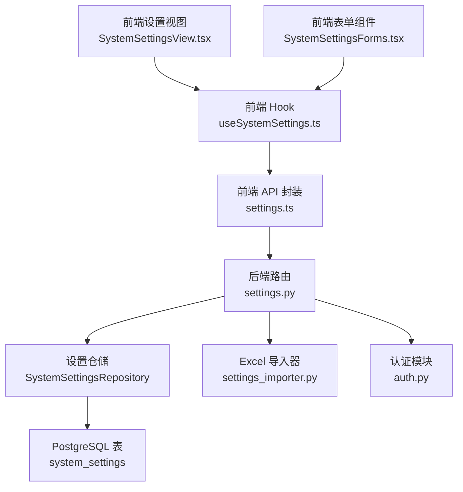
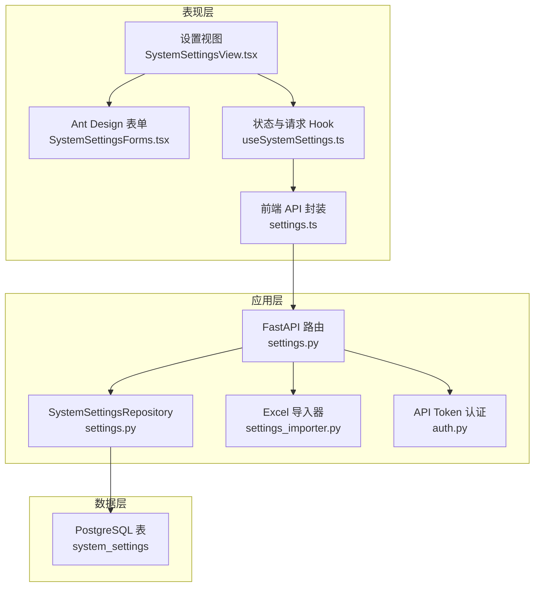
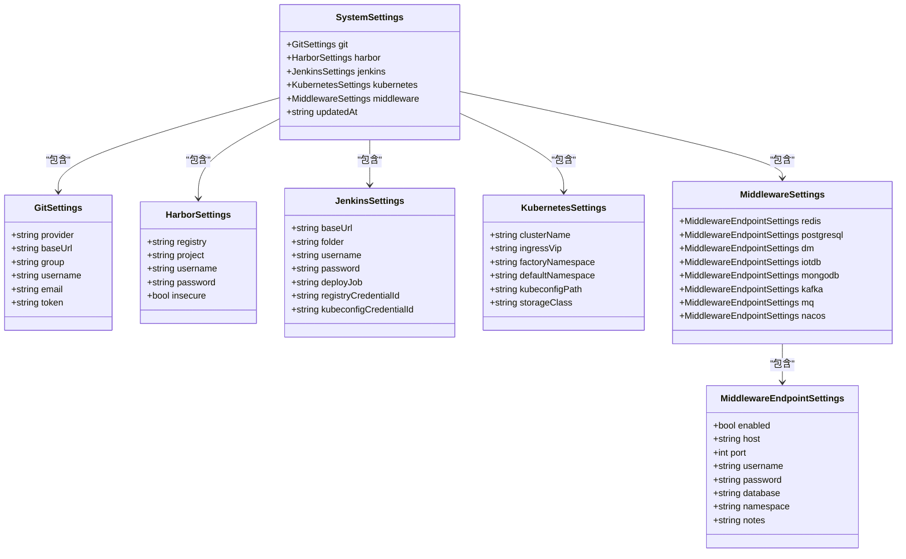
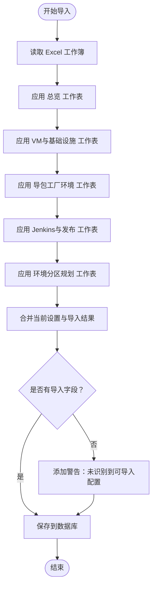
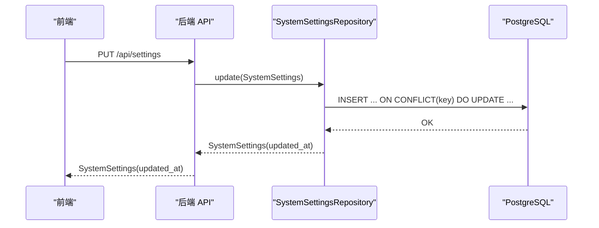
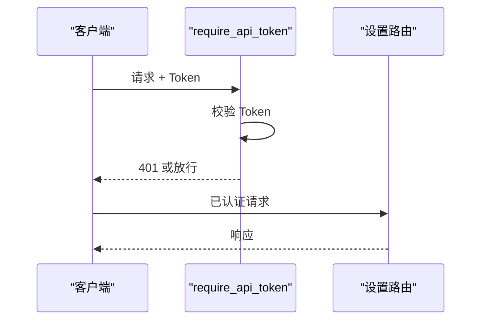
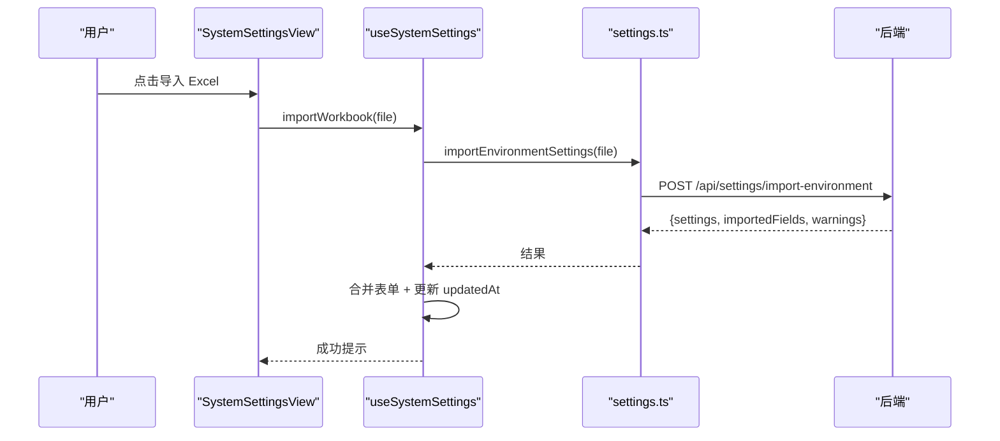
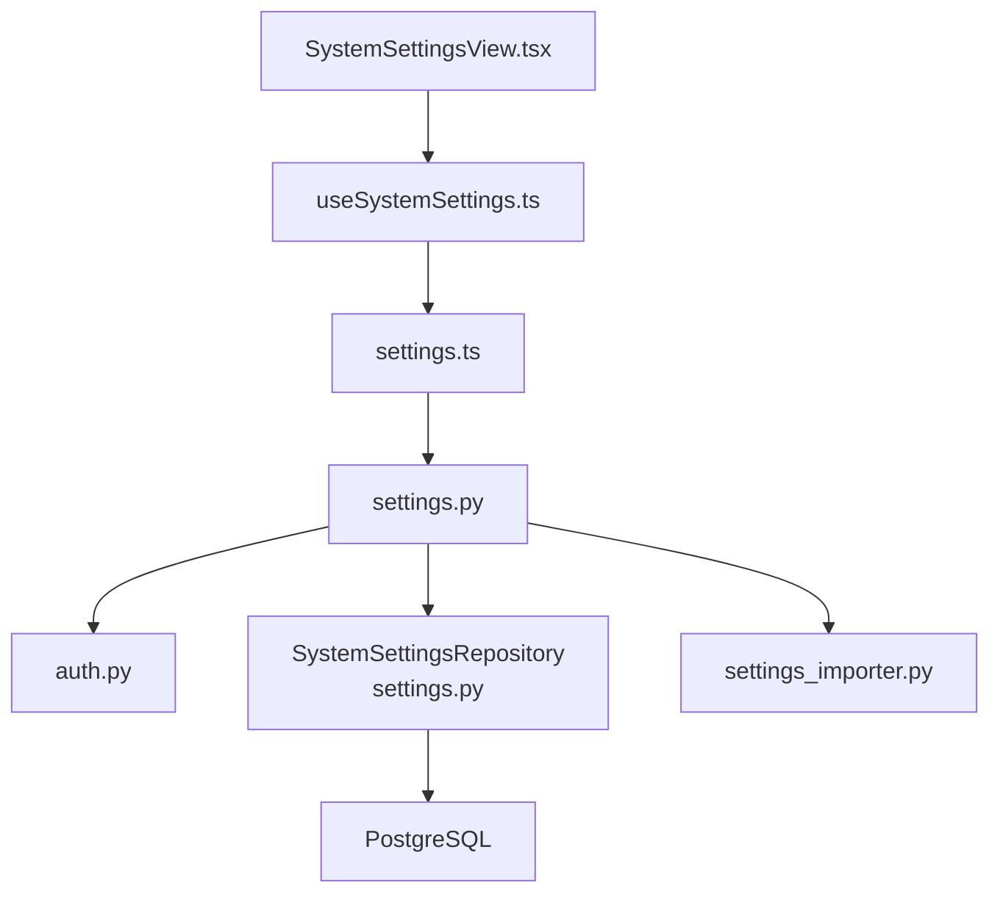

# 系统设置管理

<cite>
**本文引用的文件**
- [后端 API 设置路由 settings.py](file://backend/deployment_package_factory/api/settings.py)
- [系统设置数据模型 settings.py](file://backend/deployment_package_factory/services/settings.py)
- [Excel 导入器 settings_importer.py](file://backend/deployment_package_factory/services/settings_importer.py)
- [认证模块 auth.py](file://backend/deployment_package_factory/auth.py)
- [设置加载模块 settings.py](file://backend/deployment_package_factory/settings.py)
- [前端设置视图 SystemSettingsView.tsx](file://frontend/src/views/SystemSettingsView.tsx)
- [前端设置表单 SystemSettingsForms.tsx](file://frontend/src/views/components/SystemSettingsForms.tsx)
- [前端设置 API settings.ts](file://frontend/src/api/settings.ts)
- [前端设置 Hook useSystemSettings.ts](file://frontend/src/views/hooks/useSystemSettings.ts)
- [设置相关测试 test_settings.py](file://backend/tests/test_settings.py)
- [Git 提供商客户端 git_providers.py](file://backend/deployment_package_factory/services/microservices/git_providers.py)
</cite>

## 目录
1. [简介](#简介)
2. [项目结构](#项目结构)
3. [核心组件](#核心组件)
4. [架构概览](#架构概览)
5. [详细组件分析](#详细组件分析)
6. [依赖关系分析](#依赖关系分析)
7. [性能考虑](#性能考虑)
8. [故障排除指南](#故障排除指南)
9. [结论](#结论)
10. [附录](#附录)

## 简介
本文件为系统设置管理功能的技术文档，涵盖系统配置的数据模型设计（Git 仓库配置、Harbor 镜像仓库配置、Jenkins 流水线配置、Kubernetes 集群配置、中间件连接信息）、Excel 导入功能的实现机制、配置验证规则与数据转换逻辑、持久化存储与版本管理、安全控制、导入导出工作流程、错误处理策略与数据完整性保证，并提供配置示例、最佳实践指南与常见问题解决方案。

## 项目结构
系统设置管理由前后端协同实现：
- 后端提供 FastAPI 接口，负责系统设置的读取、更新与 Excel 导入。
- 前端提供可视化界面，支持表单编辑、Excel 导入与实时状态反馈。
- 认证模块通过 API Token 控制访问权限。
- 数据模型基于 Pydantic，确保字段校验与序列化一致性。
- 持久化采用 PostgreSQL 表 system_settings 存储 JSON 化的配置与更新时间戳。

**图表来源**
- [后端 API 设置路由 settings.py:1-69](file://backend/deployment_package_factory/api/settings.py#L1-L69)
- [系统设置数据模型 settings.py:1-222](file://backend/deployment_package_factory/services/settings.py#L1-L222)
- [Excel 导入器 settings_importer.py:1-193](file://backend/deployment_package_factory/services/settings_importer.py#L1-L193)
- [认证模块 auth.py:1-41](file://backend/deployment_package_factory/auth.py#L1-L41)
- [前端设置视图 SystemSettingsView.tsx:1-61](file://frontend/src/views/SystemSettingsView.tsx#L1-L61)
- [前端设置表单 SystemSettingsForms.tsx:1-102](file://frontend/src/views/components/SystemSettingsForms.tsx#L1-L102)
- [前端设置 API settings.ts:1-78](file://frontend/src/api/settings.ts#L1-L78)
- [前端设置 Hook useSystemSettings.ts:1-103](file://frontend/src/views/hooks/useSystemSettings.ts#L1-L103)

**章节来源**
- [后端 API 设置路由 settings.py:1-69](file://backend/deployment_package_factory/api/settings.py#L1-L69)
- [系统设置数据模型 settings.py:1-222](file://backend/deployment_package_factory/services/settings.py#L1-L222)
- [Excel 导入器 settings_importer.py:1-193](file://backend/deployment_package_factory/services/settings_importer.py#L1-L193)
- [认证模块 auth.py:1-41](file://backend/deployment_package_factory/auth.py#L1-L41)
- [前端设置视图 SystemSettingsView.tsx:1-61](file://frontend/src/views/SystemSettingsView.tsx#L1-L61)
- [前端设置表单 SystemSettingsForms.tsx:1-102](file://frontend/src/views/components/SystemSettingsForms.tsx#L1-L102)
- [前端设置 API settings.ts:1-78](file://frontend/src/api/settings.ts#L1-L78)
- [前端设置 Hook useSystemSettings.ts:1-103](file://frontend/src/views/hooks/useSystemSettings.ts#L1-L103)

## 核心组件
- 系统设置数据模型：定义 Git、Harbor、Jenkins、Kubernetes、中间件等配置的结构与校验规则。
- 设置仓储：封装 PostgreSQL 的读取与更新操作，支持 upsert 与 schema 初始化。
- Excel 导入器：解析 Excel 工作簿，按工作表映射到对应配置字段，生成导入结果。
- 认证模块：要求 API Token 才能访问设置相关接口。
- 前端界面：提供表单编辑、Excel 导入、保存与刷新功能。

**章节来源**
- [系统设置数据模型 settings.py:14-167](file://backend/deployment_package_factory/services/settings.py#L14-L167)
- [系统设置数据模型 settings.py:169-221](file://backend/deployment_package_factory/services/settings.py#L169-L221)
- [Excel 导入器 settings_importer.py:21-35](file://backend/deployment_package_factory/services/settings_importer.py#L21-L35)
- [认证模块 auth.py:10-27](file://backend/deployment_package_factory/auth.py#L10-L27)
- [前端设置视图 SystemSettingsView.tsx:10-60](file://frontend/src/views/SystemSettingsView.tsx#L10-L60)

## 架构概览
系统设置管理采用三层架构：
- 表现层：前端 React 组件与 Ant Design 表单。
- 应用层：FastAPI 路由与业务逻辑，调用仓储与导入器。
- 数据层：PostgreSQL 表 system_settings 存储 JSON 配置与更新时间。

**图表来源**
- [后端 API 设置路由 settings.py:1-69](file://backend/deployment_package_factory/api/settings.py#L1-L69)
- [系统设置数据模型 settings.py:169-221](file://backend/deployment_package_factory/services/settings.py#L169-L221)
- [Excel 导入器 settings_importer.py:21-35](file://backend/deployment_package_factory/services/settings_importer.py#L21-L35)
- [认证模块 auth.py:10-27](file://backend/deployment_package_factory/auth.py#L10-L27)
- [前端设置视图 SystemSettingsView.tsx:1-61](file://frontend/src/views/SystemSettingsView.tsx#L1-L61)
- [前端设置表单 SystemSettingsForms.tsx:1-102](file://frontend/src/views/components/SystemSettingsForms.tsx#L1-L102)
- [前端设置 API settings.ts:1-78](file://frontend/src/api/settings.ts#L1-L78)
- [前端设置 Hook useSystemSettings.ts:1-103](file://frontend/src/views/hooks/useSystemSettings.ts#L1-L103)

## 详细组件分析

### 数据模型设计
系统设置由多个子模型组成，每个子模型包含字段校验与规范化逻辑：
- GitSettings：支持 gitlab/github，校验 provider、group 路径格式，清理空白字符。
- HarborSettings：校验 registry 主机名与项目路径，清理空白字符。
- JenkinsSettings：校验 folder 路径格式，清理空白字符。
- KubernetesSettings：提供集群名称、Ingress VIP、命名空间、kubeconfig 路径等字段。
- MiddlewareSettings：定义多种中间件连接信息，每种中间件有独立 EndpointSettings。
- SystemSettings：聚合各子模型与 updatedAt 时间戳。

**图表来源**
- [系统设置数据模型 settings.py:14-167](file://backend/deployment_package_factory/services/settings.py#L14-L167)

**章节来源**
- [系统设置数据模型 settings.py:14-167](file://backend/deployment_package_factory/services/settings.py#L14-L167)

### Excel 导入机制
Excel 导入器解析 .xlsx 文件，按工作表映射到配置字段：
- 总览：提取 Ingress VIP、默认命名空间、镜像仓库主机。
- VM与基础设施：识别 Harbor/Jenkins 并填充相应字段。
- 导包工厂环境：设置工厂命名空间、默认代码分支等。
- Jenkins与发布：识别凭据 ID、部署 Job、REGISTRY 参数。
- 环境分区规划：根据环境名称与服务类型启用中间件（如 Nacos）。

**图表来源**
- [Excel 导入器 settings_importer.py:21-35](file://backend/deployment_package_factory/services/settings_importer.py#L21-L35)
- [Excel 导入器 settings_importer.py:38-106](file://backend/deployment_package_factory/services/settings_importer.py#L38-L106)
- [Excel 导入器 settings_importer.py:133-193](file://backend/deployment_package_factory/services/settings_importer.py#L133-L193)

**章节来源**
- [Excel 导入器 settings_importer.py:21-35](file://backend/deployment_package_factory/services/settings_importer.py#L21-L35)
- [Excel 导入器 settings_importer.py:38-106](file://backend/deployment_package_factory/services/settings_importer.py#L38-L106)
- [Excel 导入器 settings_importer.py:133-193](file://backend/deployment_package_factory/services/settings_importer.py#L133-L193)

### 持久化存储与版本管理
- 存储表：system_settings（key、payload_json、updated_at）。
- 读取：查询 key='global' 返回 JSON，反序列化为 SystemSettings。
- 更新：insert on conflict do update，确保原子性；更新 updated_at。
- 版本：每次更新都会写入新的 updated_at，用于前端显示“已更新时间”。

**图表来源**
- [后端 API 设置路由 settings.py:47-49](file://backend/deployment_package_factory/api/settings.py#L47-L49)
- [系统设置数据模型 settings.py:183-198](file://backend/deployment_package_factory/services/settings.py#L183-L198)

**章节来源**
- [系统设置数据模型 settings.py:169-221](file://backend/deployment_package_factory/services/settings.py#L169-L221)

### 安全控制
- API Token：所有设置相关接口均需通过 require_api_token 认证。
- 支持三种方式提供 Token：Authorization Bearer、X-Deployment-Package-Token 头、deployment_package_token 查询参数（特定下载接口例外）。
- 使用 secrets.compare_digest 进行常量时间比较，防止时序攻击。

**图表来源**
- [认证模块 auth.py:10-27](file://backend/deployment_package_factory/auth.py#L10-L27)

**章节来源**
- [认证模块 auth.py:10-27](file://backend/deployment_package_factory/auth.py#L10-L27)

### 前端交互与表单验证
- 表单组件：按分类渲染 Git、Harbor、Jenkins、Kubernetes、中间件表单。
- 规则：路径类字段使用正则限制仅小写路径片段；Registry 主机名不允许空格或斜杠；端口范围 1-65535。
- 行为：导入 Excel 后自动合并到当前表单；保存成功后更新 updatedAt 显示。

**图表来源**
- [前端设置视图 SystemSettingsView.tsx:15-25](file://frontend/src/views/SystemSettingsView.tsx#L15-L25)
- [前端设置 Hook useSystemSettings.ts:48-63](file://frontend/src/views/hooks/useSystemSettings.ts#L48-L63)
- [前端设置 API settings.ts:68-77](file://frontend/src/api/settings.ts#L68-L77)
- [后端 API 设置路由 settings.py:52-68](file://backend/deployment_package_factory/api/settings.py#L52-L68)

**章节来源**
- [前端设置表单 SystemSettingsForms.tsx:6-8](file://frontend/src/views/components/SystemSettingsForms.tsx#L6-L8)
- [前端设置表单 SystemSettingsForms.tsx:18-101](file://frontend/src/views/components/SystemSettingsForms.tsx#L18-L101)
- [前端设置视图 SystemSettingsView.tsx:10-60](file://frontend/src/views/SystemSettingsView.tsx#L10-L60)
- [前端设置 Hook useSystemSettings.ts:1-103](file://frontend/src/views/hooks/useSystemSettings.ts#L1-L103)
- [前端设置 API settings.ts:1-78](file://frontend/src/api/settings.ts#L1-L78)

## 依赖关系分析
- 后端路由依赖认证模块与设置仓储。
- 设置仓储依赖 PostgreSQL 连接与表结构初始化。
- Excel 导入器依赖 openxml 解析与正则匹配。
- 前端依赖后端 API，使用 Ant Design 表单组件与状态管理 Hook。

**图表来源**
- [后端 API 设置路由 settings.py:1-69](file://backend/deployment_package_factory/api/settings.py#L1-L69)
- [系统设置数据模型 settings.py:169-221](file://backend/deployment_package_factory/services/settings.py#L169-L221)
- [Excel 导入器 settings_importer.py:1-193](file://backend/deployment_package_factory/services/settings_importer.py#L1-L193)
- [认证模块 auth.py:1-41](file://backend/deployment_package_factory/auth.py#L1-L41)
- [前端设置视图 SystemSettingsView.tsx:1-61](file://frontend/src/views/SystemSettingsView.tsx#L1-L61)
- [前端设置 Hook useSystemSettings.ts:1-103](file://frontend/src/views/hooks/useSystemSettings.ts#L1-L103)
- [前端设置 API settings.ts:1-78](file://frontend/src/api/settings.ts#L1-L78)

**章节来源**
- [后端 API 设置路由 settings.py:1-69](file://backend/deployment_package_factory/api/settings.py#L1-L69)
- [系统设置数据模型 settings.py:169-221](file://backend/deployment_package_factory/services/settings.py#L169-L221)
- [Excel 导入器 settings_importer.py:1-193](file://backend/deployment_package_factory/services/settings_importer.py#L1-L193)
- [认证模块 auth.py:1-41](file://backend/deployment_package_factory/auth.py#L1-L41)
- [前端设置视图 SystemSettingsView.tsx:1-61](file://frontend/src/views/SystemSettingsView.tsx#L1-L61)
- [前端设置 Hook useSystemSettings.ts:1-103](file://frontend/src/views/hooks/useSystemSettings.ts#L1-L103)
- [前端设置 API settings.ts:1-78](file://frontend/src/api/settings.ts#L1-L78)

## 性能考虑
- Excel 解析：使用 zip 解压与 ElementTree 解析，避免加载整张表到内存；仅读取必要工作表。
- 数据库：单表单字段 upsert，使用 JSON 文本存储，减少复杂 JOIN；schema 初始化在构造函数中完成。
- 前端：导入后合并策略避免全量重绘；保存与导入使用异步请求，避免阻塞 UI。
- 认证：常量时间比较降低时序分析风险。

## 故障排除指南
- 导入 Excel 无字段被识别：检查工作表名称与列标题是否符合预期；确认 IP/URL 是否可提取。
- 字段校验失败：检查路径字段是否仅包含小写路径片段；Registry 是否包含非法字符；端口是否在 1-65535。
- 保存失败：确认 API Token 正确且有效；检查后端数据库连接字符串。
- 导入后未更新：确认导入返回的 importedFields 是否为空；检查前端合并逻辑。

**章节来源**
- [Excel 导入器 settings_importer.py:33-35](file://backend/deployment_package_factory/services/settings_importer.py#L33-L35)
- [前端设置表单 SystemSettingsForms.tsx:6-8](file://frontend/src/views/components/SystemSettingsForms.tsx#L6-L8)
- [前端设置表单 SystemSettingsForms.tsx:90-99](file://frontend/src/views/components/SystemSettingsForms.tsx#L90-L99)
- [认证模块 auth.py:20-27](file://backend/deployment_package_factory/auth.py#L20-L27)

## 结论
系统设置管理通过清晰的数据模型、严格的字段校验、可靠的 Excel 导入与安全的 API 认证，实现了对 Git、Harbor、Jenkins、Kubernetes 与中间件配置的集中管理。持久化采用 PostgreSQL 单表 JSON 存储，结合 updated_at 实现版本追踪。前端提供直观的表单与导入体验，配合完善的错误处理与安全控制，满足生产环境的稳定性与安全性需求。

## 附录

### API 接口文档
- 获取系统设置
  - 方法：GET
  - 路径：/api/settings
  - 认证：需要 API Token
  - 响应：SystemSettings
- 更新系统设置
  - 方法：PUT
  - 路径：/api/settings
  - 认证：需要 API Token
  - 请求体：SystemSettings
  - 响应：SystemSettings（含 updated_at）
- 导入环境 Excel
  - 方法：POST
  - 路径：/api/settings/import-environment
  - 认证：需要 API Token
  - 内容类型：application/vnd.openxmlformats-officedocument.spreadsheetml.sheet
  - 响应：EnvironmentSettingsImportResult（settings、importedFields、warnings）

**章节来源**
- [后端 API 设置路由 settings.py:42-68](file://backend/deployment_package_factory/api/settings.py#L42-L68)
- [前端设置 API settings.ts:57-77](file://frontend/src/api/settings.ts#L57-L77)

### 配置示例与最佳实践
- Git 配置
  - provider：gitlab 或 github
  - group：小写路径片段，如 business/eam
  - 建议：使用专用机器人账号与只读 Token
- Harbor 配置
  - registry：主机名或主机:端口，不含斜杠与空格
  - project：小写路径片段
  - 建议：开启 insecure 仅限开发环境；生产使用 HTTPS
- Jenkins 配置
  - base_url：HTTP(S) 地址
  - folder：小写路径片段
  - 建议：使用凭据 ID 管理镜像与 kubeconfig
- Kubernetes 配置
  - factoryNamespace：导包工厂命名空间
  - defaultNamespace：默认部署命名空间
  - 建议：确保 kubeconfig 可访问集群
- 中间件配置
  - 每种中间件独立启用/禁用，按需填写 host/port/账号/库名
  - 建议：优先使用内网域名与最小权限账号

### 常见问题解答
- 如何验证配置正确性？
  - 使用前端表单的实时校验；保存后查看 updatedAt。
- Excel 导入不生效？
  - 确认工作表名称与列标题；检查 IP/URL 提取逻辑。
- 如何切换 Git 提供商？
  - 更新 provider 与 base_url，系统会根据 base_url 自动推断提供商。
- 如何备份/迁移设置？
  - 通过 GET /api/settings 获取 JSON，存档于安全位置；恢复时 PUT /api/settings 恢复。