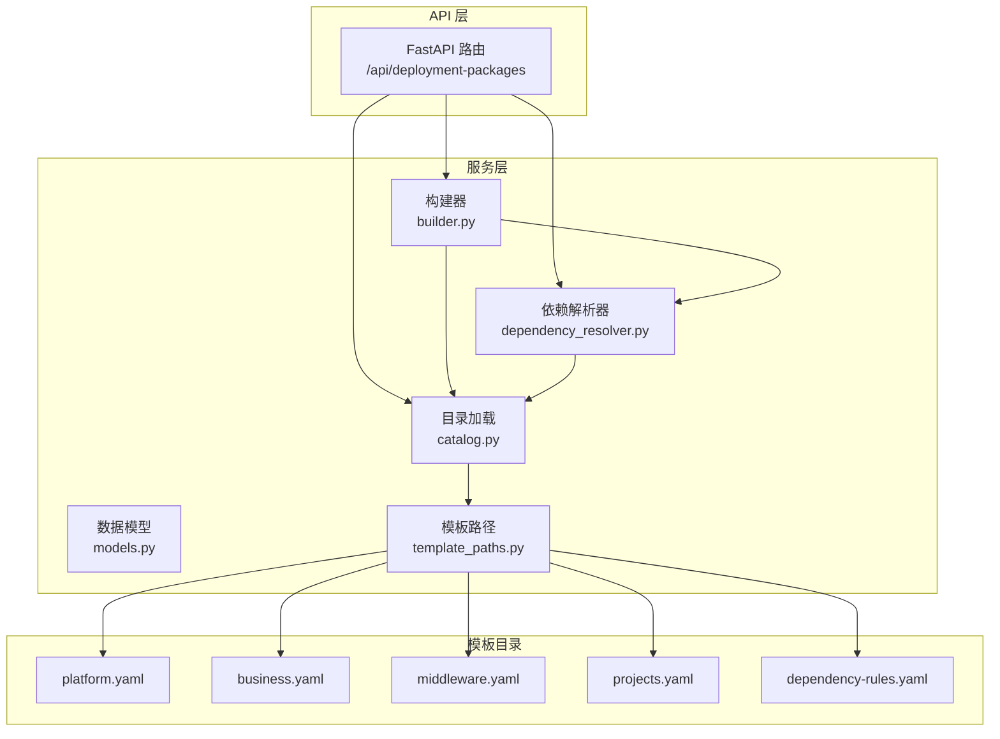
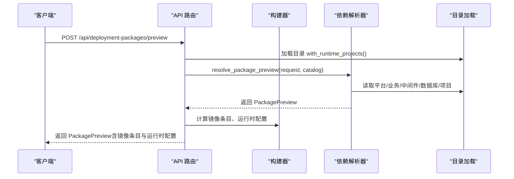
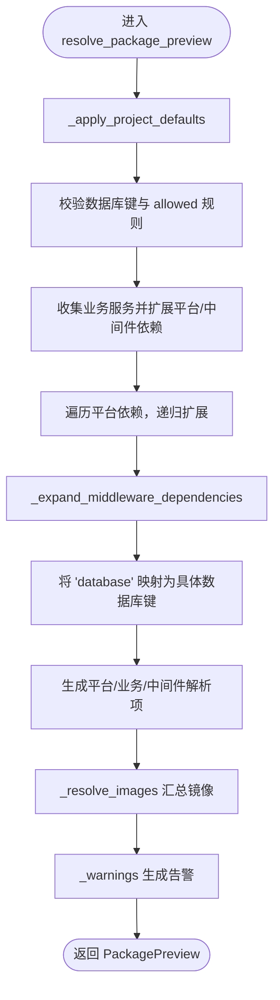
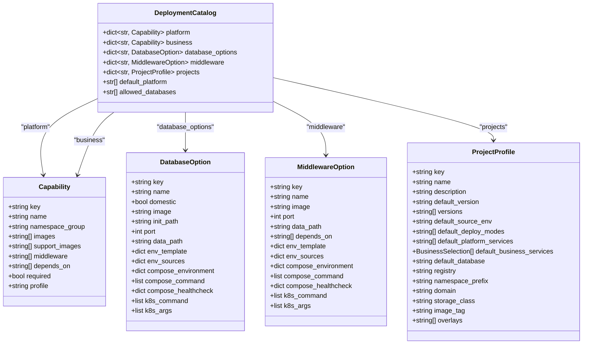
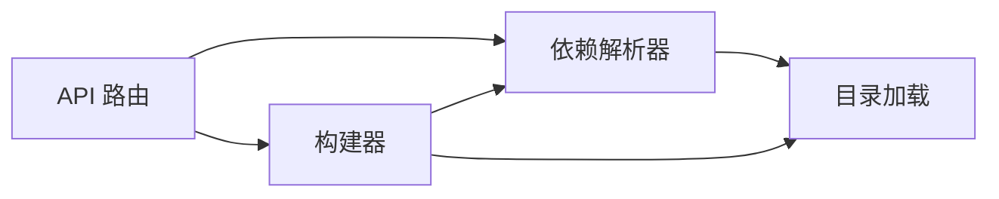

# 依赖解析机制

<cite>
**本文引用的文件**
- [dependency_resolver.py](file://backend/deployment_package_factory/services/deployment_packages/dependency_resolver.py)
- [catalog.py](file://backend/deployment_package_factory/services/deployment_packages/catalog.py)
- [models.py](file://backend/deployment_package_factory/services/deployment_packages/models.py)
- [builder.py](file://backend/deployment_package_factory/services/deployment_packages/builder.py)
- [template_paths.py](file://backend/deployment_package_factory/services/deployment_packages/template_paths.py)
- [deployment_packages.py](file://backend/deployment_package_factory/api/deployment_packages.py)
- [test_deployment_package_dependency_resolver.py](file://backend/tests/test_deployment_package_dependency_resolver.py)
- [platform.yaml](file://templates/catalog/platform.yaml)
- [business.yaml](file://templates/catalog/business.yaml)
- [middleware.yaml](file://templates/catalog/middleware.yaml)
- [projects.yaml](file://templates/catalog/projects.yaml)
- [dependency-rules.yaml](file://templates/catalog/dependency-rules.yaml)
</cite>

## 目录
1. [简介](#简介)
2. [项目结构](#项目结构)
3. [核心组件](#核心组件)
4. [架构总览](#架构总览)
5. [详细组件分析](#详细组件分析)
6. [依赖关系分析](#依赖关系分析)
7. [性能考虑](#性能考虑)
8. [故障排查指南](#故障排查指南)
9. [结论](#结论)
10. [附录](#附录)

## 简介
本文件系统性阐述部署包依赖解析机制，重点围绕 PackageBuildRequest 到 PackageBuildPreview（通过 PackagePreviewRequest）的转换过程、项目目录加载机制、依赖规则应用以及 resolve_package_preview 函数的实现逻辑。文档还解释 Catalog 类的作用与项目配置结构，说明依赖解析中的优先级规则与冲突解决策略，并给出配置选项、性能优化建议与常见问题排查方法。最后提供使用依赖解析 API 的示例路径，帮助读者快速上手。

## 项目结构
依赖解析相关的核心代码位于后端服务模块中，采用“模型-目录加载-解析器-构建器”的分层设计：
- 模型层：定义 Catalog、请求/预览对象、依赖项等数据结构
- 目录加载层：从模板目录读取并校验平台、业务、中间件、项目与规则
- 解析器层：根据请求与目录规则计算最终依赖集合
- 构建器层：在解析基础上生成部署清单与产物
- API 层：对外暴露预览与构建接口，串联目录加载、解析与构建

图表来源
- [deployment_packages.py:126-165](file://backend/deployment_package_factory/api/deployment_packages.py#L126-L165)
- [builder.py:146-170](file://backend/deployment_package_factory/services/deployment_packages/builder.py#L146-L170)
- [dependency_resolver.py:14-94](file://backend/deployment_package_factory/services/deployment_packages/dependency_resolver.py#L14-L94)
- [catalog.py:44-79](file://backend/deployment_package_factory/services/deployment_packages/catalog.py#L44-L79)
- [template_paths.py:24-25](file://backend/deployment_package_factory/services/deployment_packages/template_paths.py#L24-L25)
- [platform.yaml:1-66](file://templates/catalog/platform.yaml#L1-L66)
- [business.yaml:1-60](file://templates/catalog/business.yaml#L1-L60)
- [middleware.yaml:1-283](file://templates/catalog/middleware.yaml#L1-L283)
- [projects.yaml:1-54](file://templates/catalog/projects.yaml#L1-L54)
- [dependency-rules.yaml:1-9](file://templates/catalog/dependency-rules.yaml#L1-L9)

章节来源
- [deployment_packages.py:126-165](file://backend/deployment_package_factory/api/deployment_packages.py#L126-L165)
- [builder.py:146-170](file://backend/deployment_package_factory/services/deployment_packages/builder.py#L146-L170)
- [dependency_resolver.py:14-94](file://backend/deployment_package_factory/services/deployment_packages/dependency_resolver.py#L14-L94)
- [catalog.py:44-79](file://backend/deployment_package_factory/services/deployment_packages/catalog.py#L44-L79)
- [template_paths.py:24-25](file://backend/deployment_package_factory/services/deployment_packages/template_paths.py#L24-L25)

## 核心组件
- 数据模型
  - DeploymentCatalog：聚合平台、业务、中间件、数据库选项、项目与默认值
  - PackagePreviewRequest/PackageBuildRequest：输入请求模型，前者用于预览，后者用于构建
  - ResolvedDependency：解析后的依赖项，包含锁定状态、依赖来源与原因
  - PackagePreview：解析结果，包含平台、业务、中间件、数据库、镜像与警告
- 目录加载
  - load_catalog：从模板目录读取并校验 platform/business/middleware/database/projects，生成 DeploymentCatalog
  - _validate_catalog：确保键不重复、依赖引用合法、项目默认值有效
- 依赖解析
  - resolve_package_preview：主解析函数，应用项目默认、校验数据库、扩展平台与中间件依赖、生成解析结果
  - _expand_middleware_dependencies：递归扩展中间件依赖
  - _apply_project_defaults：基于项目配置填充请求字段
  - _resolved_platform/_resolved_middleware/_reason/_resolve_images/_warnings：辅助函数，负责依赖项标注、镜像汇总与告警
- 构建器
  - build_deployment_package：在解析基础上生成部署包产物，串联渲染与打包流程
- API
  - /preview：返回 PackagePreview；/options：返回可选项（平台、业务、数据库、中间件、项目）

章节来源
- [models.py:55-202](file://backend/deployment_package_factory/services/deployment_packages/models.py#L55-L202)
- [catalog.py:44-79](file://backend/deployment_package_factory/services/deployment_packages/catalog.py#L44-L79)
- [dependency_resolver.py:14-94](file://backend/deployment_package_factory/services/deployment_packages/dependency_resolver.py#L14-L94)
- [builder.py:146-170](file://backend/deployment_package_factory/services/deployment_packages/builder.py#L146-L170)
- [deployment_packages.py:110-165](file://backend/deployment_package_factory/api/deployment_packages.py#L110-L165)

## 架构总览
下图展示了从请求到解析再到构建的整体流程，以及各模块间的调用关系。

图表来源
- [deployment_packages.py:126-165](file://backend/deployment_package_factory/api/deployment_packages.py#L126-L165)
- [builder.py:146-170](file://backend/deployment_package_factory/services/deployment_packages/builder.py#L146-L170)
- [dependency_resolver.py:14-94](file://backend/deployment_package_factory/services/deployment_packages/dependency_resolver.py#L14-L94)
- [catalog.py:44-79](file://backend/deployment_package_factory/services/deployment_packages/catalog.py#L44-L79)

## 详细组件分析

### 依赖解析算法与 resolve_package_preview 实现
resolve_package_preview 是依赖解析的核心，其职责包括：
- 应用项目默认值（_apply_project_defaults）
- 校验数据库选项与规则（allowed_databases）
- 收集业务服务依赖，扩展平台与中间件依赖
- 递归扩展中间件依赖（_expand_middleware_dependencies）
- 将数据库键映射为具体中间件键
- 生成平台、业务、中间件解析项与镜像列表
- 生成告警信息

图表来源
- [dependency_resolver.py:14-94](file://backend/deployment_package_factory/services/deployment_packages/dependency_resolver.py#L14-L94)
- [dependency_resolver.py:97-115](file://backend/deployment_package_factory/services/deployment_packages/dependency_resolver.py#L97-L115)
- [dependency_resolver.py:180-201](file://backend/deployment_package_factory/services/deployment_packages/dependency_resolver.py#L180-L201)
- [dependency_resolver.py:203-216](file://backend/deployment_package_factory/services/deployment_packages/dependency_resolver.py#L203-L216)

章节来源
- [dependency_resolver.py:14-94](file://backend/deployment_package_factory/services/deployment_packages/dependency_resolver.py#L14-L94)
- [dependency_resolver.py:97-115](file://backend/deployment_package_factory/services/deployment_packages/dependency_resolver.py#L97-L115)
- [dependency_resolver.py:180-201](file://backend/deployment_package_factory/services/deployment_packages/dependency_resolver.py#L180-L201)
- [dependency_resolver.py:203-216](file://backend/deployment_package_factory/services/deployment_packages/dependency_resolver.py#L203-L216)

### Catalog 类与项目配置结构
Catalog 负责从模板目录加载并校验配置，形成 DeploymentCatalog：
- 平台能力（platform.yaml）：包含依赖、中间件、镜像、命名空间组等
- 业务能力（business.yaml）：包含依赖、中间件、镜像、命名空间组等
- 中间件（middleware.yaml）：包含数据库选项与通用中间件，支持 depends_on
- 项目（projects.yaml）：定义默认平台/业务/数据库、版本、注册表、命名空间前缀等
- 规则（dependency-rules.yaml）：默认平台与允许数据库

图表来源
- [models.py:55-89](file://backend/deployment_package_factory/services/deployment_packages/models.py#L55-L89)
- [models.py:7-18](file://backend/deployment_package_factory/services/deployment_packages/models.py#L7-L18)
- [models.py:20-36](file://backend/deployment_package_factory/services/deployment_packages/models.py#L20-L36)
- [models.py:38-53](file://backend/deployment_package_factory/services/deployment_packages/models.py#L38-L53)
- [models.py:71-89](file://backend/deployment_package_factory/services/deployment_packages/models.py#L71-L89)

章节来源
- [catalog.py:44-79](file://backend/deployment_package_factory/services/deployment_packages/catalog.py#L44-L79)
- [models.py:55-89](file://backend/deployment_package_factory/services/deployment_packages/models.py#L55-L89)

### 项目目录加载机制与模板路径
- 模板根目录可通过环境变量或默认候选路径确定，默认来自模板目录下的 catalog 子目录
- 目录加载按顺序读取 platform/business/middleware/database/projects 与 dependency-rules 文件
- 校验阶段确保：
  - 平台与业务键不重叠
  - 所有 depends_on 引用均存在于已定义集合
  - 项目默认值引用合法

章节来源
- [template_paths.py:24-25](file://backend/deployment_package_factory/services/deployment_packages/template_paths.py#L24-L25)
- [catalog.py:44-79](file://backend/deployment_package_factory/services/deployment_packages/catalog.py#L44-L79)
- [catalog.py:82-121](file://backend/deployment_package_factory/services/deployment_packages/catalog.py#L82-L121)

### 依赖规则应用与优先级
- 默认平台：来自 dependency-rules.yaml 的 defaults.platform
- 数据库规则：allowed_databases 限制可用数据库
- 业务服务依赖：业务 capability 的 depends_on 决定所需平台
- 平台依赖：平台 capability 的 depends_on 递归扩展
- 中间件依赖：业务/平台 capability 的 middleware 与中间件 depends_on 递归扩展
- 锁定与来源：平台项若被业务或平台依赖则标记为锁定；中间件项固定为锁定

章节来源
- [dependency-rules.yaml:1-9](file://templates/catalog/dependency-rules.yaml#L1-L9)
- [dependency_resolver.py:27-58](file://backend/deployment_package_factory/services/deployment_packages/dependency_resolver.py#L27-L58)
- [dependency_resolver.py:97-115](file://backend/deployment_package_factory/services/deployment_packages/dependency_resolver.py#L97-L115)
- [dependency_resolver.py:137-171](file://backend/deployment_package_factory/services/deployment_packages/dependency_resolver.py#L137-L171)

### 解析结果与镜像汇总
- 解析结果包含三类依赖项：平台、业务、中间件
- 镜像汇总分为 platform/business/middleware/support 四组，去重排序
- 告警包括：未选择核心业务服务、国产化数据库提示

章节来源
- [dependency_resolver.py:67-94](file://backend/deployment_package_factory/services/deployment_packages/dependency_resolver.py#L67-L94)
- [dependency_resolver.py:180-201](file://backend/deployment_package_factory/services/deployment_packages/dependency_resolver.py#L180-L201)
- [dependency_resolver.py:203-216](file://backend/deployment_package_factory/services/deployment_packages/dependency_resolver.py#L203-L216)

### API 使用与解析流程
- 预览接口：POST /api/deployment-packages/preview
  - 输入：PackagePreviewRequest
  - 输出：PackagePreview（含镜像条目与运行时配置）
- 构建接口：POST /api/deployment-packages
  - 输入：PackageBuildRequest
  - 输出：PackageTask（异步任务）
- 可选项接口：GET /api/deployment-packages/options
  - 输出：sourceEnvs、deployModes、platformServices、businessServices、databaseOptions、middleware、microservices、projects

章节来源
- [deployment_packages.py:110-165](file://backend/deployment_package_factory/api/deployment_packages.py#L110-L165)
- [deployment_packages.py:245-283](file://backend/deployment_package_factory/api/deployment_packages.py#L245-L283)

## 依赖关系分析
- 组件耦合
  - API 依赖 Catalog、Resolver、Builder
  - Resolver 依赖 Catalog 与模型
  - Builder 依赖 Resolver、Catalog 与渲染模块
- 外部依赖
  - 模板目录（YAML）作为配置源
  - Kubernetes 运行时（在构建器中用于发现运行时镜像与注入运行时配置）
- 循环依赖
  - 无直接循环；解析器仅读取目录，构建器在解析后进行渲染与打包

图表来源
- [deployment_packages.py:126-165](file://backend/deployment_package_factory/api/deployment_packages.py#L126-L165)
- [builder.py:146-170](file://backend/deployment_package_factory/services/deployment_packages/builder.py#L146-L170)
- [dependency_resolver.py:14-94](file://backend/deployment_package_factory/services/deployment_packages/dependency_resolver.py#L14-L94)
- [catalog.py:44-79](file://backend/deployment_package_factory/services/deployment_packages/catalog.py#L44-L79)

章节来源
- [deployment_packages.py:126-165](file://backend/deployment_package_factory/api/deployment_packages.py#L126-L165)
- [builder.py:146-170](file://backend/deployment_package_factory/services/deployment_packages/builder.py#L146-L170)
- [dependency_resolver.py:14-94](file://backend/deployment_package_factory/services/deployment_packages/dependency_resolver.py#L14-L94)
- [catalog.py:44-79](file://backend/deployment_package_factory/services/deployment_packages/catalog.py#L44-L79)

## 性能考虑
- 依赖扩展采用迭代收敛（while changed），复杂度与依赖深度成正比，建议控制业务/平台依赖层级
- 镜像汇总使用集合去重，注意避免大量重复镜像导致内存占用
- 目录加载一次性完成，后续解析复用 Catalog 对象，减少 IO
- 在 API 层对解析结果进行缓存（如需）可降低重复计算成本
- 构建阶段镜像导出依赖外部工具（skopeo/docker），建议在 Worker 环境提前准备

## 故障排查指南
- 常见错误类型
  - CatalogError：目录校验失败（未知键、重复键、依赖引用非法、项目默认值无效）
  - PackageBuildError：构建请求参数不合法（项目/版本不存在、镜像引用为空）
- 排查步骤
  - 确认模板目录结构与文件完整性
  - 检查业务/平台/中间件的 depends_on 是否指向已定义键
  - 校验 projects 的默认值是否在目录中存在
  - 若出现数据库相关错误，检查 allowed_databases 与请求 database 键
- 测试用例参考
  - 项目默认值驱动选择、未知数据库拒绝、规则不允许的数据库拒绝、无业务服务告警、未知项目拒绝等

章节来源
- [catalog.py:82-121](file://backend/deployment_package_factory/services/deployment_packages/catalog.py#L82-L121)
- [dependency_resolver.py:17-25](file://backend/deployment_package_factory/services/deployment_packages/dependency_resolver.py#L17-L25)
- [test_deployment_package_dependency_resolver.py:84-110](file://backend/tests/test_deployment_package_dependency_resolver.py#L84-L110)

## 结论
该依赖解析机制通过清晰的目录加载、严格的校验与递归扩展算法，实现了从 PackageBuildRequest 到 PackagePreview 的稳定转换。结合项目配置与规则约束，系统能够自动推导平台、业务与中间件依赖，并生成镜像清单与运行时配置。API 层提供预览与构建接口，便于前端与自动化流程集成。遵循本文的配置选项、性能优化与故障排查建议，可有效提升系统的稳定性与可维护性。

## 附录

### 依赖解析 API 使用示例（路径）
- 获取可选项
  - GET /api/deployment-packages/options
- 预览部署包
  - POST /api/deployment-packages/preview
  - 请求体：PackagePreviewRequest
  - 返回：PackagePreview（含镜像条目与运行时配置）
- 创建部署包（异步）
  - POST /api/deployment-packages
  - 请求体：PackageBuildRequest
  - 返回：PackageTask

章节来源
- [deployment_packages.py:110-165](file://backend/deployment_package_factory/api/deployment_packages.py#L110-L165)
- [deployment_packages.py:245-283](file://backend/deployment_package_factory/api/deployment_packages.py#L245-L283)

### 关键数据结构与字段说明
- DeploymentCatalog
  - platform/business：平台与业务能力字典
  - database_options/middleware：数据库选项与中间件字典
  - projects：项目配置字典
  - default_platform/allowed_databases：默认平台与允许数据库列表
- PackagePreviewRequest/PackageBuildRequest
  - project_key/product_version/source_env/deploy_modes/platform_services/business_services/database/target_profile
  - PackageBuildRequest 额外包含 image_mode/runtime_config_overrides
- ResolvedDependency
  - key/name/locked/required_by/reason/namespace/source_env/status
- PackagePreview
  - platform_services/business_services/middleware/database/images/image_entries/runtime_config/warnings

章节来源
- [models.py:55-202](file://backend/deployment_package_factory/services/deployment_packages/models.py#L55-L202)