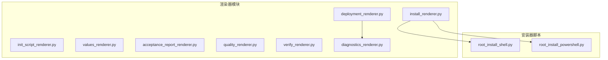
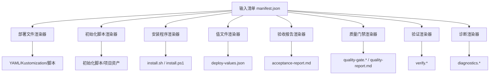
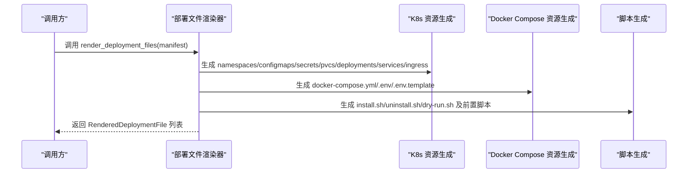
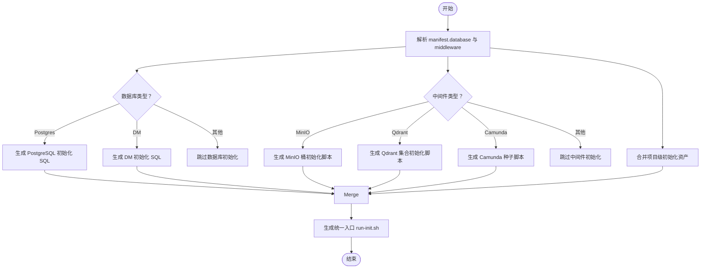
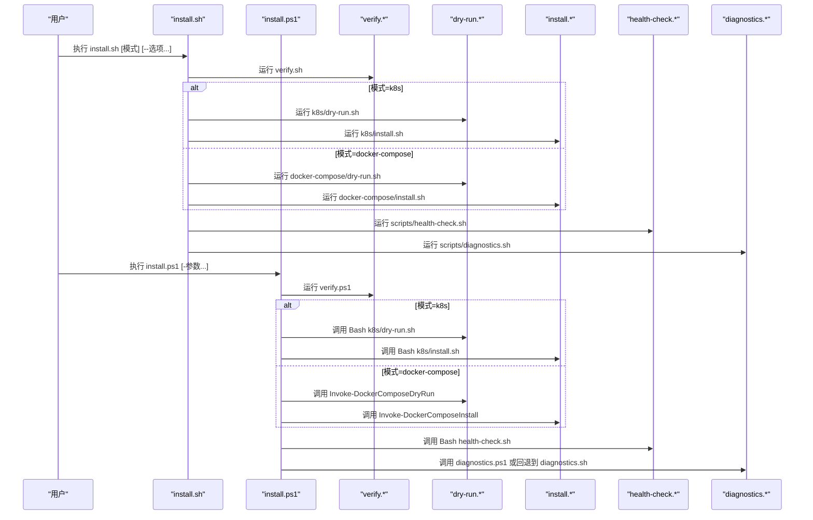
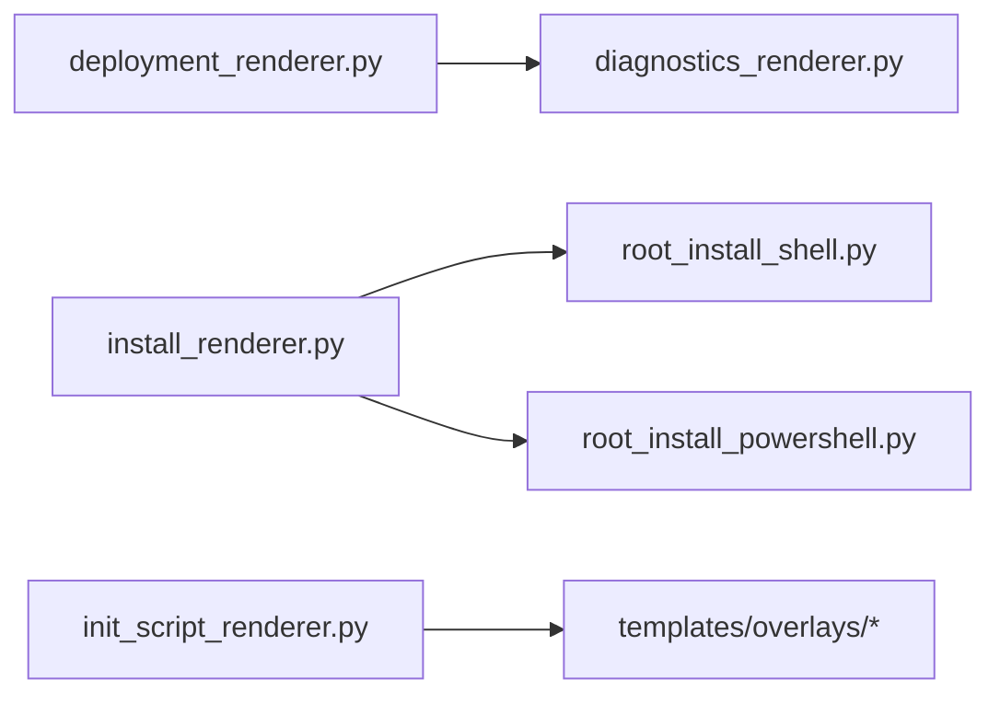

# 文件渲染系统

<cite>
**本文档引用的文件**
- [deployment_renderer.py](file://backend/deployment_package_factory/services/deployment_packages/deployment_renderer.py)
- [init_script_renderer.py](file://backend/deployment_package_factory/services/deployment_packages/init_script_renderer.py)
- [install_renderer.py](file://backend/deployment_package_factory/services/deployment_packages/install_renderer.py)
- [values_renderer.py](file://backend/deployment_package_factory/services/deployment_packages/values_renderer.py)
- [acceptance_report_renderer.py](file://backend/deployment_package_factory/services/deployment_packages/acceptance_report_renderer.py)
- [quality_renderer.py](file://backend/deployment_package_factory/services/deployment_packages/quality_renderer.py)
- [verify_renderer.py](file://backend/deployment_package_factory/services/deployment_packages/verify_renderer.py)
- [diagnostics_renderer.py](file://backend/deployment_package_factory/services/deployment_packages/diagnostics_renderer.py)
- [root_install_shell.py](file://backend/deployment_package_factory/services/deployment_packages/root_install_shell.py)
- [root_install_powershell.py](file://backend/deployment_package_factory/services/deployment_packages/root_install_powershell.py)
- [test_deployment_renderer.py](file://backend/tests/test_deployment_renderer.py)
- [test_init_script_renderer.py](file://backend/tests/test_init_script_renderer.py)
- [test_install_renderer.py](file://backend/tests/test_install_renderer.py)
- [test_acceptance_report_renderer.py](file://backend/tests/test_acceptance_report_renderer.py)
</cite>

## 目录
1. [简介](#简介)
2. [项目结构](#项目结构)
3. [核心组件](#核心组件)
4. [架构总览](#架构总览)
5. [详细组件分析](#详细组件分析)
6. [依赖关系分析](#依赖关系分析)
7. [性能考虑](#性能考虑)
8. [故障排除指南](#故障排除指南)
9. [结论](#结论)
10. [附录](#附录)

## 简介
本文件渲染系统用于生成部署包所需的各类文件与脚本，覆盖以下能力：
- 部署文件渲染器：生成 Kubernetes 与 Docker Compose 的资源清单、层化 Kustomization、安装/卸载/试运行脚本、环境变量模板与默认值等。
- 初始化脚本渲染器：生成数据库与中间件初始化脚本、项目级初始化资产合并、统一入口脚本等。
- 安装程序渲染器：生成根目录安装脚本（Shell 与 PowerShell），支持模式选择、预检、干跑、健康检查与诊断。
- 值文件渲染器：生成部署值 JSON，汇总命名空间、服务、中间件、镜像与校验摘要等。
- 质量门禁渲染器：生成质量门禁脚本与报告，支持跨平台。
- 验证渲染器：生成包完整性验证脚本（Shell 与 PowerShell）。
- 诊断渲染器：生成部署诊断脚本，支持 K8s 与 Docker Compose。

系统通过模板变量替换、文件权限控制与可执行脚本生成，确保在不同环境与平台上的可移植性与一致性。

## 项目结构
渲染系统位于后端模块的部署包工厂服务中，采用按功能分层的组织方式：
- services/deployment_packages：渲染器集合，每个渲染器负责一类输出产物。
- tests：针对各渲染器的单元测试，验证路径、可执行标志、内容片段与行为。

图表来源
- [deployment_renderer.py:1-1206](file://backend/deployment_package_factory/services/deployment_packages/deployment_renderer.py#L1-L1206)
- [init_script_renderer.py:1-377](file://backend/deployment_package_factory/services/deployment_packages/init_script_renderer.py#L1-L377)
- [install_renderer.py:1-34](file://backend/deployment_package_factory/services/deployment_packages/install_renderer.py#L1-L34)
- [values_renderer.py:1-137](file://backend/deployment_package_factory/services/deployment_packages/values_renderer.py#L1-L137)
- [acceptance_report_renderer.py:1-125](file://backend/deployment_package_factory/services/deployment_packages/acceptance_report_renderer.py#L1-L125)
- [quality_renderer.py:1-170](file://backend/deployment_package_factory/services/deployment_packages/quality_renderer.py#L1-L170)
- [verify_renderer.py:1-346](file://backend/deployment_package_factory/services/deployment_packages/verify_renderer.py#L1-L346)
- [diagnostics_renderer.py:1-231](file://backend/deployment_package_factory/services/deployment_packages/diagnostics_renderer.py#L1-L231)
- [root_install_shell.py:1-86](file://backend/deployment_package_factory/services/deployment_packages/root_install_shell.py#L1-L86)
- [root_install_powershell.py:1-174](file://backend/deployment_package_factory/services/deployment_packages/root_install_powershell.py#L1-L174)

章节来源
- [deployment_renderer.py:1-1206](file://backend/deployment_package_factory/services/deployment_packages/deployment_renderer.py#L1-L1206)
- [init_script_renderer.py:1-377](file://backend/deployment_package_factory/services/deployment_packages/init_script_renderer.py#L1-L377)
- [install_renderer.py:1-34](file://backend/deployment_package_factory/services/deployment_packages/install_renderer.py#L1-L34)
- [values_renderer.py:1-137](file://backend/deployment_package_factory/services/deployment_packages/values_renderer.py#L1-L137)
- [acceptance_report_renderer.py:1-125](file://backend/deployment_package_factory/services/deployment_packages/acceptance_report_renderer.py#L1-L125)
- [quality_renderer.py:1-170](file://backend/deployment_package_factory/services/deployment_packages/quality_renderer.py#L1-L170)
- [verify_renderer.py:1-346](file://backend/deployment_package_factory/services/deployment_packages/verify_renderer.py#L1-L346)
- [diagnostics_renderer.py:1-231](file://backend/deployment_package_factory/services/deployment_packages/diagnostics_renderer.py#L1-L231)
- [root_install_shell.py:1-86](file://backend/deployment_package_factory/services/deployment_packages/root_install_shell.py#L1-L86)
- [root_install_powershell.py:1-174](file://backend/deployment_package_factory/services/deployment_packages/root_install_powershell.py#L1-L174)

## 核心组件
- 渲染数据模型
  - RenderedDeploymentFile：部署文件项，包含路径、内容与可执行标志。
  - RenderedInitFile：初始化文件项。
  - RenderedInstallFile：安装器文件项。
  - RenderedValuesFile：值文件项。
  - RenderedAcceptanceReport：验收报告项。
  - RenderedQualityFile：质量门禁文件项。
  - RenderedVerifyFile：验证文件项。
  - RenderedDiagnosticsFile：诊断文件项（返回三元组路径/内容/可执行）。

- 关键渲染函数
  - render_deployment_files：生成部署相关 YAML、脚本与层化 Kustomization。
  - render_init_files：生成初始化脚本与项目级初始化资产。
  - render_root_install_files：生成根目录安装脚本（Shell/PowerShell）。
  - render_values_files：生成部署值 JSON。
  - render_acceptance_report_files：生成验收报告。
  - render_quality_gate_files：生成质量门禁脚本与报告。
  - render_package_verify_files：生成包完整性验证脚本。
  - render_diagnostics_files：生成诊断脚本（返回二元组列表）。

章节来源
- [deployment_renderer.py:22-60](file://backend/deployment_package_factory/services/deployment_packages/deployment_renderer.py#L22-L60)
- [init_script_renderer.py:21-49](file://backend/deployment_package_factory/services/deployment_packages/init_script_renderer.py#L21-L49)
- [install_renderer.py:14-26](file://backend/deployment_package_factory/services/deployment_packages/install_renderer.py#L14-L26)
- [values_renderer.py:8-45](file://backend/deployment_package_factory/services/deployment_packages/values_renderer.py#L8-L45)
- [acceptance_report_renderer.py:7-15](file://backend/deployment_package_factory/services/deployment_packages/acceptance_report_renderer.py#L7-L15)
- [quality_renderer.py:11-23](file://backend/deployment_package_factory/services/deployment_packages/quality_renderer.py#L11-L23)
- [verify_renderer.py:10-21](file://backend/deployment_package_factory/services/deployment_packages/verify_renderer.py#L10-L21)
- [diagnostics_renderer.py:6-10](file://backend/deployment_package_factory/services/deployment_packages/diagnostics_renderer.py#L6-L10)

## 架构总览
渲染系统以“清单/脚本/报告”三层输出为核心，围绕模板变量替换与平台适配展开：
- 清单层：Kubernetes 与 Docker Compose 资源清单，按中间件类型与业务服务分层。
- 脚本层：安装/卸载/干跑/健康检查/诊断/验证/质量门禁脚本，跨 Shell/PowerShell 平台。
- 报告层：验收报告、质量报告与值文件，便于审计与自动化。

图表来源
- [deployment_renderer.py:29-60](file://backend/deployment_package_factory/services/deployment_packages/deployment_renderer.py#L29-L60)
- [init_script_renderer.py:28-49](file://backend/deployment_package_factory/services/deployment_packages/init_script_renderer.py#L28-L49)
- [install_renderer.py:21-26](file://backend/deployment_package_factory/services/deployment_packages/install_renderer.py#L21-L26)
- [values_renderer.py:15-45](file://backend/deployment_package_factory/services/deployment_packages/values_renderer.py#L15-L45)
- [acceptance_report_renderer.py:14-15](file://backend/deployment_package_factory/services/deployment_packages/acceptance_report_renderer.py#L14-L15)
- [quality_renderer.py:18-23](file://backend/deployment_package_factory/services/deployment_packages/quality_renderer.py#L18-L23)
- [verify_renderer.py:17-21](file://backend/deployment_package_factory/services/deployment_packages/verify_renderer.py#L17-L21)
- [diagnostics_renderer.py:6-10](file://backend/deployment_package_factory/services/deployment_packages/diagnostics_renderer.py#L6-L10)

## 详细组件分析

### 部署文件渲染器
- 功能概述
  - 生成 Kubernetes 与 Docker Compose 的资源清单与层化 Kustomization。
  - 生成安装/卸载/干跑脚本，并调用前置检查与健康检查脚本。
  - 支持中间件命令/环境注入、健康检查、存储类与 PVC 生成。
  - 生成诊断文件并扩展到最终文件列表。

- 输出清单
  - k8s/namespaces.yaml、configmaps.yaml、secrets.template.yaml、pvcs.yaml、deployments.yaml、services.yaml、ingress.yaml、jobs/init-db.yaml、kustomization.yaml、layers/*、install.sh、uninstall.sh、dry-run.sh。
  - docker-compose/docker-compose.yml、.env、.env.template、install.sh、uninstall.sh、dry-run.sh。
  - scripts/check-prerequisites.sh、secret-check.sh、health-check.sh。

- 模板变量替换机制
  - 环境变量模板：通过 envTemplate 与 composeEnvironment 注入，支持占位符如 __REPLACE_WITH_* 与 ${VAR} 引用。
  - 命令与参数：composeCommand、k8sCommand/k8sArgs 将被安全转义并注入容器定义。
  - 健康检查：composeHealthcheck 与 k8s 健康检查字段映射。
  - 存储类与 PVC：根据目标配置生成 storageClass 与 PVC 规则。

- 文件权限与可执行脚本
  - install.sh、uninstall.sh、dry-run.sh、check-prerequisites.sh、secret-check.sh、health-check.sh 设置为可执行。
  - 其他 YAML/文本文件不设置可执行标志。

- 关键实现点
  - 层资源映射：按中间件类型归类到 00-platform/10-data/20-observability/30-edge/40-workflow-webui/50-simulators/60-apps。
  - 中间件端口与镜像解析：从 middlewareConfig 与 middleware 定义读取。
  - 命名空间前缀与域名：来自 targetProfile.namespacePrefix 与 domain。

图表来源
- [deployment_renderer.py:29-60](file://backend/deployment_package_factory/services/deployment_packages/deployment_renderer.py#L29-L60)
- [deployment_renderer.py:498-533](file://backend/deployment_package_factory/services/deployment_packages/deployment_renderer.py#L498-L533)
- [deployment_renderer.py:667-707](file://backend/deployment_package_factory/services/deployment_packages/deployment_renderer.py#L667-L707)
- [deployment_renderer.py:710-807](file://backend/deployment_package_factory/services/deployment_packages/deployment_renderer.py#L710-L807)

章节来源
- [deployment_renderer.py:29-60](file://backend/deployment_package_factory/services/deployment_packages/deployment_renderer.py#L29-L60)
- [deployment_renderer.py:63-138](file://backend/deployment_package_factory/services/deployment_packages/deployment_renderer.py#L63-L138)
- [deployment_renderer.py:135-208](file://backend/deployment_package_factory/services/deployment_packages/deployment_renderer.py#L135-L208)
- [deployment_renderer.py:209-256](file://backend/deployment_package_factory/services/deployment_packages/deployment_renderer.py#L209-L256)
- [deployment_renderer.py:259-306](file://backend/deployment_package_factory/services/deployment_packages/deployment_renderer.py#L259-L306)
- [deployment_renderer.py:309-343](file://backend/deployment_package_factory/services/deployment_packages/deployment_renderer.py#L309-L343)
- [deployment_renderer.py:346-380](file://backend/deployment_package_factory/services/deployment_packages/deployment_renderer.py#L346-L380)
- [deployment_renderer.py:482-533](file://backend/deployment_package_factory/services/deployment_packages/deployment_renderer.py#L482-L533)
- [deployment_renderer.py:535-707](file://backend/deployment_package_factory/services/deployment_packages/deployment_renderer.py#L535-L707)
- [deployment_renderer.py:710-807](file://backend/deployment_package_factory/services/deployment_packages/deployment_renderer.py#L710-L807)

### 初始化脚本渲染器
- 功能概述
  - 生成统一入口 run-init.sh，按模式调度数据库与中间件初始化。
  - 生成数据库（PostgreSQL/DM）与中间件（MinIO/Qdrant/Camunda）初始化脚本。
  - 合并项目级初始化资产（SQL、BPMN、JSON、Shell 脚本），并进行安全路径校验。

- 输出清单
  - init/run-init.sh（可执行）、init/README.md、init/postgres/001_schema.sql、init/dm/001_schema.sql、init/minio/create-buckets.sh（可执行）、init/qdrant/create-collections.sh（可执行）、init/camunda/bootstrap-admin.sh（可执行）。
  - init/project/<project>/**（项目模板合并产物）。

- 模板变量替换机制
  - 数据库模式：从 runtimeConfig.resources 中提取 schema 与数据库名称，生成幂等 SQL。
  - MinIO：从 buckets.txt 或项目资产读取桶名，生成创建命令或脚本。
  - Qdrant：从 collections.json 或项目资产读取集合规格，生成创建请求。
  - Camunda：扫描 BPMN/DMN 文件并部署流程模型。

- 文件权限与可执行脚本
  - run-init.sh 与中间件初始化脚本设置为可执行；SQL/JSON 文本不设置可执行标志。

- 关键实现点
  - 项目模板路径安全校验：禁止空段、当前段与父目录段。
  - 多语言支持：Python/Shell/PowerShell 逻辑分离，确保跨平台可用性。

图表来源
- [init_script_renderer.py:28-49](file://backend/deployment_package_factory/services/deployment_packages/init_script_renderer.py#L28-L49)
- [init_script_renderer.py:52-127](file://backend/deployment_package_factory/services/deployment_packages/init_script_renderer.py#L52-L127)
- [init_script_renderer.py:141-174](file://backend/deployment_package_factory/services/deployment_packages/init_script_renderer.py#L141-L174)
- [init_script_renderer.py:177-226](file://backend/deployment_package_factory/services/deployment_packages/init_script_renderer.py#L177-L226)
- [init_script_renderer.py:229-291](file://backend/deployment_package_factory/services/deployment_packages/init_script_renderer.py#L229-L291)
- [init_script_renderer.py:294-323](file://backend/deployment_package_factory/services/deployment_packages/init_script_renderer.py#L294-L323)
- [init_script_renderer.py:326-351](file://backend/deployment_package_factory/services/deployment_packages/init_script_renderer.py#L326-L351)

章节来源
- [init_script_renderer.py:28-49](file://backend/deployment_package_factory/services/deployment_packages/init_script_renderer.py#L28-L49)
- [init_script_renderer.py:52-127](file://backend/deployment_package_factory/services/deployment_packages/init_script_renderer.py#L52-L127)
- [init_script_renderer.py:141-174](file://backend/deployment_package_factory/services/deployment_packages/init_script_renderer.py#L141-L174)
- [init_script_renderer.py:177-226](file://backend/deployment_package_factory/services/deployment_packages/init_script_renderer.py#L177-L226)
- [init_script_renderer.py:229-291](file://backend/deployment_package_factory/services/deployment_packages/init_script_renderer.py#L229-L291)
- [init_script_renderer.py:294-323](file://backend/deployment_package_factory/services/deployment_packages/init_script_renderer.py#L294-L323)
- [init_script_renderer.py:326-351](file://backend/deployment_package_factory/services/deployment_packages/init_script_renderer.py#L326-L351)

### 安装程序渲染器
- 功能概述
  - 生成根目录安装脚本（install.sh 与 install.ps1），支持模式选择（k8s/docker-compose）。
  - 提供预检、干跑、健康检查与诊断的自动化流程。
  - 默认模式根据 deployModes 推断（优先 docker-compose 若仅支持该模式）。

- 输出清单
  - install.sh（可执行）、install.ps1（非可执行，内部调用 Bash 脚本）。

- 配置选项
  - 支持开关：--skip-verify、--skip-dry-run、--skip-health-check、--skip-diagnostics、--yes。
  - PowerShell 参数：Mode、SkipVerify、SkipDryRun、SkipHealthCheck、SkipDiagnostics、Yes。

- 关键实现点
  - Shell：解析参数、调用 verify.sh、按模式执行 dry-run 与 install，并触发 post-deploy 检查。
  - PowerShell：执行等价逻辑，包含磁盘空间、镜像归档预检、加载镜像归档、健康检查与诊断。

图表来源
- [install_renderer.py:21-26](file://backend/deployment_package_factory/services/deployment_packages/install_renderer.py#L21-L26)
- [root_install_shell.py:4-85](file://backend/deployment_package_factory/services/deployment_packages/root_install_shell.py#L4-L85)
- [root_install_powershell.py:4-173](file://backend/deployment_package_factory/services/deployment_packages/root_install_powershell.py#L4-L173)

章节来源
- [install_renderer.py:21-26](file://backend/deployment_package_factory/services/deployment_packages/install_renderer.py#L21-L26)
- [root_install_shell.py:4-85](file://backend/deployment_package_factory/services/deployment_packages/root_install_shell.py#L4-L85)
- [root_install_powershell.py:4-173](file://backend/deployment_package_factory/services/deployment_packages/root_install_powershell.py#L4-L173)

### 值文件渲染器
- 功能概述
  - 生成 deploy-values.json，汇总包标识、项目键、产品版本、目标环境、部署模式、镜像模式、命名空间、K8s 层、数据库、服务、中间件、镜像条目与校验摘要。
  - 生成初始化根路径与项目覆盖路径。

- 输出清单
  - deploy-values.json（单文件）。

- 关键实现点
  - 命名空间：基于 targetProfile.namespacePrefix 生成 basePublic、middleware 与 business 命名空间。
  - K8s 层：按中间件类型与服务聚合到对应层。
  - 镜像：从 manifest.imageEntries 提取 group、sourceRef、targetRef、archiveFile。

章节来源
- [values_renderer.py:15-45](file://backend/deployment_package_factory/services/deployment_packages/values_renderer.py#L15-L45)
- [values_renderer.py:48-114](file://backend/deployment_package_factory/services/deployment_packages/values_renderer.py#L48-L114)
- [values_renderer.py:117-124](file://backend/deployment_package_factory/services/deployment_packages/values_renderer.py#L117-L124)
- [values_renderer.py:127-137](file://backend/deployment_package_factory/services/deployment_packages/values_renderer.py#L127-L137)

### 验证与质量门禁
- 验证渲染器
  - 生成 verify.sh 与 verify.ps1，校验必需文件、SHA256SUMS、package-index.json 结构、镜像归档锁定一致性。
  - 跨平台：Shell 使用 sha256sum/shasum，PowerShell 使用 .NET 或流哈希。

- 质量门禁渲染器
  - 生成 quality-gate.sh 与 quality-gate.ps1，以及 docs/quality-report.md。
  - 支持按模式运行 package-integrity、k8s-client-dry-run、docker-compose-config。

章节来源
- [verify_renderer.py:17-21](file://backend/deployment_package_factory/services/deployment_packages/verify_renderer.py#L17-L21)
- [verify_renderer.py:24-183](file://backend/deployment_package_factory/services/deployment_packages/verify_renderer.py#L24-L183)
- [verify_renderer.py:186-345](file://backend/deployment_package_factory/services/deployment_packages/verify_renderer.py#L186-L345)
- [quality_renderer.py:18-23](file://backend/deployment_package_factory/services/deployment_packages/quality_renderer.py#L18-L23)
- [quality_renderer.py:26-95](file://backend/deployment_package_factory/services/deployment_packages/quality_renderer.py#L26-L95)
- [quality_renderer.py:98-146](file://backend/deployment_package_factory/services/deployment_packages/quality_renderer.py#L98-L146)
- [quality_renderer.py:149-169](file://backend/deployment_package_factory/services/deployment_packages/quality_renderer.py#L149-L169)

### 诊断渲染器
- 功能概述
  - 生成 scripts/diagnostics.sh 与 scripts/diagnostics.ps1，支持 K8s 与 Docker Compose 两种模式。
  - K8s：等待 Pod 就绪、检查 Service Endpoints。
  - Docker Compose：检查容器状态/重启次数/健康、TCP/HTTP 可达性。

- 输出清单
  - scripts/diagnostics.sh（可执行）、scripts/diagnostics.ps1（非可执行）。

章节来源
- [diagnostics_renderer.py:6-10](file://backend/deployment_package_factory/services/deployment_packages/diagnostics_renderer.py#L6-L10)
- [diagnostics_renderer.py:13-113](file://backend/deployment_package_factory/services/deployment_packages/diagnostics_renderer.py#L13-L113)
- [diagnostics_renderer.py:116-197](file://backend/deployment_package_factory/services/deployment_packages/diagnostics_renderer.py#L116-L197)

### 验收报告渲染器
- 功能概述
  - 生成 docs/acceptance-report.md，汇总包信息、验证命令、镜像摘要、运行时配置与初始化资源。
  - 包含验收清单，便于人工或自动化审核。

章节来源
- [acceptance_report_renderer.py:14-71](file://backend/deployment_package_factory/services/deployment_packages/acceptance_report_renderer.py#L14-L71)
- [acceptance_report_renderer.py:74-124](file://backend/deployment_package_factory/services/deployment_packages/acceptance_report_renderer.py#L74-L124)

## 依赖关系分析
- 组件耦合
  - deployment_renderer 依赖 diagnostics_renderer 生成诊断文件并合并到最终输出。
  - install_renderer 依赖 root_install_shell 与 root_install_powershell 提供安装脚本模板。
  - 各渲染器均依赖 manifest 输入，通过中间件配置、命名空间与目标配置进行差异化生成。

- 外部依赖
  - Shell/PowerShell 工具链：docker、kubectl、curl、python3、sha256sum/shasum 等。
  - 项目模板：templates/overlays 下的项目级初始化模板。

图表来源
- [deployment_renderer.py:7-7](file://backend/deployment_package_factory/services/deployment_packages/deployment_renderer.py#L7-L7)
- [init_script_renderer.py:7-7](file://backend/deployment_package_factory/services/deployment_packages/init_script_renderer.py#L7-L7)
- [install_renderer.py:6-7](file://backend/deployment_package_factory/services/deployment_packages/install_renderer.py#L6-L7)

章节来源
- [deployment_renderer.py:1-20](file://backend/deployment_package_factory/services/deployment_packages/deployment_renderer.py#L1-L20)
- [init_script_renderer.py:1-10](file://backend/deployment_package_factory/services/deployment_packages/init_script_renderer.py#L1-L10)
- [install_renderer.py:1-10](file://backend/deployment_package_factory/services/deployment_packages/install_renderer.py#L1-L10)

## 性能考虑
- 渲染复杂度
  - 渲染函数多为线性遍历与字符串拼接，时间复杂度近似 O(N)，其中 N 为中间件与服务数量。
  - 模板变量替换与转义操作为常数开销，整体可接受。

- I/O 优化
  - 项目模板读取采用相对路径与安全校验，避免重复读取与越界访问。
  - 诊断脚本按需调用外部工具，减少不必要的命令执行。

- 可扩展性
  - 新增中间件类型只需扩展层映射与资源生成逻辑。
  - 新增部署模式可在安装器中添加分支逻辑。

## 故障排除指南
- 常见问题与定位
  - 缺少必需文件：verify.* 会明确指出缺失文件。
  - SHA256 校验失败：检查 SHA256SUMS 与 package-index.json 是否匹配。
  - 镜像归档缺失：install.* 与 verify.* 会提示缺少的归档文件。
  - Secret 占位符未替换：install.* 与 diagnostics.* 会检测并报错。
  - 命名空间/层化 Kustomization 不一致：检查 targetProfile.namespacePrefix 与中间件类型映射。

- 排查步骤
  - 运行 verify.sh/verify.ps1 确认包完整性。
  - 运行 quality-gate.sh/quality-gate.ps1 执行质量门禁。
  - 运行 diagnostics.sh/diagnostics.ps1 进行部署诊断。
  - 按验收报告核对镜像、运行时配置与初始化资源。

章节来源
- [verify_renderer.py:24-183](file://backend/deployment_package_factory/services/deployment_packages/verify_renderer.py#L24-L183)
- [verify_renderer.py:186-345](file://backend/deployment_package_factory/services/deployment_packages/verify_renderer.py#L186-L345)
- [quality_renderer.py:26-95](file://backend/deployment_package_factory/services/deployment_packages/quality_renderer.py#L26-L95)
- [quality_renderer.py:98-146](file://backend/deployment_package_factory/services/deployment_packages/quality_renderer.py#L98-L146)
- [diagnostics_renderer.py:13-113](file://backend/deployment_package_factory/services/deployment_packages/diagnostics_renderer.py#L13-L113)
- [diagnostics_renderer.py:116-197](file://backend/deployment_package_factory/services/deployment_packages/diagnostics_renderer.py#L116-L197)

## 结论
该文件渲染系统通过清晰的职责划分与跨平台脚本支持，实现了部署包的标准化生成与可审计交付。其模板变量替换、文件权限控制与可执行脚本生成机制，确保了在不同环境与平台上的稳定性与一致性。配合质量门禁、验证与诊断脚本，能够有效提升部署质量与可运维性。

## 附录

### 使用示例与最佳实践
- 使用渲染器 API
  - 部署文件：调用 render_deployment_files(manifest) 获取 RenderedDeploymentFile 列表，写入文件系统并设置可执行标志。
  - 初始化脚本：调用 render_init_files(manifest, template_dir) 获取 RenderedInitFile 列表，合并项目模板。
  - 安装脚本：调用 render_root_install_files(manifest) 获取 RenderedInstallFile 列表。
  - 值文件：调用 render_values_files(manifest) 获取 RenderedValuesFile 列表。
  - 验证与质量门禁：调用 render_package_verify_files() 与 render_quality_gate_files(manifest)。
  - 验收报告：调用 render_acceptance_report_files(manifest)。

- 错误处理策略
  - 对于项目模板路径，严格校验相对路径与安全段，防止路径逃逸。
  - 对于 Shell/PowerShell 脚本，优先使用内置工具链，降级到替代方案（如 Python/HTTP 请求）。
  - 对于外部依赖缺失，明确报错并给出修复建议。

- 配置选项与自定义模板
  - 通过 manifest 的 deployModes、targetProfile、middlewareConfig 等字段控制渲染行为。
  - 自定义模板：在 templates/overlays/<project>/init 下提供 SQL/BPMN/JSON/Shell 资产，渲染器自动合并。

章节来源
- [test_deployment_renderer.py:6-337](file://backend/tests/test_deployment_renderer.py#L6-L337)
- [test_init_script_renderer.py:6-106](file://backend/tests/test_init_script_renderer.py#L6-L106)
- [test_install_renderer.py:6-57](file://backend/tests/test_install_renderer.py#L6-L57)
- [test_acceptance_report_renderer.py:6-54](file://backend/tests/test_acceptance_report_renderer.py#L6-L54)