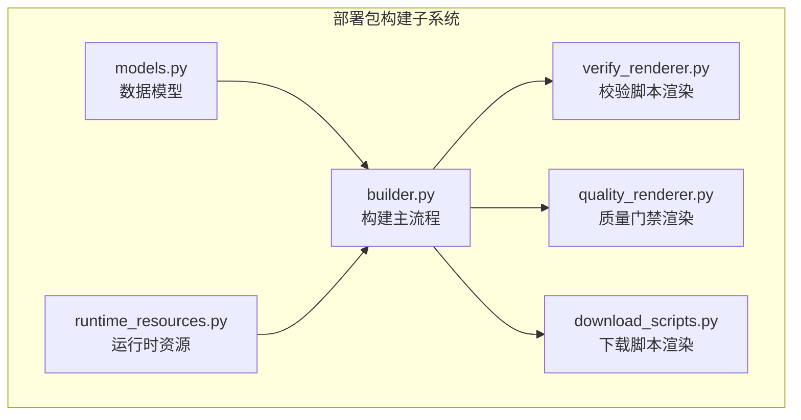
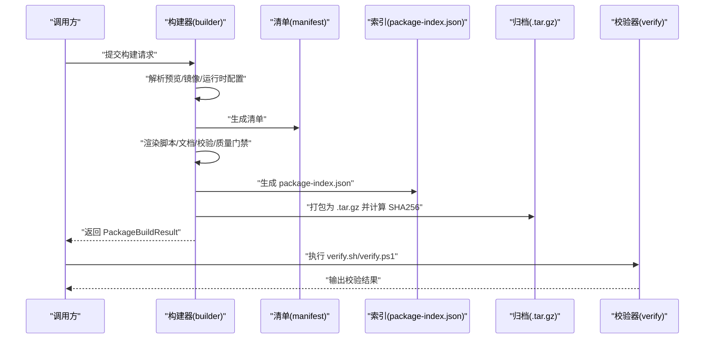
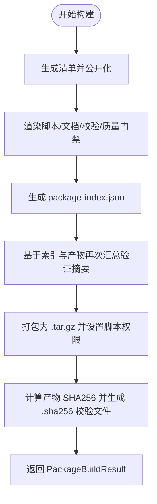
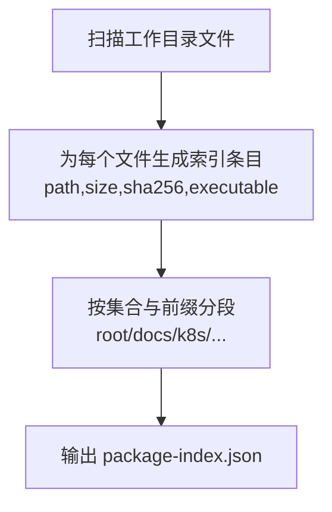
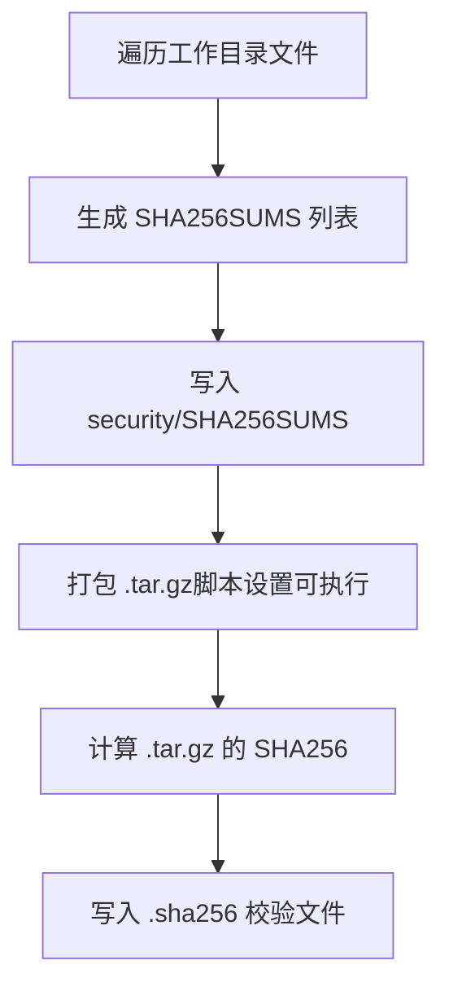
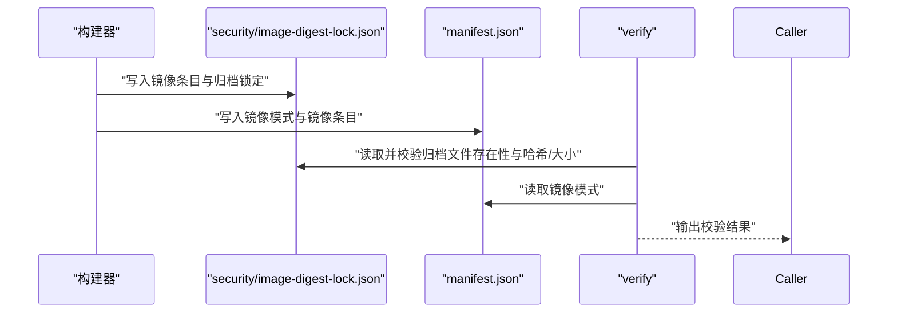
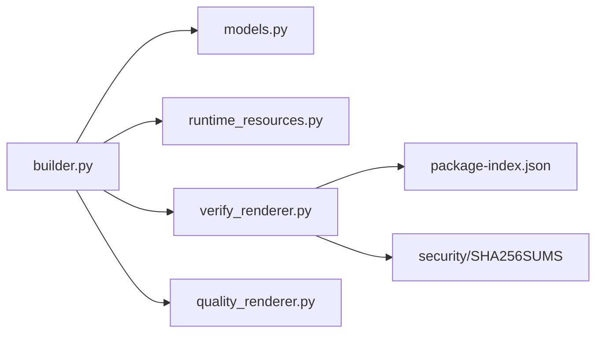

# 构建结果处理

<cite>
**本文引用的文件**
- [models.py](file://backend/deployment_package_factory/services/deployment_packages/models.py)
- [builder.py](file://backend/deployment_package_factory/services/deployment_packages/builder.py)
- [verify_renderer.py](file://backend/deployment_package_factory/services/deployment_packages/verify_renderer.py)
- [quality_renderer.py](file://backend/deployment_package_factory/services/deployment_packages/quality_renderer.py)
- [runtime_resources.py](file://backend/deployment_package_factory/services/deployment_packages/runtime_resources.py)
- [download_scripts.py](file://backend/deployment_package_factory/services/deployment_packages/download_scripts.py)
- [test_deployment_package_builder.py](file://backend/tests/test_deployment_package_builder.py)
- [test_verify_renderer.py](file://backend/tests/test_verify_renderer.py)
- [test_quality_renderer.py](file://backend/tests/test_quality_renderer.py)
</cite>

## 目录
1. [简介](#简介)
2. [项目结构](#项目结构)
3. [核心组件](#核心组件)
4. [架构总览](#架构总览)
5. [详细组件分析](#详细组件分析)
6. [依赖分析](#依赖分析)
7. [性能考虑](#性能考虑)
8. [故障排查指南](#故障排查指南)
9. [结论](#结论)
10. [附录](#附录)

## 简介
本文件面向“部署包构建结果处理系统”，聚焦于 PackageBuildResult 数据模型与构建完成后产物的处理流程。内容涵盖：
- PackageBuildResult 字段语义与用途
- 构建完成后的打包、压缩与摘要计算
- package-index.json 的结构与生成逻辑
- SHA256 校验和生成与文件元数据过滤
- 归档文件处理（镜像归档）与校验
- 配置项、性能优化建议与错误处理策略
- 实际使用示例路径（以源码路径形式给出）

## 项目结构
该系统位于后端模块 deployment_packages 下，核心文件包括：
- 模型定义：models.py
- 构建主流程：builder.py
- 校验脚本渲染：verify_renderer.py
- 质量门禁渲染：quality_renderer.py
- 运行时资源与配置：runtime_resources.py
- 下载脚本渲染：download_scripts.py
- 测试用例：test_deployment_package_builder.py、test_verify_renderer.py、test_quality_renderer.py

**图表来源**
- [models.py:204-249](file://backend/deployment_package_factory/services/deployment_packages/models.py#L204-L249)
- [builder.py:146-247](file://backend/deployment_package_factory/services/deployment_packages/builder.py#L146-L247)
- [verify_renderer.py:17-21](file://backend/deployment_package_factory/services/deployment_packages/verify_renderer.py#L17-L21)
- [quality_renderer.py:18-23](file://backend/deployment_package_factory/services/deployment_packages/quality_renderer.py#L18-L23)
- [runtime_resources.py:25-52](file://backend/deployment_package_factory/services/deployment_packages/runtime_resources.py#L25-L52)
- [download_scripts.py:6-14](file://backend/deployment_package_factory/services/deployment_packages/download_scripts.py#L6-L14)

**章节来源**
- [models.py:204-249](file://backend/deployment_package_factory/services/deployment_packages/models.py#L204-L249)
- [builder.py:146-247](file://backend/deployment_package_factory/services/deployment_packages/builder.py#L146-L247)

## 核心组件
- PackageBuildResult：构建结果数据载体，包含包标识、工作目录、产物路径、校验摘要、清单等字段。
- 构建主流程：负责生成清单、渲染各类脚本与文档、打包归档、计算 SHA256 并返回结果对象。
- 校验器：提供 verify.sh/verify.ps1，用于完整性、索引一致性与镜像归档锁定校验。
- 质量门禁：提供 quality-gate.sh/quality-gate.ps1，按部署模式执行干跑检查并生成质量报告。

**章节来源**
- [models.py:204-249](file://backend/deployment_package_factory/services/deployment_packages/models.py#L204-L249)
- [builder.py:146-247](file://backend/deployment_package_factory/services/deployment_packages/builder.py#L146-L247)
- [verify_renderer.py:17-21](file://backend/deployment_package_factory/services/deployment_packages/verify_renderer.py#L17-L21)
- [quality_renderer.py:18-23](file://backend/deployment_package_factory/services/deployment_packages/quality_renderer.py#L18-L23)

## 架构总览
下图展示了从请求到最终产物与校验的整体流程。

**图表来源**
- [builder.py:146-247](file://backend/deployment_package_factory/services/deployment_packages/builder.py#L146-L247)
- [verify_renderer.py:24-183](file://backend/deployment_package_factory/services/deployment_packages/verify_renderer.py#L24-L183)

## 详细组件分析

### PackageBuildResult 数据模型
- 字段说明
  - packageId：包唯一标识
  - workDir：工作目录
  - artifactPath：产物路径（.tar.gz）
  - checksumPath：校验和文件路径（.sha256）
  - artifactSize：产物大小（字节）
  - validationSummary：验证摘要（含文件计数、镜像条目/归档计数等）
  - sha256：产物整体 SHA256 值
  - manifest：公开清单（去除了内部字段与敏感运行时配置）

- 关键点
  - 返回的 manifest 通过公共化处理，移除内部字段与完整运行时配置，仅保留对外可见信息。
  - validationSummary 在构建过程中与本地索引与远端产物分别进行两次汇总，确保一致性。

**章节来源**
- [models.py:204-249](file://backend/deployment_package_factory/services/deployment_packages/models.py#L204-L249)
- [builder.py:237-246](file://backend/deployment_package_factory/services/deployment_packages/builder.py#L237-L246)
- [builder.py:309-313](file://backend/deployment_package_factory/services/deployment_packages/builder.py#L309-L313)

### 构建完成后的处理流程
- 清单生成与公开化
  - 依据请求、预览、镜像条目、项目配置与运行时环境生成完整清单，并通过公共化函数剔除内部字段与运行时配置。
- 文件渲染
  - 渲染安装脚本、校验脚本、质量门禁脚本、验收报告、部署值文件等。
- 索引生成与二次校验
  - 生成 package-index.json，包含 schemaVersion、包标识、摘要、安装器/校验器/质量门禁元信息与分段索引。
  - 再次基于索引与产物计算验证摘要，确保一致性。
- 打包与摘要
  - 使用 tarfile 将工作目录打包为 .tar.gz，使用自定义元数据过滤器设置脚本可执行权限。
  - 计算产物整体 SHA256，并生成 .sha256 校验文件。
- 结果封装
  - 返回 PackageBuildResult，包含 artifactPath、checksumPath、artifactSize、sha256、validationSummary、manifest。

**图表来源**
- [builder.py:146-247](file://backend/deployment_package_factory/services/deployment_packages/builder.py#L146-L247)
- [builder.py:1292-1312](file://backend/deployment_package_factory/services/deployment_packages/builder.py#L1292-L1312)

**章节来源**
- [builder.py:146-247](file://backend/deployment_package_factory/services/deployment_packages/builder.py#L146-L247)
- [builder.py:1292-1312](file://backend/deployment_package_factory/services/deployment_packages/builder.py#L1292-L1312)

### package-index.json 的结构与生成逻辑
- 结构要点
  - schemaVersion：固定为 deployment-package-index/v1
  - packageId、projectKey、productVersion、createdAt：来自清单
  - summary：文件总数、总字节数、部署模式、镜像模式、数据库类型
  - installer：版本、入口脚本、支持模式、选项、成功检查项
  - verifier：版本、入口脚本、检查项（必需文件、SHA256SUMS、索引、镜像归档锁定）
  - qualityGate：版本、入口脚本、检查项、报告模板与运行时报告
  - sections：按根、docs、k8s、docker-compose、init、overlays、images、scripts、security 分段列出索引条目

- 生成逻辑
  - 遍历工作目录所有文件，生成每个文件的相对路径、大小、SHA256 与是否可执行标记。
  - 按预设集合与前缀划分到不同分段。

**图表来源**
- [builder.py:1199-1261](file://backend/deployment_package_factory/services/deployment_packages/builder.py#L1199-L1261)
- [builder.py:1264-1280](file://backend/deployment_package_factory/services/deployment_packages/builder.py#L1264-L1280)

**章节来源**
- [builder.py:1199-1261](file://backend/deployment_package_factory/services/deployment_packages/builder.py#L1199-L1261)
- [builder.py:1264-1280](file://backend/deployment_package_factory/services/deployment_packages/builder.py#L1264-L1280)

### SHA256 校验和生成与文件元数据过滤
- 产物整体 SHA256
  - 对 .tar.gz 产物计算 SHA256，并写入 .sha256 文件（格式：十六进制 产物名）
- 全量文件 SHA256SUMS
  - 递归遍历工作目录（排除 SHA256SUMS 自身），生成“十六进制 相对路径”的列表，作为安全校验清单
- 元数据过滤
  - tar 打包时对 .sh 文件设置可执行权限；其他文件保持默认

**图表来源**
- [builder.py:1292-1312](file://backend/deployment_package_factory/services/deployment_packages/builder.py#L1292-L1312)
- [builder.py:1298-1303](file://backend/deployment_package_factory/services/deployment_packages/builder.py#L1298-L1303)
- [builder.py:1306-1311](file://backend/deployment_package_factory/services/deployment_packages/builder.py#L1306-L1311)

**章节来源**
- [builder.py:1292-1312](file://backend/deployment_package_factory/services/deployment_packages/builder.py#L1292-L1312)
- [builder.py:1298-1303](file://backend/deployment_package_factory/services/deployment_packages/builder.py#L1298-L1303)
- [builder.py:1306-1311](file://backend/deployment_package_factory/services/deployment_packages/builder.py#L1306-L1311)

### 镜像归档与锁定校验
- 归档生成
  - 当请求为镜像归档模式或目标要求导出镜像时，生成镜像归档文件并记录到 image-digest-lock.json
- 锁定结构
  - 包含 images（镜像条目）与 archives（归档文件的文件名、SHA256、大小）
- 校验流程
  - 校验器读取 image-digest-lock.json 与 manifest 的镜像模式，确认每个镜像归档存在且哈希/大小一致
  - 若为镜像归档模式，校验器还会核对 package-index.json 中的镜像归档锁定

**图表来源**
- [builder.py:210-218](file://backend/deployment_package_factory/services/deployment_packages/builder.py#L210-L218)
- [verify_renderer.py:156-175](file://backend/deployment_package_factory/services/deployment_packages/verify_renderer.py#L156-L175)
- [verify_renderer.py:326-342](file://backend/deployment_package_factory/services/deployment_packages/verify_renderer.py#L326-L342)

**章节来源**
- [builder.py:210-218](file://backend/deployment_package_factory/services/deployment_packages/builder.py#L210-L218)
- [verify_renderer.py:156-175](file://backend/deployment_package_factory/services/deployment_packages/verify_renderer.py#L156-L175)
- [verify_renderer.py:326-342](file://backend/deployment_package_factory/services/deployment_packages/verify_renderer.py#L326-L342)

### 运行时配置与公开化
- 运行时配置由运行时探针与环境变量合并生成，随后进行公开化处理，仅保留对外可见字段
- 公开化规则
  - 移除内部字段（以“_”开头）
  - 运行时配置仅保留非敏感值与标签，不暴露原始敏感值

**章节来源**
- [runtime_resources.py:25-52](file://backend/deployment_package_factory/services/deployment_packages/runtime_resources.py#L25-L52)
- [runtime_resources.py:55-71](file://backend/deployment_package_factory/services/deployment_packages/runtime_resources.py#L55-L71)
- [builder.py:309-313](file://backend/deployment_package_factory/services/deployment_packages/builder.py#L309-L313)

### 下载脚本与校验
- 下载脚本根据包大小、ETag 与 SHA256 生成分片断点续传下载与校验逻辑
- 支持 PowerShell 与 Bash 两种实现，均包含断点续传、分片拼接与最终 SHA256 校验

**章节来源**
- [download_scripts.py:6-14](file://backend/deployment_package_factory/services/deployment_packages/download_scripts.py#L6-L14)
- [download_scripts.py:17-64](file://backend/deployment_package_factory/services/deployment_packages/download_scripts.py#L17-L64)
- [download_scripts.py:67-111](file://backend/deployment_package_factory/services/deployment_packages/download_scripts.py#L67-L111)

## 依赖分析
- 组件耦合
  - builder.py 依赖 models.py（数据模型）、runtime_resources.py（运行时配置）、verify_renderer.py/quality_renderer.py（脚本渲染）
  - verify_renderer.py 与质量门禁脚本共同依赖 package-index.json 与 SHA256SUMS
- 外部依赖
  - 打包使用 Python 标准库 tarfile
  - 校验使用 sha256sum/shasum 或 Python 内置 hashlib
  - 镜像归档导出可使用 skopeo 或 docker（由环境探测决定）

**图表来源**
- [builder.py:27-57](file://backend/deployment_package_factory/services/deployment_packages/builder.py#L27-L57)
- [verify_renderer.py:17-21](file://backend/deployment_package_factory/services/deployment_packages/verify_renderer.py#L17-L21)

**章节来源**
- [builder.py:27-57](file://backend/deployment_package_factory/services/deployment_packages/builder.py#L27-L57)
- [verify_renderer.py:17-21](file://backend/deployment_package_factory/services/deployment_packages/verify_renderer.py#L17-L21)

## 性能考虑
- 打包阶段
  - 使用 tarfile.filter 对脚本设置可执行权限，避免额外 chmod 操作
  - 分块读取文件计算 SHA256（每次 1MB），降低内存峰值
- 校验阶段
  - SHA256SUMS 与 package-index.json 的一致性校验在本地快速完成，减少网络往返
- 镜像归档
  - 优先使用 skopeo 进行无守护进程镜像导出，减少 Docker 守护依赖
  - 可通过环境变量配置私有/回环镜像仓库为不安全访问，提升导出效率

**章节来源**
- [builder.py:1292-1295](file://backend/deployment_package_factory/services/deployment_packages/builder.py#L1292-L1295)
- [builder.py:1306-1311](file://backend/deployment_package_factory/services/deployment_packages/builder.py#L1306-L1311)
- [builder.py:105-143](file://backend/deployment_package_factory/services/deployment_packages/builder.py#L105-L143)
- [builder.py:1142-1162](file://backend/deployment_package_factory/services/deployment_packages/builder.py#L1142-L1162)

## 故障排查指南
- 校验失败
  - 必需文件缺失：verify.sh/verify.ps1 会提示缺少 manifest.json、package-index.json、SHA256SUMS、镜像锁定等
  - 文件集不一致：SHA256SUMS 与 package-index.json 中的文件集合不匹配
  - 文件被篡改：索引中的大小或 SHA256 与实际文件不一致
  - 镜像归档缺失或不一致：镜像归档未锁定或哈希/大小变化
- 质量门禁失败
  - k8s/docker-compose 干跑失败：检查 dry-run 脚本输出
- 常见原因
  - 未执行 verify.sh/verify.ps1
  - 误修改 package-index.json 或安全清单
  - 镜像归档未按清单生成或被外部工具改动

**章节来源**
- [verify_renderer.py:42-47](file://backend/deployment_package_factory/services/deployment_packages/verify_renderer.py#L42-L47)
- [verify_renderer.py:113-128](file://backend/deployment_package_factory/services/deployment_packages/verify_renderer.py#L113-L128)
- [verify_renderer.py:130-154](file://backend/deployment_package_factory/services/deployment_packages/verify_renderer.py#L130-L154)
- [verify_renderer.py:156-175](file://backend/deployment_package_factory/services/deployment_packages/verify_renderer.py#L156-L175)
- [quality_renderer.py:26-95](file://backend/deployment_package_factory/services/deployment_packages/quality_renderer.py#L26-L95)
- [quality_renderer.py:98-146](file://backend/deployment_package_factory/services/deployment_packages/quality_renderer.py#L98-L146)

## 结论
本系统通过标准化的清单、索引与校验机制，确保部署包的可追溯性与可验证性。PackageBuildResult 作为统一的结果载体，承载了构建产物、校验摘要与公开清单。配合 verify 与质量门禁脚本，可在交付前完成端到端的完整性与一致性校验。

## 附录

### 配置选项与行为
- 请求级配置
  - imageMode：镜像模式（镜像清单或镜像归档）
  - runtimeConfigOverrides：运行时配置覆盖
  - targetProfile：目标环境配置（域名、命名空间前缀、存储类、镜像导出开关等）
- 环境变量
  - DEPLOYMENT_PACKAGE_INSECURE_REGISTRIES：受信任的私有/回环镜像仓库主机
  - KUBERNETES_SERVICEACCOUNT_TOKEN_PATH：用于发现运行时镜像的令牌路径
  - 各类运行时密钥别名映射（如 DATABASE_PASSWORD、REDIS_PASSWORD 等）用于从 Secret/ConfigMap 探测

**章节来源**
- [models.py:114-131](file://backend/deployment_package_factory/services/deployment_packages/models.py#L114-L131)
- [models.py:90-99](file://backend/deployment_package_factory/services/deployment_packages/models.py#L90-L99)
- [builder.py:1142-1162](file://backend/deployment_package_factory/services/deployment_packages/builder.py#L1142-L1162)
- [builder.py:618-627](file://backend/deployment_package_factory/services/deployment_packages/builder.py#L618-L627)

### 使用示例（代码路径）
- 构建部署包并获取结果
  - [test_deployment_package_builder.py:24-52](file://backend/tests/test_deployment_package_builder.py#L24-L52)
- 校验部署包
  - [verify_renderer.py:24-183](file://backend/deployment_package_factory/services/deployment_packages/verify_renderer.py#L24-L183)
- 生成质量门禁报告
  - [quality_renderer.py:26-95](file://backend/deployment_package_factory/services/deployment_packages/quality_renderer.py#L26-L95)
- 生成下载脚本
  - [download_scripts.py:6-14](file://backend/deployment_package_factory/services/deployment_packages/download_scripts.py#L6-L14)