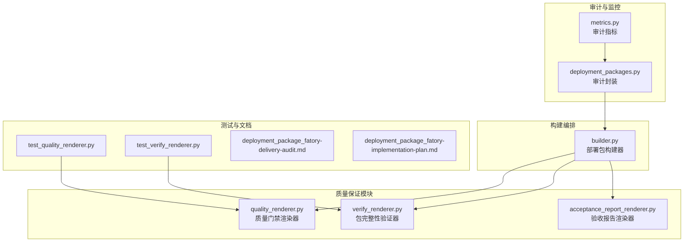
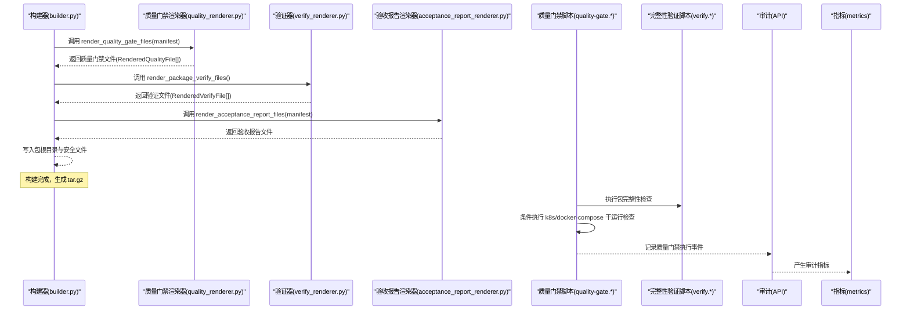
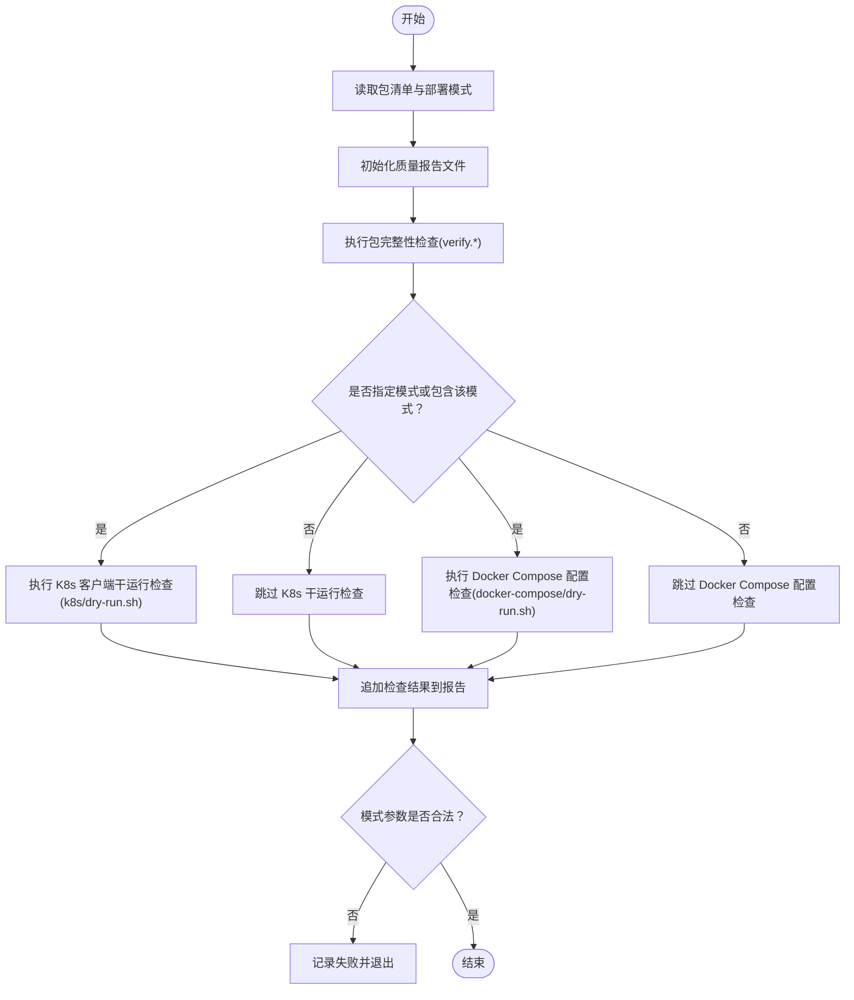
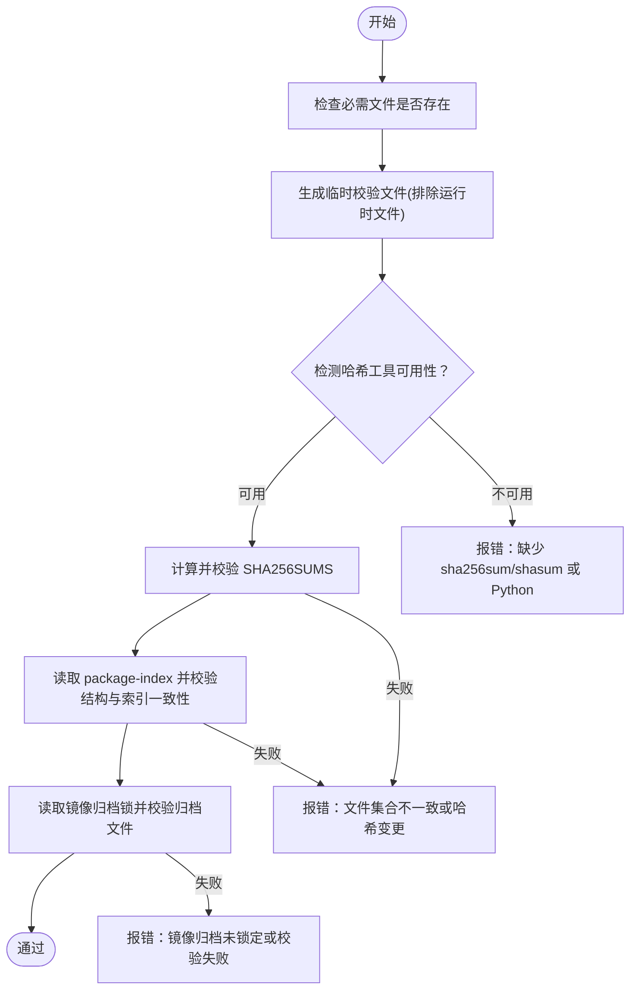
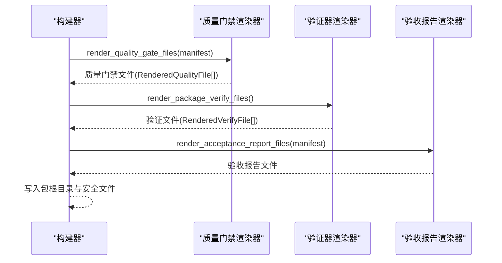
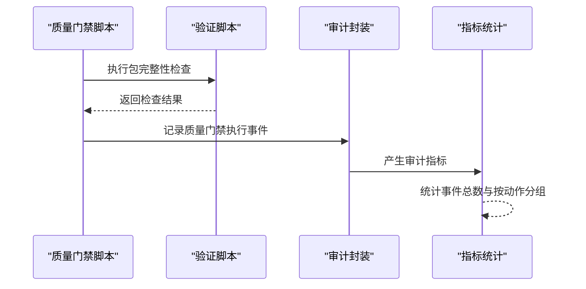
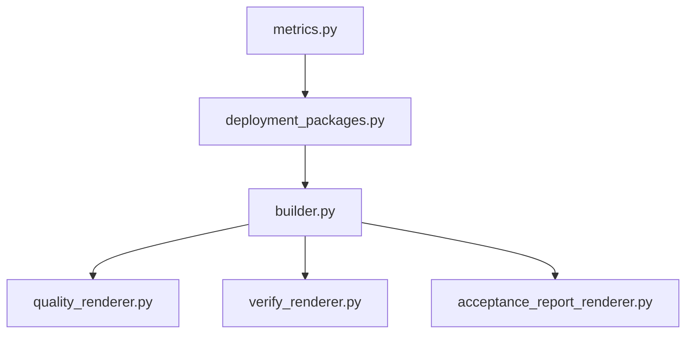

# 质量保证检查

<cite>
**本文引用的文件**
- [quality_renderer.py](file://backend/deployment_package_factory/services/deployment_packages/quality_renderer.py)
- [verify_renderer.py](file://backend/deployment_package_factory/services/deployment_packages/verify_renderer.py)
- [builder.py](file://backend/deployment_package_factory/services/deployment_packages/builder.py)
- [acceptance_report_renderer.py](file://backend/deployment_package_factory/services/deployment_packages/acceptance_report_renderer.py)
- [test_quality_renderer.py](file://backend/tests/test_quality_renderer.py)
- [test_verify_renderer.py](file://backend/tests/test_verify_renderer.py)
- [deployment_package_fatory-delivery-audit.md](file://docs/deployment-package-factory-delivery-audit.md)
- [deployment_package_fatory-implementation-plan.md](file://docs/deployment-package-factory-implementation-plan.md)
- [deployment_packages.py](file://backend/deployment_package_factory/api/deployment_packages.py)
- [metrics.py](file://backend/deployment_package_factory/metrics.py)
</cite>

## 目录
1. [简介](#简介)
2. [项目结构](#项目结构)
3. [核心组件](#核心组件)
4. [架构概览](#架构概览)
5. [详细组件分析](#详细组件分析)
6. [依赖分析](#依赖分析)
7. [性能考虑](#性能考虑)
8. [故障排查指南](#故障排查指南)
9. [结论](#结论)
10. [附录](#附录)

## 简介
本文件面向部署包质量保证检查系统，系统性阐述质量门禁检查机制、验证文件生成流程与质量报告生成、验证脚本执行与审计日志记录机制。文档聚焦以下关键点：
- QUALITY_GATE_CHECKS 常量定义的质量门禁检查项与验证规则
- render_quality_gate_files 与 render_package_verify_files 的实现逻辑与检查策略
- 质量报告生成、验证脚本执行与审计日志记录机制
- 质量检查的配置选项、自定义检查规则与失败处理策略
- 实际的代码示例路径，展示如何使用质量检查 API 与处理检查结果

## 项目结构
质量保证检查相关代码位于后端服务模块中，围绕“质量门禁渲染器”“包完整性验证器”“构建器”“验收报告渲染器”以及配套测试与文档展开。

图表来源
- [quality_renderer.py:1-170](file://backend/deployment_package_factory/services/deployment_packages/quality_renderer.py#L1-L170)
- [verify_renderer.py:1-346](file://backend/deployment_package_factory/services/deployment_packages/verify_renderer.py#L1-L346)
- [acceptance_report_renderer.py:18-54](file://backend/deployment_package_factory/services/deployment_packages/acceptance_report_renderer.py#L18-L54)
- [builder.py:146-246](file://backend/deployment_package_factory/services/deployment_packages/builder.py#L146-L246)
- [test_quality_renderer.py:1-30](file://backend/tests/test_quality_renderer.py#L1-L30)
- [test_verify_renderer.py:1-37](file://backend/tests/test_verify_renderer.py#L1-L37)
- [deployment_packages.py:599-642](file://backend/deployment_package_factory/api/deployment_packages.py#L599-L642)
- [metrics.py:25-37](file://backend/deployment_package_factory/metrics.py#L25-L37)

章节来源
- [quality_renderer.py:1-170](file://backend/deployment_package_factory/services/deployment_packages/quality_renderer.py#L1-L170)
- [verify_renderer.py:1-346](file://backend/deployment_package_factory/services/deployment_packages/verify_renderer.py#L1-L346)
- [builder.py:146-246](file://backend/deployment_package_factory/services/deployment_packages/builder.py#L146-L246)

## 核心组件
- 质量门禁渲染器（quality_renderer.py）
  - 定义质量门禁版本与检查项常量
  - 生成质量门禁脚本（Linux/macOS 与 Windows）与质量报告模板
- 包完整性验证器（verify_renderer.py）
  - 生成包完整性验证脚本（Linux/macOS 与 Windows）
  - 执行必需文件存在性、SHA256 校验、package-index 结构与索引一致性、镜像归档锁校验
- 构建器（builder.py）
  - 在构建过程中调用上述渲染器生成质量门禁与验证脚本
  - 生成包索引与完整性校验文件
- 验收报告渲染器（acceptance_report_renderer.py）
  - 生成验收报告，包含验证命令与关键文件清单
- 测试与文档
  - 覆盖质量门禁与验证脚本生成的正确性
  - 文档规划质量门禁强化与生产化硬化目标

章节来源
- [quality_renderer.py:7-23](file://backend/deployment_package_factory/services/deployment_packages/quality_renderer.py#L7-L23)
- [verify_renderer.py:7-21](file://backend/deployment_package_factory/services/deployment_packages/verify_renderer.py#L7-L21)
- [builder.py:184-195](file://backend/deployment_package_factory/services/deployment_packages/builder.py#L184-L195)
- [acceptance_report_renderer.py:18-54](file://backend/deployment_package_factory/services/deployment_packages/acceptance_report_renderer.py#L18-L54)
- [test_quality_renderer.py:6-29](file://backend/tests/test_quality_renderer.py#L6-L29)
- [test_verify_renderer.py:6-36](file://backend/tests/test_verify_renderer.py#L6-L36)
- [deployment_package_fatory-delivery-audit.md:368-381](file://docs/deployment-package-factory-delivery-audit.md#L368-L381)
- [deployment_package_fatory-implementation-plan.md:706-762](file://docs/deployment-package-factory-implementation-plan.md#L706-L762)

## 架构概览
质量门禁检查贯穿“构建期生成质量脚本与报告”“运行期执行质量门禁”“审计与指标记录”的全链路。

图表来源
- [builder.py:184-195](file://backend/deployment_package_factory/services/deployment_packages/builder.py#L184-L195)
- [quality_renderer.py:18-23](file://backend/deployment_package_factory/services/deployment_packages/quality_renderer.py#L18-L23)
- [verify_renderer.py:17-21](file://backend/deployment_package_factory/services/deployment_packages/verify_renderer.py#L17-L21)
- [acceptance_report_renderer.py:18-54](file://backend/deployment_package_factory/services/deployment_packages/acceptance_report_renderer.py#L18-L54)
- [deployment_packages.py:599-642](file://backend/deployment_package_factory/api/deployment_packages.py#L599-L642)
- [metrics.py:25-37](file://backend/deployment_package_factory/metrics.py#L25-L37)

## 详细组件分析

### 质量门禁检查机制与规则
- 常量定义
  - 版本号：用于标识质量门禁脚本版本
  - 检查项：包含包完整性、K8s 客户端干运行、Docker Compose 配置校验
- 质量门禁脚本（Linux/macOS 与 Windows）
  - 读取部署模式与包清单，条件执行相应检查
  - 将每次检查结果追加到质量报告文件
  - 任一检查失败即退出并记录失败原因
- 质量报告模板
  - 列出所需检查项与执行指引，便于使用者在包根目录运行质量门禁脚本生成运行时报告

图表来源
- [quality_renderer.py:26-95](file://backend/deployment_package_factory/services/deployment_packages/quality_renderer.py#L26-L95)
- [quality_renderer.py:149-169](file://backend/deployment_package_factory/services/deployment_packages/quality_renderer.py#L149-L169)

章节来源
- [quality_renderer.py:7-23](file://backend/deployment_package_factory/services/deployment_packages/quality_renderer.py#L7-L23)
- [quality_renderer.py:26-95](file://backend/deployment_package_factory/services/deployment_packages/quality_renderer.py#L26-L95)
- [quality_renderer.py:149-169](file://backend/deployment_package_factory/services/deployment_packages/quality_renderer.py#L149-L169)
- [test_quality_renderer.py:6-29](file://backend/tests/test_quality_renderer.py#L6-L29)

### 包完整性验证器实现与检查策略
- 必需文件存在性检查
  - 校验 manifest.json、package-index.json、安全文件与镜像清单等关键文件是否存在
- SHA256 校验
  - 使用系统 sha256sum/shasum 或 Python 计算并比对
  - 排除运行时文件集（如 docker-compose/.env、质量报告运行时文件），确保仅校验静态内容
- package-index 结构与索引一致性
  - 校验 schema 版本、必填文件集合、文件大小与哈希一致性
  - 对比 SHA256SUMS 与 package-index 的文件集合差异
- 镜像归档锁校验
  - 校验镜像归档文件存在性、大小与哈希一致性
  - 校验镜像归档是否在锁中登记
- Windows PowerShell 实现
  - 使用 Get-FileHash 或 .NET SHA256 计算哈希
  - 读取 UTF-8 文本与 JSON，逐条校验并输出明确错误信息

图表来源
- [verify_renderer.py:24-183](file://backend/deployment_package_factory/services/deployment_packages/verify_renderer.py#L24-L183)
- [verify_renderer.py:186-345](file://backend/deployment_package_factory/services/deployment_packages/verify_renderer.py#L186-L345)

章节来源
- [verify_renderer.py:7-21](file://backend/deployment_package_factory/services/deployment_packages/verify_renderer.py#L7-L21)
- [verify_renderer.py:24-183](file://backend/deployment_package_factory/services/deployment_packages/verify_renderer.py#L24-L183)
- [verify_renderer.py:186-345](file://backend/deployment_package_factory/services/deployment_packages/verify_renderer.py#L186-L345)
- [test_verify_renderer.py:6-36](file://backend/tests/test_verify_renderer.py#L6-L36)

### 构建期质量脚本与报告生成
- 构建器在写入部署包内容时，调用渲染器生成：
  - 质量门禁脚本（Linux/macOS 与 Windows）
  - 验证脚本（Linux/macOS 与 Windows）
  - 质量报告模板
  - 验收报告
- 构建完成后生成包索引与完整性校验文件，供质量门禁与验证器使用

图表来源
- [builder.py:184-195](file://backend/deployment_package_factory/services/deployment_packages/builder.py#L184-L195)

章节来源
- [builder.py:184-195](file://backend/deployment_package_factory/services/deployment_packages/builder.py#L184-L195)

### 质量报告生成、验证脚本执行与审计日志记录
- 质量报告生成
  - 质量门禁脚本在执行前创建运行时报告文件，记录检查项与结果
  - 质量报告模板提供所需检查项与执行指引
- 验证脚本执行
  - 质量门禁脚本按模式条件执行包完整性与干运行检查
  - 任一检查失败立即退出并记录失败原因
- 审计日志记录
  - 审计封装函数记录操作、状态、目标与元数据
  - 指标模块统计审计事件总数与按动作分组的计数

图表来源
- [quality_renderer.py:26-95](file://backend/deployment_package_factory/services/deployment_packages/quality_renderer.py#L26-L95)
- [deployment_packages.py:599-642](file://backend/deployment_package_factory/api/deployment_packages.py#L599-L642)
- [metrics.py:25-37](file://backend/deployment_package_factory/metrics.py#L25-L37)

章节来源
- [quality_renderer.py:149-169](file://backend/deployment_package_factory/services/deployment_packages/quality_renderer.py#L149-L169)
- [deployment_packages.py:599-642](file://backend/deployment_package_factory/api/deployment_packages.py#L599-L642)
- [metrics.py:25-37](file://backend/deployment_package_factory/metrics.py#L25-L37)

### 配置选项、自定义检查规则与失败处理策略
- 配置选项
  - 部署模式：质量门禁根据包清单中的部署模式决定是否执行 K8s 或 Docker Compose 干运行检查
  - 质量门禁版本：脚本中硬编码版本号，便于追踪与升级
- 自定义检查规则
  - 可在质量门禁脚本中新增检查项（如 shellcheck、kubeconform/kubeval 等），通过条件判断与追加报告实现
  - 验证器可通过扩展校验逻辑（如新增文件白名单、额外哈希算法）提升鲁棒性
- 失败处理策略
  - 质量门禁脚本在任一检查失败时立即退出并记录失败原因
  - 验证器在发现文件缺失、哈希不一致或索引不匹配时抛出明确错误信息
  - 审计模块记录失败事件，指标模块统计失败次数与分布

章节来源
- [quality_renderer.py:26-95](file://backend/deployment_package_factory/services/deployment_packages/quality_renderer.py#L26-L95)
- [verify_renderer.py:24-183](file://backend/deployment_package_factory/services/deployment_packages/verify_renderer.py#L24-L183)
- [deployment_packages.py:599-642](file://backend/deployment_package_factory/api/deployment_packages.py#L599-L642)

### 使用质量检查 API 与处理检查结果
- 生成质量门禁与验证脚本
  - 调用质量门禁渲染器与验证器渲染器，获取渲染后的文件对象
  - 在构建器中将这些文件写入包根目录
- 执行质量门禁
  - 在包根目录运行质量门禁脚本，按模式选择执行检查
  - 查看运行时质量报告文件，确认各检查项结果
- 处理检查结果
  - 若全部通过，质量门禁脚本输出成功提示
  - 若存在失败，根据报告定位问题并修复后重试

章节来源
- [builder.py:184-195](file://backend/deployment_package_factory/services/deployment_packages/builder.py#L184-L195)
- [acceptance_report_renderer.py:33-54](file://backend/deployment_package_factory/services/deployment_packages/acceptance_report_renderer.py#L33-L54)
- [test_quality_renderer.py:6-29](file://backend/tests/test_quality_renderer.py#L6-L29)
- [test_verify_renderer.py:6-36](file://backend/tests/test_verify_renderer.py#L6-L36)

## 依赖分析
质量门禁检查相关模块之间的依赖关系如下：

图表来源
- [builder.py:48-57](file://backend/deployment_package_factory/services/deployment_packages/builder.py#L48-L57)
- [quality_renderer.py:1-170](file://backend/deployment_package_factory/services/deployment_packages/quality_renderer.py#L1-L170)
- [verify_renderer.py:1-346](file://backend/deployment_package_factory/services/deployment_packages/verify_renderer.py#L1-L346)
- [acceptance_report_renderer.py:18-54](file://backend/deployment_package_factory/services/deployment_packages/acceptance_report_renderer.py#L18-L54)
- [deployment_packages.py:599-642](file://backend/deployment_package_factory/api/deployment_packages.py#L599-L642)
- [metrics.py:25-37](file://backend/deployment_package_factory/metrics.py#L25-L37)

章节来源
- [builder.py:48-57](file://backend/deployment_package_factory/services/deployment_packages/builder.py#L48-L57)

## 性能考虑
- 质量门禁脚本与验证器在执行时会进行文件系统遍历与哈希计算，建议：
  - 控制包体规模，减少不必要的文件数量
  - 使用高效的哈希工具（如 sha256sum/shasum），避免在验证器中回退到 Python 计算
  - 将运行时文件从校验集中排除，降低校验开销
- 审计与指标模块对性能影响较小，但建议：
  - 在高并发场景下合理设置审计事件采样率
  - 监控指标更新频率，避免频繁 I/O

## 故障排查指南
- 质量门禁脚本执行失败
  - 检查部署模式是否正确传入，确认脚本中模式参数合法性
  - 查看运行时质量报告文件，定位失败的检查项
  - 确认相关干运行脚本（k8s/dry-run.sh、docker-compose/dry-run.sh）存在且可执行
- 验证器报错
  - 必需文件缺失：核对清单与实际文件，补充缺失文件
  - SHA256SUMS 文件集合不一致：对比 SHA256SUMS 与实际文件集合，修正遗漏或多余文件
  - package-index 文件集合不一致：核对索引与实际文件，修正重复或缺失条目
  - 镜像归档未锁定或校验失败：确认镜像归档在锁中登记且未被篡改
- 审计与指标
  - 审计事件记录失败：检查审计封装函数的日志与异常处理
  - 指标统计异常：核对指标模块的格式化与输出逻辑

章节来源
- [quality_renderer.py:26-95](file://backend/deployment_package_factory/services/deployment_packages/quality_renderer.py#L26-L95)
- [verify_renderer.py:24-183](file://backend/deployment_package_factory/services/deployment_packages/verify_renderer.py#L24-L183)
- [deployment_packages.py:619-620](file://backend/deployment_package_factory/api/deployment_packages.py#L619-L620)
- [metrics.py:25-37](file://backend/deployment_package_factory/metrics.py#L25-L37)

## 结论
质量保证检查系统通过“构建期生成质量脚本与报告、运行期执行质量门禁、审计与指标记录”的闭环，有效保障了部署包的完整性与可交付性。质量门禁检查项覆盖包完整性、K8s 客户端干运行与 Docker Compose 配置校验；验证器提供多维度校验能力；审计与指标模块确保可追溯与可观测。未来可进一步引入更强的校验工具与自动化测试，持续提升质量门禁的生产化水平。

## 附录
- 相关文档与计划
  - 阶段性交付审计报告：明确了质量门禁强化的目标与验收标准
  - 实施计划：规划了质量门禁与测试的阶段性目标与验收标准

章节来源
- [deployment_package_fatory-delivery-audit.md:368-381](file://docs/deployment-package-factory-delivery-audit.md#L368-L381)
- [deployment_package_fatory-implementation-plan.md:706-762](file://docs/deployment-package-factory-implementation-plan.md#L706-L762)