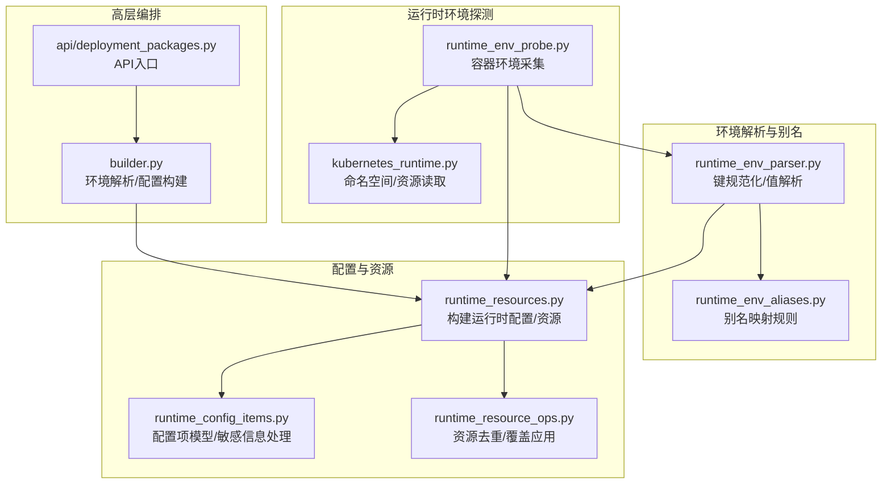
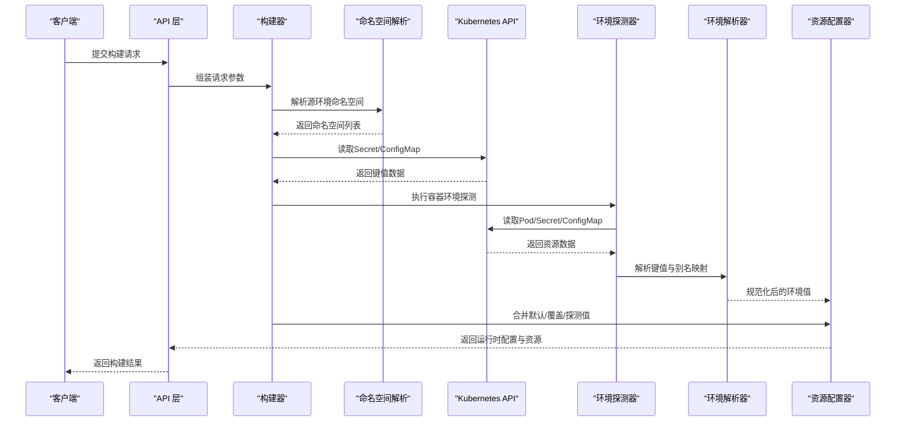
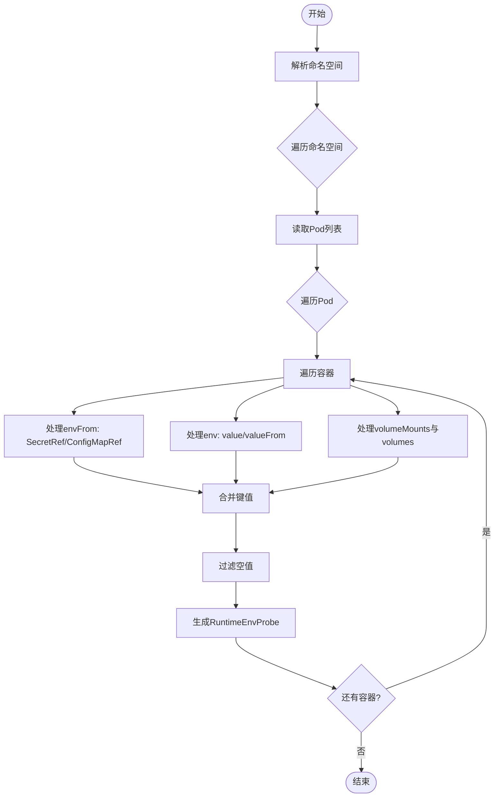
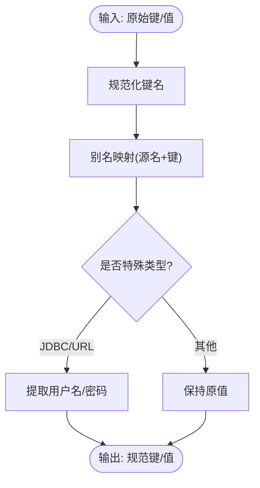
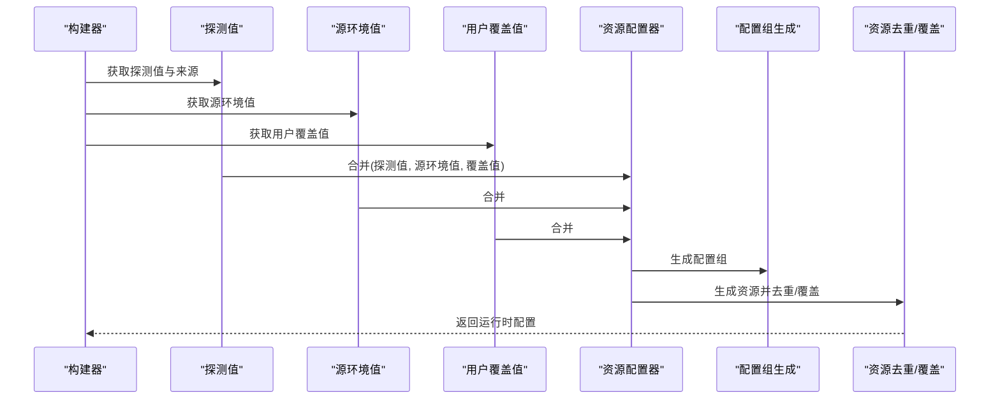
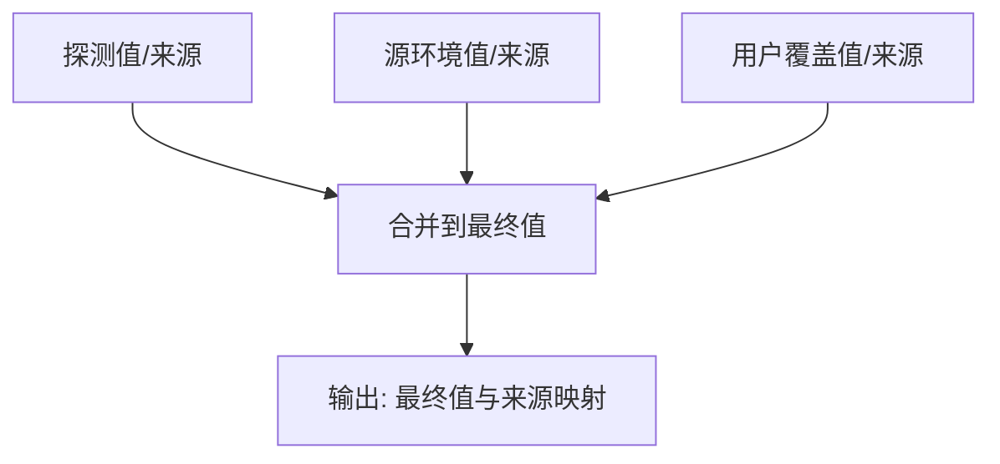
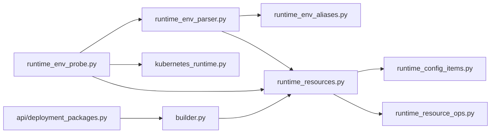

# 运行时环境管理

<cite>
**本文引用的文件**
- [runtime_env_probe.py](file://backend/deployment_package_factory/services/deployment_packages/runtime_env_probe.py)
- [runtime_env_parser.py](file://backend/deployment_package_factory/services/deployment_packages/runtime_env_parser.py)
- [runtime_env_aliases.py](file://backend/deployment_package_factory/services/deployment_packages/runtime_env_aliases.py)
- [runtime_env_values.py](file://backend/deployment_package_factory/services/deployment_packages/runtime_env_values.py)
- [runtime_resources.py](file://backend/deployment_package_factory/services/deployment_packages/runtime_resources.py)
- [runtime_config_items.py](file://backend/deployment_package_factory/services/deployment_packages/runtime_config_items.py)
- [runtime_resource_ops.py](file://backend/deployment_package_factory/services/deployment_packages/runtime_resource_ops.py)
- [models.py](file://backend/deployment_package_factory/services/deployment_packages/models.py)
- [kubernetes_runtime.py](file://backend/deployment_package_factory/services/deployment_packages/kubernetes_runtime.py)
- [builder.py](file://backend/deployment_package_factory/services/deployment_packages/builder.py)
- [deployment_packages.py](file://backend/deployment_package_factory/api/deployment_packages.py)
- [test_runtime_env_probe.py](file://backend/tests/test_runtime_env_probe.py)
</cite>

## 目录
1. [简介](#简介)
2. [项目结构](#项目结构)
3. [核心组件](#核心组件)
4. [架构总览](#架构总览)
5. [详细组件分析](#详细组件分析)
6. [依赖分析](#依赖分析)
7. [性能考量](#性能考量)
8. [故障排查指南](#故障排查指南)
9. [结论](#结论)
10. [附录](#附录)

## 简介
本技术文档围绕“部署包运行时环境管理系统”展开，聚焦于运行时环境的探测与构建、Kubernetes 秘密与配置映射的读取逻辑、环境变量解析与别名映射、配置模板处理以及配置合并策略。文档以代码级分析为基础，辅以可视化图示，帮助读者快速理解从 Kubernetes 集群中采集运行时环境、解析与归一化、生成可交付的运行时配置与资源清单的完整流程。

## 项目结构
该系统位于后端服务的部署包工厂模块中，主要涉及以下子模块：
- 运行时环境探测：从 Pod 的 env/envFrom/volumeMounts 中提取环境变量与资源引用
- 环境解析与别名映射：将不同来源与命名风格的键统一到规范名
- 资源构建与模板处理：基于中间件配置与探测结果生成运行时配置组与资源
- 配置合并与覆盖：按优先级合并来自不同来源的配置值
- Kubernetes 访问层：封装集群 API 访问与命名空间解析

图表来源
- [runtime_env_probe.py:14-39](file://backend/deployment_package_factory/services/deployment_packages/runtime_env_probe.py#L14-L39)
- [runtime_env_parser.py:10-54](file://backend/deployment_package_factory/services/deployment_packages/runtime_env_parser.py#L10-L54)
- [runtime_env_aliases.py:106-212](file://backend/deployment_package_factory/services/deployment_packages/runtime_env_aliases.py#L106-L212)
- [runtime_resources.py:25-52](file://backend/deployment_package_factory/services/deployment_packages/runtime_resources.py#L25-L52)
- [runtime_config_items.py:9-30](file://backend/deployment_package_factory/services/deployment_packages/runtime_config_items.py#L9-L30)
- [runtime_resource_ops.py:8-37](file://backend/deployment_package_factory/services/deployment_packages/runtime_resource_ops.py#L8-L37)
- [builder.py:258-292](file://backend/deployment_package_factory/services/deployment_packages/builder.py#L258-L292)
- [deployment_packages.py:147-159](file://backend/deployment_package_factory/api/deployment_packages.py#L147-L159)

章节来源
- [runtime_env_probe.py:14-166](file://backend/deployment_package_factory/services/deployment_packages/runtime_env_probe.py#L14-L166)
- [runtime_env_parser.py:10-97](file://backend/deployment_package_factory/services/deployment_packages/runtime_env_parser.py#L10-L97)
- [runtime_env_aliases.py:106-212](file://backend/deployment_package_factory/services/deployment_packages/runtime_env_aliases.py#L106-L212)
- [runtime_resources.py:25-251](file://backend/deployment_package_factory/services/deployment_packages/runtime_resources.py#L25-L251)
- [runtime_config_items.py:9-62](file://backend/deployment_package_factory/services/deployment_packages/runtime_config_items.py#L9-L62)
- [runtime_resource_ops.py:8-68](file://backend/deployment_package_factory/services/deployment_packages/runtime_resource_ops.py#L8-L68)
- [builder.py:258-292](file://backend/deployment_package_factory/services/deployment_packages/builder.py#L258-L292)
- [deployment_packages.py:147-159](file://backend/deployment_package_factory/api/deployment_packages.py#L147-L159)

## 核心组件
- 运行时环境探测器：从指定命名空间的 Pod 列表中提取容器 env/envFrom/volumeMounts，读取 Secret/ConfigMap 并解析为统一的环境键值集合
- 环境解析器：将原始键进行规范化与别名映射，支持从文本内容（properties/yml）中抽取键值
- 别名映射表：定义多源多键到规范键的映射规则，涵盖数据库、Redis、MinIO、Qdrant、IoTDB、Camunda 等
- 运行时资源配置器：根据中间件配置与探测结果生成配置组与资源清单，支持默认值回退与用户覆盖
- 资源操作器：对资源进行去重、覆盖应用与键生成
- 构建编排器：整合命名空间解析、Secret 值解析、探测与构建，输出最终运行时配置

章节来源
- [runtime_env_probe.py:14-166](file://backend/deployment_package_factory/services/deployment_packages/runtime_env_probe.py#L14-L166)
- [runtime_env_parser.py:10-97](file://backend/deployment_package_factory/services/deployment_packages/runtime_env_parser.py#L10-L97)
- [runtime_env_aliases.py:106-212](file://backend/deployment_package_factory/services/deployment_packages/runtime_env_aliases.py#L106-L212)
- [runtime_resources.py:25-251](file://backend/deployment_package_factory/services/deployment_packages/runtime_resources.py#L25-L251)
- [runtime_resource_ops.py:8-68](file://backend/deployment_package_factory/services/deployment_packages/runtime_resource_ops.py#L8-L68)
- [builder.py:258-292](file://backend/deployment_package_factory/services/deployment_packages/builder.py#L258-L292)

## 架构总览
下图展示了从 API 请求到运行时配置构建的端到端流程，包括命名空间解析、Secret/ConfigMap 读取、环境探测、解析与合并、资源构建与去重覆盖。

图表来源
- [deployment_packages.py:147-159](file://backend/deployment_package_factory/api/deployment_packages.py#L147-L159)
- [builder.py:258-292](file://backend/deployment_package_factory/services/deployment_packages/builder.py#L258-L292)
- [kubernetes_runtime.py:44-62](file://backend/deployment_package_factory/services/deployment_packages/kubernetes_runtime.py#L44-L62)
- [runtime_env_probe.py:14-39](file://backend/deployment_package_factory/services/deployment_packages/runtime_env_probe.py#L14-L39)
- [runtime_env_parser.py:31-54](file://backend/deployment_package_factory/services/deployment_packages/runtime_env_parser.py#L31-L54)
- [runtime_resources.py:25-52](file://backend/deployment_package_factory/services/deployment_packages/runtime_resources.py#L25-L52)

## 详细组件分析

### 运行时环境探测器（runtime_env_probes）
职责与流程
- 输入：源环境标识、业务命名空间列表、命名空间解析器、Pod/Secret/ConfigMap 读取器
- 输出：每个容器对应的运行时环境探测对象（包含服务键、容器名、环境字典）

关键点
- 命名空间解析兼容单参与双参签名
- 遍历 Pod 容器，分别处理 envFrom（SecretRef/ConfigMapRef）、env.value、env.valueFrom（SecretKeyRef/ConfigMapKeyRef）
- 处理卷挂载场景：根据 volumeMounts 与 volumes 映射，仅读取被挂载的键或路径键
- 支持从文本内容中解析键值（如 properties/yml），并进行别名映射
- 过滤空值，确保只保留有效环境变量

图表来源
- [runtime_env_probe.py:14-39](file://backend/deployment_package_factory/services/deployment_packages/runtime_env_probe.py#L14-L39)
- [runtime_env_probe.py:49-100](file://backend/deployment_package_factory/services/deployment_packages/runtime_env_probe.py#L49-L100)
- [runtime_env_probe.py:102-156](file://backend/deployment_package_factory/services/deployment_packages/runtime_env_probe.py#L102-L156)

章节来源
- [runtime_env_probe.py:14-166](file://backend/deployment_package_factory/services/deployment_packages/runtime_env_probe.py#L14-L166)

### 环境解析与别名映射（runtime_env_parser 与 runtime_env_aliases）
职责与流程
- 键规范化：将输入键转换为大写、替换非字母数字字符为下划线，统一命名风格
- 别名映射：依据源名称与键名，将通用键映射到规范键（如 DATABASE_URL、REDIS_PASSWORD 等）
- 文本解析：支持 properties（= 或 : 分隔）与 YAML（扁平化）两种格式，递归提取键值
- 特殊处理：对 JDBC/URL 类型自动提取用户名与密码，注入对应规范键

图表来源
- [runtime_env_parser.py:57-64](file://backend/deployment_package_factory/services/deployment_packages/runtime_env_parser.py#L57-L64)
- [runtime_env_aliases.py:112-124](file://backend/deployment_package_factory/services/deployment_packages/runtime_env_aliases.py#L112-L124)
- [runtime_env_parser.py:94-97](file://backend/deployment_package_factory/services/deployment_packages/runtime_env_parser.py#L94-L97)

章节来源
- [runtime_env_parser.py:10-97](file://backend/deployment_package_factory/services/deployment_packages/runtime_env_parser.py#L10-L97)
- [runtime_env_aliases.py:106-212](file://backend/deployment_package_factory/services/deployment_packages/runtime_env_aliases.py#L106-L212)

### 运行时资源配置与模板处理（runtime_resources）
职责与流程
- 构建运行时配置：合并探测值、源环境值与用户覆盖值；探测数据库/桶/集合资源；去重与应用覆盖
- 配置组生成：依据中间件配置中的 envTemplate，将规范键值映射为配置项
- 资源探测与默认回退：数据库 DSN 解析与 schema 推断、桶与集合名称提取
- 公开配置输出：对敏感值进行遮蔽控制

图表来源
- [runtime_resources.py:25-52](file://backend/deployment_package_factory/services/deployment_packages/runtime_resources.py#L25-L52)
- [runtime_resources.py:82-92](file://backend/deployment_package_factory/services/deployment_packages/runtime_resources.py#L82-L92)
- [runtime_resource_ops.py:8-37](file://backend/deployment_package_factory/services/deployment_packages/runtime_resource_ops.py#L8-L37)

章节来源
- [runtime_resources.py:25-251](file://backend/deployment_package_factory/services/deployment_packages/runtime_resources.py#L25-L251)
- [runtime_resource_ops.py:8-68](file://backend/deployment_package_factory/services/deployment_packages/runtime_resource_ops.py#L8-L68)
- [runtime_config_items.py:9-62](file://backend/deployment_package_factory/services/deployment_packages/runtime_config_items.py#L9-L62)

### 配置合并策略（runtime_env_values）
合并顺序与优先级
- 探测值：来自 Pod 环境的初始值，标记来源为 pod-env
- 源环境值：来自源 Secret 的值，若为已解析值则标记为 source-secret，否则为 catalog
- 用户覆盖值：来自请求的覆盖项，标记为 user

图表来源
- [runtime_env_values.py:10-37](file://backend/deployment_package_factory/services/deployment_packages/runtime_env_values.py#L10-L37)

章节来源
- [runtime_env_values.py:10-42](file://backend/deployment_package_factory/services/deployment_packages/runtime_env_values.py#L10-L42)

### Kubernetes 访问与命名空间解析（kubernetes_runtime）
- 命名空间解析：支持通过环境变量、标签选择器与标准命名空间规则推导
- Secret/ConfigMap 读取：Base64 解码与二进制数据处理
- 业务平台注册：基于命名空间标签与注解的业务平台登记与查询

章节来源
- [kubernetes_runtime.py:44-62](file://backend/deployment_package_factory/services/deployment_packages/kubernetes_runtime.py#L44-L62)
- [kubernetes_runtime.py:206-244](file://backend/deployment_package_factory/services/deployment_packages/kubernetes_runtime.py#L206-L244)
- [kubernetes_runtime.py:77-95](file://backend/deployment_package_factory/services/deployment_packages/kubernetes_runtime.py#L77-L95)

### 构建编排（builder 与 api）
- API 层接收请求，调用构建器
- 构建器解析命名空间与 Secret，执行环境探测，调用资源配置器生成运行时配置
- 将最终配置与运行时环境合并，返回给 API 层

章节来源
- [deployment_packages.py:147-159](file://backend/deployment_package_factory/api/deployment_packages.py#L147-L159)
- [builder.py:258-292](file://backend/deployment_package_factory/services/deployment_packages/builder.py#L258-L292)

## 依赖分析
- 组件内聚性：探测器与解析器耦合度低，解析器与别名映射独立，资源配置器依赖解析器与资源操作器
- 外部依赖：Kubernetes API 访问、环境变量与 Secret 缓存
- 可能的循环依赖：未发现直接循环；各模块通过函数接口交互

图表来源
- [runtime_env_probe.py:5-6](file://backend/deployment_package_factory/services/deployment_packages/runtime_env_probe.py#L5-L6)
- [runtime_env_parser.py:7](file://backend/deployment_package_factory/services/deployment_packages/runtime_env_parser.py#L7)
- [runtime_resources.py:8-10](file://backend/deployment_package_factory/services/deployment_packages/runtime_resources.py#L8-L10)
- [runtime_config_items.py:3](file://backend/deployment_package_factory/services/deployment_packages/runtime_config_items.py#L3)
- [runtime_resource_ops.py:5](file://backend/deployment_package_factory/services/deployment_packages/runtime_resource_ops.py#L5)
- [builder.py:6-13](file://backend/deployment_package_factory/services/deployment_packages/builder.py#L6-L13)
- [deployment_packages.py:14](file://backend/deployment_package_factory/api/deployment_packages.py#L14)

章节来源
- [runtime_env_probe.py:5-6](file://backend/deployment_package_factory/services/deployment_packages/runtime_env_probe.py#L5-L6)
- [runtime_env_parser.py:7](file://backend/deployment_package_factory/services/deployment_packages/runtime_env_parser.py#L7)
- [runtime_resources.py:8-10](file://backend/deployment_package_factory/services/deployment_packages/runtime_resources.py#L8-L10)
- [runtime_config_items.py:3](file://backend/deployment_package_factory/services/deployment_packages/runtime_config_items.py#L3)
- [runtime_resource_ops.py:5](file://backend/deployment_package_factory/services/deployment_packages/runtime_resource_ops.py#L5)
- [builder.py:6-13](file://backend/deployment_package_factory/services/deployment_packages/builder.py#L6-L13)
- [deployment_packages.py:14](file://backend/deployment_package_factory/api/deployment_packages.py#L14)

## 性能考量
- Secret 缓存：在一次构建过程中对相同命名空间+Secret 的读取结果进行缓存，避免重复访问
- 去重与排序：资源去重按 key 合并使用方与审查需求，排序保证输出稳定
- 覆盖应用：仅对可编辑项应用用户覆盖，减少不必要的写入
- 命名空间解析：优先使用显式配置与标签选择器，降低全量扫描成本

章节来源
- [builder.py:318-319](file://backend/deployment_package_factory/services/deployment_packages/builder.py#L318-L319)
- [runtime_resource_ops.py:8-22](file://backend/deployment_package_factory/services/deployment_packages/runtime_resource_ops.py#L8-L22)
- [runtime_resource_ops.py:25-37](file://backend/deployment_package_factory/services/deployment_packages/runtime_resource_ops.py#L25-L37)

## 故障排查指南
常见问题与定位
- 环境变量未生效
  - 检查命名空间解析是否正确，确认 Pod 是否存在于目标命名空间
  - 检查 envFrom/env.valueFrom 引用的 Secret/ConfigMap 名称与键是否存在
  - 确认别名映射是否将通用键映射到规范键
- 数据库 DSN 解析失败
  - 确认 DATABASE_URL/DATABASE_SCHEMA 等键存在且格式正确
  - 若使用 JDBC 前缀，确认解析器已去除前缀并正确提取凭据
- 资源冲突或覆盖异常
  - 检查资源去重逻辑与覆盖应用逻辑，确认覆盖键命名规则
  - 确认敏感值在公开配置中的遮蔽行为符合预期

章节来源
- [test_runtime_env_probe.py:6-54](file://backend/tests/test_runtime_env_probe.py#L6-L54)
- [test_runtime_env_probe.py:77-130](file://backend/tests/test_runtime_env_probe.py#L77-L130)
- [test_runtime_env_probe.py:132-174](file://backend/tests/test_runtime_env_probe.py#L132-L174)
- [test_runtime_env_probe.py:176-215](file://backend/tests/test_runtime_env_probe.py#L176-L215)
- [test_runtime_env_probe.py:217-292](file://backend/tests/test_runtime_env_probe.py#L217-L292)

## 结论
该运行时环境管理系统通过“探测—解析—合并—构建”的流水线，实现了对 Kubernetes 环境中多源配置的统一采集与标准化输出。其设计强调可扩展的别名映射、稳定的资源去重与覆盖策略，以及对敏感信息的可控处理。结合测试用例与 API/构建器的集成，系统能够可靠地支撑部署包的生成与交付。

## 附录

### 实际使用示例（步骤说明）
- 在 API 层提交构建请求，包含源环境、业务服务与覆盖配置
- 构建器解析命名空间与 Secret，执行环境探测
- 资源配置器根据中间件模板生成配置组与资源
- 对资源进行去重与覆盖应用，输出运行时配置

章节来源
- [deployment_packages.py:147-159](file://backend/deployment_package_factory/api/deployment_packages.py#L147-L159)
- [builder.py:258-292](file://backend/deployment_package_factory/services/deployment_packages/builder.py#L258-L292)